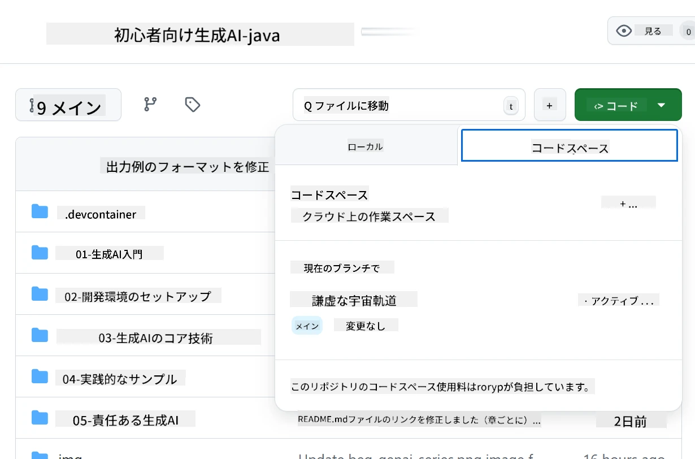
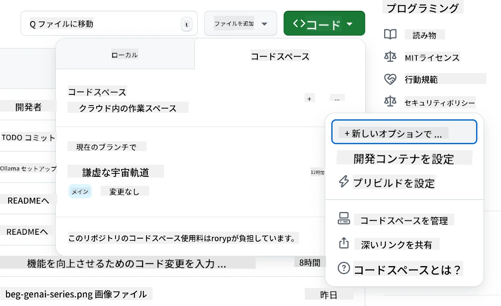
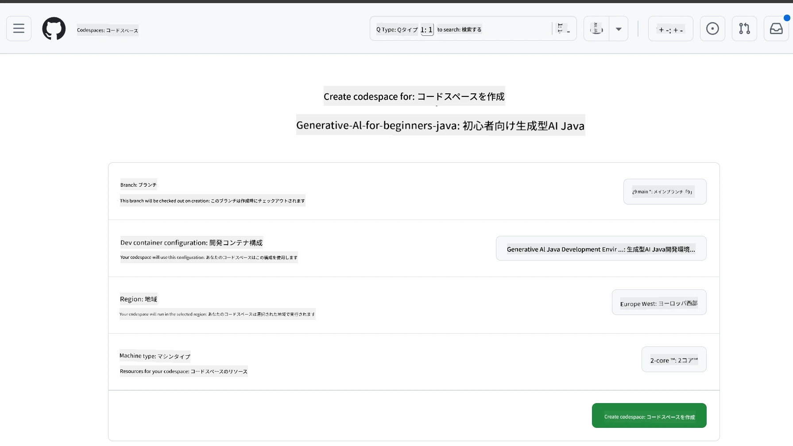
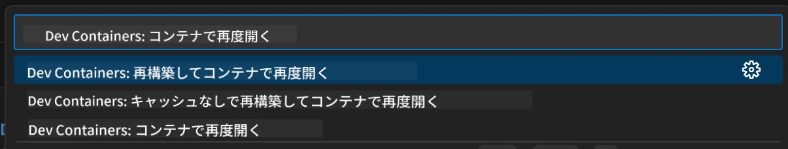
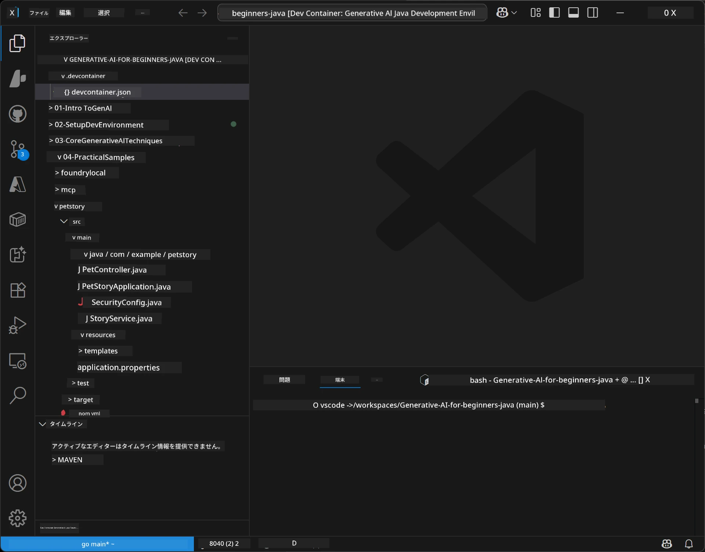
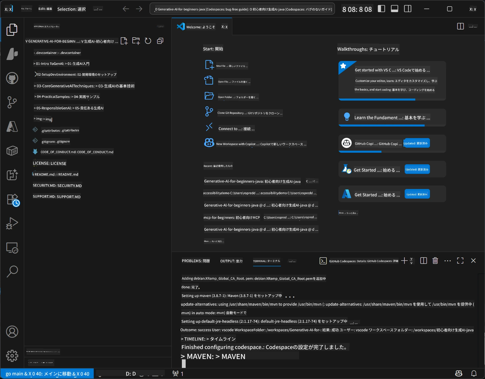

# Java向け生成AIの開発環境のセットアップ

> **クイックスタート**: 2分でクラウドでコーディング - [GitHub Codespacesセットアップ](../../../02-SetupDevEnvironment)へジャンプ - ローカルインストール不要でGitHubモデルを利用！

> **Azure OpenAIに興味がありますか？** 新しいAzure OpenAIリソースの作成手順については、[Azure OpenAIセットアップガイド](getting-started-azure-openai.md)をご覧ください。

## 学べること

- AIアプリケーション用のJava開発環境のセットアップ
- お好みの開発環境の選択と設定（Codespacesでのクラウドファースト、ローカルの開発コンテナ、もしくは完全なローカルセットアップ）
- GitHubモデルへの接続テスト

## 目次

- [学べること](../../../02-SetupDevEnvironment)
- [紹介](../../../02-SetupDevEnvironment)
- [ステップ1: 開発環境のセットアップ](../../../02-SetupDevEnvironment)
  - [オプションA: GitHub Codespaces（推奨）](../../../02-SetupDevEnvironment)
  - [オプションB: ローカル開発コンテナ](../../../02-SetupDevEnvironment)
  - [オプションC: 既存のローカルインストールを使う](../../../02-SetupDevEnvironment)
- [ステップ2: GitHub個人アクセストークンの作成](../../../02-SetupDevEnvironment)
- [ステップ3: セットアップのテスト](../../../02-SetupDevEnvironment)
- [トラブルシューティング](../../../02-SetupDevEnvironment)
- [まとめ](../../../02-SetupDevEnvironment)
- [次のステップ](../../../02-SetupDevEnvironment)

## 紹介

この章では開発環境のセットアップ方法について説明します。主な例として **GitHub Models** を使用します。無料でGitHubアカウントだけで簡単にセットアップでき、クレジットカード不要で複数のモデルにアクセスして試すことができるためです。

**ローカルセットアップは不要！** GitHub Codespacesを使えばブラウザ上にフル開発環境が準備され、すぐにコーディングを始められます。


このコースでは [**GitHub Models**](https://github.com/marketplace?type=models) の利用を推奨します。理由は：
- **無料**で開始可能
- GitHubアカウントのみで**簡単**にセットアップできる
- **クレジットカード不要**
- 複数のモデルを**試せる**

> **注意**: このトレーニングで使うGitHub Modelsの無料制限：
> - 1分あたり15リクエスト（1日150リクエスト）
> - 1リクエストあたり約8,000語入力、約4,000語出力
> - 同時リクエスト数5件
> 
> 本番用途の場合はAzure AI Foundry Modelsにアップグレードしてください。コードの変更は不要です。[Azure AI Foundryのドキュメント](https://learn.microsoft.com/azure/ai-foundry/foundry-models/how-to/quickstart-github-models)を参照。

## ステップ1: 開発環境のセットアップ

<a name="quick-start-cloud"></a>

このJava向け生成AIコースのために必要なツールをすべて備えた事前構成済みの開発コンテナを用意しました。お好みの開発方法を選択してください。

### 環境セットアップオプション

#### オプションA: GitHub Codespaces（推奨）

**ローカルセットアップ不要で2分でコーディング開始！**

1. このリポジトリをGitHubアカウントにフォークする
   > **注意**: 基本設定を編集する場合は[開発コンテナ設定](../../../.devcontainer/devcontainer.json)を参照してください
2. **Code** → **Codespaces**タブ → **...** → **New with options...** をクリック
3. デフォルト設定を使うと、コース専用の **生成AI Java開発環境** devcontainer設定が選択される
4. **Create codespace** をクリック
5. ~2分待って環境が準備されるのを待つ
6. [ステップ2: GitHubトークンの作成](../../../02-SetupDevEnvironment)へ進む








> **Codespacesの利点**:
> - ローカルインストール不要
> - ブラウザが使えるどのデバイスでも動作
> - 必要なツールと依存関係が事前セットアップ済み
> - 個人アカウントは月60時間無料
> - すべての受講者で一貫した環境を提供

#### オプションB: ローカル開発コンテナ

**Dockerによるローカル開発を好む方向け**

1. このリポジトリをフォークしてローカルにクローンする
   > **注意**: 基本設定を編集する場合は[開発コンテナ設定](../../../.devcontainer/devcontainer.json)を参照してください
2. [Docker Desktop](https://www.docker.com/products/docker-desktop/)と[VS Code](https://code.visualstudio.com/)をインストール
3. VS Codeに[Dev Containers拡張機能](https://marketplace.visualstudio.com/items?itemName=ms-vscode-remote.remote-containers)をインストール
4. リポジトリフォルダーをVS Codeで開く
5. プロンプトが表示されたら**Reopen in Container**をクリック（または`Ctrl+Shift+P` → 「Dev Containers: Reopen in Container」）
6. コンテナのビルド・起動が完了するのを待つ
7. [ステップ2: GitHubトークンの作成](../../../02-SetupDevEnvironment)へ進む





#### オプションC: 既存のローカルインストールを使う

**すでにJava環境がある開発者向け**

前提条件：
- [Java 21+](https://www.oracle.com/java/technologies/javase/jdk21-archive-downloads.html)
- [Maven 3.9+](https://maven.apache.org/download.cgi)
- [VS Code](https://code.visualstudio.com) またはお好みのIDE

手順：
1. このリポジトリをローカルにクローン
2. IDEでプロジェクトを開く
3. [ステップ2: GitHubトークンの作成](../../../02-SetupDevEnvironment)へ進む

> **プロのヒント**: 低スペックマシンでローカルにVS Codeを使いたい場合は、GitHub Codespacesを利用しましょう。ローカルのVS CodeからクラウドホストされたCodespaceに接続でき、最良の環境が得られます。




## ステップ2: GitHub個人アクセストークンの作成

1. [GitHub設定](https://github.com/settings/profile)にアクセスし、プロフィールメニューから**Settings**を選択。
2. 左サイドバーの下部付近にある**Developer settings**をクリック。
3. **Personal access tokens**の下の**Fine-grained tokens**をクリック（またはこの直接リンクを利用：[https://github.com/settings/personal-access-tokens](https://github.com/settings/personal-access-tokens)）。
4. **Generate new token**をクリック。
5. 「Token name」に分かりやすい名前を付ける（例：`GenAI-Java-Course-Token`）。
6. 有効期限を設定（推奨：セキュリティのため7日間）。
7. 「Resource owner」はご自身のユーザーアカウントを選択。
8. 「Repository access」でGitHub Modelsで使いたいリポジトリ、または「All repositories」を選ぶ。
9. 「Account permissions」で**Models**を探し、**Read-only**に設定。
10. **Generate token**をクリック。
11. 作成されたトークンを**必ずコピーし保存**してください。後で再度表示されません！

> **セキュリティのヒント**: アクセストークンは最低限必要な権限と最短の有効期限を設定しましょう。

## ステップ3: GitHubモデルの例でセットアップをテスト

開発環境が準備できたら、[`02-SetupDevEnvironment/examples/github-models`](../../../02-SetupDevEnvironment/examples/github-models) の例でGitHub Models連携を試してみましょう。

1. 開発環境のターミナルを開く。
2. GitHub Modelsのサンプルディレクトリへ移動：
   ```bash
   cd 02-SetupDevEnvironment/examples/github-models
   ```
3. 環境変数にGitHubトークンを設定：
   ```bash
   # macOS/Linux
   export GITHUB_TOKEN=your_token_here
   
   # Windows（コマンドプロンプト）
   set GITHUB_TOKEN=your_token_here
   
   # Windows（PowerShell）
   $env:GITHUB_TOKEN="your_token_here"
   ```

4. アプリケーションを実行：
   ```bash
   mvn compile exec:java -Dexec.mainClass="com.example.githubmodels.App"
   ```

以下のような出力が表示されるはずです：
```text
Using model: gpt-4.1-nano
Sending request to GitHub Models...
Response: Hello World!
```

### 例のコードの理解

まず、実行した内容を理解しましょう。`examples/github-models`内の例はOpenAI Java SDKを使いGitHub Modelsに接続しています。

**このコードの動作：**
- 個人アクセストークンを使ってGitHub Modelsに**接続**
- AIモデルに「Say Hello World!」という単純なメッセージを**送信**
- AIの応答を**受信**して表示
- セットアップが正しく機能しているか**検証**

**重要な依存関係**（`pom.xml`内）：
```xml
<dependency>
    <groupId>com.openai</groupId>
    <artifactId>openai-java</artifactId>
    <version>2.12.0</version>
</dependency>
```

**メインコード**（`App.java`）：
```java
// OpenAI Java SDKを使用してGitHubモデルに接続する
OpenAIClient client = OpenAIOkHttpClient.builder()
    .apiKey(pat)
    .baseUrl("https://models.inference.ai.azure.com")
    .build();

// チャット補完リクエストを作成する
ChatCompletionCreateParams params = ChatCompletionCreateParams.builder()
    .model(modelId)
    .addSystemMessage("You are a concise assistant.")
    .addUserMessage("Say Hello World!")
    .build();

// AIの応答を取得する
ChatCompletion response = client.chat().completions().create(params);
System.out.println("Response: " + response.choices().get(0).message().content().orElse("No response content"));
```

## まとめ

お疲れさまでした！これで以下が完了しています：

- AIモデルアクセスのための適切なGitHub個人アクセストークン作成
- Java開発環境の構築（Codespaces、開発コンテナ、ローカルどれでもOK）
- OpenAI Java SDKでGitHub Modelsに接続し無料でAI開発可能
- シンプルな例でAIモデルと通信し動作確認済み

## 次のステップ

[第3章: コアとなる生成AI技術](../03-CoreGenerativeAITechniques/README.md)

## トラブルシューティング

問題が発生したら、よくある問題と解決策はこちら：

- **トークンが動作しない？**  
  - トークンを余計なスペースなしで正確にコピーしたか確認  
  - 環境変数に正しく設定されているか再確認  
  - トークンに正しい権限（Models: Read-only）があるかチェック  

- **Mavenが見つからない？**  
  - devコンテナやCodespacesならMavenは事前インストール済み  
  - ローカルセットアップの場合はJava 21+とMaven 3.9+がインストール済みか確認  
  - `mvn --version`でバージョン確認  

- **接続に問題？**  
  - インターネット接続を確認  
  - GitHubへアクセス可能かネットワークをチェック  
  - GitHub Modelsエンドポイントをブロックするファイアウォールがないか確認  

- **Devコンテナが起動しない？**  
  - Docker Desktopが起動しているか確認（ローカル開発時）  
  - コンテナの再ビルドを試す：`Ctrl+Shift+P` → 「Dev Containers: Rebuild Container」  

- **アプリケーションのコンパイルエラー？**  
  - ディレクトリが正しいか確認：`02-SetupDevEnvironment/examples/github-models`  
  - クリーン＆ビルドを試す：`mvn clean compile`  

> **ヘルプが必要ですか？**：問題が解決しない場合はリポジトリにIssueを開いてください。サポートします。

---

<!-- CO-OP TRANSLATOR DISCLAIMER START -->
**免責事項**：  
本書類はAI翻訳サービス「Co-op Translator」（https://github.com/Azure/co-op-translator）を使用して翻訳されました。正確性を期しておりますが、自動翻訳には誤りや不正確な箇所が含まれる可能性があることをご了承ください。原文の言語による文書が正式な情報源とみなされます。重要な内容については、専門の人間による翻訳を推奨します。本翻訳の利用による誤解や誤訳に関して当方は一切の責任を負いかねます。
<!-- CO-OP TRANSLATOR DISCLAIMER END -->