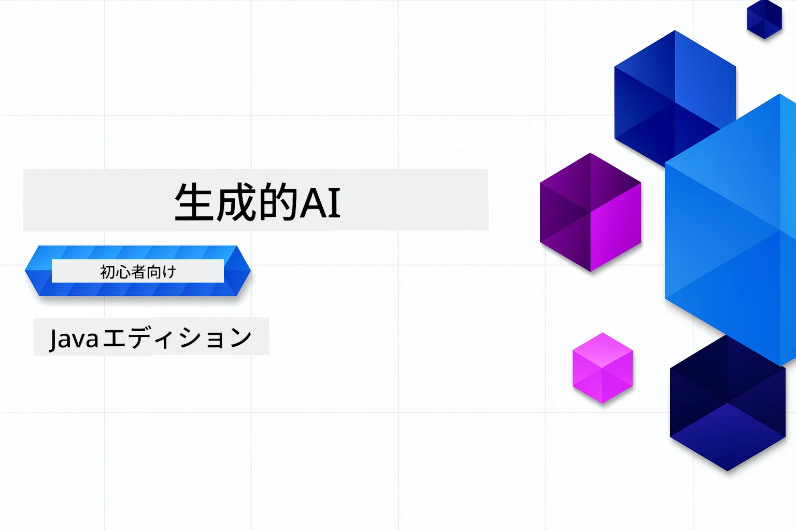

# 初心者向け生成AI - Java版
[](https://discord.gg/nTYy5BXMWG)



**所要時間**: ワークショップ全体はオンラインで完了可能で、ローカルセットアップ不要です。環境設定は2分、サンプルの探索は深さによって1～3時間かかります。

> **クイックスタート** 

1. このリポジトリをGitHubアカウントにフォーク
2. **Code** → **Codespaces** タブ → **...** → **New with options...** をクリック
3. デフォルト設定を使用 — 本コース用に作成された開発コンテナが選択されます
4. **Create codespace** をクリック
5. 環境が準備されるまで約2分待つ
6. 直接 [最初の例](./02-SetupDevEnvironment/README.md#step-2-create-a-github-personal-access-token) に進む

> **ローカルでクローンしたい場合？**
>
> このリポジトリは50以上の言語翻訳を含むため、ダウンロードサイズが大きくなります。翻訳を除いてクローンするにはスパースチェックアウトを使用してください：
> ```bash
> git clone --filter=blob:none --sparse https://github.com/microsoft/Generative-AI-for-beginners-java.git
> cd Generative-AI-for-beginners-java
> git sparse-checkout set --no-cone '/*' '!translations' '!translated_images'
> ```
> これでコースを進めるのに必要なすべてが揃い、ダウンロードもずっと速くなります。


## 多言語対応

### GitHub Actionによるサポート（自動化かつ常に最新）

<!-- CO-OP TRANSLATOR LANGUAGES TABLE START -->
[アラビア語](../ar/README.md) | [ベンガル語](../bn/README.md) | [ブルガリア語](../bg/README.md) | [ビルマ語（ミャンマー）](../my/README.md) | [中国語（簡体字）](../zh-CN/README.md) | [中国語（繁体字、香港）](../zh-HK/README.md) | [中国語（繁体字、マカオ）](../zh-MO/README.md) | [中国語（繁体字、台湾）](../zh-TW/README.md) | [クロアチア語](../hr/README.md) | [チェコ語](../cs/README.md) | [デンマーク語](../da/README.md) | [オランダ語](../nl/README.md) | [エストニア語](../et/README.md) | [フィンランド語](../fi/README.md) | [フランス語](../fr/README.md) | [ドイツ語](../de/README.md) | [ギリシャ語](../el/README.md) | [ヘブライ語](../he/README.md) | [ヒンディー語](../hi/README.md) | [ハンガリー語](../hu/README.md) | [インドネシア語](../id/README.md) | [イタリア語](../it/README.md) | [日本語](./README.md) | [カンナダ語](../kn/README.md) | [韓国語](../ko/README.md) | [リトアニア語](../lt/README.md) | [マレー語](../ms/README.md) | [マラヤーラム語](../ml/README.md) | [マラーティー語](../mr/README.md) | [ネパール語](../ne/README.md) | [ナイジェリア・ピジン](../pcm/README.md) | [ノルウェー語](../no/README.md) | [ペルシャ語（ファルシ）](../fa/README.md) | [ポーランド語](../pl/README.md) | [ポルトガル語（ブラジル）](../pt-BR/README.md) | [ポルトガル語（ポルトガル）](../pt-PT/README.md) | [パンジャブ語（グルムキー）](../pa/README.md) | [ルーマニア語](../ro/README.md) | [ロシア語](../ru/README.md) | [セルビア語（キリル）](../sr/README.md) | [スロバキア語](../sk/README.md) | [スロベニア語](../sl/README.md) | [スペイン語](../es/README.md) | [スワヒリ語](../sw/README.md) | [スウェーデン語](../sv/README.md) | [タガログ語（フィリピン）](../tl/README.md) | [タミル語](../ta/README.md) | [テルグ語](../te/README.md) | [タイ語](../th/README.md) | [トルコ語](../tr/README.md) | [ウクライナ語](../uk/README.md) | [ウルドゥー語](../ur/README.md) | [ベトナム語](../vi/README.md)

## コース構成と学習パス

### **第1章: 生成AIのイントロダクション**
- **核心概念**: 大規模言語モデル、トークン、埋め込み、AIの能力について理解する
- **Java AI エコシステム**: Spring AI と OpenAI SDKの概要
- **モデルコンテキストプロトコル**: MCPの紹介とAIエージェント間通信の役割
- **実践アプリケーション**: チャットボットやコンテンツ生成などの実例
- **[→ 第1章を始める](./01-IntroToGenAI/README.md)**

### **第2章: 開発環境のセットアップ**
- **マルチプロバイダー設定**: GitHubモデル、Azure OpenAI、OpenAI Java SDKの統合設定
- **Spring Boot + Spring AI**: エンタープライズAIアプリ開発のベストプラクティス
- **GitHubモデル**: プロトタイプ作成や学習用の無料AIモデルアクセス（クレジットカード不要）
- **開発ツール**: Dockerコンテナ、VS Code、GitHub Codespacesの設定
- **[→ 第2章を始める](./02-SetupDevEnvironment/README.md)**

### **第3章: コア生成AIテクニック**
- **プロンプトエンジニアリング**: AIモデルの応答を最適化する技術
- **埋め込みとベクトル操作**: セマンティックサーチや類似性マッチングの実装
- **検索強化生成（RAG）**: AIと自身のデータソースを組み合わせる
- **関数呼び出し**: カスタムツールやプラグインでAIの機能を拡張
- **[→ 第3章を始める](./03-CoreGenerativeAITechniques/README.md)**

### **第4章: 実践アプリケーションとプロジェクト**
- **ペットストーリー生成器** (`petstory/`): GitHubモデルでのクリエイティブコンテンツ生成
- **Foundry ローカルデモ** (`foundrylocal/`): OpenAI Java SDKによるローカルAIモデル統合
- **MCP電卓サービス** (`calculator/`): Spring AIを使った基本的なモデルコンテキストプロトコル実装
- **[→ 第4章を始める](./04-PracticalSamples/README.md)**

### **第5章: 責任あるAI開発**
- **GitHubモデルの安全性**: 組み込みのコンテンツフィルタリングと安全機能（ハードブロック＆ソフト拒否）をテスト
- **責任あるAIデモ**: 近代的なAI安全システムの実践例
- **ベストプラクティス**: 倫理的なAI開発と運用の必須ガイドライン
- **[→ 第5章を始める](./05-ResponsibleGenAI/README.md)**

## 追加リソース

<!-- CO-OP TRANSLATOR OTHER COURSES START -->
### LangChain
[](https://aka.ms/langchain4j-for-beginners)
[](https://aka.ms/langchainjs-for-beginners?WT.mc_id=m365-94501-dwahlin)
[](https://github.com/microsoft/langchain-for-beginners?WT.mc_id=m365-94501-dwahlin)
---

### Azure / Edge / MCP / エージェント
[](https://github.com/microsoft/AZD-for-beginners?WT.mc_id=academic-105485-koreyst)
[](https://github.com/microsoft/edgeai-for-beginners?WT.mc_id=academic-105485-koreyst)
[](https://github.com/microsoft/mcp-for-beginners?WT.mc_id=academic-105485-koreyst)
[](https://github.com/microsoft/ai-agents-for-beginners?WT.mc_id=academic-105485-koreyst)

---
 
### 生成AIシリーズ
[](https://github.com/microsoft/generative-ai-for-beginners?WT.mc_id=academic-105485-koreyst)
[-9333EA?style=for-the-badge&labelColor=E5E7EB&color=9333EA)](https://github.com/microsoft/Generative-AI-for-beginners-dotnet?WT.mc_id=academic-105485-koreyst)
[-C084FC?style=for-the-badge&labelColor=E5E7EB&color=C084FC)](https://github.com/microsoft/generative-ai-for-beginners-java?WT.mc_id=academic-105485-koreyst)
[-E879F9?style=for-the-badge&labelColor=E5E7EB&color=E879F9)](https://github.com/microsoft/generative-ai-with-javascript?WT.mc_id=academic-105485-koreyst)

---
 
### コア学習
[](https://aka.ms/ml-beginners?WT.mc_id=academic-105485-koreyst)
[](https://aka.ms/datascience-beginners?WT.mc_id=academic-105485-koreyst)
[](https://aka.ms/ai-beginners?WT.mc_id=academic-105485-koreyst)
[](https://github.com/microsoft/Security-101?WT.mc_id=academic-96948-sayoung)
[](https://aka.ms/webdev-beginners?WT.mc_id=academic-105485-koreyst)
[](https://aka.ms/iot-beginners?WT.mc_id=academic-105485-koreyst)
[](https://github.com/microsoft/xr-development-for-beginners?WT.mc_id=academic-105485-koreyst)

---
 
### Copilotシリーズ
[](https://aka.ms/GitHubCopilotAI?WT.mc_id=academic-105485-koreyst)
[](https://github.com/microsoft/mastering-github-copilot-for-dotnet-csharp-developers?WT.mc_id=academic-105485-koreyst)
[](https://github.com/microsoft/CopilotAdventures?WT.mc_id=academic-105485-koreyst)
<!-- CO-OP TRANSLATOR OTHER COURSES END -->

## ヘルプを得る

AIアプリの構築で困ったときや質問がある場合は、同じ学習者や経験豊富な開発者たちとMCPのディスカッションに参加してください。質問が歓迎され、知識が自由に共有されるサポートコミュニティです。

[](https://discord.gg/nTYy5BXMWG)

製品のフィードバックや構築中のエラーがある場合は、以下をご覧ください：

[](https://aka.ms/foundry/forum)

---

<!-- CO-OP TRANSLATOR DISCLAIMER START -->
**免責事項**：  
本書類はAI翻訳サービス[Co-op Translator](https://github.com/Azure/co-op-translator)を使用して翻訳されています。正確性の確保に努めておりますが、自動翻訳には誤りや不正確な箇所が含まれる可能性があることをご承知ください。原文の母国語版が正式な情報源とみなされます。重要な情報については専門の人間翻訳をご利用いただくことを推奨します。本翻訳の使用により生じた誤解や解釈の相違について、当方は一切の責任を負いかねます。
<!-- CO-OP TRANSLATOR DISCLAIMER END -->