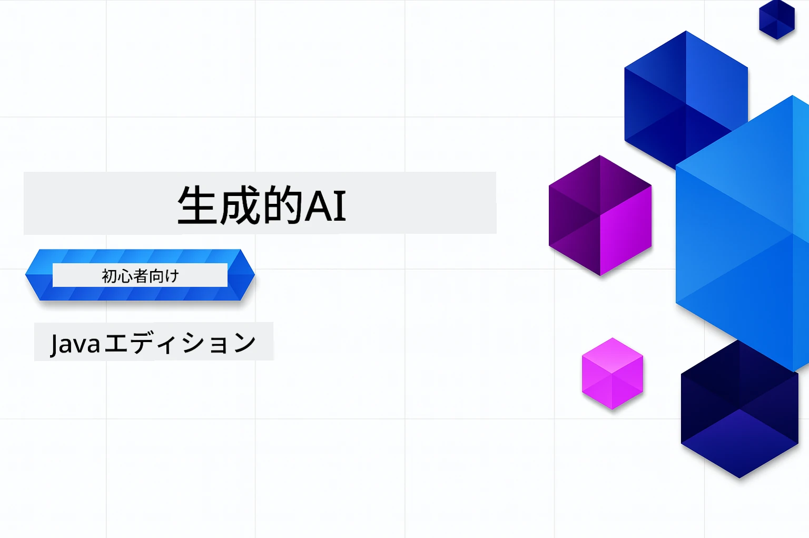

# 初心者向けジェネレーティブAI - Java版
[](https://discord.gg/nTYy5BXMWG)



<strong>所要時間</strong>: ワークショップ全体はローカルセットアップ不要でオンラインで完了可能です。環境セットアップは2分、サンプル探索は探索の深さにより1～3時間かかります。

> <strong>クイックスタート</strong>

1. このリポジトリをあなたのGitHubアカウントにフォークしてください
2. **Code** → **Codespaces** タブ → **...** → **新規オプション付きで作成...** をクリック
3. デフォルト設定を使用 – これによりこのコース用の開発コンテナが選択されます
4. **Create codespace** をクリック
5. 環境の準備ができるまで約2分待ちます
6. 直接 [最初の例](./02-SetupDevEnvironment/README.md#step-2-create-a-github-personal-access-token) に進みます

## マルチ言語対応

### GitHub Action経由でサポート（自動＆常に最新）

<!-- CO-OP TRANSLATOR LANGUAGES TABLE START -->
[アラビア語](../ar/README.md) | [ベンガル語](../bn/README.md) | [ブルガリア語](../bg/README.md) | [ビルマ語（ミャンマー）](../my/README.md) | [中国語（簡体字）](../zh-CN/README.md) | [中国語（繁体字、香港）](../zh-HK/README.md) | [中国語（繁体字、マカオ）](../zh-MO/README.md) | [中国語（繁体字、台湾）](../zh-TW/README.md) | [クロアチア語](../hr/README.md) | [チェコ語](../cs/README.md) | [デンマーク語](../da/README.md) | [オランダ語](../nl/README.md) | [エストニア語](../et/README.md) | [フィンランド語](../fi/README.md) | [フランス語](../fr/README.md) | [ドイツ語](../de/README.md) | [ギリシャ語](../el/README.md) | [ヘブライ語](../he/README.md) | [ヒンディー語](../hi/README.md) | [ハンガリー語](../hu/README.md) | [インドネシア語](../id/README.md) | [イタリア語](../it/README.md) | [日本語](./README.md) | [カンナダ語](../kn/README.md) | [クメール語](../km/README.md) | [韓国語](../ko/README.md) | [リトアニア語](../lt/README.md) | [マレー語](../ms/README.md) | [マラヤーラム語](../ml/README.md) | [マラーティー語](../mr/README.md) | [ネパール語](../ne/README.md) | [ナイジェリア・ピジン語](../pcm/README.md) | [ノルウェー語](../no/README.md) | [ペルシャ語 (ファルシー)](../fa/README.md) | [ポーランド語](../pl/README.md) | [ポルトガル語（ブラジル）](../pt-BR/README.md) | [ポルトガル語（ポルトガル）](../pt-PT/README.md) | [パンジャブ語（グルムキー）](../pa/README.md) | [ルーマニア語](../ro/README.md) | [ロシア語](../ru/README.md) | [セルビア語（キリル文字）](../sr/README.md) | [スロバキア語](../sk/README.md) | [スロベニア語](../sl/README.md) | [スペイン語](../es/README.md) | [スワヒリ語](../sw/README.md) | [スウェーデン語](../sv/README.md) | [タガログ語（フィリピン語）](../tl/README.md) | [タミル語](../ta/README.md) | [テルグ語](../te/README.md) | [タイ語](../th/README.md) | [トルコ語](../tr/README.md) | [ウクライナ語](../uk/README.md) | [ウルドゥー語](../ur/README.md) | [ベトナム語](../vi/README.md)

> **ローカルでのクローンを希望ですか？**
>
> このリポジトリには50以上の言語翻訳が含まれており、ダウンロードサイズが大幅に増加します。翻訳なしでクローンするにはスパースチェックアウトを使用してください：
>
> **Bash / macOS / Linux:**
> ```bash
> git clone --filter=blob:none --sparse https://github.com/microsoft/Generative-AI-for-beginners-java.git
> cd Generative-AI-for-beginners-java
> git sparse-checkout set --no-cone '/*' '!translations' '!translated_images'
> ```
>
> **CMD（Windows）:**
> ```cmd
> git clone --filter=blob:none --sparse https://github.com/microsoft/Generative-AI-for-beginners-java.git
> cd Generative-AI-for-beginners-java
> git sparse-checkout set --no-cone "/*" "!translations" "!translated_images"
> ```
>
> これでコースを完了するのに必要なものがすべて揃い、より高速にダウンロードできます。
<!-- CO-OP TRANSLATOR LANGUAGES TABLE END -->

## コース構成と学習パス

### **第1章：ジェネレーティブAIのイントロダクション**
- <strong>基本概念</strong>: 大規模言語モデル、トークン、埋め込み（embeddings）、AIの能力を理解する
- **Java AIエコシステム**: Spring AIとOpenAI SDKの概要
- <strong>モデルコンテキストプロトコル</strong>: MCPの紹介とAIエージェント間コミュニケーションでの役割
- <strong>実践応用例</strong>: チャットボットやコンテンツ生成などの実世界シナリオ
- **[→ 第1章を開始](./01-IntroToGenAI/README.md)**

### **第2章：開発環境のセットアップ**
- <strong>マルチプロバイダー構成</strong>: GitHub Models、Azure OpenAI、OpenAI Java SDKの統合設定
- **Spring Boot + Spring AI**: エンタープライズ向けAIアプリケーション開発のベストプラクティス
- **GitHub Models**: プロトタイピングと学習のための無料AIモデルアクセス（クレジットカード不要）
- <strong>開発ツール</strong>: Dockerコンテナ、VS Code、GitHub Codespacesの設定
- **[→ 第2章を開始](./02-SetupDevEnvironment/README.md)**

### **第3章：コアとなるジェネレーティブAI技術**
- <strong>プロンプトエンジニアリング</strong>: AIモデルから最適な応答を得る技術
- <strong>埋め込みとベクトル操作</strong>: セマンティック検索と類似度マッチングの実装
- **リトリーバル拡張生成（RAG）**: AIと独自データソースの組み合わせ
- <strong>関数呼び出し</strong>: カスタムツールやプラグインでAIの機能拡張
- **[→ 第3章を開始](./03-CoreGenerativeAITechniques/README.md)**

### **第4章：実践的な応用とプロジェクト**
- <strong>ペットストーリー生成器</strong> (`petstory/`): GitHub Modelsを使ったクリエイティブコンテンツ生成
- **Foundryローカルデモ** (`foundrylocal/`): OpenAI Java SDKとのローカルAIモデル統合
- **MCP電卓サービス** (`calculator/`): Spring AIを用いた基本的なモデルコンテキストプロトコル実装
- **[→ 第4章を開始](./04-PracticalSamples/README.md)**

### **第5章：責任あるAI開発**
- **GitHub Modelsの安全性**: 内蔵のコンテンツフィルタリングと安全機能（ハードブロックやソフト拒否）をテスト
- **責任あるAIデモ**: 現代AI安全システムが実際にどのように動作するかのハンズオン例
- <strong>ベストプラクティス</strong>: 倫理的なAI開発と展開のための必須ガイドライン
- **[→ 第5章を開始](./05-ResponsibleGenAI/README.md)**

## 追加リソース

<!-- CO-OP TRANSLATOR OTHER COURSES START -->
### LangChain
[](https://aka.ms/langchain4j-for-beginners)
[](https://aka.ms/langchainjs-for-beginners?WT.mc_id=m365-94501-dwahlin)
[](https://github.com/microsoft/langchain-for-beginners?WT.mc_id=m365-94501-dwahlin)
---

### Azure / Edge / MCP / Agents
[](https://github.com/microsoft/AZD-for-beginners?WT.mc_id=academic-105485-koreyst)
[](https://github.com/microsoft/edgeai-for-beginners?WT.mc_id=academic-105485-koreyst)
[](https://github.com/microsoft/mcp-for-beginners?WT.mc_id=academic-105485-koreyst)
[](https://github.com/microsoft/ai-agents-for-beginners?WT.mc_id=academic-105485-koreyst)

---

### ジェネレーティブAIシリーズ
[](https://github.com/microsoft/generative-ai-for-beginners?WT.mc_id=academic-105485-koreyst)
[-9333EA?style=for-the-badge&labelColor=E5E7EB&color=9333EA)](https://github.com/microsoft/Generative-AI-for-beginners-dotnet?WT.mc_id=academic-105485-koreyst)
[-C084FC?style=for-the-badge&labelColor=E5E7EB&color=C084FC)](https://github.com/microsoft/generative-ai-for-beginners-java?WT.mc_id=academic-105485-koreyst)
[-E879F9?style=for-the-badge&labelColor=E5E7EB&color=E879F9)](https://github.com/microsoft/generative-ai-with-javascript?WT.mc_id=academic-105485-koreyst)

---

### コア学習
[](https://aka.ms/ml-beginners?WT.mc_id=academic-105485-koreyst)
[](https://aka.ms/datascience-beginners?WT.mc_id=academic-105485-koreyst)
[](https://aka.ms/ai-beginners?WT.mc_id=academic-105485-koreyst)
[](https://github.com/microsoft/Security-101?WT.mc_id=academic-96948-sayoung)

[](https://aka.ms/webdev-beginners?WT.mc_id=academic-105485-koreyst)
[](https://aka.ms/iot-beginners?WT.mc_id=academic-105485-koreyst)
[](https://github.com/microsoft/xr-development-for-beginners?WT.mc_id=academic-105485-koreyst)

---
 
### Copilot シリーズ
[](https://aka.ms/GitHubCopilotAI?WT.mc_id=academic-105485-koreyst)
[](https://github.com/microsoft/mastering-github-copilot-for-dotnet-csharp-developers?WT.mc_id=academic-105485-koreyst)
[](https://github.com/microsoft/CopilotAdventures?WT.mc_id=academic-105485-koreyst)
<!-- CO-OP TRANSLATOR OTHER COURSES END -->

## ヘルプを得る

AIアプリの開発で行き詰まったり質問がある場合は、MCPについて学ぶ仲間や経験豊富な開発者たちと議論に参加してください。ここは質問が歓迎され、知識が自由に共有される支援的なコミュニティです。

[](https://discord.gg/nTYy5BXMWG)

製品のフィードバックやビルド中のエラーについては、次をご覧ください:

[](https://aka.ms/foundry/forum)

---

<!-- CO-OP TRANSLATOR DISCLAIMER START -->
**免責事項**：  
本書類はAI翻訳サービス [Co-op Translator](https://github.com/Azure/co-op-translator) を使用して翻訳されています。正確性を期していますが、自動翻訳には誤りや不正確な箇所が含まれている可能性があることをご承知おきください。原文の母国語版が正式な情報源とみなされます。重要な情報については、専門の人力翻訳を推奨します。本翻訳の使用により生じたいかなる誤解や誤訳についても、当方は責任を負いません。
<!-- CO-OP TRANSLATOR DISCLAIMER END -->