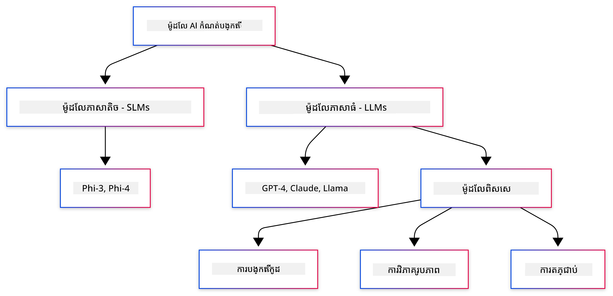
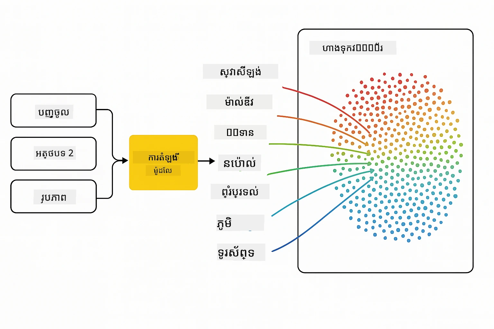
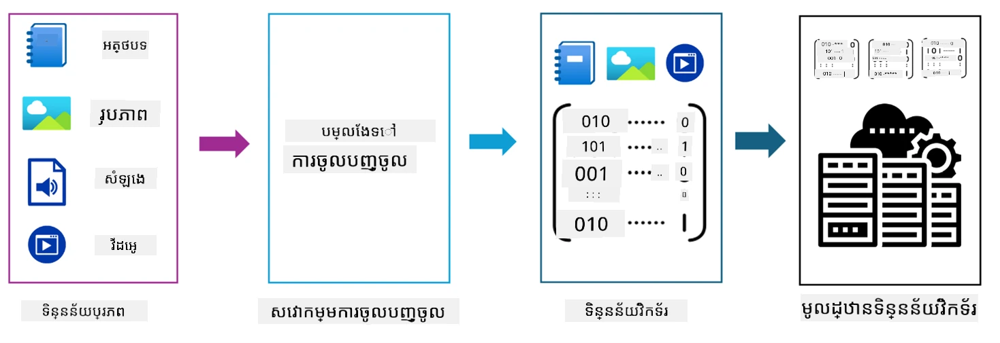
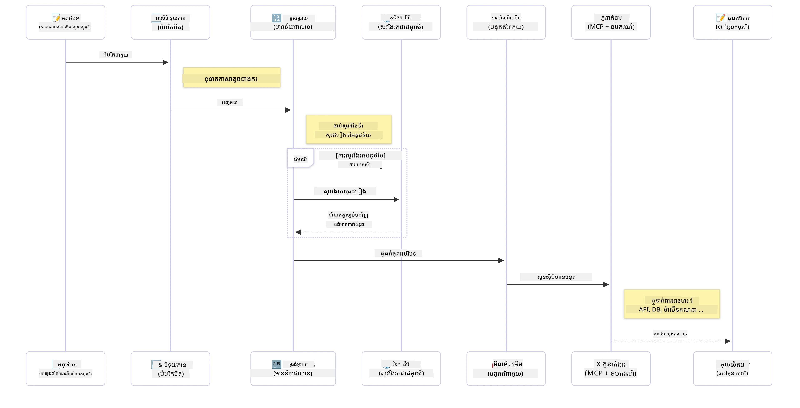

# ប 소개ក ត្រីដែ RAI ផ្នែក Java

> **វីដេអូ**៖ [មើលវីដេអូសង្ខេបសម្រាប់មេរៀននេះនៅលើ YouTube។](https://www.youtube.com/watch?v=XH46tGp_eSw) អ្នកក៏អាចចុចរូបភាពតំណាងខាងលើ។

## អ្វីដែលអ្នកនឹងរៀន

- **មូលដ្ឋានGenerative AI** រួមមាន LLMs, prompt engineering, tokens, embeddings, និង vector databases
- **ប្រៀបធៀបឧបករណ៍អភិវឌ្ឍ AI Java** រួមមាន Azure OpenAI SDK, Spring AI, និង OpenAI Java SDK
- **ស្វែងយល់ពី Model Context Protocol** និងតួនាទីរបស់វានៅក្នុងការទំនាក់ទំនងរបស់ភ្នាក់ងារ AI

## តារាងមាតិកា

- [ប 소개ក](#ប-소개ក)
- [ការត្រួតពិនិត្យឡើងវិញលឿន អំពីគំនិត Generative AI](#ការត្រួតពិនិត្យឡើងវិញលឿន-អំពីគំនិត-generative-ai)
- [ការពិនិត្យឡើងវិញ prompt engineering](#ការពិនិត្យឡើងវិញ-prompt-engineering)
- [Tokens, embeddings, និងភ្នាក់ងារ](#tokens-embeddings-និងភ្នាក់ងារ)
- [ឧបករណ៍និងបណ្ណាល័យអភិវឌ្ឍ AI សម្រាប់ Java](#ឧបករណ៍និងបណ្ណាល័យអភិវឌ្ឍ-ai-សម្រាប់-java)
  - [OpenAI Java SDK](#openai-java-sdk)
  - [Spring AI](#spring-ai)
  - [Azure OpenAI Java SDK](#azure-openai-java-sdk)
- [សេចក្ដីសង្ខេប](#សេចក្ដីសង្ខេប)
- [ជំហានបន្ទាប់](#ជំហានបន្ទាប់)

## ប 소개ក

សូមស្វាគមន៍មកកាន់ជំពូកដំបូងនៃ Generative AI សម្រាប់អ្នកថ្មី - Java Edition! មេរៀនមូលដ្ឋាននេះណែនាំអ្នកឲ្យស្គាល់គំនិតមូលដ្ឋាននៃ generative AI និងរបៀបធ្វើការ​ជាមួយវាតាមរយៈ Java។ អ្នកនឹងរៀនអំពីអាគារសំខាន់នៃកម្មវិធី AI ដែលរួមមាន Large Language Models (LLMs), tokens, embeddings, និងភ្នាក់ងារ AI។ យើងនឹងស្វែងយល់ថែមទាំងឧបករណ៍ Java សំខាន់ដែលអ្នកនឹងប្រើរួមគ្នាក្នុងមុខវិជ្ជានេះ។

### ការត្រួតពិនិត្យឡើងវិញលឿន អំពីគំនិត Generative AI

Generative AI គឺជាប្រភេទបញ្ញាសិប្បនិម្មិតមួយដែលបង្កើតមាតិកាថ្មីៗ ដូចជា អត្ថបទ រូបភាព ឬកូដ ដោយផ្អែកលើលំនាំនិងទំនាក់ទំនងដែលបានរៀនពីទិន្នន័យ។ ម៉ូដុល Generative AI អាចបង្កើតចម្លើយដែលស្រដៀងមនុស្ស បង្រ្កាបបរិបទ ហើយពេលខ្លះក៏បង្កើតមាតិកាដែលហាក់ដូចជាមនុស្សបានផងដែរ។

ពេលអ្នកអភិវឌ្ឍកម្មវិធី AI Java របស់អ្នក អ្នកនឹងដំណើរការជាមួយ **ម៉ូដែល generative AI** ដើម្បីបង្កើតមាតិកា។ សមត្ថភាពខ្លះៗនៃម៉ូដែល generative AI រួមមាន៖

- **ការបង្កើតអត្ថបទ**៖ បង្កើតអត្ថបទដែលស្រដៀងមនុស្ស សម្រាប់ chatbot មាតិការនិងការបញ្ចប់អត្ថបទ។
- **ការបង្កើតនិងវិភាគរូបភាព**៖ បង្កើតរូបភាពពិតប្រាកដ កែលម្អរូបថត ហើយរកឃើញវត្ថុ។
- **ការបង្កើតកូដ**៖ សរសេរកូដឬស្គ្រីបខ្លះៗ។

មានប្រភេទម៉ូដែលជាក់លាក់មួយចំនួនដែលបានបំប៉នសម្រាប់ភារកិច្ចផ្សេងៗ។ ឧទាហរណ៍ សម្រាប់ការបង្កើតអត្ថបទ ផ្ទុយនឹង Small Language Models (SLMs) និង Large Language Models (LLMs) អាចរៀបចំការបង្កើតអត្ថបទបាន ដែល LLMs ជាទូទៅផ្តល់នូវប្រសិទ្ធភាពល្អសម្រាប់ភារកិច្ចស្មុគស្មាញ។ សម្រាប់ភារកិច្ចទាក់ទងនឹងរូបភាព អ្នកអាចប្រើម៉ូដែលវិសេសជាមួយនឹងម៉ូដែលមួយចំនួន។

យ៉ាងណាមិញ ចម្លើយពីម៉ូដែលទាំងនេះមិនត្រូវគ្នារបស់គ្រប់ពេលទេ។ អ្នកប្រហែលជាបានឮអំពីម៉ូដែល “ហាលូស៊ីណេត” ឬបង្កើតព័ត៌មានខុសដែលត្រូវបានគេយល់ថាត្រឹមត្រូវ។ ប៉ុន្តែអ្នកអាចជួយណែនាំម៉ូដែលឱ្យបង្កើតចម្លើយល្អប្រសើរជាងមុនដោយផ្តល់ការណែនាំច្បាស់លាស់ និងបរិបទ។ នេះហៅថា **prompt engineering**។

#### ការពិនិត្យឡើងវិញ prompt engineering

Prompt engineering គឺជារបៀបសម្រាប់រចនាអំពីបញ្ចូលឲ្យមានប្រសិទ្ធភាព ដើម្បីណែនាំម៉ូដែល AI ទៅកាន់លទ្ធផលដែលចង់បាន។ វា​រួមមាន៖

- **ភាពច្បាស់លាស់**៖ ធ្វើឱ្យការណែនាំមានភាពច្បាស់ និងមិនច្របូកច្របល់
- **បរិបទ**៖ ផ្តល់ព័ត៌មានផ្ទៃក្រោយតាមដែលត្រូវការ
- **កំណត់**៖ បញ្ជាក់កំណត់ ឬទ្រង់ទ្រាយណាមួយ

ការអនុវត្តល្អបំផុតសម្រាប់ prompt engineering រួមមានរចនាប្រភេទ prompt, ការណែនាំច្បាស់, ការបំបែកភារកិច្ច, ការរៀនមួយលើក និងច្រើនលើក, និងការតម្រូវ prompt។ ការសាកល្បង prompt ផ្សេងៗគឺសំខាន់ដើម្បីស្វែងរកអ្វីដែលដល់ល្អបំផុតសម្រាប់ករណីប្រើជាក់លាក់របស់អ្នក។

ពេលអភិវឌ្ឍកម្មវិធី អ្នកនឹងប្រើ prompt ប្រភេទខុសៗគ្នា៖  
- **System prompts**៖ កំណត់ច្បាប់មូលដ្ឋាននិងបរិបទសម្រាប់អាកប្បកិរិយា​របស់ម៉ូដែល  
- **User prompts**៖ ទិន្នន័យបញ្ចូលពីអ្នកប្រើកម្មវិធី​របស់អ្នក  
- **Assistant prompts**៖ ចម្លើយរបស់ម៉ូដែលដែលផ្អែកលើ system និង user prompts  

> **សរសេរបន្ត**៖ សូមស្វែងយល់បន្ថែមអំពី prompt engineering នៅក្នុង [ជំពូក Prompt Engineering នៃវគ្គ GenAI for Beginners](https://github.com/microsoft/generative-ai-for-beginners/tree/main/04-prompt-engineering-fundamentals)

#### Tokens, embeddings, និងភ្នាក់ងារ

ពេលធ្វើការជាមួយម៉ូដែល generative AI អ្នកនឹងប្រទះឃើញពាក្យដូចជា **tokens**, **embeddings**, **agents**, និង **Model Context Protocol (MCP)**។ នេះជាសង្ខេបលម្អិតអំពីមូលដ្ឋានគំនិតទាំងនេះ៖

- **Tokens**៖ Tokens គឺជាឯកតាតូចបំផុតនៃអត្ថបទនៅក្នុងម៉ូដែល។ វាអាចជា ពាក្យ តួអក្សរ ឬជាតួបំបែកតូចៗ។ Tokens ត្រូវបានប្រើសម្រាប់តំណាងអត្ថបទនៅក្នុងទ្រង់ទ្រាយដែលម៉ូដែលអាចយល់បាន។ ឧទាហរណ៍ ប្រយោគ "The quick brown fox jumped over the lazy dog" អាចត្រូវបានចែកជា tokens ដូចជា ["The", " quick", " brown", " fox", " jumped", " over", " the", " lazy", " dog"] ឬ ["The", " qu", "ick", " br", "own", " fox", " jump", "ed", " over", " the", " la", "zy", " dog"] ភាសាតាមវិធី tokenization ។

Tokenization គឺជាការបំបែកអត្ថបទទៅជាឯកតាតូចៗទាំងនេះ។ វាសំខាន់ព្រោះម៉ូដែលប្រតិបត្តិលើ tokens មិនមែនអត្ថបទដើម។ ចំនួន tokens ក្នុង prompt មានផលប៉ះពាល់ដល់ប្រវែងនិងគុណភាពនៃចម្លើយម៉ូដែល ព្រោះម៉ូដែលមានកំណត់ចំនួន tokens សម្រាប់បង្អួចបរិបទ (context window) របស់ខ្លួន (ឧ. 128K tokens សម្រាប់ GPT-4o រួមទាំងទិន្នន័យបញ្ចូល និងចេញ)។

នៅក្នុង Java អ្នកអាចប្រើបណ្ណាល័យដូចជា OpenAI SDK ដើម្បីបើក tokenization ដោយស្វ័យប្រវត្តិពេលផ្ញើសំណើទៅម៉ូដែល AI។

- **Embeddings**៖ Embeddings ជារូបរាងវ៉ិចទ័រនៃ tokens ដែលទទួលបានន័យនៃអត្ថបទ។ វាជារូបភាពលេខ (.i.e, អារ៉េនៃលេខសម្រួលកំណត់តែមួយ) ដែលអនុញ្ញាតឲ្យម៉ូដែលយល់ពីទំនាក់ទំនងរវាងពាក្យនិងបង្កើតចម្លើយដែលសមរម្យទៅនឹងបរិបទ។ ពាក្យស្រដៀងគ្នាមាន embeddings ស្រដៀងគ្នា ដែលធ្វើឲ្យម៉ូដែលយល់ពីគំនិតដូចជា សុវណ្ណភាគទេ និងទំនាក់ទំនងសេម៉ង់ធីក។

នៅក្នុង Java អ្នកអាចបង្កើត embeddings ដោយប្រើ OpenAI SDK ឬបណ្ណាល័យផ្សេងទៀតដែលគាំទ្រ embedding generation។ Embeddings គឺសំខាន់សម្រាប់ភារកិច្ចស្វែងរកអត្ថបទដោយគំនិត (semantic search) ដែលអ្នកចង់ស្វែងរកមាតិកាស្រដៀងគ្នាតាមអត្ថន័យ មិនមែនតាមពាក្យដិតឃ្លា។

- **Vector databases**៖ Vector databases គឺជាប្រព័ន្ធផ្ទុកទិន្នន័យជាចំណែកដែលបំប៉នសម្រាប់ embeddings។ វាជួយស្វែងរកមាតិកាស្រដៀងគ្នាបានយ៉ាងប្រសើរ ហើយមានសារៈសំខាន់ក្នុងគំរូ Retrieval-Augmented Generation (RAG) ដែលអ្នកត្រូវការស្វែងរកព័ត៌មានដែលពាក់ព័ន្ធពីគណនីទិន្នន័យធំៗដោយផ្អែកលើមាតិកាដូចគ្នា បំផុតមិនមែនតាមពាក្យដិតឃ្លា។

> **កំណត់សម្គាល់**៖ នៅក្នុងវគ្គនេះ យើងមិនគ្របដណ្តប់អំពី Vector databases ប៉ុន្តែសូមប្រាប់ឲ្យដឹងថាវាចាំបាច់នឹងត្រូវបានប្រើក្នុងកម្មវិធីពិតប្រាកដ។

- **ភ្នាក់ងារ និង MCP**៖ គ្រឿងផ្សំ AI ដែលអាចអនុវត្តដោយស្វ័យប្រវត្តិក្នុងការទំនាក់ទំនងជាមួយម៉ូដែល បណ្តាញឧបករណ៍ និងប្រព័ន្ធខាងក្រៅផ្សេងៗ។ Model Context Protocol (MCP) ផ្តល់របៀបស្តង់ដារមួយសម្រាប់អោយភ្នាក់ងារ អាចចូលដំណើរការទិន្នន័យ និងឧបករណ៍ខាងក្រៅបានយ៉ាងសុវត្ថិភាព។ សូមស្វែងយល់បន្ថែមនៅក្នុងវគ្គ [MCP សម្រាប់អ្នកថ្មី](https://github.com/microsoft/mcp-for-beginners)។

ក្នុងកម្មវិធី AI សម្រាប់ Java ខាងក្នុង អ្នកនឹងប្រើ tokens សម្រាប់ដំណើរការអត្ថបទ, embeddings សម្រាប់ស្វែងរកដោយធាតុបែប semantic និង RAG, vector databases សម្រាប់ការយកទិន្នន័យ, និងភ្នាក់ងារជាមួយ MCP សម្រាប់ការបង្កើតប្រព័ន្ធឆ្លាតវៃប្រើឧបករណ៍។

### ឧបករណ៍និងបណ្ណាល័យអភិវឌ្ឍ AI សម្រាប់ Java

Java ផ្ដល់ឧបករណ៍ដ៏ល្អសម្រាប់អភិវឌ្ឍ AI។ មានបណ្ណាល័យចម្បងបីដែលយើងនឹងសិក្សាវាជុំគ្នាក្នុងវគ្គនេះ - OpenAI Java SDK, Azure OpenAI SDK, និង Spring AI។

នេះជាតារាងយោងរហ័សបង្ហាញ SDK មួយណាដែលបានប្រើក្នុងគំរូជំពូកនីមួយៗ៖

| ជំពូក | គំរូ | SDK |
|---------|--------|-----|
| 02-SetupDevEnvironment | github-models | OpenAI Java SDK |
| 02-SetupDevEnvironment | basic-chat-azure | Spring AI Azure OpenAI |
| 03-CoreGenerativeAITechniques | examples | Azure OpenAI SDK |
| 04-PracticalSamples | petstory | OpenAI Java SDK |
| 04-PracticalSamples | foundrylocal | OpenAI Java SDK |
| 04-PracticalSamples | calculator | Spring AI MCP SDK + LangChain4j |

**តំណភ្ជាប់ឯកសារ SDK៖**  
- [Azure OpenAI Java SDK](https://github.com/Azure/azure-sdk-for-java/tree/azure-ai-openai_1.0.0-beta.16/sdk/openai/azure-ai-openai)  
- [Spring AI](https://docs.spring.io/spring-ai/reference/)  
- [OpenAI Java SDK](https://github.com/openai/openai-java)  
- [LangChain4j](https://docs.langchain4j.dev/)

#### OpenAI Java SDK

OpenAI SDK គឺជាបណ្ណាល័យ Java ផ្លូវការសម្រាប់ API OpenAI។ វាផ្តល់ចំណុចប្រទាក់ដែលសាមញ្ញនិងនៅភាពជាស្តង់ដារសម្រាប់ធ្វើការជាមួយម៉ូដែល OpenAI ដែលធ្វើឲ្យងាយស្រួលបញ្ចូលសមត្ថភាព AI ទៅក្នុងកម្មវិធី Java។ គំរូ GitHub Models នៅជំពូក 2, កម្មវិធី Pet Story និងគំរូ Foundry Local នៅជំពូក 4 បង្ហាញពី​វិធីសាស្ត្រ OpenAI SDK។

#### Spring AI

Spring AI គឺជាក្រេមវើកដ៏ទូលំទូលាយមួយដែលនាំសមត្ថភាព AI មកកាន់កម្មវិធី Spring ដោយផ្តល់ស្រទាប់ abstraction មួយណែនាំសំរាប់អ្នកផ្គត់ផ្គង់ AI ផ្សេងៗគ្នា។ វាចូលរួមដោយសាមញ្ញជាមួយនឹងអេកូស៊ីស្ទិម Spring ដែលធ្វើឲ្យវាជាជម្រើសល្អសម្រាប់កម្មវិធី Java សម្រាប់សហគ្រាសដែលត្រូវការសមត្ថភាព AI។

កម្លាំងរបស់ Spring AI គឺស្ថិតនៅក្នុងការលាយបញ្ចូលរលូនជាមួយឧស្សាហកម្ម Spring ដែលធ្វើឲ្យងាយស្រួលបង្កើតកម្មវិធី AI សម្រាប់ផលិតកម្មដែលស្រាស្រាយដោយប្រើលំនាំ Spring ដូចជា dependency injection, ការគ្រប់គ្រង configuration និងបណ្ដាស្រុះសម្រាប់សាកល្បង។ អ្នកនឹងប្រើ Spring AI នៅជំពូក 2 និង 4 សម្រាប់បង្កើតកម្មវិធីដែលប្រើទាំង OpenAI និង Model Context Protocol (MCP) Spring AI libraries។

##### Model Context Protocol (MCP)

[Model Context Protocol (MCP)](https://modelcontextprotocol.io/) គឺជាមาต្រាជាតិថ្មីមួយដែលអនុញ្ញាតឱ្យកម្មវិធី AI ទំនាក់ទំនងយ៉ាងសុវត្ថិភាពជាមួយប្រភពទិន្នន័យខាងក្រៅនិងឧបករណ៍។ MCP ផ្តល់វិធីសាស្ត្រស្តង់ដារសម្រាប់ម៉ូដែល AI ដើម្បីចូលដំណើរការព័ត៌មានបរិបទ និងអនុវត្តសកម្មភាពក្នុងកម្មវិធីរបស់អ្នក។

នៅជំពូក 4 អ្នកនឹងបង្កើតសេវាគណនាគណនាម៉ូដែល MCP ងាយៗមួយដែលបង្ហាញគំនិតមូលដ្ឋានរបស់ Model Context Protocol ជាមួយ Spring AI ដែលបង្ហាញពីរបៀបបង្កើតឧបករណ៍ជំនួយ និងស្ថាបត្យកម្មសេវា។

#### Azure OpenAI Java SDK

បណ្ណាល័យគ្រប់គ្រង Azure OpenAI សម្រាប់ Java គឺជាការប្រមូលផ្តុំនៃ REST API OpenAI ដែលផ្តល់ចំណុចប្រទាក់និងការលាយបញ្ចូលក្នុងសំណុំ SDK Azure។ នៅជំពូក 3 អ្នកនឹងបង្កើតកម្មវិធីប្រើ Azure OpenAI SDK រួមមានកម្មវិធី chat, function calling និងគំរោង RAG (Retrieval-Augmented Generation)។

> កំណត់សម្គាល់៖ Azure OpenAI SDK មានគុណលក្ខណៈទឹកថយពី OpenAI Java SDK ក្នុងរឿងមុខងារ ដូច្នេះសម្រាប់គម្រោងអនាគត សូមពិចារណាប្រើ OpenAI Java SDK។

## សេចក្ដីសង្ខេប

នេះជាចប់មូលដ្ឋានទាំងអស់រួចហើយ! ឥឡូវនេះអ្នកយល់៖

- គំនិតមូលដ្ឋានពី generative AI - ចាប់ពី LLMs និង prompt engineering ទៅ tokens, embeddings និង vector databases  
- ជម្រើសឧបករណ៍សម្រាប់អភិវឌ្ឍ AI Java របស់អ្នក៖ Azure OpenAI SDK, Spring AI, និង OpenAI Java SDK  
- អ្វីទៅជា Model Context Protocol និងរបៀបទៅឲ្យភ្នាក់ងារ AI ធ្វើការជាមួយឧបករណ៍ខាងក្រៅបាន។

## ជំហានបន្ទាប់

[ជំពូក 2៖ ការតម្លើងបរិក្ខារអភិវឌ្ឍន៍](../02-SetupDevEnvironment/README.md)

---

<!-- CO-OP TRANSLATOR DISCLAIMER START -->
**ការបោះបង់ទោស**៖  
ឯកសារនេះបានបកប្រែដោយប្រើសេវាបកប្រែ AI [Co-op Translator](https://github.com/Azure/co-op-translator)។ ខណៈពេលយើងខិតខំដើម្បីភាពត្រឹមត្រូវ សូមយកចិត្តទុកដាក់ថាការបកប្រែដោយស្វ័យប្រវត្តអាចមានកំហុសឬភាពមិនត្រឹមត្រូវ។ ឯកសារដើមនៅភាសាដើមគួរតែចាត់ទុកជាអ្នកផ្តល់ព័ត៌មានដែលមានអំណាច។ សម្រាប់ព័ត៌មានសំខាន់ មុនសូមប្រើការបកប្រែដោយមនុស្សជំនាញ។ យើងមិនទទួលខុសត្រូវចំពោះការយល់ច្រឡំ ឬការបកស្រាយខុសទេដែលកើតមានពីការប្រើប្រាស់ការបកប្រែនេះ។
<!-- CO-OP TRANSLATOR DISCLAIMER END -->