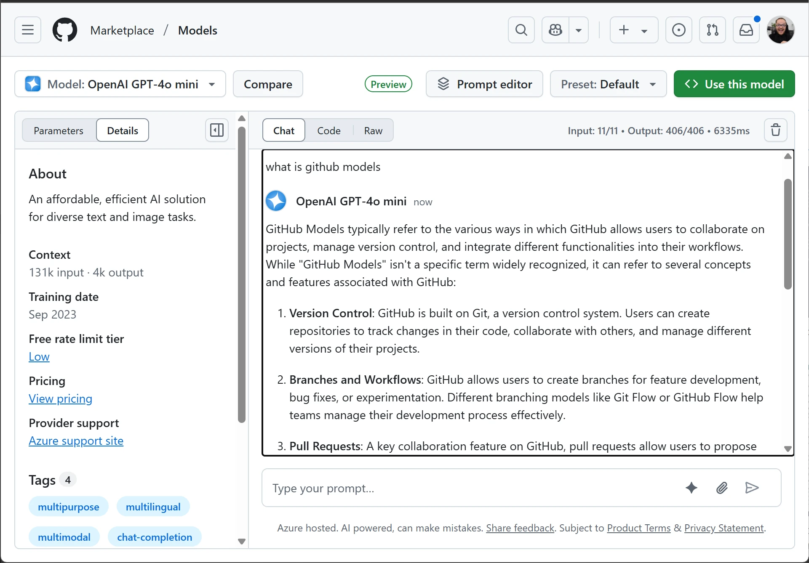
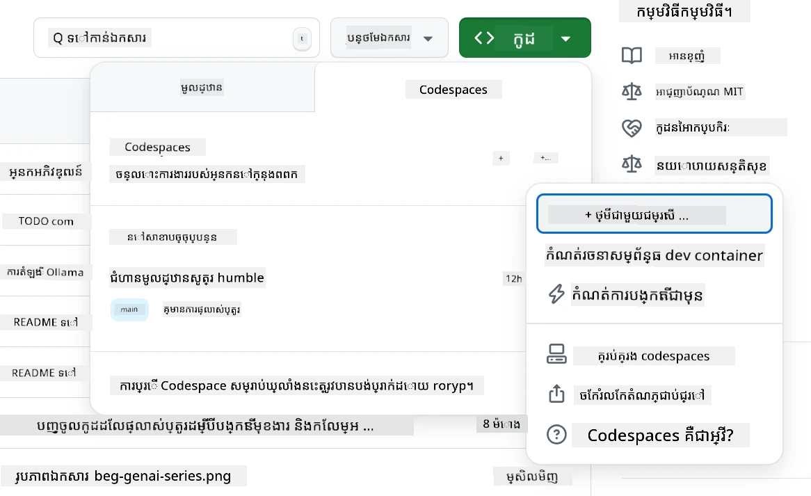
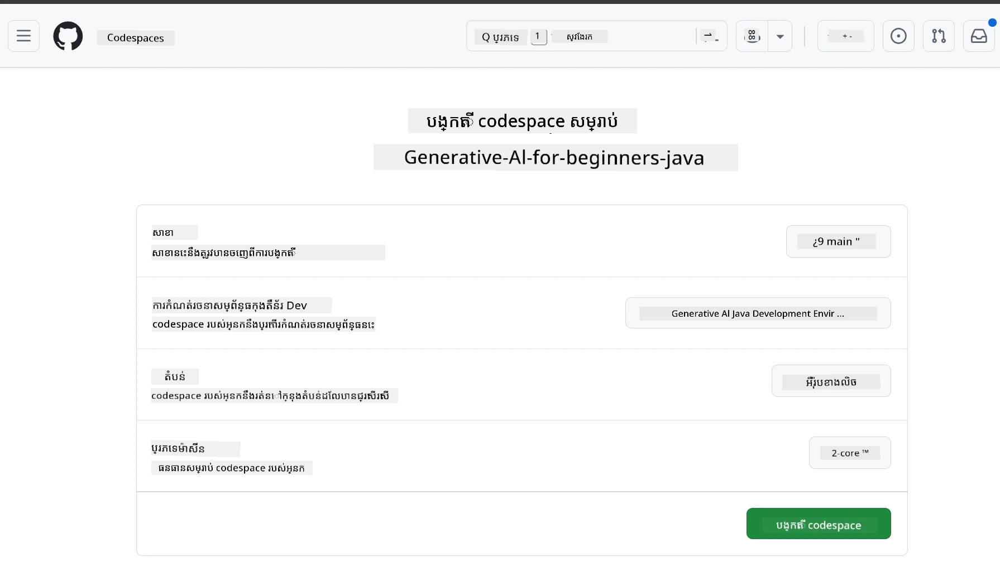
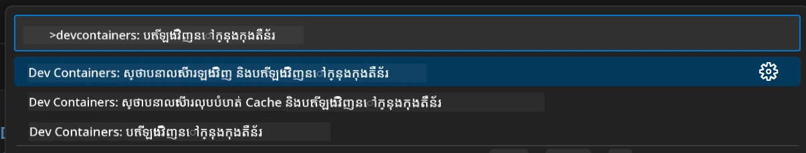
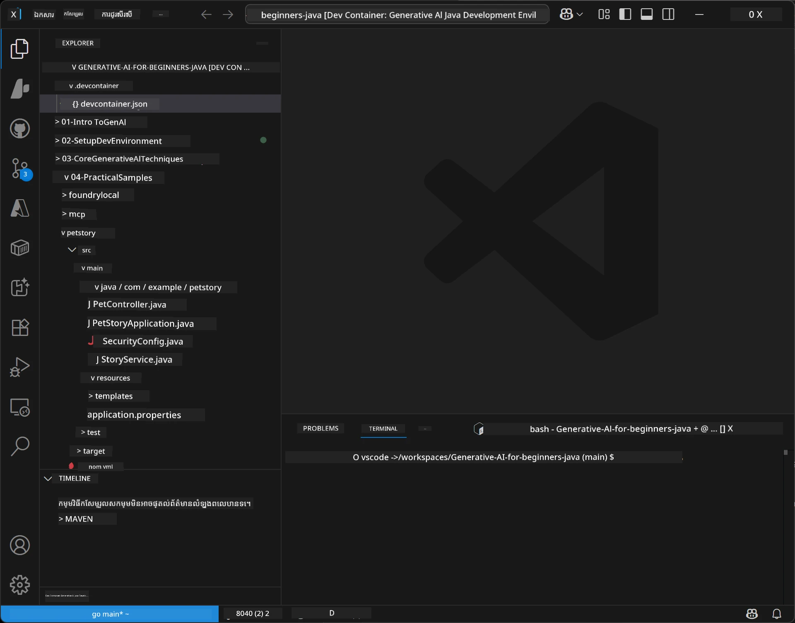
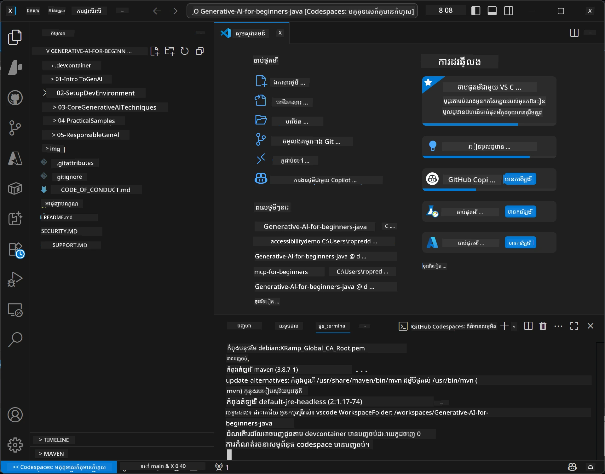

# ការតំឡើងបរិយាកាសអភិវឌ្ឍសម្រាប់ Generative AI សម្រាប់ Java

> **ចាប់ផ្តើមយ៉ាងរហ័ស**: កូដនៅក្នុងពពកក្នុងរយៈពេល 2 នាទី - ទៅកាន់ [GitHub Codespaces Setup](#ជម្រើស-a-github-codespaces-ណែនាំ) - មិនចាំបាច់តំឡើងនៅលើកុំព្យូទ័រផ្ទាល់ និងប្រើម៉ូเดล github!

> **ចាប់អារម្មណ៍ចំពោះ Azure OpenAI?**, សូមមើល [Azure OpenAI Setup Guide](getting-started-azure-openai.md) របស់យើង ដែលមានជំហានបង្កើតធនធាន Azure OpenAI ថ្មី។

## អ្វីដែលអ្នកនឹងរៀន

- តំឡើងបរិយាកាសអភិវឌ្ឍ Java សម្រាប់កម្មវិធី AI
- ជ្រើសរើស និងកំណត់រចនាសម្ព័ន្ធបរិយាកាសអភិវឌ្ឍដែលអ្នកចង់បាន (មុនពេលពពកជាមួយ Codespaces, dev container នៅក្នុងគ្រោងការប្រព័ន្ធ, ឬការតំឡើងលើកុំព្យូទ័រផ្ទាល់)
- តេស្តការតំឡើងដោយភ្ជាប់ទៅម៉ូដែល GitHub

## សារារាងមាតិកា

- [អ្វីដែលអ្នកនឹងរៀន](#អ្វីដែលអ្នកនឹងរៀន)
- [ការណែនាំ](#ការណែនាំ)
- [ជំហានទី 1: តំឡើងបរិយាកាសអភិវឌ្ឍរបស់អ្នក](#ជំហានទី-1-តំឡើងបរិយាកាសអភិវឌ្ឍរបស់អ្នក)
  - [ជម្រើស A: GitHub Codespaces (ណែនាំ)](#ជម្រើស-a-github-codespaces-ណែនាំ)
  - [ជម្រើស B: Local Dev Container](#ជម្រើស-b-local-dev-container)
  - [ជម្រើស C: ប្រើការតំឡើងផ្ទាល់ដដែលរបស់អ្នក](#ជម្រើស-c-ប្រើការតំឡើងផ្ទាល់ដដែលរបស់អ្នក)
- [ជំហានទី 2: បង្កើត GitHub Personal Access Token](#ជំហានទី-2-បង្កើត-github-personal-access-token)
- [ជំហានទី 3: តេស្តការតំឡើងរបស់អ្នក](#ជំហានទី-3-តេស្តការតំឡើងរបស់អ្នកជាមួយឧទាហរណ៍-github-models)
- [ដោះស្រាយបញ្ហា](#ដោះស្រាយបញ្ហា)
- [សេចក្ដីសង្ខេប](#សេចក្ដីសង្ខេប)
- [ជំហានបន្ទាប់](#ជំហានបន្ទាប់)

## ការណែនាំ

ជំពូកនេះនឹងណែនាំអ្នកតាមដានក្នុងការតំឡើងបរិយាកាសអភិវឌ្ឍ។ យើងប្រើ **GitHub Models** ដើម្បីជាគំរូចម្បងព្រោះវាឥតគិតថ្លៃ, ងាយស្រួលក្នុងការតំឡើងដោយមានគណនី GitHub តែមួយ, មិនចាំបាច់មានកាតឥណទាន, និងផ្តល់នូវចូលដំណើរការម៉ូដែលច្រើនសម្រាប់ការសាកល្បង។

**មិនចាំបាច់តំឡើងនៅលើកុំព្យូទ័រផ្ទាល់ទេ!** អ្នកអាចចាប់ផ្តើមកូដបានភ្លាមៗដោយប្រើ GitHub Codespaces ដែលផ្តល់បរិយាកាសអភិវឌ្ឍពេញលេញនៅក្នុងកម្មវិធី浏览器របស់អ្នក។



យើងផ្តល់អនុសាសន៍ប្រើ [**GitHub Models**](https://github.com/marketplace?type=models) សម្រាប់វគ្គនេះ ព្រោះវា:
- **ឥតគិតថ្លៃ** សម្រាប់ការចាប់ផ្តើម
- **ងាយស្រួល** ក្នុងការតំឡើងដោយមានគណនី GitHub តែមួយ
- **មិនចាំបាច់មានកាតឥណទាន**
- មាន **ម៉ូដែលច្រើន** សម្រាប់ការសាកល្បង

> **ចំណាំ**: ម៉ូដែល GitHub ដែលបានប្រើក្នុងការបណ្តុះបណ្តាលនេះមានដែនកំណត់ឥតគិតថ្លៃដូចខាងក្រោម:
> - 15 សំណើរ ឱ្យបានក្នុងមួយនាទី (150 ក្នុងមួយថ្ងៃ)
> - ប្រមាណ 8,000 ពាក្យចូល, 4,000 ពាក្យចេញ ក្នុងមួយសំណើរ
> - 5 សំណើរប្រតិបត្តិជាប្រព័ន្ធជាបន្តបន្ទាប់
> 
> សម្រាប់ការប្រើប្រាស់ក្នុងផលិតកម្ម, សូមបង្កើនទៅ Azure AI Foundry Models ជាមួយគណនី Azure របស់អ្នក។ កូដរបស់អ្នកមិនត្រូវបម្រែបម្រួលទេ។ មើលឯកសារ [Azure AI Foundry](https://learn.microsoft.com/azure/ai-foundry/foundry-models/how-to/quickstart-github-models)។

## ជំហានទី 1: តំឡើងបរិយាកាសអភិវឌ្ឍរបស់អ្នក

<a name="quick-start-cloud"></a>

យើងបានបង្កើត container អភិវឌ្ឍដែលបានកំណត់រួចហើយដើម្បីបន្ថយពេលវេលាដំណើរការនិងធានាអ្នកមានឧបករណ៍ចាំបាច់ទាំងអស់សម្រាប់វគ្គ Generative AI សម្រាប់ Java។ ជ្រើសរើសវិធីសាស្រ្តអភិវឌ្ឍដែលអ្នកចូលចិត្ត៖

### ជម្រើសក្នុងការតំឡើងបរិយាកាស៖

#### ជម្រើស A: GitHub Codespaces (ណែនាំ)

**ចាប់ផ្តើមកូដក្នុងរយៈពេល 2 នាទី - មិនចាំបាច់តំឡើងនៅលើកុំព្យូទ័រផ្ទាល់ទេ!**

1. Fork ទាញយក repository នេះទៅគណនី GitHub របស់អ្នក
   > **ចំណាំ**: ប្រសិនបើអ្នកចង់កែសម្រួលការកំណត់មូលដ្ឋាន សូមមើល [Dev Container Configuration](../../../.devcontainer/devcontainer.json)
2. ចុច **Code** → ទៅផ្ទាំង **Codespaces** → ចុច **...** → ជ្រើស **New with options...**
3. ប្រើតំលៃលំនាំដើម – នេះនឹងជ្រើសរើស **ការកំណត់ dev container**: **Generative AI Java Development Environment** ដែលបានបង្កើតផ្ទាល់សម្រាប់វគ្គនេះ
4. ចុច **Create codespace**
5. រង់ចាំប្រមាណ 2 នាទីសម្រាប់បរិយាកាសត្រៀមខ្លួន
6. បន្តទៅ [ជំហានទី 2: បង្កើត GitHub Token](#ជំហានទី-2-បង្កើត-github-personal-access-token)






> **អត្ថប្រយោជន៍របស់ Codespaces**:
> - មិនចាំបាច់តម្លើងនៅលើកុំព្យូទ័រផ្ទាល់
> - ដំណើរការបានលើឧបករណ៍ណាមួយដែលមានកម្មវិធី浏览器
> - បានកំណត់រចនាសម្ព័ន្ធជាមុនរួច ជាមួយឧបករណ៍ និងអាស្រ័យការ​ទាំងអស់
> - ឥតគិតថ្លៃ 60 ម៉ោងក្នុងមួយខែសម្រាប់គណនីផ្ទាល់ខ្លួន
> - បរិយាកាសឆាបឆាប់សម្រាប់អ្នករៀនទាំងអស់

#### ជម្រើស B: Local Dev Container

**សម្រាប់អ្នកអភិវឌ្ឍដែលចូលចិត្តអភិវឌ្ឍក្នុងស្រុកជាមួយ Docker**

1. Fork និង clone repository នេះទៅកុំព្យូទ័រផ្ទាល់របស់អ្នក
   > **ចំណាំ**: ប្រសិនបើអ្នកចង់កែសម្រួលការកំណត់មូលដ្ឋាន សូមមើល [Dev Container Configuration](../../../.devcontainer/devcontainer.json)
2. តំឡើង [Docker Desktop](https://www.docker.com/products/docker-desktop/) និង [VS Code](https://code.visualstudio.com/)
3. តំឡើងបន្ថែម [Dev Containers extension](https://marketplace.visualstudio.com/items?itemName=ms-vscode-remote.remote-containers) នៅក្នុង VS Code
4. បើកថត repository នៅក្នុង VS Code
5. នៅពេលមានសំណើ, ចុច **Reopen in Container** (ឬប្រើ `Ctrl+Shift+P` → "Dev Containers: Reopen in Container")
6. រង់ចាំ container រចនាបទសាង និងចាប់ផ្តើម
7. បន្តទៅ [ជំហានទី 2: បង្កើត GitHub Token](#ជំហានទី-2-បង្កើត-github-personal-access-token)





#### ជម្រើស C: ប្រើការតំឡើងផ្ទាល់ដដែលរបស់អ្នក

**សម្រាប់អ្នកអភិវឌ្ឍដែលមានបរិយាកាស Java មានរួច**

លក្ខខណ្ឌជាមុន:
- [Java 21+](https://www.oracle.com/java/technologies/javase/jdk21-archive-downloads.html)
- [Maven 3.9+](https://maven.apache.org/download.cgi)
- [VS Code](https://code.visualstudio.com) ឬ IDE ដែលអ្នកចូលចិត្ត

ជំហាន:
1. Clone repository នេះទៅកុំព្យូទ័រផ្ទាល់របស់អ្នក
2. បើកគម្រោងនៅក្នុង IDE របស់អ្នក
3. បន្តទៅ [ជំហានទី 2: បង្កើត GitHub Token](#ជំហានទី-2-បង្កើត-github-personal-access-token)

> **ដំណឹងល្អសម្រាប់អ្នក**: ប្រសិនបើអ្នកមានកុំព្យូទ័រជាមួយលក្ខណៈបច្ចេកទាប ប៉ុន្តាចង់ប្រើ VS Code នៅក្នុងស្រុក សូមប្រើ GitHub Codespaces! អ្នកអាចភ្ជាប់ VS Code ផ្ទាល់របស់អ្នកទៅ Codespace ដែលមាននៅពពកសម្រាប់បទពិសោធន៍ល្អបំផុត។



## ជំហានទី 2: បង្កើត GitHub Personal Access Token

1. ទៅកាន់ [GitHub Settings](https://github.com/settings/profile) ហើយជ្រើសយក **Settings** ពីមឺនុយប្រវត្តិរូបរបស់អ្នក។
2. នៅផ្នែកឆ្វេង ចុច **Developer settings** (ធម្មតានៅខាងក្រោម)។
3. ក្រោម **Personal access tokens**, ចុច **Fine-grained tokens** (ឬតាមតំណភ្ជាប់ផ្ទាល់នេះ [link](https://github.com/settings/personal-access-tokens))។
4. ចុច **Generate new token**។
5. ក្រោយ "Token name", បញ្ចូលឈ្មោះពិពណ៌នា (ឧ. `GenAI-Java-Course-Token`)។
6. កំណត់ថ្ងៃផុតកំណត់ (ណែនាំ៖ 7 ថ្ងៃ សម្រាប់វិធីសាស្រ្តសុវត្ថិភាពល្អបំផុត)។
7. ក្រោយ "Resource owner", ជ្រើសគណនីអ្នកប្រើរបស់អ្នក។
8. ក្រោយ "Repository access", ជ្រើស repository ដែលអ្នកចង់ប្រើជាមួយ GitHub Models (ឬ "All repositories" ប្រសិនបើចាំបាច់)។
9. ក្រោយ "Account permissions", រក **Models** ហើយកំណត់ឲ្យ **Read-only**។
10. ចុច **Generate token**។
11. **ចម្លង និងរក្សាទុក token របស់អ្នកឥឡូវនេះ** – អ្នកនឹងមិនឃើញវាម្ដងទៀតទេ!

> **ជាបច្ចេកទេសសុវត្ថិភាព**: ប្រើវិមាត្រតិចបំផុតដែលត្រូវការនិងពេលវេលាចុះផុតខ្លីជាងសម្រាប់ token ចូលដំណើរការ​របស់អ្នក។

## ជំហានទី 3: តេស្តការតំឡើងរបស់អ្នកជាមួយឧទាហរណ៍ GitHub Models

ពេលបរិយាកាសអភិវឌ្ឍរបស់អ្នកមានភាពរួចរាល់, យើងមកតេស្តការភ្ជាប់ GitHub Models ជាមួយកម្មវិធីគំរូរបស់យើងនៅក្នុង [`02-SetupDevEnvironment/examples/github-models`](../../../02-SetupDevEnvironment/examples/github-models)។

1. បើក terminal នៅក្នុងបរិយាកាសអភិវឌ្ឍរបស់អ្នក។
2. ទៅកាន់ឧទាហរណ៍ GitHub Models:
   ```bash
   cd 02-SetupDevEnvironment/examples/github-models
   ```
3. កំណត់ token GitHub របស់អ្នកជាផ្លាស់ប្តូរបរិស្ថាន:
   ```bash
   # macOS/Linux
   export GITHUB_TOKEN=your_token_here
   
   # Windows (កម្មវិធីបញ្ជា Command Prompt)
   set GITHUB_TOKEN=your_token_here
   
   # Windows (PowerShell)
   $env:GITHUB_TOKEN="your_token_here"
   ```

4. រត់កម្មវិធី:
   ```bash
   mvn compile exec:java -Dexec.mainClass="com.example.githubmodels.App"
   ```

អ្នកគួរតែឃើញលទ្ធផលដូចជា:
```text
Using model: gpt-4.1-nano
Sending request to GitHub Models...
Response: Hello World!
```

### ការយល់ដឹងអំពីកូដឧទាហរណ៍

ដំបូង, យើងសូមយល់ពីអ្វីដែលយើងបានរត់។ ឧទាហរណ៍នៅក្រោម `examples/github-models` ប្រើ OpenAI Java SDK ដើម្បីភ្ជាប់ទៅ GitHub Models៖

**អ្វីដែលកូដនេះធ្វើ:**
- **ភ្ជាប់** ទៅ GitHub Models ដោយប្រើ token ចូលដំណើរការផ្ទាល់ខ្លួនរបស់អ្នក
- **ផ្ញើ** សារសាមញ្ញ "Say Hello World!" ទៅម៉ូដែល AI
- **ទទួល** ហើយបង្ហាញចម្លើយពី AI
- **ត្រួតពិនិត្យ** ថាការតំឡើងរបស់អ្នកដំណើរការសម្រេចជាប្រសិទ្ធភាព

**អាស្រ័យការ​សំខាន់** (នៅក្នុង `pom.xml`):
```xml
<dependency>
    <groupId>com.openai</groupId>
    <artifactId>openai-java</artifactId>
    <version>2.12.0</version>
</dependency>
```

**កូដសំខាន់** (`App.java`):
```java
// ចូលភ្ជាប់ទៅកាន់ម៉ូឌែល GitHub ដោយប្រើ OpenAI Java SDK
OpenAIClient client = OpenAIOkHttpClient.builder()
    .apiKey(pat)
    .baseUrl("https://models.inference.ai.azure.com")
    .build();

// បង្កើតសំណើបំពេញការជជែក
ChatCompletionCreateParams params = ChatCompletionCreateParams.builder()
    .model(modelId)
    .addSystemMessage("You are a concise assistant.")
    .addUserMessage("Say Hello World!")
    .build();

// ទទួលបានការឆ្លើយតប AI
ChatCompletion response = client.chat().completions().create(params);
System.out.println("Response: " + response.choices().get(0).message().content().orElse("No response content"));
```

## សេចក្ដីសង្ខេប

ល្អណាស់! ឥឡូវនេះអ្នកមានអ្វីគ្រប់យ៉ាងត្រៀមរួចរាល់ហើយ៖

- បានបង្កើត GitHub Personal Access Token ជាមួយសិទិ្ធត្រឹមត្រូវសម្រាប់ចូលដំណើរការម៉ូដែល AI
- បានដំណើរការបរិយាកាសអភិវឌ្ឍ Java របស់អ្នក (មិនថាជា Codespaces, dev containers, ឬក្នុងស្រុក)
- បានភ្ជាប់ទៅ GitHub Models ដោយប្រើ OpenAI Java SDK សម្រាប់ការអភិវឌ្ឍ AI ដោយឥតគិតថ្លៃ
- បានតេស្តថាវាដំណើរការជាមួយឧទាហរណ៍សាមញ្ញមួយដែលធ្វើការទំនាក់ទំនងទៅម៉ូដែល AI

## ជំហានបន្ទាប់

[ជំពូក 3: បច្ចេកទេសស្នូល Generative AI](../03-CoreGenerativeAITechniques/README.md)

## ដោះស្រាយបញ្ហា

មានបញ្ហា? នេះជាបញ្ហាតែមួយចំនួន និងដំណោះស្រាយ៖

- **Token មិនដំណើរការ?** 
  - ត្រួតពិនិត្យថាអ្នកបានចម្លង token ទាំងមូលដោយគ្មានចន្លើ
  - ពិនិត្យថា token ត្រូវបានកំណត់ជាផ្លាស់ប្តូរបរិស្ថានត្រឹមត្រូវ
  - ពិនិត្យថា token មានសិទិ្ធត្រឹមត្រូវ (Models: Read-only)

- **Maven មិនឃើញ?** 
  - ប្រសិនបើប្រើ dev containers/Codespaces, Maven គួរត្រូវបានតំឡើងរួចហើយ
  - សម្រាប់ការតំឡើងក្នុងស្រុក, ត្រូវមាន Java 21+ និង Maven 3.9+ តំឡើងរួច
  - ព្យាយាម `mvn --version` ដើម្បីពិនិត្យការតំឡើង

- **បញ្ហាភ្ជាប់?** 
  - ពិនិត្យការតភ្ជាប់អ៊ីនធឺណិតរបស់អ្នក
  - ប្រាកដថា GitHub អាចចូលដំណើរការពីបណ្ដាញរបស់អ្នក
  - ពិនិត្យថាអ្នកមិនមាន firewall បិទការចូល GitHub Models endpoint

- **Dev container មិនចាប់ផ្តើម?** 
  - ប្រាកដថា Docker Desktop កំពុងដំណើរការ (សម្រាប់ការអភិវឌ្ឍក្នុងស្រុក)
  - ព្យាយាមសាងឡើងវិញ container ៖ `Ctrl+Shift+P` → "Dev Containers: Rebuild Container"

- **កំហុសបញ្ហាកំណត់កម្មវិធី?**
  - ពិនិត្យថាអ្នកនៅក្នុងថតត្រឹមត្រូវ៖ `02-SetupDevEnvironment/examples/github-models`
  - ព្យាយាមសម្អាតនិងបង្កើតឡើងវិញ៖ `mvn clean compile`

> **ត្រូវការជំនួយ?**: នៅតែមានបញ្ហា? បើក issue នៅក្នុង repository ហើយយើងនឹងជួយអ្នក។

---

<!-- CO-OP TRANSLATOR DISCLAIMER START -->
**ការបដិសេធ**៖  
ឯកសារនេះត្រូវបានបកប្រែដោយប្រើសេវាកម្មបកប្រែ AI [Co-op Translator](https://github.com/Azure/co-op-translator)។ ទោះយើងខ្ញុំខិតខំប្រឹងប្រែងឱ្យបានភាពត្រឹមត្រូវ ប៉ុន្តែសូមជ្រាបថាការបកប្រែដោយស្វ័យប្រវត្តិអាចមានកំហុស ឬភាពមិនត្រឹមត្រូវ។ ឯកសារដើមក្នុងភាសាមែនទំនងគួរត្រូវបានគិតថាជាព្រឹត្តិការណ៍ច្បាប់។ សម្រាប់ព័ត៌មានសំខាន់ៗ ការបកប្រែដោយមនុស្សដែលមានវិជ្ជាជីវៈត្រូវបានណែនាំ។ យើងខ្ញុំមិនទទួលខុសត្រូវចំពោះការយល់ច្រឡំ ឬការបកស្រាយខុសៗណាមួយដែលកើតឡើងពីការប្រើប្រាស់ការបកប្រែនេះឡើយ។
<!-- CO-OP TRANSLATOR DISCLAIMER END -->