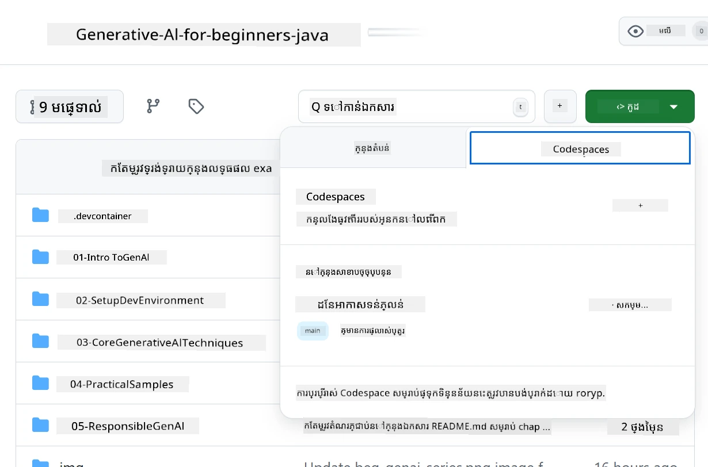

# ការដំឡើងបរិយាកាសអភិវឌ្ឍន៍សម្រាប់ Azure OpenAI

> **ចាប់ផ្តើមយ៉ាងរហ័ស**៖ មនុស្សមើលមគ្គុទេសក៍នេះសម្រាប់ការដំឡើង Azure OpenAI។ សម្រាប់ចាប់ផ្តើមភ្លាមជាមួយម៉ូដែលដូចគ្នាឥតគិតថ្លៃ សូមប្រើ [GitHub Models with Codespaces](./README.md#quick-start-cloud) ។

មគ្គុទេសក៍នេះនឹងជួយអ្នកដំឡើងម៉ូដែល Azure AI Foundry សម្រាប់កម្មវិធី Java AI របស់អ្នកក្នុងវគ្គសិក្សានេះ។

## តារាងមាតិកា

- [សង្ខេបការដំណើរការឧបករណ៍យ៉ាងរហ័ស](#សង្ខេបការដំណើរការឧបករណ៍យ៉ាងរហ័ស)
- [ជំហានទី 1: បង្កើតធនធាន Azure AI Foundry](#ជំហានទី-1-បង្កើតធនធាន-azure-ai-foundry)
  - [បង្កើត Hub និង Project](#បង្កើត-hub-និង-project)
  - [ដាក់ប្រើម៉ូដែល GPT-4o-mini](#ដាក់ប្រើម៉ូដែល-gpt-4o-mini)
- [ជំហានទី 2: បង្កើត Codespace របស់អ្នក](#ជំហានទី-2-បង្កើត-codespace-របស់អ្នក)
- [ជំហានទី 3: កំណត់បរិយាកាសរបស់អ្នក](#ជំហានទី-3-កំណត់បរិយាកាសរបស់អ្នក)
- [ជំហានទី 4: សាកល្បងការដំឡើងរបស់អ្នក](#ជំហានទី-4-សាកល្បងការដំឡើងរបស់អ្នក)
- [អ្វីទៅខាងមុខ?](#អ្វីទៅខាងមុខ)
- [ធនធាន](#ធនធាន)
- [ធនធានបន្ថែម](#ធនធានបន្ថែម)

## សង្ខេបការដំណើរការឧបករណ៍យ៉ាងរហ័ស

1. បង្កើតធនធាន Azure AI Foundry (Hub, Project, Model)
2. បង្កើត Codespace ជាមួយឧបករណ៍អភិវឌ្ឍ Java
3. កំណត់ឯកសារ .env របស់អ្នកជាមួយឯកសារសម្ងាត់ Azure OpenAI
4. សាកល្បងការដំឡើងរបស់អ្នកជាមួយគំរូគម្រោង

## ជំហានទី 1: បង្កើតធនធាន Azure AI Foundry

### បង្កើត Hub និង Project

1. ចូលទៅកាន់ [Azure AI Foundry Portal](https://ai.azure.com/) ហើយចុះឈ្មោះចូល
2. ចុច **+ Create** → **New hub** (ឬផ្លាស់ទៅ **Management** → **All hubs** → **+ New hub**)
3. កំណត់កំណត់ Hub របស់អ្នក៖
   - **ឈ្មោះ Hub**៖ ឧទាហរណ៍ "MyAIHub"
   - **ការ​ចុះ​ឈ្មោះ**៖ ជ្រើសរើសការចុះឈ្មោះ Azure របស់អ្នក
   - **ក្រុមធនធាន**៖ បង្កើតថ្មី ឬជ្រើសរើសមានរួច
   - **ទីតាំង**៖ ជ្រើសរើសជិតអ្នកបំផុត
   - **គណនីផ្ទុក**៖ ប្រើលំនាំដើម ឬកំណត់ផ្ទុកផ្ទាល់ខ្លួន
   - **Key vault**៖ ប្រើលំនាំដើម ឬកំណត់ផ្ទាល់ខ្លួន
   - ចុច **Next** → **Review + create** → **Create**
4. បន្ទាប់ពីបង្កើតរួច ចុច **+ New project** (ឬ **Create project** ពីមើលកំពូល Hub)
   - **ឈ្មោះ Project**៖ ឧទាហរណ៍ "GenAIJava"
   - ចុច **Create**

### ដាក់ប្រើម៉ូដែល GPT-4o-mini

1. នៅក្នុង project របស់អ្នក ចូលទៅ **Model catalog** ហើយស្វែងរក **gpt-4o-mini**
   - *ជម្រើសផ្សេងទៀត៖ ទៅ **Deployments** → **+ Create deployment***
2. ចុច **Deploy** នៅលើកាតម៉ូដែល gpt-4o-mini
3. កំណត់រៀបចំការដាក់ប្រើ៖
   - **ឈ្មោះការដាក់ប្រើ**: "gpt-4o-mini"
   - **ជំនាន់ម៉ូដែល**: ប្រើថ្មីបំផុត
   - **ប្រភេទការដាក់ប្រើ**: ស្តង់ដារ
4. ចុច **Deploy**
5. បន្ទាប់ពីដាក់ប្រើរួច ចូលទៅផ្ទៃ **Deployments** ហើយចម្លងតម្លៃទាំងនេះ៖
   - **ឈ្មោះការដាក់ប្រើ** (ឧទាហរណ៍ "gpt-4o-mini")
   - **Target URI** (ឧទាហរណ៍ `https://your-hub-name.openai.azure.com/`)  
      > **សំខាន់**: ចម្លងតែ URL មូលដ្ឋានប៉ុណ្ណោះ (ឧទាហរណ៍ `https://myhub.openai.azure.com/`) មិនត្រូវចម្លងផ្លូវចុងបញ្ចប់ទាំងមូល។
   - **Key** (ពីផ្នែក Keys and Endpoint)

> **នៅតែមានបញ្ហាទេ?** សូមទៅកាន់ឯកសារ [Azure AI Foundry Documentation](https://learn.microsoft.com/azure/ai-foundry/how-to/create-projects?tabs=ai-foundry&pivots=hub-project) ផ្លូវការដើម្បីយល់ច្បាស់ជាងនេះ

## ជំហានទី 2: បង្កើត Codespace របស់អ្នក

1. Fork ឃ្លាំងកូដនេះទៅគណនី GitHub របស់អ្នក  
   > **ចំណាំ**៖ ប្រសិនបើអ្នកចង់កែប្រែកំណត់មូលដ្ឋាន សូមមើល [Dev Container Configuration](../../../.devcontainer/devcontainer.json)
2. នៅក្នុង repo បាន fork ចូលផ្ទាំង **Code** → **Codespaces** tab
3. ចុច **...** → **New with options...**

4. ជ្រើស **Dev container configuration**:  
   - **បរិយាកាសអភិវឌ្ឍន៍ Generative AI Java**
5. ចុច **Create codespace**

## ជំហានទី 3: កំណត់បរិយាកាសរបស់អ្នក

បន្ទាប់ពី Codespace រួចរាល់ សូមដំឡើងគណនីសម្ងាត់ Azure OpenAI របស់អ្នក៖

1. **បើកគំរូគម្រោងពី root នៃ repo:**  
   ```bash
   cd 02-SetupDevEnvironment/examples/basic-chat-azure
   ```

2. **បង្កើតឯកសារ .env របស់អ្នក:**  
   ```bash
   cp .env.example .env
   ```

3. **កែប្រែឯកសារ .env ជាមួយគណនីសម្ងាត់ Azure OpenAI របស់អ្នក:**  
   ```bash
   # កូនសោ API Azure OpenAI របស់អ្នក (ពីព្រលឹត Azure AI Foundry)
   AZURE_AI_KEY=your-actual-api-key-here
   
   # URL ចុងផ្លូវ Azure OpenAI របស់អ្នក (ឧទាហរណ៍, https://myhub.openai.azure.com/)
   AZURE_AI_ENDPOINT=https://your-hub-name.openai.azure.com/
   ```

   > **ចំណាំសុវត្ថិភាព**:  
   > - មិនត្រូវ commit ឯកសារ `.env` ទៅ version control ទេ  
   > - `.env` ត្រូវបានដាក់ក្នុង `.gitignore` រួចហើយ  
   > - រក្សាអោយ API keys មានសុវត្ថិភាព និងប្តូរពួកវាទៀងទាត់

## ជំហានទី 4: សាកល្បងការដំឡើងរបស់អ្នក

បើកកម្មវិធីគំរូដើម្បីធ្វើតេស្តការតភ្ជាប់ Azure OpenAI របស់អ្នក៖

```bash
mvn clean spring-boot:run
```
  
អ្នកគួរតែទទួលបានការឆ្លើយតបពីម៉ូដែល GPT-4o-mini!

> **អ្នកប្រើប្រាស់ VS Code**: អ្នកអាចចុច `F5` នៅ VS Code ដើម្បីរត់កម្មវិធីផងដែរ។ ការកំណត់ launch ត្រូវបានរៀបចំរួចហើយដើម្បីផ្ទុកឯកសារ `.env` ដោយស្វ័យប្រវត្តិ។

> **គំរូពេញលេញ**: សូមមើល [End-to-End Azure OpenAI Example](./examples/basic-chat-azure/README.md) សម្រាប់ការណែនាំលម្អិត និងការដោះស្រាយបញ្ហា។

## អ្វីទៅខាងមុខ?

**ការដំឡើងត្រូវបានបញ្ចប់!** ឥឡូវនេះអ្នកមាន៖
- Azure OpenAI ជាមួយ gpt-4o-mini បានដាក់ប្រើ
- កំណត់ឯកសារ .env នៅក្នុងម៉ាស៊ីនភាគី
- បរិយាកាសអភិវឌ្ឍ Java ត្រៀមរួច

**បន្តទៅ** [ជំពូក 3: បច្ចេកវិទ្យា Generative AI ផ្នែកមូលដ្ឋាន](../03-CoreGenerativeAITechniques/README.md) ដើម្បីចាប់ផ្តើមបង្កើតកម្មវិធី AI!

## ធនធាន

- [ឯកសារ Azure AI Foundry](https://learn.microsoft.com/azure/ai-services/)
- [ឯកសារ Spring AI Azure OpenAI](https://docs.spring.io/spring-ai/reference/api/clients/azure-openai-chat.html)
- [Azure OpenAI Java SDK](https://learn.microsoft.com/java/api/overview/azure/ai-openai-readme)

## ធនធានបន្ថែម

- [ទាញយក VS Code](https://code.visualstudio.com/Download)
- [ទាញយក Docker Desktop](https://www.docker.com/products/docker-desktop)
- [Dev Container Configuration](../../../.devcontainer/devcontainer.json)

---

<!-- CO-OP TRANSLATOR DISCLAIMER START -->
**ការបដិសេធ**៖
ឯកសារនេះត្រូវបានបកប្រែដោយប្រើសេវាកម្មបកប្រែ AI [Co-op Translator](https://github.com/Azure/co-op-translator)។ ខណៈពេលដែលយើងខំប្រឹងប្រែងសម្រាប់ភាពត្រឹមត្រូវ សូមយកចិត្តទុកដាក់ថាការបកប្រែដោយស្វ័យប្រវត្តិអាចមានកំហុស ឬភាពមិនត្រឹមត្រូវ។ ឯកសារដើមភាសាជាតិគួរត្រូវបានពិចារណា ជាមូលដ្ឋានសំខាន់។ សម្រាប់ព័ត៌មានសំខាន់ ជំនាន់បកប្រែមនុស្សវិជ្ជាជីវៈត្រូវបានណែនាំ។ យើងមិនទទួលខុសត្រូវចំពោះការយល់ច្រឡំហ ឬការបកប្រែខុសៗណាមួយដែលកើតឡើងពីការប្រើប្រាស់ការបកប្រែនេះទេ។
<!-- CO-OP TRANSLATOR DISCLAIMER END -->