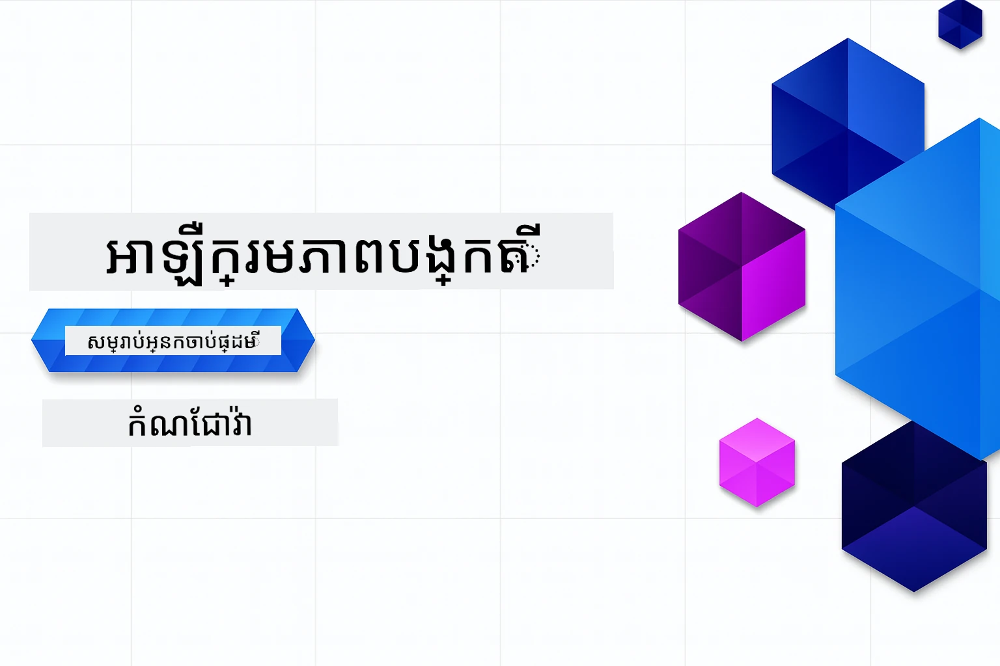

# បញ្ចេញ AI សម្រាប់អ្នកចាប់ផ្តើម - លេខ Java
[](https://discord.gg/nTYy5BXMWG)



**ការបង់ពេលវេលា**៖ វគ្គបណ្ដុំនេះអាចបញ្ចប់តាមអ៊ិនធឺណិតដោយគ្មានការតម្លើងក្នុងតំបន់។ ការតម្លើងបរិយាកាសយកពេល ២ នាទី ខណៈពេលការស្វែងរកគំរូទាមទារពេល ១-៣ ម៉ោងបណ្ដាលពីជម្រៅនៃការស្វែងរក។

> **ចាប់ផ្តើមយ៉ាងរហ័ស** 

1. Fork ទីតាំងនេះទៅគណនី GitHub របស់អ្នក
2. ចុច **Code** → **Codespaces** តាប → **...** → **New with options...**
3. ប្រើកំណត់លំនាំដើម – វានឹងជ្រើសរើស Development container ដែលបានបង្កើតសម្រាប់វគ្គនេះ
4. ចុច **Create codespace**
5. រង់ចាំ ~2 នាទី រហូតដល់បរិយាកាសរួចរាល់
6. ទៅត្រង់ [ឧទាហរណ៍ដំបូង](./02-SetupDevEnvironment/README.md#step-2-create-a-github-personal-access-token)

## ការគាំទ្រ​ភាសាច្រើន

### គាំទ្រដោយ GitHub Action (ស្វ័យប្រវត្តិ និងទាន់សម័យជានិច្ច)

<!-- CO-OP TRANSLATOR LANGUAGES TABLE START -->
[អារ៉ាប់](../ar/README.md) | [បង់ហ្គោលី](../bn/README.md) | [ប៊ុលហ្គេរី](../bg/README.md) | [ភាសាម៉្យាន់ម៉ា (ភូមា)](../my/README.md) | [ចិន (ផ្នែកសាមញ្ញ)](../zh-CN/README.md) | [ចិន (ប្រពៃណី ហុងកុង)](../zh-HK/README.md) | [ចិន (ប្រពៃណី ម៉ាកាវ)](../zh-MO/README.md) | [ចិន (ប្រពៃណី តៃវ៉ាន់)](../zh-TW/README.md) | [ក្រូយ៉ូម៉ាក់](../hr/README.md) | [ឆេទ](../cs/README.md) | [ដាណូយ៉ា](../da/README.md) | [ណូយ៉ែរ](../nl/README.md) | [អេស្ដូនីយ៉ា](../et/README.md) | [ហ្វិនឡង់](../fi/README.md) | [បារាំង](../fr/README.md) | [អាល្លឺម៉ង់](../de/README.md) | [ក្រិក](../el/README.md) | [ហេប្រ៊ូ](../he/README.md) | [ហិណ្ឌិ](../hi/README.md) | [ហាំងការី](../hu/README.md) | [ឥណ្ឌូនេស៊ី](../id/README.md) | [អ៊ីតាលី](../it/README.md) | [ជប៉ុន](../ja/README.md) | [កណ្ណាដា](../kn/README.md) | [ខ្មែរ](./README.md) | [កូរ៉េ](../ko/README.md) | [លីទូវ៉ានី](../lt/README.md) | [ម៉ាឡ័យ](../ms/README.md) | [ម៉ាឡាឡាម](../ml/README.md) | [មរា áទី](../mr/README.md) | [ណេប៉ាល់](../ne/README.md) | [ភីជិន នីហ្សេរីយ៉ា](../pcm/README.md) | [ណ័រ៉េហ្គ្យច](../no/README.md) | [ព៊ែស៊ី (ហ្វារី)](../fa/README.md) | [បូឡូញ](../pl/README.md) | [ព័រទុយហ្គីស (ប្រេស៊ីល)](../pt-BR/README.md) | [ព័រទុយហ្គីស (ព័រទុយហ្គាល់)](../pt-PT/README.md) | [ភ្នំពេញ (គឺរមុខី)](../pa/README.md) | [រ៉ូម៉ានី](../ro/README.md) | [រុស្សី](../ru/README.md) | [សើបៀន (ស៊ីរីលិច)](../sr/README.md) | [ស្ឡូវ៉ាក់](../sk/README.md) | [ស្ឡូវីនី](../sl/README.md) | [អ្នកស្ប៉ាញ](../es/README.md) | [ស្វាហ៊ីលី](../sw/README.md) | [ស៊ុយអែត](../sv/README.md) | [តាហ្គាឡុក (ហ្វីលីពីន)](../tl/README.md) | [តាមីល](../ta/README.md) | [តេលូហ្គូ](../te/README.md) | [ថៃ](../th/README.md) | [ទួរគី](../tr/README.md) | [អ៊ុយក្រែន](../uk/README.md) | [អ៊ឺដូ](../ur/README.md) | [វៀតណាម](../vi/README.md)

> **ចង់ទាញចម្លងនៅក្នុងតំបន់មែនទេ?**
>
> តំណទីនេះមានការប្រែជាភាសា ៥០+ ដែលបង្កើនទំហំទាញយកយ៉ាងខ្លាំង។ ដើម្បីចម្លងដោយគ្មានការប្រែភាសា សូមប្រើ sparse checkout:
>
> **Bash / macOS / Linux:**
> ```bash
> git clone --filter=blob:none --sparse https://github.com/microsoft/Generative-AI-for-beginners-java.git
> cd Generative-AI-for-beginners-java
> git sparse-checkout set --no-cone '/*' '!translations' '!translated_images'
> ```
>
> **CMD (Windows):**
> ```cmd
> git clone --filter=blob:none --sparse https://github.com/microsoft/Generative-AI-for-beginners-java.git
> cd Generative-AI-for-beginners-java
> git sparse-checkout set --no-cone "/*" "!translations" "!translated_images"
> ```
>
> វានេះនឹងផ្តល់អ្វីដែលអ្នកត្រូវការ ដើម្បីបញ្ចប់វគ្គបានយ៉ាងរហ័សជាងមុន។
<!-- CO-OP TRANSLATOR LANGUAGES TABLE END -->

## រចនាសម្ព័ន្ធវគ្គ និងផ្លូវការរៀន

### **ជំពូកទី ១៖ ការណែនាំអំពីបញ្ចេញ AI**
- **មូលដ្ឋានគំនិត**៖ ការយល់ដឹងអំពីម៉ូឌែលភាសាធំៗ, តួអក្សរ, embeddings, និងសមត្ថភាព AI
- **បរិស្ថាន AI ទី Java**៖ ការមើលទូទៅអំពី Spring AI និង OpenAI SDKs
- **ប្រព័ន្ធ Model Context Protocol**៖ ការណែនាំ MCP និងតួនាទីរបស់វាក្នុងការទំនាក់ទំនងភ្នាក់ងារ AI
- **ការអនុវត្តជាក់ស្តែង**៖ ស្ថានភាពពិតរួមទាំង chatbot និងការបង្កើតមាតិកា
- **[→ ចាប់ផ្តើមជំពូក ១](./01-IntroToGenAI/README.md)**

### **ជំពូកទី ២៖ ការតម្លើងបរិយាកាសអភិវឌ្ឍន៍**
- **ការកំណត់រចនាសម្ព័ន្ធអ្នកផ្គត់ផ្គង់ច្រើន**៖ ការតម្លើង GitHub Models, Azure OpenAI និងការរួមបញ្ចូល OpenAI Java SDK
- **Spring Boot + Spring AI**៖ វិធីល្អបំផុតសម្រាប់អភិវឌ្ឍកម្មវិធី AI សម្រាប់សហគ្រាស
- **GitHub Models**៖ ដំណើរការ AI មូឌែលឥតគិតថ្លៃសម្រាប់ prototyping និងការសិក្សា (មិនចាំបាច់មានកាតឥណទាន)
- **ឧបករណ៍អភិវឌ្ឍន៍**៖ កុងតឺនឺ Docker, VS Code និងការកំណត់ GitHub Codespaces
- **[→ ចាប់ផ្តើមជំពូក ២](./02-SetupDevEnvironment/README.md)**

### **ជំពូកទី ៣៖ បច្ចេកទេសបញ្ចេញ AI បើកចំហ**
- **សិល្បៈ Prompt Engineering**៖ បច្ចេកទេសសម្រាប់ឆ្លើយតបល្អបំផុតពីម៉ូឌែល AI
- **Embeddings និងប្រតិបត្ដិវិធីវ៉ិចទ័រ**៖ អនុវត្តការស្វែងរកបទបន្ថែម និងការប្រៀបធៀបស្រដៀងគ្នា
- **Retrieval-Augmented Generation (RAG)**៖ រួមបញ្ចូល AI ជាមួយប្រភពទិន្នន័យផ្ទាល់ខ្លួនរបស់អ្នក
- **Function Calling**៖ បន្ថែមសមត្ថភាព AI ជាមួយឧបករណ៍ និងផ្លុយអ៊ិនផ្ទាល់ខ្លួន
- **[→ ចាប់ផ្តើមជំពូក ៣](./03-CoreGenerativeAITechniques/README.md)**

### **ជំពូកទី ៤៖ ការអនុវត្តជាក់ស្តែង និងគម្រោង**
- **កម្មវិធីបង្កើតរឿងពីសត្វចិញ្ចឹម** (`petstory/`)៖ ការបង្កើតមាតិកាប្រកបដោយភាពច្នៃប្រឌិតជាមួយ GitHub Models
- **Foundry Local Demo** (`foundrylocal/`)៖ ការរួមបញ្ចូលម៉ូឌែល AI ក្នុងតំបន់ជាមួយ OpenAI Java SDK
- **សេវាកម្មគណនាគោល MCP** (`calculator/`)៖ ការអនុវត្ត Model Context Protocol មូលដ្ឋានជាមួយ Spring AI
- **[→ ចាប់ផ្តើមជំពូក ៤](./04-PracticalSamples/README.md)**

### **ជំពូកទី ៥៖ ការអភិវឌ្ឍ AI មានចិត្តទុកដាក់**
- **សុវត្ថិភាព GitHub Models**៖ សាកល្បងការបន្ដយមាតិកានិងយន្តការសុវត្ថិភាពបញ្ចូល (ការរារាំងយ៉ាងខ្លាំង និងការបដិសេធយ៉ាងទន់)
- **កម្មវិធីសម្តែងមានចិត្តទុកដាក់ AI**៖ ឧទាហរណ៍ដៃគូបង្ហាញពីការដំណើរការបច្ចេកទេសសុវត្ថិភាព AI សម័យទំនើប
- **ជំនួយល្អបំផុត**៖ មេរៀនសម្រាប់ការអភិវឌ្ឍន៍ និងដាក់បញ្ចូល AI ដោយមានការគោរពក្រមក្របខ័ណ្ឌ
- **[→ ចាប់ផ្តើមជំពូក ៥](./05-ResponsibleGenAI/README.md)**

## ធនធានបន្ថែម

<!-- CO-OP TRANSLATOR OTHER COURSES START -->
### LangChain
[](https://aka.ms/langchain4j-for-beginners)
[](https://aka.ms/langchainjs-for-beginners?WT.mc_id=m365-94501-dwahlin)
[](https://github.com/microsoft/langchain-for-beginners?WT.mc_id=m365-94501-dwahlin)
---

### Azure / Edge / MCP / Agents
[](https://github.com/microsoft/AZD-for-beginners?WT.mc_id=academic-105485-koreyst)
[](https://github.com/microsoft/edgeai-for-beginners?WT.mc_id=academic-105485-koreyst)
[](https://github.com/microsoft/mcp-for-beginners?WT.mc_id=academic-105485-koreyst)
[](https://github.com/microsoft/ai-agents-for-beginners?WT.mc_id=academic-105485-koreyst)

---
 
### ស៊េរីបញ្ចេញ AI
[](https://github.com/microsoft/generative-ai-for-beginners?WT.mc_id=academic-105485-koreyst)
[-9333EA?style=for-the-badge&labelColor=E5E7EB&color=9333EA)](https://github.com/microsoft/Generative-AI-for-beginners-dotnet?WT.mc_id=academic-105485-koreyst)
[-C084FC?style=for-the-badge&labelColor=E5E7EB&color=C084FC)](https://github.com/microsoft/generative-ai-for-beginners-java?WT.mc_id=academic-105485-koreyst)
[-E879F9?style=for-the-badge&labelColor=E5E7EB&color=E879F9)](https://github.com/microsoft/generative-ai-with-javascript?WT.mc_id=academic-105485-koreyst)

---
 
### ការសិក្សាគោល
[](https://aka.ms/ml-beginners?WT.mc_id=academic-105485-koreyst)
[](https://aka.ms/datascience-beginners?WT.mc_id=academic-105485-koreyst)
[](https://aka.ms/ai-beginners?WT.mc_id=academic-105485-koreyst)
[](https://github.com/microsoft/Security-101?WT.mc_id=academic-96948-sayoung)

[](https://aka.ms/webdev-beginners?WT.mc_id=academic-105485-koreyst)
[](https://aka.ms/iot-beginners?WT.mc_id=academic-105485-koreyst)
[](https://github.com/microsoft/xr-development-for-beginners?WT.mc_id=academic-105485-koreyst)

---
 
### ស៊េរី Copilot
[](https://aka.ms/GitHubCopilotAI?WT.mc_id=academic-105485-koreyst)
[](https://github.com/microsoft/mastering-github-copilot-for-dotnet-csharp-developers?WT.mc_id=academic-105485-koreyst)
[](https://github.com/microsoft/CopilotAdventures?WT.mc_id=academic-105485-koreyst)
<!-- CO-OP TRANSLATOR OTHER COURSES END -->

## ទទួលបានជំនួយ

បើអ្នកត្រូវបានឃ្លាប់ឬមានសំនួរណាមួយអំពីការបង្កើតកម្មវិធី AI។ ចូលរួមជាមួយនិស្សិត និងអ្នកអភិវឌ្ឍដែលមានបទពិសោធន៍ក្នុងការពិភាក្សាអំពី MCP។ វាជាសហគមន៍គាំទ្រដែលសំណួរត្រូវបានស្វាគមន៍ និងចែករំលែកចំណេះដឹងដោយរៀបរាប់ដោយសេរី។

[](https://discord.gg/nTYy5BXMWG)

បើអ្នកមានមតិយោបល់អំពីផលិតផល ឬកំហុសខណៈពេលកសាង សូមចូលទៅកាន់៖

[](https://aka.ms/foundry/forum)

---

<!-- CO-OP TRANSLATOR DISCLAIMER START -->
**ការបដិសេធ**៖  
ឯកសារនេះត្រូវបានបកប្រែដោយប្រើសេវាកម្មបកប្រែ AI [Co-op Translator](https://github.com/Azure/co-op-translator)។ ទោះយើងខំប្រឹងសម្រាប់ភាពត្រឹមត្រូវ ក៏សូមជ្រាបថាការបកប្រែដោយស្វ័យប្រវត្តិនោះអាចមានកំហុសឬភាពមិនត្រឹមត្រូវ។ ឯកសារដើមជាភាសាមាតុភាសាត្រូវបានគេចាត់ទុកជាប្រភពផ្លូវការជាងគេ។ សម្រាប់ព័ត៌មានទាក់ទាញសំខាន់ គួរតែប្រើការបកប្រែដោយអ្នកជំនាញមនុស្ស។ យើងមិនទទួលខុសត្រូវចំពោះការយល់ច្រឡំ ឬការបកស្រាយខុសប្រសិនបើមានចេញពីការប្រើប្រាស់ការបកប្រែនេះទេ។
<!-- CO-OP TRANSLATOR DISCLAIMER END -->