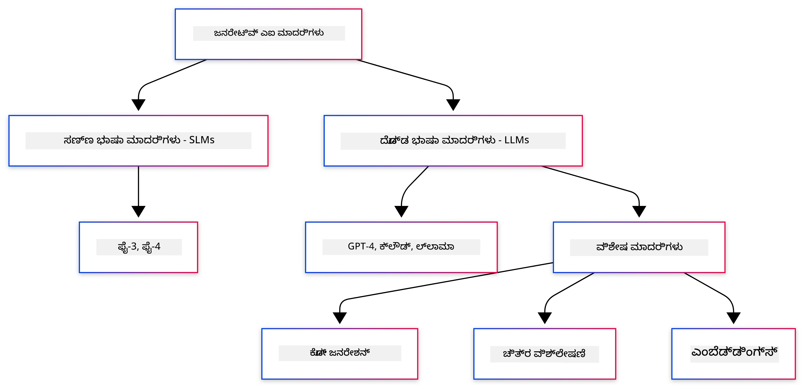
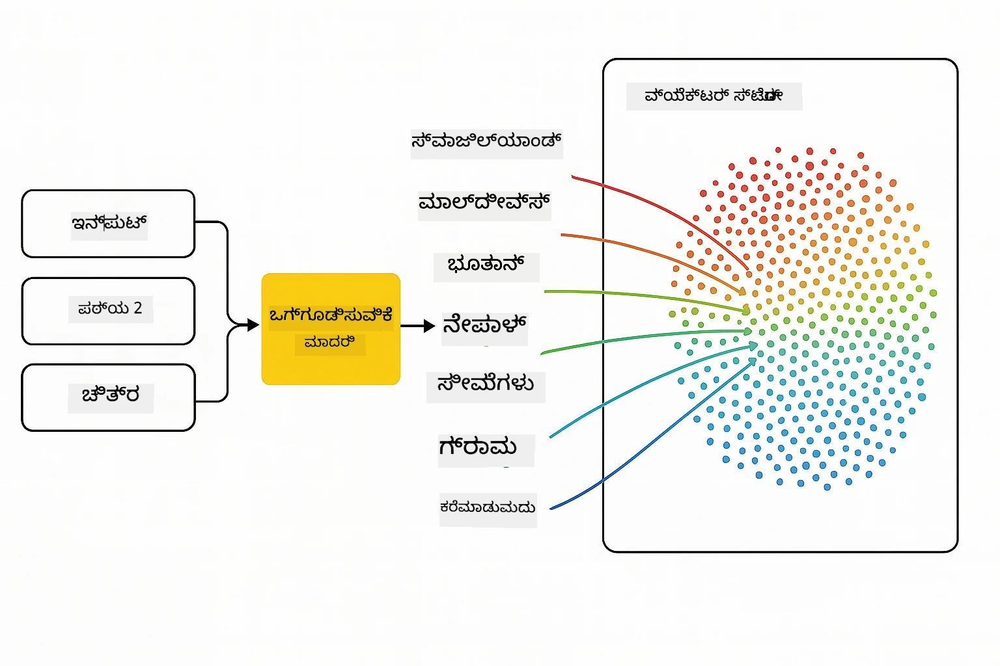
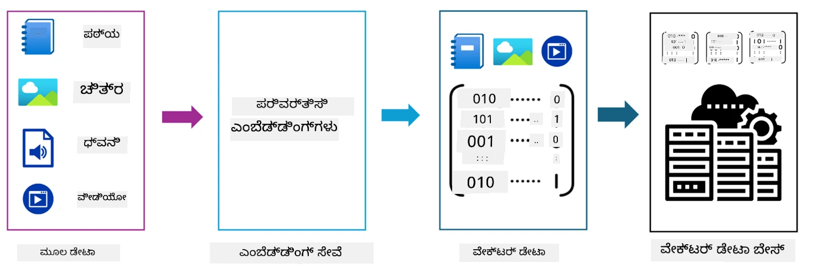
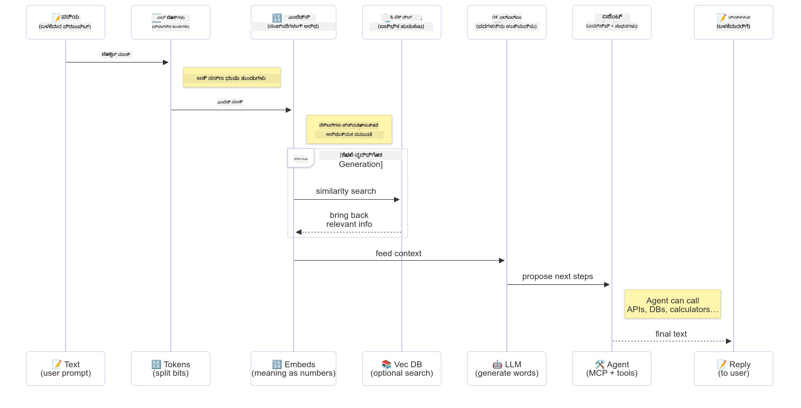

# ಜನರೇಟಿವ್ AI ಗೆ ಪರಿಚಯ - ಜಾವಾ ಆವೃತ್ತಿ

> **ವಿಡಿಯೋ**: [ಈ ಪಾಠದ ಒಂದು ವೀಡಿಯೊ ಅವಲೋಕನವನ್ನು YouTube ನಲ್ಲಿ ವೀಕ್ಷಿಸಿ.](https://www.youtube.com/watch?v=XH46tGp_eSw) ನೀವು ಮೇಲಿನ ಥಂಬ್‌ನೆಲ್ ಚಿತ್ರವನ್ನು ಸಹ ಕ್ಲಿಕ್ ಮಾಡಬಹುದು.

## ನೀವು ಏನೆಲ್ಲಾ ಕಲಿಯುತ್ತೀರಿ

- **ಜನರೇಟಿವ್ AI ಮೂಲಭೂತಗಳು** ದ್ಯಂತ LLMಗಳ, ಪ್ರಾಂಪ್ಟ್ ಎಂಜಿನಿಯರಿಂಗ್, ಟೋಕನ್ಗಳು, ಎಂಬೆಡ್ಡಿಂಗ್ಸ್, ಮತ್ತು ವ್ಯಕ್ಟರ್ ಡೇಟಾಬೇಸ್ಗಳ ವಿಷಯಗಳು
- **ಜಾವಾ AI ಅಭಿವೃದ್ಧಿ ಸಾಧನಗಳನ್ನು ಹೋಲಿಕೆ** Azure OpenAI SDK, Spring AI, ಮತ್ತು OpenAI Java SDK ಸೇರಿದಂತೆ
- **ಮಾಡಲ್ ಕಾಂಟೆಕ್ಸ್ಟ್ ಪ್ರೋಟೋಕಾಲ್ ಅನ್ನು ಗುರುತಿಸಿ** ಮತ್ತು ಅದು AI ಏಜೆಂಟ್ಗಳ ಸಂವಹನದಲ್ಲಿ 하는 ಪಾತ್ರ

## ವಿಷಯಪಟ್ಟಿ

- [ಪರಿಚಯ](#ಪರಿಚಯ)
- [ಜನರೇಟಿವ್ AI ಅಂಶಗಳ ವೇಗದ ದೃಷ್ಟಿ](#ಜನರೇಟಿವ್-ai-ಅಂಶಗಳ-ವೇಗದ-ದೃಷ್ಟಿ)
- [ಪ್ರಾಂಪ್ಟ್ ಎಂಜಿನಿಯರಿಂಗ್ ವಿಮರ್ಶೆ](#ಪ್ರಾಂಪ್ಟ್-ಎಂಜಿನಿಯರಿಂಗ್-ವಿಮರ್ಶೆ)
- [ಟೋಕನ್ಗಳು, ಎಂಬೆಡ್ಡಿಂಗ್ಸ್, ಮತ್ತು ಏಜೆಂಟ್ಗಳು](#ಟೋಕನ್ಗಳು-ಎಂಬೆಡ್ಡಿಂಗ್ಸ್-ಮತ್ತು-ಏಜೆಂಟ್‌ಗಳು)
- [ಜಾವಾಸ್ಕ್ರಿಪ್ಟ್ AI ಅಭಿವೃದ್ಧಿ ಉಪಕರಣಗಳು ಮತ್ತು ಗ್ರಂಥಾಲಯಗಳು](#ಜಾವಾಗಾಗಿ-ai-ಅಭಿವೃದ್ಧಿ-ಸಾಧನಗಳು-ಮತ್ತು-ಗ್ರಂಥಾಲಯಗಳು)
  - [OpenAI ಜಾವಾ SDK](#openai-java-sdk)
  - [Spring AI](#spring-ai)
  - [Azure OpenAI ಜಾವಾ SDK](#azure-openai-java-sdk)
- [ಸಾರಾಂಶ](#ಸಾರಾಂಶ)
- [ಮುಂದಿನ ಹಂತಗಳು](#ಮುಂದಿನ-ಹಂತಗಳು)

## ಪರಿಚಯ

ಜನರೇಟಿವ್ AI ಪ್ರಾರಂಭಿಕರಿಗಾಗಿ ಮೊದಲ ಅಧ್ಯಾಯಕ್ಕೆ ಸ್ವಾಗತ! ಈ ಮೂಲಭೂತ ಪಾಠವು ಜನರೇಟಿವ್ AI ಯ ಮುಖ್ಯ ಅಂಶಗಳನ್ನು ಮತ್ತು ಜಾವಾ ಬಳಸಿ ಅವುಗಳೊಂದಿಗೆ ಹೇಗೆ ಕೆಲಸ ಮಾಡುವುದನ್ನು ನಿಮ್ಮಿಗೆ ಪರಿಚಯಿಸುತ್ತದೆ. ನೀವು AI ಅನ್ವಯಿಕೆಗಳ ಅಗತ್ಯ ಮೂಲಭೂತ ಅಂಶಗಳನ್ನು ಕಲಿಯುತ್ತೀರಿ, ದ್ಯಂತ ದೊಡ್ಡ ಭಾಷಾ ಮಾದರಿಗಳು (LLMs), ಟೋಕನ್ಗಳು, ಎಂಬೆಡ್ಡಿಂಗ್ಸ್, ಮತ್ತು AI ಏಜೆಂಟ್ಗಳು. ಈ ಕೋರ್ಸ್ ಅನ್ನು ಪೂರೈಸುವಾಗ ನೀವು ಬಳಸುವ ಪ್ರಾಥಮಿಕ ಜಾವಾ ಉಪಕರಣಗಳನ್ನೂ ನಾವು ಪರಿಶೀಲಿಸುತ್ತೇವೆ.

### ಜನರೇಟಿವ್ AI ಅಂಶಗಳ ವೇಗದ ದೃಷ್ಟಿ

ಜನರೇಟಿವ್ AI ಎಂಬುದು ಹೊಸ ವಿಷಯವನ್ನು ಸೃಷ್ಟಿಸುವ ಕೃತಕ ಬುದ್ಧಿಮತ್ತೆಯಾಗಿದ್ದು, ಉದಾಹರಣೆಗೆ ಪಠ್ಯ, ಚಿತ್ರಗಳು, ಅಥವಾ ಕೋಡ್, ಇದು ಡೇಟಾದಿಂದ ಕಲಿತ ಮಾದರಿಗಳು ಮತ್ತು ಸಂಬಂಧಗಳ ಆಧಾರದ ಮೇಲೆ ಆಗುತ್ತದೆ. ಜನರೇಟಿವ್ AI ಮಾದರಿಗಳು ಮಾನವರಂತೆಯೇ ಪ್ರತಿಕ್ರಿಯೆಗಳನ್ನು ರಚಿಸಬಹುದು, ಸನ್ನಿವೇಶವನ್ನು ಅರ್ಥಮಾಡಿಕೊಳ್ಳಬಹುದು, ಮತ್ತು ಕೆಲವೊಮ್ಮೆ ಮಾನವರಂತೆಯೇ ಕಾಣುವ ವಿಷಯವನ್ನು ಸೃಜನಾತ್ಮಕವಾಗಿ ತಯಾರಿಸಬಹುದು.

ನೀವು ನಿಮ್ಮ ಜಾವಾ AI ಅನ್ವಯಿಕೆಗಳನ್ನು ಅಭಿವೃದ್ಧಿಪಡಿಸುವಾಗ, ನೀವು **ಜನರೇಟಿವ್ AI ಮಾದರಿಗಳನ್ನು** ವಿಷಯ ರಚನೆಗೆ ಬಳಕೆಮಾಡುತ್ತೀರಿ. ಜನರೇಟಿವ್ AI ಮಾದರಿಗಳ ಕೆಲವು ಶಕ್ತಿಗಳು ಸಾಮಾನ್ಯತಃ ಅವುವು:

- **ಪಠ್ಯ ಸೃಷ್ಟಿ**: ಚಾಟ್‌ಬಾಟ್‌ಗಳು, ವಿಷಯ, ಮತ್ತು ಪಠ್ಯ ಪೂರ್ಣಗೊಳಿಸಲು ಮಾನವರಂತೆಯೇ ಪಠ್ಯ ರಚಿಸುವುದು.
- **ಚಿತ್ರ ಸೃಷ್ಟಿ ಮತ್ತು ವಿಶ್ಲೇಷಣೆ**: ವಾಸ್ತವಿಕ ಚಿತ್ರಗಳನ್ನು ತಯಾರಿಸುವುದು, ಫೋಟೋಗಳನ್ನು ಸುಧಾರಿಸುವುದು, ಮತ್ತು ವಸ್ತುಗಳನ್ನು ಪತ್ತೆ ಮಾಡುವುದು.
- **ಕೋಡ್ ರಚನೆ**: ಕೋಡ್ ಸ್ನಿಪೆಟ್ಸ್ ಅಥವಾ ಸ್ಕ್ರಿಪ್ಟ್ ಬರೆವುದಕ್ಕೆ.

ವಿವಿಧ ಕಾರ್ಯಗಳಿಗೆ ಅತ್ಯುತ್ತಮೀಕೃತ ಮಾದರಿಗಳ ವಿಭಿನ್ನ ಪ್ರಕಾರಗಳಿವೆ. ಉದಾಹರಣೆಗೆ, **ಸಣ್ಣ ಭಾಷಾ ಮಾದರಿಗಳು (SLMs)** ಮತ್ತು **ದೊಡ್ಡ ಭಾಷಾ ಮಾದರಿಗಳು (LLMs)** ಎರಡೂ ಪಠ್ಯ ಸೃಷ್ಟಿ ಕಾರ್ಯವನ್ನು ನಿರ್ವಹಿಸಬಹುದು, ಪ್ರತಿಷ್ಠಿತ ಫಲಿತಾಂಶಕ್ಕಾಗಿ LLM ಗಳು ಉತ್ತಮ ಪ್ರದರ್ಶನ ನೀಡುತ್ತವೆ. ಚಿತ್ರ ಸಂಬಂಧಿತ ಕಾರ್ಯಗಳಿಗೆ ನಿಮಗೆ ವಿಶಿಷ್ಟ ದೃಷ್ಟಿ ಮಾದರಿಗಳು ಅಥವಾ ಬಹುಮಾದರೀಯ ಮಾದರಿಗಳು ಬೇಕಾಗುತ್ತವೆ.

ತಕ್ಕಮಟ್ಟಿಗೆ ಪ್ರತಿಕ್ರಿಯೆಗಳು ಇದೆಯೆಂದಲ್ಲ. ನೀವು "ಮಾಡல்கள் ಹಲ್ಲುಸಿನೇಟ್ ಮಾಡಲು" ಅಥವಾ ಅಧಿಕೃತ ರೀತಿಯಲ್ಲಿ ತಪ್ಪು ಮಾಹಿತಿಯನ್ನು ಉತ್ಪಾದಿಸಲು ಸಾಧ್ಯವಿದೆ ಎಂದು ಕೇಳಿದ್ದೀರಾ. ಆದರೆ ನೀವು ಮಾದರಿಯನ್ನು ಸ್ಪಷ್ಟ ಸೂಚನೆ ಮತ್ತು ಸನ್ನಿವೇಶವನ್ನು ನೀಡುವ ಮೂಲಕ ಉತ್ತಮ ಪ್ರತಿಕ್ರಿಯೆಗಳಿಗಾಗಿ ಮಾರ್ಗದರ್ಶನ ಮಾಡಬಹುದು. ಇದಾಗಿದ್ದು **ಪ್ರಾಂಪ್ಟ್ ಎಂಜಿನಿಯರಿಂಗ್** ಸ್ಥಾನ.

#### ಪ್ರಾಂಪ್ಟ್ ಎಂಜಿನಿಯರಿಂಗ್ ವಿಮರ್ಶೆ

ಪ್ರಾಂಪ್ಟ್ ಎಂಜಿನಿಯರಿಂಗ್ ಎಂದರೆ ಇಚ್ಛಿತ ಉತ್ಪನ್ನಗಳಿಗಾಗಿಯೂ AI ಮಾದರಿಗಳನ್ನು ಮಾರ್ಗದರ್ಶನ ಮಾಡಲು ಪರಿಣಾಮಕಾರಿ ಇನ್ಪುಟ್‌ಗಳನ್ನು ವಿನ್ಯಾಸ ಮಾಡುವ ಅಭ್ಯಾಸವಾಗಿದೆ. ಇದರ ಅಂಶಗಳು:

- **ಸ್ಪಷ್ಟತೆ**: ಸೂಚನೆಗಳನ್ನು ಸ್ಪಷ್ಟ ಹಾಗೂ ಅನುತೃಪ್ತಿಕರವಾಗಿರಿಸುವುದು.
- **ಸನ್ನಿವೇಶ**: ಅಗತ್ಯ ಹಿನ್ನೆಲೆ ಮಾಹಿತಿ ಒದಗಿಸುವುದು.
- **ನಿಯಮಗಳು**: ಯಾವುದೇ ಮಿತಿ ಅಥವಾ ಛಂದೋದ್ಯಮವನ್ನು ನಿರ್ಧರಿಸುವುದು.

ಪ್ರಾಂಪ್ಟ್ ಎಂಜಿನಿಯರಿಂಗ್ ಸುಧಾರಿತ ಅಭ್ಯಾಸಗಳಲ್ಲಿವೆ, ಉದಾಹರಣೆಗೆ ಪ್ರಾಂಪ್ಟ್ ವಿನ್ಯಾಸ, ಸ್ಪಷ್ಟ ಸೂಚನೆಗಳು, ಕಾರ್ಯ ವಿಭಜನೆ, ಒನ್-ಶಾಟ್ ಮತ್ತು ಫ್ಯೂ-ಶಾಟ್ ಕಲಿಕೆ, ಮತ್ತು ಪ್ರಾಂಪ್ಟ್ ಟ್ಯೂನಿಂಗ್. ನಿಮ್ಮ ವಿಶೇಷ ಉಪಯೋಗಕೇಸುಗಳಿಗೆ ಯಾವುದು ಉತ್ತಮ ಎಂದು ಕಂಡುಹಿಡಿಯಲು ವಿಭಿನ್ನ ಪ್ರಾಂಪ್ಟ್‌ಗಳನ್ನು ಪರೀಕ್ಷಿಸುವುದು ಅಗತ್ಯ.

ಅಪ್ಲಿಕೇಶನ್‌ಗಳನ್ನು ಅಭಿವೃದ್ಧಿಪಡಿಸುವಾಗ, ನೀವು ಬೇರೆಬೇರೆ ಪ್ರಾಂಪ್ಟ್ ಪ್ರಕಾರಗಳನ್ನು ಹೊಂದಿರುತ್ತೀರಿ:
- **ಸಿಸ್ಟಮ್ ಪ್ರಾಂಪ್ಟ್‌ಗಳು**: ಮಾದರಿಯ ವರ್ತನೆಗೆ ಮೂಲ ನಿಯಮಗಳು ಮತ್ತು ಸನ್ನಿವೇಶವನ್ನು ಸೆಟ್ ಮಾಡುತ್ತವೆ
- **ಬಳಕೆದಾರ ಪ್ರಾಂಪ್ಟ್‌ಗಳು**: ನಿಮ್ಮ ಅಪ್ಲಿಕೇಶನ್ ಬಳಕೆದಾರರಿಂದ ಬರುವ ಇನ್ಪುಟ್ ಡೇಟಾ
- **ಸಹಾಯಕ ಪ್ರಾಂಪ್ಟ್‌ಗಳು**: ಸಿಸ್ಟಮ್ ಮತ್ತು ಬಳಕೆದಾರ ಪ್ರಾಂಪ್ಟ್ ಆಧಾರಿತ ಮಾದರಿಯ ಪ್ರತಿಕ್ರಿಯೆಗಳು

> **ಹೆಳ್ಳಿಕೊಳ್ಳಿ ಇನ್ನಷ್ಟು**: [ಜನರೇಟಿವ್ AI ಪ್ರಾರಂಭಿಕರಿಗೆ ಪ್ರಾಂಪ್ಟ್ ಎಂಜಿನಿಯರಿಂಗ್ ಅಧ್ಯಾಯದಲ್ಲಿ ಇನ್ನಷ್ಟು ತಿಳಿದುಕೊಳ್ಳಿ](https://github.com/microsoft/generative-ai-for-beginners/tree/main/04-prompt-engineering-fundamentals)

#### ಟೋಕನ್ಗಳು, ಎಂಬೆಡ್ಡಿಂಗ್ಸ್, ಮತ್ತು ಏಜೆಂಟ್‌ಗಳು

ಜನರೇಟಿವ್ AI ಮಾದರಿಗಳನ್ನು ಬಳಸುವಾಗ, ನೀವು **ಟೋಕನ್ಗಳು**, **ಎಂಬೆಡ್ಡಿಂಗ್ಸ್**, **ಏಜೆಂಟ್‌ಗಳು**, ಮತ್ತು **ಮಾಡಲ್ ಕಾಂಟೆಕ್ಸ್ಟ್ ಪ್ರೋಟೋಕಾಲ್ (MCP)** ಎಂಬ ಪದಗಳನ್ನು ಕೇಳುತ್ತೀರಿ. ಈ ಅಂಶಗಳ ವಿವರಣೆ:

- **ಟೋಕನ್ಗಳು**: ಟೋಕನ್ಗಳು ಎನ್ನುವುದು ಅಥವಾ ಮಾದರಿಯಲ್ಲಿ ಪಠ್ಯದ ಅತ್ಯಂತ ಸೂಕ್ಷ್ಮ ಘಟಕ. ಇವು ಪದಗಳು, ಅಕ್ಷರಗಳು ಅಥವಾ ಉಪಪದಗಳಾಗಿರಬಹುದು. ಟೋಕನ್ಗಳನ್ನು ಪಠ್ಯ ಡೇಟಾ ಪ್ರತಿನಿಧಿಸಲು ಬಳಸಲಾಗುತ್ತದೆ; ಮಾದರಿಗೆ ಅರ್ಥಮಾಡಿಕೊಳ್ಳಲು ಸೂಕ್ತ ಮಾದರಿಯಾಗುವುದು. ಉದಾಹರಣೆಗೆ, "The quick brown fox jumped over the lazy dog" ಎಂಬ ವಾಕ್ಯವನ್ನು ಟೋಕನ್ಗಳಾಗಿ ವಿಭಜಿಸುವುದು ಬೇರೆಬೇರೆ ವಿಧಾನಗಳನ್ವಯ ಇರುತ್ತದೆ.

ಟೋಕನೈಜೆಷನ್란 ಪಠ್ಯವನ್ನು ಇಂತಹ ಸಣ್ಣ ಘಟಕಗಳಾಗಿ ವಿಭಜಿಸುವ ಪ್ರಕ್ರಿಯೆ. ಇದು ಅತ್ಯಂತ ಅವಶ್ಯ, ಏಕೆಂದರೆ ಮಾದರಿಗಳು ಕಚ್ಚಾ ಪಠ್ಯದ ಬದಲು ಟೋಕನ್ಗಳ ಮೇಲೆ ಕಾರ್ಯನಿರ್ವಹಿಸುತ್ತವೆ. ಪ್ರಾಂಪ್ಟ್‌ನಲ್ಲಿನ ಟೋಕನ್ಗಳ ಸಂಖ್ಯೆ ಮಾದರಿಯ ಪ್ರತಿಕ್ರಿಯೆಯ ಉದ್ದ ಮತ್ತು ಗುಣಾತ್ಮಕತೆಯನ್ನು ಪ್ರಭಾವಿಸುತ್ತದೆ, ಏಕೆಂದರೆ ಮಾದರಿಗಳು ತಮ್ಮ ಸನ್ನಿವೇಶ ವಿಂಡೋಗೆ ಟೋಕನ್ ಮಿತಿ ಹೊಂದಿವೆ (ಉದಾಹರಣೆಗೆ, GPT-4oಕ್ಕೆ 128K ಟೋಕನ್ಸ್).

  ಜಾವಾ‌ನಲ್ಲಿ ನೀವು OpenAI SDK ಮೇಲೆ ಆಧಾರಿತ ಗ್ರಂಥಾಲಯಗಳನ್ನು ಉಪಯೋಗಿಸಿ ಟೋಕನೈಜೆಷನ್‌ನನ್ನು ಸ್ವಯಂಚಾಲಿತವಾಗಿ ನಿರ್ವಹಿಸಬಹುದು.

- **ಎಂಬೆಡ್ಡಿಂಗ್ಸ್**: ಎम्बೆಡ್ಡಿಂಗ್ಸ್ ಎಂಬವು ಟೋಕನ್ಗಳ ಸಂಖ್ಯೆಗಳನ್ನು ವಿನ್ಯಾಸಗೊಳಿಸಿದ ವೆಕ್ಟರ್ ಪ್ರತಿನಿಧನಗಳು, ಕನ್ನಡಾರ್ಥವನ್ನು ಹಿಡಿದಿರುತ್ತವೆ. ಇವು ಸಂಖ್ಯೆಮಾತು (ಸಾಮಾನ್ಯವಾಗಿ ಫ್ಲೋಟ್ ಪಾಯಿಂಟ್ ಸಂಖ್ಯೆಗಳ ಸರಣಿಗಳು) ಆಗಿದ್ದು, ಮಾದರಿಗಳು ಪದಗಳ ನಡುವಿನ ಸಂಬಂಧಗಳನ್ನು ಅರ್ಥಮಾಡಿಕೊಳ್ಳಲು ಮತ್ತು ಸನ್ನಿವೇಶದ ಆಧಾರದ ಮೇಲೆ ಸಂಬಂಧಿತ ಪ್ರತಿಕ್ರಿಯೆಗಳನ್ನು ರಚಿಸಲು ಸಹಾಯ ಮಾಡುತ್ತವೆ. ಸಮಾನಾರ್ಥಕ ಪದಗಳಿಗೆ ಸಮಾನ ಎಂಬೆಡ್ಡಿಂಗ್ಸ್ ಇರುತ್ತವೆ, ಇದು ಮಾದರಿಗೆ ಪರ್ಯಾಯ ಪದಗಳು ಮತ್ತು ಸಂದೇಶಾತ್ಮಕ ಸಂಬಂಧಗಳನ್ನು ತಿಳಿಯಲು ಸಹಾಯಮಾಡುತ್ತದೆ.

  ಜಾವಾ ಯಲ್ಲಿ, ನೀವು OpenAI SDK ಅಥವಾ ಇತರ ಗ್ರಂಥಾಲಯಗಳನ್ನು ಬಳಸಿ ಎಂಬೆಡ್ಡಿಂಗ್ಸ್ ರಚಿಸಬಹುದು. ಈ ಎಂಬೆಡ್ಡಿಂಗ್ಸ್ ಅರ್ಥಾತ್ಮಕ ಹುಡುಕಾಟ ಕಾರ್ಯಗಳಿಗೆ ಅತ್ಯಾವಶ್ಯಕ, ಉದಾಹರಣೆಗೆ ನೀವು ನಿಖರ ಪಠ್ಯ ಹೊಂದಿಕೆಗೆ ಬದಲಾಗಿ ಅರ್ಥಾಧಾರಿತ ವಿಷಯವನ್ನು ಹುಡುಕಲು ಬಯಸಿದಾಗ.

- **ವ್ಯಕ್ಟರ್ ಡೇಟಾಬೇಸ್‌ಗಳು**: ವ್ಯಕ್ಟರ್ ಡೇಟಾಬೇಸ್‌ಗಳು ಎಂಬೆಡ್ಡಿಂಗ್ಸ್‌ಗಾಗಿ ವಿಶೇಷಗೊಳಿಸಿದ ಸಂಗ್ರಹಣೆ ವ್ಯವಸ್ಥೆಗಳು. ಇವು ಸಮಾನತೆಯ ಹುಡುಕಾಟದ ಉತ್ತಮ ಕಾರ್ಯಕ್ಷಮತೆಯನ್ನು ಒದಗಿಸುತ್ತವೆ ಮತ್ತು Retrieval-Augmented Generation (RAG) ಮಾದರಿಗಳಲ್ಲಿ ಮಹತ್ವಪೂರ್ಣವಾಗಿವೆ, ಅಲ್ಲಿ ದೊಡ್ಡ ಡೇಟಾಸೆಟ್‌ಗಳಲ್ಲಿಂದ ಅರ್ಥಾಧಾರಿತ ಸಮಾನತೆಯನ್ನು ಆಧರಿಸಿ ಸಂಬಂಧಿತ ಮಾಹಿತಿಯನ್ನು ಹುಡುಕಲಾಗುತ್ತದೆ.

> **ಗಮನಿಸಿ**: ಈ ಕೋರ್ಸ್ನಲ್ಲಿ, ನಾವು ವ್ಯಕ್ಟರ್ ಡೇಟಾಬೇಸ್ ಗಳನ್ನು ಒಳಗೊಂಡಿಲ್ಲ, ಆದರೆ ಅವು ನೈಜ ಜಗತ್ತಿನ ಅನ್ವಯಿಕೆಯಲ್ಲಿ ಹೆಚ್ಚಾಗಿ ಬಳಸುವ ಕಾರಣ ಉಲ್ಲೇಖಿಸುವುದು ಸೂಕ್ತವೆಂದು ಭಾವಿಸುತ್ತೇವೆ.

- **ಏಜೆಂಟ್ಗಳು ಮತ್ತು MCP**: ಮಾದರಿಗಳು, ಸಾಧನಗಳು, ಮತ್ತು ಹೊರಗಿನ ವ್ಯವಸ್ಥೆಗಳೊಂದಿಗೆ ಸ್ವಾಯತ್ತವಾಗಿ ಸಂವಹನ ಮಾಡುವ AI ಘಟಕಗಳು. ಮಾದಲ್ ಕಾಂಟೆಕ್ಸ್ಟ್ ಪ್ರೋಟೋಕಾಲ್ (MCP) ಒಂದು ಪ್ರಾಮಾಣೀಕೃತ ವಿಧಾನವನ್ನು ಒದಗಿಸುತ್ತದೆ, ಏಜೆಂಟ್‌ಗಳು ಸುರಕ್ಷಿತವಾಗಿ ಹೊರಗಿನ ಡೇಟಾ ಮೂಲಗಳು ಮತ್ತು ಸಾಧನೆಗಳನ್ನು ಪ್ರವೇಶಿಸಬಹುದು. ಇದರ ಬಗ್ಗೆ [MCP for Beginners](https://github.com/microsoft/mcp-for-beginners) ಕೋರ್ಸ್‌ನಲ್ಲಿ ಓದಿ.

ಜಾವಾ AI ಅನ್ವಯಿಕೆಗಳಲ್ಲಿ, ನೀವು ಪಠ್ಯ ಸಂಸ್ಕರಣೆಗೆ ಟೋಕನ್ಗಳನ್ನು, ಅರ್ಥಾಧಾರಿತ ಹುಡುಕಾಟ ಮತ್ತು RAG ಗೆ ಎಂಬೆಡ್ಡಿಂಗ್ಸ್ ಅನ್ನು, ಡೇಟಾ ಹಿಂತಿರುಗಿಸಲು ವ್ಯಕ್ಟರ್ ಡೇಟಾಬೇಸ್‌ಗಳನ್ನು, ಮತ್ತು ಬುದ್ಧಿವಂತಿಕೆಯಿಂದ ಸಾಧನಗಳನ್ನು ಉಪಯೋಗಿಸುವ ಸಿಸ್ಟಮ್ ನಿರ್ಮಿಸಲು MCP ಇರುವ ಏಜೆಂಟ್‌ಗಳನ್ನು ಬಳಸುತ್ತೀರಿ.

### ಜಾವಾಗಾಗಿ AI ಅಭಿವೃದ್ಧಿ ಸಾಧನಗಳು ಮತ್ತು ಗ್ರಂಥಾಲಯಗಳು

ಜავა AI ಅಭಿವೃದ್ಧಿಗೆ ಅತ್ಯುತ್ತಮ ಉಪಕರಣಗಳನ್ನು ಒದಗಿಸುತ್ತದೆ. ನಾವು ಈ ಕೋರ್ಸಿನಾದ್ಯಾಂತ ಸಮೀಕ್ಷಿಸುವ ಮೂರು ಪ್ರಮುಖ ಗ್ರಂಥಾಲಯಗಳು - OpenAI Java SDK, Azure OpenAI SDK, ಮತ್ತು Spring AI.

ಪ್ರತಿ ಅಧ್ಯಾಯದ ಉದಾಹರಣೆಗಳಲ್ಲಿ ಯಾವ SDK ಬಳಸಲಾಗಿದೆ ಎಂಬುದು ಕೆಳಗಿನ ತ್ವರಿತ ರೆಫರೆನ್ಸ್ ಟೇಬಲ್‌ನಲ್ಲಿ ಇದೆ:

| ಅಧ್ಯಾಯ | ಉದಾಹರಣೆ | SDK |
|---------|--------|-----|
| 02-SetupDevEnvironment | github-models | OpenAI Java SDK |
| 02-SetupDevEnvironment | basic-chat-azure | Spring AI Azure OpenAI |
| 03-CoreGenerativeAITechniques | examples | Azure OpenAI SDK |
| 04-PracticalSamples | petstory | OpenAI Java SDK |
| 04-PracticalSamples | foundrylocal | OpenAI Java SDK |
| 04-PracticalSamples | calculator | Spring AI MCP SDK + LangChain4j |

**SDK ದಸ್ತಾವೇಜು ಲಿಂಕ್‌ಗಳು:**
- [Azure OpenAI Java SDK](https://github.com/Azure/azure-sdk-for-java/tree/azure-ai-openai_1.0.0-beta.16/sdk/openai/azure-ai-openai)
- [Spring AI](https://docs.spring.io/spring-ai/reference/)
- [OpenAI Java SDK](https://github.com/openai/openai-java)
- [LangChain4j](https://docs.langchain4j.dev/)

#### OpenAI Java SDK

OpenAI SDK 는 OpenAI API ಗಾಗಿ ಅಧಿಕೃತ ಜಾವಾ ಗ್ರಂಥಾಲಯ. ಇದು OpenAI ಮಾದರಿಗಳೊಂದಿಗೆ ಸಂವಹನ ಮಾಡಲು ಸರಳ ಮತ್ತು ಸुसಂಗತ ಇಂಟರ್ಫೇಸ್ ಒದಗಿಸುತ್ತದೆ, ಜಾವಾ ಅನ್ವಯಿಕೆಯಲ್ಲಿ AI ಶಕ್ತಿಯನ್ನು ಸುಲಭವಾಗಿ ಅಳವಡಿಸಲು ಸಹಾಯಮಾಡುತ್ತದೆ. ಅಧ್ಯಾಯ 2 ರ GitHub ಮಾದರಿ ಉದಾಹರಣೆ, ಅಧ್ಯಾಯ 4 ರ ಪೆಟ್ ಸ್ಟೋರಿ ಅಪ್ಲಿಕೇಶನ್ ಮತ್ತು ಫೌಂಡ್ರಿ ಲೋಕಲ್ ಉದಾಹರಣೆಗಳು OpenAI SDK ಬಳಕೆಯನ್ನು ಪ್ರದರ್ಶಿಸುತ್ತವೆ.

#### Spring AI

Spring AI ಒಂದು ವ್ಯಾಪಕ ಫ್ರೇಮ್‌ವರ್ಕ್, ಇದು Spring ಅಪ್ಲಿಕೇಶನ್‌ಗಳಿಗೆ AI ಶಕ್ತಿಗಳನ್ನು ತರಲಿದೆ, ವಿವಿಧ AI ನೀಡುವವರಮಧ್ಯೆ ಸुसಂಗತ ಅಬ್ಸ್ಟ್ರಾಕ್ಷನ್ ಲೇಯರ್ ಒದಗಿಸುತ್ತದೆ. ಇದು Spring ಪರ್ಯಾಯ ಪ್ರಣಾಳಿಕೆಯೊಂದಿಗಿನ ಸುಲಭ ಏಕೀಕರಣವನ್ನು ನೀಡುತ್ತದೆ, ಅಧಿಕೃತ ಜಾವಾ ಉದ್ಯಮ ಅಪ್ಲಿಕೇಶನ್‌ಗಳಿಗೆ AI ಶಕ್ತಿಗಳನ್ನು ಅಳವಡಿಸಲು ಹಣಿಕರಲ್ಲಿ.

Spring AI ಯ ಶಕ್ತಿ ಅದರ Spring ಪರ್ಯಾಯ ವಾತಾವರಣದೊಂದಿಗೆ ಸಡಿಲ ಏಕೀಕರಣದಲ್ಲಿದೆ, ಇದು ಪರಿಚಿತ Spring ಕೈಪಿಡಿ ರೀತಿ ಡಿಪೆಂಡೆನ್ಸಿ ಇಂಜೆಕ್ಷನ್, ಸಂರಚನಾ ನಿರ್ವಹಣೆ, ಮತ್ತು ಟೆಸ್ಟಿಂಗ್ ಕಾರ್ಯಾಗಾರಗಳಿಂದ ಉತ್ಪಾದನೆಗೆ ತಯಾರಾಗಿರುವ AI ಅಪ್ಲಿಕೇಶನ್‌ಗಳನ್ನು ನಿರ್ಮಿಸಲು ಸಹಾಯ ಮಾಡುತ್ತದೆ. ನೀವು ಅಧ್ಯಾಯ 2 ಮತ್ತು 4 ರಲ್ಲಿ Spring AI ಬಳಸುವಿರಿ, ಇದರಿಂದ OpenAI ಮತ್ತು Model Context Protocol (MCP) Spring AI ಗ್ರಂಥಾಲಯಗಳನ್ನು ಬಳಸುವ ಅಪ್ಲಿಕೇಶನ್‌ಗಳನ್ನು ತಯಾರಿಸಲಾಗುತ್ತದೆ.

##### Model Context Protocol (MCP)

[Model Context Protocol (MCP)](https://modelcontextprotocol.io/) ಎನ್ನುವುದು ಹತ್ತಿರ ಬರುತ್ತಿರುವ ಸ್ಟ್ಯಾಂಡರ್ಡ್, ಇದು AI ಅಪ್ಲಿಕೇಶನ್‌ಗಳು ಹೊರಗಿನ ಡೇಟಾ ಮೂಲಗಳು ಮತ್ತು ಸಾಧನಗಳನ್ನು ಸುರಕ್ಷಿತವಾಗಿ ಸಂಪರ್ಕಿಸಲು ಸಹಾಯಮಾಡುತ್ತದೆ. MCP AI ಮಾದರಿಗಳಿಗೆ ಸನ್ನಿವೇಶ ಆಧಾರಿತ ಮಾಹಿತಿಗೆ ಪ್ರವೇಶ ಮತ್ತು ಕ್ರಿಯೆಗಳು ನಡೆಸಲು ನಿಯಮಿತ ವಿಧಾನವನ್ನು ಒದಗಿಸುತ್ತದೆ.

ಅಧ್ಯಾಯ 4 ರಲ್ಲಿ, ನೀವು ಸರಳ MCP ಕ್ಯಾಲ್ಕುಲೇಟರ್ ಸೇವೆಯನ್ನು ನಿರ್ಮಿಸುತ್ತೀರಿ, ಇದರಿಂದ Spring AI ಮೂಲಕ Model Context Protocol ಮೂಲಭೂತಗಳನ್ನು ಪ್ರದರ್ಶಿಸಲಾಗುತ್ತದೆ, ಮೂಲ ಸಾಧನ ಸಂಯೋಜನೆಗಳು ಮತ್ತು ಸೇವಾ ವಾಸ್ತುಶಿಲ್ಪಗಳನ್ನು ಸೃಷ್ಟಿಸುವುದನ್ನು ತೋರಿಸುತ್ತದೆ.

#### Azure OpenAI Java SDK

ವಾAzure OpenAI ಕ್ಲೈಂಟ್ ಗ್ರಂಥಾಲಯವು OpenAI REST APIಗಳ ಕನ್ನಡೀಕರಣವಾಗಿದೆ, ಇದು Azure SDK ವಾತಾವರಣದ ಉಳಿದ ಭಾಗಗಳೊಂದಿಗೆ ಸರಳ ಜೊತೆಗಾರಿಕೆ ಮತ್ತು ಉಪಯೋಗ ಬಿಂದುಗಳನ್ನು ಒದಗಿಸುತ್ತದೆ. ಅಧ್ಯಾಯ 3ರಲ್ಲಿ ನೀವು Azure OpenAI SDK ಬಳಸಿ ಅಪ್ಲಿಕೇಶನ್‌ಗಳನ್ನು ನಿರ್ಮಿಸುತ್ತೀರಿ, ಇದರಲ್ಲಿ ಚಾಟ್ ಅಪ್ಲಿಕೇಶನ್‌ಗಳು, ಫಂಕ್ಷನ್ ಕಾಲಿಂಗ್, ಮತ್ತು RAG (Retrieval-Augmented Generation) ಮಾದರಿಗಳೂ ಸೇರಿವೆ.

> ಗಮನಿಸಿ: ವೈAzure OpenAI SDK ವೈಶಿಷ್ಟ್ಯಗಳಲ್ಲಿ OpenAI Java SDK ಗೆ ಹಿನ್ನಡೆ ಇರುತ್ತದೆ, ಆದ್ದರಿಂದ ಭವಿಷ್ಯದ ಯೋಜನೆಗಳಿಗೆ OpenAI Java SDK ಉಪಯೋಗಿಸುವುದನ್ನು ಪರಿಗಣಿಸಿ.

## ಸಾರಾಂಶ

ಮೂಲಭೂತಗಳನ್ನು ಈ ಮೂಲಕ ಸಂಪೂರ್ಣ ಮಾಡಿದಿರಿ! ನೀವು ಈಗ ಅರ್ಥಮಾಡಿಕೊಂಡಿದ್ದೀರಿ:

- ಜನರೇಟಿವ್ AI ಹಿಂದೆ ಇದ್ದ ಪ್ರಮುಖ ಅಂಶಗಳು - LLM ಗಳು ಮತ್ತು ಪ್ರಾಂಪ್ಟ್ ಎಂಜಿನಿಯರಿಂಗ್ ನಿಂದ ಟೋಕನ್ಗಳು, ಎಂಬೆಡ್ಡಿಂಗ್ಸ್ ಮತ್ತು ವ್ಯಕ್ಟರ್ ಡೇಟಾಬೇಸ್‌ಗಳವರೆಗೆ
- ಜಾವಾ AI ಅಭಿವೃದ್ಧಿಗೆ ನಿಮ್ಮ ಟೂಲ್‌ಕಿಟ್ ಆಯ್ಕೆಗಳು: Azure OpenAI SDK, Spring AI, ಮತ್ತು OpenAI Java SDK
- ಮಾಡಲ್ ಕಾಂಟೆಕ್ಸ್ಟ್ ಪ್ರೋಟೋಕಾಲ್ ಎಂಬುದು ಏನು ಮತ್ತು ಅದು ಹೇಗೆ AI ಏಜೆಂಟ್‌ಗಳನ್ನು ಹೊರಗಿನ ಸಾಧನಗಳೊಂದಿಗೆ ಕೆಲಸ ಮಾಡಲು ಸಹಾಯಕವಾಗುತ್ತದೆ

## ಮುಂದಿನ ಹಂತಗಳು

[ಅಧ್ಯಾಯ 2: ಅಭಿವೃದ್ಧಿ ವಾತಾವರಣವನ್ನು ಸಿದ್ಧಪಡಿಸುವುದು](../02-SetupDevEnvironment/README.md)

---

<!-- CO-OP TRANSLATOR DISCLAIMER START -->
**ವಿಷಯ ನಿಬಂಧನೆ**:  
ಈ ಡಾಕ್ಯುಮೆಂಟ್ ಅನ್ನು AI ಅನುವಾದ ಸೇವೆ [Co-op Translator](https://github.com/Azure/co-op-translator) ಬಳಸಿ ಅನುವದಿಸಲಾಗಿದೆ. ನಾವು ನಿಖರತೆಗೆ ಪ್ರಯತ್ನಿಸುತ್ತಿದ್ದರೂ, ಸ್ವಯಂಚಾಲಿತ ಅನುವಾದಗಳಲ್ಲಿ ದೋಷಗಳು ಅಥವಾ ಅಸತ್ಯತೆಗಳು ಇರಬಹುದು ಎಂಬದನ್ನು ಗಮನದಲ್ಲಿರಲಿ. ಮೂಲ ಭಾಷೆಯಲ್ಲಿ ಇರುವ ಮೂಲ ಡಾಕ್ಯುಮೆಂಟ್ ಅನ್ನು ಅಧಿಕಾರಿಯಾದ ಮೂಲವೆಂದು ಪರಿಗಣಿಸಬೇಕಾಗಿದ್ದು, ಅವಶ್ಯಕ ಮಾಹಿತಿಗಾಗಿ ವೃತ್ತಿಪರ ಮಾನವ ಅನುವಾದವನ್ನು ಶಿಫಾರಸು ಮಾಡಲಾಗಿದೆ. ಈ ಅನುವಾದ ಬಳಕೆಯಿಂದ ಉಂಟಾಗುವ ಯಾವುದೇ ತಪ್ಪು ಅರ್ಥ ಅಥವಾ ಭ್ರಮೆಗಳಿಗೆ ನಾವು ಹೊಣೆಗಾರರಾಗಿರುವುದಿಲ್ಲ.
<!-- CO-OP TRANSLATOR DISCLAIMER END -->