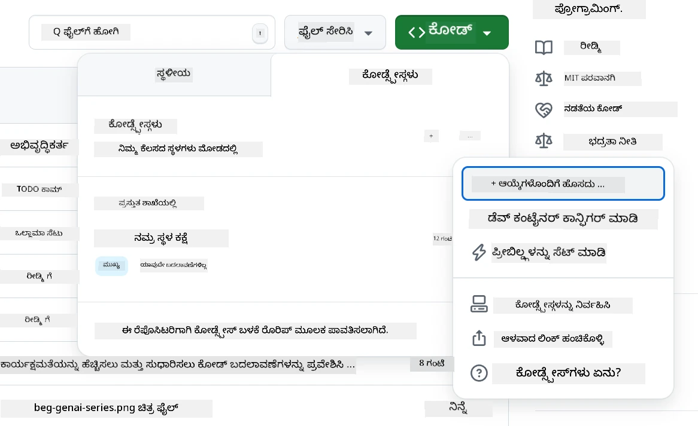
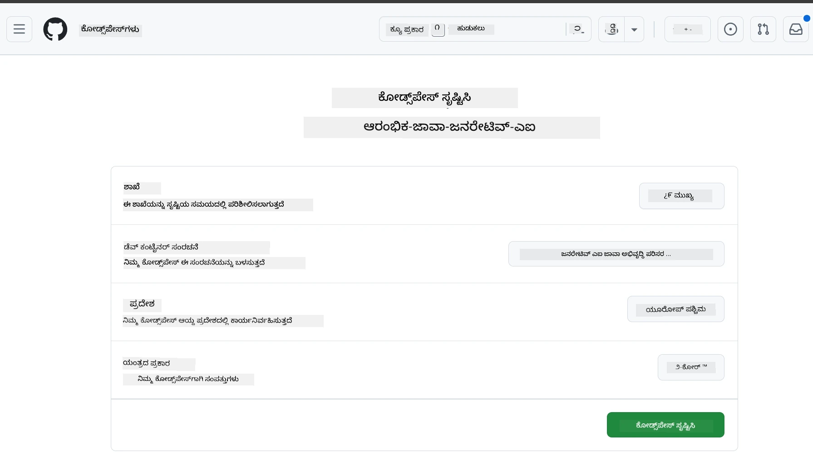
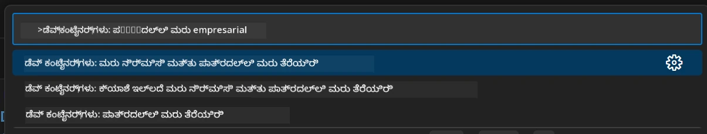
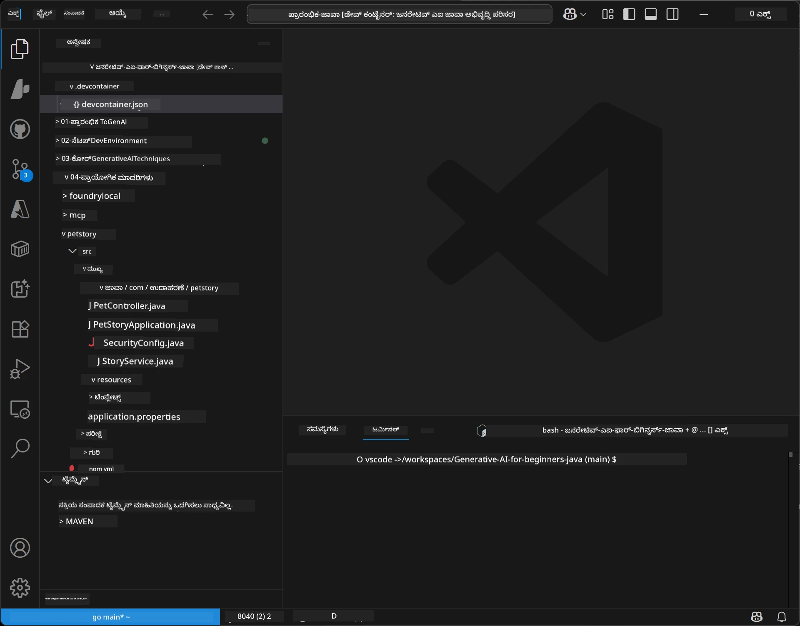
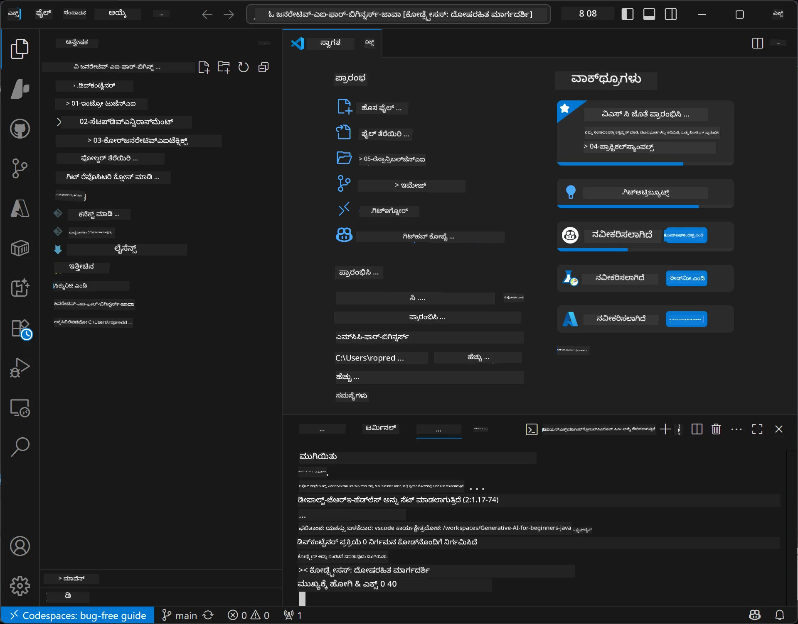

<!--
CO_OP_TRANSLATOR_METADATA:
{
  "original_hash": "96a30d42b9751a3d4e4b20e28d29d459",
  "translation_date": "2026-01-28T05:40:42+00:00",
  "source_file": "02-SetupDevEnvironment/README.md",
  "language_code": "kn"
}
-->
# ಜನರೇಟಿವ್ AI ನಿಗಾಗಿ Java ವಿಕಾಸ ಪರಿಸರವನ್ನು ಸജ್ಜುಗೊಳಿಸುವುದು

> **ತ್ವರಿತ ಪ್ರಾರಂಭ**: 2 ನಿಮಿಷಗಳಲ್ಲಿ ಕ್ಲೌಡ್‌ನಲ್ಲಿ ಕೋಡ್ ಮಾಡಿ - [GitHub Codespaces ಸೆಟ್‌ಅಪ್](../../../02-SetupDevEnvironment) ಗೆ ಹೊಕ್ಕೆ - ಯಾವುದೇ ಸ್ಥಳೀಯ ಸ್ಥಾಪನೆ ಅವಶ್ಯಕತೆ ಇಲ್ಲ ಮತ್ತು github ಮಾದರಿಗಳನ್ನು ಬಳಸುತ್ತದೆ!

> **Azure OpenAIನಲ್ಲಿ ಆಸಕ್ತಿ ಇದೆ?**, ಹೊಸ Azure OpenAI ಸಂಪನ್ಮೂಲವನ್ನು ರಚಿಸುವ ಹಂತಗಳನ್ನು ಹೊಂದಿರುವ ನಮ್ಮ [Azure OpenAI ಸೆಟ್‌ಅಪ್ ಮಾರ್ಗದರ್ಶಿಯನ್ನು](getting-started-azure-openai.md) ನೋಡಿ.

## ನೀವು ಕಲಿಯುವದ್ದು

- AI ಅಪ್ಲಿಕೇಶನ್‌ಗಳಿಗಾಗಿ Java ವಿಕಾಸ ಪರಿಸರವನ್ನು ಸಜ್ಜುಗೊಳಿಸುವುದು
- ನೀವು ಇಷ್ಟಪಡುವ ವಿಕಾಸ ಪರಿಸರವನ್ನು ಆರಿಸಿ ಮತ್ತು ಕಾನ್ಫಿಗರ್ ಮಾಡು (Codespaces ಜೊತೆ ಕ್ಲೌಡ್-ಪ್ರಥಮ, ಸ್ಥಳೀಯ ಡೆವ್ ಕಾಂಟೇನರ್ ಅಥವಾ ಸಂಪೂರ್ಣ ಸ್ಥಳೀಯ ಸೆಟ್‌ಅಪ್)
- GitHub ಮಾದರಿಗಳಿಗೆ ಸಂಪರ್ಕ ಸಾಧಿಸಿ ನಿಮ್ಮ ಸೆಟ್‌ಅಪ್ ಪರೀಕ್ಷಿಸಿ

## ವಿಷಯ ಸೂಚಿ

- [ನೀವು ಕಲಿಯುವದ್ದು](../../../02-SetupDevEnvironment)
- [ಪರಿಚಯ](../../../02-SetupDevEnvironment)
- [ಹಂತ 1: ನಿಮ್ಮ ವಿಕಾಸ ಪರಿಸರವನ್ನು ಸೆಟ್‌ಅಪ್ ಮಾಡಿ](../../../02-SetupDevEnvironment)
  - [ಆಪ್ಷನ್ A: GitHub Codespaces (ಭಾಗ್ಯಶಾಲಿ)](../../../02-SetupDevEnvironment)
  - [ಆಪ್ಷನ್ B: ಸ್ಥಳೀಯ ಡೆವ್ ಕಾಂಟೇನರ್](../../../02-SetupDevEnvironment)
  - [ಆಪ್ಷನ್ C: ನಿಮ್ಮ ಇರುತ್ತದೆ ಸ್ಥಳೀಯ ಸ್ಥಾಪನೆಯನ್ನು ಬಳಸಿ](../../../02-SetupDevEnvironment)
- [ಹಂತ 2: GitHub ವೈಯಕ್ತಿಕ ಪ್ರವೇಶ ಟೋಕನ್ ರಚಿಸಿ](../../../02-SetupDevEnvironment)
- [ಹಂತ 3: GitHub ಮಾದರಿಗಳ ಉದಾಹರಣೆಯೊಂದಿಗೆ ನಿಮ್ಮ ಸೆಟ್‌ಅಪ್ ಪರೀಕ್ಷಿಸಿ](../../../02-SetupDevEnvironment)
- [ಸಮಸ್ಯೆ ಪರಿಹಾರ](../../../02-SetupDevEnvironment)
- [ಸಾರಾಂಶ](../../../02-SetupDevEnvironment)
- [ಮುಂದಿನ ಹಂತಗಳು](../../../02-SetupDevEnvironment)

## ಪರಿಚಯ

ಈ ಅಧ್ಯಾಯವು ನಿಮಗೆ ವಿಕಾಸ ಪರಿಸರವನ್ನು ಸಜ್ಜುಗೊಳಿಸುವಲ್ಲಿ ಮಾರ್ಗದರ್ಶನ ನೀಡುತ್ತದೆ. ನಾವು **GitHub ಮಾದರಿಗಳನ್ನು** ನಮ್ಮ ಪ್ರಾಥಮಿಕ ಉದಾಹರಣೆಯಾಗಿ ಬಳಸುತ್ತೇವೆ ಏಕೆಂದರೆ ಇದು ಉಚಿತ, GitHub ಖಾತೆ ಬಳಸಿ ಸಜ್ಜುಗೊಳಿಸಲು ಸುಲಭ, ಕ್ರೆಡಿಟ್ ಕಾರ್ಡ್ ಅವಶ್ಯಕತೆ ಇಲ್ಲ, ಮತ್ತು ಪ್ರಯೋಗಕ್ಕಾಗಿ ಹಲವಾರು ಮಾದರಿಗಳ ಪ್ರವೇಶ ನೀಡುತ್ತದೆ.

**ಯಾವುದೇ ಸ್ಥಳೀಯ ಸೆಟ್‌ಅಪ್ ಅಗತ್ಯವಿಲ್ಲ!** GitHub Codespaces ಬಳಸಿ ತಕ್ಷಣವೇ ಬ್ರೌಸರ್‌ನಲ್ಲಿ ಸಂಪೂರ್ಣ ವಿಕಾಸ ಪರಿಸರವನ್ನು ಪಡೆಯಿರಿ.


ನಾವು ಈ ಕೋರ್ಸ್‌ಗೆ [**GitHub Models**](https://github.com/marketplace?type=models) ಬಳಸುವುದನ್ನು ಶಿಫಾರಸು ಮಾಡುತ್ತೇವೆ ಏಕೆಂದರೆ ಅದು:
- ಪ್ರಾರಂಭಿಸಲು **ಉಚಿತ**
- ಕೇವಲ GitHub ಖಾತೆ ಇದ್ದರೆ **ಸುಲಭವಾಗಿ** ಸಜ್ಜಾಗುತ್ತದೆ
- **ಕ್ರೆಡಿಟ್ ಕಾರ್ಡ್** ಅಗತ್ಯವಿಲ್ಲ
- **ಪ್ರಯೋಗಕ್ಕಾಗಿ ಹಲವಾರು ಮಾದರಿಗಳು** ಲಭ್ಯವಿವೆ

> **ಸೂಚನೆ**: ಈ ತರಬೇತಿಯಲ್ಲಿ ಬಳಸುತ್ತಿರುವ GitHub Modelsನ ಉಚಿತ ಮಿತಿಗಳು ಇವು:
> - ಪ್ರತಿ ನಿಮಿಷಕ್ಕೆ 15 ವಿನಂತಿಗಳು (ಪ್ರತಿ ದಿನ 150)
> - ಪ್ರತಿ ವಿನಂತಿಗೆ ~8,000 ಪದಗಳು ಒಳಗೆ, ~4,000 ಪದಗಳು ಹೊರಗೆ
> - 5 ಸೋರೊವಿನ ವಿನಂತಿಗಳು
> 
> ಉತ್ಪಾದನಾ ಬಳಕೆಗೆ, ನಿಮ್ಮ Azure ಖಾತೆಯೊಂದಿಗೆ Azure AI Foundry Models ಗೆ ಅಪ್‌ಗ್ರೇಡ್ ಮಾಡಿ. ನಿಮ್ಮ ಕೋಡ್ ಬದಲಾವಣೆ ಅಗತ್ಯವಿಲ್ಲ. ನೋಡಿ [Azure AI Foundry ದಸ್ತಾವೇಜು](https://learn.microsoft.com/azure/ai-foundry/foundry-models/how-to/quickstart-github-models).

## ಹಂತ 1: ನಿಮ್ಮ ವಿಕಾಸ ಪರಿಸರವನ್ನು ಸೆಟ್‌ಅಪ್ ಮಾಡಿ

<a name="quick-start-cloud"></a>

ನಾವು ಈ ಜನರೇಟಿವ್ AI Java ಕೋರ್ಸ್‌ಗೆ ಅಗತ್ಯವಿರುವ ಎಲ್ಲಾ ಉಪಕರಣಗಳನ್ನು ಹೊಂದಿರುವ ಪೂರ್ವಕಾನ್ಫಿಗರ್ ಮಾಡಲಾದ ಡೆವ್ ಕಾಂಟೇನರ್ ರಚಿಸಿದ್ದೇವೆ, ಇದರಿಂದ ಸೆಟ್‌ಅಪ್ ಸಮಯವಳೆಯಬಹುದು. ನಿಮ್ಮ ಇಷ್ಟದ ವಿಕಾಸ ವಿಧಾನವನ್ನು ಆರಿಸಿ:

### ಪರಿಸರ ಸೆಟ್‌ಅಪ್ ಆಯ್ಕೆಗಳು:

#### ಆಪ್ಷನ್ A: GitHub Codespaces (ಭಾಗ್ಯಶಾಲಿ)

**2 ನಿಮಿಷಗಳಲ್ಲಿ ಕೋಡ್ ಪ್ರಾರಂಭಿಸಿ - ಯಾವುದೇ ಸ್ಥಳೀಯ ಸ್ಥಾಪನೆಯ ಅಗತ್ಯವಿಲ್ಲ!**

1. ಈ ರೆಪೊಸಿಟರಿಯನ್ನು ನಿಮ್ಮ GitHub ಖಾತೆಗೆ Fork ಮಾಡಿ
   > **ಸೂಚನೆ**: ಮೂಲಭೂತ ಕಾನ್ಫಿಗ್ ಸಂಪಾದಿಸಲು ಬಯಸಿದರೆ [Dev Container Configuration](../../../.devcontainer/devcontainer.json) ನೋಡಿ
2. **Code** → **Codespaces** ಟ್ಯಾಬ್ → **...** → **New with options...** ಕ್ಲಿಕ್ ಮಾಡಿ
3. ಪೂರ್ವನಿಯೋಜಿತವನ್ನು ಬಳಸಿ – ಇದು ಈ ಕೋರ್ಸ್‌ಗೆ ಕಸ್ಟಮ್ ಡೆವ್ ಕಾಂಟೇನರ್ ಹೊಂದಿ **Generative AI Java Development Environment** ಆಯ್ಕೆಯನ್ನು ಆರಿಸುತ್ತದೆ
4. **Create codespace** ಕ್ಲಿಕ್ ಮಾಡಿ
5. ಪರಿಸರದ ತಯಾರಿ ತಲುಪಲು ಸುಮಾರು 2 ನಿಮಿಷ ಕಾಯಿರಿ
6. ಮುಂದಕ್ಕೆ [ಹಂತ 2: GitHub Token ರಚಿಸಿ](../../../02-SetupDevEnvironment) ಗೆ ಸಾಗಿರಿ






> **Codespacesನ ಪ್ರಯೋಜನಗಳು**:
> - ಸ್ಥಳೀಯ ಸ್ಥಾಪನೆ ಅಗತ್ಯವಿಲ್ಲ
> - ಯಾವುದಾದರೂ ಬ್ರೌಸರ್ ಇರುವ ಸಾಧನದಲ್ಲಿ ಕಾರ್ಯನಿರ್ವಹಿಸುತ್ತದೆ
> - ಎಲ್ಲಾ ಉಪಕರಣಗಳು ಮತ್ತು ಅವಲಂಬನೆಗಳು ಪೂರ್ವಕಾನ್ಫಿಗರ್ ಆಗಿವೆ
> - ವೈಯಕ್ತಿಕ ಖಾತೆಗಳಿಗೆ ಪ್ರತಿ ತಿಂಗಳು 60 ಗಂಟೆಗಳ ಉಚಿತ ಬಳಕೆ
> - ಎಲ್ಲಾ ಕಲಿತವರಿಗೆ ಸತತ ಅನುಭವ

#### ಆಪ್ಷನ್ B: ಸ್ಥಳೀಯ ಡೆವ್ ಕಾಂಟೇನರ್

**ಡೋಕರ್ ಬಳಸಿ ಸ್ಥಳೀಯ ವಿಕಾಸವನ್ನು ಪ್ರಥಮ ಚಿತ್ರಿಸುವ ಡೆವಲಪರ್‌ಗಳಿಗೆ**

1. ಈ ರೆಪೊಸಿಟರಿಯನ್ನು Fork ಮಾಡಿ ಮತ್ತು ನಿಮ್ಮ ಸ್ಥಳೀಯ ಯಂತ್ರಕ್ಕೆ ಕ್ಲೋನ್ ಮಾಡಿ
   > **ಸೂಚನೆ**: ಮೂಲಭೂತ ಕಾನ್ಫಿಗ್ ಸಂಪಾದಿಸಲು ಬಯಸಿದರೆ [Dev Container Configuration](../../../.devcontainer/devcontainer.json) ನೋಡಿ
2. [Docker Desktop](https://www.docker.com/products/docker-desktop/) ಮತ್ತು [VS Code](https://code.visualstudio.com/) ಅನ್ನು ಇನ್‌ಸ್ಟಾಲ್ ಮಾಡಿ
3. VS Code ನಲ್ಲಿ [Dev Containers ವಿಸ್ತರಣೆ](https://marketplace.visualstudio.com/items?itemName=ms-vscode-remote.remote-containers) ಅನ್ನು ಇನ್‌ಸ್ಟಾಲ್ ಮಾಡಿ
4. VS Code ನಲ್ಲಿ ರೆಪೊಸಿಟರಿ ಫೋಲ್ಡರನ್ನು ತೆರೆಯಿರಿ
5. ಕೇಳಿದಾಗ, **Reopen in Container** ಕ್ಲಿಕ್ ಮಾಡಿ (ಅಥವಾ `Ctrl+Shift+P` → "Dev Containers: Reopen in Container" ಬಳಸಿ)
6. ಕಾಂಟೇನರ್ ನಿರ್ಮಿಸಿ ಪ್ರಾರಂಭವಾಗಲು ಕಾಯಿರಿ
7. ಮುಂದಕ್ಕೆ [ಹಂತ 2: GitHub Token ರಚಿಸಿ](../../../02-SetupDevEnvironment) ಗೆ ಸಾಗಿರಿ





#### ಆಪ್ಷನ್ C: ನಿಮ್ಮ ಇರುತ್ತದೆ ಸ್ಥಳೀಯ ಸ್ಥಾಪನೆಯನ್ನು ಬಳಸಿ

**ಸ್ಥಳೀಯ Java ವಾತಾವರಣ ಹೊಂದಿರುವ ಡೆವಲಪರ್‌ಗಳಿಗೆ**

ಆವಶ್ಯಕತೆಗಳು:
- [Java 21+](https://www.oracle.com/java/technologies/javase/jdk21-archive-downloads.html) 
- [Maven 3.9+](https://maven.apache.org/download.cgi)
- [VS Code](https://code.visualstudio.com) ಅಥವಾ ನಿಮ್ಮ ಇಷ್ಟದ ಐಡಿಇ

ಹಂತಗಳು:
1. ಈ ರೆಪೊಸಿಟರಿಯನ್ನು ನಿಮ್ಮ ಸ್ಥಳೀಯ ಯಂತ್ರಕ್ಕೆ ಕ್ಲೋನ್ ಮಾಡಿ
2. ಯೋಜನೆಯನ್ನು ನಿಮ್ಮ ಐಡಿಇನಲ್ಲಿ ತೆರೆಯಿರಿ
3. ಮುಂದಕ್ಕೆ [ಹಂತ 2: GitHub Token ರಚಿಸಿ](../../../02-SetupDevEnvironment) ಗೆ ಸಾಗಿರಿ

> **ಸೂಪರ್ ಟಿಪ್**: ಕಡಿಮೆ ವಿಷಿಷ್ಟತೆ ಇರುವ ಯಂತ್ರವಿದ್ದರೆ ಆದರೆ ಸ್ಥಳೀಯ VS Code ಬಳಕೆ ಮಾಡಲು ಬಯಸಿದರೆ GitHub Codespaces ಬಳಸಿ! ಉತ್ತಮ ಅನುಭವಕ್ಕಾಗಿ ನಿಮ್ಮ ಸ್ಥಳೀಯ VS Code ಅನ್ನು ಕ್ಲೌಡ್ ಆಧಾರಿತ Codespace ಗೆ ಸಂಪರ್ಕಿಸಿ.



## ಹಂತ 2: GitHub ವೈಯಕ್ತಿಕ ಪ್ರವೇಶ ಟೋಕನ್ ರಚಿಸಿ

1. [GitHub Settings](https://github.com/settings/profile) ಗೆ ಹೋಗಿ ಮತ್ತು ನಿಮ್ಮ ಪ್ರೊಫೈಲ್ ಮೆನುಗಳಿಂದ **Settings** ಆಯ್ಕೆಮಾಡಿ.
2. ಎಡ ಬದಿಯ ಸೈಡ್‌ಬಾರ್‌ನಲ್ಲಿ **Developer settings** ಕ್ಲಿಕ್ ಮಾಡಿ (ಸಾಮಾನ್ಯವಾಗಿ ತಡದಲ್ಲಿ ಇರುತ್ತದೆ).
3. **Personal access tokens** ಅಡಿ, **Fine-grained tokens** ಕ್ಲಿಕ್ ಮಾಡಿ (ಅಥವಾ ನೀರಿಕ್ಷಣೆಗಾಗಿ ಈ ನೇರ [ಲಿಂಕ್](https://github.com/settings/personal-access-tokens) ಬಳಸಿ).
4. **Generate new token** ಕ್ಲಿಕ್ ಮಾಡಿ.
5. "Token name" ಅಡಿಯಲ್ಲಿ ವಿವರಣಾತ್ಮಕ ಹೆಸರು ನೀಡಿ (ಉದಾ: `GenAI-Java-Course-Token`).
6. ಮುಕ್ತಾಯ ದಿನಾಂಕವನ್ನು ಹೊಂದಿಸಿ (ಶಿಫಾರಸು: 7 ದಿನಗಳು ಸಾಂದರ್ಭಿಕ ಭದ್ರತೆ ಉದ್ದೇಶಕ್ಕಾಗಿ).
7. "Resource owner" ಅಡಿಯಲ್ಲಿ ನಿಮ್ಮ ಬಳಕೆದಾರ ಖಾತೆಯನ್ನು ಆಯ್ಕೆಮಾಡಿ.
8. "Repository access" ಅಡಿಯಲ್ಲಿ GitHub ಮಾದರಿಗಳು ಬಳಸಬೇಕಾದ ರೆಪೊಸಿಟರಿಗಳನ್ನು ಆಯ್ಕೆಮಾಡಿ (ಅಥವಾ ಅಗತ್ಯವಿದ್ದರೆ "All repositories").
9. "Account permissions" ನಲ್ಲಿ **Models** ಪಡಕೊಳ್ಳಿ ಮತ್ತು ಅದನ್ನು **Read-only** ಗೆ ಸಿದ್ಧಪಡಿಸಿ.
10. **Generate token** ಕ್ಲಿಕ್ ಮಾಡಿ.
11. **ನಿಮ್ಮ ಟೋಕನ್ ಅನ್ನು ಈಗ ನಕಲಿಸಿ ಮತ್ತು ಉಳಿಸಿ** – ಇದು ಮರುಕಾಣಿಸುವುದಿಲ್ಲ!

> **ಭದ್ರತಾ ಸಲಹೆ**: ನಿಮ್ಮ ಪ್ರವೇಶ ಟೋಕನ್‌ಗಳಿಗೆ ಕನಿಷ್ಠ ಅಗತ್ಯ ವ್ಯಾಪ್ತಿಯನ್ನು ಮತ್ತು ಅತ್ಯಂತ ಕಡಿಮೆ ಪರಿಣಾಮಕಾರಿಯಾದ ಅವಧಿಯನ್ನು ಬಳಸಿ.

## ಹಂತ 3: GitHub ಮಾದರಿಗಳ ಉದಾಹರಣೆಯೊಂದಿಗೆ ನಿಮ್ಮ ಸೆಟ್‌ಅಪ್ ಪರೀಕ್ಷಿಸಿ

ನಿಮ್ಮ ವಿಕಾಸ ಪರಿಸರ ಸಿದ್ಧವಾಗುತ್ತಿದ್ದಂತೆ, ನಮ್ಮ ಉದಾಹರಣಾ ಅಪ್ಲಿಕೇಶನ್ [`02-SetupDevEnvironment/examples/github-models`](../../../02-SetupDevEnvironment/examples/github-models) ನಲ್ಲಿ GitHub Models ಸಂಯೋಜನೆಯನ್ನು ಪರೀಕ್ಷಿಸೋಣ.

1. ನಿಮ್ಮ ಡೆವಲಪ್‌ಮೆಂಟ್ ಪರಿಸರದ ಟರ್ಮಿನಲ್ ತೆರೆಯಿರಿ.
2. GitHub Models ಉದಾಹರಣೆಗೆ ಹೋಗಿ:
   ```bash
   cd 02-SetupDevEnvironment/examples/github-models
   ```
3. ನಿಮ್ಮ GitHub ಟೋಕನ್ ಅನ್ನು ಪರಿಸರ ಚರ ಅಗ್ಗವಾಗಿ ಹೊಂದಿಸಿ:
   ```bash
   # ಮ್ಯಾಕ್‌ಒಎಸ್/ಲಿನಕ್ಸ್
   export GITHUB_TOKEN=your_token_here
   
   # ವಿಂಡೋуз್ (ಕಮಾಂಡ್ ಪ್ರಾಂಪ್ಟ್)
   set GITHUB_TOKEN=your_token_here
   
   # ವಿಂಡೋуз್ (ಪವರ್‌ಶೆಲ್)
   $env:GITHUB_TOKEN="your_token_here"
   ```

4. ಅಪ್ಲಿಕೇಶನನ್ನು ಚಾಲನೆ ಮಾಡಿ:
   ```bash
   mvn compile exec:java -Dexec.mainClass="com.example.githubmodels.App"
   ```

ಈ ರೀತಿ output ಕಾಣಬಹುದು:
```text
Using model: gpt-4.1-nano
Sending request to GitHub Models...
Response: Hello World!
```

### ಉದಾಹರಣಾ ಕೋಡ್ ಅನ್ನು ಅರ್ಥಮಾಡಿಕೊಳ್ಳುವುದು

ಮೊದಲು, ನಾವು ಯಾವ ಕೋಡ್ ಅನ್ನು ಓಡಿಸಿದ್ದಾರೆಂದು ಅರ್ಥಮಾಡಿಕೊಳ್ಳೋಣ. `examples/github-models` ಅಡಿಯಲ್ಲಿ ಉದಾಹರಣೆ OpenAI Java SDK ಬಳಸಿ GitHub Models ಗೆ ಸಂಪರ್ಕ ಕಲ್ಪಿಸುತ್ತದೆ:

**ಈ ಕೋಡ್ ಮಾಡುವುದು:**
- ನಿಮ್ಮ ವೈಯಕ್ತಿಕ ಪ್ರವೇಶ ಟೋಕನ್ ಬಳಸಿ GitHub Models ಗೆ **ಸಂಪರ್ಕಿಸುತ್ತದೆ**
- ಸರಳ "Say Hello World!" ಸಂದೇಶವನ್ನು AI ಮಾದರಿಗೆ **ಹೇಳುತ್ತದೆ**
- AI ಪ್ರತಿಕ್ರಿಯೆಯನ್ನು **ಸ್ವೀಕರಿಸಿ** ಮತ್ತು ಪ್ರದರ್ಶಿಸುತ್ತದೆ
- ನಿಮ್ಮ ಸೆಟ್‌ಅಪ್ ಸರಿಯಾಗಿ ಕಾರ್ಯನಿರ್ವಹಿಸುತ್ತಿದೆ ಎಂದು **ಪರಿಶೀಲಿಸುತ್ತದೆ**

**ಮੁੱਖ ಅವಲಂಬನೆ** (`pom.xml` ನಲ್ಲಿ):
```xml
<dependency>
    <groupId>com.openai</groupId>
    <artifactId>openai-java</artifactId>
    <version>2.12.0</version>
</dependency>
```

**ಪ್ರಮುಖ ಕೋಡ್** (`App.java`):
```java
// OpenAI ಜावा SDK ಬಳಸಿ GitHub ಮಾದರಿಗಳೊಂದಿಗೆ ಸಂಪರ್ಕ ಸ್ಥಾಪಿಸಿ
OpenAIClient client = OpenAIOkHttpClient.builder()
    .apiKey(pat)
    .baseUrl("https://models.inference.ai.azure.com")
    .build();

// ಚಾಟ್ ಪೂರ್ಣಗೊಂಡ ವಿನಂತಿಯನ್ನು ತಯಾರಿಸಿ
ChatCompletionCreateParams params = ChatCompletionCreateParams.builder()
    .model(modelId)
    .addSystemMessage("You are a concise assistant.")
    .addUserMessage("Say Hello World!")
    .build();

// AI ಉತ್ತರವನ್ನು ಪಡೆಯಿರಿ
ChatCompletion response = client.chat().completions().create(params);
System.out.println("Response: " + response.choices().get(0).message().content().orElse("No response content"));
```

## ಸಾರಾಂಶ

ಅದ್ಭುತ! ಈಗ ಎಲ್ಲವನ್ನೂ ಸಜ್ಜುಗೊಳಿಸಿದ್ದೀರಿ:

- AI ಮಾದರಿ ಪ್ರವೇಶಕ್ಕಾಗಿ ಸರಿಯಾದ ಅನುಮತಿಗಳೊಂದಿಗೆ GitHub ವೈಯಕ್ತಿಕ ಪ್ರವೇಶ ಟೋಕನ್ ರಚಿಸಲಾಗಿದೆ
- ನಿಮ್ಮ Java ವಿಕಾಸ ಪರಿಸರ (Codespaces, ಡೆವ್ ಕಾಂಟೇನರ್ ಅಥವಾ ಸ್ಥಳೀಯವಾಗಿ) ಚಾಲನೆ ತುಂಬಿಸಿದೆ
- ಉಚಿತ AI ವಿಕಾಸಕ್ಕಾಗಿ OpenAI Java SDK ಬಳಸಿ GitHub Models ಗೆ ಸಂಪರ್ಕ ಸಾಧಿಸಿಕೊಂಡಿರುತ್ತೀರಿ
- AI ಮಾದರಿಗಳೊಂದಿಗೆ ಮಾತನಾಡುವ ಸರಳ ಉದಾಹರಣೆ ಮೂಲಕ ಎಲ್ಲವನು ಪರೀಕ್ಷಿಸಿದ್ದೀರಿ

## ಮುಂದಿನ ಹಂತಗಳು

[ಅಧ್ಯಾಯ 3: ಕೋರ್ ಜನರೇಟಿವ್ AI ತಂತ್ರಗಳು](../03-CoreGenerativeAITechniques/README.md)

## ಸಮಸ್ಯೆಗಳ ಪರಿಹಾರ

ಸಮಸ್ಯೆಗಳಿವೆಯಾ? ಇಲ್ಲಿ ಸಾಮಾನ್ಯ ಸಮಸ್ಯೆಗಳು ಮತ್ತು ಪರಿಹಾರಗಳು:

- **ಟೋಕನ್ ಕಾರ್ಯನಿರತರಾಗುತ್ತಿಲ್ಲ?** 
  - ಯಾವ ಅನಗತ್ಯ ಸ್ಪೇಸ್ ಇಲ್ಲದೆ ಸಂಪೂರ್ಣ ಟೋಕನ್ ನಕಲಿಸಿಕೊಂಡಿದ್ದೀರಾ ಎಂದು ಖಚಿತಪಡಿಸಿಕೊಳ್ಳಿ
  - ಟೋಕನ್ ಸರಿಯಾಗಿ ಪರಿಸರ ಚರ ಘೋಷಿತವಾಗಿದೆ ಎಂದು ಪರಿಶೀಲಿಸಿ
  - ನಿಮ್ಮ ಟೋಕನ್ ಸರಿಯಾದ ಅನುಮತಿಗಳನ್ನು ಹೊಂದಿದೆಯಾ (Models: ಓದಲು ಮಾತ್ರ) ಎಂಬುದನ್ನು ನೋಡಿಕೊಳ್ಳಿ

- **Maven ಕಂಡುಬಂದಿಲ್ಲ?** 
  - ಡೆವ್ ಕಾಂಟೇನರ್/ Codespaces ನಲ್ಲಿ Maven ಪೂರ್ವನಿಯೋಜಿತವಾಗಿದೆ
  - ಸ್ಥಳೀಯ ಸೆಟ್‌ಅಪ್‌ನಿಗೆ, Java 21+ ಮತ್ತು Maven 3.9+ ಸ್ಥಾಪನೆಯಾಗಿರುವುದಾಗಿ ಖಚಿತಪಡಿಸಿಕೊಳ್ಳಿ
  - ಸ್ಥಾಪನೆ ಪರಿಶೀಲಿಸಲು `mvn --version` ಪ್ರಯತ್ನಿಸಿ

- **ಕನೆಕ್ಷನ್ ಸಮಸ್ಯೆಗಳು?** 
  - ನಿಮ್ಮ ಇಂಟರ್‌ನೆಟ್ ಸಂಪರ್ಕವನ್ನು ಪರಿಶೀಲಿಸಿ
  - GitHub ನಿಮ್ಮ ನೆಟ್‌ವರ್ಕ್‌ನಿಂದ ಲಭ್ಯವಿದೆಯೇ ಎಂದು ಪರಿಶೀಲಿಸಿ
  - GitHub Models ಅಂತಿಮ ಬಿಂದುವನ್ನು ತಡೆಹಿಡಿಯುವ ಫೈರ್ವಾಲ್ ಹಿಂತಿರುಗಿಲ್ಲ ಎಂದು ಖಚಿತಪಡಿಸಿಕೊಳ್ಳಿ

- **ಡೆವ್ ಕಾಂಟೇನರ್ ಆರಂಭವಾಗುತ್ತಿಲ್ಲ?** 
  - ಡೋಕರ್ ಡೆಸ್ಕ್‌ಟಾಪ್ ನಡೆದುತ್ತಿದೆಯೇ ಎಂದು ಖಚಿತಪಡಿಸಿಕೊಳ್ಳಿ (ಸ್ಥಳೀಯ ವಿಕಾಸಕ್ಕಾಗಿ)
  - ಕಾಂಟೇನರ್ ಪುನರ್‌ನಿರ್ಮಿಸಲು ಪ್ರಯತ್ನಿಸಿ: `Ctrl+Shift+P` → "Dev Containers: Rebuild Container"

- **ಅಪ್ಲಿಕೇಶನ್ ಸಂಯೋಜನೆ ತಪ್ಪುಗಳು?**
  - ನೀವು ಸರಿಯಾದ ಡೈರಕ್ಟರಿಯಲ್ಲಿ ಇದ್ದೀರಾ ಎಂದು ಖಚಿತಪಡಿಸಿಕೊಳ್ಳಿ: `02-SetupDevEnvironment/examples/github-models`
  - ಸ್ವಚ್ಛಗೊಳಿಸಿ ಮತ್ತು ಪುನಃ ನಿರ್ಮಿಸಲು ಪ್ರಯತ್ನಿಸಿ: `mvn clean compile`

> **ಸಹಾಯ ಬೇಕೆ?**: ಸಮಸ್ಯೆಗಳು ಇನ್ನೂ ಇದೆಯೇ? ರೆಪೊಸಿಟರಿಯಲ್ಲಿ ಸಮಸ್ಯೆ ತೆರೆಯಿರಿ, ನಾವು ನಿಮಗೆ ಸಹಾಯ ಮಾಡುತ್ತೇವೆ.

---

<!-- CO-OP TRANSLATOR DISCLAIMER START -->
**ಅಸ್ವೀಕಾರ**:
ಈ ದಾಖಲೆ [ಕೊ-ಆಪ ಟ್ರಾನ್ಸ್ಲೇಟರ್](https://github.com/Azure/co-op-translator) ಎಂಬ ಎಐ ಅನುವಾದ ಸೇವೆಯನ್ನು ಬಳಸಿ ಅನುವಾದಿಸಲಾಗಿದೆ. ನಾವು ನಿಖರತೆಯನ್ನು ಸಾಧಿಸಲು ಪ್ರಯತ್ನಿಸುವರುವಾದರೂ, ಸ್ವಯಂಕ್ರಿಯ ಅನುವಾದಗಳು ತಪ್ಪುಗಳು ಅಥವಾ ಅಸತ್ಯತೆಗಳನ್ನು ಒಳಗೊಂಡಿರಬಹುದು ಎಂದು ದಯವಿಟ್ಟು ಗಮನಿಸಿ. ಮೂಲ ಭಾಷೆಯಲ್ಲಿರುವ ಮೂಲ ದಾಖಲೆ ಮುಖ್ಯವಾದ ಮೂಲವಾಗಿ ಪರಿಗಣಿಸಬೇಕು. ಪ್ರಮುಖ ಮಾಹಿತಿಗಾಗಿ, ವೃತ್ತಿಪರ ಮಾನವ ಅನುವಾದವನ್ನು ಶಿಫಾರಸು ಮಾಡಲಾಗುತ್ತದೆ. ಈ ಅನುವಾದ ಬಳಕೆಯಿಂದ ಹುಟ್ಟಿಸಬಹುದಾದ ಯಾವುದೇ ತೊಂದರೆಗಳು ಅಥವಾ ತ್ವಚನಾವಕಾಶಗಳಿಗಾಗಿ ನಾವು ಜವಾಬ್ದಾರರಾಗುವುದಿಲ್ಲ.
<!-- CO-OP TRANSLATOR DISCLAIMER END -->