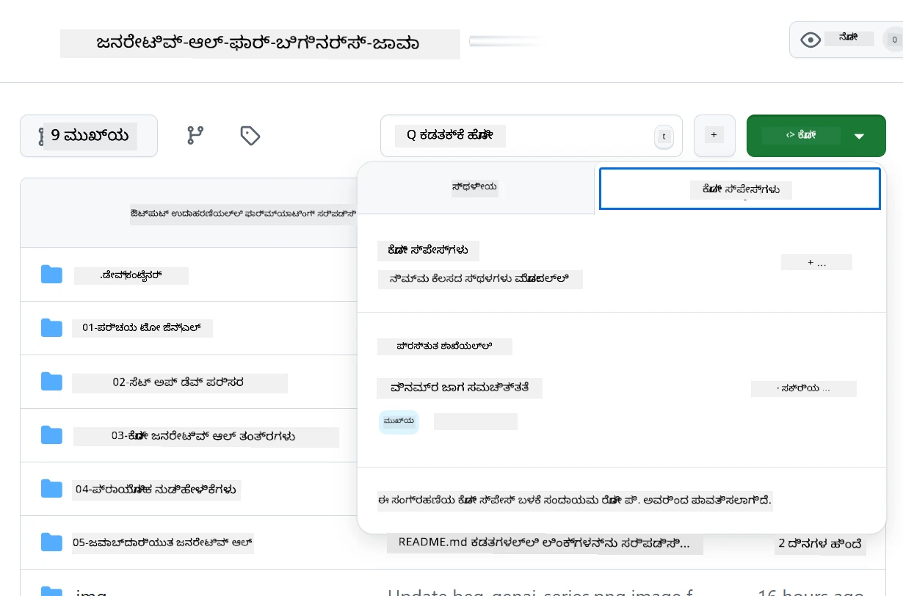

<!--
CO_OP_TRANSLATOR_METADATA:
{
  "original_hash": "bfdb4b4eadbee3a59ef742439f58326a",
  "translation_date": "2025-12-01T09:33:23+00:00",
  "source_file": "02-SetupDevEnvironment/getting-started-azure-openai.md",
  "language_code": "kn"
}
-->
# Azure OpenAI ಅಭಿವೃದ್ಧಿ ಪರಿಸರವನ್ನು ಸೆಟ್ ಅಪ್ ಮಾಡುವುದು

> **ತ್ವರಿತ ಪ್ರಾರಂಭ**: ಈ ಮಾರ್ಗದರ್ಶಿ Azure OpenAI ಸೆಟ್ ಅಪ್‌ಗಾಗಿ. ಉಚಿತ ಮಾದರಿಗಳೊಂದಿಗೆ ತಕ್ಷಣ ಪ್ರಾರಂಭಿಸಲು, [GitHub Models with Codespaces](./README.md#quick-start-cloud) ಬಳಸಿ.

ಈ ಮಾರ್ಗದರ್ಶಿ ಈ ಕೋರ್ಸ್‌ನಲ್ಲಿ ನಿಮ್ಮ Java AI ಅಪ್ಲಿಕೇಶನ್‌ಗಳಿಗೆ Azure AI Foundry ಮಾದರಿಗಳನ್ನು ಸೆಟ್ ಅಪ್ ಮಾಡಲು ಸಹಾಯ ಮಾಡುತ್ತದೆ.

## ವಿಷಯಗಳ ಪಟ್ಟಿಯು

- [ತ್ವರಿತ ಸೆಟ್ ಅಪ್ ಅವಲೋಕನ](../../../02-SetupDevEnvironment)
- [ಹಂತ 1: Azure AI Foundry ಸಂಪತ್ತುಗಳನ್ನು ರಚಿಸಿ](../../../02-SetupDevEnvironment)
  - [ಹಬ್ ಮತ್ತು ಪ್ರಾಜೆಕ್ಟ್ ರಚಿಸಿ](../../../02-SetupDevEnvironment)
  - [GPT-4o-mini ಮಾದರಿಯನ್ನು ಡಿಪ್ಲಾಯ್ ಮಾಡಿ](../../../02-SetupDevEnvironment)
- [ಹಂತ 2: ನಿಮ್ಮ ಕೋಡ್ಸ್‌ಪೇಸ್ ರಚಿಸಿ](../../../02-SetupDevEnvironment)
- [ಹಂತ 3: ನಿಮ್ಮ ಪರಿಸರವನ್ನು ಸಂರಚಿಸಿ](../../../02-SetupDevEnvironment)
- [ಹಂತ 4: ನಿಮ್ಮ ಸೆಟ್ ಅಪ್ ಅನ್ನು ಪರೀಕ್ಷಿಸಿ](../../../02-SetupDevEnvironment)
- [ಮುಂದೆ ಏನು?](../../../02-SetupDevEnvironment)
- [ಸಂಪತ್ತುಗಳು](../../../02-SetupDevEnvironment)
- [ಹೆಚ್ಚುವರಿ ಸಂಪತ್ತುಗಳು](../../../02-SetupDevEnvironment)

## ತ್ವರಿತ ಸೆಟ್ ಅಪ್ ಅವಲೋಕನ

1. Azure AI Foundry ಸಂಪತ್ತುಗಳನ್ನು ರಚಿಸಿ (ಹಬ್, ಪ್ರಾಜೆಕ್ಟ್, ಮಾದರಿ)
2. Java ಅಭಿವೃದ್ಧಿ ಕಂಟೈನರ್‌ನೊಂದಿಗೆ Codespace ರಚಿಸಿ
3. Azure OpenAI ಕ್ರೆಡೆನ್ಷಿಯಲ್‌ಗಳೊಂದಿಗೆ ನಿಮ್ಮ .env ಫೈಲ್ ಅನ್ನು ಸಂರಚಿಸಿ
4. ಉದಾಹರಣೆಯ ಪ್ರಾಜೆಕ್ಟ್‌ನೊಂದಿಗೆ ನಿಮ್ಮ ಸೆಟ್ ಅಪ್ ಅನ್ನು ಪರೀಕ್ಷಿಸಿ

## ಹಂತ 1: Azure AI Foundry ಸಂಪತ್ತುಗಳನ್ನು ರಚಿಸಿ

### ಹಬ್ ಮತ್ತು ಪ್ರಾಜೆಕ್ಟ್ ರಚಿಸಿ

1. [Azure AI Foundry Portal](https://ai.azure.com/) ಗೆ ಹೋಗಿ ಮತ್ತು ಲಾಗಿನ್ ಮಾಡಿ
2. **+ Create** → **New hub** ಕ್ಲಿಕ್ ಮಾಡಿ (ಅಥವಾ **Management** → **All hubs** → **+ New hub** ಗೆ ಹೋಗಿ)
3. ನಿಮ್ಮ ಹಬ್ ಅನ್ನು ಸಂರಚಿಸಿ:
   - **ಹಬ್ ಹೆಸರು**: ಉದಾ., "MyAIHub"
   - **ಚಂದಾದಾರಿಕೆ**: ನಿಮ್ಮ Azure ಚಂದಾದಾರಿಕೆಯನ್ನು ಆಯ್ಕೆಮಾಡಿ
   - **ಸಂಪತ್ತು ಗುಂಪು**: ಹೊಸದನ್ನು ರಚಿಸಿ ಅಥವಾ ಹಳೆಯದನ್ನು ಆಯ್ಕೆಮಾಡಿ
   - **ಸ್ಥಳ**: ನಿಮ್ಮ ಹತ್ತಿರದ ಸ್ಥಳವನ್ನು ಆಯ್ಕೆಮಾಡಿ
   - **Storage account**: ಡೀಫಾಲ್ಟ್ ಅಥವಾ ಕಸ್ಟಮ್ ಆಯ್ಕೆಮಾಡಿ
   - **Key vault**: ಡೀಫಾಲ್ಟ್ ಅಥವಾ ಕಸ್ಟಮ್ ಆಯ್ಕೆಮಾಡಿ
   - **Next** → **Review + create** → **Create** ಕ್ಲಿಕ್ ಮಾಡಿ
4. ರಚನೆಯಾದ ನಂತರ, **+ New project** ಕ್ಲಿಕ್ ಮಾಡಿ (ಅಥವಾ ಹಬ್ ಅವಲೋಕನದಿಂದ **Create project** ಆಯ್ಕೆಮಾಡಿ)
   - **ಪ್ರಾಜೆಕ್ಟ್ ಹೆಸರು**: ಉದಾ., "GenAIJava"
   - **Create** ಕ್ಲಿಕ್ ಮಾಡಿ

### GPT-4o-mini ಮಾದರಿಯನ್ನು ಡಿಪ್ಲಾಯ್ ಮಾಡಿ

1. ನಿಮ್ಮ ಪ್ರಾಜೆಕ್ಟ್‌ನಲ್ಲಿ, **Model catalog** ಗೆ ಹೋಗಿ ಮತ್ತು **gpt-4o-mini** ಹುಡುಕಿ
   - *ಪರ್ಯಾಯ: **Deployments** → **+ Create deployment** ಗೆ ಹೋಗಿ*
2. gpt-4o-mini ಮಾದರಿಯ ಕಾರ್ಡ್‌ನಲ್ಲಿ **Deploy** ಕ್ಲಿಕ್ ಮಾಡಿ
3. ಡಿಪ್ಲಾಯ್ ಸಂರಚನೆ:
   - **Deployment name**: "gpt-4o-mini"
   - **Model version**: ಇತ್ತೀಚಿನದು ಬಳಸಿ
   - **Deployment type**: Standard
4. **Deploy** ಕ್ಲಿಕ್ ಮಾಡಿ
5. ಡಿಪ್ಲಾಯ್ ಆದ ನಂತರ, **Deployments** ಟ್ಯಾಬ್‌ಗೆ ಹೋಗಿ ಮತ್ತು ಈ ಮೌಲ್ಯಗಳನ್ನು ನಕಲಿಸಿ:
   - **Deployment name** (ಉದಾ., "gpt-4o-mini")
   - **Target URI** (ಉದಾ., `https://your-hub-name.openai.azure.com/`) 
      > **ಮುಖ್ಯ**: ಸಂಪೂರ್ಣ ಎಂಡ್‌ಪಾಯಿಂಟ್ ಪಾತ್ ಅನ್ನು ಅಲ್ಲ, ಕೇವಲ ಮೂಲ URL ಅನ್ನು (ಉದಾ., `https://myhub.openai.azure.com/`) ನಕಲಿಸಿ.
   - **Key** (Keys and Endpoint ವಿಭಾಗದಿಂದ)

> **ಇನ್ನೂ ಸಮಸ್ಯೆ ಇದೆಯೇ?** ಅಧಿಕೃತ [Azure AI Foundry Documentation](https://learn.microsoft.com/azure/ai-foundry/how-to/create-projects?tabs=ai-foundry&pivots=hub-project) ಗೆ ಭೇಟಿ ನೀಡಿ

## ಹಂತ 2: ನಿಮ್ಮ ಕೋಡ್ಸ್‌ಪೇಸ್ ರಚಿಸಿ

1. ಈ ರೆಪೊಸಿಟರಿಯನ್ನು ನಿಮ್ಮ GitHub ಖಾತೆಗೆ Fork ಮಾಡಿ
   > **ಗಮನಿಸಿ**: ಮೂಲ ಸಂರಚನೆಯನ್ನು ಸಂಪಾದಿಸಲು [Dev Container Configuration](../../../.devcontainer/devcontainer.json) ನೋಡಿ
2. ನಿಮ್ಮ Fork ಮಾಡಿದ ರೆಪೊದಲ್ಲಿ, **Code** → **Codespaces** ಟ್ಯಾಬ್ ಕ್ಲಿಕ್ ಮಾಡಿ
3. **...** → **New with options...** ಕ್ಲಿಕ್ ಮಾಡಿ

4. **Dev container configuration** ಆಯ್ಕೆಮಾಡಿ: 
   - **Generative AI Java Development Environment**
5. **Create codespace** ಕ್ಲಿಕ್ ಮಾಡಿ

## ಹಂತ 3: ನಿಮ್ಮ ಪರಿಸರವನ್ನು ಸಂರಚಿಸಿ

ನಿಮ್ಮ Codespace ಸಿದ್ಧವಾದ ನಂತರ, ನಿಮ್ಮ Azure OpenAI ಕ್ರೆಡೆನ್ಷಿಯಲ್‌ಗಳನ್ನು ಸೆಟ್ ಅಪ್ ಮಾಡಿ:

1. **ರೆಪೊಸಿಟರಿಯ ಮೂಲದಿಂದ ಉದಾಹರಣೆಯ ಪ್ರಾಜೆಕ್ಟ್‌ಗೆ ಹೋಗಿ:**
   ```bash
   cd 02-SetupDevEnvironment/examples/basic-chat-azure
   ```

2. **ನಿಮ್ಮ .env ಫೈಲ್ ರಚಿಸಿ:**
   ```bash
   cp .env.example .env
   ```

3. **ನಿಮ್ಮ .env ಫೈಲ್ ಅನ್ನು ನಿಮ್ಮ Azure OpenAI ಕ್ರೆಡೆನ್ಷಿಯಲ್‌ಗಳೊಂದಿಗೆ ಸಂಪಾದಿಸಿ:**
   ```bash
   # ನಿಮ್ಮ Azure OpenAI API ಕೀ (Azure AI Foundry ಪೋರ್ಟಲ್‌ನಿಂದ)
   AZURE_AI_KEY=your-actual-api-key-here
   
   # ನಿಮ್ಮ Azure OpenAI ಎಂಡ್ಪಾಯಿಂಟ್ URL (ಉದಾ., https://myhub.openai.azure.com/)
   AZURE_AI_ENDPOINT=https://your-hub-name.openai.azure.com/
   ```

   > **ಭದ್ರತಾ ಟಿಪ್ಪಣಿ**: 
   > - ನಿಮ್ಮ `.env` ಫೈಲ್ ಅನ್ನು ವರ್ಶನ್ ಕಂಟ್ರೋಲ್‌ಗೆ ಕಮಿಟ್ ಮಾಡಬೇಡಿ
   > - `.env` ಫೈಲ್ ಈಗಾಗಲೇ `.gitignore` ನಲ್ಲಿ ಸೇರಿಸಲಾಗಿದೆ
   > - ನಿಮ್ಮ API ಕೀಗಳನ್ನು ಸುರಕ್ಷಿತವಾಗಿ ಇಟ್ಟುಕೊಳ್ಳಿ ಮತ್ತು ಅವುಗಳನ್ನು ನಿಯಮಿತವಾಗಿ ರೋಟೇಟ್ ಮಾಡಿ

## ಹಂತ 4: ನಿಮ್ಮ ಸೆಟ್ ಅಪ್ ಅನ್ನು ಪರೀಕ್ಷಿಸಿ

ನಿಮ್ಮ Azure OpenAI ಸಂಪರ್ಕವನ್ನು ಪರೀಕ್ಷಿಸಲು ಉದಾಹರಣೆಯ ಅಪ್ಲಿಕೇಶನ್ ಅನ್ನು ಚಲಾಯಿಸಿ:

```bash
mvn clean spring-boot:run
```

ನೀವು GPT-4o-mini ಮಾದರಿಯಿಂದ ಪ್ರತಿಕ್ರಿಯೆಯನ್ನು ನೋಡಬಹುದು!

> **VS Code ಬಳಕೆದಾರರು**: ನೀವು `F5` ಒತ್ತುವ ಮೂಲಕ ಅಪ್ಲಿಕೇಶನ್ ಅನ್ನು ಚಲಾಯಿಸಬಹುದು. ಲಾಂಚ್ ಸಂರಚನೆ ಈಗಾಗಲೇ ನಿಮ್ಮ `.env` ಫೈಲ್ ಅನ್ನು ಸ್ವಯಂಚಾಲಿತವಾಗಿ ಲೋಡ್ ಮಾಡಲು ಸೆಟ್ ಮಾಡಲಾಗಿದೆ.

> **ಪೂರ್ಣ ಉದಾಹರಣೆ**: [End-to-End Azure OpenAI Example](./examples/basic-chat-azure/README.md) ಅನ್ನು ನೋಡಿ ವಿವರವಾದ ಸೂಚನೆಗಳು ಮತ್ತು ಸಮಸ್ಯೆ ಪರಿಹಾರಕ್ಕಾಗಿ.

## ಮುಂದೇನು?

**ಸೆಟ್ ಅಪ್ ಪೂರ್ಣಗೊಂಡಿದೆ!** ನೀವು ಈಗ ಹೊಂದಿದ್ದೀರಿ:
- gpt-4o-mini ಡಿಪ್ಲಾಯ್ ಮಾಡಿದ Azure OpenAI
- ಸ್ಥಳೀಯ .env ಫೈಲ್ ಸಂರಚನೆ
- Java ಅಭಿವೃದ್ಧಿ ಪರಿಸರ ಸಿದ್ಧವಾಗಿದೆ

**ಮುಂದುವರಿಯಿರಿ** [Chapter 3: Core Generative AI Techniques](../03-CoreGenerativeAITechniques/README.md) ಗೆ AI ಅಪ್ಲಿಕೇಶನ್‌ಗಳನ್ನು ನಿರ್ಮಿಸಲು ಪ್ರಾರಂಭಿಸಲು!

## ಸಂಪತ್ತುಗಳು

- [Azure AI Foundry Documentation](https://learn.microsoft.com/azure/ai-services/)
- [Spring AI Azure OpenAI Documentation](https://docs.spring.io/spring-ai/reference/api/clients/azure-openai-chat.html)
- [Azure OpenAI Java SDK](https://learn.microsoft.com/java/api/overview/azure/ai-openai-readme)

## ಹೆಚ್ಚುವರಿ ಸಂಪತ್ತುಗಳು

- [VS Code ಡೌನ್‌ಲೋಡ್ ಮಾಡಿ](https://code.visualstudio.com/Download)
- [Docker Desktop ಪಡೆಯಿರಿ](https://www.docker.com/products/docker-desktop)
- [Dev Container Configuration](../../../.devcontainer/devcontainer.json)

---

<!-- CO-OP TRANSLATOR DISCLAIMER START -->
**ಅಸ್ವೀಕಾರ**:  
ಈ ದಸ್ತಾವೇಜನ್ನು AI ಅನುವಾದ ಸೇವೆ [Co-op Translator](https://github.com/Azure/co-op-translator) ಬಳಸಿ ಅನುವಾದಿಸಲಾಗಿದೆ. ನಾವು ನಿಖರತೆಯಿಗಾಗಿ ಪ್ರಯತ್ನಿಸುತ್ತಿದ್ದರೂ, ದಯವಿಟ್ಟು ಗಮನಿಸಿ, ಸ್ವಯಂಚಾಲಿತ ಅನುವಾದಗಳಲ್ಲಿ ದೋಷಗಳು ಅಥವಾ ಅಸಡ್ಡೆಗಳು ಇರಬಹುದು. ಮೂಲ ಭಾಷೆಯಲ್ಲಿರುವ ಮೂಲ ದಸ್ತಾವೇಜು ಪ್ರಾಮಾಣಿಕ ಮೂಲವೆಂದು ಪರಿಗಣಿಸಬೇಕು. ಮಹತ್ವದ ಮಾಹಿತಿಗಾಗಿ, ವೃತ್ತಿಪರ ಮಾನವ ಅನುವಾದವನ್ನು ಶಿಫಾರಸು ಮಾಡಲಾಗುತ್ತದೆ. ಈ ಅನುವಾದವನ್ನು ಬಳಸುವ ಮೂಲಕ ಉಂಟಾಗುವ ಯಾವುದೇ ತಪ್ಪು ಅರ್ಥಗಳ ಅಥವಾ ತಪ್ಪು ವ್ಯಾಖ್ಯಾನಗಳ ಬಗ್ಗೆ ನಾವು ಹೊಣೆಗಾರರಲ್ಲ.
<!-- CO-OP TRANSLATOR DISCLAIMER END -->