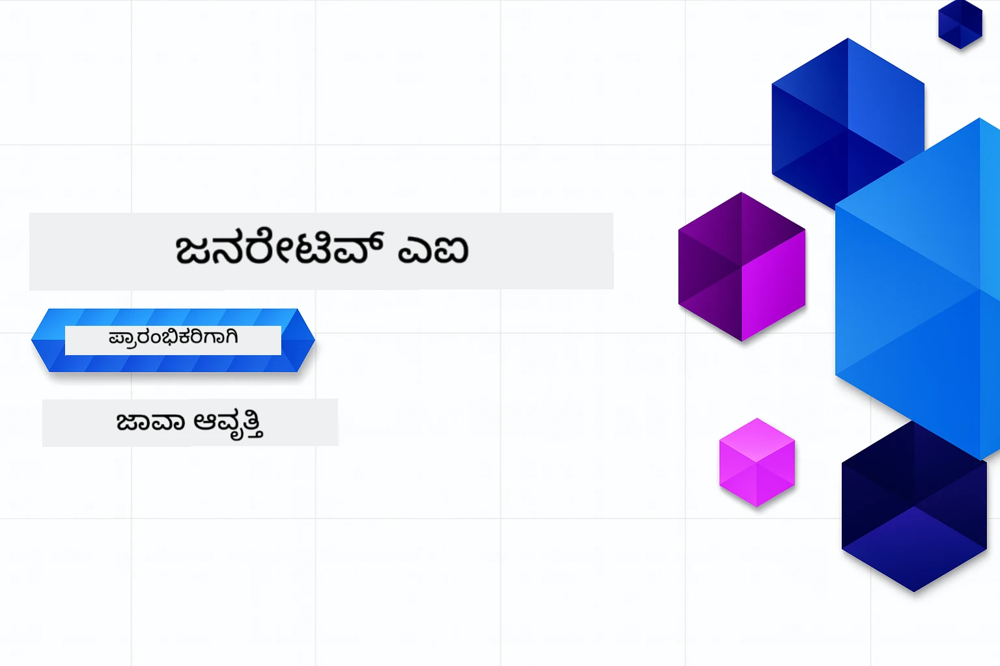

# ಆರಂಭಿಕರಿಗೆ ಜನರೇಟಿವ್ AI - ಜಾವಾ ಆವೃತ್ತಿ
[](https://discord.gg/nTYy5BXMWG)



**ಸಮಯ ಬದ್ಧತೆ**: ಸಂಪೂರ್ಣ ವರ್ಕ್‌ಶಾಪ್ ಸ್ಥಳೀಯ ಸೆಟಪ್ ಇಲ್ಲದೆ ಆನ್ಲೈನ್‌ನಲ್ಲಿ ಪೂರ್ಣಗೊಳ್ಳಬಹುದು. ವಾತಾವರಣ ಸೆಟಪ್‌ಗಾಗಿ 2 ನಿಮಿಷಗಳ ಕಾಲ ಬೇಕಾಗುತ್ತದೆ, ಮತ್ತು ಮಾದರಿ ಪರಿಶೀಲನೆಗಾಗಿ 1-3 ಗಂಟೆಗಳ ತನಕ ಪ್ರಗತಿಗೆ ಅವಲಂಬಿತವಾಗಿದೆ.

> **ತ್ವರಿತ ಪ್ರಾರಂಭ** 

1. ಈ ರಿಪೊಸಿಟೋರಿಯನ್ನು ನಿಮ್ಮ GitHub ಖಾತೆಗೆ ಫೋರ್ಕ್ ಮಾಡಿ
2. **Code** → **Codespaces** ಟ್ಯಾಬ್ → **...** → **New with options...** ಕ್ಲಿಕ್ ಮಾಡಿ
3. ಡಿಫಾಲ್ಟ್‌ಗಳನ್ನು ಬಳಸಿ – ಇದರಿಂದ ಈ ಕೋರ್ಸ್‌ಗಾಗಿ ಸೃಷ್ಟಿಸಲಾದ ಡೆವಲಪ್‌ಮೆಂಟ್ ಕಂಟೈನರ್ ಆಯ್ದುಕೊಳ್ಳುತ್ತದೆ
4. **Create codespace** ಕ್ಲಿಕ್ ಮಾಡಿ
5. ವಾತಾವರಣ ಸಿದ್ಧವಾಗಲು ಅಂದಾಜು 2 ನಿಮಿಷಗಳವರೆಗೆ ಕಾಯಿರಿ
6. ನೇರವಾಗಿ [ಮೊದಲ ಉದಾಹರಣೆಗೆ](./02-SetupDevEnvironment/README.md#step-2-create-a-github-personal-access-token) ಹೋಗಿ

## ಬಹುಭಾಷಾ ಬೆಂಬಲ

### GitHub ಕ್ರಿಯೆಯಿಂದ (ಸ್ವಯಂಚಾಲಿತ ಮತ್ತು ಸದಾ تازه)

<!-- CO-OP TRANSLATOR LANGUAGES TABLE START -->
[ಅರೇಬಿಕ್](../ar/README.md) | [ಬಂಗಾಳಿ](../bn/README.md) | [ಬುಲ್ಗೇರಿಯನ್](../bg/README.md) | [ಬರ್ಮೀಸ್ (ಮಯನ್ಮಾರ್)](../my/README.md) | [ಚೀನೀಸ್ (ಸರಳೀಕೃತ)](../zh-CN/README.md) | [ಚೀನೀಸ್ (ಪಾರಂಪರಿಕ, ಹಾಂಗ್ ಕಾಂಗ್)](../zh-HK/README.md) | [ಚೀನೀಸ್ (ಪಾರಂಪರಿಕ, ಮಕಾವು)](../zh-MO/README.md) | [ಚೀನೀಸ್ (ಪಾರಂಪರಿಕ, ತೈವಾನ್)](../zh-TW/README.md) | [ಕ್ರೋೇಶಿಯನ್](../hr/README.md) | [ಚೆಕ್](../cs/README.md) | [ ಡ್ಯಾನಿಶ್](../da/README.md) | [ಡಚ್](../nl/README.md) | [ಎಸ್ಟೋನಿಯನ್](../et/README.md) | [ಫಿನ್ನಿಷ್](../fi/README.md) | [ಫ್ರೆಂಚ್](../fr/README.md) | [ಜರ್ಮನ್](../de/README.md) | [ಗ್ರೀಕ್](../el/README.md) | [ಹೆಬ್ರೂ](../he/README.md) | [ಹಿಂದಿ](../hi/README.md) | [ಹಂಗೇರಿಯನ್](../hu/README.md) | [ಇಂಡೋನೆಷಿಯನ್](../id/README.md) | [ಇಟಾಲಿಯನ್](../it/README.md) | [ಜಪಾನೀ](../ja/README.md) | [ಕನ್ನಡ](./README.md) | [ಕೊರಿಯನ್](../ko/README.md) | [ಲಿಥುವೇನಿಯನ್](../lt/README.md) | [ಮಲಯ್](../ms/README.md) | [ಮಲಯಾಳಂ](../ml/README.md) | [ಮರಾಠಿ](../mr/README.md) | [ನೇಪಾಳಿ](../ne/README.md) | [ನೈಜೀರಿಯನ್ ಪಿಡ್‌ಗಿನ್](../pcm/README.md) | [ನಾರ್ವೇಜಿಯನ್](../no/README.md) | [ಪರ್ಶಿಯನ್ (ಫಾರ್ಸಿ)](../fa/README.md) | [ಪೋಲಿಶ್](../pl/README.md) | [ಪೋರ್ಟ್‌ುಗೀಸ್ (ಬ್ರೆಜಿಲ್)](../pt-BR/README.md) | [ಪೋರ್ಟ್‌ುಗೀಸ್ (ಪೋರ್ಚುಗಲ್)](../pt-PT/README.md) | [ಪುಂಜಾಬಿ (ಗುರ್ಮುಖಿ)](../pa/README.md) | [ರೊಮಾನಿಯನ್](../ro/README.md) | [ರಷ್ಯನ್](../ru/README.md) | [ಸರ್ಬಿಯನ್ (ಸಿರಿಲಿಕ್)](../sr/README.md) | [ಸ್ಲೋವಾಕ್](../sk/README.md) | [ಸ್ಲೋವೇನಿಯನ್](../sl/README.md) | [ಸ್ಪ್ಯಾನಿಷ್](../es/README.md) | [ಸ್ವಾಹಿಲಿ](../sw/README.md) | [ಸ್ವೀಡಿಷ್](../sv/README.md) | [ಟಗಾಲೋಗ್ (ಫಿಲಿಪಿನೊ)](../tl/README.md) | [ತಮಿಳು](../ta/README.md) | [तेलुगु](../te/README.md) | [ಥಾಯ್](../th/README.md) | [ಟರ್ಕಿಶ್](../tr/README.md) | [ಉಕ್ರೇನಿಯನ್](../uk/README.md) | [ಉರ್ದು](../ur/README.md) | [ವಿಯೆಟ್ನಾಮೀಸ್](../vi/README.md)

> **ಸ್ಥಳೀಯವಾಗಿ ಕ್ಲೋನ್ ಮಾಡಲು ಇಚ್ಛೆಯೇ?**
>
> ಈ ರಿಪೊಸಿಟೋರಿಯಲ್ಲಿ 50+ ಭಾಷಾ ಅನುವಾದಗಳು ಸೇರಿವೆ, ಅದು ಡೌನ್ಲೋಡ್ ಗಾತ್ರವನ್ನು ಬಹಳ ಹೆಚ್ಚಿಸುತ್ತದೆ. ಅನುವಾದಗಳಿಲ್ಲದೆ ಕ್ಲೋನ್ ಮಾಡಲು sparse checkout ಬಳಸಿ:
>
> **Bash / macOS / ಲಿನಕ್ಸ್:**
> ```bash
> git clone --filter=blob:none --sparse https://github.com/microsoft/Generative-AI-for-beginners-java.git
> cd Generative-AI-for-beginners-java
> git sparse-checkout set --no-cone '/*' '!translations' '!translated_images'
> ```
>
> **CMD (ವಿಂಡೋಸ್):**
> ```cmd
> git clone --filter=blob:none --sparse https://github.com/microsoft/Generative-AI-for-beginners-java.git
> cd Generative-AI-for-beginners-java
> git sparse-checkout set --no-cone "/*" "!translations" "!translated_images"
> ```
>
> ಇದರಿಂದ ನೀವು ಕೋರ್ಸ್ ಪೂರ್ಣಗೊಳ್ಳಲು ಬೇಕಾದ ಎಲ್ಲಾ ವಿಷಯಗಳನ್ನು Much ಶೀಘ್ರ ಡೌನ್ಲೋಡ್ ಮಾಡುವ ಮೂಲಕ ಪಡೆಯುತ್ತೀರಿ.
<!-- CO-OP TRANSLATOR LANGUAGES TABLE END -->

## ಕೋರ್ಸ್ ರಚನೆ ಮತ್ತು ಅಧ್ಯಯನ ಮಾರ್ಗ

### **ಅಧ್ಯಾಯ 1: ಜನರೇಟಿವ್ AI ಗೆ ಪರಿಚಯ**
- **ಮೂಲಭೂತ ಸಂಪ್ರದಾಯಗಳು**: ದೊಡ್ಡ ಭಾಷಾ ಮಾದರಿಗಳನ್ನು ಅರ್ಥಮಾಡಿಕೊಳ್ಳುವುದು, ಟೋಕನ್ಗಳು, ಎम्बೆಡ್ಡಿಂಗ್‌ಗಳು, ಮತ್ತು AI ಶಕ್ತಿ
- **ಜಾವಾ AI ಪರಿಸರ**: ಸ್ಪ್ರಿಂಗ್ AI ಮತ್ತು OpenAI SDKಗಳ ಅವಲೋಕನ
- **ಮಾದರಿ ಪ್ರಸಂಗ ಪ್ರೋಟೋಕಾಲ್**: MCP ಪರಿಚಯ ಮತ್ತು AI ಏಜೆಂಟ್ ಸಂವಹನದಲ್ಲಿ ಅದರ ಪಾತ್ರ
- **ಪ್ರಾಯೋಗಿಕ ಅನ್ವಯಿಕೆಗಳು**: ಚಾಟ್‌ಬಾಟ್‌ಗಳು ಮತ್ತು ವಿಷಯ ಸೃಜನಾತ್ಮಕತೆ ಸೇರಿದಂತೆ ನೈಜ ಜಾಗತಿಕ ಉದಾಹರಣೆಗಳು
- **[→ ಅಧ್ಯಾಯ 1 ಪ್ರಾರಂಭಿಸಿ](./01-IntroToGenAI/README.md)**

### **ಅಧ್ಯಾಯ 2: ಅಭಿವೃದ್ಧಿ ವಾತಾವರಣ ಸೆಟಪ್**
- **ಬಹುಪ್ರದರ್ಶಕ ಸಂರಚನೆ**: GitHub ಮಾದರಿ, ಅಜೂರ್ OpenAI, ಮತ್ತು OpenAI ಜಾವಾ SDK ಇಂಟಿಗ್ರೇಷನ್‌ಗಳು
- **ಸ್ಪ್ರಿಂಗ್ ಬೂಟ್ + ಸ್ಪ್ರಿಂಗ್ AI**: ಉದ್ಯಮ ಮಟ್ಟದ AI ಅಪ್ಲಿಕೇಶನ್ ಅಭಿವೃದ್ಧಿಗಾಗಿ ಉತ್ತಮ ಅಭ್ಯಾಸಗಳು
- **GitHub ಮಾದರಿ**: ಪ್ರೋಟೋಟೈಪಿಂಗ್ ಮತ್ತು ಕಲಿಕೆಗೆ ಉಚಿತ AI ಮಾದರಿ ಪ್ರವೇಶ (ಕ್ರೆಡಿಟ್ ಕಾರ್ಡ್ ಅಗತ್ಯವಿಲ್ಲ)
- **ಅಭಿವೃದ್ಧಿ ಉಪಕರಣಗಳು**: ಡೋಕರ‍್ ಕಂಟೈನರ್ಗಳು, VS ಕೋಡ್, ಮತ್ತು GitHub ಕೋಡ್ಸ್ಪೇಸ್ ಸಂರಚನೆ
- **[→ ಅಧ್ಯಾಯ 2 ಪ್ರಾರಂಭಿಸಿ](./02-SetupDevEnvironment/README.md)**

### **ಅಧ್ಯಾಯ 3: ಮುಖ್ಯ ಜನರೇಟಿವ್ AI ತಂತ್ರಗಳು**
- **ಪ್ರಾಂಪ್ಟ್ ಇಂಜಿನಿಯರಿಂಗ್**: ಉತ್ತಮ AI ಮಾದರಿ ಪ್ರತಿಕ್ರಿಯೆಗಾಗಿ ತಂತ್ರಗಳು
- **ಎಂಬೆಡ್ಡಿಂಗ್‌ಗಳು ಮತ್ತು ವೆಕ್ಟರ್ ಕಾರ್ಯಾಚರಣೆಗಳು**: ಅರ್ಥಶಾಸ್ತ್ರೀಯ ಹುಡುಕಾಟ ಮತ್ತು ಸ್ಮಿತಿಪಟುವಿಕೆ ಹೊಂದಿಸಿ
- **ರಿಟ್ರಿವಲ್-ಆಗ್ಮೆಂಟೆಡ್ ಜನರೇಷನ್ (RAG)**: ನಿಮ್ಮ ಸ್ವಂತ ಡೇಟಾ ಮೂಲಗಳ ಜೊತೆಗೆ AI ಒಗ್ಗೂಡಿಸಿ
- **ಫಂಕ್ಷನ್ ಕರೆ**: AI ಶಕ್ತಿಗಳನ್ನು ಕಸ್ಟಮ್ ಉಪಕರಣಗಳು ಮತ್ತು ಪ್ಲಗಿನ್‌ಗಳ ಜೊತೆಗೆ ವಿಸ್ತರಿಸಿ
- **[→ ಅಧ್ಯಾಯ 3 ಪ್ರಾರಂಭಿಸಿ](./03-CoreGenerativeAITechniques/README.md)**

### **ಅಧ್ಯಾಯ 4: ಪ್ರಾಯೋಗಿಕ ಅನ್ವಯಿಕೆಗಳು ಮತ್ತು ಪ್ರಾಜೆಕ್ಟ್ಗಳು**
- **ಪೆಟ್ ಸ್ಟೋರಿ ಜನರೇಟರ್** (`petstory/`): GitHub ಮಾದರಿ ಬಳಸಿ ಸೃಜನಾತ್ಮಕ ವಿಷಯ ರಚನೆ
- **ಫೌಂಡರಿ ಸ್ಥಳೀಯ ಡೆಮೋ** (`foundrylocal/`): OpenAI ಜಾವಾ SDK ಮೂಲಕ ಸ್ಥಳೀಯ AI ಮಾದರಿ ಏಕೀಕರಣ
- **MCP ಕ್ಯಾಲ್ಕ್ಯುಲೇಟರ್ ಸೇವೆ** (`calculator/`): ಸ್ಪ್ರಿಂಗ್ AI ಜೊತೆಗೆ ಮೂಲ Model Context Protocol ಅನುಷ್ಠಾನ
- **[→ ಅಧ್ಯಾಯ 4 ಪ್ರಾರಂಭಿಸಿ](./04-PracticalSamples/README.md)**

### **ಅಧ್ಯಾಯ 5: ಜವಾಬ್ದಾರಿಯುತ AI ಅಭಿವೃದ್ಧಿ**
- **GitHub ಮಾದರಿ ಭದ್ರತೆ**: ನಿರ್ಮಿತ ವಿಷಯ ಫಿಲ್ಟರಿಂಗ್ ಮತ್ತು ಭದ್ರತಾ ನಿಯಂತ್ರಣಗಳನ್ನು (ಹೆಚ್ಚಿನ ಬ್ಲಾಕ್‌ಗಳು ಮತ್ತು ಮೃದುವಾದ ನಿರಾಕರಣೆ) ಪರೀಕ್ಷಿಸಿ
- **ಜವಾಬ್ದಾರಿಯುತ AI ಡೆಮೋ**: ಆಧುನಿಕ AI ಭದ್ರತಾ ವ್ಯವಸ್ಥೆಗಳು ಹೇಗೆ ಕೆಲಸ ಮಾಡುತ್ತವೆ ಎಂಬ ನೈಜ ಉದಾಹರಣೆ
- **ಉತ್ತಮ ಅಭ್ಯಾಸಗಳು**: ನೈತಿಕ AI ಅಭಿವೃದ್ಧಿ ಮತ್ತು ನಿಯೋಜನೆಗೆ ಅಗತ್ಯ ಮಾರ್ಗದರ್ಶನ
- **[→ ಅಧ್ಯಾಯ 5 ಪ್ರಾರಂಭಿಸಿ](./05-ResponsibleGenAI/README.md)**

## ಹೆಚ್ಚುವರಿ ಸಂಪನ್ಮೂಲಗಳು

<!-- CO-OP TRANSLATOR OTHER COURSES START -->
### ಲಾಂಗ್‌ಚೈನ್
[](https://aka.ms/langchain4j-for-beginners)
[](https://aka.ms/langchainjs-for-beginners?WT.mc_id=m365-94501-dwahlin)
[](https://github.com/microsoft/langchain-for-beginners?WT.mc_id=m365-94501-dwahlin)
---

### ಅಜೂರ್ / ಎಡ್ಜ್ / MCP / ಏಜೆಂಟ್ಸ್
[](https://github.com/microsoft/AZD-for-beginners?WT.mc_id=academic-105485-koreyst)
[](https://github.com/microsoft/edgeai-for-beginners?WT.mc_id=academic-105485-koreyst)
[](https://github.com/microsoft/mcp-for-beginners?WT.mc_id=academic-105485-koreyst)
[](https://github.com/microsoft/ai-agents-for-beginners?WT.mc_id=academic-105485-koreyst)

---
 
### ಜನರೇಟಿವ್ AI ಸರಣಿ
[](https://github.com/microsoft/generative-ai-for-beginners?WT.mc_id=academic-105485-koreyst)
[-9333EA?style=for-the-badge&labelColor=E5E7EB&color=9333EA)](https://github.com/microsoft/Generative-AI-for-beginners-dotnet?WT.mc_id=academic-105485-koreyst)
[-C084FC?style=for-the-badge&labelColor=E5E7EB&color=C084FC)](https://github.com/microsoft/generative-ai-for-beginners-java?WT.mc_id=academic-105485-koreyst)
[-E879F9?style=for-the-badge&labelColor=E5E7EB&color=E879F9)](https://github.com/microsoft/generative-ai-with-javascript?WT.mc_id=academic-105485-koreyst)

---
 
### ಮೂಲ ಕಲಿಕಾ
[](https://aka.ms/ml-beginners?WT.mc_id=academic-105485-koreyst)
[](https://aka.ms/datascience-beginners?WT.mc_id=academic-105485-koreyst)
[](https://aka.ms/ai-beginners?WT.mc_id=academic-105485-koreyst)
[](https://github.com/microsoft/Security-101?WT.mc_id=academic-96948-sayoung)
[](https://aka.ms/webdev-beginners?WT.mc_id=academic-105485-koreyst)
[](https://aka.ms/iot-beginners?WT.mc_id=academic-105485-koreyst)
[](https://github.com/microsoft/xr-development-for-beginners?WT.mc_id=academic-105485-koreyst)

---
 
### ಕೋಪೈಲಟ್ ಸರಣಿಗಳು
[](https://aka.ms/GitHubCopilotAI?WT.mc_id=academic-105485-koreyst)
[](https://github.com/microsoft/mastering-github-copilot-for-dotnet-csharp-developers?WT.mc_id=academic-105485-koreyst)
[](https://github.com/microsoft/CopilotAdventures?WT.mc_id=academic-105485-koreyst)
<!-- CO-OP TRANSLATOR OTHER COURSES END -->

## ಸಹಾಯ ಪಡೆಯುವುದು

ನೀವು ಅಡಚಣೆಗೆ ಬಂದಿದ್ದರೆ ಅಥವಾ AI ಅಪ್ಲಿಕೇಶನ್‌ಗಳ ನಿರ್ಮಾಣದ ಬಗ್ಗೆ ಯಾವುದೇ ಪ್ರಶ್ನೆಗಳಿದ್ದರೆ. MCP ಕುರಿತು ಚರ್ಚೆಗಳಲ್ಲಿ ಇತರ ಕಲಿಯುವವರಿಗೆ ಮತ್ತು ಅನುಭವದ ಡೆವಲಪರ್‌ಗಳಿಗೆ ಸೇರಿ. ಇದು ಪ್ರಶ್ನೆಗಳಿಗೆ ಸ್ವಾಗತ ನೀಡುವ ಮತ್ತು ಜ್ಞಾನ ವಿಂಗಡಿಸುವ ಬೆಂಬಲದ ಸಮುದಾಯವಾಗಿದೆ.

[](https://discord.gg/nTYy5BXMWG)

ನೀವು ಉತ್ಪನ್ನ ಪ್ರತಿಕ್ರಿಯೆ ಅಥವಾ ನಿರ್ಮಾಣದ ವೇಳೆ ದೋಷಗಳನ್ನು ಹೊಂದಿದ್ದರೆ ಭೇಟಿ ನೀಡಿ:

[](https://aka.ms/foundry/forum)

---

<!-- CO-OP TRANSLATOR DISCLAIMER START -->
**ಅಸ್ವೀಕರಣ**:
ಈ ದಾಖಲೆ AI ಅನುವಾದ ಸೇವೆ [Co-op Translator](https://github.com/Azure/co-op-translator) ಬಳಸಿಕೊಂಡು ಅನುವಾದಿಸಲಾಗಿದೆ. ನಾವು ನಿಖರತೆಗಾಗಿ ಪ್ರಯತ್ನಿಸಿದರೂ, ಸ್ವಯಂಚಾಲಿತ ಅನುವಾದಗಳಲ್ಲಿ ತಪ್ಪುಗಳು ಅಥವಾ ಅಸತ್ಯತೆಗಳಿರುವ ಸಾಧ್ಯತೆ ಇದೆ ಎಂದು ದಯವಿಟ್ಟು ಗಮನಿಸಿ. ಮೂಲ ಭಾಷೆಯಲ್ಲಿರುವ ಮೂಲ ದಾಖಲೆ ಪ್ರಾಮಾಣಿಕ ಮೂಲವೆಂದು ಪರಿಗಣಿಸಬೇಕು. ಮಹತ್ವದ ಮಾಹಿತಿಗೆ, ವೃತ್ತಿಪರ ಮಾನವ ಅನುವಾದವನ್ನು ಶಿಫಾರಸು ಮಾಡಲಾಗುತ್ತದೆ. ಈ ಅನುವಾದದ ಬಳಕೆಯಿಂದ ಉಂಟಾಗುವ ಯಾವುದೇ ಗೊಂದಲಗಳು ಅಥವಾ ತಪ್ಪು ಅರ್ಥೈಸಿಕೆಗಳಿಗೆ ನಾವು ಜವಾಬ್ದಾರರಲ್ಲ.
<!-- CO-OP TRANSLATOR DISCLAIMER END -->