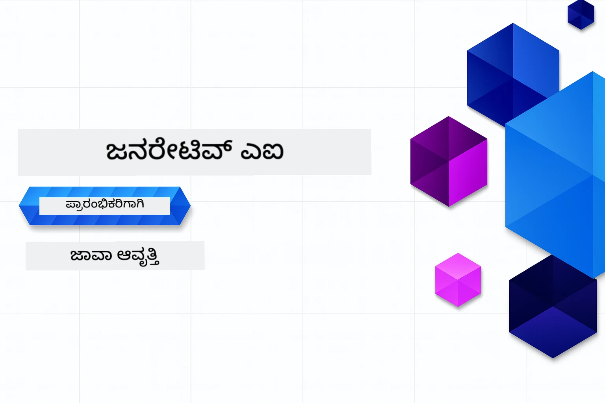

# ಆರಂಭಿಕರಿಗಾಗಿ ಜನರೇಟಿವ್ AI - ಜावा ಆವೃತ್ತಿ
[](https://discord.gg/nTYy5BXMWG)



**ಸಮಯ ಬಾಧ್ಯತೆ**: ಸಂಪೂರ್ಣ ಕಾರ್ಯಾಗಾರವು ಸ್ಥಳೀಯ ವ್ಯವಸ್ಥೆಯ ಆಯ್ಕೆಯಿಲ್ಲದೆ ಆನ್ಲೈನ್‌ನಲ್ಲಿ ಪೂರ್ಣಗೊಳ್ಳಬಹುದು. ಪರಿಸರ ಸೆಟಪ್ 2 ನಿಮಿಷಗಳು ತೆಗೆದುಕೊಳ್ಳುತ್ತದೆ, ಮಾದರಿಗಳನ್ನು ಅನ್ವೇಷಿಸುವುದು ಅನ್ವೇಷಣೆ ಆಳತೆಯ ಮೇಲೆ 1-3 ಗಂಟೆಗಳವರೆಗೆ ಬೇಕಾಗಬಹುದು.

> **ತಕ್ಷಣ ಪ್ರಾರಂಭಿಸಿ**

1. ಈ ಸಂಗ್ರಹಣೆಯನ್ನು ನಿಮ್ಮ GitHub ಖಾತೆಗೆ ಫೋರ್ಕ್ ಮಾಡಿ
2. **Code** → **Codespaces** ಟ್ಯಾಬ್ → **...** → **New with options...** ಕ್ಲಿಕ್ ಮಾಡಿ
3. ಡೀಫಾಲ್ಟ್ ಗಳನ್ನು ಬಳಸಿ – ಇದು ಈ ಕೋರ್ಸಿಗಾಗಿ ಸೃಷ್ಟಿಸಿದ Development ಕಂಟೈನರ್ ಆಯ್ಕೆಮಾಡುತ್ತದೆ
4. **Create codespace** ಅನ್ನು ಕ್ಲಿಕ್ ಮಾಡಿ
5. ಪರಿಸರ ಸಿದ್ಧವಾಗಲು ಸುಮಾರು 2 ನಿಮಿಷ ಕಾಯಿರಿ
6. ನೇರವಾಗಿ [ಮೊದಲ ಉದಾಹರಣೆಗೆ ಹಾರಲು](./02-SetupDevEnvironment/README.md#step-2-create-a-github-personal-access-token) ಹೋಗಿ

## ಬಹುಭಾಷಾ ಬೆಂಬಲ

### GitHub Action ಮೂಲಕ ಬೆಂಬಲಿತ (ಸ್ವಯಂಚಾಲಿತ ಮತ್ತು ಎಂದಿಗೂ ನವೀಕರित)

<!-- CO-OP TRANSLATOR LANGUAGES TABLE START -->
[ಅರಬ್ಬಿ](../ar/README.md) | [ಬೆಂಗಾಲಿ](../bn/README.md) | [ಬಲ್ಗೇರಿಯನ್](../bg/README.md) | [ಬರ್ಮೀಸ್ (ಮ್ಯಾನ್ಮಾರ್)](../my/README.md) | [ಚೀನೀ (ಸರಳ)](../zh-CN/README.md) | [ಚೀನೀ (ಪಾರಂಪರಿಕ, ಹಾಂಗ್ ಕಾಂಗ್)](../zh-HK/README.md) | [ಚೀನೀ (ಪಾರಂಪರಿಕ, ಮಕೌ)](../zh-MO/README.md) | [ಚೀನೀ (ಪಾರಂಪರಿಕ, ತೈವಾನ್)](../zh-TW/README.md) | [ಕ್ರೊಯೆಷಿಯನ್](../hr/README.md) | [ಚೆಕ್](../cs/README.md) | [ಡೆನಿಷ್](../da/README.md) | [ಡಚ್ಚ್](../nl/README.md) | [ಎಸ್ಟೋನಿಯನ್](../et/README.md) | [ಫಿನ್ನಿಷ್](../fi/README.md) | [ಫ್ರೆಂಚ್](../fr/README.md) | [ಜರ್ಮನ್](../de/README.md) | [ಗ್ರೀಕ್](../el/README.md) | [ಹೀಬ್ರೂ](../he/README.md) | [ಹಿಂದಿ](../hi/README.md) | [ಹಂಗೇರಿಯನ್](../hu/README.md) | [ಇಂಡೋನೇಷಿಯನ್](../id/README.md) | [ಇಟಾಲಿಯನ್](../it/README.md) | [ಜಪಾನೀಸ್](../ja/README.md) | [ಕನ್ನಡ](./README.md) | [ಖ್ಮೇರ್](../km/README.md) | [ಕೋರಿಯನ್](../ko/README.md) | [ಲಿಥುವೇನಿಯನ್](../lt/README.md) | [ಮಲಯ್](../ms/README.md) | [ಮಲಯಾಳಂ](../ml/README.md) | [ಮರಾಠಿ](../mr/README.md) | [ನೇಪಾಳಿ](../ne/README.md) | [ನೈಜೀರಿಯನ್ ಪಿಡ್ಗಿನ್](../pcm/README.md) | [ನಾರ್ವೇಜಿಯನ್](../no/README.md) | [ಪರ್ಸಿಯನ್ (ಫಾರ್ಸಿ)](../fa/README.md) | [ಪೋಲಿಷ್](../pl/README.md) | [ಪೋರ್ಚುಗೀಸ್ (ಬ್ರಾಜಿಲ್)](../pt-BR/README.md) | [ಪೋರ್ಚುಗೀಸ್ (ಪೋರ್ಚುಗಲ್)](../pt-PT/README.md) | [ಪಂಜಾಬಿ (ಗುರ್ಮುಖಿ)](../pa/README.md) | [ರೊಮೇನಿಯನ್](../ro/README.md) | [ರಶಿಯನ್](../ru/README.md) | [ಸೆರ್ಬಿಯನ್ (ಸಿರಿಲಿಕ್)](../sr/README.md) | [ಸ್ಲೋವಾಕ್](../sk/README.md) | [ಸ್ಲೋವೇನಿಯನ್](../sl/README.md) | [ಸ್ಪ್ಯಾನಿಷ್](../es/README.md) | [ಸ್ವಾಹಿಲಿ](../sw/README.md) | [ಸ್ವೀಡಿಷ್](../sv/README.md) | [ಟ್ಯಾಗಲೊಗ್ (ಫಿಲಿಪಿನೋ)](../tl/README.md) | [ತಮಿಳ್](../ta/README.md) | [ತೆಲುಗು](../te/README.md) | [ಥಾಯಿ](../th/README.md) | [ಟರ್ಕಿಷ್](../tr/README.md) | [ಉಕ್ರೇನಿಯನ್](../uk/README.md) | [ಉರ್ದು](../ur/README.md) | [ವಿಯೆಟ್ನಾಮೀಸ್](../vi/README.md)

> **ಸ್ಥಳೀಯವಾಗಿ ಕ್ಲೋನ್ ಮಾಡಲು ಇಷ್ಟವಿದೆಯೇ?**
>
> ಈ ಸಂಗ್ರಹಣೆಯಲ್ಲಿ 50+ ಭಾಷಾ ಅನುವಾದಗಳು ಒಳಗೊಂಡಿದ್ದು ಡೌನ್ಲೋಡ್ ಗಾತ್ರವನ್ನು ಬಹಳಷ್ಟು ಹೆಚ್ಚಿಸುತ್ತದೆ. ಅನುವಾದಗಳಿಲ್ಲದೆ ಕ್ಲೋನ್ ಮಾಡಲು, ಸ್ಪಾರ್ಸ್ ಚೆಕೌಟ್ ಉಪಯೋಗಿಸಿ:
>
> **ಬ್ಯಾಶ್ / macOS / ಲಿನಕ್ಸ್:**
> ```bash
> git clone --filter=blob:none --sparse https://github.com/microsoft/Generative-AI-for-beginners-java.git
> cd Generative-AI-for-beginners-java
> git sparse-checkout set --no-cone '/*' '!translations' '!translated_images'
> ```
>
> **CMD (ವಿಂಡೋಸ್):**
> ```cmd
> git clone --filter=blob:none --sparse https://github.com/microsoft/Generative-AI-for-beginners-java.git
> cd Generative-AI-for-beginners-java
> git sparse-checkout set --no-cone "/*" "!translations" "!translated_images"
> ```
>
> ಇದು ಕೋರ್ಸನ್ನು ಪೂರ್ಣಗೊಳಿಸಲು ಬೇಕಾದ ಎಲ್ಲವನ್ನೂ ತುಂಬಾ ವೇಗವಾದ ಡೌನ್ಲೋಡ್ ಸಹಿತ ನಿಮಗೆ ನೀಡುತ್ತದೆ.
<!-- CO-OP TRANSLATOR LANGUAGES TABLE END -->

## ಕೋರ್ಸ್ ರಚನೆ ಮತ್ತು ಅಧ್ಯಯನ ದಾರಿ

### **ಅಧ್ಯಾಯ 1: ಜನರೇಟಿವ್ AI ಗೆ ಪರಿಚಯ**
- **ಮೂಲಭೂತ ತತ್ವಗಳು**: ದೊಡ್ಡ ಭಾಷಾ ಮಾದರಿಗಳನ್ನು, ಟೋಕನ್ಗಳನ್ನು, ಎम्बೆಡಿಂಗ್ಸ್, ಮತ್ತು AI ಸಾಮರ್ಥ್ಯಗಳನ್ನು ಅರ್ಥಮಾಡಿಕೊಳ್ಳುವುದು
- **ಜಾವಾ AI ಪಾರಿಸರ**: ಸ್ಪ್ರಿಂಗ್ AI ಮತ್ತು OpenAI SDK ಗಳ ಅವಲೋಕನ
- **ಮಾದರಿ ಸಾಂಕೇತಿಕ ಪ್ರೋಟೋಕಾಲ್**: MCP ಗೆ ಪರಿಚಯ ಮತ್ತು AI ಏಜೆಂಟ್ ಸಂವಹನದಲ್ಲಿ ಇದರ ಪಾತ್ರ
- **ಪ್ರಾಯೋಗಿಕ ಅನ್ವಯಗಳು**: ಚಾಟ್‌ಬಾಟ್‌ಗಳು ಮತ್ತು ವಿಷಯ ರಚನೆಯಂತಹ ನೈಜ ಜಗತ್ತಿನ ಎದುರಿನ ಘಟನೆಗಳು
- **[→ ಅಧ್ಯಾಯ 1 ನ ಪ್ರಾರಂಭಿಸಿ](./01-IntroToGenAI/README.md)**

### **ಅಧ್ಯಾಯ 2: ಅಭಿವೃದ್ಧಿ ಪರಿಸರ ಸೆಟಪ್**
- **ಬಹು-ಪ್ರದಾಯಕ ಕಾನ್ಫಿಗರೇಶನ್**: GitHub ಮಾದರಿಗಳು, ಅಜುರ್ OpenAI, ಮತ್ತು OpenAI ಜಾವಾ SDK ಒಕ್ಕೂಟಗಳನ್ನು ಸೆಟ್ ಮಾಡಿ
- **ಸ್ಪ್ರಿಂಗ್ ಬೂಟ್ + ಸ್ಪ್ರಿಂಗ್ AI**: ಉದ್ಯಮ AI ಅಪ್ಲಿಕೇಶನ್ ಅಭಿವೃದ್ಧಿಗಳಿಗೆ ಉತ್ತಮ ಅಭ್ಯಾಸಗಳು
- **GitHub ಮಾದರಿಗಳು**: ಪ್ರೋಟೋ ಟೈಪಿಂಗ್ ಮತ್ತು ಕಲಿಕೆಗೆ ಉಚಿತ AI ಮಾದರಿ ಪ್ರವೇಶ (ಕ್ರೆಡಿಟ್ ಕಾರ್ಡ್ ಅಗತ್ಯವಿಲ್ಲ)
- **ಅಭಿವೃದ್ಧಿ ಉಪಕರಣಗಳು**: ಡೋಕರ್ ಕಂಟೈನರ್‌ಗಳು, VS ಕೋಡ್, ಮತ್ತು GitHub ಕೋಡ್ಸ್ಪೇಸ್ ಕಾನ್ಫಿಗರೇಶನ್
- **[→ ಅಧ್ಯಾಯ 2 ನ ಪ್ರಾರಂಭಿಸಿ](./02-SetupDevEnvironment/README.md)**

### **ಅಧ್ಯಾಯ 3: ಮೂಲ ಜನರೇಟಿವ್ AI ತಂತ್ರಗಳು**
- **ಪ್ರಾಂಪ್ಟ್ ಎಂಜಿನಿಯರಿಂಗ್**: ಉತ್ತಮ AI ಮಾದರಿ ಪ್ರತಿಕ್ರಿಯೆಗಳ ತಂತ್ರಗಳು
- **ಎಂಬೆಡಿಂಗ್ಸ್ ಮತ್ತು ವೆಕ್ಟರ್ ಕಾರ್ಯಾಚರಣೆಗಳು**: ಸೆಮ್ಯಾಂಟಿಕ್ ಹುಡುಕಾಟ ಮತ್ತು ಸಮಾನತೆ ಹೊಂದಾಣಿಕೆಯನ್ನು ಅನುಷ್ಠಾನಗೊಳಿಸಿ
- **ರಿಟ್ರಿವಲ್-ಆಗ್ಮೆಂಟ್ ಜನರೇಶನ್ (RAG)**: ನಿಮ್ಮದೇ ದತ್ತಾಸೋತ್ರಗಳೊಂದಿಗೆ AI ನ ಸಂಯೋಜನೆ
- **ಫಂಕ್ಷನ್ ಕಾಲಿಂಗ್**: ಕಸ್ಟಮ್ ಉಪಕರಣಗಳು ಮತ್ತು ಪ್ಲಗಿನ್‌ಗಳ ಮೂಲಕ AI ಸಾಮರ್ಥ್ಯಗಳನ್ನು ವಿಸ್ತರಿಸಿ
- **[→ ಅಧ್ಯಾಯ 3 ನ ಪ್ರಾರಂಭಿಸಿ](./03-CoreGenerativeAITechniques/README.md)**

### **ಅಧ್ಯಾಯ 4: ಪ್ರಾಯೋಗಿಕ ಅನ್ವಯಗಳು ಮತ್ತು ಯೋಜನೆಗಳು**
- **ಪಿಟ್ ಸ್ಟೋರಿ ಜನರೇಟರ್** (`petstory/`): GitHub ಮಾದರಿಗಳೊಂದಿಗೆ ಸೃಜನಾತ್ಮಕ ವಿಷಯ ರಚனை
- **ಫೌಂಡ್ರಿ ಲೋಕಲ್ ಡೆಮೋ** (`foundrylocal/`): OpenAI ಜಾವಾ SDK ಸಹಿತ ಸ್ಥಳೀಯ AI ಮಾದರಿ ಸಂಯೋಜನೆ
- **MCP ಕ್ಯಾಲ್ಕ್ಯುಲೇಟರ್ ಸೇವೆ** (`calculator/`): ಸ್ಪ್ರಿಂಗ್ AI ಜೊತೆ ಮೂಲ Model Context Protocol ಅನ್ವಯಿಸುವಿಕೆ
- **[→ ಅಧ್ಯಾಯ 4 ನ ಪ್ರಾರಂಭಿಸಿ](./04-PracticalSamples/README.md)**

### **ಅಧ್ಯಾಯ 5: ಜವಾಬ್ದಾರಿಯುತ AI ಅಭಿವೃದ್ಧಿ**
- **GitHub ಮಾದರಿಗಳ ಸುರಕ್ಷತೆ**: ಒಳಗೊಳಿಸಿದ ವಿಷಯ ಫಿಲ್ಟರಿಂಗ್ ಮತ್ತು ಸುರಕ್ಷತಾ ವ್ಯವಸ್ಥೆಗಳ ಪರೀಕ್ಷೆ (ಕಠಿಣ ನಿರ್ಬಂಧಗಳು ಮತ್ತು ಸ್ತ್ರೀಕೃತ ನಿರಾಕರಣೆಗಳು)
- **ಜವಾಬ್ದಾರಿಯುತ AI ಡೆಮೋ**: ಆಧುನಿಕ AI ಸುರಕ್ಷತಾ ವ್ಯವಸ್ಥೆಗಳ ಹಸ್ತ ಚಾಲಿತ ಉದಾಹರಣೆ
- **ಅತ್ಯುತ್ತಮ ಅಭ್ಯಾಸಗಳು**: ನೈತಿಕ AI ಅಭಿವೃದ್ಧಿ ಮತ್ತು ನಿಯೋಜನೆಗೆ ನಿರ್ದಿಷ್ಟ ಮಾರ್ಗದರ್ಶನಗಳು
- **[→ ಅಧ್ಯಾಯ 5 ನ ಪ್ರಾರಂಭಿಸಿ](./05-ResponsibleGenAI/README.md)**

## ಹೆಚ್ಚುವರಿ ಸಂಪನ್ಮೂಲಗಳು

<!-- CO-OP TRANSLATOR OTHER COURSES START -->
### ಲಾಂಗ್‌ಚೇನ್
[](https://aka.ms/langchain4j-for-beginners)
[](https://aka.ms/langchainjs-for-beginners?WT.mc_id=m365-94501-dwahlin)
[](https://github.com/microsoft/langchain-for-beginners?WT.mc_id=m365-94501-dwahlin)
---

### ಅಜುರ್ / ಎಡ್ಜ್ / MCP / ಏಜೆಂಟ್‌ಗಳು
[](https://github.com/microsoft/AZD-for-beginners?WT.mc_id=academic-105485-koreyst)
[](https://github.com/microsoft/edgeai-for-beginners?WT.mc_id=academic-105485-koreyst)
[](https://github.com/microsoft/mcp-for-beginners?WT.mc_id=academic-105485-koreyst)
[](https://github.com/microsoft/ai-agents-for-beginners?WT.mc_id=academic-105485-koreyst)

---
 
### ಜನರೇಟಿವ್ AI ಸರಣಿ
[](https://github.com/microsoft/generative-ai-for-beginners?WT.mc_id=academic-105485-koreyst)
[-9333EA?style=for-the-badge&labelColor=E5E7EB&color=9333EA)](https://github.com/microsoft/Generative-AI-for-beginners-dotnet?WT.mc_id=academic-105485-koreyst)
[-C084FC?style=for-the-badge&labelColor=E5E7EB&color=C084FC)](https://github.com/microsoft/generative-ai-for-beginners-java?WT.mc_id=academic-105485-koreyst)
[-E879F9?style=for-the-badge&labelColor=E5E7EB&color=E879F9)](https://github.com/microsoft/generative-ai-with-javascript?WT.mc_id=academic-105485-koreyst)

---
 
### ಮೂಲ ಅಧ್ಯಯನ
[](https://aka.ms/ml-beginners?WT.mc_id=academic-105485-koreyst)
[](https://aka.ms/datascience-beginners?WT.mc_id=academic-105485-koreyst)
[](https://aka.ms/ai-beginners?WT.mc_id=academic-105485-koreyst)
[](https://github.com/microsoft/Security-101?WT.mc_id=academic-96948-sayoung)

[](https://aka.ms/webdev-beginners?WT.mc_id=academic-105485-koreyst)
[](https://aka.ms/iot-beginners?WT.mc_id=academic-105485-koreyst)
[](https://github.com/microsoft/xr-development-for-beginners?WT.mc_id=academic-105485-koreyst)

---
 
### ಕೋಪಿಲಟ್ ಸರಣಿ
[](https://aka.ms/GitHubCopilotAI?WT.mc_id=academic-105485-koreyst)
[](https://github.com/microsoft/mastering-github-copilot-for-dotnet-csharp-developers?WT.mc_id=academic-105485-koreyst)
[](https://github.com/microsoft/CopilotAdventures?WT.mc_id=academic-105485-koreyst)
<!-- CO-OP TRANSLATOR OTHER COURSES END -->

## ಸಹಾಯ ಪಡೆಯುವುದು

ನೀವು ಸಿಲುಕಿಬಿದ್ದೀರಾ ಅಥವಾ AI ಅಪ್ಲಿಕೇಶನ್‌ಗಳನ್ನು ನಿರ್ಮಿಸುವ ಬಗ್ಗೆ ಯಾವುದೇ ಪ್ರಶ್ನೆಗಳಿದ್ದರೆ. MCP ಬಗ್ಗೆ ಚರ್ಚೆಗಳಲ್ಲಿ ಸಹಯೋಧ್ಯಾಯಿಸುತ್ತಿರುವ ಕಲಿತುಕೊಳ್ಳುವವರ ಮತ್ತು ಪರಿಣತಿ ಹೊಂದಿದ ಡೆವಲಪರ್‌ಗಳ ಜೊತೆ ಸೇರಿಕೊಳ್ಳಿ. ಇದು ಪ್ರಶ್ನೆಗಳಿಗೆ ಸ್ವಾಗತ ನೀಡುವ ಮತ್ತು ಜ್ಞಾನವು ಮುಕ್ತವಾಗಿ ಹಂಚಿಕೊಳ್ಳುವ ಏಕತೆಯ ಸಮುದಾಯವಾಗಿದೆ.

[](https://discord.gg/nTYy5BXMWG)

ನೀವು ಉತ್ಪನ್ನ ಪ್ರತಿಕ್ರಿಯೆ ಅಥವಾ ತಪ್ಪುಗಳಿದ್ದರೆ ನಿರ್ಮಾಣ ಮಾಡುವಾಗ ಭೇಟಿ ನೀಡಿ:

[](https://aka.ms/foundry/forum)

---

<!-- CO-OP TRANSLATOR DISCLAIMER START -->
**ಅಸ್ವೀಕಾರಿಕೆ**:  
ಈ ಡಾಕ್ಯುಮೆಂಟ್ ಅನ್ನು AI ಭಾಷಾಂತರ ಸೇವೆ [Co-op Translator](https://github.com/Azure/co-op-translator) ಬಳಸಿ ಅನುವಾದಿಸಲಾಗಿದೆ. ನಾವು ಶುದ್ಧತೆಯನ್ನು ಗುರಿಗೊಳ್ಳುತ್ತೇವೆ, ಆದರೆ ಸ್ವಯಂಚಾಲಿತ ಭಾಷಾಂತರಗಳಲ್ಲಿ ದೋಷಗಳು ಅಥವಾ ಅಸತ್ಯತೆಗಳಿರಬಹುದು ಎಂಬುದು ದಯವಿಟ್ಟು ಗಮನಿಸಿ. ಮೂಲ ಡಾಕ್ಯುಮೆಂಟ್ ತನ್ನ ಸ್ವದೇಶಿ ಭಾಷೆಯಲ್ಲಿ ಅಧಿಕಾರಬದ್ಧ ಮೂಲವಾಗಿರಬಹುದು. ಪ್ರಮುಖ ಮಾಹಿತಿಗಾಗಿ ವೃತ್ತಿಪರ ಮಾನವ ಭಾಷಾಂತರವನ್ನು ಶಿಫಾರಸು ಮಾಡಲಾಗುತ್ತದೆ. ಈ ಭಾಷಾಂತರ ಬಳಕೆಯಿಂದ ಉಂಟಾಗುವ ಯಾವುದೇ ತಪ್ಪು ಅರ್ಥ ಅಥವಾ ತಪ್ಪಾಗಿ ಅರ್ಥಮಾಡಿಕೊಳ್ಳುವಿಕೆಗಾಗಿ ನಾವು ಜವಾಬ್ದಾರರಲ್ಲ.
<!-- CO-OP TRANSLATOR DISCLAIMER END -->