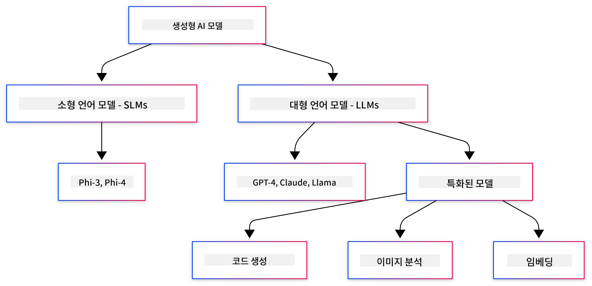
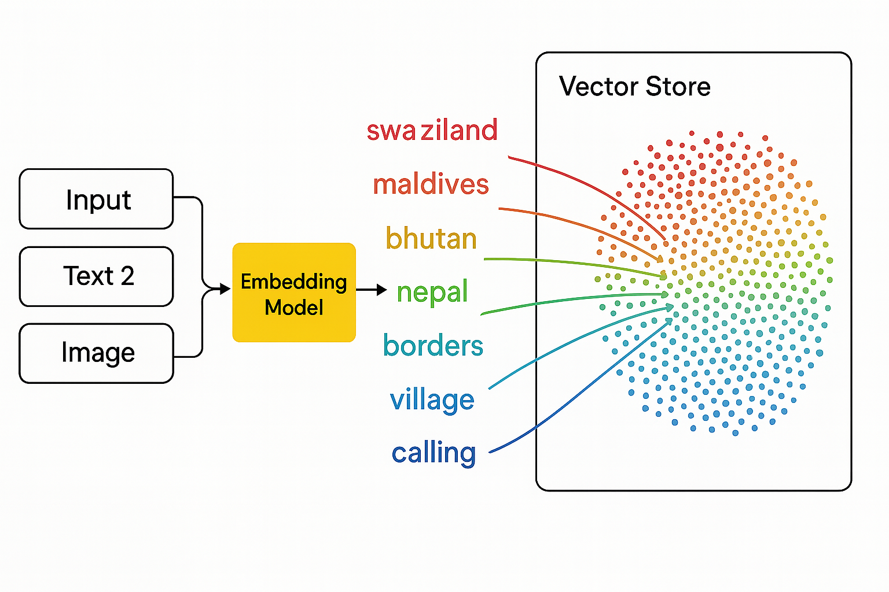
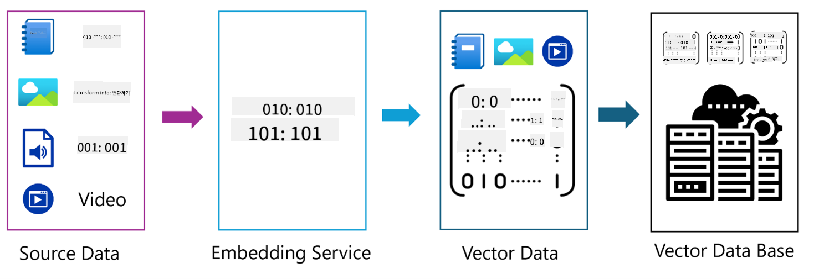

<!--
CO_OP_TRANSLATOR_METADATA:
{
  "original_hash": "006866db93a268a8769bb55f2e324291",
  "translation_date": "2025-07-28T10:31:16+00:00",
  "source_file": "01-IntroToGenAI/README.md",
  "language_code": "ko"
}
-->
# 생성형 AI 입문 - Java 에디션

## 학습 목표

- **생성형 AI의 기본 개념**: LLM, 프롬프트 엔지니어링, 토큰, 임베딩, 벡터 데이터베이스 등
- **Java AI 개발 도구 비교**: Azure OpenAI SDK, Spring AI, OpenAI Java SDK
- **모델 컨텍스트 프로토콜**과 AI 에이전트 간의 통신 역할 이해

## 목차

- [소개](../../../01-IntroToGenAI)
- [생성형 AI 개념 간단 복습](../../../01-IntroToGenAI)
- [프롬프트 엔지니어링 리뷰](../../../01-IntroToGenAI)
- [토큰, 임베딩, 에이전트](../../../01-IntroToGenAI)
- [Java용 AI 개발 도구 및 라이브러리](../../../01-IntroToGenAI)
  - [OpenAI Java SDK](../../../01-IntroToGenAI)
  - [Spring AI](../../../01-IntroToGenAI)
  - [Azure OpenAI Java SDK](../../../01-IntroToGenAI)
- [요약](../../../01-IntroToGenAI)
- [다음 단계](../../../01-IntroToGenAI)

## 소개

생성형 AI 입문 - Java 에디션의 첫 번째 장에 오신 것을 환영합니다! 이 기초 강의에서는 생성형 AI의 핵심 개념과 Java를 사용하여 이를 다루는 방법을 소개합니다. 여기서는 대규모 언어 모델(LLM), 토큰, 임베딩, AI 에이전트 등 AI 애플리케이션의 필수 구성 요소를 배우게 됩니다. 또한, 이 과정에서 사용할 주요 Java 도구도 살펴볼 것입니다.

### 생성형 AI 개념 간단 복습

생성형 AI는 데이터에서 학습한 패턴과 관계를 기반으로 텍스트, 이미지, 코드 등 새로운 콘텐츠를 생성하는 인공지능의 한 유형입니다. 생성형 AI 모델은 인간과 유사한 응답을 생성하고, 맥락을 이해하며, 때로는 인간처럼 보이는 콘텐츠를 생성할 수도 있습니다.

Java AI 애플리케이션을 개발하면서 **생성형 AI 모델**을 사용해 콘텐츠를 생성하게 됩니다. 생성형 AI 모델의 주요 기능은 다음과 같습니다:

- **텍스트 생성**: 챗봇, 콘텐츠 작성, 텍스트 완성을 위한 인간과 유사한 텍스트 생성
- **이미지 생성 및 분석**: 현실감 있는 이미지 생성, 사진 보정, 객체 감지
- **코드 생성**: 코드 스니펫 또는 스크립트 작성

특정 작업에 최적화된 모델도 있습니다. 예를 들어, **소형 언어 모델(SLM)**과 **대규모 언어 모델(LLM)**은 텍스트 생성 작업을 처리할 수 있으며, LLM은 일반적으로 복잡한 작업에서 더 나은 성능을 제공합니다. 이미지 관련 작업에는 비전 모델이나 멀티모달 모델을 사용합니다.

물론, 이러한 모델의 응답이 항상 완벽한 것은 아닙니다. 모델이 "환각"을 일으키거나 잘못된 정보를 권위적으로 생성하는 경우를 들어본 적이 있을 것입니다. 하지만 명확한 지침과 맥락을 제공함으로써 모델이 더 나은 응답을 생성하도록 도울 수 있습니다. 이것이 바로 **프롬프트 엔지니어링**의 역할입니다.

#### 프롬프트 엔지니어링 리뷰

프롬프트 엔지니어링은 AI 모델이 원하는 출력을 생성하도록 효과적인 입력을 설계하는 실천 방법입니다. 이는 다음을 포함합니다:

- **명확성**: 지침을 명확하고 모호하지 않게 작성
- **맥락 제공**: 필요한 배경 정보를 제공
- **제약 조건**: 제한 사항이나 형식 지정

프롬프트 엔지니어링의 몇 가지 모범 사례는 프롬프트 설계, 명확한 지침 작성, 작업 세분화, 원샷 및 퓨샷 학습, 프롬프트 튜닝 등이 있습니다. 특정 사용 사례에 가장 적합한 프롬프트를 찾기 위해 다양한 프롬프트를 테스트하는 것이 중요합니다.

애플리케이션 개발 시, 다음과 같은 다양한 프롬프트 유형을 다루게 됩니다:
- **시스템 프롬프트**: 모델의 동작을 위한 기본 규칙과 맥락 설정
- **사용자 프롬프트**: 애플리케이션 사용자로부터 입력받은 데이터
- **어시스턴트 프롬프트**: 시스템 및 사용자 프롬프트를 기반으로 한 모델의 응답

> **자세히 알아보기**: [생성형 AI 입문 과정의 프롬프트 엔지니어링 챕터](https://github.com/microsoft/generative-ai-for-beginners/tree/main/04-prompt-engineering-fundamentals)에서 프롬프트 엔지니어링에 대해 더 알아보세요.

#### 토큰, 임베딩, 에이전트

생성형 AI 모델을 다룰 때 **토큰**, **임베딩**, **에이전트**, **모델 컨텍스트 프로토콜(MCP)**과 같은 용어를 접하게 됩니다. 이 개념들을 자세히 살펴보겠습니다:

- **토큰**: 토큰은 모델에서 텍스트의 가장 작은 단위입니다. 단어, 문자, 또는 서브워드일 수 있습니다. 토큰은 모델이 텍스트 데이터를 이해할 수 있는 형식으로 표현하는 데 사용됩니다. 예를 들어, "The quick brown fox jumped over the lazy dog"라는 문장은 ["The", " quick", " brown", " fox", " jumped", " over", " the", " lazy", " dog"] 또는 ["The", " qu", "ick", " br", "own", " fox", " jump", "ed", " over", " the", " la", "zy", " dog"]와 같이 토큰화될 수 있습니다.

토큰화는 텍스트를 이러한 작은 단위로 나누는 과정입니다. 이는 모델이 원시 텍스트가 아닌 토큰을 기반으로 작동하기 때문에 중요합니다. 프롬프트의 토큰 수는 모델의 응답 길이와 품질에 영향을 미치며, 모델은 컨텍스트 윈도우에 대한 토큰 제한(예: GPT-4의 경우 총 128K 토큰)을 가지고 있습니다.

  Java에서는 OpenAI SDK와 같은 라이브러리를 사용하여 AI 모델에 요청을 보낼 때 토큰화를 자동으로 처리할 수 있습니다.

- **임베딩**: 임베딩은 토큰의 의미를 캡처하는 벡터 표현입니다. 이는 숫자 배열(일반적으로 부동 소수점 숫자)로 표현되며, 모델이 단어 간의 관계를 이해하고 맥락적으로 적절한 응답을 생성할 수 있도록 합니다. 유사한 단어는 유사한 임베딩을 가지며, 이를 통해 모델이 동의어나 의미적 관계를 이해할 수 있습니다.

  Java에서는 OpenAI SDK 또는 임베딩 생성을 지원하는 다른 라이브러리를 사용하여 임베딩을 생성할 수 있습니다. 이러한 임베딩은 의미적 검색과 같은 작업에 필수적이며, 이는 정확한 텍스트 일치가 아닌 의미를 기반으로 유사한 콘텐츠를 찾는 데 사용됩니다.

- **벡터 데이터베이스**: 벡터 데이터베이스는 임베딩에 최적화된 특수 저장 시스템입니다. 이는 효율적인 유사성 검색을 가능하게 하며, 의미적 유사성에 기반하여 대규모 데이터셋에서 관련 정보를 검색해야 하는 RAG(Retrieval-Augmented Generation) 패턴에서 필수적입니다.

> **참고**: 이 과정에서는 벡터 데이터베이스를 다루지 않지만, 실제 애플리케이션에서 자주 사용되므로 언급할 가치가 있습니다.

- **에이전트 & MCP**: 모델, 도구, 외부 시스템과 자율적으로 상호작용하는 AI 구성 요소입니다. 모델 컨텍스트 프로토콜(MCP)은 에이전트가 외부 데이터 소스와 도구에 안전하게 액세스할 수 있는 표준화된 방법을 제공합니다. [MCP 입문 과정](https://github.com/microsoft/mcp-for-beginners)에서 더 알아보세요.

Java AI 애플리케이션에서는 텍스트 처리에 토큰을, 의미적 검색과 RAG에 임베딩을, 데이터 검색에 벡터 데이터베이스를, 도구를 사용하는 지능형 시스템을 구축하기 위해 MCP를 사용하는 에이전트를 활용하게 됩니다.

### Java용 AI 개발 도구 및 라이브러리

Java는 AI 개발을 위한 훌륭한 도구를 제공합니다. 이 과정에서는 OpenAI Java SDK, Azure OpenAI SDK, Spring AI라는 세 가지 주요 라이브러리를 탐구할 것입니다.

다음은 각 챕터의 예제에서 사용된 SDK를 보여주는 참조 표입니다:

| 챕터 | 샘플 | SDK |
|---------|--------|-----|
| 02-개발환경설정 | github-models | OpenAI Java SDK |
| 02-개발환경설정 | basic-chat-azure | Spring AI Azure OpenAI |
| 03-핵심생성형AITechniques | examples | Azure OpenAI SDK |
| 04-실용샘플 | petstory | OpenAI Java SDK |
| 04-실용샘플 | foundrylocal | OpenAI Java SDK |
| 04-실용샘플 | calculator | Spring AI MCP SDK + LangChain4j |

**SDK 문서 링크:**
- [Azure OpenAI Java SDK](https://github.com/Azure/azure-sdk-for-java/tree/azure-ai-openai_1.0.0-beta.16/sdk/openai/azure-ai-openai)
- [Spring AI](https://docs.spring.io/spring-ai/reference/)
- [OpenAI Java SDK](https://github.com/openai/openai-java)
- [LangChain4j](https://docs.langchain4j.dev/)

#### OpenAI Java SDK

OpenAI SDK는 OpenAI API를 위한 공식 Java 라이브러리입니다. OpenAI의 모델과 상호작용하기 위한 간단하고 일관된 인터페이스를 제공하며, Java 애플리케이션에 AI 기능을 쉽게 통합할 수 있습니다. 챕터 2의 GitHub Models 예제, 챕터 4의 Pet Story 애플리케이션 및 Foundry Local 예제에서 OpenAI SDK 접근 방식을 보여줍니다.

#### Spring AI

Spring AI는 Spring 애플리케이션에 AI 기능을 제공하는 포괄적인 프레임워크로, 다양한 AI 제공업체에 대한 일관된 추상화 계층을 제공합니다. Spring 생태계와 원활하게 통합되어, AI 기능이 필요한 엔터프라이즈 Java 애플리케이션에 이상적입니다.

Spring AI의 강점은 Spring 생태계와의 원활한 통합으로, 의존성 주입, 구성 관리, 테스트 프레임워크와 같은 친숙한 Spring 패턴을 사용하여 프로덕션 준비가 된 AI 애플리케이션을 쉽게 구축할 수 있다는 점입니다. 챕터 2와 4에서 Spring AI를 사용하여 OpenAI 및 모델 컨텍스트 프로토콜(MCP) Spring AI 라이브러리를 활용하는 애플리케이션을 구축합니다.

##### 모델 컨텍스트 프로토콜 (MCP)

[모델 컨텍스트 프로토콜(MCP)](https://modelcontextprotocol.io/)은 AI 애플리케이션이 외부 데이터 소스 및 도구와 안전하게 상호작용할 수 있도록 하는 신흥 표준입니다. MCP는 AI 모델이 컨텍스트 정보를 액세스하고 애플리케이션에서 작업을 실행할 수 있는 표준화된 방법을 제공합니다.

챕터 4에서는 Spring AI를 사용하여 모델 컨텍스트 프로토콜의 기본 사항을 보여주는 간단한 MCP 계산기 서비스를 구축하며, 기본 도구 통합 및 서비스 아키텍처를 만드는 방법을 배웁니다.

#### Azure OpenAI Java SDK

Azure OpenAI Java 클라이언트 라이브러리는 OpenAI의 REST API를 Azure SDK 생태계와 통합된 관용적 인터페이스로 변환한 것입니다. 챕터 3에서는 Azure OpenAI SDK를 사용하여 챗 애플리케이션, 함수 호출, RAG(Retrieval-Augmented Generation) 패턴을 포함한 애플리케이션을 구축합니다.

> 참고: Azure OpenAI SDK는 기능 면에서 OpenAI Java SDK보다 뒤처지므로, 향후 프로젝트에서는 OpenAI Java SDK를 사용하는 것을 고려하세요.

## 요약

**축하합니다!** 다음을 성공적으로 학습했습니다:

- **생성형 AI의 기본 개념**: LLM, 프롬프트 엔지니어링, 토큰, 임베딩, 벡터 데이터베이스 등
- **Java AI 개발 도구 비교**: Azure OpenAI SDK, Spring AI, OpenAI Java SDK
- **모델 컨텍스트 프로토콜**과 AI 에이전트 간의 통신 역할 이해

## 다음 단계

[챕터 2: 개발 환경 설정](../02-SetupDevEnvironment/README.md)

**면책 조항**:  
이 문서는 AI 번역 서비스 [Co-op Translator](https://github.com/Azure/co-op-translator)를 사용하여 번역되었습니다. 정확성을 위해 최선을 다하고 있지만, 자동 번역에는 오류나 부정확성이 포함될 수 있습니다. 원본 문서의 원어 버전이 권위 있는 출처로 간주되어야 합니다. 중요한 정보의 경우, 전문적인 인간 번역을 권장합니다. 이 번역 사용으로 인해 발생하는 오해나 잘못된 해석에 대해 당사는 책임을 지지 않습니다.