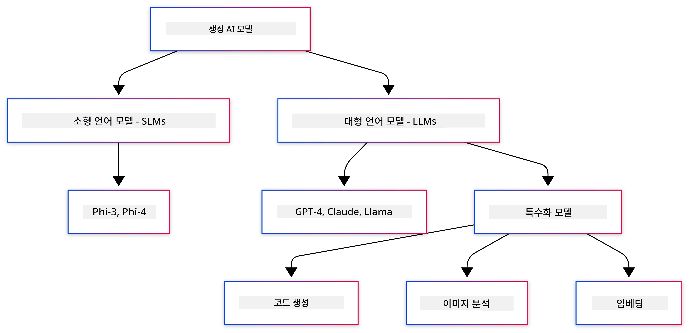
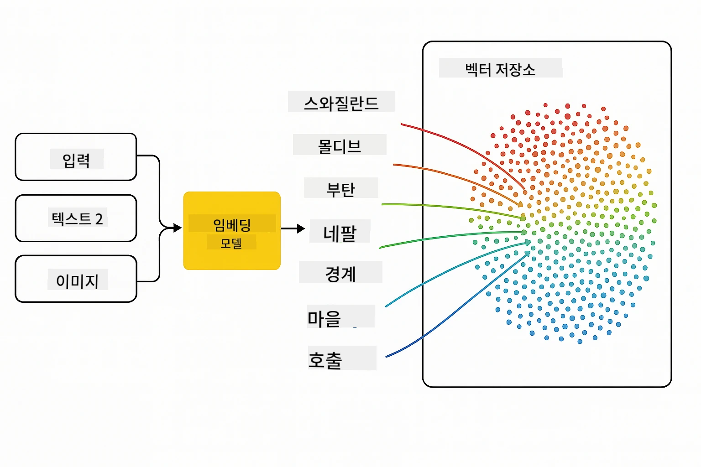
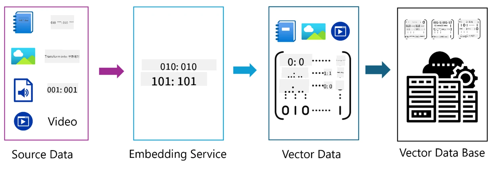
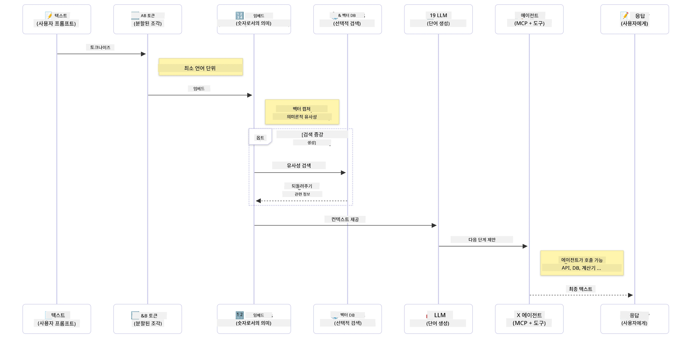

# 생성형 AI 소개 - 자바 에디션

> <strong>비디오</strong>: [이 수업에 대한 비디오 개요를 YouTube에서 시청하세요.](https://www.youtube.com/watch?v=XH46tGp_eSw) 위의 썸네일 이미지를 클릭해도 됩니다.

## 배울 내용

- LLM, 프롬프트 엔지니어링, 토큰, 임베딩, 벡터 데이터베이스 등 **생성형 AI 기초**
- Azure OpenAI SDK, Spring AI, OpenAI Java SDK 등 **자바 AI 개발 도구 비교**
- AI 에이전트 통신에서의 역할인 **Model Context Protocol** 발견

## 목차

- [소개](#소개)
- [생성형 AI 개념 간단 복습](#생성형-ai-개념-간단-복습)
- [프롬프트 엔지니어링 리뷰](#프롬프트-엔지니어링-리뷰)
- [토큰, 임베딩, 에이전트](#토큰-임베딩-에이전트)
- [자바용 AI 개발 도구 및 라이브러리](#자바용-ai-개발-도구-및-라이브러리)
  - [OpenAI Java SDK](#openai-java-sdk)
  - [Spring AI](#spring-ai)
  - [Azure OpenAI Java SDK](#azure-openai-java-sdk)
- [요약](#요약)
- [다음 단계](#다음-단계)

## 소개

초보자를 위한 생성형 AI - 자바 에디션의 첫 번째 챕터에 오신 것을 환영합니다! 이 기본 수업에서는 생성형 AI의 핵심 개념과 이를 자바로 활용하는 방법을 소개합니다. LLM, 토큰, 임베딩, AI 에이전트 등 AI 애플리케이션의 필수 구성 요소에 대해 배우게 됩니다. 또한 이 과정 전반에 걸쳐 사용할 주요 자바 도구도 살펴봅니다.

### 생성형 AI 개념 간단 복습

생성형 AI는 데이터에서 학습한 패턴과 관계를 바탕으로 텍스트, 이미지, 코드와 같은 새 콘텐츠를 생성하는 인공지능 유형입니다. 생성형 AI 모델은 사람과 유사한 응답을 생성하고, 맥락을 이해하며, 때로는 인간과 비슷한 콘텐츠까지 만들 수 있습니다.

자바 AI 애플리케이션을 개발할 때는 <strong>생성형 AI 모델</strong>을 활용해 콘텐츠를 생성합니다. 생성형 AI 모델의 일부 기능은 다음과 같습니다:

- **텍스트 생성**: 챗봇, 콘텐츠, 텍스트 완성을 위한 사람 같은 텍스트 작성
- **이미지 생성 및 분석**: 사실적인 이미지 생성, 사진 향상, 객체 감지
- **코드 생성**: 코드 스니펫이나 스크립트 작성

각 작업에 최적화된 특정 종류의 모델이 있습니다. 예를 들어, <strong>소형 언어 모델(SLM)</strong>과 **대형 언어 모델(LLM)** 모두 텍스트 생성이 가능하며, 복잡한 작업에서는 보통 LLM이 더 나은 성능을 보입니다. 이미지 관련 작업에는 특화된 비전 모델이나 멀티모달 모델을 사용합니다.

물론, 이 모델들의 응답이 항상 완벽한 것은 아닙니다. 모델이 "환각(hallucinate)"하거나 권위있게 틀린 정보를 생성한다는 이야기를 들어보셨을 겁니다. 하지만 명확한 지시와 맥락을 제공하여 모델이 더 나은 응답을 생성하도록 안내할 수 있습니다. 이 부분에서 <strong>프롬프트 엔지니어링</strong>이 중요해집니다.

#### 프롬프트 엔지니어링 리뷰

프롬프트 엔지니어링은 AI 모델이 원하는 출력을 내도록 효과적인 입력을 설계하는 실천입니다. 다음을 포함합니다:

- <strong>명확성</strong>: 지시 사항을 명확하고 모호하지 않게 만들기
- <strong>맥락</strong>: 필요한 배경 정보 제공
- <strong>제약조건</strong>: 제한사항이나 형식 명시

프롬프트 설계, 명확한 지시, 작업 분해, 원샷(one-shot) 및 몇샷(few-shot) 학습, 프롬프트 튜닝 등이 좋은 실천법입니다. 다양한 프롬프트를 테스트하여 특정 사용 사례에 가장 적합한 것을 찾는 것이 중요합니다.

애플리케이션을 개발할 때는 다음과 같은 프롬프트 유형을 사용합니다:
- **시스템 프롬프트**: 모델 동작에 대한 기본 규칙과 맥락 설정
- **사용자 프롬프트**: 애플리케이션 사용자가 입력하는 데이터
- **어시스턴트 프롬프트**: 시스템과 사용자 프롬프트 기반 모델의 응답

> **추가 학습**: [생성형 AI 초보자를 위한 프롬프트 엔지니어링 챕터](https://github.com/microsoft/generative-ai-for-beginners/tree/main/04-prompt-engineering-fundamentals)에서 프롬프트 엔지니어링에 대해 더 자세히 알아보세요.

#### 토큰, 임베딩, 에이전트

생성형 AI 모델 작업 시 흔히 접하는 용어로는 <strong>토큰</strong>, <strong>임베딩</strong>, <strong>에이전트</strong>, 그리고 <strong>Model Context Protocol (MCP)</strong>가 있습니다. 이 개념들을 자세히 살펴봅시다:

- <strong>토큰</strong>: 모델에서 텍스트의 가장 작은 단위입니다. 단어, 글자 또는 서브워드일 수 있습니다. 토큰은 모델이 이해할 수 있는 형식으로 텍스트 데이터를 나타내는 데 사용됩니다. 예를 들어, 문장 "The quick brown fox jumped over the lazy dog"는 토큰화 전략에 따라 ["The", " quick", " brown", " fox", " jumped", " over", " the", " lazy", " dog"] 또는 ["The", " qu", "ick", " br", "own", " fox", " jump", "ed", " over", " the", " la", "zy", " dog"]로 토큰화될 수 있습니다.

토큰화는 텍스트를 이러한 작은 단위로 분해하는 과정입니다. 모델은 원시 텍스트 대신 토큰을 기반으로 작동하므로 매우 중요합니다. 프롬프트 내 토큰 수는 모델 응답 길이와 품질에 영향을 미칩니다. 모델들은 (예: GPT-4o는 입력과 출력을 모두 포함해) 토큰 수 한도가 있습니다.

  자바에서는 OpenAI SDK와 같은 라이브러리를 이용해 AI 모델에 요청을 보낼 때 토큰화를 자동으로 처리할 수 있습니다.

- <strong>임베딩</strong>: 임베딩은 토큰의 의미를 포착하는 벡터 표현입니다. 이는 단어 사이 관계를 이해하고 맥락에 맞는 응답을 생성할 수 있게 하는 숫자 배열(보통 부동 소수점 숫자 배열)입니다. 유사한 단어들은 유사한 임베딩을 가져, 모델이 동의어 및 의미 관계 같은 개념을 이해하도록 지원합니다.

  자바에서는 OpenAI SDK나 임베딩 생성을 지원하는 다른 라이브러리를 사용하여 임베딩을 생성할 수 있습니다. 임베딩은 정확한 텍스트 매치 대신 의미 기반 유사 콘텐츠를 찾는 의미 기반 검색과 같은 작업에 필수적입니다.

- **벡터 데이터베이스**: 벡터 데이터베이스는 임베딩 저장에 최적화된 특수 저장 시스템입니다. 효율적 유사도 검색을 가능하게 하며, 의미 기반 유사성을 활용해 대규모 데이터 세트에서 필요한 정보를 찾는 Retrieval-Augmented Generation (RAG) 패턴에 매우 중요합니다.

> <strong>참고</strong>: 이 과정에서는 벡터 데이터베이스를 다루지 않지만, 실제 애플리케이션에서 자주 쓰이므로 언급할 가치가 있습니다.

- **에이전트 & MCP**: 모델, 도구, 외부 시스템과 자율적으로 상호 작용하는 AI 구성 요소입니다. Model Context Protocol (MCP)은 에이전트가 외부 데이터 소스와 도구에 안전하게 접근할 수 있는 표준화된 방법을 제공합니다. 자세한 내용은 [MCP 초보자 과정](https://github.com/microsoft/mcp-for-beginners)에서 확인하세요.

자바 AI 애플리케이션에서는 텍스트 처리에 토큰, 의미 기반 검색과 RAG에 임베딩, 데이터 검색에 벡터 데이터베이스, 지능적 도구 사용 시스템 구축에 MCP를 활용한 에이전트를 사용합니다.

### 자바용 AI 개발 도구 및 라이브러리

자바는 AI 개발을 위한 훌륭한 도구를 제공합니다. 이 과정에서 주로 탐색할 세 가지 주요 라이브러리는 OpenAI Java SDK, Azure OpenAI SDK, 그리고 Spring AI입니다.

다음 표는 각 챕터 예제에서 어떤 SDK가 사용되는지 간략히 정리한 것입니다:

| 챕터 | 샘플 | SDK |
|---------|--------|-----|
| 02-SetupDevEnvironment | github-models | OpenAI Java SDK |
| 02-SetupDevEnvironment | basic-chat-azure | Spring AI Azure OpenAI |
| 03-CoreGenerativeAITechniques | examples | Azure OpenAI SDK |
| 04-PracticalSamples | petstory | OpenAI Java SDK |
| 04-PracticalSamples | foundrylocal | OpenAI Java SDK |
| 04-PracticalSamples | calculator | Spring AI MCP SDK + LangChain4j |

**SDK 문서 링크:**
- [Azure OpenAI Java SDK](https://github.com/Azure/azure-sdk-for-java/tree/azure-ai-openai_1.0.0-beta.16/sdk/openai/azure-ai-openai)
- [Spring AI](https://docs.spring.io/spring-ai/reference/)
- [OpenAI Java SDK](https://github.com/openai/openai-java)
- [LangChain4j](https://docs.langchain4j.dev/)

#### OpenAI Java SDK

OpenAI SDK는 OpenAI API용 공식 자바 라이브러리입니다. OpenAI 모델과 상호작용하기 위한 간단하고 일관된 인터페이스를 제공해 자바 애플리케이션에 AI 기능 통합을 쉽게 합니다. 2장 GitHub 모델 예제, 4장 Pet Story 애플리케이션과 Foundry Local 예제에서 OpenAI SDK 방식을 보여줍니다.

#### Spring AI

Spring AI는 다양한 AI 제공자에서 일관된 추상화 계층을 제공하여 Spring 애플리케이션에 AI 기능을 제공하는 종합 프레임워크입니다. Spring 생태계와 완벽하게 통합되어 AI 기능을 필요로 하는 엔터프라이즈 자바 애플리케이션에 이상적입니다.

Spring AI의 강점은 Spring 생태계와의 원활한 통합에 있으며, 의존성 주입, 구성 관리, 테스트 프레임워크 등 익숙한 Spring 패턴으로 프로덕션 수준 AI 애플리케이션을 쉽게 구축할 수 있게 해줍니다. 2장과 4장에서 OpenAI와 Model Context Protocol (MCP) Spring AI 라이브러리를 모두 활용해 애플리케이션을 만듭니다.

##### Model Context Protocol (MCP)

[Model Context Protocol (MCP)](https://modelcontextprotocol.io/)은 AI 애플리케이션이 외부 데이터 소스 및 도구와 안전하게 상호 작용할 수 있도록 하는 신흥 표준입니다. MCP는 AI 모델이 맥락 정보를 접근하고 애플리케이션에서 작업을 실행할 수 있는 표준화된 방법을 제공합니다.

4장에서 Spring AI를 활용해 Model Context Protocol의 기본을 보여주는 간단한 MCP 계산기 서비스를 구축하며, 기본 도구 통합 및 서비스 아키텍처 작성 방법을 다룹니다.

#### Azure OpenAI Java SDK

Azure OpenAI 자바 클라이언트 라이브러리는 OpenAI REST API를 자바에 맞게 에다프트하며 Azure SDK 생태계와 통합된 관용적인 인터페이스를 제공합니다. 3장에서는 Azure OpenAI SDK를 이용해 챗 애플리케이션, 함수 호출, RAG(검색 증강 생성) 패턴을 구현합니다.

> 참고: Azure OpenAI SDK는 기능 면에서 OpenAI Java SDK보다 뒤쳐져 있으므로, 향후 프로젝트에는 OpenAI Java SDK 사용을 고려하세요.

## 요약

기초를 마쳤습니다! 이제 다음을 이해하게 되었습니다:

- LLM과 프롬프트 엔지니어링부터 토큰, 임베딩, 벡터 데이터베이스까지 생성형 AI 핵심 개념
- Azure OpenAI SDK, Spring AI, OpenAI Java SDK 등 자바 AI 개발을 위한 도구 선택지
- Model Context Protocol이 무엇이고, AI 에이전트가 외부 도구와 어떻게 협력하는지

## 다음 단계

[2장: 개발 환경 설정](../02-SetupDevEnvironment/README.md)

---

<!-- CO-OP TRANSLATOR DISCLAIMER START -->
**면책 조항**:  
이 문서는 AI 번역 서비스 [Co-op Translator](https://github.com/Azure/co-op-translator)를 사용하여 번역되었습니다. 정확성을 위해 최선을 다하고 있으나, 자동 번역에는 오류나 부정확성이 있을 수 있음을 유념하시기 바랍니다. 원문은 해당 언어의 원본 문서가 권위 있는 출처로 간주되어야 합니다. 중요한 정보의 경우 전문적인 인적 번역을 권장합니다. 본 번역의 사용으로 발생하는 오해나 잘못된 해석에 대해 당사는 책임을 지지 않습니다.
<!-- CO-OP TRANSLATOR DISCLAIMER END -->