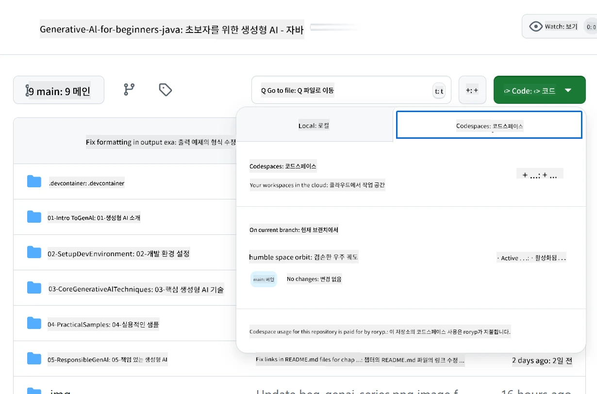
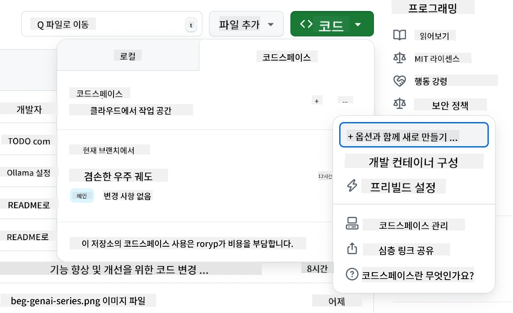
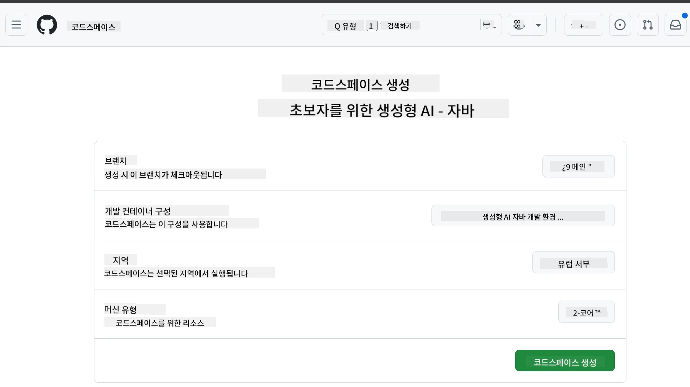
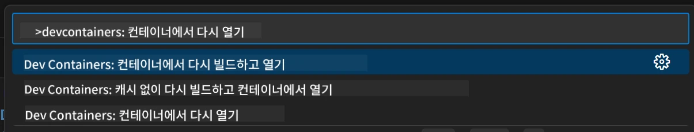
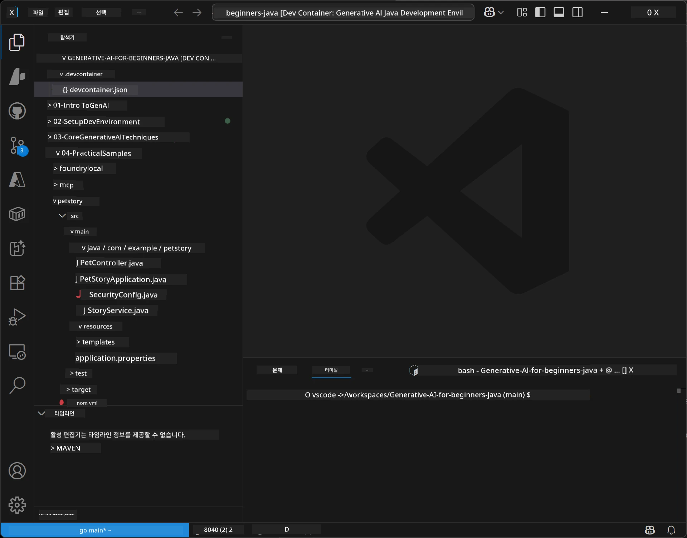
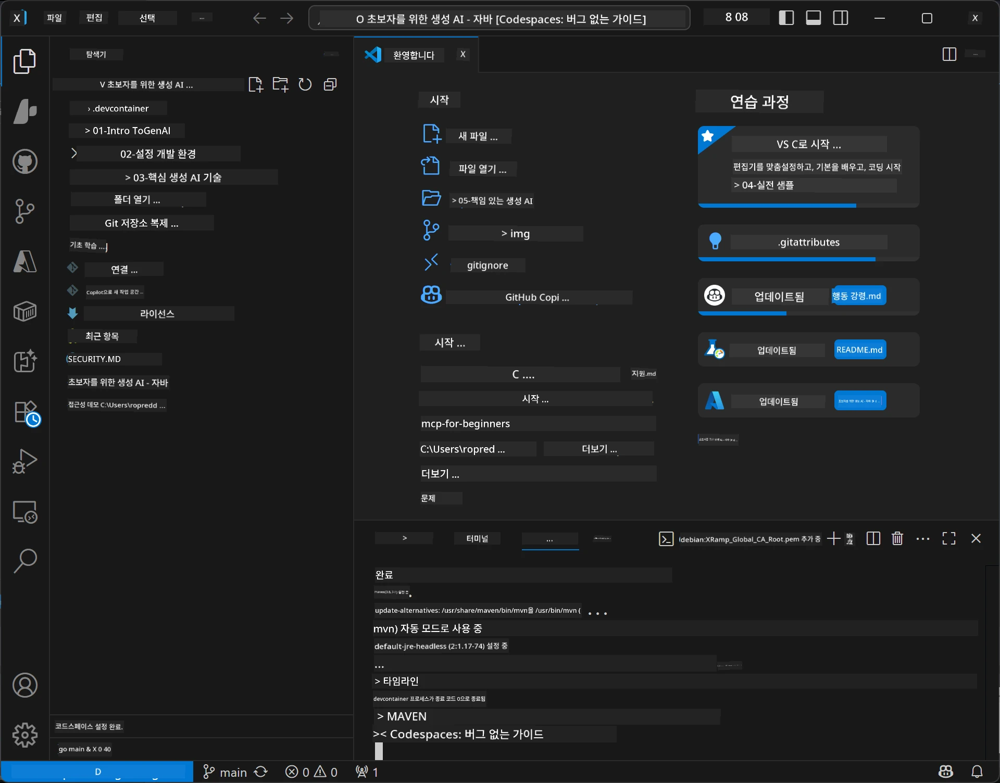

<!--
CO_OP_TRANSLATOR_METADATA:
{
  "original_hash": "96a30d42b9751a3d4e4b20e28d29d459",
  "translation_date": "2026-01-28T04:48:27+00:00",
  "source_file": "02-SetupDevEnvironment/README.md",
  "language_code": "ko"
}
-->
# Java용 생성 AI 개발 환경 설정

> **빠른 시작**: 2분 안에 클라우드에서 코딩 - [GitHub Codespaces 설정](../../../02-SetupDevEnvironment)으로 바로 이동 - 로컬 설치 불필요하며 GitHub 모델 사용!

> **Azure OpenAI에 관심 있으신가요?** 새 Azure OpenAI 리소스 생성 단계를 담은 [Azure OpenAI 설정 가이드](getting-started-azure-openai.md)를 확인하세요.

## 배울 내용

- AI 애플리케이션용 Java 개발 환경 설정
- 선호하는 개발 환경 선택 및 구성(Cloud-first Codespaces, 로컬 개발 컨테이너, 전체 로컬 설치)
- GitHub 모델 연결하여 설정 테스트

## 목차

- [배울 내용](../../../02-SetupDevEnvironment)
- [소개](../../../02-SetupDevEnvironment)
- [1단계: 개발 환경 설정](../../../02-SetupDevEnvironment)
  - [옵션 A: GitHub Codespaces (권장)](../../../02-SetupDevEnvironment)
  - [옵션 B: 로컬 개발 컨테이너](../../../02-SetupDevEnvironment)
  - [옵션 C: 기존 로컬 설치 사용](../../../02-SetupDevEnvironment)
- [2단계: GitHub 개인 액세스 토큰 생성](../../../02-SetupDevEnvironment)
- [3단계: GitHub 모델 예제로 설정 테스트](../../../02-SetupDevEnvironment)
- [문제 해결](../../../02-SetupDevEnvironment)
- [요약](../../../02-SetupDevEnvironment)
- [다음 단계](../../../02-SetupDevEnvironment)

## 소개

이 장에서는 개발 환경 설정 방법을 안내합니다. 주요 예제로 **GitHub Models**를 사용합니다. GitHub 계정만 있으면 무료로 쉽게 설정할 수 있고 신용카드가 필요 없으며 다양한 모델을 실험할 수 있기 때문입니다.

**로컬 설정 불필요!** GitHub Codespaces를 사용하면 브라우저에서 바로 전체 개발 환경으로 코딩을 시작할 수 있습니다.


이 과정에는 [**GitHub Models**](https://github.com/marketplace?type=models)를 권장합니다. 이유는:
- **무료**로 시작 가능
- GitHub 계정만 있으면 **간편**하게 설정 가능
- **신용카드 불필요**
- 다양한 **모델 실험** 가능

> **참고**: 본 교육에서 사용하는 GitHub Models에는 다음과 같은 무료 제한이 있습니다:
> - 분당 15회 요청(일 150회)
> - 요청당 약 8,000 단어 입력, 약 4,000 단어 출력
> - 동시 요청 5개
> 
> 프로덕션용으로는 Azure 계정으로 Azure AI Foundry Models로 업그레이드하세요. 코드는 변경할 필요 없습니다. [Azure AI Foundry 문서](https://learn.microsoft.com/azure/ai-foundry/foundry-models/how-to/quickstart-github-models)를 참고하세요.


## 1단계: 개발 환경 설정

<a name="quick-start-cloud"></a>

Generative AI for Java 과정을 위한 모든 필수 도구를 갖춘 미리 구성된 개발 컨테이너를 제공하여 설정 시간을 최소화했습니다. 원하는 개발 방식을 선택하세요:

### 환경 설정 옵션:

#### 옵션 A: GitHub Codespaces (권장)

**2분 안에 코딩 시작 — 로컬 설치 필요 없음!**

1. 이 저장소를 GitHub 계정으로 포크하세요
   > **참고**: 기본 구성을 수정하려면 [개발 컨테이너 구성](../../../.devcontainer/devcontainer.json)을 참고하세요
2. **Code** → **Codespaces** 탭 → **...** → **New with options...** 클릭
3. 기본값을 사용하세요 – 이 과정용으로 만든 **Generative AI Java Development Environment** 커스텀 개발 컨테이너 구성이 선택됩니다
4. **Create codespace** 클릭
5. 환경 준비까지 약 2분 기다리기
6. [2단계: GitHub 토큰 생성](../../../02-SetupDevEnvironment)으로 진행








> **Codespaces의 장점**:
> - 로컬 설치 불필요
> - 브라우저가 있는 모든 기기에서 사용 가능
> - 모든 도구와 의존성을 미리 구성
> - 개인 계정에 월 60시간 무료 제공
> - 모든 학습자에게 일관된 환경 제공

#### 옵션 B: 로컬 개발 컨테이너

**Docker를 이용한 로컬 개발 선호자용**

1. 이 저장소를 포크하고 로컬로 클론하세요
   > **참고**: 기본 구성을 수정하려면 [개발 컨테이너 구성](../../../.devcontainer/devcontainer.json)을 참고하세요
2. [Docker Desktop](https://www.docker.com/products/docker-desktop/)과 [VS Code](https://code.visualstudio.com/) 설치
3. VS Code에서 [Dev Containers 확장](https://marketplace.visualstudio.com/items?itemName=ms-vscode-remote.remote-containers) 설치
4. VS Code로 저장소 폴더 열기
5. 프롬프트가 표시되면 **Reopen in Container** 클릭(또는 `Ctrl+Shift+P` → "Dev Containers: Reopen in Container" 명령 사용)
6. 컨테이너 빌드 및 시작 대기
7. [2단계: GitHub 토큰 생성](../../../02-SetupDevEnvironment)으로 진행





#### 옵션 C: 기존 로컬 설치 사용

**기존 Java 환경 사용 개발자용**

필수 조건:
- [Java 21+](https://www.oracle.com/java/technologies/javase/jdk21-archive-downloads.html) 
- [Maven 3.9+](https://maven.apache.org/download.cgi)
- [VS Code](https://code.visualstudio.com) 또는 원하는 IDE

절차:
1. 저장소를 로컬로 클론
2. IDE에서 프로젝트 열기
3. [2단계: GitHub 토큰 생성](../../../02-SetupDevEnvironment)으로 진행

> **활용 팁**: 사양이 낮은 PC에서 로컬 VS Code를 사용하고 싶다면 GitHub Codespaces를 이용하세요! 로컬 VS Code를 클라우드 호스팅 Codespace에 연결해 두 환경의 장점을 모두 누릴 수 있습니다.




## 2단계: GitHub 개인 액세스 토큰 생성

1. [GitHub 설정](https://github.com/settings/profile)으로 가서 프로필 메뉴에서 **Settings** 선택
2. 왼쪽 사이드바에서 **Developer settings** 클릭(보통 하단)
3. **Personal access tokens** 아래에서 **Fine-grained tokens** 클릭(또는 직접 [링크](https://github.com/settings/personal-access-tokens) 사용)
4. **Generate new token** 클릭
5. "Token name"에 설명적인 이름 입력(예: `GenAI-Java-Course-Token`)
6. 만료 날짜 설정(권장: 보안상 7일)
7. "Resource owner"에 사용자 계정 선택
8. "Repository access"에 GitHub Models 사용하고자 하는 저장소 선택(또는 필요 시 "All repositories")
9. "Account permissions"에서 **Models**를 **Read-only**로 설정
10. **Generate token** 클릭
11. 토큰을 **지금 복사하고 안전하게 저장**하세요 — 다시 볼 수 없습니다!

> **보안 팁**: 액세스 토큰은 최소 권한 범위와 가능한 짧은 만료 기간을 사용하세요.

## 3단계: GitHub 모델 예제로 설정 테스트

개발 환경이 준비되면 [`02-SetupDevEnvironment/examples/github-models`](../../../02-SetupDevEnvironment/examples/github-models)에 있는 예제 애플리케이션으로 GitHub Models 연동을 테스트해 봅시다.

1. 개발 환경에서 터미널을 엽니다.
2. GitHub Models 예제로 이동:
   ```bash
   cd 02-SetupDevEnvironment/examples/github-models
   ```
3. GitHub 토큰을 환경 변수로 설정:
   ```bash
   # macOS/리눅스
   export GITHUB_TOKEN=your_token_here
   
   # 윈도우 (명령 프롬프트)
   set GITHUB_TOKEN=your_token_here
   
   # 윈도우 (파워셸)
   $env:GITHUB_TOKEN="your_token_here"
   ```

4. 애플리케이션 실행:
   ```bash
   mvn compile exec:java -Dexec.mainClass="com.example.githubmodels.App"
   ```

아래와 같은 출력이 표시됩니다:
```text
Using model: gpt-4.1-nano
Sending request to GitHub Models...
Response: Hello World!
```

### 예제 코드 이해하기

먼저 방금 실행한 코드를 이해해 봅니다. `examples/github-models` 폴더의 예제는 OpenAI Java SDK로 GitHub Models에 연결합니다:

**이 코드가 하는 일:**
- 개인 액세스 토큰으로 GitHub Models에 **연결**
- "Say Hello World!" 메시지를 AI 모델에 **전송**
- AI의 응답을 **수신 및 출력**
- 환경 구성이 올바른지 **검증**

**주요 의존성**(`pom.xml`):
```xml
<dependency>
    <groupId>com.openai</groupId>
    <artifactId>openai-java</artifactId>
    <version>2.12.0</version>
</dependency>
```

**핵심 코드**(`App.java`):
```java
// OpenAI Java SDK를 사용하여 GitHub 모델에 연결
OpenAIClient client = OpenAIOkHttpClient.builder()
    .apiKey(pat)
    .baseUrl("https://models.inference.ai.azure.com")
    .build();

// 채팅 완성 요청 생성
ChatCompletionCreateParams params = ChatCompletionCreateParams.builder()
    .model(modelId)
    .addSystemMessage("You are a concise assistant.")
    .addUserMessage("Say Hello World!")
    .build();

// AI 응답 받기
ChatCompletion response = client.chat().completions().create(params);
System.out.println("Response: " + response.choices().get(0).message().content().orElse("No response content"));
```

## 요약

잘 하셨습니다! 이제 모두 준비됐습니다:

- AI 모델 접속 권한을 위한 적절한 권한을 가진 GitHub 개인 액세스 토큰 생성
- Java 개발 환경 실행(코드스페이스, 개발 컨테이너, 로컬 중 선택)
- OpenAI Java SDK를 사용해 GitHub Models 연결하여 무료 AI 개발
- AI 모델과 대화하는 간단한 예제로 모든 것이 잘 작동하는지 테스트

## 다음 단계

[3장: 핵심 생성 AI 기법](../03-CoreGenerativeAITechniques/README.md)

## 문제 해결

문제가 있나요? 자주 발생하는 문제와 해결책은 다음과 같습니다:

- **토큰이 작동하지 않나요?** 
  - 토큰 전체를 공백 없이 정확히 복사했는지 확인
  - 환경 변수로 올바르게 설정했는지 확인
  - 권한(Models: Read-only)이 올바른지 검토

- **Maven을 찾을 수 없나요?** 
  - 개발 컨테이너/코드스페이스에서는 Maven이 미리 설치되어 있음
  - 로컬 설정은 Java 21+ 및 Maven 3.9+가 설치되었는지 확인
  - `mvn --version` 명령어로 설치 여부 확인

- **연결 문제 발생?** 
  - 인터넷 연결 점검
  - 네트워크에서 GitHub 접속 가능한지 확인
  - 방화벽이 GitHub Models 엔드포인트를 차단하지 않는지 확인

- **개발 컨테이너가 시작되지 않나요?** 
  - Docker Desktop이 실행 중인지 확인(로컬 개발 시)
  - 컨테이너 재빌드 시도: `Ctrl+Shift+P` → "Dev Containers: Rebuild Container"

- **애플리케이션 컴파일 오류?**
  - 디렉터리가 올바른지 확인: `02-SetupDevEnvironment/examples/github-models`
  - 클린 빌드 시도: `mvn clean compile`

> **도움이 더 필요하신가요?** 문제 발생 시 저장소에 이슈를 등록해 주세요. 도와드리겠습니다.

---

<!-- CO-OP TRANSLATOR DISCLAIMER START -->
**면책 조항**:  
이 문서는 AI 번역 서비스 [Co-op Translator](https://github.com/Azure/co-op-translator)를 사용하여 번역되었습니다. 정확성을 위해 노력하고 있으나, 자동 번역에는 오류나 부정확성이 포함될 수 있음을 유의하시기 바랍니다. 원본 문서의 원어 버전이 권위 있는 출처로 간주되어야 합니다. 중요한 정보의 경우 전문 인력에 의한 번역을 권장합니다. 본 번역 사용으로 인해 발생하는 오해나 해석상의 문제에 대해서는 책임을 지지 않습니다.
<!-- CO-OP TRANSLATOR DISCLAIMER END -->