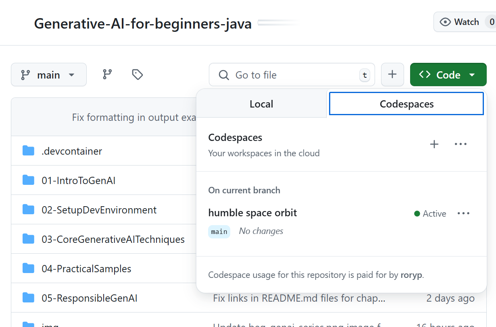

<!--
CO_OP_TRANSLATOR_METADATA:
{
  "original_hash": "bfdb4b4eadbee3a59ef742439f58326a",
  "translation_date": "2025-07-27T12:59:22+00:00",
  "source_file": "02-SetupDevEnvironment/getting-started-azure-openai.md",
  "language_code": "ko"
}
-->
# Azure OpenAI 개발 환경 설정

> **빠른 시작**: 이 가이드는 Azure OpenAI 설정을 위한 것입니다. 무료 모델로 바로 시작하려면 [GitHub Models with Codespaces](./README.md#quick-start-cloud)를 사용하세요.

이 가이드는 이 과정에서 Java AI 앱을 위한 Azure AI Foundry 모델을 설정하는 방법을 안내합니다.

## 목차

- [빠른 설정 개요](../../../02-SetupDevEnvironment)
- [1단계: Azure AI Foundry 리소스 생성](../../../02-SetupDevEnvironment)
  - [허브 및 프로젝트 생성](../../../02-SetupDevEnvironment)
  - [GPT-4o-mini 모델 배포](../../../02-SetupDevEnvironment)
- [2단계: Codespace 생성](../../../02-SetupDevEnvironment)
- [3단계: 환경 구성](../../../02-SetupDevEnvironment)
- [4단계: 설정 테스트](../../../02-SetupDevEnvironment)
- [다음 단계](../../../02-SetupDevEnvironment)
- [리소스](../../../02-SetupDevEnvironment)
- [추가 리소스](../../../02-SetupDevEnvironment)

## 빠른 설정 개요

1. Azure AI Foundry 리소스 생성 (허브, 프로젝트, 모델)
2. Java 개발 컨테이너를 사용하여 Codespace 생성
3. Azure OpenAI 자격 증명을 포함한 `.env` 파일 구성
4. 예제 프로젝트로 설정 테스트

## 1단계: Azure AI Foundry 리소스 생성

### 허브 및 프로젝트 생성

1. [Azure AI Foundry Portal](https://ai.azure.com/)로 이동하여 로그인합니다.
2. **+ Create** → **New hub**를 클릭합니다 (또는 **Management** → **All hubs** → **+ New hub**로 이동).
3. 허브를 구성합니다:
   - **허브 이름**: 예: "MyAIHub"
   - **구독**: Azure 구독 선택
   - **리소스 그룹**: 새로 생성하거나 기존 그룹 선택
   - **위치**: 가까운 위치 선택
   - **스토리지 계정**: 기본값 사용 또는 사용자 지정 구성
   - **키 자격증명 모음**: 기본값 사용 또는 사용자 지정 구성
   - **Next** → **Review + create** → **Create**를 클릭합니다.
4. 생성 후, **+ New project**를 클릭합니다 (또는 허브 개요에서 **Create project** 선택).
   - **프로젝트 이름**: 예: "GenAIJava"
   - **Create**를 클릭합니다.

### GPT-4o-mini 모델 배포

1. 프로젝트에서 **Model catalog**로 이동하여 **gpt-4o-mini**를 검색합니다.
   - *대안: **Deployments** → **+ Create deployment**로 이동합니다.*
2. gpt-4o-mini 모델 카드에서 **Deploy**를 클릭합니다.
3. 배포를 구성합니다:
   - **배포 이름**: "gpt-4o-mini"
   - **모델 버전**: 최신 버전 사용
   - **배포 유형**: Standard
4. **Deploy**를 클릭합니다.
5. 배포 후, **Deployments** 탭으로 이동하여 다음 값을 복사합니다:
   - **배포 이름** (예: "gpt-4o-mini")
   - **Target URI** (예: `https://your-hub-name.openai.azure.com/`)  
      > **중요**: 전체 엔드포인트 경로가 아닌 기본 URL만 복사하세요 (예: `https://myhub.openai.azure.com/`).
   - **Key** (Keys and Endpoint 섹션에서 확인 가능)

> **문제가 있나요?** 공식 [Azure AI Foundry Documentation](https://learn.microsoft.com/azure/ai-foundry/how-to/create-projects?tabs=ai-foundry&pivots=hub-project)을 참조하세요.

## 2단계: Codespace 생성

1. 이 저장소를 GitHub 계정으로 포크합니다.
   > **참고**: 기본 설정을 수정하려면 [Dev Container Configuration](../../../.devcontainer/devcontainer.json)을 확인하세요.
2. 포크한 저장소에서 **Code** → **Codespaces** 탭을 클릭합니다.
3. **...** → **New with options...**를 클릭합니다.

4. **Dev container configuration**을 선택합니다: 
   - **Generative AI Java Development Environment**
5. **Create codespace**를 클릭합니다.

## 3단계: 환경 구성

Codespace가 준비되면 Azure OpenAI 자격 증명을 설정합니다:

1. **저장소 루트에서 예제 프로젝트로 이동합니다:**
   ```bash
   cd 02-SetupDevEnvironment/examples/basic-chat-azure
   ```

2. **.env 파일을 생성합니다:**
   ```bash
   cp .env.example .env
   ```

3. **.env 파일을 열어 Azure OpenAI 자격 증명을 입력합니다:**
   ```bash
   # Your Azure OpenAI API key (from Azure AI Foundry portal)
   AZURE_AI_KEY=your-actual-api-key-here
   
   # Your Azure OpenAI endpoint URL (e.g., https://myhub.openai.azure.com/)
   AZURE_AI_ENDPOINT=https://your-hub-name.openai.azure.com/
   ```

   > **보안 주의**: 
   > - `.env` 파일을 버전 관리에 커밋하지 마세요.
   > - `.env` 파일은 이미 `.gitignore`에 포함되어 있습니다.
   > - API 키를 안전하게 보관하고 정기적으로 교체하세요.

## 4단계: 설정 테스트

예제 애플리케이션을 실행하여 Azure OpenAI 연결을 테스트합니다:

```bash
mvn clean spring-boot:run
```

GPT-4o-mini 모델에서 응답을 확인할 수 있습니다!

> **VS Code 사용자**: VS Code에서 `F5`를 눌러 애플리케이션을 실행할 수도 있습니다. `.env` 파일을 자동으로 로드하도록 실행 구성이 이미 설정되어 있습니다.

> **전체 예제**: 자세한 지침 및 문제 해결은 [End-to-End Azure OpenAI Example](./examples/basic-chat-azure/README.md)을 참조하세요.

## 다음 단계

**설정 완료!** 이제 다음을 사용할 수 있습니다:
- gpt-4o-mini가 배포된 Azure OpenAI
- 로컬 `.env` 파일 구성
- Java 개발 환경 준비 완료

**다음으로 진행하세요** [3장: 핵심 생성 AI 기술](../03-CoreGenerativeAITechniques/README.md)에서 AI 애플리케이션을 구축하기 시작하세요!

## 리소스

- [Azure AI Foundry Documentation](https://learn.microsoft.com/azure/ai-services/)
- [Spring AI Azure OpenAI Documentation](https://docs.spring.io/spring-ai/reference/api/clients/azure-openai-chat.html)
- [Azure OpenAI Java SDK](https://learn.microsoft.com/java/api/overview/azure/ai-openai-readme)

## 추가 리소스

- [VS Code 다운로드](https://code.visualstudio.com/Download)
- [Docker Desktop 받기](https://www.docker.com/products/docker-desktop)
- [Dev Container Configuration](../../../.devcontainer/devcontainer.json)

**면책 조항**:  
이 문서는 AI 번역 서비스 [Co-op Translator](https://github.com/Azure/co-op-translator)를 사용하여 번역되었습니다. 정확성을 위해 최선을 다하고 있지만, 자동 번역에는 오류나 부정확성이 포함될 수 있습니다. 원본 문서를 해당 언어로 작성된 상태에서 권위 있는 자료로 간주해야 합니다. 중요한 정보의 경우, 전문적인 인간 번역을 권장합니다. 이 번역 사용으로 인해 발생하는 오해나 잘못된 해석에 대해 당사는 책임을 지지 않습니다.