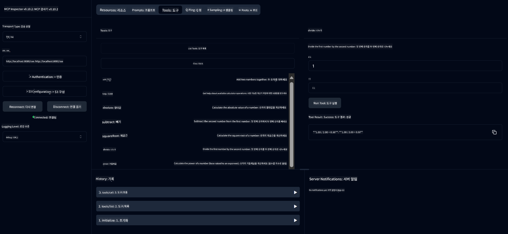

<!--
CO_OP_TRANSLATOR_METADATA:
{
  "original_hash": "7bf9a4a832911269a8bd0decb97ff36c",
  "translation_date": "2025-07-21T16:44:13+00:00",
  "source_file": "04-PracticalSamples/mcp/calculator/README.md",
  "language_code": "ko"
}
-->
# 기본 계산기 MCP 서비스

>**Note**: 이 장에는 완성된 샘플을 실행하는 방법을 안내하는 [**튜토리얼**](./TUTORIAL.md)이 포함되어 있습니다.

**모델 컨텍스트 프로토콜(MCP)**을 직접 경험해보세요! 이전 장에서는 생성형 AI의 기본 개념과 개발 환경 설정에 대해 배웠습니다. 이제 실용적인 것을 만들어볼 시간입니다.

이 계산기 서비스는 MCP를 사용하여 AI 모델이 외부 도구와 안전하게 상호작용하는 방법을 보여줍니다. AI 모델의 때때로 불확실한 수학 능력에 의존하는 대신, AI가 정확한 계산을 위해 전문 서비스를 호출할 수 있는 견고한 시스템을 구축하는 방법을 소개합니다.

## 목차

- [학습 내용](../../../../../04-PracticalSamples/mcp/calculator)
- [사전 준비 사항](../../../../../04-PracticalSamples/mcp/calculator)
- [핵심 개념](../../../../../04-PracticalSamples/mcp/calculator)
- [빠른 시작](../../../../../04-PracticalSamples/mcp/calculator)
- [사용 가능한 계산기 작업](../../../../../04-PracticalSamples/mcp/calculator)
- [테스트 클라이언트](../../../../../04-PracticalSamples/mcp/calculator)
  - [1. 직접 MCP 클라이언트 (SDKClient)](../../../../../04-PracticalSamples/mcp/calculator)
  - [2. AI 기반 클라이언트 (LangChain4jClient)](../../../../../04-PracticalSamples/mcp/calculator)
- [MCP 인스펙터 (웹 UI)](../../../../../04-PracticalSamples/mcp/calculator)
  - [단계별 지침](../../../../../04-PracticalSamples/mcp/calculator)

## 학습 내용

이 예제를 통해 다음을 이해할 수 있습니다:
- Spring Boot를 사용하여 MCP 호환 서비스를 만드는 방법
- 직접 프로토콜 통신과 AI 기반 상호작용의 차이점
- AI 모델이 외부 도구를 언제, 어떻게 사용할지 결정하는 방법
- 도구를 활용한 AI 애플리케이션 구축을 위한 모범 사례

MCP 개념을 배우고 첫 번째 AI 도구 통합을 구축하려는 초보자에게 적합합니다!

## 사전 준비 사항

- Java 21+
- Maven 3.6+
- **GitHub 토큰**: AI 기반 클라이언트에 필요합니다. 아직 설정하지 않았다면 [2장: 개발 환경 설정](../../../02-SetupDevEnvironment/README.md)을 참조하세요.

## 핵심 개념

**모델 컨텍스트 프로토콜(MCP)**은 AI 애플리케이션이 외부 도구와 안전하게 연결할 수 있도록 표준화된 방식입니다. 이를 AI 모델이 계산기와 같은 외부 서비스를 사용할 수 있게 해주는 "다리"라고 생각하세요. AI 모델이 직접 수학을 수행하려고 하는 대신(종종 신뢰할 수 없음), 계산기 서비스를 호출하여 정확한 결과를 얻을 수 있습니다. MCP는 이러한 통신이 안전하고 일관되게 이루어지도록 보장합니다.

**서버 전송 이벤트(SSE)**는 서버와 클라이언트 간의 실시간 통신을 가능하게 합니다. 전통적인 HTTP 요청에서는 요청 후 응답을 기다려야 하지만, SSE는 서버가 클라이언트에 지속적으로 업데이트를 보낼 수 있도록 합니다. 이는 응답이 스트리밍되거나 처리 시간이 걸릴 수 있는 AI 애플리케이션에 적합합니다.

**AI 도구 및 함수 호출**은 AI 모델이 사용자 요청에 따라 외부 함수를 자동으로 선택하고 사용하는 기능을 제공합니다. 예를 들어 "15 + 27은 얼마인가요?"라고 물으면, AI 모델은 덧셈을 원한다는 것을 이해하고, `add` 도구를 적절한 매개변수(15, 27)로 호출하여 자연어로 결과를 반환합니다. AI는 각 도구를 언제, 어떻게 사용할지 아는 지능적인 조정자 역할을 합니다.

## 빠른 시작

### 1. 계산기 애플리케이션 디렉토리로 이동
```bash
cd Generative-AI-for-beginners-java/04-PracticalSamples/mcp/calculator
```

### 2. 빌드 및 실행
```bash
mvn clean install -DskipTests
java -jar target/calculator-server-0.0.1-SNAPSHOT.jar
```

### 3. 클라이언트로 테스트
- **SDKClient**: 직접 MCP 프로토콜 상호작용
- **LangChain4jClient**: AI 기반 자연어 상호작용 (GitHub 토큰 필요)

## 사용 가능한 계산기 작업

- `add(a, b)`, `subtract(a, b)`, `multiply(a, b)`, `divide(a, b)`
- `power(base, exponent)`, `squareRoot(number)`, `absolute(number)`
- `modulus(a, b)`, `help()`

## 테스트 클라이언트

### 1. 직접 MCP 클라이언트 (SDKClient)
MCP 프로토콜의 기본 통신을 테스트합니다. 실행 방법:
```bash
mvn test-compile exec:java -Dexec.mainClass="com.microsoft.mcp.sample.client.SDKClient" -Dexec.classpathScope=test
```

### 2. AI 기반 클라이언트 (LangChain4jClient)
GitHub 모델을 사용한 자연어 상호작용을 보여줍니다. GitHub 토큰이 필요합니다 ([사전 준비 사항](../../../../../04-PracticalSamples/mcp/calculator) 참조).

**실행:**
```bash
mvn test-compile exec:java -Dexec.mainClass="com.microsoft.mcp.sample.client.LangChain4jClient" -Dexec.classpathScope=test
```

## MCP 인스펙터 (웹 UI)

MCP 인스펙터는 코드를 작성하지 않고 MCP 서비스를 테스트할 수 있는 시각적 웹 인터페이스를 제공합니다. MCP 작동 방식을 이해하려는 초보자에게 적합합니다!

### 단계별 지침:

1. **계산기 서버 시작** (이미 실행 중이 아니라면):
   ```bash
   java -jar target/calculator-server-0.0.1-SNAPSHOT.jar
   ```

2. **MCP 인스펙터 설치 및 실행** (새 터미널에서):
   ```bash
   npx @modelcontextprotocol/inspector
   ```

3. **웹 인터페이스 열기**:
   - "Inspector running at http://localhost:6274"와 같은 메시지를 찾으세요.
   - 해당 URL을 웹 브라우저에서 엽니다.

4. **계산기 서비스에 연결**:
   - 웹 인터페이스에서 전송 유형을 "SSE"로 설정합니다.
   - URL을 `http://localhost:8080/sse`로 설정합니다.
   - "Connect" 버튼을 클릭합니다.

5. **사용 가능한 도구 탐색**:
   - "List Tools"를 클릭하여 모든 계산기 작업을 확인합니다.
   - `add`, `subtract`, `multiply` 등의 함수가 표시됩니다.

6. **계산기 작업 테스트**:
   - 도구를 선택합니다(예: "add").
   - 매개변수를 입력합니다(예: `a: 15`, `b: 27`).
   - "Run Tool"을 클릭합니다.
   - MCP 서비스에서 반환된 결과를 확인합니다!

이 시각적 접근 방식은 직접 클라이언트를 구축하기 전에 MCP 통신이 어떻게 작동하는지 이해하는 데 도움을 줍니다.



---
**참고:** [MCP 서버 부트 스타터 문서](https://docs.spring.io/spring-ai/reference/api/mcp/mcp-server-boot-starter-docs.html)

**면책 조항**:  
이 문서는 AI 번역 서비스 [Co-op Translator](https://github.com/Azure/co-op-translator)를 사용하여 번역되었습니다. 정확성을 위해 최선을 다하고 있으나, 자동 번역에는 오류나 부정확성이 포함될 수 있습니다. 원본 문서의 원어 버전을 권위 있는 출처로 간주해야 합니다. 중요한 정보의 경우, 전문적인 인간 번역을 권장합니다. 이 번역 사용으로 인해 발생하는 오해나 잘못된 해석에 대해 책임을 지지 않습니다.