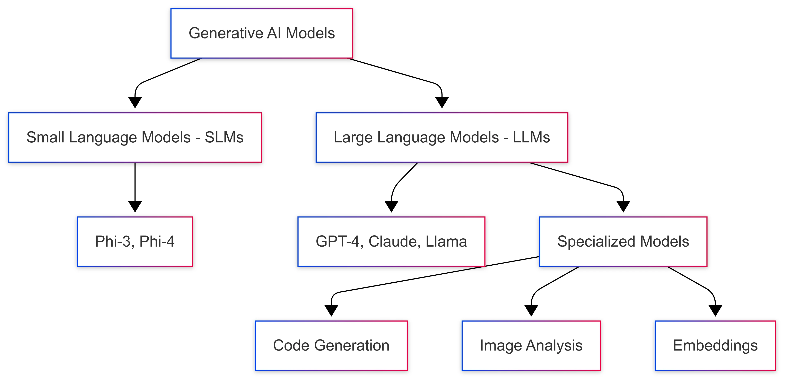
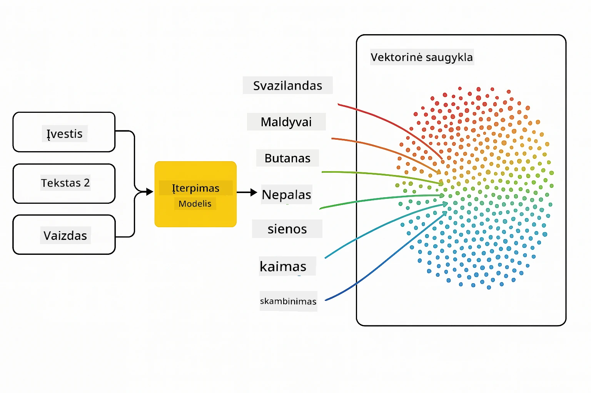
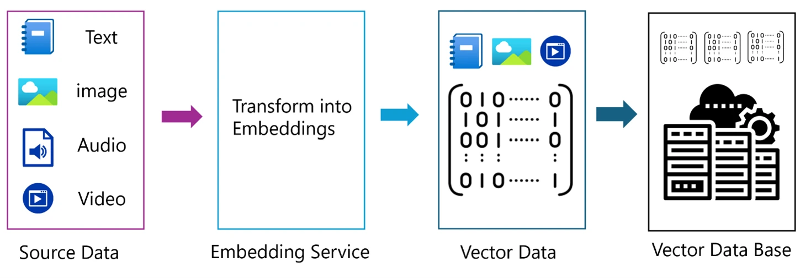
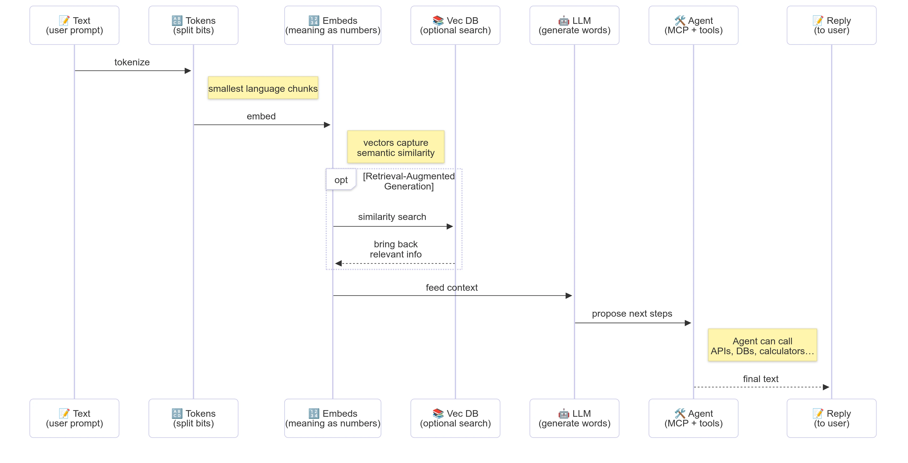

# Įvadas į generatyviąją dirbtinį intelektą – Java leidimas

> **Vaizdo įrašas**: [Peržiūrėkite šios pamokos vaizdo įrašo apžvalgą YouTube.](https://www.youtube.com/watch?v=XH46tGp_eSw) Taip pat galite spustelėti aukščiau esantį miniatiūros vaizdą.

## Ko išmoksite

- **Generatyviosios DI pagrindai**, įskaitant LMM, užklausų inžineriją, žetonus, įterpimus ir vektorių duomenų bazes
- **Sulyginkite Java DI kūrimo įrankius**, įskaitant Azure OpenAI SDK, Spring AI ir OpenAI Java SDK
- **Sužinokite apie Modelio konteksto protokolą** ir jo vaidmenį DI agentų komunikacijoje

## Turinys

- [Įvadas](#įvadas)
- [Greitas priminimas apie generatyviosios DI sąvokas](#greitas-priminimas-apie-generatyviosios-di-sąvokas)
- [Užklausų inžinerijos apžvalga](#užklausų-inžinerijos-apžvalga)
- [Žetonai, įterpimai ir agentai](#žetonai-įterpimai-ir-agentai)
- [DI kūrimo įrankiai ir bibliotekos Java](#di-kūrimo-įrankiai-ir-bibliotekos-java)
  - [OpenAI Java SDK](#openai-java-sdk)
  - [Spring AI](#spring-ai)
  - [Azure OpenAI Java SDK](#azure-openai-java-sdk)
- [Santrauka](#santrauka)
- [Tolimesni veiksmai](#tolimesni-veiksmai)

## Įvadas

Sveiki atvykę į pirmąją generatyviosios DI pradedantiesiems – Java leidimas – pamoką! Ši bazinė pamoka supažindina jus su pagrindinėmis generatyviosios DI sąvokomis ir kaip su jomis dirbti naudojant Java. Išmoksite apie esminius DI taikomųjų programų statybinius blokelius, įskaitant didelius kalbos modelius (LMM), žetonus, įterpimus ir DI agentus. Taip pat išnagrinėsime pagrindinius Java įrankius, kuriuos naudosite viso kurso metu.

### Greitas priminimas apie generatyviosios DI sąvokas

Generatyvioji DI yra dirbtinio intelekto rūšis, kuri kuria naują turinį, tokią kaip tekstai, vaizdai ar kodas, remdamasi duomenų įsisavintais šablonais ir ryšiais. Generatyviosios DI modeliai gali generuoti žmogaus kalbos atsakymus, suprasti kontekstą ir kartais net kurti turinį, kuris atrodo kaip sukurtas žmogaus.

Kurdami savo Java DI taikomąsias programas, dirbsite su **generatyviosiomis DI modeliais** kuriant turinį. Kai kurios generatyviosios DI modelių galimybės apima:

- **Teksto generavimas**: Žmogaus kalbos tekstų kūrimas pokalbių robotams, turiniui ir teksto baigimui.
- **Vaizdo generavimas ir analizė**: Realistiškų vaizdų kūrimas, nuotraukų pagerinimas ir objektų atpažinimas.
- **Kodo generavimas**: Kodo fragmentų ar scenarijų rašymas.

Yra specifiniai modelių tipai, optimizuoti skirtingoms užduotims. Pavyzdžiui, tiek **Maži kalbos modeliai (SLM)**, tiek **Dideli kalbos modeliai (LMM)** gali būti naudojami teksto generavimui, o LMM paprastai pasižymi geresniu našumu sudėtingesnėse užduotyse. Vaizdų užduotims naudotumėte specializuotus regos modelius arba multimodalius modelius.

Žinoma, šių modelių atsakymai ne visada tobuli. Tikriausiai esate girdėję apie modelių „haliucinacijas“ arba neteisingos informacijos autoritetingą generavimą. Tačiau galite padėti modeliui generuoti geresnius atsakymus, pateikdami aiškias instrukcijas ir kontekstą. Čia praverčia **užklausų inžinerija**.

#### Užklausų inžinerijos apžvalga

Užklausų inžinerija – tai efektyvių įvedimų projektavimas, siekiant nukreipti DI modelius į pageidaujamus rezultatus. Tai apima:

- **Aiškumą**: instrukcijų padarymą aiškiais ir neabiprasmiškais.
- **Kontekstą**: reikalingos fono informacijos pateikimą.
- **Apribojimus**: bet kokių ribojimų arba formatų nurodymą.

Geriausios užklausų inžinerijos praktikos apima užklausų dizainą, aiškias instrukcijas, užduočių suskaidymą, vieno pavyzdžio ir kelių pavyzdžių mokymąsi bei užklausų derinimą. Būtina išbandyti skirtingas užklausas, kad rastumėte geriausiai jūsų atvejui tinkamą.

Kuriant programas dirbsite su skirtingų tipų užklausomis:
- **Sistemos užklausos**: nustato pagrindines taisykles ir kontekstą modelio elgesiui
- **Vartotojo užklausos**: įvesties duomenys iš jūsų programos vartotojų
- **Asistento užklausos**: modelio atsakymai, pagrįsti sistemos ir vartotojo užklausomis

> **Sužinokite daugiau**: Plačiau apie užklausų inžineriją skaitykite [Užklausų inžinerijos skyriuje GenAI pradedantiesiems kurse](https://github.com/microsoft/generative-ai-for-beginners/tree/main/04-prompt-engineering-fundamentals)

#### Žetonai, įterpimai ir agentai

Dirbdami su generatyviosios DI modeliais susidursite su tokiais terminais kaip **žetonai**, **įterpimai**, **agentai** ir **Modelio konteksto protokolas (MCP)**. Štai išsamus šių sąvokų apžvalga:

- **Žetonai**: žetonai yra mažiausia tekstinė teksto dalis modelyje. Jie gali būti žodžiai, simboliai arba dalys žodžių. Žetonai naudojami atstovauti tekstinius duomenis tokiu formatu, kurį modelis gali suprasti. Pavyzdžiui, sakinys „The quick brown fox jumped over the lazy dog“ gali būti suskaidytas į žetonus kaip ["The", " quick", " brown", " fox", " jumped", " over", " the", " lazy", " dog"] arba ["The", " qu", "ick", " br", "own", " fox", " jump", "ed", " over", " the", " la", "zy", " dog"] priklausomai nuo žetonizavimo strategijos.

Žetonizavimas – tai procesas, kai tekstas suskaidomas į šias mažesnes dalis. Tai svarbu, nes modeliai veikia su žetonais, o ne su žaliu tekstu. Žetonų skaičius užklausoje veikia modelio atsakymo ilgį ir kokybę, nes modeliai turi žetonų limitą savo konteksto lange (pvz., 128 tūkst. žetonų iš viso konteksto GPT-4o, įskaitant įvestį ir išvestį).

  Java kalboje galite naudoti bibliotekas, tokias kaip OpenAI SDK, kurios automatizuotai atlieka žetonizavimą siunčiant užklausas DI modeliams.

- **Įterpimai**: įterpimai yra vektoriniai žetonų atvaizdai, kurie sugeneruoja semantinę prasmę. Tai skaitmeniniai atvaizdai (dažniausiai plūduriuojančio kablelio skaičių masyvai), leidžiantys modeliams suprasti žodžių santykius ir generuoti kontekstui tinkamus atsakymus. Panašios reikšmės žodžiai turi panašius įterpimus, leidžiančius modeliui suvokti sinonimus ir semantinius ryšius.

  Java kalboje galite generuoti įterpimus naudodami OpenAI SDK arba kitas bibliotekas, palaikančias įterpimų generavimą. Šie įterpimai yra būtini užduotims kaip semantinė paieška, kai norite rasti panašų turinį pagal prasmę, o ne pagal tikslius tekstinius atitikmenis.

- **Vektorių duomenų bazės**: vektorių duomenų bazės yra specializuotos saugojimo sistemos, optimizuotos įterpimams. Jos leidžia efektyvią panašumo paiešką ir yra svarbios Retrieval-Augmented Generation (RAG) šablonams, kai reikia rasti aktualią informaciją iš didelių duomenų rinkinių, remiantis semantiniu panašumu, o ne tiksliu tekstiniu atitikimu.

> **Pastaba**: Šiame kurse nepateiksime vektorių duomenų bazių, tačiau verta paminėti, nes jos dažnai naudojamos realiose programose.

- **Agentai ir MCP**: DI komponentai, kurie savarankiškai bendrauja su modeliais, įrankiais ir išorinėmis sistemomis. Modelio konteksto protokolas (MCP) suteikia standartizuotą būdą agentams saugiai prieiti prie išorinių duomenų šaltinių ir įrankių. Daugiau sužinokite mūsų [MCP pradedantiesiems](https://github.com/microsoft/mcp-for-beginners) kurse.

Java DI programose naudosite žetonus teksto apdorojimui, įterpimus semantinei paieškai ir RAG, vektorių duomenų bazes duomenų gavimui bei agentus su MCP protingoms sistemoms, naudojančioms įrankius, kurti.

### DI kūrimo įrankiai ir bibliotekos Java

Java suteikia puikių įrankių DI kūrimui. Yra trys pagrindinės bibliotekos, kurias nagrinėsime per visą šį kursą – OpenAI Java SDK, Azure OpenAI SDK ir Spring AI.

Čia pateikiama greita nuorodų lentelė, rodanti, kuris SDK naudojamas kiekvieno skyriaus pavyzdžiuose:

| Skyrius | Pavyzdys | SDK |
|---------|----------|-----|
| 02-SetupDevEnvironment | github-models | OpenAI Java SDK |
| 02-SetupDevEnvironment | basic-chat-azure | Spring AI Azure OpenAI |
| 03-CoreGenerativeAITechniques | examples | Azure OpenAI SDK |
| 04-PracticalSamples | petstory | OpenAI Java SDK |
| 04-PracticalSamples | foundrylocal | OpenAI Java SDK |
| 04-PracticalSamples | calculator | Spring AI MCP SDK + LangChain4j |

**SDK dokumentacijos nuorodos:**
- [Azure OpenAI Java SDK](https://github.com/Azure/azure-sdk-for-java/tree/azure-ai-openai_1.0.0-beta.16/sdk/openai/azure-ai-openai)
- [Spring AI](https://docs.spring.io/spring-ai/reference/)
- [OpenAI Java SDK](https://github.com/openai/openai-java)
- [LangChain4j](https://docs.langchain4j.dev/)

#### OpenAI Java SDK

OpenAI SDK yra oficiali Java biblioteka OpenAI API. Ji suteikia paprastą ir nuoseklią sąsają darbui su OpenAI modeliais, palengvinanti DI galimybių integraciją į Java programas. 2 skyriaus GitHub modelių pavyzdys, 4 skyriaus Pet Story ir Foundry Local pavyzdžiai demonstruoja OpenAI SDK naudojimą.

#### Spring AI

Spring AI yra išsamus karkasas, kuris suteikia DI galimybių Spring aplikacijoms, užtikrindamas nuoseklią abstrakcijos sluoksnį per skirtingus DI tiekėjus. Jis sklandžiai integruojasi su Spring ekosistema, todėl tai yra ideali pasirinktis įmonių Java programoms, kurioms reikia DI funkcionalumo.

Spring AI stiprybė – sklandi integracija su Spring ekosistema, todėl lengva kurti gamybai paruoštas DI programas naudojant pažįstamus Spring modelius, tokius kaip priklausomybių injekcija, konfigūracijos valdymas ir testavimo karkasai. Naudosit Spring AI 2 ir 4 skyriuose kuriant programas, kurios naudoja tiek OpenAI, tiek Modelio konteksto protokolo (MCP) Spring AI bibliotekas.

##### Modelio konteksto protokolas (MCP)

[Modelio konteksto protokolas (MCP)](https://modelcontextprotocol.io/) yra besiformuojantis standartas, leidžiantis DI programoms saugiai bendrauti su išoriniais duomenų šaltiniais ir įrankiais. MCP suteikia standartinį būdą DI modeliams prieiti prie kontekstinės informacijos ir vykdyti veiksmus jūsų programose.

4 skyriuje sukursite paprastą MCP kalkuliatoriaus paslaugą, kuri demonstruos Modelio konteksto protokolo pagrindus su Spring AI, parodys, kaip kurti pagrindines įrankių integracijas ir paslaugų architektūras.

#### Azure OpenAI Java SDK

Azure OpenAI klientų biblioteka Java kalbai yra OpenAI REST API adaptacija, kuri suteikia idiomatinę sąsają ir integraciją su visa Azure SDK ekosistema. 3 skyriuje kursite programas naudodami Azure OpenAI SDK, įskaitant pokalbių programas, funkcijų kvietimą ir RAG (Retrieval-Augmented Generation) modelius.

> Pastaba: Azure OpenAI SDK funkcionalumu atsilieka OpenAI Java SDK, taigi ateities projektams rekomenduojame naudoti OpenAI Java SDK.

## Santrauka

Štai ir pagrindai! Dabar suprantate:

- Pagrindines generatyviosios DI sąvokas – nuo LMM ir užklausų inžinerijos iki žetonų, įterpimų ir vektorių duomenų bazių
- Savo įrankių komplekto galimybes Java DI kūrimui: Azure OpenAI SDK, Spring AI ir OpenAI Java SDK
- Kas yra Modelio konteksto protokolas ir kaip jis leidžia DI agentams dirbti su išoriniais įrankiais

## Tolimesni veiksmai

[2 skyrius: Kūrimo aplinkos nustatymas](../02-SetupDevEnvironment/README.md)

---

<!-- CO-OP TRANSLATOR DISCLAIMER START -->
**Atsakomybės apribojimas**:  
Šis dokumentas buvo išverstas naudojant dirbtinio intelekto vertimo paslaugą [Co-op Translator](https://github.com/Azure/co-op-translator). Nors stengiamės užtikrinti tikslumą, prašome suprasti, kad automatiniai vertimai gali būti netikslūs arba klaidingi. Originalus dokumentas jo gimtąja kalba turėtų būti laikomas autoritetingu šaltiniu. Kritinei informacijai rekomenduojama naudoti profesionalų vertimą, atliekamą žmogaus. Mes neprisiimame atsakomybės už bet kokius nesusipratimus ar neteisingą interpretaciją, kylančią naudojant šį vertimą.
<!-- CO-OP TRANSLATOR DISCLAIMER END -->