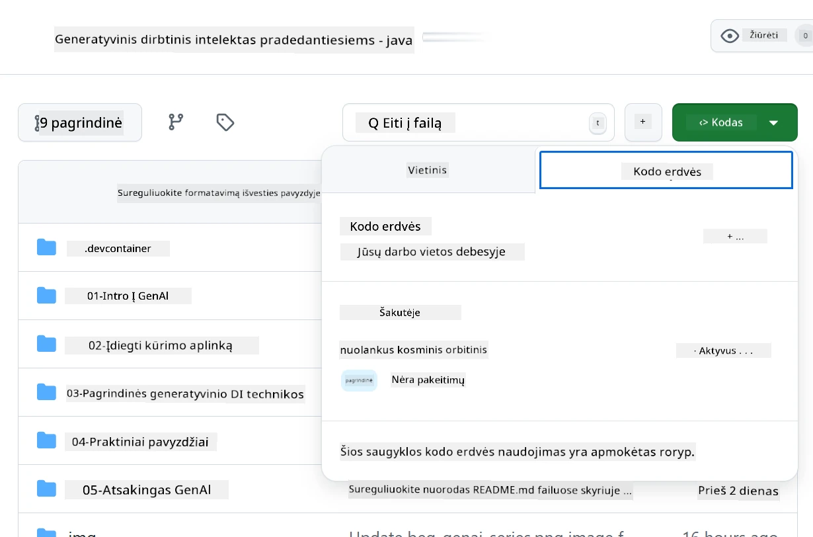
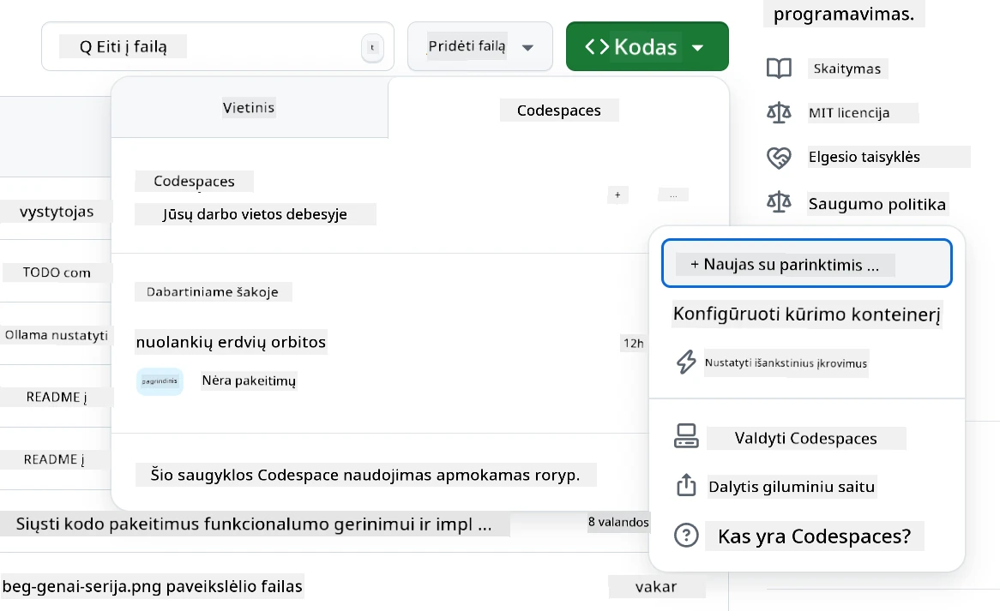
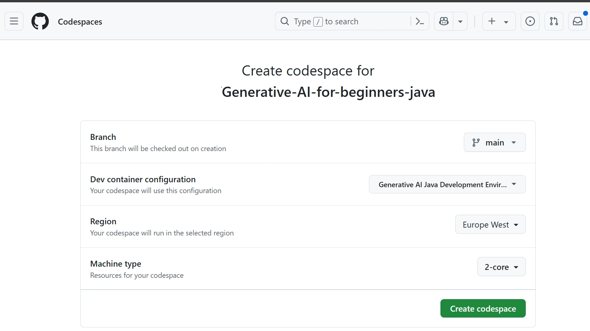
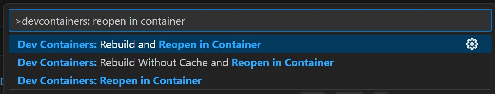
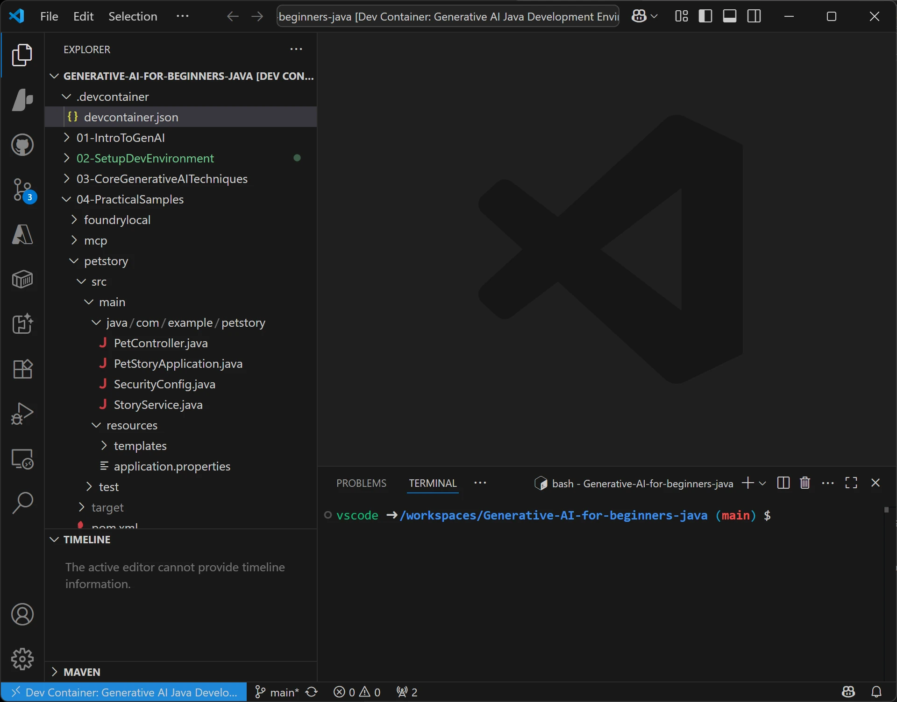
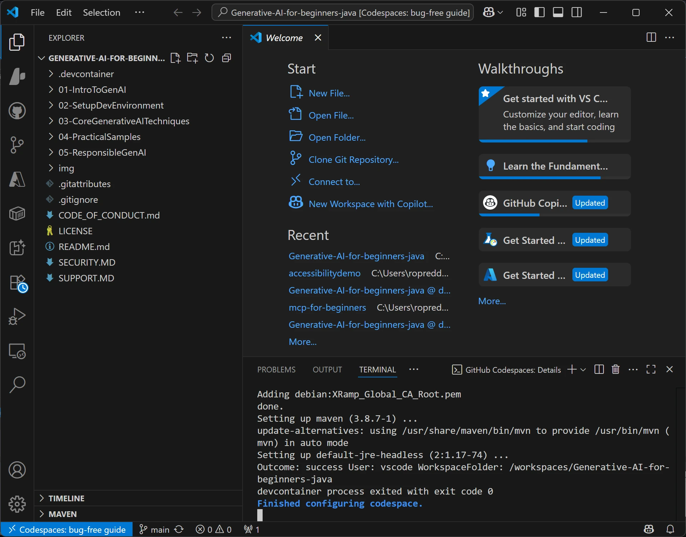

<!--
CO_OP_TRANSLATOR_METADATA:
{
  "original_hash": "96a30d42b9751a3d4e4b20e28d29d459",
  "translation_date": "2026-01-28T05:30:57+00:00",
  "source_file": "02-SetupDevEnvironment/README.md",
  "language_code": "lt"
}
-->
# Generatyvinio DI kūrimo aplinkos sąranka Java kalba

> **Greitas pradžios vadovas**: Kodavimas debesyje per 2 minutes – pereikite prie [GitHub Codespaces sąrankos](../../../02-SetupDevEnvironment) – nereikia diegti lokaliai, naudojami GitHub modeliai!

> **Domina Azure OpenAI?** Peržiūrėkite mūsų [Azure OpenAI sąrankos vadovą](getting-started-azure-openai.md) su žingsniais, kaip sukurti naują Azure OpenAI išteklių.

## Ko išmoksite

- Sukurti Java kūrimo aplinką DI programoms
- Pasirinkti ir sukonfigūruoti norimą kūrimo aplinką (pirmiausia debesyje su Codespaces, vietinis kūrimo konteineris arba pilnas vietinis nustatymas)
- Patikrinti sąranką prisijungus prie GitHub modelių

## Turinys

- [Ko išmoksite](../../../02-SetupDevEnvironment)
- [Įvadas](../../../02-SetupDevEnvironment)
- [1 žingsnis: Sukurkite kūrimo aplinką](../../../02-SetupDevEnvironment)
  - [A variantas: GitHub Codespaces (rekomenduojama)](../../../02-SetupDevEnvironment)
  - [B variantas: Vietinis kūrimo konteineris](../../../02-SetupDevEnvironment)
  - [C variantas: Naudokite esamą vietinę įdiegimą](../../../02-SetupDevEnvironment)
- [2 žingsnis: Sukurkite GitHub asmeninį prieigos raktą](../../../02-SetupDevEnvironment)
- [3 žingsnis: Patikrinkite sąranką](../../../02-SetupDevEnvironment)
- [Trikčių šalinimas](../../../02-SetupDevEnvironment)
- [Santrauka](../../../02-SetupDevEnvironment)
- [Tolimesni žingsniai](../../../02-SetupDevEnvironment)

## Įvadas

Šiame skyriuje vedame jus per kūrimo aplinkos sukūrimą. Pagrindiniu pavyzdžiu naudosime **GitHub modelius**, nes jie yra nemokami, lengvai įdiegiami su GitHub paskyra, nereikalauja kreditinės kortelės ir suteikia prieigą prie kelių modelių eksperimentams.

**Nereikia vietinio diegimo!** Galite iškart rašyti kodą naudodami GitHub Codespaces – tai visavertė kūrimo aplinka jūsų naršyklėje.


Rekomenduojame naudoti [**GitHub modelius**](https://github.com/marketplace?type=models) šiame kurse, nes jie:
- **Nemokami** pradėti
- **Lengva** sukurti vos su GitHub paskyra
- **Nereikia kreditinės kortelės**
- **Keli modeliai** eksperimentams

> **Pastaba**: GitHub modeliai, naudojami šiame mokyme, turi šiuos nemokamus apribojimus:
> - 15 užklausų per minutę (150 per dieną)
> - Apie 8 000 žodžių įvesties, apie 4 000 žodžių išvesties per užklausą
> - 5 vienalaikės užklausos
> 
> Produkcijai naudoti atnaujinkite į Azure AI Foundry modelius su savo Azure paskyra. Jūsų kodas nekeistos. Žr. [Azure AI Foundry dokumentaciją](https://learn.microsoft.com/azure/ai-foundry/foundry-models/how-to/quickstart-github-models).


## 1 žingsnis: Sukurkite kūrimo aplinką

<a name="quick-start-cloud"></a>

Sukūrėme iš anksto sukonfigūruotą kūrimo konteinerį, kad sumažintume sąrankos laiką ir užtikrintume, jog turite visus būtinus įrankius šiam Generatyvinio DI Java kursui. Pasirinkite jums tinkamiausią kūrimo būdą:

### Aplinkos sąrankos variantai:

#### A variantas: GitHub Codespaces (rekomenduojama)

**Pradėkite koduoti per 2 minutes – nereikia lokalaus diegimo!**

1. Atšakokite šią saugyklą į savo GitHub paskyrą  
   > **Pastaba**: Jei norite redaguoti pagrindinę konfigūraciją, peržiūrėkite [Kūrimo konteinerio konfigūraciją](../../../.devcontainer/devcontainer.json)
2. Spustelėkite **Code** → skirtuką **Codespaces** → **...** → **Naujas su pasirinktimis...**
3. Naudokite numatytuosius nustatymus – bus pasirinkta **Kūrimo konteinerio konfigūracija**: **Generatyvinio DI Java kūrimo aplinka** – kursui sukurta pritaikyta kūrimo konteinerio konfigūracija
4. Spustelėkite **Sukurti codespace**
5. Palaukite ~2 minutes, kol aplinka bus paruošta
6. Pereikite prie [2 žingsnis: Sukurkite GitHub raktą](../../../02-SetupDevEnvironment)








> **Codespaces privalumai**:
> - Nereikia vietinės instaliacijos
> - Veikia bet kuriame įrenginyje su naršykle
> - Iš anksto sukonfigūruota su visais įrankiais ir priklausomybėmis
> - Nemokamai 60 valandų per mėnesį asmeninėms paskyroms
> - Nuosekli aplinka visiems besimokantiesiems

#### B variantas: Vietinis kūrimo konteineris

**Skirta programuotojams, kurie nori dirbti vietoje su Docker**

1. Atšakokite ir nuklonuokite šią saugyklą į savo vietinį kompiuterį  
   > **Pastaba**: Jei norite redaguoti pagrindinę konfigūraciją, peržiūrėkite [Kūrimo konteinerio konfigūraciją](../../../.devcontainer/devcontainer.json)
2. Įdiekite [Docker Desktop](https://www.docker.com/products/docker-desktop/) ir [VS Code](https://code.visualstudio.com/)
3. Įdiekite [Dev Containers plėtinį](https://marketplace.visualstudio.com/items?itemName=ms-vscode-remote.remote-containers) VS Code aplinkoje
4. Atverkite saugyklos aplanką VS Code
5. Kai būsite paraginti, spustelėkite **Vėl atidaryti konteineryje** (arba naudokite `Ctrl+Shift+P` → "Dev Containers: Reopen in Container")
6. Palaukite, kol konteineris bus sukomplektuotas ir paleistas
7. Pereikite prie [2 žingsnis: Sukurkite GitHub raktą](../../../02-SetupDevEnvironment)





#### C variantas: Naudokite esamą vietinę įdiegimą

**Skirta programuotojams, turintiems esamą Java aplinką**

Reikalingi dalykai:
- [Java 21+](https://www.oracle.com/java/technologies/javase/jdk21-archive-downloads.html)  
- [Maven 3.9+](https://maven.apache.org/download.cgi)
- [VS Code](https://code.visualstudio.com) arba jūsų mėgstama IDE

Veiksmai:
1. Nuklonuokite šią saugyklą į savo vietinį kompiuterį
2. Atidarykite projektą savo IDE
3. Pereikite prie [2 žingsnis: Sukurkite GitHub raktą](../../../02-SetupDevEnvironment)

> **Profesionalus patarimas**: Jei jūsų įrenginys silpnos konfigūracijos, bet norite naudoti VS Code lokaliai, naudokite GitHub Codespaces! Galite prijungti vietinį VS Code prie debesyje talpinamo Codespace ir turėti geriausius abiejų pasaulių privalumus.




## 2 žingsnis: Sukurkite GitHub asmeninį prieigos raktą

1. Eikite į [GitHub nustatymus](https://github.com/settings/profile) ir pasirinkite **Settings** iš savo profilio meniu.
2. Kairėje šoninėje juostoje spustelėkite **Developer settings** (dažniausiai apačioje).
3. Skiltyje **Personal access tokens** spustelėkite **Fine-grained tokens** (arba sekite šią tiesioginę [nuorodą](https://github.com/settings/personal-access-tokens)).
4. Spustelėkite **Generate new token**.
5. Lauke „Token name“ įveskite aprašomą pavadinimą (pvz., `GenAI-Java-Course-Token`).
6. Nustatykite galiojimo laiką (rekomenduojama: 7 dienos saugumo sumetimais).
7. Lauke „Resource owner“ pasirinkite savo vartotojo paskyrą.
8. Lauke „Repository access“ pasirinkite saugyklas, kurias norite naudoti su GitHub modeliais (arba „All repositories“, jei reikia).
9. Lauke „Account permissions“ raskite **Models** ir nustatykite į **Read-only**.
10. Spustelėkite **Generate token**.
11. **Kopijuokite ir išsaugokite savo raktą dabar** – vėliau jo nematysite!

> **Saugumo patarimas**: Naudokite mažiausią reikiamą apimtį ir trumpiausią praktiką atitinkantį galiojimo laiką savo prieigos raktams.

## 3 žingsnis: Patikrinkite sąranką su GitHub modelių pavyzdžiu

Kai jūsų kūrimo aplinka paruošta, patikrinkime GitHub modelių integraciją su mūsų pavyzdine programa [`02-SetupDevEnvironment/examples/github-models`](../../../02-SetupDevEnvironment/examples/github-models).

1. Atidarykite terminalą savo kūrimo aplinkoje.
2. Eikite į GitHub modelių pavyzdžio katalogą:
   ```bash
   cd 02-SetupDevEnvironment/examples/github-models
   ```
3. Nustatykite savo GitHub raktą kaip aplinkos kintamąjį:
   ```bash
   # macOS/Linux
   export GITHUB_TOKEN=your_token_here
   
   # Windows (Komandų eilutė)
   set GITHUB_TOKEN=your_token_here
   
   # Windows (PowerShell)
   $env:GITHUB_TOKEN="your_token_here"
   ```

4. Paleiskite programą:
   ```bash
   mvn compile exec:java -Dexec.mainClass="com.example.githubmodels.App"
   ```

Turėtumėte matyti panašų išvestį:
```text
Using model: gpt-4.1-nano
Sending request to GitHub Models...
Response: Hello World!
```

### Pavyzdinio kodo supratimas

Pirma, supraskime ką tik paleistą programą. Pavyzdyje kataloge `examples/github-models` naudojama OpenAI Java SDK prisijungimui prie GitHub modelių:

**Šis kodas daro:**
- **Prisijungia** prie GitHub modelių naudodamas jūsų asmeninį prieigos raktą
- **Siunčia** paprastą žinutę „Say Hello World!“ DI modeliui
- **Gauja** ir rodo DI atsakymą
- **Patikrina**, kad jūsų sąranka veikia tinkamai

**Pagrindinė priklausomybė** (faile `pom.xml`):
```xml
<dependency>
    <groupId>com.openai</groupId>
    <artifactId>openai-java</artifactId>
    <version>2.12.0</version>
</dependency>
```

**Pagrindinis kodas** (`App.java`):
```java
// Prisijunkite prie GitHub modelių naudodami OpenAI Java SDK
OpenAIClient client = OpenAIOkHttpClient.builder()
    .apiKey(pat)
    .baseUrl("https://models.inference.ai.azure.com")
    .build();

// Sukurkite pokalbio užbaigimo užklausą
ChatCompletionCreateParams params = ChatCompletionCreateParams.builder()
    .model(modelId)
    .addSystemMessage("You are a concise assistant.")
    .addUserMessage("Say Hello World!")
    .build();

// Gaukite DI atsakymą
ChatCompletion response = client.chat().completions().create(params);
System.out.println("Response: " + response.choices().get(0).message().content().orElse("No response content"));
```

## Santrauka

Puiku! Jūs turite viską:

- Sukūrėte GitHub asmeninį prieigos raktą su tinkamomis teisėmis DI modelių prieigai
- Paleidote savo Java kūrimo aplinką (ar tai būtų Codespaces, kūrimo konteineriai arba vietinė)
- Prisijungėte prie GitHub modelių naudodami OpenAI Java SDK nemokamam DI kūrimui
- Patikrinote, kad viskas veikia paprastu pavyzdžiu, kuris bendrauja su DI modeliais

## Tolimesni žingsniai

[3 skyrius: Pagrindinės generatyvinio DI technikos](../03-CoreGenerativeAITechniques/README.md)

## Trikčių šalinimas

Turite problemų? Štai dažniausios problemos ir sprendimai:

- **Raktas neveikia?**  
  - Įsitikinkite, kad nukopijavote pilną raktą be papildomų tarpų  
  - Patikrinkite, ar raktas tinkamai nustatytas kaip aplinkos kintamasis  
  - Patikrinkite, ar raktas turi tinkamas teises (Models: Read-only)

- **Maven nerandamas?**  
  - Jei naudojate kūrimo konteinerius ar Codespaces, Maven turėtų būti iš anksto įdiegtas  
  - Vietinei saugai įsitikinkite, kad Java 21+ ir Maven 3.9+ yra įdiegti  
  - Patikrinkite komandą `mvn --version`

- **Ryšio problemos?**  
  - Patikrinkite interneto ryšį  
  - Įsitikinkite, kad GitHub yra pasiekiamas jūsų tinkle  
  - Patikrinkite, ar nesate už ugniasienės, blokuojančios GitHub modelių galinį tašką

- **Kūrimo konteineris neįsijungia?**  
  - Patikrinkite, ar Docker Desktop veikia (vietiniam kūrimui)  
  - Pabandykite iš naujo sukurti konteinerį: `Ctrl+Shift+P` → "Dev Containers: Rebuild Container"

- **Programos kompiliavimo klaidos?**  
  - Įsitikinkite, kad esate teisingame kataloge: `02-SetupDevEnvironment/examples/github-models`  
  - Pabandykite valyti ir iš naujo sukompiluoti: `mvn clean compile`

> **Reikia pagalbos?**: Jei vis dar kyla problemų, sukurkite problemą šioje saugykloje ir mes jums padėsime.

---

<!-- CO-OP TRANSLATOR DISCLAIMER START -->
**Atsakomybės apribojimas**:  
Šis dokumentas buvo išverstas naudojant dirbtinio intelekto vertimo paslaugą [Co-op Translator](https://github.com/Azure/co-op-translator). Nors siekiame tikslumo, prašome atkreipti dėmesį, kad automatizuoti vertimai gali turėti klaidų ar netikslumų. Originalus dokumentas gimtąja kalba turėtų būti laikomas autoritetingu šaltiniu. Kritinei informacijai rekomenduojamas profesionalus žmogaus vertimas. Mes neatsakome už jokius nesusipratimus ar neteisingas interpretacijas, kilusias naudojant šį vertimą.
<!-- CO-OP TRANSLATOR DISCLAIMER END -->