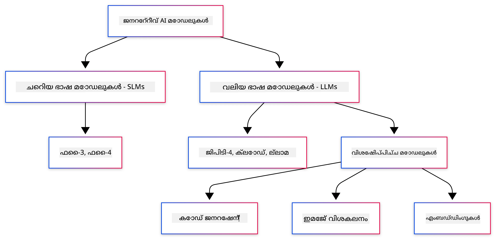
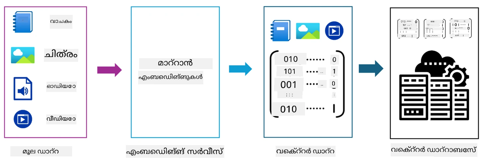
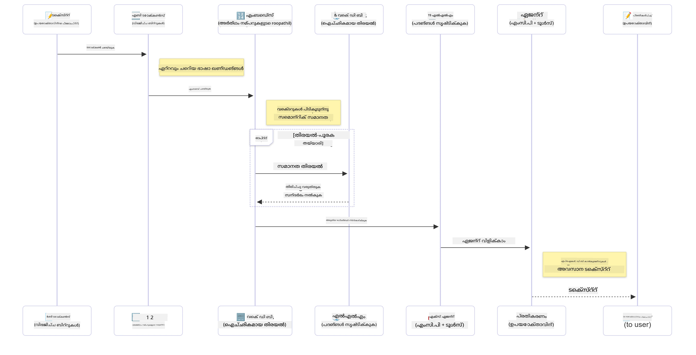

# ജനറേറ്റീവ് AI - ജാവ എഡിഷൻ പരിചയം

## നിങ്ങൾ പഠിക്കുന്നതെന്താണ്

- **ജനറേറ്റീവ് AI അടിസ്ഥാനങ്ങൾ** ഉൾപ്പെടെ LLMs, പ്രോംപ്റ്റ് എഞ്ചിനീയറിംഗ്, ടോക്കൺസ്, എംബഡ്ഡിംഗുകൾ, വെക്റ്റർ ഡാറ്റാബേസുകൾ
- **ജാവ AI വികസന ഉപകരണങ്ങൾ താരതമ്യം ചെയ്യുക** Azure OpenAI SDK, Spring AI, OpenAI Java SDK എന്നിവ ഉൾപ്പെടെ
- **മോഡൽ കോൺടെക്സ്റ്റ് പ്രോട്ടോക്കോൾ കണ്ടെത്തുക** AI ഏജന്റുകളുടെ ആശയവിനിമയത്തിൽ അതിന്റെ പങ്ക്

## ഉള്ളടക്ക പട്ടിക

- [പരിചയം](../../../01-IntroToGenAI)
- [ജനറേറ്റീവ് AI ആശയങ്ങൾക്കുള്ള ഒരു ദ്രുത പുനഃപരിശോധന](../../../01-IntroToGenAI)
- [പ്രോംപ്റ്റ് എഞ്ചിനീയറിംഗ് അവലോകനം](../../../01-IntroToGenAI)
- [ടോക്കൺസ്, എംബഡ്ഡിംഗുകൾ, ഏജന്റുകൾ](../../../01-IntroToGenAI)
- [ജാവയ്ക്കുള്ള AI വികസന ഉപകരണങ്ങളും ലൈബ്രറികളും](../../../01-IntroToGenAI)
  - [OpenAI Java SDK](../../../01-IntroToGenAI)
  - [Spring AI](../../../01-IntroToGenAI)
  - [Azure OpenAI Java SDK](../../../01-IntroToGenAI)
- [സംഗ്രഹം](../../../01-IntroToGenAI)
- [അടുത്ത ഘട്ടങ്ങൾ](../../../01-IntroToGenAI)

## പരിചയം

ജനറേറ്റീവ് AI ഫോർ ബിഗിനേഴ്സ് - ജാവ എഡിഷന്റെ ആദ്യ അധ്യായത്തിലേക്ക് സ്വാഗതം! ഈ അടിസ്ഥാന പാഠം ജനറേറ്റീവ് AIയുടെ പ്രധാന ആശയങ്ങൾക്കും ജാവ ഉപയോഗിച്ച് അവയെ എങ്ങനെ കൈകാര്യം ചെയ്യാമെന്നതിലും നിങ്ങളെ പരിചയപ്പെടുത്തുന്നു. വലിയ ഭാഷാ മോഡലുകൾ (LLMs), ടോക്കൺസ്, എംബഡ്ഡിംഗുകൾ, AI ഏജന്റുകൾ എന്നിവ ഉൾപ്പെടെ AI ആപ്ലിക്കേഷനുകളുടെ അടിസ്ഥാന ഘടകങ്ങളെക്കുറിച്ച് നിങ്ങൾ പഠിക്കും. ഈ കോഴ്സിൽ നിങ്ങൾ ഉപയോഗിക്കുന്ന പ്രധാന ജാവ ടൂളുകളും നമുക്ക് പരിശോധിക്കാം.

### ജനറേറ്റീവ് AI ആശയങ്ങൾക്കുള്ള ഒരു ദ്രുത പുനഃപരിശോധന

ജനറേറ്റീവ് AI ഒരു തരം കൃത്രിമ ബുദ്ധിയാണിത്, ഡാറ്റയിൽ നിന്ന് പഠിച്ച പാറ്റേണുകളും ബന്ധങ്ങളും അടിസ്ഥാനമാക്കി പുതിയ ഉള്ളടക്കം, ഉദാ: ടെക്സ്റ്റ്, ചിത്രങ്ങൾ, കോഡ് എന്നിവ സൃഷ്ടിക്കുന്നു. ജനറേറ്റീവ് AI മോഡലുകൾ മനുഷ്യനെപ്പോലുള്ള പ്രതികരണങ്ങൾ സൃഷ്ടിക്കുകയും, കോൺടെക്സ്റ്റ് മനസ്സിലാക്കുകയും, ചിലപ്പോൾ മനുഷ്യനെപ്പോലുള്ള ഉള്ളടക്കം സൃഷ്ടിക്കുകയും ചെയ്യുന്നു.

നിങ്ങളുടെ ജാവ AI ആപ്ലിക്കേഷനുകൾ വികസിപ്പിക്കുമ്പോൾ, **ജനറേറ്റീവ് AI മോഡലുകൾ** ഉപയോഗിച്ച് ഉള്ളടക്കം സൃഷ്ടിക്കും. ജനറേറ്റീവ് AI മോഡലുകളുടെ ചില കഴിവുകൾ:

- **ടെക്സ്റ്റ് ജനറേഷൻ**: ചാറ്റ്ബോട്ടുകൾ, ഉള്ളടക്കം, ടെക്സ്റ്റ് പൂർത്തീകരണം എന്നിവയ്ക്കായി മനുഷ്യനെപ്പോലുള്ള ടെക്സ്റ്റ് സൃഷ്ടിക്കൽ.
- **ഇമേജ് ജനറേഷൻ, വിശകലനം**: യഥാർത്ഥ ചിത്രങ്ങൾ സൃഷ്ടിക്കൽ, ഫോട്ടോകൾ മെച്ചപ്പെടുത്തൽ, ഒബ്ജക്റ്റുകൾ കണ്ടെത്തൽ.
- **കോഡ് ജനറേഷൻ**: കോഡ് സ്നിപ്പറ്റുകൾ അല്ലെങ്കിൽ സ്ക്രിപ്റ്റുകൾ എഴുതൽ.

വ്യത്യസ്ത പ്രവർത്തനങ്ങൾക്ക് അനുയോജ്യമായ മോഡലുകൾ ഉണ്ട്. ഉദാ: **ചെറിയ ഭാഷാ മോഡലുകൾ (SLMs)**, **വലിയ ഭാഷാ മോഡലുകൾ (LLMs)** എന്നിവ ടെക്സ്റ്റ് ജനറേഷനിൽ കൈകാര്യം ചെയ്യുന്നു, LLMs സാധാരണയായി സങ്കീർണ്ണ പ്രവർത്തനങ്ങൾക്ക് മികച്ച പ്രകടനം നൽകുന്നു. ചിത്രവുമായി ബന്ധപ്പെട്ട പ്രവർത്തനങ്ങൾക്ക്, നിങ്ങൾ പ്രത്യേകമായ ദൃശ്യ മോഡലുകൾ അല്ലെങ്കിൽ മൾട്ടി-മോഡൽ മോഡലുകൾ ഉപയോഗിക്കും.

തന്നെ, ഈ മോഡലുകളിൽ നിന്ന് ലഭിക്കുന്ന പ്രതികരണങ്ങൾ എല്ലായ്പ്പോഴും പൂർണ്ണമായും ശരിയാകില്ല. മോഡലുകൾ "ഹാലൂസിനേറ്റ്" ചെയ്യുകയോ, അധികാരപരമായ രീതിയിൽ തെറ്റായ വിവരങ്ങൾ സൃഷ്ടിക്കുകയോ ചെയ്യുന്നത് നിങ്ങൾ കേട്ടിട്ടുണ്ടാകാം. എന്നാൽ, **പ്രോംപ്റ്റ് എഞ്ചിനീയറിംഗ്** ഉപയോഗിച്ച് മോഡലിന് വ്യക്തമായ നിർദ്ദേശങ്ങളും കോൺടെക്സ്റ്റും നൽകുന്നതിലൂടെ മികച്ച പ്രതികരണങ്ങൾ സൃഷ്ടിക്കാൻ സഹായിക്കാം.

#### പ്രോംപ്റ്റ് എഞ്ചിനീയറിംഗ് അവലോകനം

പ്രോംപ്റ്റ് എഞ്ചിനീയറിംഗ് AI മോഡലുകൾക്ക് ആവശ്യമായ ഔട്ട്പുട്ടുകൾ നൽകാൻ സഹായിക്കുന്ന ഫലപ്രദമായ ഇൻപുട്ടുകൾ രൂപകൽപ്പന ചെയ്യാനുള്ള പ്രാക്ടീസാണ്. ഇതിൽ ഉൾപ്പെടുന്നു:

- **വ്യക്തത**: നിർദ്ദേശങ്ങൾ വ്യക്തവും സംശയരഹിതവുമാക്കുക.
- **കോൺടെക്സ്റ്റ്**: ആവശ്യമായ പശ്ചാത്തല വിവരങ്ങൾ നൽകുക.
- **പരിമിതികൾ**: ഏതെങ്കിലും നിയന്ത്രണങ്ങൾ അല്ലെങ്കിൽ ഫോർമാറ്റുകൾ വ്യക്തമാക്കുക.

പ്രോംപ്റ്റ് എഞ്ചിനീയറിംഗിനുള്ള ചില മികച്ച പ്രാക്ടീസുകൾ: പ്രോംപ്റ്റ് ഡിസൈൻ, വ്യക്തമായ നിർദ്ദേശങ്ങൾ, ടാസ്ക് ബ്രേക്ക് ഡൗൺ, വൺ-ഷോട്ട്, ഫ്യൂ-ഷോട്ട് ലേണിംഗ്, പ്രോംപ്റ്റ് ട്യൂണിംഗ്. നിങ്ങളുടെ പ്രത്യേക ഉപയോഗകേസിനായി എന്ത് മികച്ചതാണെന്ന് കണ്ടെത്താൻ വ്യത്യസ്ത പ്രോംപ്റ്റുകൾ പരീക്ഷിക്കുന്നത് അനിവാര്യമാണ്.

ആപ്ലിക്കേഷനുകൾ വികസിപ്പിക്കുമ്പോൾ, നിങ്ങൾ വ്യത്യസ്ത പ്രോംപ്റ്റ് തരം ഉപയോഗിക്കും:
- **സിസ്റ്റം പ്രോംപ്റ്റുകൾ**: മോഡലിന്റെ പെരുമാറ്റത്തിനുള്ള അടിസ്ഥാന നിയമങ്ങളും കോൺടെക്സ്റ്റും സജ്ജമാക്കുക.
- **ഉപയോക്തൃ പ്രോംപ്റ്റുകൾ**: നിങ്ങളുടെ ആപ്ലിക്കേഷൻ ഉപയോക്താക്കളിൽ നിന്ന് ലഭിക്കുന്ന ഇൻപുട്ട് ഡാറ്റ.
- **അസിസ്റ്റന്റ് പ്രോംപ്റ്റുകൾ**: സിസ്റ്റം, ഉപയോക്തൃ പ്രോംപ്റ്റുകൾ അടിസ്ഥാനമാക്കി മോഡലിന്റെ പ്രതികരണങ്ങൾ.

> **കൂടുതൽ പഠിക്കുക**: [GenAI for Beginners കോഴ്സിന്റെ പ്രോംപ്റ്റ് എഞ്ചിനീയറിംഗ് അധ്യായത്തിൽ](https://github.com/microsoft/generative-ai-for-beginners/tree/main/04-prompt-engineering-fundamentals) പ്രോംപ്റ്റ് എഞ്ചിനീയറിംഗിനെക്കുറിച്ച് കൂടുതൽ പഠിക്കുക.

#### ടോക്കൺസ്, എംബഡ്ഡിംഗുകൾ, ഏജന്റുകൾ

ജനറേറ്റീവ് AI മോഡലുകൾ ഉപയോഗിക്കുമ്പോൾ, **ടോക്കൺസ്**, **എംബഡ്ഡിംഗുകൾ**, **ഏജന്റുകൾ**, **മോഡൽ കോൺടെക്സ്റ്റ് പ്രോട്ടോക്കോൾ (MCP)** പോലുള്ള പദങ്ങൾ നിങ്ങൾ കാണും. ഈ ആശയങ്ങളുടെ വിശദമായ അവലോകനം:

- **ടോക്കൺസ്**: ടോക്കൺസ് ഒരു മോഡലിലെ ഏറ്റവും ചെറിയ ടെക്സ്റ്റ് യൂണിറ്റാണ്. ഇത് വാക്കുകൾ, അക്ഷരങ്ങൾ, അല്ലെങ്കിൽ സബ്‌വേഡുകൾ ആയിരിക്കും. മോഡലിന് മനസ്സിലാക്കാൻ കഴിയുന്ന ഫോർമാറ്റിൽ ടെക്സ്റ്റ് ഡാറ്റയെ പ്രതിനിധീകരിക്കാൻ ടോക്കൺസ് ഉപയോഗിക്കുന്നു. ഉദാ: "The quick brown fox jumped over the lazy dog" എന്ന വാചകം ["The", " quick", " brown", " fox", " jumped", " over", " the", " lazy", " dog"] അല്ലെങ്കിൽ ["The", " qu", "ick", " br", "own", " fox", " jump", "ed", " over", " the", " la", "zy", " dog"] എന്ന രീതിയിൽ ടോക്കൺ ചെയ്യപ്പെടാം.

ടോക്കൺ ചെയ്യൽ ടെക്സ്റ്റ് ഈ ചെറിയ യൂണിറ്റുകളിലേക്ക് വിഭജിക്കുന്ന പ്രക്രിയയാണ്. ഇത് നിർണായകമാണ്, കാരണം മോഡലുകൾ റോ ടെക്സ്റ്റ് അല്ല, ടോക്കൺസ് ഉപയോഗിച്ച് പ്രവർത്തിക്കുന്നു. ഒരു പ്രോംപ്റ്റിലെ ടോക്കൺസിന്റെ എണ്ണം മോഡലിന്റെ പ്രതികരണ ദൈർഘ്യത്തെയും ഗുണനിലവാരത്തെയും ബാധിക്കുന്നു, കാരണം മോഡലുകൾക്ക് അവരുടെ കോൺടെക്സ്റ്റ് വിൻഡോയ്ക്ക് ടോക്കൺ പരിധിയുണ്ട് (ഉദാ: GPT-4oയുടെ മൊത്തം കോൺടെക്സ്റ്റിന് 128K ടോക്കൺസ്, ഇൻപുട്ട്, ഔട്ട്പുട്ട് ഉൾപ്പെടെ).

  ജാവയിൽ, OpenAI SDK പോലുള്ള ലൈബ്രറികൾ ഉപയോഗിച്ച് AI മോഡലുകൾക്ക് അഭ്യർത്ഥനകൾ അയയ്ക്കുമ്പോൾ ടോക്കൺ ചെയ്യൽ സ്വയമേവ കൈകാര്യം ചെയ്യാൻ കഴിയും.

- **എംബഡ്ഡിംഗുകൾ**: എംബഡ്ഡിംഗുകൾ ടോക്കൺസിന്റെ വെക്റ്റർ പ്രതിനിധാനങ്ങളാണ്, ഇത് അർത്ഥപരമായ അർത്ഥം പിടിച്ചെടുക്കുന്നു. ഇത് സംഖ്യാ പ്രതിനിധാനങ്ങളാണ് (സാധാരണയായി ഫ്ലോട്ടിംഗ്-പോയിന്റ് സംഖ്യകളുടെ നിരകൾ) മോഡലുകൾക്ക് വാക്കുകൾ തമ്മിലുള്ള ബന്ധങ്ങൾ മനസ്സിലാക്കാനും കോൺടെക്സ്റ്റ് അനുസരിച്ച് അനുയോജ്യമായ പ്രതികരണങ്ങൾ സൃഷ്ടിക്കാനും അനുവദിക്കുന്നു. സമാനമായ വാക്കുകൾക്ക് സമാനമായ എംബഡ്ഡിംഗുകൾ ഉണ്ട്, ഇത് മോഡലിന് പര്യായങ്ങൾ, അർത്ഥപരമായ ബന്ധങ്ങൾ എന്നിവ മനസ്സിലാക്കാൻ സഹായിക്കുന്നു.

  ജാവയിൽ, OpenAI SDK അല്ലെങ്കിൽ എംബഡ്ഡിംഗ് ജനറേഷൻ പിന്തുണയ്ക്കുന്ന മറ്റ് ലൈബ്രറികൾ ഉപയോഗിച്ച് എംബഡ്ഡിംഗുകൾ സൃഷ്ടിക്കാം. ഈ എംബഡ്ഡിംഗുകൾ അർത്ഥപരമായ തിരച്ചിലിനായി നിർണായകമാണ്, നിങ്ങൾക്ക് അർത്ഥത്തെ അടിസ്ഥാനമാക്കി സമാനമായ ഉള്ളടക്കം കണ്ടെത്താൻ കഴിയുന്നിടത്ത്.

- **വെക്റ്റർ ഡാറ്റാബേസുകൾ**: വെക്റ്റർ ഡാറ്റാബേസുകൾ എംബഡ്ഡിംഗുകൾക്കായി ഓപ്റ്റിമൈസ് ചെയ്ത പ്രത്യേക സംഭരണ ​​സിസ്റ്റങ്ങളാണ്. ഇവ ഫലപ്രദമായ സമാനതാ തിരച്ചിൽ സാധ്യമാക്കുന്നു, കൂടാതെ Retrieval-Augmented Generation (RAG) പാറ്റേണുകൾക്കായി നിർണായകമാണ്, നിങ്ങൾക്ക് അർത്ഥപരമായ സമാനതയെ അടിസ്ഥാനമാക്കി വലിയ ഡാറ്റാസെറ്റുകളിൽ നിന്ന് അനുയോജ്യമായ വിവരങ്ങൾ കണ്ടെത്തേണ്ടതുണ്ട്.

> **കുറിപ്പ്**: ഈ കോഴ്സിൽ, വെക്റ്റർ ഡാറ്റാബേസുകൾ ഉൾപ്പെടുത്തുന്നില്ല, പക്ഷേ അവ യഥാർത്ഥ ലോക ആപ്ലിക്കേഷനുകളിൽ സാധാരണയായി ഉപയോഗിക്കപ്പെടുന്നതിനാൽ അവയെ പരാമർശിക്കുന്നത് മൂല്യമുള്ളതാണ്.

- **ഏജന്റുകൾ & MCP**: മോഡലുകൾ, ഉപകരണങ്ങൾ, ബാഹ്യ സിസ്റ്റങ്ങൾ എന്നിവയുമായി സ്വയം ആശയവിനിമയം നടത്തുന്ന AI ഘടകങ്ങൾ. മോഡൽ കോൺടെക്സ്റ്റ് പ്രോട്ടോക്കോൾ (MCP) ഏജന്റുകൾക്ക് ബാഹ്യ ഡാറ്റാ സ്രോതസ്സുകൾ, ഉപകരണങ്ങൾ എന്നിവ സുരക്ഷിതമായി ആക്സസ് ചെയ്യാൻ ഒരു സ്റ്റാൻഡേർഡ് മാർഗം നൽകുന്നു. [MCP for Beginners](https://github.com/microsoft/mcp-for-beginners) കോഴ്സിൽ കൂടുതൽ പഠിക്കുക.

ജാവ AI ആപ്ലിക്കേഷനുകളിൽ, നിങ്ങൾ ടെക്സ്റ്റ് പ്രോസസ്സിംഗിനായി ടോക്കൺസ്, അർത്ഥപരമായ തിരച്ചിലിനും RAG-ക്കും എംബഡ്ഡിംഗുകൾ, ഡാറ്റാ റിട്രീവലിനായി വെക്റ്റർ ഡാറ്റാബേസുകൾ, ബാഹ്യ ഉപകരണങ്ങൾ ഉപയോഗിക്കുന്ന ബുദ്ധിമാനായ സിസ്റ്റങ്ങൾ നിർമ്മിക്കാൻ MCP ഉപയോഗിച്ച് ഏജന്റുകൾ എന്നിവ ഉപയോഗിക്കും.

### ജാവയ്ക്കുള്ള AI വികസന ഉപകരണങ്ങളും ലൈബ്രറികളും

ജാവ AI വികസനത്തിന് മികച്ച ടൂളുകൾ നൽകുന്നു. ഈ കോഴ്സത്തിൽ നമുക്ക് പരിശോധിക്കേണ്ട മൂന്ന് പ്രധാന ലൈബ്രറികൾ ഉണ്ട് - OpenAI Java SDK, Azure OpenAI SDK, Spring AI.

ഇവിടെ ഓരോ അധ്യായത്തിലെ ഉദാഹരണങ്ങളിൽ ഏത് SDK ഉപയോഗിക്കുന്നുവെന്ന് കാണിക്കുന്ന ഒരു ദ്രുത റഫറൻസ് ടേബിള്:

| അധ്യായം | സാമ്പിൾ | SDK |
|---------|--------|-----|
| 02-SetupDevEnvironment | github-models | OpenAI Java SDK |
| 02-SetupDevEnvironment | basic-chat-azure | Spring AI Azure OpenAI |
| 03-CoreGenerativeAITechniques | examples | Azure OpenAI SDK |
| 04-PracticalSamples | petstory | OpenAI Java SDK |
| 04-PracticalSamples | foundrylocal | OpenAI Java SDK |
| 04-PracticalSamples | calculator | Spring AI MCP SDK + LangChain4j |

**SDK ഡോക്യുമെന്റേഷൻ ലിങ്കുകൾ:**
- [Azure OpenAI Java SDK](https://github.com/Azure/azure-sdk-for-java/tree/azure-ai-openai_1.0.0-beta.16/sdk/openai/azure-ai-openai)
- [Spring AI](https://docs.spring.io/spring-ai/reference/)
- [OpenAI Java SDK](https://github.com/openai/openai-java)
- [LangChain4j](https://docs.langchain4j.dev/)

#### OpenAI Java SDK

OpenAI SDK OpenAI API-യുടെ ഔദ്യോഗിക ജാവ ലൈബ്രറിയാണ്. OpenAI മോഡലുകളുമായി ആശയവിനിമയം നടത്തുന്നതിനുള്ള ലളിതവും സ്ഥിരതയുള്ള ഇന്റർഫേസ് ഇത് നൽകുന്നു, ജാവ ആപ്ലിക്കേഷനുകളിൽ AI കഴിവുകൾ എളുപ്പത്തിൽ സംയോജിപ്പിക്കാൻ ഇത് എളുപ്പമാക്കുന്നു. 2-ആമത്തെ അധ്യായത്തിലെ GitHub Models ഉദാഹരണം, 4-ആമത്തെ അധ്യായത്തിലെ Pet Story ആപ്ലിക്കേഷൻ, Foundry Local ഉദാഹരണം OpenAI SDK സമീപനം പ്രദർശിപ്പിക്കുന്നു.

#### Spring AI

Spring AI Spring ആപ്ലിക്കേഷനുകളിൽ AI കഴിവുകൾ കൊണ്ടുവരുന്ന സമഗ്രമായ ഫ്രെയിംവർക്കാണ്, വിവിധ AI പ്രൊവൈഡർമാർക്കിടയിൽ സ്ഥിരതയുള്ള ആബ്സ്ട്രാക്ഷൻ ലെയർ നൽകുന്നു. ഇത് Spring ഇക്കോസിസ്റ്റവുമായി സുതാര്യമായി സംയോജിപ്പിക്കുന്നു, AI കഴിവുകൾ ആവശ്യമുള്ള എന്റർപ്രൈസ് ജാവ ആപ്ലിക്കേഷനുകൾക്കുള്ള അനുയോജ്യമായ തിരഞ്ഞെടുപ്പാണ്.

Spring AI-യുടെ ശക്തി Spring ഇക്കോസിസ്റ്റവുമായി അതിന്റെ സുതാര്യമായ സംയോജിതത്വത്തിലാണ്, dependency injection, configuration management, testing frameworks പോലുള്ള പരിചിതമായ Spring പാറ്റേണുകൾ ഉപയോഗിച്ച് പ്രൊഡക്ഷൻ-റെഡി AI ആപ്ലിക്കേഷനുകൾ നിർമ്മിക്കുന്നത് എളുപ്പമാക്കുന്നു. 2-ആമത്തെ അധ്യായത്തിലും 4-ആമത്തെ അധ്യായത്തിലും OpenAI, Model Context Protocol (MCP) Spring AI ലൈബ്രറികൾ ഉപയോഗിക്കുന്ന ആപ്ലിക്കേഷനുകൾ നിർമ്മിക്കാൻ നിങ്ങൾ Spring AI ഉപയോഗിക്കും.

##### Model Context Protocol (MCP)

[Model Context Protocol (MCP)](https://modelcontextprotocol.io/) AI ആപ്ലിക്കേഷനുകൾക്ക് ബാഹ്യ ഡാറ്റാ സ്രോതസ്സുകളുമായി സുരക്ഷിതമായി ആശയവിനിമയം നടത്താൻ അനുവദിക്കുന്ന ഒരു ഉയർന്ന നിലവാരത്തിലുള്ള സ്റ്റാൻഡേർഡാണ്. MCP AI മോഡലുകൾക്ക് കോൺടെക്സ്റ്റ് വിവരങ്ങൾ ആക്സസ് ചെയ്യാനും നിങ്ങളുടെ ആപ്ലിക്കേഷനുകളിൽ പ്രവർത്തനങ്ങൾ നിർവഹിക്കാനും ഒരു സ്റ്റാൻഡേർഡ് മാർഗം നൽകുന്നു.

4-ആമത്തെ അധ്യായത്തിൽ, Spring AI ഉപയോഗിച്ച് Model Context Protocol അടിസ്ഥാനങ്ങൾ പ്രദർശിപ്പിക്കുന്ന ഒരു ലളിതമായ MCP കാൽക്കുലേറ്റർ സർവീസ് നിങ്ങൾ നിർമ്മിക്കും, അടിസ്ഥാന ഉപകരണ സംയോജിതത്വങ്ങളും സർവീസ് ആർക്കിടെക്ചറുകളും എങ്ങനെ സൃഷ്ടിക്കാമെന്ന് കാണിക്കുന്നു.

#### Azure OpenAI Java SDK

Azure OpenAI ജാവ ക്ലയന്റ് ലൈബ്രറി OpenAI REST APIകളുടെ ഒരു രൂപാന്തരമാണ്, ഇത് ഒരു സ്വാഭാവിക ഇന്റർഫേസ്, Azure SDK ഇക്കോസിസ്റ്റവുമായി സംയോജനം എന്നിവ നൽകുന്നു. 3-ആമത്തെ അധ്യായത്തിൽ, Azure OpenAI SDK ഉപയോഗിച്ച് ചാറ്റ് ആപ്ലിക്കേഷനുകൾ, ഫംഗ്ഷൻ കോളിംഗ്, RAG (Retrieval-Augmented Generation) പാറ്റേണുകൾ ഉൾപ്പെടെ ആപ്ലിക്കേഷനുകൾ നിർമ്മിക്കും.

> കുറിപ്പ്: Azure OpenAI SDK OpenAI Java SDK-യുമായി താരതമ്യം ചെയ്യുമ്പോൾ സവിശേഷതകളിൽ പിന്നിലാണ്, അതിനാൽ ഭാവി പ്രോജക്റ്റുകൾക്കായി OpenAI Java SDK ഉപയോഗിക്കുന്നത് പരിഗണിക്കുക.

## സംഗ്രഹം

അടിസ്ഥാനങ്ങൾ ഇതോടെ അവസാനിക്കുന്നു! നിങ്ങൾ ഇപ്പോൾ മനസ്സിലാക്കുന്നു:

- ജനറേറ്റീവ് AIയുടെ പ്രധാന ആശയങ്ങൾ - LLMs, പ്രോംപ്റ്റ് എഞ്ചിനീയറിംഗ്, ടോക്കൺസ്, എംബഡ്ഡിംഗുകൾ, വെക്റ്റർ ഡാറ്റാബേസുകൾ എന്നിവയിൽ നിന്ന്
- ജാവ AI വികസനത്തിനുള്ള നിങ്ങളുടെ ടൂൾകിറ്റ് ഓ

---

<!-- CO-OP TRANSLATOR DISCLAIMER START -->
**അറിയിപ്പ്**:  
ഈ രേഖ AI വിവർത്തന സേവനം [Co-op Translator](https://github.com/Azure/co-op-translator) ഉപയോഗിച്ച് വിവർത്തനം ചെയ്തതാണ്. ഞങ്ങൾ കൃത്യതയ്ക്കായി ശ്രമിക്കുന്നുവെങ്കിലും, ഓട്ടോമേറ്റഡ് വിവർത്തനങ്ങളിൽ പിഴവുകൾ അല്ലെങ്കിൽ തെറ്റായ വിവരങ്ങൾ ഉണ്ടാകാൻ സാധ്യതയുണ്ട്. അതിന്റെ സ്വഭാവ ഭാഷയിലുള്ള അസൽ രേഖയാണ് പ്രാമാണികമായ ഉറവിടം എന്ന് പരിഗണിക്കണം. നിർണായകമായ വിവരങ്ങൾക്ക്, പ്രൊഫഷണൽ മനുഷ്യ വിവർത്തനം ശുപാർശ ചെയ്യുന്നു. ഈ വിവർത്തനം ഉപയോഗിച്ച് ഉണ്ടാകുന്ന തെറ്റിദ്ധാരണകൾ അല്ലെങ്കിൽ തെറ്റായ വ്യാഖ്യാനങ്ങൾക്കായി ഞങ്ങൾ ഉത്തരവാദികളല്ല.
<!-- CO-OP TRANSLATOR DISCLAIMER END -->