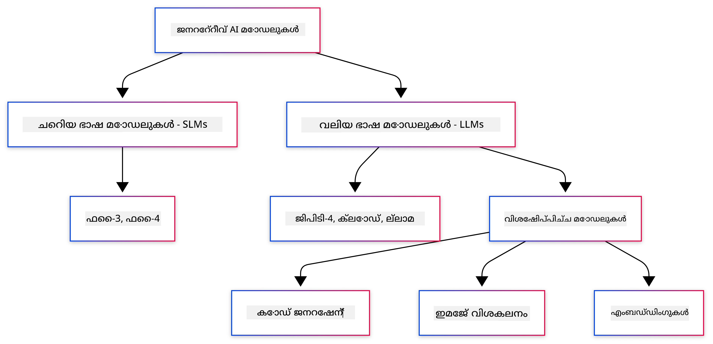
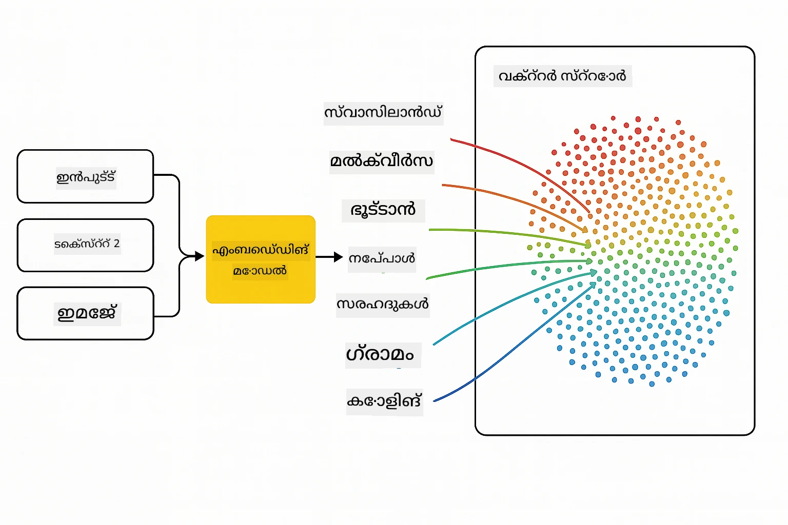
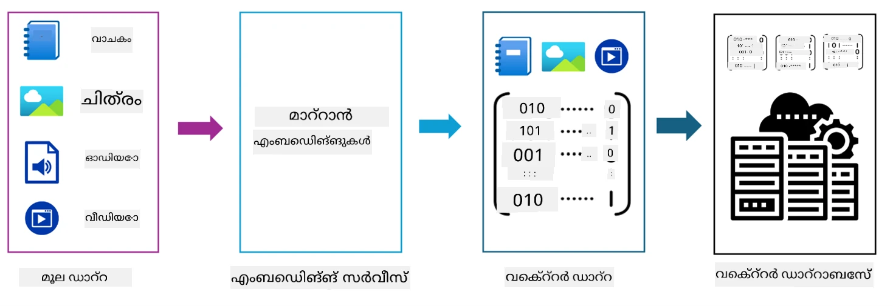
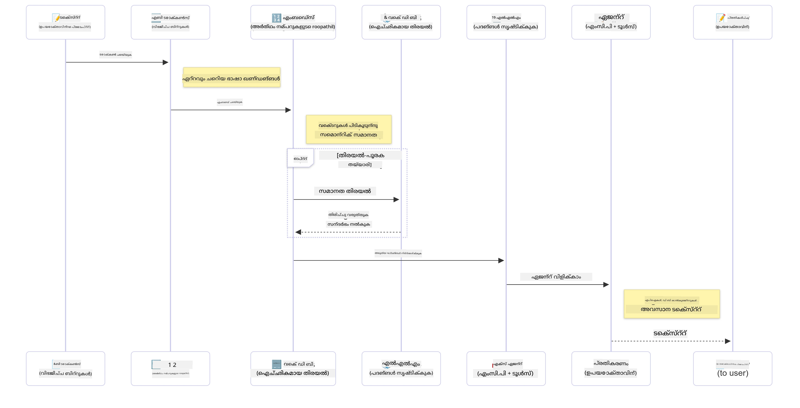

# ജെനറേറ്റീവ് എഐ-യിലേക്ക് പരിചയം - ജാവ എഡിഷൻ

> **വീഡിയോ**: [ഈ ലെസനിലെ വീക്ഷണമുള്ള വീഡിയോ YouTube-ൽ കാണുക.](https://www.youtube.com/watch?v=XH46tGp_eSw) മുകളിൽ കാണുന്ന തമ്പ്‌നെയിൽ ചിത്രത്തിലും ക്ലിക്കുചെയ്യാവുന്നതാണ്.

## നിങ്ങൾ പഠിക്കുoennu

- **ജെനറേറ്റീവ് എഐ അടിസ്ഥാനങ്ങൾ** കൂടാതെ LLMകൾ, പ്രോംപ്റ്റ് എഞ്ചിനീയറിംഗ്, ടോക്കൺസ്, എംബെഡ്ഡിംഗ്സ്, വെക്ടർ ഡേറ്റാബേസുകൾ എന്നിവയെക്കുറിച്ച്
- **ജാവ എഐ വികസന ഉപകരണങ്ങൾ താരതമ്യം** ചെയ്യുക: Azure OpenAI SDK, Spring AI, OpenAI Java SDK എന്നിവ ഉൾപ്പെടെ
- **മോഡൽ കോൺടെക്സ് പ്രോട്ടോക്കോൾ** കണ്ടെത്തുക, എ ഐ ഏജന്റ് ആശയവിനിമയത്തിൽ അതിന്റെ പങ്ക് അറിയുക

## ഉള്ളടക്ക പട്ടിക

- [പരിചയം](#പരിചയം)
- [ജെനറേറ്റീവ് എഐ ആശയങ്ങൾക്കായി ഒരു ദ്രുത പുതുക്കൽ](#ജെനറേറ്റീവ്-എഐ-ആശയങ്ങൾക്കായി-ഒരു-ദ്രുത-പുതുക്കൽ)
- [പ്രോംപ്റ്റ് എഞ്ചിനീയറിംഗ് അവലോകനം](#പ്രോംപ്റ്റ്-എഞ്ചിനീയറിംഗ്-അവലോകനം)
- [ടോക്കൺസ്, എംബെഡ്ഡിംഗ്സ്, ഏജന്റ്സ്](#ടോക്കൺസ്-എംബെഡ്ഡിംഗ്സ്-ഏജന്റ്സ്)
- [ജാവയ്ക്കുള്ള എഐ വികസന ഉപകരണങ്ങളും ലൈബ്രറികളും](#ജാവയ്ക്കുള്ള-എഐ-വികസന-ഉപകരണങ്ങളും-ലൈബ്രറികളും)
  - [OpenAI ജാവ SDK](#openai-ജാവ-sdk)
  - [Spring AI](#spring-ai)
  - [Azure OpenAI ജാവ SDK](#azure-openai-ജാവ-sdk)
- [സംക്ഷേപം](#സംക്ഷേപം)
- [അടുത്ത ഘട്ടങ്ങൾ](#അടുത്ത-ഘട്ടങ്ങൾ)

## പരിചയം

ജെനറേറ്റീവ് എഐ ഫോർ ബിഗിന്നേഴ്സ് - ജാവ എഡിഷന്റെ ആദ്യ അധ്യായത്തിലേക്ക് സ്വാഗതം! ഈ അടിസ്ഥാന പാഠം നിങ്ങൾക്ക് ജെനറേറ്റീവ് എഐയുടെ മുഖ്യ ആശയങ്ങളേക്കുറിച്ച് അവതരിപ്പിക്കുന്നു, അതോടൊപ്പം ജാവ ഉപയോഗിച്ച് അവ എങ്ങനെ പ്രവർത്തിപ്പിക്കാമെന്ന് പഠിപ്പിക്കുന്നു. നിങ്ങൾക്ക് എഐ ആപ്ലിക്കേഷനുകളുടെ അത്യാവശ്യ ഘടകങ്ങൾ അറിയാം, കൂടാതെ വലിയ ഭാഷ മോഡലുകൾ (LLMs), ടോക്കൺസ്, എംബെഡ്ഡിംഗ്സ്, എഐ ഏജന്റ്സ് എന്നിവയെക്കുറിച്ച് പഠിക്കും. ഈ കോഴ്സിൽ നിങ്ങൾ ഉപയോഗിക്കുന്ന പ്രധാനമായ ജാവ ടൂളുകൾ കൂടി പരിശോധിക്കും.

### ജെനറേറ്റീവ് എഐ ആശയങ്ങൾക്കായി ഒരു ദ്രുത പുതുക്കൽ

ജെനറേറ്റീവ് എഐ എന്നത് പുതിയ ഉള്ളടക്കം സൃഷ്ടിക്കുന്ന ഒരു തരം കൃത്രിമ ബുദ്ധിമുട്ടാണ്, ഉദാഹരണത്തിന് ടെക്സ്റ്റ്, ചിത്രങ്ങൾ, കോഡ് എന്നിവ, പഠിച്ച ഡാറ്റയിൽ നിന്നുള്ള പാറ്റേണുകളും ബന്ധങ്ങളുമനുസരിച്ച്. ജെനറേറ്റീവ് എഐ മോഡലുകൾ മനുഷ്യപോലുള്ള പ്രതികരണങ്ങൾ സൃഷ്ടിക്കാനും, കോൺടെക്സ് മനസ്സിലാക്കാനും, 때때로 മനുഷ്യപോലെ തോന്നുന്ന ഉള്ളടക്കം സൃഷ്ടിക്കാനും കഴിയും.

നിങ്ങൾക്ക് ജാവ എഐ ആപ്ലിക്കേഷനുകൾ വികസിപ്പിക്കുമ്പോൾ, നിങ്ങൾ **ജെനറേറ്റീവ് എഐ മോഡലുകളുമായി** ചേർന്ന് ഉള്ളടക്കം സൃഷ്ടിക്കും. ജെനറേറ്റീവ് എഐ മോഡലുകളുടെ ചില കഴിവുകൾ:

- **ടെക്സ്റ്റ് ജനറേഷൻ**: ചാറ്റ്‌ബോട്ടുകൾ, ഉള്ളടക്കം, ടെക്സ്റ്റ് പൂർത്തീകരണങ്ങൾ എന്നിവയ്ക്കായി മനുഷ്യപോലുള്ള ടെക്സ്റ്റ് നിർമ്മാണം.
- **ചിത്ര നിർമ്മാണം, വിശകലനം**: യാഥാർത്ഥ്യമുള്ള ചിത്രങ്ങൾ സൃഷ്ടിക്കൽ, ഫോട്ടോകൾ മെച്ചപ്പെടുത്തൽ, വസ്തുക്കൾ കണ്ടെത്തൽ.
- **കോഡ് ജനറേഷൻ**: കോഡ് തുരുത്തുകൾ അല്ലെങ്കിൽ സ്ക്രിപ്റ്റുകൾ എഴുതൽ.

വിശേദപ്പെട്ട കാര്യങ്ങൾക്ക് വ്യത്യസ്ത മോഡലുകളുടെ വിന്യാസങ്ങളുണ്ട്. ഉദാഹരണത്തിന്, **ചെറിയ ഭാഷ മോഡലുകളും (SLMs)** **വലിയ ഭാഷ മോഡലുകളും (LLMs)** ടെക്സ്റ്റ് ജനറേഷനിൽ ഉപയോഗിക്കാം, LLMs സാധാരണയായി സങ്കീർണ്ണ കാര്യങ്ങളിൽ മെച്ചമായ പ്രകടനം നൽകുന്നു. ചിത്ര ബന്ധിച്ച കാര്യങ്ങൾക്കായി പ്രത്യേകവായ visión മോഡലുകൾ അല്ലെങ്കിൽ മൾട്ടി-മോഡൽ മോഡലുകൾ ഉപയോഗിക്കും.

സ്വാഭാവികം, ഈ മോഡലുകളിൽ നിന്ന് ലഭിക്കുന്ന പ്രതികരണങ്ങൾ എല്ലാവർഷവും പൂർണ്ണമായും ശരിയല്ല. മോഡലുകൾ "ഹല്യൂസിനേറ്റിങ്ങ്" എന്ന് അറിയപ്പെടുന്ന വീഴ്ചകൾ ഒക്കെ വരാൻ സാദ്ധ്യതയുണ്ട്, അതായത് തെറ്റായ വിവരങ്ങൾ അധികാരപരമായി ഉല്പാദിപ്പിക്കുക. എന്നാൽ നിങ്ങൾ മോഡലിന് വ്യക്തമായ നിർദ്ദേശങ്ങളും കോൺടെക്റ്റും നൽകി മികച്ച പ്രതികരണങ്ങൾ ഉണ്ടാക്കാൻ സഹായിക്കാം. ഇതാണ് **പ്രോംപ്റ്റ് എഞ്ചിനീയറിംഗ്** വേണമെന്ന് വരുന്നിടം.

#### പ്രോംപ്റ്റ് എഞ്ചിനീയറിംഗ് അവലോകനം

പ്രോംപ്റ്റ് എഞ്ചിനീയറിംഗ് എന്നാൽ ആവശ്യമായ ഫലങ്ങൾക്കായി എഐ മോഡലുകൾ വഴിതിരിക്കാൻ ഫലപ്രദമായ ഇൻപുട്ടുകൾ രൂപകൽപ്പന ചെയ്യാനുള്ള സംവിധാനമാണ്. ഇതിൽ ഉൾപ്പെടുന്നു:

- **സ്പഷ്ടത**: നിർദ്ദേശങ്ങൾ വ്യക്തവും സംശയരഹിതവുമാക്കുക.
- **കോണ്ടെക്സ്**: ആവശ്യമായ പശ്ചാത്തല വിവരങ്ങൾ നൽകുക.
- **പരിധികൾ**: ഏതെങ്കിലും പരിമിതികൾ അല്ലെങ്കിൽ ഫോർമാറ്റുകൾ വ്യക്തമാക്കുക.

പ്രോംപ്റ്റ് എഞ്ചിനീയറിംഗിൻറെ മികച്ച രീതികളിൽ പ്രോംപ്റ്റ് രൂപകൽപ്പന, വ്യക്തമായ നിർദ്ദേശങ്ങൾ, തRumക്ഷക്കളട, ഒരൊറ്റ ഉദ്ധരണി, കുറച്ചു-shot പഠനം, പ്രോംപ്റ്റ് ട്യൂണിങ് എന്നിവ ഉൾപ്പെടുന്നു. സമ്മർദ്ദ പ്രോംപ്റ്റുകൾ പരീക്ഷിച്ച് നിങ്ങളുടെ പ്രത്യേക ഉപയോഗാനുഭവത്തിനായി എന്താണ് മികച്ചത് കണ്ടെത്തുക അത്യാവശ്യം.

ആപ്ലിക്കേഷനുകൾ വികസിപ്പിക്കുമ്പോൾ, നിങ്ങൾ വിവിധ തരം പ്രോംപ്റ്റുകളുമായി പ്രവർത്തിക്കും:
- **സിസ്റ്റം പ്രോംപ്റ്റുകൾ**: മോഡൽ പ്രവർത്തനത്തിന് അടിസ്ഥാന നിയമങ്ങളും കോൺടെക്റ്റും സജ്ജമാക്കും
- **യൂസർ പ്രോംപ്റ്റുകൾ**: നിങ്ങളുടെ ആപ്ലിക്കേഷൻ ഉപയോക്താക്കളുടെ ഇൻപുട്ട് ഡാറ്റ
- **അസിസ്റ്റന്റ് പ്രോംപ്റ്റുകൾ**: സിസ്റ്റവും യൂസർ പ്രോംപ്റ്റുകളും അടിസ്ഥാനമാക്കി മോഡലിന്റെ പ്രതികരണങ്ങൾ

> **കൂടുതൽ അറിയുക**: [Prompt Engineering അധ്യായം, GenAI for Beginners കോഴ്സ്](https://github.com/microsoft/generative-ai-for-beginners/tree/main/04-prompt-engineering-fundamentals) എന്നിൾ കൂടുതൽ പഠിക്കാവുന്നതാണ്.

#### ടോക്കൺസ്, എംബെഡ്ഡിംഗ്സ്, ഏജന്റ്സ്

ജെനറേറ്റീവ് എഐ മോഡലുകൾ ഉപയോഗിക്കുമ്പോൾ "**ടോക്കൺസ്**", "**എംബെഡ്ഡിംഗ്സ്**", "**ഏജന്റ്സ്**" എന്നിങ്ങനെ പദംകൾ കാണാം, കൂടാതെ **Model Context Protocol (MCP)** എന്നതും. ഇതങ്ങളുടെ വിശദമായ അവലോകനം ഇതാ:

- **ടോക്കൺസ്**: മോഡലിലെ ഏറ്റവും ചെറുതായ ടെക്സ്റ്റ് ഘടകങ്ങളാണ് ടോക്കൺസ്. അവ വാക്കുകളോ, അക്ഷരങ്ങളോ, ഉപവാക്കുകളോ ആയിരിക്കും. ടോക്കൺസ് മോഡൽക്ക് മനസ്സിലാകാൻ ടെക്സ്റ്റ് ഡാറ്റ അവതരിപ്പിക്കാനുപയോഗിക്കുന്നു. ഉദാഹരണത്തിന് "The quick brown fox jumped over the lazy dog" എന്ന വാചകം ["The", " quick", " brown", " fox", " jumped", " over", " the", " lazy", " dog"] അല്ലെങ്കിൽ ടോക്കണൈസേഷൻ തന്ത്രം അനുസരിച്ച് ["The", " qu", "ick", " br", "own", " fox", " jump", "ed", " over", " the", " la", "zy", " dog"] ആയി വിഭജിക്കാം.

ടോക്കണൈസേഷൻ എന്നത് ടെക്സ്റ്റ് ഈ ചെറിയ ഘടകങ്ങളിലാകും തകർക്കുന്നതിന്റെ പ്രക്രിയയാണ്. മോഡലുകൾ കച്ചവട ടെക്സ്റ്റ് ഇല്ല, ടോക്കണുകളോടെയാണ് പ്രവര്‍ത്തിക്കുന്നത്. ഒരു പ്രോംപ്റ്റിലെ ടോക്കണുകളുടെ എണ്ണം മോഡലിന്റെ പ്രതികരണ ദൈർഘ്യത്തെയും ഗുണനിലവാരത്തെയും ബാധിക്കും, കാരണം മോഡലുകൾക്ക് കോൺടെക്സ് വിൻഡോയ്ക്ക് ടോക്കൺ പരിധിയുണ്ട് (ഉദാ: GPT-4o-യുടെ മൊത്തം കോൺടെക്സ്റ്റ് 128K ടോക്കൺ ആയി, ഇൻപുട്ടും ഔട്ട്‌പുട്ടും ഉൾപ്പെടുന്നു).

  ജാവയിൽ, OpenAI SDK പോലെയുള്ള ലൈബ്രറികൾ ഉപയോഗിച്ച് AI മോഡലുകൾക്കായി അഭ്യർത്ഥനകൾ അയയ്ക്കുമ്പോൾ ടോക്കണൈസേഷൻ സ്വയം കൈകാര്യം ചെയ്യാം.

- **എംബെഡ്ഡിംഗ്സ്**: ടോക്കണുകളുടെ വെക്ടർ അവതാരങ്ങളും, അതിലൂടെ സാദൃശ്യം, അർത്ഥം എന്നിവ പിടികൂടുകയും ചെയ്യും. ഇതിവഴി മോഡലുകൾ വാക്കുകൾ തമ്മിൽ ബന്ധം മനസ്സിലാക്കുകയും പ്രസക്തമായ കോൺടെക്സ് അടിസ്ഥാനമാക്കി പ്രതികരണങ്ങൾ സൃഷ്ടിക്കുകയും ചെയ്യും. സമാനമായ വാക്കുകൾക്ക് സമാനമായ എംബെഡിംഗ്സ് ഉണ്ട്, ഇതു പറയുന്നു മേഖലയിലെ സമാനതകളും അർത്ഥപരമായ ബന്ധങ്ങളും കൂട്ടിച്ചേർക്കുന്നു.

  ജാവയിൽ OpenAI SDK അല്ലെങ്കിൽ മറ്റേതെങ്കിലുമുള്ള ലൈബ്രറികൾ ഉപയോഗിച്ച് എംബെഡ്ഡിംഗ്സ് സൃഷ്ടിക്കാം. ഈ എംബെഡ്ഡിങ്ങുകൾ സെമാന്റിക് സെർച്ച് പോലുള്ള കാര്യങ്ങൾക്ക് അനിവാര്യമാണ്, അർത്ഥത്തിലുള്ള സമാനതയുടെ അടിസ്ഥാനത്തിൽ ഉള്ളടക്കം കണ്ടെത്താനായിരിക്കും ഇവ ഉപയോഗിക്കുന്നത്, കൃത്യമായ ടെക്സ്റ്റ് പൊരുത്തത്തക്കല്ല.

- **വെക്ടർ ഡേറ്റാബേസുകൾ**: എംബെഡ്ഡിങ്ങുകൾ സൂക്ഷിക്കാനും എളുപ്പത്തിൽ സമാനത അന്വോഷണത്തിനായി ഉപയോഗിക്കാനും പ്രത്യേകമായി രൂപകൽപ്പന ചെയ്ത സംഭരണ സംവിധാനങ്ങളാണ്. Retrieval-Augmented Generation (RAG) രീതികളിൽ, അർത്ഥപരമായ സമാനതയുടെ അടിസ്ഥാനത്തിൽ വലിയ ഡാറ്റാസെറ്റുകളിൽ നിന്നും പ്രാസക്തമായ വിവരങ്ങൾ കണ്ടെത്താൻ ഇവ വളരെ പ്രധാനം.

> **കുറിപ്പ്**: ഈ കോഴ്സിൽ, വെക്ടർ ഡേറ്റാബേസുകൾ ഉൾപ്പെടുത്തിയിട്ടില്ല, പക്ഷേ അവ യാഥാർത്ഥ്യ പ്രയോഗങ്ങളിൽ സാധാരണ ഉപയോഗിക്കുന്നതിനാൽ പരാമർശിക്കാൻ യോഗ്യമാണെന്ന് കരുതുന്നു.

- **ഏജന്റുകൾ & MCP**: മോഡലുകളുമായി, ഉപകരണങ്ങളുമായും, ബാഹ്യ സംവിധാനങ്ങളുമായും സ്വതന്ത്രമായി ഇടപഴകുന്ന എഐ ഘടകങ്ങൾ. Model Context Protocol (MCP) ഏജന്റുകൾക്ക് ബാഹ്യ ഡാറ്റാ ഉറവിടങ്ങളിലേക്ക് സുരക്ഷിതമായ വഴി നൽകുന്നു. കൂടുതൽ അറിയാൻ [MCP for Beginners](https://github.com/microsoft/mcp-for-beginners) കോഴ്സ് കാണുക.

ജാവ എഐ ആപ്ലിക്കേഷനുകളിൽ, ടെക്സ്റ്റ് പ്രോസസ്സിങ്ങിന് ടോക്കണുകൾ, സെമാന്റിക് സെർച്ചിനും RAG-ക്കും എംബെഡ്ഡിംഗ്സ്, ഡാറ്റാ റികവെറിയ്ക്കും വെക്ടർ ഡേറ്റാബേസുകൾ, ബുദ്ധിമുട്ടുള്ള ടൂൾ ഉപയോഗിക്കുന്ന സംവിധാനങ്ങൾ നിർമ്മിക്കുന്നതിന് ഏജന്റുകളും MCP-യും ഉപയോഗിക്കും.

### ജാവയ്ക്കുള്ള എഐ വികസന ഉപകരണങ്ങളും ലൈബ്രറികളും

ജാവയ്ക്ക് എഐ വികസനത്തിനായി മികച്ച ടൂളുകൾ ഉണ്ട്. ഈ കോഴ്സിൽ നമ്മൾ മൂന്നു പ്രധാന ലൈബ്രറികൾ അന്വേഷിക്കും - OpenAI Java SDK, Azure OpenAI SDK, Spring AI.

ഓരോ അധ്യായത്തിലും ഏത് SDK ഉപയോഗിച്ചുള്ള ഉദാഹരണങ്ങളാണെന്ന് കാണിക്കുന്ന ടേബിൾ താഴെ ഉണ്ടാക്കുന്നു:

| അധ്യായം | സാമ്പിൾ | SDK |
|---------|--------|-----|
| 02-SetupDevEnvironment | github-models | OpenAI Java SDK |
| 02-SetupDevEnvironment | basic-chat-azure | Spring AI Azure OpenAI |
| 03-CoreGenerativeAITechniques | examples | Azure OpenAI SDK |
| 04-PracticalSamples | petstory | OpenAI Java SDK |
| 04-PracticalSamples | foundrylocal | OpenAI Java SDK |
| 04-PracticalSamples | calculator | Spring AI MCP SDK + LangChain4j |

**SDK ഡോക്യുമെന്റേഷൻ ലിങ്കുകൾ:**
- [Azure OpenAI Java SDK](https://github.com/Azure/azure-sdk-for-java/tree/azure-ai-openai_1.0.0-beta.16/sdk/openai/azure-ai-openai)
- [Spring AI](https://docs.spring.io/spring-ai/reference/)
- [OpenAI Java SDK](https://github.com/openai/openai-java)
- [LangChain4j](https://docs.langchain4j.dev/)

#### OpenAI ജാവ SDK

OpenAI SDK ആണ് OpenAI APIയ്ക്ക് ഔദ്യോഗികമായ ജാവ ലൈബ്രറി. ഇത് OpenAI മോഡലുകളുമായി ആശയവിനിമയം നടത്തുന്നതിനുള്ള ലളിതവും സ്ഥിരവുമായ ഇന്റർഫേസ് നൽകുന്നു, അതിലൂടെ ജാവ ആപ്ലിക്കേഷനുകളിൽ എഐ സവിശേഷതകൾ എളുപ്പത്തിൽ ചേർക്കാവുന്നതാണ്. രണ്ടാം അധ്യായത്തിലെ GitHub മോഡൽസിന്റെ ഉദാഹരണം, നാലാം അധ്യായത്തിലെ Pet Story ആപ്ലിക്കേഷൻ, ഫൗണ്ടറി ലോക്കൽ ഉദാഹരണമുകൾ OpenAI SDK സമീപനം കാണിക്കുന്നു.

#### Spring AI

Spring AI എഐ കഴിവുകൾ Spring ആപ്ലിക്കേഷനുകളിലേക്ക് കൊണ്ടുവരുന്ന സമഗ്രമായ ഫ്രെയിംവർകാണ്, വിപുലമായ എഐ പ്രൊവൈഡർമാരെക്കാൾ തുല്യാത്മക അബ്രസ്ട്രക്ഷൻ ലെയർ നല്‍കുന്നു. ഇത് Spring പരിസരവുമായി ചേരുന്നതുകൊണ്ട്, എന്റർപ്രൈസ് ജാവ ആപ്ലിക്കേഷനുകളിൽ എഐ കഴിവുകളുള്ളവ നിര്‍മ്മിക്കാൻ ഏറ്റവും അനുയോജ്യമാണ്.

Spring AIയുടെ ശക്തി അതിന്റേതായ Spring പരിസരവുമായി സുഗമമായ സംയോജനം ഉണ്ട്, ഇത് ഡിപ്പൻഡൻസി ഇൻജക്ഷൻ, കോൺഫിഗറേഷൻ മാനേജ്മെന്റ്, ടെസ്റ്റിംഗ് ഫ്രീംവർക്കുകൾ പോലുള്ള ജനപ്രിയ Spring പാറ്റേണുകൾ ഉപയോഗിച്ച് പ്രൊഡക്ഷൻ റെഡി എഐ ആപ്ലിക്കേഷനുകൾ നിർമ്മിക്കാൻ സൗകര്യമാക്കുന്നു. രണ്ടാം, നാലാം അധ്യായങ്ങളിൽ OpenAI-വും Model Context Protocol (MCP) Spring AI ലൈബ്രറികളും ഉപയോഗിച്ച് ആപ്ലിക്കേഷനുകൾ നിർമ്മിക്കും.

##### Model Context Protocol (MCP)

[Model Context Protocol (MCP)](https://modelcontextprotocol.io/) എന്നത് എഐ ആപ്ലിക്കേഷനുകൾ ബാഹ്യ ഡാറ്റാ സ്രോതസ്സുകളുമായും ഉപകരണങ്ങളുമായും സുരക്ഷിതമായി ഇടപഴകാൻ ഉപയോഗപ്പെടുന്ന ഒരു ഉദിച്ചുതുടങ്ങിയ സ്റ്റാൻഡേർഡാണ്. MCP എഐ മോഡലുകൾക്ക് കോൺടെക്റ്റ് വിവരങ്ങൾ ആക്സസ് ചെയ്യാനും ആപ്ലിക്കേഷനുകളിൽ പ്രവർത്തനങ്ങൾ നടത്താനും ഏകവിധത്തിലുള്ള മാർഗം നൽകുന്നു.

നാലാം അധ്യായത്തിൽ, നിങ്ങളാണ് ഒരു ലളിതമായ MCP കാൽക്കുലേറ്റർ സേവനം നിർമ്മിക്കുന്നത്, Spring AI ഉപയോഗിച്ച് Model Context Protocol അടിസ്ഥാനങ്ങൾ പ്രദർശിപ്പിക്കുന്നതാണ്, അടിസ്ഥാന ഉപകരണം സംയോജനങ്ങളും സർവീസ് ആർകിടെക്ചറുകളും എങ്ങനെ സൃഷ്ടിക്കാമെന്ന് കാണിക്കുന്നു.

#### Azure OpenAI ജാവ SDK

Azure OpenAI ജാവ ക്ലയന്റ് ലൈബ്രറി OpenAIയുടെ REST API-കളുടെ ഒരു രൂപാന്തരമാണ്, ഇത് അനുയോജ്യമായ ഇന്റർഫേസ് നൽകുകയും Azure SDK പരിസരത്തോടൊപ്പം സംയോജിപ്പിക്കുകയും ചെയ്യുന്നു. മൂന്നാം അധ്യായത്തിൽ Azure OpenAI SDK ഉപയോഗിച്ച് ചാറ്റ് ആപ്ലിക്കേഷനുകൾ, ഫംഗ്ഷൻ കോളിംഗ്, RAG (Retrieval-Augmented Generation) മാതൃകകൾ നിർമ്മിക്കും.

> കുറിപ്പ്: Azure OpenAI SDK ഫീച്ചറുകളുടെ കാര്യത്തിൽ OpenAI ജാവ SDK-യെക്കാൾ താഴെ തുടരുന്നതുകൊണ്ട്, ഭാവി പ്രൊജക്റ്റുകൾക്കായി OpenAI ജാവ SDK-യുടെ ഉപയോഗം പരിഗണിക്കുക.

## സംക്ഷേപം

അടിസ്ഥാനങ്ങളും ഇതുവരെ വിവരിച്ചിരിക്കുന്നു! ഇനി നിങ്ങൾ അറിയാം:

- ജെനറേറ്റീവ് എഐയുടെ പ്രധാന ആശയങ്ങൾ - LLMകൾ, പ്രോംപ്റ്റ് എഞ്ചിനീയറിംഗ്, ടോക്കൺസ്, എംബെഡ്ഡിംഗ്സ്, വെക്ടർ ഡേറ്റാബേസുകൾ എന്നിവയെ കുറിച്ചു
- ജാവ എഐ വികസനത്തിനുള്ള ടൂൾകിറ്റ് ഓപ്ഷനുകൾ: Azure OpenAI SDK, Spring AI, OpenAI Java SDK
- Model Context Protocol എന്താണ്, എഐ ഏജന്റുകൾയ്ക്ക് ബാഹ്യ ഉപകരണങ്ങളുമായി പ്രവർത്തിക്കാൻ അത് എങ്ങനെ സഹായിക്കുന്നു

## അടുത്ത ഘട്ടങ്ങൾ

[അധ്യായം 2: ഡെവലപ്‌മെന്റ് പരിസ്ഥിതി സജ്ജമാക്കൽ](../02-SetupDevEnvironment/README.md)

---

<!-- CO-OP TRANSLATOR DISCLAIMER START -->
**വിമുക്തിപ്പ്**:  
ഈ രേഖ AI പരിഭാഷാ സേവനം [Co-op Translator](https://github.com/Azure/co-op-translator) ഉപയോഗിച്ച് പരിഭാഷചെയ്തതാണ്. നാം കൃത്യതയിലേക്കായി ശ്രമിക്കുമ്പോഴും, യാന്ത്രിക പരിഭാഷകളിൽ പിശകുകൾ അല്ലെങ്കിൽ തപ്പുകൾ ഉണ്ടാകുമെന്ന് ദയവായി മനസിലാക്കിയിരിക്കുക. ആദ്യഭാഷയിൽ ഉള്ള യഥാർത്ഥ രേഖ കൃത്യമായ സ്രോതസെന്നു പരിഗണിക്കേണ്ടതാണ്. പ്രധാന വിവരങ്ങൾക്ക്, പ്രൊഫഷണൽ മാനവ പരിഭാഷ ശിപാർശ നടത്തുന്നു. ഈ പരിഭാഷ ഉപയോഗത്തിൽ നിന്നുള്ള ഏതെങ്കിലും തട്ടിപ്പുകൾ അല്ലെങ്കിൽ തെറ്റിദ്ധാരണകൾക്ക് ഞങ്ങൾ ഉത്തരവാദികളല്ല.
<!-- CO-OP TRANSLATOR DISCLAIMER END -->