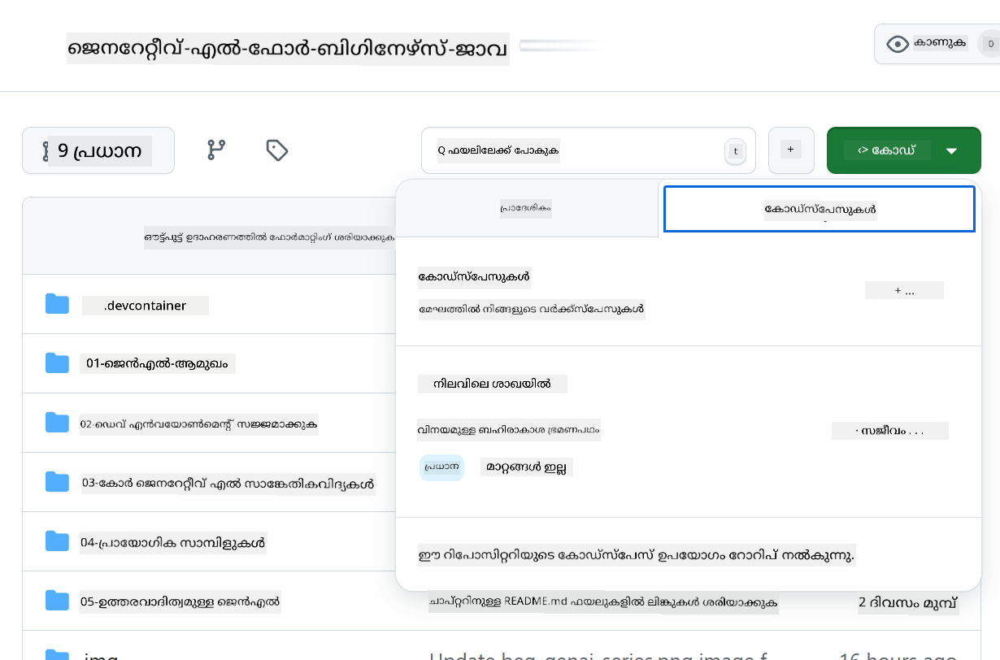
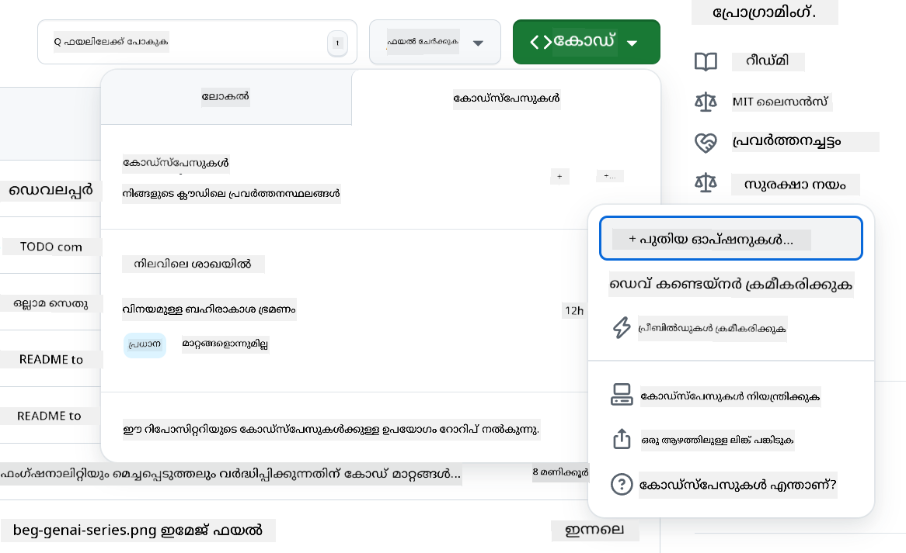
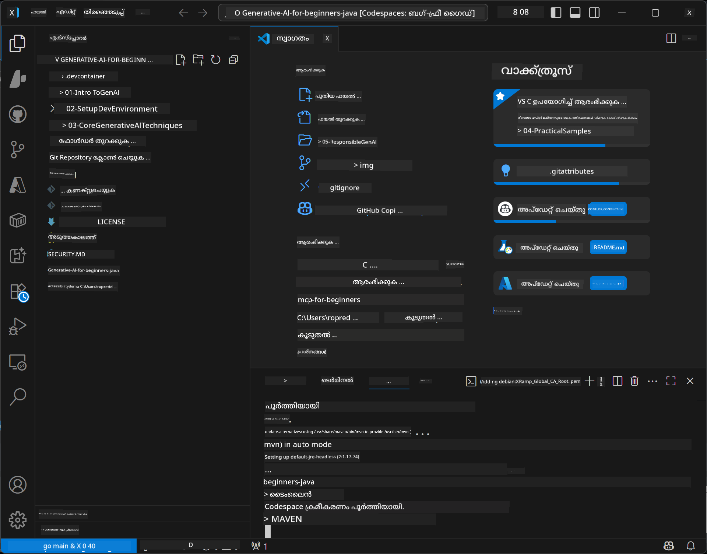

<!--
CO_OP_TRANSLATOR_METADATA:
{
  "original_hash": "4bdff5070d182c64143dfe5a581d0ec7",
  "translation_date": "2025-12-01T09:34:32+00:00",
  "source_file": "02-SetupDevEnvironment/README.md",
  "language_code": "ml"
}
-->
# ജാവയ്ക്കുള്ള ജനറേറ്റീവ് AI വികസന പരിസ്ഥിതി സജ്ജമാക്കൽ

> **ക്വിക്ക് സ്റ്റാർട്ട്**: ക്ലൗഡിൽ 2 മിനിറ്റിൽ കോഡ് ചെയ്യുക - [GitHub Codespaces Setup](../../../02-SetupDevEnvironment) എന്ന ഭാഗത്തേക്ക് ചാടുക - പ്രാദേശിക ഇൻസ്റ്റലേഷൻ ആവശ്യമില്ല, GitHub മോഡലുകൾ ഉപയോഗിക്കുന്നു!

> **Azure OpenAI-ൽ താൽപ്പര്യമുണ്ടോ?**, പുതിയ Azure OpenAI റിസോഴ്സ് സൃഷ്ടിക്കുന്നതിനുള്ള ഘട്ടങ്ങൾക്കായി [Azure OpenAI Setup Guide](getting-started-azure-openai.md) കാണുക.

## നിങ്ങൾ പഠിക്കുന്നതെന്താണ്

- AI ആപ്ലിക്കേഷനുകൾക്കായി ഒരു ജാവ വികസന പരിസ്ഥിതി സജ്ജമാക്കുക
- നിങ്ങളുടെ ഇഷ്ടാനുസൃത വികസന പരിസ്ഥിതി തിരഞ്ഞെടുക്കുക, ക്രമീകരിക്കുക (Codespaces ഉപയോഗിച്ച് ക്ലൗഡ്-ഫസ്റ്റ്, പ്രാദേശിക ഡെവ് കണ്ടെയ്നർ, അല്ലെങ്കിൽ പൂർണ്ണ പ്രാദേശിക സജ്ജീകരണം)
- GitHub മോഡലുകളുമായി ബന്ധപ്പെടുന്നതിലൂടെ നിങ്ങളുടെ സജ്ജീകരണം പരീക്ഷിക്കുക

## ഉള്ളടക്ക പട്ടിക

- [നിങ്ങൾ പഠിക്കുന്നതെന്താണ്](../../../02-SetupDevEnvironment)
- [പരിചയം](../../../02-SetupDevEnvironment)
- [ഘട്ടം 1: നിങ്ങളുടെ വികസന പരിസ്ഥിതി സജ്ജമാക്കുക](../../../02-SetupDevEnvironment)
  - [ഓപ്ഷൻ A: GitHub Codespaces (ശുപാർശ ചെയ്യുന്നു)](../../../02-SetupDevEnvironment)
  - [ഓപ്ഷൻ B: പ്രാദേശിക ഡെവ് കണ്ടെയ്നർ](../../../02-SetupDevEnvironment)
  - [ഓപ്ഷൻ C: നിങ്ങളുടെ നിലവിലെ പ്രാദേശിക ഇൻസ്റ്റലേഷൻ ഉപയോഗിക്കുക](../../../02-SetupDevEnvironment)
- [ഘട്ടം 2: GitHub Personal Access Token സൃഷ്ടിക്കുക](../../../02-SetupDevEnvironment)
- [ഘട്ടം 3: നിങ്ങളുടെ സജ്ജീകരണം പരീക്ഷിക്കുക](../../../02-SetupDevEnvironment)
- [പ്രശ്നപരിഹാരം](../../../02-SetupDevEnvironment)
- [സംഗ്രഹം](../../../02-SetupDevEnvironment)
- [അടുത്ത ഘട്ടങ്ങൾ](../../../02-SetupDevEnvironment)

## പരിചയം

ഈ അധ്യായം ഒരു വികസന പരിസ്ഥിതി സജ്ജമാക്കുന്നതിലൂടെ നിങ്ങളെ നയിക്കും. **GitHub മോഡലുകൾ** പ്രധാന ഉദാഹരണമായി ഉപയോഗിക്കും, കാരണം ഇത് സൗജന്യമാണ്, GitHub അക്കൗണ്ട് ഉപയോഗിച്ച് എളുപ്പത്തിൽ സജ്ജമാക്കാം, ക്രെഡിറ്റ് കാർഡ് ആവശ്യമില്ല, പരീക്ഷണത്തിനായി നിരവധി മോഡലുകൾ ലഭ്യമാണ്.

**പ്രാദേശിക സജ്ജീകരണം ആവശ്യമില്ല!** GitHub Codespaces ഉപയോഗിച്ച് നിങ്ങളുടെ ബ്രൗസറിൽ ഒരു പൂർണ്ണ വികസന പരിസ്ഥിതി ലഭ്യമാക്കി ഉടൻ കോഡിംഗ് ആരംഭിക്കാം.


ഈ കോഴ്സിനായി [**GitHub മോഡലുകൾ**](https://github.com/marketplace?type=models) ഉപയോഗിക്കാൻ ഞങ്ങൾ ശുപാർശ ചെയ്യുന്നു, കാരണം:
- **സൗജന്യമായി** ആരംഭിക്കാം
- **എളുപ്പത്തിൽ** GitHub അക്കൗണ്ട് ഉപയോഗിച്ച് സജ്ജമാക്കാം
- **ക്രെഡിറ്റ് കാർഡ്** ആവശ്യമില്ല
- **നിരവധി മോഡലുകൾ** പരീക്ഷണത്തിനായി ലഭ്യമാണ്

> **കുറിപ്പ്**: ഈ പരിശീലനത്തിൽ ഉപയോഗിക്കുന്ന GitHub മോഡലുകൾക്ക് ഈ സൗജന്യ പരിധികളുണ്ട്:
> - മിനിറ്റിൽ 15 അഭ്യർത്ഥനകൾ (ദിവസത്തിൽ 150)
> - ~8,000 വാക്കുകൾ ഇൻപുട്ട്, ~4,000 വാക്കുകൾ ഔട്ട്പുട്ട് ഓരോ അഭ്യർത്ഥനയിലും
> - 5 സമകാലിക അഭ്യർത്ഥനകൾ
> 
> ഉത്പാദന ഉപയോഗത്തിനായി, നിങ്ങളുടെ Azure അക്കൗണ്ടുമായി Azure AI Foundry മോഡലുകൾ അപ്ഗ്രേഡ് ചെയ്യുക. നിങ്ങളുടെ കോഡ് മാറ്റേണ്ടതില്ല. [Azure AI Foundry ഡോക്യുമെന്റേഷൻ](https://learn.microsoft.com/azure/ai-foundry/foundry-models/how-to/quickstart-github-models) കാണുക.

## ഘട്ടം 1: നിങ്ങളുടെ വികസന പരിസ്ഥിതി സജ്ജമാക്കുക

<a name="quick-start-cloud"></a>

ഈ Generative AI for Java കോഴ്സിനായി ആവശ്യമായ എല്ലാ ഉപകരണങ്ങളും ഉൾക്കൊള്ളുന്ന ഒരു മുൻകൂട്ടി ക്രമീകരിച്ച വികസന കണ്ടെയ്നർ ഞങ്ങൾ സൃഷ്ടിച്ചിട്ടുണ്ട്. നിങ്ങളുടെ ഇഷ്ടാനുസൃത വികസന സമീപനം തിരഞ്ഞെടുക്കുക:

### പരിസ്ഥിതി സജ്ജീകരണ ഓപ്ഷനുകൾ:

#### ഓപ്ഷൻ A: GitHub Codespaces (ശുപാർശ ചെയ്യുന്നു)

**2 മിനിറ്റിൽ കോഡിംഗ് ആരംഭിക്കുക - പ്രാദേശിക സജ്ജീകരണം ആവശ്യമില്ല!**

1. ഈ റിപോസിറ്ററി നിങ്ങളുടെ GitHub അക്കൗണ്ടിലേക്ക് Fork ചെയ്യുക
   > **കുറിപ്പ്**: അടിസ്ഥാന കോൺഫിഗറേഷൻ എഡിറ്റ് ചെയ്യാൻ ആഗ്രഹിക്കുന്നുവെങ്കിൽ [Dev Container Configuration](../../../.devcontainer/devcontainer.json) കാണുക
2. **Code** → **Codespaces** tab → **...** → **New with options...** ക്ലിക്ക് ചെയ്യുക
3. ഡീഫോൾട്ടുകൾ ഉപയോഗിക്കുക – ഇത് **Generative AI Java Development Environment** എന്ന കസ്റ്റം ഡെവ് കണ്ടെയ്നർ തിരഞ്ഞെടുക്കും
4. **Create codespace** ക്ലിക്ക് ചെയ്യുക
5. പരിസ്ഥിതി സജ്ജമാകാൻ ~2 മിനിറ്റ് കാത്തിരിക്കുക
6. [Step 2: Create GitHub Token](../../../02-SetupDevEnvironment) ഭാഗത്തേക്ക് മുന്നോട്ട് പോകുക






> **Codespaces-ന്റെ ഗുണങ്ങൾ**:
> - പ്രാദേശിക ഇൻസ്റ്റലേഷൻ ആവശ്യമില്ല
> - ബ്രൗസർ ഉള്ള ഏതെങ്കിലും ഉപകരണത്തിൽ പ്രവർത്തിക്കുന്നു
> - എല്ലാ ഉപകരണങ്ങളും ആശ്രിതങ്ങളും മുൻകൂട്ടി ക്രമീകരിച്ചിരിക്കുന്നു
> - വ്യക്തിഗത അക്കൗണ്ടുകൾക്ക് സൗജന്യമായി 60 മണിക്കൂർ
> - എല്ലാ പഠിതാക്കൾക്കും സ്ഥിരമായ പരിസ്ഥിതി

#### ഓപ്ഷൻ B: പ്രാദേശിക ഡെവ് കണ്ടെയ്നർ

**Docker ഉപയോഗിച്ച് പ്രാദേശിക വികസനം ഇഷ്ടപ്പെടുന്ന ഡെവലപ്പർമാർക്കായി**

1. ഈ റിപോസിറ്ററി നിങ്ങളുടെ പ്രാദേശിക മെഷീനിലേക്ക് Fork ചെയ്ത് Clone ചെയ്യുക
   > **കുറിപ്പ്**: അടിസ്ഥാന കോൺഫിഗറേഷൻ എഡിറ്റ് ചെയ്യാൻ [Dev Container Configuration](../../../.devcontainer/devcontainer.json) കാണുക
2. [Docker Desktop](https://www.docker.com/products/docker-desktop/)യും [VS Code](https://code.visualstudio.com/)യും ഇൻസ്റ്റാൾ ചെയ്യുക
3. VS Code-ൽ [Dev Containers extension](https://marketplace.visualstudio.com/items?itemName=ms-vscode-remote.remote-containers) ഇൻസ്റ്റാൾ ചെയ്യുക
4. റിപോസിറ്ററി ഫോൾഡർ VS Code-ൽ തുറക്കുക
5. **Reopen in Container** ക്ലിക്ക് ചെയ്യുക (അല്ലെങ്കിൽ `Ctrl+Shift+P` → "Dev Containers: Reopen in Container" ഉപയോഗിക്കുക)
6. കണ്ടെയ്നർ നിർമ്മിച്ച് ആരംഭിക്കാൻ കാത്തിരിക്കുക
7. [Step 2: Create GitHub Token](../../../02-SetupDevEnvironment) ഭാഗത്തേക്ക് മുന്നോട്ട് പോകുക


#### ഓപ്ഷൻ C: നിങ്ങളുടെ നിലവിലെ പ്രാദേശിക ഇൻസ്റ്റലേഷൻ ഉപയോഗിക്കുക

**നിലവിലെ ജാവ പരിസ്ഥിതികൾ ഉള്ള ഡെവലപ്പർമാർക്കായി**

ആവശ്യകതകൾ:
- [Java 21+](https://www.oracle.com/java/technologies/javase/jdk21-archive-downloads.html) 
- [Maven 3.9+](https://maven.apache.org/download.cgi)
- [VS Code](https://code.visualstudio.com) അല്ലെങ്കിൽ നിങ്ങളുടെ ഇഷ്ടാനുസൃത IDE

ഘട്ടങ്ങൾ:
1. ഈ റിപോസിറ്ററി നിങ്ങളുടെ പ്രാദേശിക മെഷീനിലേക്ക് Clone ചെയ്യുക
2. നിങ്ങളുടെ IDE-ൽ പ്രോജക്റ്റ് തുറക്കുക
3. [Step 2: Create GitHub Token](../../../02-SetupDevEnvironment) ഭാഗത്തേക്ക് മുന്നോട്ട് പോകുക

> **പ്രൊ ടിപ്പ്**: നിങ്ങളുടെ മെഷീൻ കുറഞ്ഞ സ്പെക്കുകൾ ഉള്ളതാണെങ്കിൽ, GitHub Codespaces ഉപയോഗിച്ച് പ്രാദേശിക VS Code ഉപയോഗിക്കുക! ക്ലൗഡ്-ഹോസ്റ്റുചെയ്ത Codespace-നെ പ്രാദേശിക VS Code-യുമായി ബന്ധിപ്പിച്ച് ഇരുവരുടെയും മികച്ച അനുഭവം നേടുക.



## ഘട്ടം 2: GitHub Personal Access Token സൃഷ്ടിക്കുക

1. [GitHub Settings](https://github.com/settings/profile) ഭാഗത്തേക്ക് പോകുക, നിങ്ങളുടെ പ്രൊഫൈൽ മെനുവിൽ നിന്ന് **Settings** തിരഞ്ഞെടുക്കുക.
2. ഇടത് സൈഡ്ബാറിൽ **Developer settings** (സാധാരണയായി താഴെ) ക്ലിക്ക് ചെയ്യുക.
3. **Personal access tokens** വിഭാഗത്തിൽ **Fine-grained tokens** ക്ലിക്ക് ചെയ്യുക (അല്ലെങ്കിൽ ഈ [ലിങ്ക്](https://github.com/settings/personal-access-tokens) പിന്തുടരുക).
4. **Generate new token** ക്ലിക്ക് ചെയ്യുക.
5. "Token name" എന്നതിൽ ഒരു വിവരണാത്മകമായ പേര് നൽകുക (ഉദാ., `GenAI-Java-Course-Token`).
6. കാലാവധി തീയതി സജ്ജമാക്കുക (സുരക്ഷാ മികച്ച രീതികൾക്കായി: 7 ദിവസം ശുപാർശ ചെയ്യുന്നു).
7. "Resource owner" എന്നതിൽ നിങ്ങളുടെ ഉപയോക്തൃ അക്കൗണ്ട് തിരഞ്ഞെടുക്കുക.
8. "Repository access" എന്നതിൽ GitHub മോഡലുകൾ ഉപയോഗിക്കാൻ നിങ്ങൾ ആഗ്രഹിക്കുന്ന റിപോസിറ്ററികൾ തിരഞ്ഞെടുക്കുക (അല്ലെങ്കിൽ "All repositories" ആവശ്യമെങ്കിൽ).
9. "Account permissions" എന്നതിൽ **Models** കണ്ടെത്തി **Read-only** ആയി സജ്ജമാക്കുക.
10. **Generate token** ക്ലിക്ക് ചെയ്യുക.
11. **നിങ്ങളുടെ ടോക്കൺ ഇപ്പോൾ കോപ്പി ചെയ്ത് സംരക്ഷിക്കുക** – ഇത് വീണ്ടും കാണാൻ കഴിയില്ല!

> **സുരക്ഷാ ടിപ്പ്**: നിങ്ങളുടെ ആക്സസ് ടോക്കണുകൾക്കായി ആവശ്യമായ കുറഞ്ഞ സ്കോപ്പ്, ഏറ്റവും കുറഞ്ഞ പ്രായോഗിക കാലാവധി ഉപയോഗിക്കുക.

## ഘട്ടം 3: GitHub മോഡലുകളുടെ ഉദാഹരണത്തോടെ നിങ്ങളുടെ സജ്ജീകരണം പരീക്ഷിക്കുക

നിങ്ങളുടെ വികസന പരിസ്ഥിതി സജ്ജമായ ശേഷം, [`02-SetupDevEnvironment/examples/github-models`](../../../02-SetupDevEnvironment/examples/github-models) എന്ന ഭാഗത്തെ GitHub മോഡലുകളുടെ സംയോജനം പരീക്ഷിക്കാം.

1. നിങ്ങളുടെ വികസന പരിസ്ഥിതിയിലെ ടെർമിനൽ തുറക്കുക.
2. GitHub മോഡലുകളുടെ ഉദാഹരണത്തിലേക്ക് പോകുക:
   ```bash
   cd 02-SetupDevEnvironment/examples/github-models
   ```
3. നിങ്ങളുടെ GitHub ടോക്കൺ ഒരു പരിസ്ഥിതി ചാരമായി സജ്ജമാക്കുക:
   ```bash
   # മാക്‌ഒഎസ്/ലിനക്സ്
   export GITHUB_TOKEN=your_token_here
   
   # വിൻഡോസ് (കമാൻഡ് പ്രോംപ്റ്റ്)
   set GITHUB_TOKEN=your_token_here
   
   # വിൻഡോസ് (പവർഷെൽ)
   $env:GITHUB_TOKEN="your_token_here"
   ```

4. ആപ്ലിക്കേഷൻ പ്രവർത്തിപ്പിക്കുക:
   ```bash
   mvn compile exec:java -Dexec.mainClass="com.example.githubmodels.App"
   ```

നിങ്ങൾക്ക് ഇതിന് സമാനമായ ഔട്ട്പുട്ട് കാണാൻ കഴിയും:
```text
Using model: gpt-4.1-nano
Sending request to GitHub Models...
Response: Hello World!
```

### ഉദാഹരണ കോഡ് മനസ്സിലാക്കുക

ആദ്യം, നിങ്ങൾ എന്താണ് പ്രവർത്തിപ്പിച്ചതെന്ന് മനസ്സിലാക്കാം. `examples/github-models` എന്ന ഭാഗത്തെ ഉദാഹരണം OpenAI Java SDK ഉപയോഗിച്ച് GitHub മോഡലുകളുമായി ബന്ധപ്പെടുന്നു:

**ഈ കോഡ് എന്താണ് ചെയ്യുന്നത്:**
- **GitHub മോഡലുകളുമായി** നിങ്ങളുടെ Personal Access Token ഉപയോഗിച്ച് ബന്ധപ്പെടുന്നു
- AI മോഡലിലേക്ക് "Say Hello World!" എന്ന ഒരു ലളിതമായ സന്ദേശം **അയയ്ക്കുന്നു**
- AI-യുടെ പ്രതികരണം **സ്വീകരിച്ച്** പ്രദർശിപ്പിക്കുന്നു
- നിങ്ങളുടെ സജ്ജീകരണം ശരിയായി പ്രവർത്തിക്കുന്നുണ്ടെന്ന് **സാധൂകരിക്കുന്നു**

**പ്രധാന ആശ്രിതം** (`pom.xml`):
```xml
<dependency>
    <groupId>com.openai</groupId>
    <artifactId>openai-java</artifactId>
    <version>2.12.0</version>
</dependency>
```

**പ്രധാന കോഡ്** (`App.java`):
```java
// OpenAI Java SDK ഉപയോഗിച്ച് GitHub മോഡലുകളുമായി ബന്ധപ്പെടുക
OpenAIClient client = OpenAIOkHttpClient.builder()
    .apiKey(pat)
    .baseUrl("https://models.inference.ai.azure.com")
    .build();

// ചാറ്റ് പൂർത്തീകരണ അഭ്യർത്ഥന സൃഷ്ടിക്കുക
ChatCompletionCreateParams params = ChatCompletionCreateParams.builder()
    .model(modelId)
    .addSystemMessage("You are a concise assistant.")
    .addUserMessage("Say Hello World!")
    .build();

// AI പ്രതികരണം നേടുക
ChatCompletion response = client.chat().completions().create(params);
System.out.println("Response: " + response.choices().get(0).message().content().orElse("No response content"));
```

## സംഗ്രഹം

ശ്രേമിച്ച്! നിങ്ങൾ ഇപ്പോൾ എല്ലാം സജ്ജമാക്കിയിരിക്കുന്നു:

- AI മോഡൽ ആക്സസിനായി ശരിയായ അനുമതികളുള്ള GitHub Personal Access Token സൃഷ്ടിച്ചു
- നിങ്ങളുടെ ജാവ വികസന പരിസ്ഥിതി പ്രവർത്തനക്ഷമമാക്കി (Codespaces, ഡെവ് കണ്ടെയ്നറുകൾ, അല്ലെങ്കിൽ പ്രാദേശിക)
- GitHub മോഡലുകളുമായി OpenAI Java SDK ഉപയോഗിച്ച് സൗജന്യ AI വികസനത്തിനായി ബന്ധപ്പെട്ടു
- AI മോഡലുകളുമായി സംസാരിക്കുന്ന ലളിതമായ ഉദാഹരണത്തോടെ എല്ലാം പ്രവർത്തിക്കുന്നുണ്ടെന്ന് പരീക്ഷിച്ചു

## അടുത്ത ഘട്ടങ്ങൾ

[Chapter 3: Core Generative AI Techniques](../03-CoreGenerativeAITechniques/README.md)

## പ്രശ്നപരിഹാരം

പ്രശ്നങ്ങൾ ഉണ്ടോ? ഇവിടെ സാധാരണ പ്രശ്നങ്ങളും പരിഹാരങ്ങളും:

- **ടോക്കൺ പ്രവർത്തിക്കുന്നില്ല?** 
  - നിങ്ങൾ മുഴുവൻ ടോക്കൺ കോപ്പി ചെയ്തിട്ടുണ്ടെന്ന് ഉറപ്പാക്കുക, അധിക സ്പേസുകൾ ഇല്ലാതെ
  - ടോക്കൺ ശരിയായി പരിസ്ഥിതി ചാരമായി സജ്ജമാക്കിയിട്ടുണ്ടെന്ന് സ്ഥിരീകരിക്കുക
  - നിങ്ങളുടെ ടോക്കണിന് ശരിയായ അനുമതികളുണ്ടെന്ന് (Models: Read and write) പരിശോധിക്കുക

- **Maven കണ്ടെത്തുന്നില്ല?** 
  - ഡെവ് കണ്ടെയ്നറുകൾ/Codespaces ഉപയോഗിക്കുന്നുവെങ്കിൽ, Maven മുൻകൂട്ടി ഇൻസ്റ്റാൾ ചെയ്തിരിക്കണം
  - പ്രാദേശിക സജ്ജീകരണത്തിനായി, Java 21+യും Maven 3.9+യും ഇൻസ്റ്റാൾ ചെയ്തിട്ടുണ്ടെന്ന് ഉറപ്പാക്കുക
  - ഇൻസ്റ്റലേഷൻ സ്ഥിരീകരിക്കാൻ `mvn --version` പരീക്ഷിക്കുക

- **ബന്ധം പ്രശ്നങ്ങൾ?** 
  - നിങ്ങളുടെ ഇന്റർനെറ്റ് കണക്ഷൻ പരിശോധിക്കുക
  - GitHub നിങ്ങളുടെ നെറ്റ്വർക്കിൽ നിന്ന് ആക്സസ് ചെയ്യാൻ കഴിയുന്നുണ്ടെന്ന് ഉറപ്പാക്കുക
  - GitHub മോഡലുകളുടെ എൻഡ്പോയിന്റ് ബ്ലോക്ക് ചെയ്യുന്ന ഫയർവാളിന്റെ പിന്നിൽ നിങ്ങൾ ഇല്ലെന്ന് ഉറപ്പാക്കുക

- **ഡെവ് കണ്ടെയ്നർ ആരംഭിക്കുന്നില്ല?** 
  - Docker Desktop പ്രവർത്തിക്കുന്നുണ്ടെന്ന് ഉറപ്പാക്കുക (പ്രാദേശിക വികസനത്തിനായി)
  - കണ്ടെയ്നർ പുനർനിർമ്മിക്കാൻ ശ്രമിക്കുക: `Ctrl+Shift+P` → "Dev Containers: Rebuild Container"

- **ആപ്ലിക്കേഷൻ കംപൈലേഷൻ പിഴവുകൾ?**
  - നിങ്ങൾ ശരിയായ ഡയറക്ടറിയിൽ ഉണ്ടെന്ന് ഉറപ്പാക്കുക: `02-SetupDevEnvironment/examples/github-models`
  - ക്ലീൻ ചെയ്ത് പുനർനിർമ്മിക്കാൻ ശ്രമിക്കുക: `mvn clean compile`

> **സഹായം ആവശ്യമുണ്ടോ?**: ഇപ്പോഴും പ്രശ്നങ്ങൾ ഉണ്ടോ? റിപോസിറ്ററിയിൽ ഒരു ഇഷ്യൂ തുറക്കുക, ഞങ്ങൾ നിങ്ങളെ സഹായിക്കും.

---

<!-- CO-OP TRANSLATOR DISCLAIMER START -->
**അറിയിപ്പ്**:  
ഈ രേഖ AI വിവർത്തന സേവനമായ [Co-op Translator](https://github.com/Azure/co-op-translator) ഉപയോഗിച്ച് വിവർത്തനം ചെയ്തതാണ്. ഞങ്ങൾ കൃത്യതയ്ക്കായി ശ്രമിക്കുന്നുവെങ്കിലും, ഓട്ടോമേറ്റഡ് വിവർത്തനങ്ങളിൽ പിഴവുകൾ അല്ലെങ്കിൽ തെറ്റായ വിവരങ്ങൾ ഉണ്ടാകാൻ സാധ്യതയുണ്ട്. അതിന്റെ സ്വഭാവ ഭാഷയിലുള്ള അസൽ രേഖയാണ് പ്രാമാണികമായ ഉറവിടമായി പരിഗണിക്കേണ്ടത്. നിർണായകമായ വിവരങ്ങൾക്ക്, പ്രൊഫഷണൽ മനുഷ്യ വിവർത്തനം ശുപാർശ ചെയ്യുന്നു. ഈ വിവർത്തനം ഉപയോഗിച്ച് ഉണ്ടാകുന്ന തെറ്റിദ്ധാരണകൾ അല്ലെങ്കിൽ തെറ്റായ വ്യാഖ്യാനങ്ങൾക്കായി ഞങ്ങൾ ഉത്തരവാദികളല്ല.
<!-- CO-OP TRANSLATOR DISCLAIMER END -->