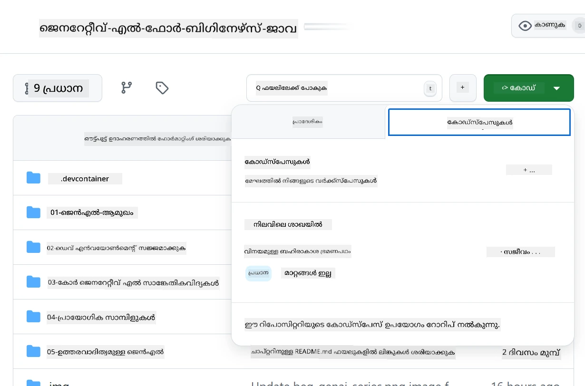
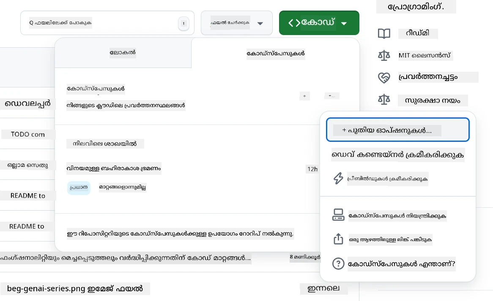
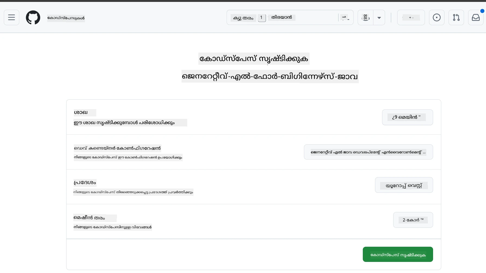
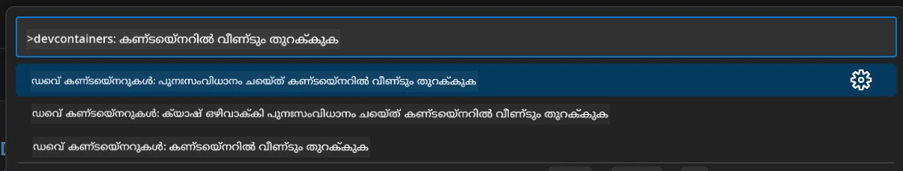
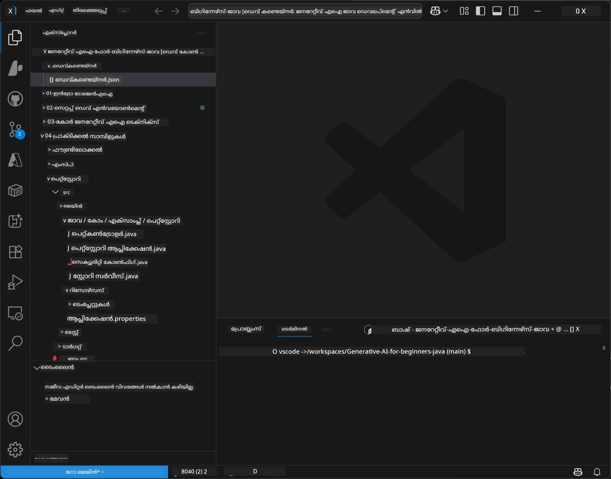
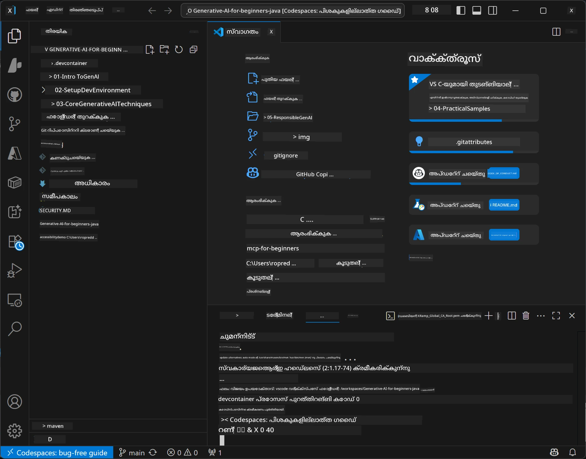

<!--
CO_OP_TRANSLATOR_METADATA:
{
  "original_hash": "96a30d42b9751a3d4e4b20e28d29d459",
  "translation_date": "2026-01-28T05:39:07+00:00",
  "source_file": "02-SetupDevEnvironment/README.md",
  "language_code": "ml"
}
-->
# ജാവയ്ക്കായുള്ള ജനറേറ്റീവ് എഐ വികസന പരിസ്ഥിതി സജ്ജമാക്കൽ

> **ത്വരിതാരംഭം**: 2 മിനിറ്റിനുള്ളിൽ ക്ലൗഡിൽ കോഡ് ചെയ്യാം - [GitHub Codespaces സെറ്റപ്പ്](../../../02-SetupDevEnvironment) എന്നതിലേക്ക് ഓടുക - ലൊക്കൽ ഇൻസ്റ്റാളേഷൻ ആവശ്യമില്ല, github മോഡലുകൾ ഉപയോഗിക്കുന്നു!

> **Azure OpenAI-ൽ താൽപര്യമുണ്ടോ?**, പുതിയ Azure OpenAI റിസോഴ്‌സ് സൃഷ്‌ടിക്കുന്ന കാര്യങ്ങൾ അടങ്ങിയ [Azure OpenAI സെറ്റപ്പ് ഗൈഡ്](getting-started-azure-openai.md) കാണുക.

## നിങ്ങൾക്ക് എന്നെക്കുറിച്ച് പഠിക്കാനാകുന്നത്

- എഐ ആപ്ലിക്കേഷനുകൾക്കായി ജാവ ഡെവലപ്പ്മെന്റ് എൻവയോൺമെന്റ് സജ്ജമാക്കുക
- നിങ്ങളുടെ ഇഷ്ടാനുസൃത ഡെവലപ്പ്മെന്റ് പരിസ്ഥിതിയെ തെരഞ്ഞെടുത്തു കോൺഫിഗർ ചെയ്യുക (Codespaces ഉപയോഗിച്ച് ക്ലൗഡ്-ഫസ്റ്റ്, ലോക്കൽ ഡെവ് കണ്ടെയ്‌നർ, അല്ലെങ്കിൽ പൂർണ്ണ ലോക്കൽ സെറ്റപ്പ്)
- GitHub മോഡലുകളുമായി എളുപ്പത്തിൽ കണക്ട് ചെയ്ത് നിങ്ങളുടെ സെറ്റപ്പ് പരീക്ഷിക്കുക

## ഉള്ളടക്ക പട്ടിക

- [നിങ്ങൾക്ക് പഠിക്കാനാകുന്നത്](../../../02-SetupDevEnvironment)
- [പരിചയം](../../../02-SetupDevEnvironment)
- [പടി 1: നിങ്ങളുടെ ഡെവലപ്പ്മെന്റ് എൻവയോൺമെന്റ് സജ്ജമാക്കുക](../../../02-SetupDevEnvironment)
  - [ഓപ്ഷൻ A: GitHub Codespaces (ശുപാർശ ചെയ്‌തത്)](../../../02-SetupDevEnvironment)
  - [ഓപ്ഷൻ B: ലോക്കൽ ഡെവ് കണ്ടെയ്‌നർ](../../../02-SetupDevEnvironment)
  - [ഓപ്ഷൻ C: നിങ്ങളുടെ നിലവിലുള്ള ലോക്കൽ ഇൻസ്റ്റാളേഷൻ ഉപയോഗിക്കുക](../../../02-SetupDevEnvironment)
- [പടി 2: GitHub പേഴ്‌സണൽ ആക്സസ് ടോക്കൺ സൃഷ്‌ടിക്കുക](../../../02-SetupDevEnvironment)
- [പടി 3: GitHub മോഡലുകളുടെ ഉദാഹരണത്തോടെ നിങ്ങളുടെ സെറ്റപ്പ് പരീക്ഷിക്കുക](../../../02-SetupDevEnvironment)
- [സമസ്യാനിവാരണങ്ങൾ](../../../02-SetupDevEnvironment)
- [സംഗ്രഹം](../../../02-SetupDevEnvironment)
- [അടുത്ത ഘട്ടങ്ങൾ](../../../02-SetupDevEnvironment)

## പരിചയം

ഈ അധ്യായം വികസന പരിസ്ഥിതിയുടെ സജ്ജീകരണത്തിൽ നിങ്ങൾക്ക് വഴികാട്ടിയാണ്. ഞങ്ങൾ പ്രാഥമിക ഉദാഹരണമായി **GitHub Models** ഉപയോഗിക്കാം കാരണം ഇത് സൗജന്യമാണ്, ലളിതമായി GitHub അക്കൗണ്ട് മാത്രം ഉപയോഗിച്ച് സജ്ജമാക്കാം, ക്രെഡിറ്റ് കാർഡ് ആവശ്യമില്ല, പരീക്ഷണങ്ങൾക്ക് പല മോഡലുകളിലേക്കും ആക്സസ് നൽകുന്നു.

**ലോക്കൽ സെറ്റപ്പ് ആവശ്യമില്ല!** GitHub Codespaces ഉപയോഗിച്ച് നിങ്ങളെത്തന്നെ ബ്രൗസറില്‍ പൂർണ്ണ ഡെവലപ്പ്മെന്റ് എൻവയോൺമെന്റ് ഉപയോഗിച്ച് കോഡിങ് ഉടൻ തന്നെ ആരംഭിക്കാം.


ഈ കോഴ്‌സിനായി [**GitHub Models**](https://github.com/marketplace?type=models) ഉപയോഗിക്കാൻ ഞങ്ങൾ ശുപാർശ ചെയ്യുന്നു കാരണം ഇത്:  
- **സൗജന്യം** ആരംഭിക്കാൻ    
- **വളരെ ലളിതം** GitHub അക്കൗണ്ട് മാത്രം കൊണ്ട് സജ്ജീകരിക്കാൻ  
- **ക്രെഡിറ്റ് കാർഡ് ആവശ്യമില്ല**  
- **പല മോഡലുകൾ** പരീക്ഷണങ്ങൾക്ക് ലഭ്യമാണ്  

> **ഗమనിക്കുക**: ഈ പരിശീലനത്തിൽ ഉപയോഗിക്കുന്ന GitHub മോഡലുകൾക്ക് താഴെപ്പറഞ്ഞ സൗജന്യ പരിമിതികൾ ഉണ്ട്:  
> - മിനിറ്റിനു 15 അഭ്യർത്ഥനകൾ (ദിവസത്തിൽ 150)  
> - ഏക അഭ്യർത്ഥനയ്ക്ക് ഏകദേശം 8,000 വാക്ക് ഇൻപുട്ട്, 4,000 വാക്ക് ഔട്ട്പുട്ട്  
> - 5 സമാന്തര അഭ്യർത്ഥനകൾ  
>  
> പ്രോഡക്ഷൻ ഉപയോഗത്തിനായി, Azure അക്കൗണ്ടും ഉപയോഗിച്ച് Azure AI Foundry മോഡലിലേക്ക് അപ്ഗ്രേഡ് ചെയ്യാം. നിങ്ങളുടെ കോഡ് മാറ്റേണ്ടതില്ല. [Azure AI Foundry ഡോക്യുമെന്റേഷൻ](https://learn.microsoft.com/azure/ai-foundry/foundry-models/how-to/quickstart-github-models) കാണുക.

## പടി 1: നിങ്ങളുടെ ഡെവലപ്പ്മെന്റ് എൻവയോൺമെന്റ് സജ്ജമാക്കുക

<a name="quick-start-cloud"></a>

ഈ ജനറേറ്റീവ് എഐ ജാവ കോഴ്‌സിനായി ആവശ്യമായ എല്ലാ ടൂൾസും ഉൾപ്പെടുത്തിയ ഒരു മുമ്പ് കോൺഫിഗർ ചെയ്ത ഡെവ് കണ്ടെയ്‌നർ ഞങ്ങൾ സൃഷ്‌ടിച്ചു. നിങ്ങളുടെ ഇഷ്ടാനുസൃത ഡെവലപ്പ്മെന്റ് രീതിയെ തിരഞ്ഞെടുക്കാം:

### പരിസ്ഥിതി സജ്ജീകരണ ഓപ്ഷനുകൾ:

#### ഓപ്ഷൻ A: GitHub Codespaces (ശുപാർശ ചെയ്യുന്നത്)

**2 മിനിറ്റിനുള്ളിൽ കോഡിങ് തുടങ്ങാം - ലോക്കൽ സെറ്റ് അപ് വേണ്ട!**

1. ഈ റിപ്പോസിറ്ററി നിങ്ങളുടെ GitHub അക്കൗണ്ടിലേക്ക് ഫോർക്ക് ചെയ്യുക  
   > **ഗమనിച്ച്**: അടിസ്ഥാന കോൺഫിഗറేషన్ എഡിറ്റ് ചെയ്യേണ്ടുവെങ്കിൽ [Dev Container Configuration](../../../.devcontainer/devcontainer.json) കാണുക  
2. **Code** → **Codespaces** ടാബ് → **...** → **New with options...** ക്ലിക്ക് ചെയ്യുക  
3. ഡിഫോൾട്ടുകൾ ഉപയോഗിക്കുക – ഇത് ഈ കോഴ്‌സിനായി കസ്റ്റം സൃഷ്‌ടിച്ച **Generative AI Java Development Environment** ഡെവ് കണ്ടെയ്‌നർ കോൺഫിഗറേഷൻ തിരഞ്ഞെടുക്കും  
4. **Create codespace** ക്ലിക്ക് ചെയ്യുക  
5. ഏകദേശം 2 മിനിറ്റ് പരിസ്ഥിതി തയാറാക്കുക എത്താൻ കാത്തിരിക്കുക  
6. [പടി 2: GitHub ടോക്കൺ സൃഷ്‌ടിക്കുക](../../../02-SetupDevEnvironment) ലേക്ക് മുന്നോട്ട്  







> **Codespaces-ന്റെ ഗുണങ്ങൾ**:  
> - ലോക്കൽ ഇൻസ്റ്റാളേഷൻ ആവശ്യമില്ല  
> - ഏതേതെങ്കിലും ബ്രൗസർ ഉള്ള ഉപകരണത്തിൽ പ്രവർത്തിക്കും  
> - എല്ലാ ടൂൾസും ഡിപ്പെൻഡൻസികളും മുൻകൂട്ടി കോൺഫിഗർ ചെയ്തിരിക്കുന്നു  
> - വ്യക്തിഗത അക്കൗണ്ടുകൾക്ക് മാസത്തിലൊരിക്കൽ 60 സൗജന്യ മണിക്കൂറുകൾ  
> - എല്ലാ പഠിതാക്കൾക്കും ഒരുമിച്ചുള്ള സ്ഥിരമായ പരിസ്ഥിതി    

#### ഓപ്ഷൻ B: ലോക്കൽ ഡെവ് കണ്ടെയ്‌നർ

**Docker ഉപയോഗിച്ച് ലോക്കൽ ഡെവലപ്പ്മെന്റ് ഇഷ്ടപ്പെടുന്നവർക്കായി**

1. ഈ റിപ്പോസിറ്ററിയെ നിങ്ങളുടെloko സിസ്റ്റത്തിലേക്ക് ഫോർക്ക് ചെയ്ത് ക്ലോൺ ചെയ്യുക  
   > **ഗമായിക്കൽ**: അടിസ്ഥാന കോൺഫിഗറേഷൻ എഡിറ്റ് ചെയ്യേണ്ടുവെങ്കിൽ [Dev Container Configuration](../../../.devcontainer/devcontainer.json) കാണുക  
2. [Docker Desktop](https://www.docker.com/products/docker-desktop/) ۽ [VS Code](https://code.visualstudio.com/) ഇൻസ്റ്റാൾ ചെയ്യുക  
3. VS Code-ൽ [Dev Containers extension](https://marketplace.visualstudio.com/items?itemName=ms-vscode-remote.remote-containers) ഇൻസ്റ്റാൾ ചെയ്യുക  
4. റിപ്പോസിറ്ററി ഫോൾഡർ VS Code-ൽ തുറക്കുക  
5. പ്രോംപ്റ്റ് ചെയ്യുമ്പോൾ **Reopen in Container** (അല്ലെങ്കിൽ `Ctrl+Shift+P` → "Dev Containers: Reopen in Container") ക്ലിക്ക് ചെയ്യുക  
6. കണ്ടെയ്‌നർ നിർമാണവും സ്റ്റാർട്ടും സജ്ജമാകുന്നത് കാത്തിരിക്കുക  
7. [പടി 2: GitHub ടോക്കൺ സൃഷ്‌ടിക്കുക](../../../02-SetupDevEnvironment) സമ്മർദ്ദിക്കുക  





#### ഓപ്ഷൻ C: നിങ്ങളുടെ നിലവിലുള്ള ലോക്കൽ ഇൻസ്റ്റാളേഷൻ ഉപയോഗിക്കുക

**ഇതുപോലെ ജാവ എൻവയോൺമെന്റ് ഉള്ള ഡെവലപ്പർമാർക്കായി**

ആവശ്യകതകൾ:  
- [Java 21+](https://www.oracle.com/java/technologies/javase/jdk21-archive-downloads.html)  
- [Maven 3.9+](https://maven.apache.org/download.cgi)  
- [VS Code](https://code.visualstudio.com) അല്ലെങ്കിൽ ഇഷ്ടമുള്ള ഐഡിഇ  

സാങ്കേതിക ചുവടുകൾ:  
1. ഈ റിപ്പോസിറ്ററി നിങ്ങളുടെloko സിസ്റ്റത്തിലേക്ക് ക്ലോൺ ചെയ്യുക  
2. പ്രോജക്ട് നിങ്ങളുടെ ഐഡി.ഐൽ തുറക്കുക  
3. [പടി 2: GitHub ടോക്കൺ സൃഷ്‌ടിക്കുക](../../../02-SetupDevEnvironment) ആരംഭിക്കുക  

> **പ്രോ ടിപ്പ്**: കുറഞ്ഞ സ്പെക്കുള്ള മെഷീൻ ഉള്ളതായി നിങ്ങൾക്ക് VS Code ഉപയോഗിക്കാൻ ആഗ്രഹമുണ്ടെങ്കിൽ GitHub Codespaces ഉപയോഗിക്കുക! നിങ്ങളുടെ പ്രാദേശിക VS Code ക്ലൗഡിൽ ഹോസ്റ്റ് ചെയ്ത Codespace-നു കണക്ട് ചെയ്ത് ഇരട്ട ഗുണം നേടാം.  



## പടി 2: GitHub പേഴ്‌സണൽ ആക്സസ് ടോക്കൺ സൃഷ്‌ടിക്കുക

1. [GitHub കൂടിയാലോചനകൾ (Settings)](https://github.com/settings/profile) തുറന്നിട്ട് പ്രൊഫൈൽ മെനുവിൽ നിന്നു **Settings** തിരഞ്ഞെടുക്കുക  
2. ഇടതുവശം പാനലിൽ താഴെ, **Developer settings** ക്ലിക്ക് ചെയ്യുക  
3. **Personal access tokens** കീഴിൽ **Fine-grained tokens** ക്ലിക്ക് ചെയ്യുക (അല്ലെങ്കിൽ [ഒറ്റകാഴ്ച link](https://github.com/settings/personal-access-tokens) പിന്തുടരുക)  
4. **Generate new token** ക്ലിക്ക് ചെയ്യുക  
5. "Token name" എന്നിടത്ത് വിവരണപരമായ പേര് നൽകുക (ഉദാ., `GenAI-Java-Course-Token`)  
6. അവസാനിച്ചത് ഊഹിപ്പിക്കുന്ന തീയതി നൽകുക (7 ദിവസം ഒന്നാംശം ശുപാർശ ചെയ്യുന്നു)  
7. "Resource owner" എന്നിടത്ത് നിങ്ങളുടെ യൂസർ അക്കൗണ്ട് തിരഞ്ഞെടുക്കുക  
8. "Repository access" ന് താഴെ GitHub മോഡലുകളുമായി ഉപയോഗിക്കാൻ ആഗ്രഹിക്കുന്ന റിപ്പോസിറ്ററികൾ തിരഞ്ഞെടുക്കുക ("All repositories" വേണ്ടെങ്കിൽ)  
9. "Account permissions" ൽ **Models** കണ്ടെത്തി അതിനെ **Read-only** ആക്കി സജ്ജമാക്കുക  
10. **Generate token** ക്ലിക്ക് ചെയ്യുക  
11. **നിങ്ങളുടെ ടോക്കൺ ഇപ്പോൾ കോപ്പി ചെയ്ത് സുരക്ഷിത ഇടത്ത് സൂക്ഷിക്കുക** — വീണ്ടും കാണാൻ സാധിക്കില്ല!  

> **സുരക്ഷാ സൂചന**: നിങ്ങളുടെ ആക്സസ് ടോക്കൺക്ക് ഏറ്റവും കുറഞ്ഞ ആവശ്യമായ സ്കോപ്പും ഏറ്റവും കുരച്ചു സാധ്യമായ കാലാവധി സജ്ജീകരിക്കുക.

## പടി 3: GitHub മോഡലുകളുടെ ഉദാഹരണത്തോടെ നിങ്ങളുടെ സെറ്റപ്പ് പരീക്ഷിക്കുക

നിങ്ങളുടെ ഡെവലപ്പ്മെന്റ് പരിസ്ഥിതി സജ്ജമായപ്പോൾ, നമ്മളും GitHub മോഡലുകളുമായി സംയോജനം ശരിയാണെന്ന് `02-SetupDevEnvironment/examples/github-models` എന്ന ഉദാഹരണ അപ്ലിക്കേഷന് പരിശോധിക്കാം.

1. ഡെവലപ്പ്മെന്റ് എൻവയോൺമെന്റിലെ ടർമിനൽ തുറക്കുക  
2. GitHub മോഡലുകൾ ഉള്ള ഉദാഹരണത്തിലേക്ക് കടക്കുക:  
   ```bash
   cd 02-SetupDevEnvironment/examples/github-models
   ```
  
3. നിങ്ങളുടെ GitHub ടോക്കൺ എൻവയോൺമെന്റ് വേരിബിൾ ആയി സജ്ജമാക്കുക:  
   ```bash
   # macOS/Linux
   export GITHUB_TOKEN=your_token_here
   
   # വിൻഡോസ് (കমান്റ് പ്രോംപ്റ്റ്)
   set GITHUB_TOKEN=your_token_here
   
   # വിൻഡോസ് (പവർഷെൽ)
   $env:GITHUB_TOKEN="your_token_here"
   ```
  
4. ആപ്ലിക്കേഷൻ റണുചെയ്യുക:  
   ```bash
   mvn compile exec:java -Dexec.mainClass="com.example.githubmodels.App"
   ```
  
താങ്കൾക്ക് ഇപ്രകാരം ഔട്ട്പുട്ട് കാണാം:  
```text
Using model: gpt-4.1-nano
Sending request to GitHub Models...
Response: Hello World!
```
  

### ഉദാഹരണ കോഡ് മനസിലാക്കുക

തുടങ്ങുന്നതിന്, ഞങ്ങൾ റൺ ചെയ്ത തത് എന്താണെന്ന് വെളിപ്പെടുത്താം. `examples/github-models` എന്നതിൽ കാണുന്ന ഉദാഹരണം OpenAI Java SDK ഉപയോഗിച്ച് GitHub മോഡലുകളുമായി കണക്ട് ചെയ്യുന്നു:

**ഈ കോഡ് ചെയ്യുന്നത്:**  
- നിങ്ങളുടെ വ്യക്തിഗത ആക്സസ് ടോക്കൺ ഉപയോഗിച്ച് GitHub മോഡലുകളുമായി **കണക്ട്** ചെയ്യുന്നു  
- "സെ പറയൂ Hello World!" എന്ന് എളുപ്പമൊരു സന്ദേശം AI മോഡലിന് **സമർപ്പിക്കുന്നു**  
- AI-യുടെ പ്രതികരണം സ്വീകരിച്ച് പ്രദർശിപ്പിക്കുന്നു  
- നിങ്ങളുടെ സെറ്റപ്പ് ശരിയായി പ്രവർത്തിക്കുന്നുവെന്ന് **സ്ഥിരീകരിക്കുന്നു**  

**പ്രധാന ഡിപ്പെൻഡൻസി** (`pom.xml`):  
```xml
<dependency>
    <groupId>com.openai</groupId>
    <artifactId>openai-java</artifactId>
    <version>2.12.0</version>
</dependency>
```
  
**പ്രധാന കോഡ്** (`App.java`):  
```java
// OpenAI ജാവ SDK ഉപയോഗിച്ച് GitHub മോഡലുകളുമായി കണക്ടുചെയ്യുക
OpenAIClient client = OpenAIOkHttpClient.builder()
    .apiKey(pat)
    .baseUrl("https://models.inference.ai.azure.com")
    .build();

// ചാറ്റ് പൂർത്തീകരണത്തിനുള്ള അഭ്യർത്ഥന സൃഷ്‌ടിക്കുക
ChatCompletionCreateParams params = ChatCompletionCreateParams.builder()
    .model(modelId)
    .addSystemMessage("You are a concise assistant.")
    .addUserMessage("Say Hello World!")
    .build();

// എഐ പ്രതികരണം നേടുക
ChatCompletion response = client.chat().completions().create(params);
System.out.println("Response: " + response.choices().get(0).message().content().orElse("No response content"));
```
  

## സംഗ്രഹം

ശ്രേഷ്ഠം! നിങ്ങൾക്ക് എല്ലാം സജ്ജമാണ്:  

- AI മോഡലുകളിലേക്കുള്ള GitHub പേഴ്‌സണൽ ആക്സസ് ടോക്കൺ ആവശ്യമായ അനുമതികളോടെ സൃഷ്‌ടിച്ചു  
- നിങ്ങളുടെ ജാവ ഡെവലപ്പ്മെന്റ് എൻവയോൺമെന്റ് ഓടുവാൻ സാധിച്ചു (Codespaces, ഡെവ് കണ്ടെയ്‌നർ, അല്ലെങ്കിൽ ലോക്കൽ മൂന്ന് വഴികൾ ഏത് ആണെങ്കിലും)  
- GitHub മോഡലുകളുമായി OpenAI Java SDK ഉപയോഗിച്ചു സൗജന്യ AI വികസനം നടത്തുന്നു  
- AI മോഡലിൽ സംവദിക്കുന്ന ഒരു ലളിതമായ ഉദാഹരണത്തോടെ എല്ലാം പരീക്ഷിച്ചു

## അടുത്ത ഘട്ടങ്ങൾ

[അദ്ധ്യായം 3: കോർ ജനറേറ്റീവ് എഐ തന്ത്രങ്ങൾ](../03-CoreGenerativeAITechniques/README.md)

## പ്രശ്നപരിഹാരങ്ങൾ

പ്രശ്നങ്ങളുണ്ടോ? സാധാരണ പ്രശ്നങ്ങളും പരിഹാരങ്ങളും ഇവിടെ:  

- **ടോക്കൺ പ്രവർത്തിക്കുന്നില്ല എങ്കിൽ?**  
  - ടോക്കൺ പൂർണ്ണമായി കൂടാതെ വേരിയബിൾ ആയി ശരിയായി ചേർത്തിട്ടുണ്ടോ പരിശോധിക്കുക  
  - അനുമതികൾ (Models: Read-only) ശരിയാണെന്ന് ഉറപ്പാക്കുക  

- **മേവൻ കണ്ടെത്താനായില്ല എന്ന് വരുന്നുണ്ടോ?**  
  - ഡെവ് കണ്ടെയ്‌നറുകളിലും Codespaces-ൽ മുമ്പേ ഇൻസ്റ്റാൾ ചെയ്തതാണ്  
  - ലോക്കൽ സെറ്റപ്പിൽ Java 21+ ഉം Maven 3.9+ ഉം ഇൻസ്റ്റാൾ ചെയ്തിട്ടുണ്ടോ നോക്കുക  
  - `mvn --version` റൺ ചെയ്ത് ഇൻസ്റ്റാളേഷൻ പരിശോധിക്കുക  

- **കണക്ഷൻ പ്രശ്നമുണ്ടോ?**  
  - ഇന്റർനെറ്റ് കണക്ഷൻ ശരിയാണോ നോക്കുക  
  - GitHub നിങ്ങളുടെ നെറ്റ്‌വർക്കിൽ ആക്സസിബിളാണോ പരിശോധിക്കുക  
  - GitHub Models എന്റ്പോയിന്റ് ബ്ലോക്ക് ചെയ്യുന്ന ഫയർവാൾ ഇല്ലെന്ന് ഉറപ്പാക്കുക  

- **ഡെവ് കണ്ടെയ്‌നർ സ്റ്റാർട്ട് ചെയ്യുന്നതിൽ പ്രശ്നമോ?**  
  - Docker Desktop പ്രവർത്തിക്കുന്നുണ്ടോ കാണണം (ലൊക്കൽ ഡെവലപ്പ്മെന്റിന്)  
  - കണ്ടെയ്‌നർ വീണ്ടും നിർമിക്കുക: `Ctrl+Shift+P` → "Dev Containers: Rebuild Container"  

- **ആപ്ലിക്കേഷൻ കോംപൈൽ പിശകുകൾ വരുന്നു?**  
  - ശരിയായ ഡയറക്ടറിയിൽ പ്രവർത്തിക്കുന്നുവെന്ന് ഉറപ്പ് വരുത്തുക: `02-SetupDevEnvironment/examples/github-models`  
  - `mvn clean compile` പ്രവർത്തിപ്പിച്ച് ക്ലീൻ ആൻഡ് ബിൽഡ് ചെയ്യുക  

> **സഹായം വേണമോ?**: പ്രശ്നങ്ങൾ തുടരുന്നുണ്ടെങ്കിൽ ഈ റിപ്പോസിറ്ററിയിൽ ഒരു ഇഷ്യൂ തുറക്കൂ, ഞങ്ങൾ സഹായിക്കും.

---

<!-- CO-OP TRANSLATOR DISCLAIMER START -->
**വിവരണക്കുറിപ്പ്**:  
ഈ ദസ്താവേജ് AI വിവർത്തന സേവനമായ [Co-op Translator](https://github.com/Azure/co-op-translator) ഉപയോഗിച്ച് വിവർത്തനം ചെയ്തതാണ്. നാം കൃത്യത നിഷ്ടമായി പരിശ്രമിച്ചുവെങ്കിലും, ഓട്ടോമാറ്റഡ് വിവർത്തനങ്ങളിലെ പിഴവുകൾ അല്ലെങ്കിൽ തെറ്റുകൂടിയ വിവരങ്ങൾ ഉണ്ടായിരിക്കാവുന്നതാണ്. അതിനാൽ, യഥാർത്ഥ ഭാഷയിൽ ഉള്ള അദ്ധ്യായനപ്രമാണം ആയതിനാൽ പൊതുവായ ഉറവിടമായി കണക്കാക്കപ്പെടണം. മുഖ്യമായ വിവരങ്ങൾക്ക്, പ്രൊഫഷണൽ മനുഷ്യവിവർത്തനം ശിപാർശ ചെയ്യപ്പെടുന്നു. ഈ വിവർത്തനത്തെ അടിസ്ഥാനമാക്കി ഉണ്ടാകുന്ന ഏതെങ്കിലും തെറ്റായ അർത്ഥം പിടിപ്പുകൾക്കോ തെറ്റായ വ്യാഖ്യാനങ്ങൾക്കോ ഞങ്ങൾ ബാധ്യത വഹിക്കുന്നില്ല.
<!-- CO-OP TRANSLATOR DISCLAIMER END -->