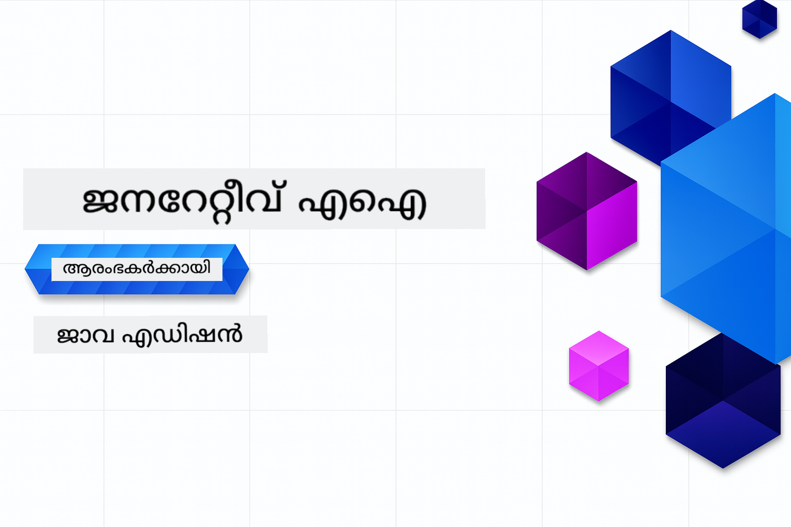

<!--
CO_OP_TRANSLATOR_METADATA:
{
  "original_hash": "0efa90a880213da0aeb35e43ec717e98",
  "translation_date": "2025-12-01T09:10:59+00:00",
  "source_file": "README.md",
  "language_code": "ml"
}
-->
# തുടക്കക്കാർക്കുള്ള Generative AI - ജാവ എഡിഷൻ

**സമയ പ്രതിബദ്ധത**: ഈ വർക്ക്‌ഷോപ്പ് മുഴുവനായും ഓൺലൈനിൽ പൂർത്തിയാക്കാം, ലോക്കൽ സെറ്റപ്പ് ആവശ്യമില്ല. പരിസ്ഥിതി സജ്ജമാക്കാൻ 2 മിനിറ്റ് മതിയാകും, സാമ്പിളുകൾ പരിശോധിക്കാൻ 1-3 മണിക്കൂർ ആവശ്യമാകും, എത്രത്തോളം ആഴത്തിൽ പഠിക്കുന്നു എന്നതിനെ ആശ്രയിച്ച്.

> **ദ്രുത തുടക്കം**

1. ഈ റിപോസിറ്ററി നിങ്ങളുടെ GitHub അക്കൗണ്ടിലേക്ക് Fork ചെയ്യുക
2. **Code** → **Codespaces** tab → **...** → **New with options...** ക്ലിക്ക് ചെയ്യുക
3. ഡിഫോൾട്ടുകൾ ഉപയോഗിക്കുക – ഇത് ഈ കോഴ്സിനായി സൃഷ്ടിച്ച Development കൺടെയ്‌നർ തിരഞ്ഞെടുക്കും
4. **Create codespace** ക്ലിക്ക് ചെയ്യുക
5. പരിസ്ഥിതി സജ്ജമാകാൻ ~2 മിനിറ്റ് കാത്തിരിക്കുക
6. [ആദ്യ ഉദാഹരണത്തിലേക്ക്](./02-SetupDevEnvironment/README.md#step-2-create-a-github-personal-access-token) നേരിട്ട് ചാടുക

## മൾട്ടി-ലാംഗ്വേജ് പിന്തുണ

### GitHub Action വഴി പിന്തുണ (ഓട്ടോമേറ്റഡ് & എപ്പോഴും അപ്‌ടു-ഡേറ്റ്)

<!-- CO-OP TRANSLATOR LANGUAGES TABLE START -->
[Arabic](../ar/README.md) | [Bengali](../bn/README.md) | [Bulgarian](../bg/README.md) | [Burmese (Myanmar)](../my/README.md) | [Chinese (Simplified)](../zh/README.md) | [Chinese (Traditional, Hong Kong)](../hk/README.md) | [Chinese (Traditional, Macau)](../mo/README.md) | [Chinese (Traditional, Taiwan)](../tw/README.md) | [Croatian](../hr/README.md) | [Czech](../cs/README.md) | [Danish](../da/README.md) | [Dutch](../nl/README.md) | [Estonian](../et/README.md) | [Finnish](../fi/README.md) | [French](../fr/README.md) | [German](../de/README.md) | [Greek](../el/README.md) | [Hebrew](../he/README.md) | [Hindi](../hi/README.md) | [Hungarian](../hu/README.md) | [Indonesian](../id/README.md) | [Italian](../it/README.md) | [Japanese](../ja/README.md) | [Kannada](../kn/README.md) | [Korean](../ko/README.md) | [Lithuanian](../lt/README.md) | [Malay](../ms/README.md) | [Malayalam](./README.md) | [Marathi](../mr/README.md) | [Nepali](../ne/README.md) | [Nigerian Pidgin](../pcm/README.md) | [Norwegian](../no/README.md) | [Persian (Farsi)](../fa/README.md) | [Polish](../pl/README.md) | [Portuguese (Brazil)](../br/README.md) | [Portuguese (Portugal)](../pt/README.md) | [Punjabi (Gurmukhi)](../pa/README.md) | [Romanian](../ro/README.md) | [Russian](../ru/README.md) | [Serbian (Cyrillic)](../sr/README.md) | [Slovak](../sk/README.md) | [Slovenian](../sl/README.md) | [Spanish](../es/README.md) | [Swahili](../sw/README.md) | [Swedish](../sv/README.md) | [Tagalog (Filipino)](../tl/README.md) | [Tamil](../ta/README.md) | [Telugu](../te/README.md) | [Thai](../th/README.md) | [Turkish](../tr/README.md) | [Ukrainian](../uk/README.md) | [Urdu](../ur/README.md) | [Vietnamese](../vi/README.md)
<!-- CO-OP TRANSLATOR LANGUAGES TABLE END -->

## കോഴ്സ് ഘടന & പഠന പാത

### **അദ്ധ്യായം 1: Generative AI-ന്റെ പരിചയം**
- **പ്രധാന ആശയങ്ങൾ**: Large Language Models, ടോക്കനുകൾ, embeddings, AI ശേഷികൾ എന്നിവയെ മനസ്സിലാക്കുക
- **Java AI Ecosystem**: Spring AI, OpenAI SDKs എന്നിവയുടെ അവലോകനം
- **Model Context Protocol**: MCP-ന്റെ പരിചയം, AI ഏജന്റുകളുടെ ആശയവിനിമയത്തിൽ അതിന്റെ പങ്ക്
- **പ്രായോഗിക പ്രയോഗങ്ങൾ**: ചാറ്റ്ബോട്ടുകൾ, ഉള്ളടക്കം സൃഷ്ടിക്കൽ എന്നിവ ഉൾപ്പെടുന്ന യഥാർത്ഥ സാഹചര്യങ്ങൾ
- **[→ അദ്ധ്യായം 1 ആരംഭിക്കുക](./01-IntroToGenAI/README.md)**

### **അദ്ധ്യായം 2: ഡെവലപ്മെന്റ് പരിസ്ഥിതി സജ്ജമാക്കൽ**
- **മൾട്ടി-പ്രൊവൈഡർ കോൺഫിഗറേഷൻ**: GitHub Models, Azure OpenAI, OpenAI Java SDK ഇന്റഗ്രേഷനുകൾ സജ്ജമാക്കുക
- **Spring Boot + Spring AI**: എന്റർപ്രൈസ് AI ആപ്ലിക്കേഷൻ ഡെവലപ്മെന്റിനുള്ള മികച്ച രീതികൾ
- **GitHub Models**: പ്രോട്ടോട്ടൈപ്പിംഗ്, പഠനത്തിനുള്ള സൗജന്യ AI മോഡൽ ആക്സസ് (ക്രെഡിറ്റ് കാർഡ് ആവശ്യമില്ല)
- **ഡെവലപ്മെന്റ് ടൂളുകൾ**: Docker കൺടെയ്‌നറുകൾ, VS Code, GitHub Codespaces കോൺഫിഗറേഷൻ
- **[→ അദ്ധ്യായം 2 ആരംഭിക്കുക](./02-SetupDevEnvironment/README.md)**

### **അദ്ധ്യായം 3: പ്രധാന Generative AI സാങ്കേതിക വിദ്യകൾ**
- **Prompt Engineering**: AI മോഡലിന്റെ മികച്ച പ്രതികരണങ്ങൾക്കുള്ള സാങ്കേതിക വിദ്യകൾ
- **Embeddings & Vector Operations**: സെമാന്റിക് സെർച്ച്, സാദൃശ്യം മാച്ചിംഗ് എന്നിവ നടപ്പിലാക്കുക
- **Retrieval-Augmented Generation (RAG)**: നിങ്ങളുടെ സ്വന്തം ഡാറ്റാ സ്രോതസ്സുകളുമായി AI സംയോജിപ്പിക്കുക
- **Function Calling**: കസ്റ്റം ടൂളുകൾ, പ്ലഗിനുകൾ ഉപയോഗിച്ച് AI ശേഷികൾ വികസിപ്പിക്കുക
- **[→ അദ്ധ്യായം 3 ആരംഭിക്കുക](./03-CoreGenerativeAITechniques/README.md)**

### **അദ്ധ്യായം 4: പ്രായോഗിക പ്രയോഗങ്ങൾ & പ്രോജക്റ്റുകൾ**
- **Pet Story Generator** (`petstory/`): GitHub Models ഉപയോഗിച്ച് സൃഷ്ടിപരമായ ഉള്ളടക്കം സൃഷ്ടിക്കൽ
- **Foundry Local Demo** (`foundrylocal/`): OpenAI Java SDK ഉപയോഗിച്ച് ലോക്കൽ AI മോഡൽ ഇന്റഗ്രേഷൻ
- **MCP Calculator Service** (`calculator/`): Spring AI ഉപയോഗിച്ച് അടിസ്ഥാന Model Context Protocol നടപ്പിലാക്കൽ
- **[→ അദ്ധ്യായം 4 ആരംഭിക്കുക](./04-PracticalSamples/README.md)**

### **അദ്ധ്യായം 5: ഉത്തരവാദിത്വമുള്ള AI ഡെവലപ്മെന്റ്**
- **GitHub Models Safety**: ഉള്ളടക്കം ഫിൽട്ടറിംഗ്, സുരക്ഷാ സംവിധാനങ്ങൾ (ഹാർഡ് ബ്ലോക്കുകൾ, സോഫ്റ്റ് നിരസനങ്ങൾ) പരിശോധിക്കുക
- **Responsible AI Demo**: ആധുനിക AI സുരക്ഷാ സംവിധാനങ്ങൾ പ്രായോഗികമായി പ്രവർത്തിക്കുന്നതിന്റെ ഹാൻഡ്‌സ്-ഓൺ ഉദാഹരണം
- **മികച്ച രീതികൾ**: എതിക്കൽ AI ഡെവലപ്മെന്റിനും ഡെപ്ലോയ്മെന്റിനും ആവശ്യമായ മാർഗ്ഗരേഖകൾ
- **[→ അദ്ധ്യായം 5 ആരംഭിക്കുക](./05-ResponsibleGenAI/README.md)**

## അധിക വിഭവങ്ങൾ

<!-- CO-OP TRANSLATOR OTHER COURSES START -->
### Azure / Edge / MCP / Agents

---
 
### Generative AI Series

[-9333EA?style=for-the-badge&labelColor=E5E7EB&color=9333EA)](https://github.com/microsoft/Generative-AI-for-beginners-dotnet?WT.mc_id=academic-105485-koreyst)
[-C084FC?style=for-the-badge&labelColor=E5E7EB&color=C084FC)](https://github.com/microsoft/generative-ai-for-beginners-java?WT.mc_id=academic-105485-koreyst)
[-E879F9?style=for-the-badge&labelColor=E5E7EB&color=E879F9)](https://github.com/microsoft/generative-ai-with-javascript?WT.mc_id=academic-105485-koreyst)

---
 
### Core Learning

---
 
### Copilot Series

  
  
<!-- CO-OP TRANSLATOR OTHER COURSES END -->

## സഹായം ലഭ്യമാക്കുക

AI ആപ്പുകൾ നിർമ്മിക്കുന്നതിൽ നിങ്ങൾക്ക് സംശയങ്ങൾ ഉണ്ടെങ്കിൽ, അല്ലെങ്കിൽ നിങ്ങൾക്ക് എന്തെങ്കിലും ചോദ്യങ്ങൾ ഉണ്ടെങ്കിൽ, MCPയെക്കുറിച്ചുള്ള ചർച്ചകളിൽ അനുഭവസമ്പന്നരായ ഡെവലപ്പർമാരും മറ്റ് പഠിതാക്കളും പങ്കെടുക്കുന്ന ഒരു സമൂഹത്തിൽ ചേരുക. ചോദ്യങ്ങൾ സ്വാഗതം ചെയ്യപ്പെടുന്ന, അറിവ് സ്വതന്ത്രമായി പങ്കിടുന്ന ഒരു പിന്തുണയുള്ള സമൂഹമാണിത്.

ഉൽപ്പന്നത്തെക്കുറിച്ചുള്ള അഭിപ്രായങ്ങൾ അല്ലെങ്കിൽ നിർമ്മാണത്തിനിടെ പിഴവുകൾ ഉണ്ടെങ്കിൽ സന്ദർശിക്കുക:

---

<!-- CO-OP TRANSLATOR DISCLAIMER START -->
**അറിയിപ്പ്**:  
ഈ രേഖ AI വിവർത്തന സേവനം [Co-op Translator](https://github.com/Azure/co-op-translator) ഉപയോഗിച്ച് വിവർത്തനം ചെയ്തതാണ്. ഞങ്ങൾ കൃത്യതയ്ക്കായി ശ്രമിക്കുന്നുവെങ്കിലും, ഓട്ടോമേറ്റഡ് വിവർത്തനങ്ങളിൽ പിഴവുകൾ അല്ലെങ്കിൽ തെറ്റായ വിവരങ്ങൾ ഉണ്ടാകാൻ സാധ്യതയുണ്ട്. അതിന്റെ സ്വഭാവ ഭാഷയിലുള്ള അസൽ രേഖയാണ് വിശ്വസനീയമായ ഉറവിടം എന്ന് പരിഗണിക്കേണ്ടത്. നിർണായകമായ വിവരങ്ങൾക്ക്, പ്രൊഫഷണൽ മനുഷ്യ വിവർത്തനം ശുപാർശ ചെയ്യുന്നു. ഈ വിവർത്തനം ഉപയോഗിച്ച് ഉണ്ടാകുന്ന തെറ്റിദ്ധാരണകൾക്കോ തെറ്റായ വ്യാഖ്യാനങ്ങൾക്കോ ഞങ്ങൾ ഉത്തരവാദികളല്ല.
<!-- CO-OP TRANSLATOR DISCLAIMER END -->