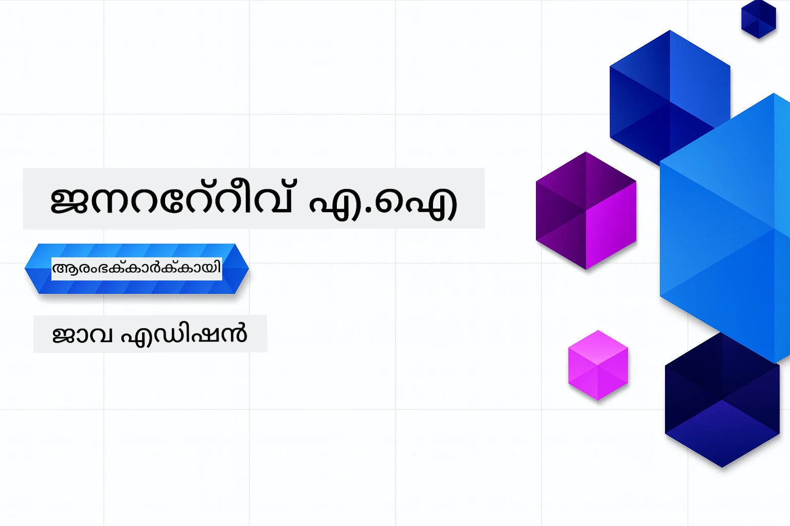

# തുടങ്ങുന്നവർക്കുള്ള ജനറേറ്റീവ് AI - ജാവ എഡിഷൻ
[](https://discord.gg/nTYy5BXMWG)



**സമയം: ** ശിപാർശ ചെയ്യുന്ന ആകെ വർക്ക്‌ഷോപ്പ് ഒൺലൈൻ ക്യാമ്പസിൽ സജ്ജമാക്കാതെ പൂർത്തിയാക്കാം. എന്റർപ്രൈസ് സജ്ജീകരണത്തിന് 2 മിനിറ്റ്, സാമ്പിൾസുകൾ പരീക്ഷിക്കാൻ 1-3 മണിക്കൂർ ഉണ്ടാകാം, പരീക്ഷണത്തിന്റെ ആഴതനുസരിച്ച്.

> **വേഗത്തിലുള്ള ആരംഭം** 

1. ഈ റിപ്പോസിറ്ററി നിങ്ങളുടെ GitHub അക്കൗണ്ടിലേക്ക് ഫോർക്ക് ചെയ്യുക
2. ക്ലിക്ക് ചെയ്യുക **Code** → **Codespaces** ടാബ് → **...** → **New with options...**
3. ഡിഫോൾട്ടുകൾ ഉപയോഗിക്കുക – ഇത് ഈ കോഴ്സിന് രൂപകൽപ്പന ചെയ്ത ഡെവലപ്പ്മെന്റ് കണ്ടെയ്നർ തിരഞ്ഞെടുത്തിരിക്കുന്നു
4. ക്ലിക്ക് ചെയ്യുക **Create codespace**
5. പരിസരം സജ്ജമാകാൻ ~2 മിനിറ്റ് കാത്തിരിക്കുക
6. നേരിട്ട് [ആദ്യ ഉദാഹരണത്തിലേക്ക് ലിയപിച്ചു പോകുക](./02-SetupDevEnvironment/README.md#step-2-create-a-github-personal-access-token)

## ബഹുമുഖ ഭാഷാ പിന്തുണ

### GitHub ആക്ഷൻ വഴി പിന്തുണ (ഓട്ടോമേറ്റഡ് & എപ്പോഴും അപ് ടു ഡേറ്റ്)

<!-- CO-OP TRANSLATOR LANGUAGES TABLE START -->
[அரபிக்](../ar/README.md) | [ബംഗാളി](../bn/README.md) | [ബൾഗേറിയൻ](../bg/README.md) | [മ്യാന്മർ](../my/README.md) | [ചൈനീസ് (സിംപ്ലിഫൈഡ്)](../zh-CN/README.md) | [ചൈനീസ് (പരമ്പരാഗതം, ഹോങ്കോംഗ്)](../zh-HK/README.md) | [ചൈനീസ് (പരമ്പരാഗതം, മകാവ്)](../zh-MO/README.md) | [ചൈനീസ് (പരമ്പരാഗതം, തായ്‌വാൻ)](../zh-TW/README.md) | [ക്രോതീയൻ](../hr/README.md) | [ചെക്ക്](../cs/README.md) | [ഡാനിഷ്](../da/README.md) | [ഡച്ച്](../nl/README.md) | [എസ്റ്റോനിയൻ](../et/README.md) | [ഫിന്നിഷ്](../fi/README.md) | [ഫ്രഞ്ച്](../fr/README.md) | [ജർമ്മൻ](../de/README.md) | [ഗ്രീസ്](../el/README.md) | [ഹീബ്രു](../he/README.md) | [ഹിന്ദി](../hi/README.md) | [ഹംഗേരിയൻ](../hu/README.md) | [ഇന്തോനേഷ്യൻ](../id/README.md) | [ഇറ്റാലിയൻ](../it/README.md) | [ജാപ്പനീസ്](../ja/README.md) | [കന്നഡ](../kn/README.md) | [ഖ്മർ](../km/README.md) | [കൊറിയൻ](../ko/README.md) | [ലിത്രുവീനിയൻ](../lt/README.md) | [മലയ‍‍‍‍ലം](../ms/README.md) | [മറാഠി](../mr/README.md) | [നെപ്പാളി](../ne/README.md) | [നൈജീറിയൻ പിഡ്ജിൻ](../pcm/README.md) | [നോർവീജിയൻ](../no/README.md) | [പ്പേർശിയൻ (ഫേഴ്സി)](../fa/README.md) | [പോളിഷ്](../pl/README.md) | [പോർച്ചുഗീസ് (ബ്രസീൽ)](../pt-BR/README.md) | [പോർച്ചുഗീസ് (പോർച്ചുഗൽ)](../pt-PT/README.md) | [പഞ്ചാബി (ഗുരുമുഖി)](../pa/README.md) | [റോമാനിയൻ](../ro/README.md) | [റഷ്യൻ](../ru/README.md) | [സെർബിയൻ (സിറിലിക്)](../sr/README.md) | [സ്ലോവാകിയൻ](../sk/README.md) | [സ്ലോവേനിയൻ](../sl/README.md) | [സ്പാനിഷ്](../es/README.md) | [സ്വാഹിലി](../sw/README.md) | [സ്വീഡിഷ്](../sv/README.md) | [ടാഗാലോഗ് (ഫിലിപ്പിനോ)](../tl/README.md) | [തമിഴ്](../ta/README.md) | [తెలుగు](../te/README.md) | [തായ്](../th/README.md) | [തുര്‍ക്കിഷ്](../tr/README.md) | [ഉക്രേനിയൻ](../uk/README.md) | [ഉർദു](../ur/README.md) | [വിയറ്റ്നാമീസ്](../vi/README.md)

> **പ്രാദേശികം ക്ലോൺ ചെയ്യാൻ ആഗ്രഹിക്കുന്നുണ്ടോ?**
>
> ഈ റിപ്പോസിറ്ററിയിൽ 50+ ഭാഷാ വിവർത്തനങ്ങൾ ഉൾപ്പെടുത്തി, അത് ഡൗൺലോഡ് വലുതാക്കുന്നു. വിവർത്തനങ്ങൾ ഇല്ലാതെ ക്ലോൺ ചെയ്യാൻ, സ്പാർസ് ഔട്ട്ചെക്ക് ഉപയോഗിക്കുക:
>
> **Bash / macOS / Linux:**
> ```bash
> git clone --filter=blob:none --sparse https://github.com/microsoft/Generative-AI-for-beginners-java.git
> cd Generative-AI-for-beginners-java
> git sparse-checkout set --no-cone '/*' '!translations' '!translated_images'
> ```
>
> **CMD (Windows):**
> ```cmd
> git clone --filter=blob:none --sparse https://github.com/microsoft/Generative-AI-for-beginners-java.git
> cd Generative-AI-for-beginners-java
> git sparse-checkout set --no-cone "/*" "!translations" "!translated_images"
> ```
>
> ഇത് കോഴ്സ് പൂർത്തിയാക്കാൻ വേണ്ട എല്ലാ ഫയലുകളും വളരെ വേഗത്തിൽ ഡൗൺലോഡ് ചെയ്യാൻ സഹായിക്കും.
<!-- CO-OP TRANSLATOR LANGUAGES TABLE END -->

## കോഴ്സ് ഘടനയും പഠന മാർഗ്ഗവും

### **അദ്ധ്യായം 1: ജനറേറ്റീവ് AI-യുടെ പരിചയം**
- **പ്രധാന ആശയങ്ങൾ**: വലുതായ ഭാഷാ മാതൃകകൾ, ടോക്കനുകൾ, എംബഡ്ഡിംഗുകൾ, AI ന്റെ ശേഷി എന്നിവയുടെ വിശദാംശങ്ങൾ
- **ജാവ AI എക്കോസിസ്റ്റം**: സ്‌പ്രിംഗ് AI, ഓപ്പൺAI SDK-കളുടെ അവലോകനം
- **മോഡൽ കോൺടെക്സ്റ്റ് പ്രോട്ടോക്കോൾ**: MCP-യുടെ പരിചയം, AI ഏജന്റ് ആശയവിനിമയത്തിൽ അതിന്റെ പങ്ക്
- **പ്രായോഗിക ഉപയോഗങ്ങൾ**: ചാറ്റ്ബോട്ടുകൾ, ഉള്ളടക്കം നിർമ്മാണം തുടങ്ങിയ യാഥാർഥ്യ സാഹചര്യങ്ങൾ
- **[→ ആരംഭിക്കുക അദ്ധ്യായം 1](./01-IntroToGenAI/README.md)**

### **അദ്ധ്യായം 2: ഡെവലപ്പ്മെന്റ് പരിസരം സജ്ജീകരണം**
- **മൾട്ടി-പ്രൊവൈഡർ കോൺഫിഗറേഷൻ**: GitHub Models, Azure OpenAI, OpenAI ജാവ SDK ഇന്റഗ്രേഷനുകൾ സജ്ജമാക്കൽ
- **Spring Boot + Spring AI**: എന്റർപ്രൈസ് AI അപ്ലിക്കേഷനുകൾക്ക് മികച്ച രീതികൾ
- **GitHub Models**: പ്രോട്ടോടൈപ്പിംഗ്, പഠനത്തിന് സൗജന്യ AI മോഡൽ പ്രവേശനം (ക്രെഡിറ്റ് കാർഡ് ആവശ്യമില്ല)
- **ഡെവലപ്പ്മെന്റ് ഉപകരണങ്ങൾ**: ഡോക്കർ കണ്ടെയ്നറുകൾ, VS കോഡ്, GitHub Codespaces കോൺഫിഗറേഷൻ
- **[→ ആരംഭിക്കുക അദ്ധ്യായം 2](./02-SetupDevEnvironment/README.md)**

### **അദ്ധ്യായം 3: മുഖ്യ ജനറേറ്റീവ് AI സാങ്കേതിക വിദ്യകൾ**
- **പ്രോംപ്റ്റ് എഞ്ചിനീയറിംഗ്**: മികച്ച AI പ്രതികരണങ്ങൾക്ക് സാങ്കേതിക വിദ്യകൾ
- **എംബഡ്ഡിംഗുകൾ & വെക്ടർ ഓപ്പറേഷനുകൾ**: സെമാന്റിക് തിരച്ചിൽ, സാമ്യമുള്ള പൊരുത്തം നടപ്പിലാക്കൽ
- **Retrieval-Augmented Generation (RAG)**: നിങ്ങളുടെ ഡാറ്റാ ഉറവിടങ്ങളുമായി AI സംയോജിപ്പിക്കൽ
- **ഫങ്ഷൻ കോൾമെന്ത**: കസ്റ്റം ഉപകരണങ്ങളും പ്ലഗിനുകളും കൊണ്ട് AI കഴിവുകൾ വിപുലീകരിക്കുക
- **[→ ആരംഭിക്കുക അദ്ധ്യായം 3](./03-CoreGenerativeAITechniques/README.md)**

### **അദ്ധ്യായം 4: പ്രായോഗിക ഉപയോഗങ്ങളും പ്രോജക്ടുകളും**
- **പേട്സ്ടോറി ജനറേറ്റർ** (`petstory/`): GitHub മോഡലുകൾ ഉപയോഗിച്ചുള്ള സൃഷ്ടിപരമായ ഉള്ളടക്കം നിർമ്മാണം
- **Foundry Local ഡെമോ** (`foundrylocal/`): OpenAI ജാവ SDK ഉപയോഗിച്ച് ലോക്കൽ AI മോഡൽ സംയോജനം
- **MCP കാൽക്കുലേറ്റർ സർവീസ്** (`calculator/`): Spring AI ഉപയോഗിച്ച് അടിസ്ഥാന മോഡൽ കോൺടെക്സ്റ്റ് പ്രോട്ടോക്കോൾ റീയലിസേഷൻ
- **[→ ആരംഭിക്കുക അദ്ധ്യായം 4](./04-PracticalSamples/README.md)**

### **അദ്ധ്യായം 5: ഉത്തരവാദിത്വമുള്ള AI വികസനം**
- **GitHub Models സുരക്ഷിതത്വം**: Content filtering, സെഫ്റ്റി മെക്കാനിസങ്ങൾ പരിശോധിക്കുക (ഹാർഡ് ബ്ലോക്കുകളും സോഫ്‌റ്റ് റഫ്യൂസ്-ഉം)
- **ഉത്തരവാദിത്വ AI ഡെമോ**: ആധുനിക AI സുരക്ഷാ സംവിധാനങൾ എങ്ങിനെ പ്രവർത്തിക്കുന്നു എന്നും കാണിക്കുന്ന ഹാൻഡ്സ്-ഓൺ ഉദാഹരണം
- **മികച്ച നടപടികൾ**: നച്ചു നിലപാട് AI വികസനത്തിനും വിന്യാസത്തിനും ആവശ്യമായ നിബന്ധനകൾ
- **[→ ആരംഭിക്കുക അദ്ധ്യായം 5](./05-ResponsibleGenAI/README.md)**

## കൂടുതൽ വിഭവങ്ങൾ

<!-- CO-OP TRANSLATOR OTHER COURSES START -->
### ലാംഗ്‌ചൈൻ
[](https://aka.ms/langchain4j-for-beginners)
[](https://aka.ms/langchainjs-for-beginners?WT.mc_id=m365-94501-dwahlin)
[](https://github.com/microsoft/langchain-for-beginners?WT.mc_id=m365-94501-dwahlin)
---

### അസ്യൂർ / എഡ്ജ് / MCP / ഏജന്റുകൾ
[](https://github.com/microsoft/AZD-for-beginners?WT.mc_id=academic-105485-koreyst)
[](https://github.com/microsoft/edgeai-for-beginners?WT.mc_id=academic-105485-koreyst)
[](https://github.com/microsoft/mcp-for-beginners?WT.mc_id=academic-105485-koreyst)
[](https://github.com/microsoft/ai-agents-for-beginners?WT.mc_id=academic-105485-koreyst)

---
 
### ജനറേറ്റീവ് AI പരമ്പര
[](https://github.com/microsoft/generative-ai-for-beginners?WT.mc_id=academic-105485-koreyst)
[-9333EA?style=for-the-badge&labelColor=E5E7EB&color=9333EA)](https://github.com/microsoft/Generative-AI-for-beginners-dotnet?WT.mc_id=academic-105485-koreyst)
[-C084FC?style=for-the-badge&labelColor=E5E7EB&color=C084FC)](https://github.com/microsoft/generative-ai-for-beginners-java?WT.mc_id=academic-105485-koreyst)
[-E879F9?style=for-the-badge&labelColor=E5E7EB&color=E879F9)](https://github.com/microsoft/generative-ai-with-javascript?WT.mc_id=academic-105485-koreyst)

---
 
### മേധാവി പഠനം
[](https://aka.ms/ml-beginners?WT.mc_id=academic-105485-koreyst)
[](https://aka.ms/datascience-beginners?WT.mc_id=academic-105485-koreyst)
[](https://aka.ms/ai-beginners?WT.mc_id=academic-105485-koreyst)
[](https://github.com/microsoft/Security-101?WT.mc_id=academic-96948-sayoung)

[](https://aka.ms/webdev-beginners?WT.mc_id=academic-105485-koreyst)
[](https://aka.ms/iot-beginners?WT.mc_id=academic-105485-koreyst)
[](https://github.com/microsoft/xr-development-for-beginners?WT.mc_id=academic-105485-koreyst)

---
 
### കോപൈലറ്റ് പരമ്പര
[](https://aka.ms/GitHubCopilotAI?WT.mc_id=academic-105485-koreyst)
[](https://github.com/microsoft/mastering-github-copilot-for-dotnet-csharp-developers?WT.mc_id=academic-105485-koreyst)
[](https://github.com/microsoft/CopilotAdventures?WT.mc_id=academic-105485-koreyst)
<!-- CO-OP TRANSLATOR OTHER COURSES END -->

## സഹായം കിട്ടുക

നിങ്ങൾ AI ആപ്പുകൾ നിർമ്മിക്കുമ്പോൾ ഒട്ടും മുന്നോട്ടുപോകാതിരിക്കുകയോ ഏതെങ്കിലും ചോദ്യങ്ങളുണ്ടായിരിക്കണോ? MCPയുടെ ചർച്ചകളിൽ മറ്റ് പഠിക്കുന്നവരും പരിചയസമ്പന്നരായ ഡെവലപ്പർമാരും ചേർന്നു സംസാരിക്കുക. ചോദ്യങ്ങൾക്ക് സ്വാഗതം കൊടുക്കുന്ന, അറിവ് സ്വതന്ത്രമായി പങ്കുവെക്കുന്ന ഒരു പിന്തുണയുള്ള സമൂഹമാണ് ഇത്.

[](https://discord.gg/nTYy5BXMWG)

നിർമ്മിക്കുന്നപ്പോൾ ഉൽപ്പന്ന പ്രതികരണം അല്ലെങ്കിൽ പിശകുകൾ ഉണ്ടെങ്കിൽ സന്ദർശിക്കുക:

[](https://aka.ms/foundry/forum)

---

<!-- CO-OP TRANSLATOR DISCLAIMER START -->
**അസ്വീകരണം**:  
ഈ പ്രമാണം AIപരിഭാഷാ സേവനം [Co-op Translator](https://github.com/Azure/co-op-translator) ഉപയോഗിച്ച് പരിഭാഷപ്പെടുത്തിയതാണ്. ഞങ്ങൾ കൃത്യതയ്ക്കായി ശ്രമിക്കുമ്പോഴും, യാന്ത്രിക പരിഭാഷകളിൽ പിശകുകൾ അല്ലെങ്കിൽ തകർച്ചകൾ ഉണ്ടാകാം എന്ന് ദയവായി കരുതുക. ഈ പ്രമാണത്തിന്റെ മാതൃഭാഷയിലുള്ള അസല ഉയര്‍ന്ന പ്രമാണം അതിന്റെ അഥോറിട്ടേറ്റീവ് സ്രോതസ്സ് എന്നാണ് കണക്കാക്കേണ്ടത്. അത്യാവശ്യമുള്ള വിവരങ്ങൾക്കായി പ്രൊഫഷണൽ മനുഷ്യ പരിഭാഷ ശുപാർശ ചെയ്യപ്പെടുന്നു. ഈ പരിഭാഷയുടെ ഉപയോഗത്തിൽ സംഭവിക്കുന്ന തെറ്റായ വ്യാഖ്യാനങ്ങൾക്കും തെറ്റിദ്ധാരണകൾക്കും ഞങ്ങൾ ഉത്തരവാദിത്വം വഹിക്കുന്നില്ല.
<!-- CO-OP TRANSLATOR DISCLAIMER END -->