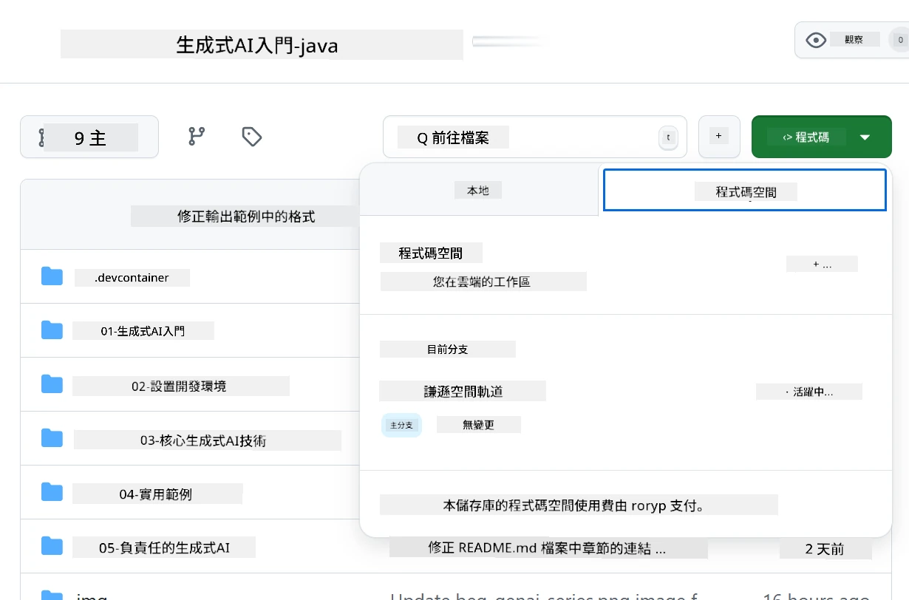
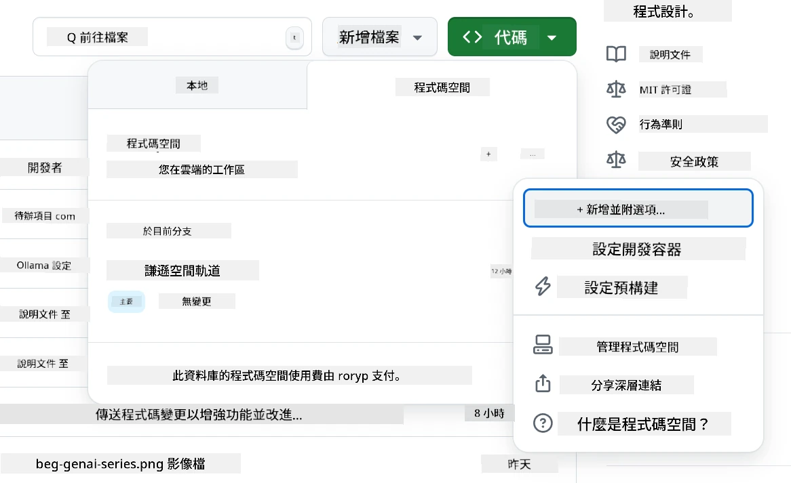
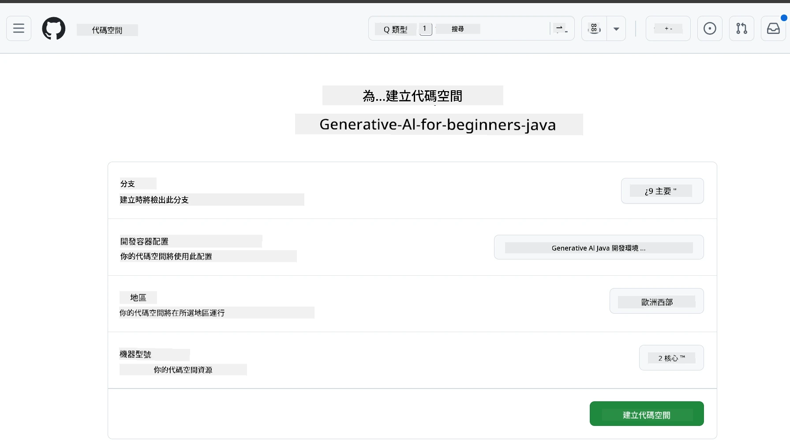
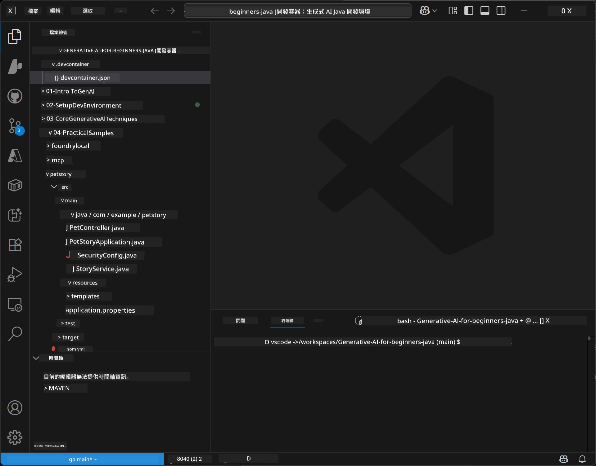

<!--
CO_OP_TRANSLATOR_METADATA:
{
  "original_hash": "96a30d42b9751a3d4e4b20e28d29d459",
  "translation_date": "2026-01-28T04:43:25+00:00",
  "source_file": "02-SetupDevEnvironment/README.md",
  "language_code": "mo"
}
-->
# 為 Java 生成式 AI 設定開發環境

> **快速入門**：2 分鐘於雲端編寫程式碼 - 跳至 [GitHub Codespaces 設定](../../../02-SetupDevEnvironment) - 不需本地安裝並使用 github 模型！

> **對 Azure OpenAI 感興趣？**，請參閱我們的 [Azure OpenAI 設定指南](getting-started-azure-openai.md)，其中包含建立新的 Azure OpenAI 資源的步驟。

## 您將學習到什麼

- 建立用於 AI 應用程式的 Java 開發環境
- 選擇並設定您偏好的開發環境（以 Codespaces 為主的雲端環境、本地開發容器或完整本地安裝）
- 透過連接 GitHub 模型來測試您的設定

## 目錄

- [您將學習到什麼](../../../02-SetupDevEnvironment)
- [簡介](../../../02-SetupDevEnvironment)
- [步驟 1：建立您的開發環境](../../../02-SetupDevEnvironment)
  - [選項 A：GitHub Codespaces（推薦）](../../../02-SetupDevEnvironment)
  - [選項 B：本地開發容器](../../../02-SetupDevEnvironment)
  - [選項 C：使用您現有的本地安裝](../../../02-SetupDevEnvironment)
- [步驟 2：建立 GitHub 個人存取權杖](../../../02-SetupDevEnvironment)
- [步驟 3：使用 GitHub 模型範例測試您的設定](../../../02-SetupDevEnvironment)
- [疑難排解](../../../02-SetupDevEnvironment)
- [摘要](../../../02-SetupDevEnvironment)
- [下一步](../../../02-SetupDevEnvironment)

## 簡介

本章將指導您完成開發環境的設定。我們將使用 **GitHub 模型** 作為主要範例，因為它是免費的，只需有一個 GitHub 帳戶即可輕易設定，不需信用卡，且可存取多種模型供試驗。

**不需本地安裝！** 您可以使用 GitHub Codespaces 立即開始編寫程式碼，該服務提供瀏覽器中的完整開發環境。


我們推薦在本課程使用 [**GitHub 模型**](https://github.com/marketplace?type=models)，因為它：
- **免費**起步
- 只需一個 GitHub 帳戶即可 **輕鬆**設定
- 不需要 **信用卡**
- 提供多種模型供試驗

> **注意**：此訓練中所用的 GitHub 模型有以下免費限制：
> - 每分鐘 15 次請求（每日 150 次）
> - 每次請求約輸入 8,000 字，輸出約 4,000 字
> - 允許 5 個並行請求
> 
> 要用於生產環境，請使用您的 Azure 帳戶升級至 Azure AI Foundry 模型。您的程式碼不需更改。請參閱 [Azure AI Foundry 文件](https://learn.microsoft.com/azure/ai-foundry/foundry-models/how-to/quickstart-github-models)。

## 步驟 1：建立您的開發環境

<a name="quick-start-cloud"></a>

我們已建立預配置的開發容器，能減少設定時間並確保您擁有本 Java 生成式 AI 課程需要的所有工具。請選擇您偏好的開發方式：

### 環境設定選項：

#### 選項 A：GitHub Codespaces（推薦）

**2 分鐘即可開始編碼 - 不需本地安裝！**

1. 將此存放庫分支（fork）到您的 GitHub 帳戶
   > **注意**：若需修改基本配置，請參閱 [開發容器設定](../../../.devcontainer/devcontainer.json)
2. 點選 **Code** → **Codespaces** 頁籤 → **...** → **New with options...**
3. 使用預設值，這將選擇本課程專用的 **Dev container 配置**：**Generative AI Java Development Environment**
4. 點選 **Create codespace**
5. 等候約 2 分鐘以完成環境準備
6. 繼續至 [步驟 2：建立 GitHub 權杖](../../../02-SetupDevEnvironment)







> **Codespaces 的優點**：
> - 不需本地安裝
> - 適用於任何有瀏覽器的裝置
> - 預配置所有工具與相依性
> - 個人帳戶每月免費 60 小時
> - 所有學員皆享有一致的開發環境

#### 選項 B：本地開發容器

**適合喜歡使用 Docker 進行本地開發的開發者**

1. 將此存放庫分支（fork）並克隆至本地機器
   > **注意**：若需修改基本配置，請參閱 [開發容器設定](../../../.devcontainer/devcontainer.json)
2. 安裝 [Docker Desktop](https://www.docker.com/products/docker-desktop/) 與 [VS Code](https://code.visualstudio.com/)
3. 在 VS Code 裝置上安裝 [Dev Containers 擴充](https://marketplace.visualstudio.com/items?itemName=ms-vscode-remote.remote-containers)
4. 在 VS Code 開啟存放庫目錄
5. 出現提示時，點選 **Reopen in Container**（或使用 `Ctrl+Shift+P` → "Dev Containers: Reopen in Container"）
6. 等待容器建置與啟動完成
7. 繼續至 [步驟 2：建立 GitHub 權杖](../../../02-SetupDevEnvironment)




#### 選項 C：使用您現有的本地安裝

**適合已有現有 Java 環境的開發者**

前置條件：
- [Java 21+](https://www.oracle.com/java/technologies/javase/jdk21-archive-downloads.html)
- [Maven 3.9+](https://maven.apache.org/download.cgi)
- [VS Code](https://code.visualstudio.com) 或您偏好的 IDE

步驟：
1. 將此存放庫克隆至本地機器
2. 使用 IDE 開啟專案
3. 繼續至 [步驟 2：建立 GitHub 權杖](../../../02-SetupDevEnvironment)

> **專家提示**：如果您的電腦規格較低，但仍想本地使用 VS Code，請使用 GitHub Codespaces！您可以讓本地 VS Code 連接至雲端託管的 Codespace，享有兩者優勢。


## 步驟 2：建立 GitHub 個人存取權杖

1. 前往 [GitHub 設定頁面](https://github.com/settings/profile)，從您的個人資料選單中選取 **Settings**。
2. 在左側側欄按 **Developer settings**（通常位於底部）。
3. 在 **Personal access tokens** 下，點選 **Fine-grained tokens**（或使用此直接 [連結](https://github.com/settings/personal-access-tokens)）。
4. 點選 **Generate new token**。
5. 在「Token name」欄輸入描述名稱（例如 `GenAI-Java-Course-Token`）。
6. 設定過期日期（建議：為安全起見設為 7 天）。
7. 「Resource owner」選擇您的用戶帳戶。
8. 「Repository access」選擇您要與 GitHub 模型搭配使用的儲存庫（或選「所有儲存庫」）。
9. 「Account permissions」找到 **Models** 權限並設定為 **Read-only**。
10. 點按 **Generate token**。
11. **立即複製並保存您的權杖** — 您之後將無法再次查看！

> **安全提示**：盡量使用最低權限範圍及最短實用的過期時間。

## 步驟 3：使用 GitHub 模型範例測試您的設定

一旦您的開發環境準備就緒，讓我們使用 [`02-SetupDevEnvironment/examples/github-models`](../../../02-SetupDevEnvironment/examples/github-models) 中的範例應用程式來測試 GitHub 模型整合。

1. 在您的開發環境中開啟終端機。
2. 前往 GitHub 模型範例目錄：
   ```bash
   cd 02-SetupDevEnvironment/examples/github-models
   ```
3. 將您的 GitHub 權杖設定為環境變數：
   ```bash
   # macOS/Linux
   export GITHUB_TOKEN=your_token_here
   
   # Windows（命令提示字元）
   set GITHUB_TOKEN=your_token_here
   
   # Windows（PowerShell）
   $env:GITHUB_TOKEN="your_token_here"
   ```

4. 執行應用程式：
   ```bash
   mvn compile exec:java -Dexec.mainClass="com.example.githubmodels.App"
   ```

您應會看到如下類似輸出：
```text
Using model: gpt-4.1-nano
Sending request to GitHub Models...
Response: Hello World!
```

### 了解範例程式碼

首先，讓我們了解剛才執行的內容。`examples/github-models` 下的範例使用 OpenAI Java SDK 來連接 GitHub 模型：

**此程式碼功能：**
- 使用您的個人存取權杖 **連接** GitHub 模型
- **傳送** 一句簡單的 "Say Hello World!" 訊息給 AI 模型
- **接收** 並顯示 AI 回應
- **驗證** 您的設定是否正常運作

**主要相依元件**（在 `pom.xml` 中）：
```xml
<dependency>
    <groupId>com.openai</groupId>
    <artifactId>openai-java</artifactId>
    <version>2.12.0</version>
</dependency>
```

**主要程式碼**（`App.java`）：
```java
// 使用 OpenAI Java SDK 連接到 GitHub 模型
OpenAIClient client = OpenAIOkHttpClient.builder()
    .apiKey(pat)
    .baseUrl("https://models.inference.ai.azure.com")
    .build();

// 建立聊天完成請求
ChatCompletionCreateParams params = ChatCompletionCreateParams.builder()
    .model(modelId)
    .addSystemMessage("You are a concise assistant.")
    .addUserMessage("Say Hello World!")
    .build();

// 獲取 AI 回應
ChatCompletion response = client.chat().completions().create(params);
System.out.println("Response: " + response.choices().get(0).message().content().orElse("No response content"));
```

## 摘要

太好了！您現在已完成所有設定：

- 建立具有 AI 模型存取權限的 GitHub 個人存取權杖
- 啟動您的 Java 開發環境（不論是 Codespaces、開發容器，或本地安裝）
- 使用 OpenAI Java SDK 連接 GitHub 模型，免費開發 AI
- 使用簡單範例確認所有功能運作正常

## 下一步

[第 3 章：核心生成式 AI 技術](../03-CoreGenerativeAITechniques/README.md)

## 疑難排解

遇到問題？以下是常見問題及解決方案：

- **權杖無法使用？** 
  - 確保完整複製權杖且無多餘空白
  - 驗證環境變數是否正確設定
  - 確認權杖擁有正確權限（Models：唯讀）

- **找不到 Maven？** 
  - 若使用開發容器/Codespaces，Maven 應已預裝
  - 本地環境須安裝 Java 21+ 與 Maven 3.9+
  - 使用 `mvn --version` 驗證安裝

- **連線問題？** 
  - 檢查網路連線
  - 確認可連接 GitHub
  - 確定未受防火牆阻擋 GitHub 模型終端點

- **開發容器無法啟動？** 
  - 確認 Docker Desktop 正常執行（本地開發用）
  - 嘗試重建容器：`Ctrl+Shift+P` → "Dev Containers: Rebuild Container"

- **應用程式編譯錯誤？**
  - 確認目前目錄為：`02-SetupDevEnvironment/examples/github-models`
  - 嘗試清理並重新編譯：`mvn clean compile`

> **需要幫助嗎？**：仍有問題？歡迎於本存放庫開啟 issue，我們會協助您。

---

<!-- CO-OP TRANSLATOR DISCLAIMER START -->
**免責聲明**：  
本文件使用 AI 翻譯服務 [Co-op Translator](https://github.com/Azure/co-op-translator) 進行翻譯。雖然我們力求準確，但請注意，自動翻譯可能包含錯誤或不準確之處。原文件的母語版本應視為權威來源。對於重要資訊，建議採用專業人工翻譯。我們不對因使用本翻譯而引起的任何誤解或曲解承擔責任。
<!-- CO-OP TRANSLATOR DISCLAIMER END -->