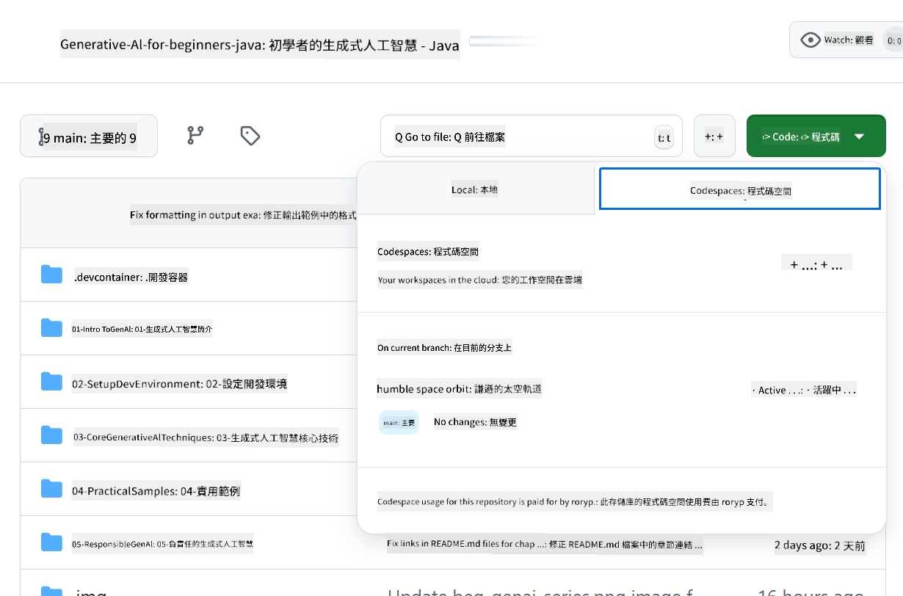

<!--
CO_OP_TRANSLATOR_METADATA:
{
  "original_hash": "e00bbea0f95c611aa3bec676d23e8b43",
  "translation_date": "2025-07-21T18:00:50+00:00",
  "source_file": "02-SetupDevEnvironment/getting-started-azure-openai.md",
  "language_code": "mo"
}
-->
# 設置 Azure OpenAI 開發環境

> **快速開始**：本指南適用於 Azure OpenAI 的設置。如果想快速使用免費模型，請參考 [GitHub Models with Codespaces](./README.md#quick-start-cloud)。

本指南將幫助您為本課程中的 Java AI 應用設置 Azure AI Foundry 模型。

## 目錄

- [快速設置概覽](../../../02-SetupDevEnvironment)
- [步驟 1：建立 Azure AI Foundry 資源](../../../02-SetupDevEnvironment)
  - [建立 Hub 和專案](../../../02-SetupDevEnvironment)
  - [部署 GPT-4o-mini 模型](../../../02-SetupDevEnvironment)
- [步驟 2：建立您的 Codespace](../../../02-SetupDevEnvironment)
- [步驟 3：配置您的環境](../../../02-SetupDevEnvironment)
- [步驟 4：測試您的設置](../../../02-SetupDevEnvironment)
- [接下來是什麼？](../../../02-SetupDevEnvironment)
- [資源](../../../02-SetupDevEnvironment)
- [其他資源](../../../02-SetupDevEnvironment)

## 快速設置概覽

1. 建立 Azure AI Foundry 資源（Hub、專案、模型）
2. 使用 Java 開發容器建立 Codespace
3. 使用 Azure OpenAI 憑據配置 `.env` 文件
4. 使用範例專案測試您的設置

## 步驟 1：建立 Azure AI Foundry 資源

### 建立 Hub 和專案

1. 前往 [Azure AI Foundry Portal](https://ai.azure.com/) 並登入
2. 點擊 **+ Create** → **New hub**（或導航至 **Management** → **All hubs** → **+ New hub**）
3. 配置您的 Hub：
   - **Hub 名稱**：例如 "MyAIHub"
   - **訂閱**：選擇您的 Azure 訂閱
   - **資源群組**：新建或選擇現有的
   - **位置**：選擇離您最近的地區
   - **儲存帳戶**：使用預設或自定義配置
   - **金鑰保管庫**：使用預設或自定義配置
   - 點擊 **Next** → **Review + create** → **Create**
4. 建立完成後，點擊 **+ New project**（或從 Hub 概覽頁選擇 **Create project**）
   - **專案名稱**：例如 "GenAIJava"
   - 點擊 **Create**

### 部署 GPT-4o-mini 模型

1. 在您的專案中，導航至 **Model catalog**，搜尋 **gpt-4o-mini**
   - *替代方法：導航至 **Deployments** → **+ Create deployment***
2. 在 gpt-4o-mini 模型卡片上點擊 **Deploy**
3. 配置部署：
   - **部署名稱**："gpt-4o-mini"
   - **模型版本**：使用最新版本
   - **部署類型**：標準
4. 點擊 **Deploy**
5. 部署完成後，前往 **Deployments** 標籤頁並複製以下值：
   - **部署名稱**（例如 "gpt-4o-mini"）
   - **目標 URI**（例如 `https://your-hub-name.openai.azure.com/`）  
      > **重要**：僅複製基礎 URL（例如 `https://myhub.openai.azure.com/`），不要包含完整的端點路徑。
   - **金鑰**（從 Keys and Endpoint 區域獲取）

> **仍有問題？** 請參考官方 [Azure AI Foundry 文件](https://learn.microsoft.com/azure/ai-foundry/how-to/create-projects?tabs=ai-foundry&pivots=hub-project)

## 步驟 2：建立您的 Codespace

1. 將此倉庫 Fork 到您的 GitHub 帳戶
   > **注意**：如果您想編輯基本配置，請查看 [Dev Container Configuration](../../../.devcontainer/devcontainer.json)
2. 在您的 Fork 倉庫中，點擊 **Code** → **Codespaces** 標籤
3. 點擊 **...** → **New with options...**  

4. 選擇 **Dev container configuration**： 
   - **Generative AI Java Development Environment**
5. 點擊 **Create codespace**

## 步驟 3：配置您的環境

當您的 Codespace 準備就緒後，設置您的 Azure OpenAI 憑據：

1. **從倉庫根目錄導航至範例專案：**  
   ```bash
   cd 02-SetupDevEnvironment/src/basic-chat-azure
   ```

2. **創建 `.env` 文件：**  
   ```bash
   cp .env.example .env
   ```

3. **編輯 `.env` 文件，填入您的 Azure OpenAI 憑據：**  
   ```bash
   # Your Azure OpenAI API key (from Azure AI Foundry portal)
   AZURE_AI_KEY=your-actual-api-key-here
   
   # Your Azure OpenAI endpoint URL (e.g., https://myhub.openai.azure.com/)
   AZURE_AI_ENDPOINT=https://your-hub-name.openai.azure.com/
   ```

   > **安全提示**：  
   > - 切勿將 `.env` 文件提交到版本控制系統
   > - `.env` 文件已包含在 `.gitignore` 中
   > - 確保您的 API 金鑰安全，並定期更換

## 步驟 4：測試您的設置

運行範例應用以測試您的 Azure OpenAI 連接：

```bash
mvn clean spring-boot:run
```

您應該會看到來自 GPT-4o-mini 模型的回應！

> **VS Code 使用者**：您也可以在 VS Code 中按 `F5` 運行應用。啟動配置已設置為自動加載您的 `.env` 文件。

> **完整範例**：請參考 [End-to-End Azure OpenAI Example](./src/basic-chat-azure/README.md) 獲取詳細說明和故障排除。

## 接下來是什麼？

**設置完成！** 您現在已經：
- 部署了 Azure OpenAI 的 gpt-4o-mini 模型
- 配置了本地 `.env` 文件
- 準備好了 Java 開發環境

**繼續閱讀** [第 3 章：核心生成式 AI 技術](../03-CoreGenerativeAITechniques/README.md)，開始構建 AI 應用！

## 資源

- [Azure AI Foundry 文件](https://learn.microsoft.com/azure/ai-services/)
- [Spring AI Azure OpenAI 文件](https://docs.spring.io/spring-ai/reference/api/clients/azure-openai-chat.html)
- [Azure OpenAI Java SDK](https://learn.microsoft.com/java/api/overview/azure/ai-openai-readme)

## 其他資源

- [下載 VS Code](https://code.visualstudio.com/Download)
- [獲取 Docker Desktop](https://www.docker.com/products/docker-desktop)
- [Dev Container Configuration](../../../.devcontainer/devcontainer.json)

**免責聲明**：  
本文檔使用 AI 翻譯服務 [Co-op Translator](https://github.com/Azure/co-op-translator) 進行翻譯。儘管我們努力確保準確性，但請注意，自動翻譯可能包含錯誤或不準確之處。原始語言的文件應被視為權威來源。對於關鍵信息，建議使用專業人工翻譯。我們對因使用此翻譯而引起的任何誤解或錯誤解釋不承擔責任。