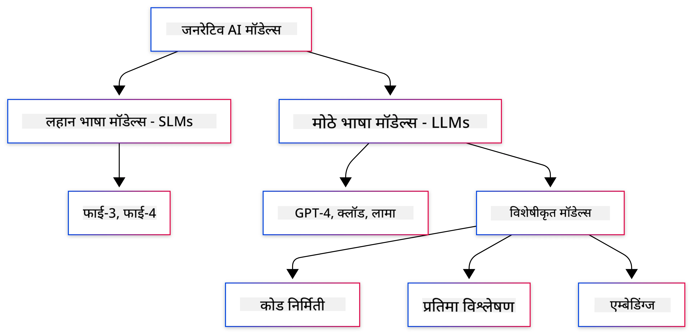
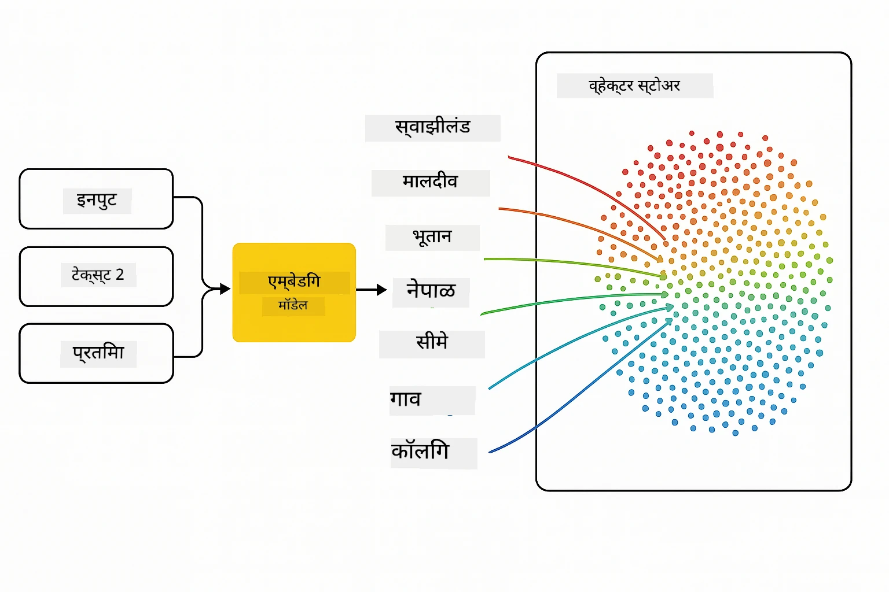
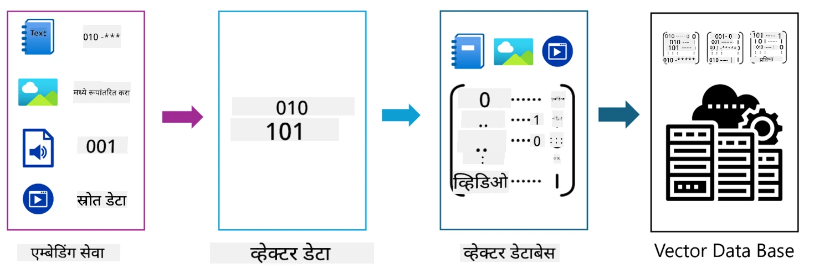
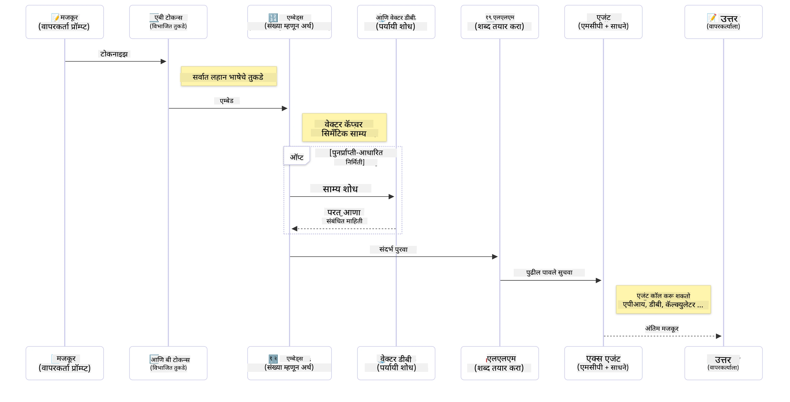

# जनरेटिव AI परिचय - जावा एडिशन

> **व्हिडिओ**: [या धड्याचा विडिओ आढावा YouTube वर पाहा.](https://www.youtube.com/watch?v=XH46tGp_eSw) तुम्ही वरील थंबनेल प्रतिमा देखील क्लिक करू शकता.

## तुम्ही काय शिकाल

- **जनरेटिव AI मूलतत्त्वे** ज्यात LLMs, प्राँप्ट इंजिनीअरिंग, टोकन्स, एम्बेडिंग्ज, आणि व्हेक्टर डेटाबेस समाविष्ट आहेत
- **जावा AI विकास साधने यांची तुलना** ज्यात Azure OpenAI SDK, Spring AI, आणि OpenAI Java SDK आहेत
- **मॉडेल कंटेक्स्ट प्रोटोकॉल** आणि त्याचा AI एजंट संवादातील भूमिका शोधा

## आशय सूची

- [परिचय](#परिचय)
- [जनरेटिव AI संकल्पनांचा जलद पुनरावलोकन](#जनरेटिव-ai-संकल्पनांचा-जलद-पुनरावलोकन)
- [प्राँप्ट इंजिनीअरिंग पुनरावलोकन](#प्राँप्ट-इंजिनीअरिंग-पुनरावलोकन)
- [टोकन्स, एम्बेडिंग्ज, आणि एजंट्स](#टोकन्स-एम्बेडिंग्ज-आणि-एजंट्स)
- [जावासाठी AI विकास साधने आणि लायब्ररी](#जावासाठी-ai-विकास-साधने-आणि-लायब्ररी)
  - [OpenAI Java SDK](#openai-java-sdk)
  - [Spring AI](#spring-ai)
  - [Azure OpenAI Java SDK](#azure-openai-java-sdk)
- [सारांश](#सारांश)
- [पुढील पायऱ्या](#पुढील-पायऱ्या)

## परिचय

जनरेटिव AI for Beginners - Java Edition च्या पहिल्या अध्यायात तुम्हाचे स्वागत आहे! हा मूलभूत धडा तुम्हाला जनरेटिव AI चे मुख्य संकल्पना आणि त्यांच्यासह जावा वापरून कसे काम करावे हे सादर करतो. तुम्ही AI अनुप्रयोगांचे आवश्यक घटक शिकाल, ज्यात Large Language Models (LLMs), टोकन्स, एम्बेडिंग्ज, आणि AI एजंट्स यांचा समावेश आहे. आम्ही या कोर्समध्ये वापरल्या जाणाऱ्या मुख्य जावा टूलिंगचा देखील अभ्यास करू.

### जनरेटिव AI संकल्पनांचा जलद पुनरावलोकन

जनरेटिव AI ही एक प्रकारची कृत्रिम बुद्धिमत्ता आहे जी डेटा पासून शिकलेल्या नमुन्यांवर आणि संबंधांवर आधारित नवीन मजकूर, प्रतिमा किंवा कोड तयार करते. जनरेटिव AI मॉडेल मानवसमान प्रतिसाद तयार करू शकतात, संदर्भ समजू शकतात, आणि कधी कधी मानवीसारखी सामग्रीचुद्धा निर्माण करतात.

तुम्ही तुमच्या जावा AI अनुप्रयोगांचे विकास करताना **जनरेटिव AI मॉडेल्स** वापरून सामग्री तयार कराल. जनरेटिव AI मॉडेल्सच्या काही क्षमतांमध्ये यांचा समावेश होतो:

- **मजकूर निर्मिती**: चॅटबॉट्स, सामग्री आणि मजकूर संपूर्णतेसाठी मानवीसमान मजकूर तयार करणे.
- **प्रतिमा निर्मिती आणि विश्लेषण**: वास्तवदृश्य प्रतिमा तयार करणे, फोटो सुधारणा, आणि वस्तू शोधणे.
- **कोड निर्मिती**: कोडचे तुकडे किंवा स्क्रिप्ट लिहिणे.

विविध कार्यांसाठी ऑप्टिमाइझ्ड विशिष्ट प्रकारच्या मॉडेल्स आहेत. उदाहरणार्थ, दोन्ही **Small Language Models (SLMs)** आणि **Large Language Models (LLMs)** मजकूर निर्मितीसाठी सक्षम आहेत, जिथे LLMs सामान्यतः अधिक क्लिष्ट कार्यांसाठी चांगले काम करतात. प्रतिमा संबंधित कार्यांसाठी, तुम्ही विशेष दृष्टी मॉडेल्स किंवा मल्टी-मॉडल मॉडेल्स वापराल.

निघणाऱ्या प्रतिसादात नेहमीच परिपूर्णता नसते. तुम्हाला कदाचित "मॉडेल्स भ्रमीत होतात" किंवा अधिकृतपणे चुकीची माहिती तयार करतात हे ऐकले असेल. पण तुम्ही मॉडेलला स्पष्ट सूचना आणि संदर्भ प्रदान करून चांगले प्रतिसाद तयार करण्यास मदत करू शकता. आता **प्राँप्ट इंजिनीअरिंग** याचा वापर कसा करायचा ते पाहू.

#### प्राँप्ट इंजिनीअरिंग पुनरावलोकन

प्राँप्ट इंजिनीअरिंग म्हणजे AI मॉडेल्सला पाहिजे असलेले आउटपुट देण्यासाठी प्रभावी इनपुट डिझाइन करणे. यात समाविष्ट आहे:

- **स्पष्टता**: सूचना स्पष्ट आणि स्पष्ट असाव्यात.
- **संदर्भ**: आवश्यक पार्श्वभूमी माहिती द्यावी.
- **मर्यादा**: कोणत्याही मर्यादा किंवा फॉरमॅट निर्दिष्ट करावेत.

प्राँप्ट इंजिनीअरिंगसाठी काही सर्वोत्तम पद्धती आहेत: प्राँप्ट डिझाइन, स्पष्ट सूचना, कार्य विभागणी, एक-शॉट आणि फ्यू-शॉट शिक्षण, आणि प्राँप्ट ट्यूनिंग. विविध प्राँप्ट्सची चाचणी करणे तुमच्या खास वापरासाठी काय चांगले काम करते हे शोधण्यासाठी आवश्यक आहे.

अ‍ॅप्लिकेशन विकसित करताना, तुम्ही वेगवेगळ्या प्राँप्ट प्रकारांशी काम कराल:
- **सिस्टम प्राँप्ट्स**: मॉडेलच्या वर्तनासाठी बेस नियम आणि संदर्भ सेट करतात
- **युजर प्राँप्ट्स**: तुमच्या अ‍ॅप्लिकेशनच्या वापरकर्त्यांकडून इनपुट डेटा
- **असिस्टंट प्राँप्ट्स**: सिस्टम आणि युजर प्राँप्ट्सवर आधारित मॉडेलच्या प्रतिसाद

> **अधिक जाणून घ्या**: [GenAI for Beginners कोर्सच्या प्राँप्ट इंजिनीअरिंग अध्यायात अधिक माहिती मिळवा](https://github.com/microsoft/generative-ai-for-beginners/tree/main/04-prompt-engineering-fundamentals)

#### टोकन्स, एम्बेडिंग्ज, आणि एजंट्स

जनरेटिव AI मॉडेल्ससह काम करताना तुम्हाला **टोकन्स**, **एम्बेडिंग्ज**, **एजंट्स**, आणि **मॉडेल कंटेक्स्ट प्रोटोकॉल (MCP)** सारखे शब्द ऐकायला मिळतील. येथे या संकल्पनांचा सविस्तर आढावा:

- **टोकन्स**: टोकन्स म्हणजे मॉडेलमधील मजकूराची सर्वात लहान एकक. ते शब्द, अक्षरे, किंवा उपशब्द असू शकतात. टोकन्समध्ये मजकूर डेटा अशा स्वरूपात सादर केला जातो ज्याला मॉडेल समजू शकतो. उदाहरणार्थ, वाक्य "The quick brown fox jumped over the lazy dog" खालीलप्रमाणे टोकनाइझ केले जाऊ शकते ["The", " quick", " brown", " fox", " jumped", " over", " the", " lazy", " dog"] किंवा ["The", " qu", "ick", " br", "own", " fox", " jump", "ed", " over", " the", " la", "zy", " dog"], टोकनायझेशन धोरणानुसार.

टोकनायझेशन म्हणजे मजकूराचे अशा लहान-लहान युनिट्समध्ये विभाजन. हे महत्त्वाचे आहे कारण मॉडेल मूळ मजकूराऐवजी टोकन्सवर काम करते. प्राँप्टमधील टोकन्सची संख्या मॉडेलच्या प्रतिसादाची लांबी आणि गुणवत्ता प्रभावित करते, कारण मॉडेलला त्यांच्या संदर्भ विंडोत टोकन मर्यादा असते (उदा. GPT-4o साठी 128K टोकन्स, ज्यामध्ये इनपुट आणि आउटपुट दोन्हीचा समावेश आहे).

  जावामध्ये, तुम्ही OpenAI SDK सारख्या लायब्ररीचा वापर करून AI मॉडेल्ससाठी विनंती पाठवताना टोकनायझेशन आपोआप करू शकता.

- **एम्बेडिंग्ज**: एम्बेडिंग्ज म्हणजे टोकन्सची संख्यात्मक (साधारणपणे फ्लोटिंग-पॉइंट संख्यांचा अ‍ॅरे) प्रतिनिधित्व , जे अर्थपूर्ण संबंध टिपतात. या संख्यात्मक प्रतिनिधित्वामुळे मॉडेलला शब्दांमधील संबंध समजून घेता येतात आणि संदर्भानुसार संबंधित प्रतिसाद तयार करता येतात. समान अर्थ असलेले शब्द समान एम्बेडिंग्ज ठेवतात, ज्यामुळे मॉडेल पर्यायवाची आणि अर्थसंबंध समजू शकते.

  जावामध्ये तुम्ही OpenAI SDK किंवा इतर लायब्ररी वापरून एम्बेडिंग्ज तयार करू शकता. हे एम्बेडिंग्ज सेमांटिक शोधासाठी आवश्यक आहेत, जिथे तुम्हाला अचूक मजकूराच्या जुळणीऐवजी अर्थानुसार समान सामग्री शोधायची असते.

- **व्हेक्टर डेटाबेस**: व्हेक्टर डेटाबेस अशी साठवण प्रणाली आहेत जी एम्बेडिंग्जसाठी ऑप्टिमाइझ केलेल्या असतात. ती कार्यक्षम सादृश्य शोध सक्षम करतात आणि Retrieval-Augmented Generation (RAG) पॅटर्नसाठी महत्त्वाची आहेत, जिथे तुम्हाला semantic similarity वर आधारित मोठ्या डेटासेटमधून संबंधित माहिती शोधायची असते.

> **टीप**: या कोर्समध्ये आम्ही व्हेक्टर डेटाबेस समाविष्ट करणार नाही, पण हे महत्वाचे असल्याने ते उल्लेखनीय आहे कारण ते वास्तविक जगातील अनुप्रयोगांमध्ये सामान्यतः वापरले जातात.

- **एजंट्स आणि MCP**: AI घटक जे स्वायत्तपणे मॉडेल्स, टूल्स, आणि बाह्य प्रणालींसोबत संवाद करतात. Model Context Protocol (MCP) एजंट्सना सुरक्षितपणे बाह्य डेटास्रोत आणि टूल्स ऍक्सेस करण्याची एक प्रमाणित पद्धत पुरवतो. याबद्दल अधिक जाणून घ्या आमच्या [MCP for Beginners](https://github.com/microsoft/mcp-for-beginners) कोर्समध्ये.

जावा AI अनुप्रयोगांमध्ये, तुम्ही मजकूर प्रक्रिया करण्यासाठी टोकन्स, सेमांटिक शोध आणि RAG साठी एम्बेडिंग्ज, डेटा पुनर्प्राप्तीसाठी व्हेक्टर डेटाबेस, आणि बुद्धिमान टूल वापर प्रणाली तयार करण्यासाठी MCP सह एजंट्स वापराल.

### जावासाठी AI विकास साधने आणि लायब्ररी

जावामध्ये AI विकासासाठी उत्कृष्ट टूलिंग उपलब्ध आहे. या कोर्समध्ये आपण तीन मुख्य लायब्ररींचा अभ्यास करू - OpenAI Java SDK, Azure OpenAI SDK, आणि Spring AI.

येथे एका तक्त्यामध्ये दाखवले आहे की प्रत्येक अध्यायात कोणता SDK वापरला जातो:

| अध्याय | उदाहरण | SDK |
|---------|--------|-----|
| 02-SetupDevEnvironment | github-models | OpenAI Java SDK |
| 02-SetupDevEnvironment | basic-chat-azure | Spring AI Azure OpenAI |
| 03-CoreGenerativeAITechniques | examples | Azure OpenAI SDK |
| 04-PracticalSamples | petstory | OpenAI Java SDK |
| 04-PracticalSamples | foundrylocal | OpenAI Java SDK |
| 04-PracticalSamples | calculator | Spring AI MCP SDK + LangChain4j |

**SDK दस्तऐवजीकरण दुवे:**
- [Azure OpenAI Java SDK](https://github.com/Azure/azure-sdk-for-java/tree/azure-ai-openai_1.0.0-beta.16/sdk/openai/azure-ai-openai)
- [Spring AI](https://docs.spring.io/spring-ai/reference/)
- [OpenAI Java SDK](https://github.com/openai/openai-java)
- [LangChain4j](https://docs.langchain4j.dev/)

#### OpenAI Java SDK

OpenAI SDK हा OpenAI API साठी अधिकृत जावा लायब्ररी आहे. तो OpenAI च्या मॉडेल्सशी संवाद साधण्यासाठी सोपा आणि सुसंगत इंटरफेस प्रदान करतो, ज्यामुळे जावा अनुप्रयोगांमध्ये AI क्षमता समाकलित करणे सोपे होते. अध्याय 2 मधील GitHub Models उदाहरण, अध्याय 4 मधील Pet Story अ‍ॅप्लिकेशन आणि Foundry Local उदाहरण OpenAI SDK दृष्टिकोन दाखवतात.

#### Spring AI

Spring AI हा संपूर्ण फ्रेमवर्क आहे जो Spring अनुप्रयोगांमध्ये AI क्षमता आणतो, वेगवेगळ्या AI प्रदात्यांमध्ये सुसंगत अमूर्त पातळी प्रदान करतो. तो Spring पर्यावरणाशी सुरेखपणे एकत्रित होतो, ज्यामुळे एंटरप्राइझ जावा अनुप्रयोगासाठी AI क्षमतांचा वापर करणे सोपे होते.

Spring AI ची ताकद त्याच्या Spring पर्यावरणाशी सहज एकत्रीकरणात आहे, ज्यामुळे परिचित Spring पॅटर्न्स जसे की डिपेंडन्सी इंजेक्शन, कॉन्फिगरेशन व्यवस्थापन, आणि चाचणी फ्रेमवर्क वापरून उत्पादनासाठी तयार AI अनुप्रयोग तयार करणे सोपे होते. तुम्ही अध्याय 2 आणि 4 मध्ये Spring AI वापरून OpenAI आणि Model Context Protocol (MCP) Spring AI लायब्ररी दोन्हीचा लाभ घेणार अॅप्लिकेशन्स तयार कराल.

##### Model Context Protocol (MCP)

[Model Context Protocol (MCP)](https://modelcontextprotocol.io/) हा एक उदयोन्मुख मानक आहे जो AI अनुप्रयोगांना बाह्य डेटा स्रोत आणि टूल्सशी सुरक्षितपणे संवाद साधण्याची परवानगी देतो. MCP AI मॉडेल्सना संदर्भ माहिती मिळवण्याची आणि तुमच्या अनुप्रयोगांमध्ये क्रिया करण्याची प्रमाणित पद्धत प्रदान करतो.

अध्याय 4 मध्ये, तुम्ही एक सोपी MCP कॅल्क्युलेटर सेवा तयार कराल जी Spring AI सह Model Context Protocol चे मूलभूत तत्त्वे दाखवते, ज्यामध्ये मूलभूत टूल इंटिग्रेशन्स आणि सेवा आर्किटेक्चर कसे तयार करायचे ते दाखवले आहे.

#### Azure OpenAI Java SDK

Azure OpenAI क्लायंट लायब्ररी जावासाठी OpenAI च्या REST API चे रूपांतर आहे जे Azure SDK पर्यावरणाशी सुसंगत आणि आदर्श इंटरफेस प्रदान करते. अध्याय 3 मध्ये, तुम्ही Azure OpenAI SDK वापरून अ‍ॅप्लिकेशन्स तयार कराल, ज्यामध्ये चॅट अ‍ॅप्लिकेशन्स, फंक्शन कॉलिंग, आणि RAG (Retrieval-Augmented Generation) पॅटर्न आहेत.

> टीप: Azure OpenAI SDK अकस्मात OpenAI Java SDK पेक्षा वैशिष्ट्यांमध्ये मागे आहे, त्यामुळे भविष्यातील प्रोजेक्टसाठी OpenAI Java SDK वापरण्याचा विचार करा.

## सारांश

मुळ तत्त्वांवरून आपण पूर्ण झाले! आता तुम्हाला समजले आहे:

- जनरेटिव AI च्या मुख्य संकल्पना - LLMs आणि प्राँप्ट इंजिनीअरिंग पासून टोकन्स, एम्बेडिंग्ज, आणि व्हेक्टर डेटाबेसपर्यंत
- जावा AI विकासासाठी तुमचे टूलकिट पर्याय: Azure OpenAI SDK, Spring AI, आणि OpenAI Java SDK
- Model Context Protocol काय आहे आणि ते AI एजंट्सना बाह्य टूल्स सोबत काम करण्याची परवानगी कशी देते

## पुढील पायऱ्या

[अध्याय 2: विकास पर्यावरण सेटअप करणे](../02-SetupDevEnvironment/README.md)

---

<!-- CO-OP TRANSLATOR DISCLAIMER START -->
**इच्छापत्र**:
हा दस्तऐवज एआय अनुवाद सेवा [Co-op Translator](https://github.com/Azure/co-op-translator) वापरून अनुवादित केला आहे. आम्ही अचूकतेसाठी प्रयत्नशील आहोत, तरीही कृपया हे लक्षात घ्या की स्वयंचलित अनुवादांमध्ये त्रुटी किंवा अचूकतेची कमतरता असू शकते. मूळ दस्तऐवज त्याच्या स्थानिक भाषेत प्राधिकृत स्रोत मानला जावा. महत्त्वपूर्ण माहितीसाठी व्यावसायिक मानवी अनुवाद शिफारस केला जातो. या अनुवादाच्या वापरामुळे उद्भवणाऱ्या कोणत्याही गैरसमजुती किंवा चुकीच्या अर्थव्यक्तीसाठी आम्ही जबाबदार नाही.
<!-- CO-OP TRANSLATOR DISCLAIMER END -->