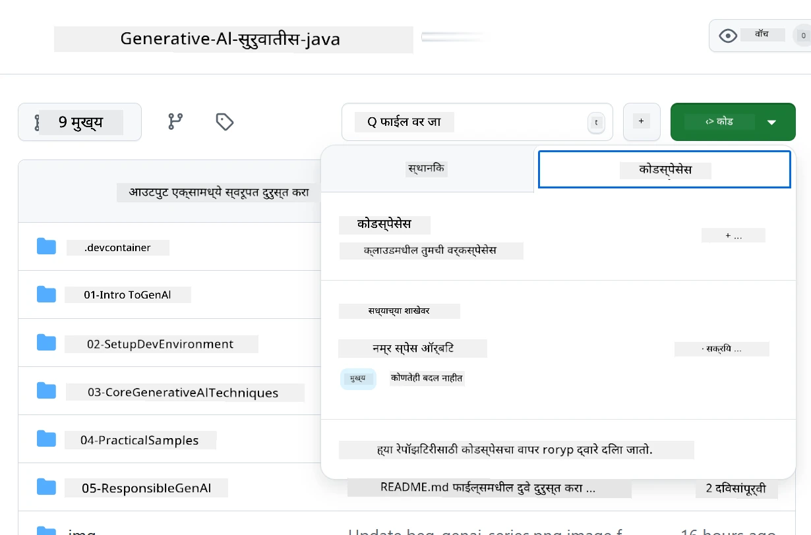
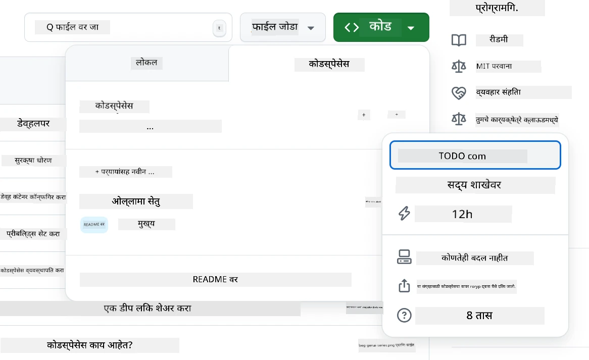
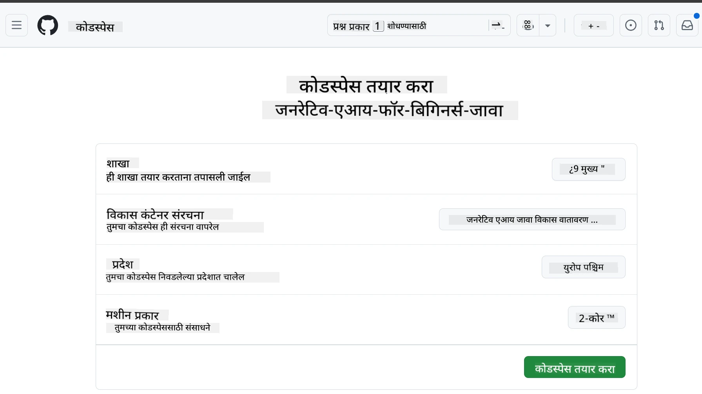
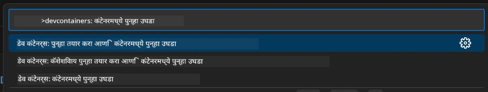
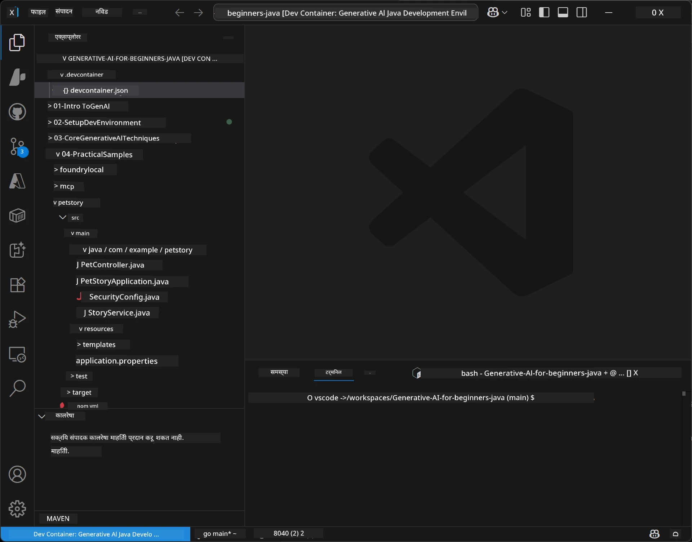
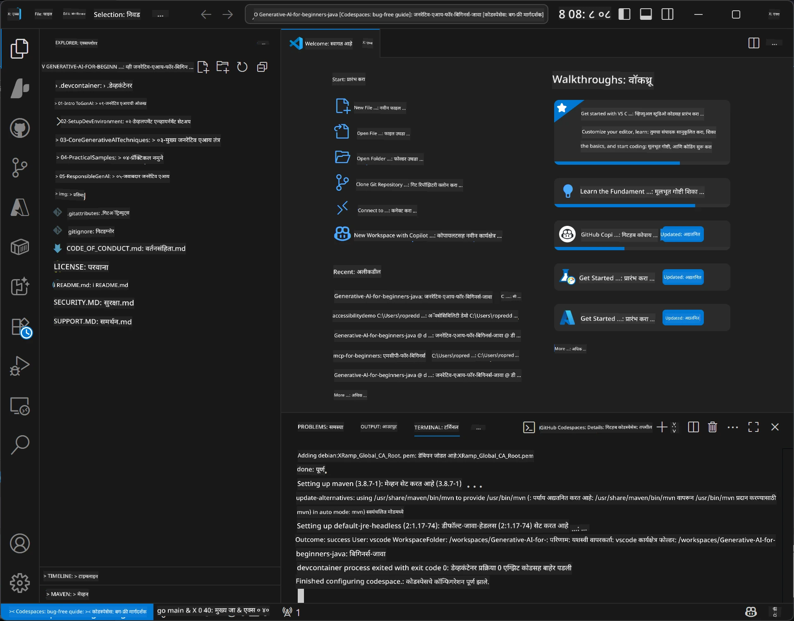

# Java साठी जनरेटिव्ह AI साठी विकास वातावरण सेट करणे

> **जलद प्रारंभ**: 2 मिनिटांत क्लाउडमध्ये कोड करा - [GitHub Codespaces सेटअप](../../../02-SetupDevEnvironment) येथे जा - कुठलीही लोकल इंस्टॉलेशन आवश्यक नाही आणि GitHub मॉडेल्स वापरतो!

> **Azure OpenAI मध्ये रस आहे?**, आमचा [Azure OpenAI सेटअप मार्गदर्शक](getting-started-azure-openai.md) पहा ज्यात नवीन Azure OpenAI संसाधन तयार करण्याच्या टप्प्यांचा समावेश आहे.

## आपण काय शिकाल

- AI अनुप्रयोगांसाठी Java विकास वातावरण सेट करणे
- आपले प्राधान्यक्रमानुसार विकास वातावरण निवडणे आणि कॉन्फिगर करणे (Codespaces सह क्लाउड-प्रथम, लोकल डेव कंटेनर, किंवा पूर्ण लोकल सेटअप)
- GitHub मॉडेल्सशी कनेक्ट होऊन आपल्या सेटअपची चाचणी करणे

## अनुक्रमणिका

- [आपण काय शिकाल](../../../02-SetupDevEnvironment)
- [परिचय](../../../02-SetupDevEnvironment)
- [टप्पा 1: आपले विकास वातावरण सेट करा](../../../02-SetupDevEnvironment)
  - [पर्याय A: GitHub Codespaces (शिफारस)](../../../02-SetupDevEnvironment)
  - [पर्याय B: लोकल डेव कंटेनर](../../../02-SetupDevEnvironment)
  - [पर्याय C: आपल्या विद्यमान लोकल इंस्टॉलेशनचा वापर करा](../../../02-SetupDevEnvironment)
- [टप्पा 2: GitHub वैयक्तिक प्रवेश टोकन तयार करा](../../../02-SetupDevEnvironment)
- [टप्पा 3: GitHub मॉडेल्स उदाहरणाने आपल्या सेटअपची चाचणी करा](../../../02-SetupDevEnvironment)
- [समस्या निवारण](../../../02-SetupDevEnvironment)
- [सारांश](../../../02-SetupDevEnvironment)
- [पुढील टप्पे](../../../02-SetupDevEnvironment)

## परिचय

हा अध्याय तुम्हाला विकास वातावरण सेट करण्यास मार्गदर्शन करील. आपण **GitHub मॉडेल्स** आपला मुख्य उदाहरण म्हणून वापरणार आहोत कारण ते मुक्त आहे, फक्त GitHub खात्यासह सहज सेट करता येते, क्रेडिट कार्ड आवश्यक नाही आणि प्रयोगासाठी अनेक मॉडेल्सवर प्रवेश देते.

**कोणतेही लोकल सेटअप आवश्यक नाही!** आपण GitHub Codespaces वापरून आपल्या ब्राउझरमध्ये पूर्ण विकास वातावरणात त्वरित कोडिंग सुरू करू शकता.


आम्ही या कोर्ससाठी [**GitHub मॉडेल्स**](https://github.com/marketplace?type=models) वापरण्याचा सल्ला देतो कारण ते:
- प्रारंभ करण्यासाठी **मुक्त**
- फक्त GitHub खात्यासह **सुलभ** सेटअप
- **क्रेडिट कार्ड आवश्यक नाही**
- **एकाधिक मॉडेल्स** प्रयोगासाठी उपलब्ध

> **टीप**: या प्रशिक्षणात वापरल्या जाणार्‍या GitHub मॉडेल्ससाठी खालील मोफत मर्यादा आहेत:
> - प्रति मिनिट 15 विनंत्या (दररोज 150)
> - एका विनंतीत साधारणपणे 8,000 शब्द इन आणि 4,000 शब्द आउट
> - 5 समांतर विनंत्या
> 
> व्यावसायिक वापरासाठी, आपल्या Azure खात्याने Azure AI Foundry मॉडेल्समध्ये अपग्रेड करा. आपला कोड बदलण्याची गरज नाही. पाहा [Azure AI Foundry दस्तऐवज](https://learn.microsoft.com/azure/ai-foundry/foundry-models/how-to/quickstart-github-models).

## टप्पा 1: आपले विकास वातावरण सेट करा

<a name="quick-start-cloud"></a>

आम्ही या Generative AI for Java कोर्ससाठी आवश्यक साधने आणि सेटअप वेळ कमी करण्यासाठी एक पूर्व-कॉन्फिगर केलेला विकास कंटेनर तयार केला आहे. आपला प्राधान्यक्रम निवडा:

### वातावरण सेटअप पर्याय:

#### पर्याय A: GitHub Codespaces (शिफारस)

**2 मिनिटांत कोडिंग सुरू करा - कोणताही लोकल सेटअप आवश्यक नाही!**

1. हा रेपॉझिटरी आपल्या GitHub खात्यावर Fork करा
   > **टीप**: मूलभूत कॉन्फिग संपादित करायची असल्यास कृपया [Dev Container Configuration](../../../.devcontainer/devcontainer.json) पहा
2. क्लिक करा **Code** → **Codespaces** टॅब → **...** → **New with options...**
3. डीफॉल्ट्स वापरा – यामुळे निवडले जाईल **Dev container configuration**: या कोर्ससाठी तयार केलेले **Generative AI Java Development Environment** कस्टम devcontainer
4. क्लिक करा **Create codespace**
5. साधारण 2 मिनिटे प्रतीक्षा करा जेव्हा पर्यावरण तयार होईल
6. पुढे जा [टप्पा 2: GitHub टोकन तयार करा](../../../02-SetupDevEnvironment)







> **Codespaces चे फायदे**:
> - कोणतीही लोकल इंस्टॉलेशन आवश्यक नाही
> - कोणीही ब्राउझर असलेल्या कोणत्याही डिव्हाइसवर चालते
> - सर्व साधने आणि अवलंबनांसह पूर्व-कॉन्फिगर केलेले
> - वैयक्तिक खात्यांसाठी दरमहा 60 मोफत तास
> - सर्व विद्यार्थ्यांसाठी सुसंगत वातावरण

#### पर्याय B: लोकल डेव कंटेनर

**डॉकरे वापरून लोकल विकास प्राधान्य देणाऱ्या विकसकांसाठी**

1. हा रेपॉझिटरी Fork करा आणि क्लोन करा आपल्या लोकल मशीनवर
   > **टीप**: मूलभूत कॉन्फिग संपादित करायची असल्यास कृपया [Dev Container Configuration](../../../.devcontainer/devcontainer.json) पहा
2. [Docker Desktop](https://www.docker.com/products/docker-desktop/) आणि [VS Code](https://code.visualstudio.com/) इंस्टॉल करा
3. VS Code मध्ये [Dev Containers विस्तार](https://marketplace.visualstudio.com/items?itemName=ms-vscode-remote.remote-containers) इंस्टॉल करा
4. VS Code मध्ये रेपॉझिटरी फोल्डर उघडा
5. जेव्हा सूचना येईल, तेव्हा क्लिक करा **Reopen in Container** (किंवा `Ctrl+Shift+P` → "Dev Containers: Reopen in Container" वापरा)
6. कंटेनर तयार होईपर्यंत आणि सुरू होईपर्यंत प्रतीक्षा करा
7. पुढे जा [टप्पा 2: GitHub टोकन तयार करा](../../../02-SetupDevEnvironment)





#### पर्याय C: आपल्या विद्यमान लोकल इंस्टॉलेशनचा वापर करा

**विद्यमान Java वातावरण असलेल्या विकसकांसाठी**

पूर्वापेक्षा:
- [Java 21+](https://www.oracle.com/java/technologies/javase/jdk21-archive-downloads.html) 
- [Maven 3.9+](https://maven.apache.org/download.cgi)
- [VS Code](https://code.visualstudio.com) किंवा आपला प्राधान्यक्रम असलेले IDE

टप्पे:
1. हा रेपॉझिटरी आपल्या लोकल मशीनवर क्लोन करा
2. प्रकल्प आपल्या IDE मध्ये उघडा
3. पुढे जा [टप्पा 2: GitHub टोकन तयार करा](../../../02-SetupDevEnvironment)

> **प्रो टिप**: तुमच्याकडे कमी कॉन्फिगरेशन असलेली मशीन आहे पण लोकल VS Code हवे आहे? GitHub Codespaces वापरा! तुम्ही तुमच्या लोकल VS Code ला क्लाउड-होस्टेड Codespace शी कनेक्ट करू शकता, दोन्ही जगांच्या सर्वोत्तमांचा वापर करून.



## टप्पा 2: GitHub वैयक्तिक प्रवेश टोकन तयार करा

1. [GitHub सेटिंग्ज](https://github.com/settings/profile) वर जा आणि आपल्या प्रोफाइल मेन्यूमधून **Settings** निवडा.
2. डाव्या साइडबारमध्ये, क्लिक करा **Developer settings** (साधारणतः खालील बाजूला).
3. **Personal access tokens** अंतर्गत, क्लिक करा **Fine-grained tokens** (किंवा थेट हा [दुवा](https://github.com/settings/personal-access-tokens) वापरा).
4. क्लिक करा **Generate new token**.
5. "Token name" अंतर्गत, एक वर्णनात्मक नाव द्या (उदा. `GenAI-Java-Course-Token`).
6. एक कालावधी सेट करा (शिफारस: सुरक्षा चांगल्या साठी 7 दिवस).
7. "Resource owner" अंतर्गत, आपले वापरकर्ता खाते निवडा.
8. "Repository access" अंतर्गत, GitHub मॉडेल्ससाठी वापरल्या जाणार्‍या रेपॉझिटरीज निवडा (किंवा "सर्व रेपॉझिटरीज" आवश्यक असल्यास).
9. "Account permissions" मध्ये **Models** शोधा आणि ते **Read-only** सेट करा.
10. क्लिक करा **Generate token**.
11. **आपला टोकन आता कॉपी करा आणि सुरक्षित ठिकाणी जतन करा** – आपण पुन्हा ते पाहू शकणार नाही!

> **सुरक्षा टिप**: आपल्या प्रवेश टोकन्ससाठी आवश्यक त्या किमान अधिकारांचा आणि शक्य तितक्या कमी कालावधीचा वापर करा.

## टप्पा 3: GitHub मॉडेल्स उदाहरणाने आपल्या सेटअपची चाचणी करा

एकदा आपले विकास वातावरण तयार झाले की, चला GitHub मॉडेल्सच्या एक उदाहरण अनुप्रयोगाद्वारे एकत्रीकरण तपासू या [`02-SetupDevEnvironment/examples/github-models`](../../../02-SetupDevEnvironment/examples/github-models) मध्ये.

1. आपल्या विकास वातावरणात टर्मिनल उघडा.
2. GitHub मॉडेल्स उदाहरणाकडे जा:
   ```bash
   cd 02-SetupDevEnvironment/examples/github-models
   ```
3. आपला GitHub टोकन पर्यावरण चल म्हणून सेट करा:
   ```bash
   # macOS/Linux
   export GITHUB_TOKEN=your_token_here
   
   # Windows (कमांड प्रॉम्प्ट)
   set GITHUB_TOKEN=your_token_here
   
   # Windows (पॉवरशेल)
   $env:GITHUB_TOKEN="your_token_here"
   ```

4. अनुप्रयोग चालवा:
   ```bash
   mvn compile exec:java -Dexec.mainClass="com.example.githubmodels.App"
   ```

आपल्याला खालीलप्रमाणे आउटपुट दिसले पाहिजे:
```text
Using model: gpt-4.1-nano
Sending request to GitHub Models...
Response: Hello World!
```

### उदाहरण कोड समजून घेणे

प्रथम, आपण काय चालवले ते समजूया. `examples/github-models` अंतर्गत उदाहरण OpenAI Java SDK वापरून GitHub मॉडेल्सशी कनेक्ट करते:

**हा कोड काय करतो:**
- आपला वैयक्तिक प्रवेश टोकन वापरून GitHub मॉडेल्सशी **कनेक्ट** करतो
- AI मॉडेलला "Say Hello World!" असा साधा संदेश **पाठवतो**
- AI चा प्रतिसाद **प्राप्त** करतो आणि प्रदर्शित करतो
- आपला सेटअप योग्यरित्या कार्यरत आहे का ते **चाचणी** करतो

**महत्वाचा अवलंब (pom.xml मध्ये):**
```xml
<dependency>
    <groupId>com.openai</groupId>
    <artifactId>openai-java</artifactId>
    <version>2.12.0</version>
</dependency>
```

**मुख्य कोड** (`App.java`):
```java
// OpenAI Java SDK वापरून GitHub मॉडेल्सशी कनेक्ट करा
OpenAIClient client = OpenAIOkHttpClient.builder()
    .apiKey(pat)
    .baseUrl("https://models.inference.ai.azure.com")
    .build();

// चॅट पूर्णत्व विनंती तयार करा
ChatCompletionCreateParams params = ChatCompletionCreateParams.builder()
    .model(modelId)
    .addSystemMessage("You are a concise assistant.")
    .addUserMessage("Say Hello World!")
    .build();

// AI प्रतिसाद मिळवा
ChatCompletion response = client.chat().completions().create(params);
System.out.println("Response: " + response.choices().get(0).message().content().orElse("No response content"));
```


## सारांश

छान! आता आपल्याकडे सर्व काही सेट आहे:

- AI मॉडेल्ससाठी योग्य परवानग्यांसह GitHub वैयक्तिक प्रवेश टोकन तयार केले
- आपले Java विकास वातावरण चालू केले (Codespaces, डेव कंटेनर्स किंवा लोकल)
- OpenAI Java SDK वापरून GitHub मॉडेल्सशी कनेक्ट केले मुक्त AI विकासासाठी
- AI मॉडेल्सशी बोलणाऱ्या साध्या उदाहरणासह सर्व काही कार्यरत असल्याची चाचणी केली

## पुढील टप्पे

[अध्याय 3: मुख्य जनरेटिव्ह AI तंत्रे](../03-CoreGenerativeAITechniques/README.md)

## समस्या निवारण

काही अडचणी येत आहेत? येथे सामान्य समस्या आणि उपाय आहेत:

- **टोकन कार्य करत नाही?**  
  - खात्री करा की आपण टोकन संपूर्ण आणि कोणतेही अतिरिक्त स्पेशल चिह्नांशिवाय कॉपी केले आहे  
  - पर्यावरण चल म्हणून टोकन योग्यरित्या सेट आहे की नाही ते तपासा  
  - आपल्या टोकनला योग्य परवानगी आहेत का तपासा (Models: Read-only)  

- **Maven सापडत नाही?**  
  - Dev कंटेनर/ Codespaces वापरत असाल तर Maven पूर्वच स्थापित असावा  
  - लोकल सेटअपसाठी Java 21+ आणि Maven 3.9+ स्थापित आहे का तपासा  
  - तपासा `mvn --version` चालवून स्थापना  

- **कनेक्शन समस्या?**  
  - इंटरनेट कनेक्शन तपासा  
  - GitHub आपल्या नेटवर्कवर पोहोचण्यायोग्य आहे का ते तपासा  
  - GitHub मॉडेल्स एंडपॉइंट ब्लॉक करणारा फायरवॉल नाही ना ते तपासा  

- **Dev कंटेनर सुरू होत नाही?**  
  - Docker Desktop चालू आहे का ते पहा (लोकल विकासासाठी)  
  - कंटेनर पुन्हा तयार करण्याचा प्रयत्न करा: `Ctrl+Shift+P` → "Dev Containers: Rebuild Container"  

- **अॅप्लिकेशन कंपाईल त्रुटी?**  
  - योग्य निर्देशिकेत आहात का तपासा: `02-SetupDevEnvironment/examples/github-models`  
  - प्रयत्न करा क्लीन आणि रीबिल्ड: `mvn clean compile`

> **मदतीची गरज आहे?** अजूनही अडचण येत असल्यास? रेपॉझिटरीत एक इश्यू ओपन करा, आम्ही मदत करू.

---

<!-- CO-OP TRANSLATOR DISCLAIMER START -->
**अस्वीकरण**:
हा दस्तऐवज AI अनुवाद सेवा [Co-op Translator](https://github.com/Azure/co-op-translator) वापरून अनुवादित केला आहे. आम्ही अचूकतेसाठी प्रयत्नशील असलो तरी, कृपया लक्षात घ्या की स्वयंचलित अनुवादांमध्ये चुका किंवा अपूर्णता असू शकते. मूळ दस्तऐवज आपल्या स्थानिक भाषेत अधिकृत स्रोत म्हणून मान्य केला पाहिजे. महत्त्वपूर्ण माहितीसाठी व्यावसायिक मानवी अनुवाद घेणे शिफारसीय आहे. या अनुवादाच्या वापरामुळे उद्भवलेल्या गैरसमजुती किंवा चुकीच्या अर्थाप्रती आम्ही जबाबदार नाही.
<!-- CO-OP TRANSLATOR DISCLAIMER END -->