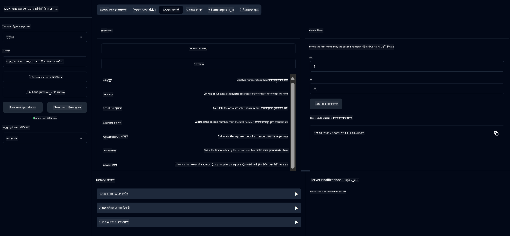

<!--
CO_OP_TRANSLATOR_METADATA:
{
  "original_hash": "7bf9a4a832911269a8bd0decb97ff36c",
  "translation_date": "2025-07-21T18:23:19+00:00",
  "source_file": "04-PracticalSamples/mcp/calculator/README.md",
  "language_code": "mr"
}
-->
# बेसिक कॅल्क्युलेटर MCP सेवा

>**Note**: या अध्यायात [**Tutorial**](./TUTORIAL.md) समाविष्ट आहे, जो तुम्हाला तयार नमुन्यांचे रनिंग करण्यासाठी मार्गदर्शन करतो.

**मॉडेल कॉन्टेक्स्ट प्रोटोकॉल (MCP)** सोबत तुमचा पहिला प्रत्यक्ष अनुभव घेण्यासाठी स्वागत आहे! मागील अध्यायांमध्ये, तुम्ही जनरेटिव्ह AI च्या मूलभूत गोष्टी शिकल्या आणि तुमचे डेव्हलपमेंट वातावरण सेट केले. आता काहीतरी व्यावहारिक तयार करण्याची वेळ आली आहे.

ही कॅल्क्युलेटर सेवा दाखवते की AI मॉडेल्स MCP चा वापर करून बाह्य साधनांशी सुरक्षितपणे कसे संवाद साधू शकतात. AI मॉडेलच्या कधीकधी अविश्वसनीय गणित क्षमतांवर अवलंबून राहण्याऐवजी, आम्ही तुम्हाला दाखवू की अचूक गणनांसाठी AI कसे विशेषीकृत सेवांना कॉल करू शकते.

## विषय सूची

- [तुम्ही काय शिकाल](../../../../../04-PracticalSamples/mcp/calculator)
- [पूर्वअट](../../../../../04-PracticalSamples/mcp/calculator)
- [महत्त्वाचे संकल्पना](../../../../../04-PracticalSamples/mcp/calculator)
- [जलद सुरुवात](../../../../../04-PracticalSamples/mcp/calculator)
- [उपलब्ध कॅल्क्युलेटर ऑपरेशन्स](../../../../../04-PracticalSamples/mcp/calculator)
- [टेस्ट क्लायंट्स](../../../../../04-PracticalSamples/mcp/calculator)
  - [1. डायरेक्ट MCP क्लायंट (SDKClient)](../../../../../04-PracticalSamples/mcp/calculator)
  - [2. AI-सक्षम क्लायंट (LangChain4jClient)](../../../../../04-PracticalSamples/mcp/calculator)
- [MCP निरीक्षक (वेब UI)](../../../../../04-PracticalSamples/mcp/calculator)
  - [स्टेप-बाय-स्टेप सूचना](../../../../../04-PracticalSamples/mcp/calculator)

## तुम्ही काय शिकाल

या उदाहरणावर काम करून, तुम्हाला समजेल:
- Spring Boot वापरून MCP-सुसंगत सेवा कशा तयार करायच्या
- थेट प्रोटोकॉल संवाद आणि AI-सक्षम संवाद यामधील फरक
- AI मॉडेल्स कधी आणि कसे बाह्य साधने वापरायचे ते कसे ठरवतात
- टूल-सक्षम AI अॅप्लिकेशन्स तयार करण्यासाठी सर्वोत्तम पद्धती

MCP संकल्पना शिकणाऱ्या आणि त्यांचे पहिले AI टूल इंटिग्रेशन तयार करण्यास तयार असलेल्या नवशिक्यांसाठी परिपूर्ण!

## पूर्वअट

- Java 21+
- Maven 3.6+
- **GitHub Token**: AI-सक्षम क्लायंटसाठी आवश्यक. जर तुम्ही हे सेट केले नसेल, तर [Chapter 2: Setting up your development environment](../../../02-SetupDevEnvironment/README.md) पहा.

## महत्त्वाचे संकल्पना

**मॉडेल कॉन्टेक्स्ट प्रोटोकॉल (MCP)** हा AI अॅप्लिकेशन्सना बाह्य साधनांशी सुरक्षितपणे कनेक्ट होण्यासाठी एक मानक मार्ग आहे. याला "ब्रिज" समजा, जो AI मॉडेल्सना आमच्या कॅल्क्युलेटरसारख्या बाह्य सेवांचा वापर करण्यास अनुमती देतो. AI मॉडेल स्वतः गणित करण्याचा प्रयत्न करण्याऐवजी (जे अविश्वसनीय असू शकते), ते अचूक निकाल मिळवण्यासाठी आमच्या कॅल्क्युलेटर सेवेला कॉल करू शकते. MCP हे सुनिश्चित करते की हा संवाद सुरक्षित आणि सातत्यपूर्ण होतो.

**सर्व्हर-सेंड इव्हेंट्स (SSE)** हे सर्व्हर आणि क्लायंट्समधील रिअल-टाइम संवाद सक्षम करतात. पारंपरिक HTTP विनंत्यांप्रमाणे, जिथे तुम्ही विचारता आणि प्रतिसादाची वाट पाहता, SSE सर्व्हरला सतत क्लायंटला अपडेट्स पाठवण्याची परवानगी देते. AI अॅप्लिकेशन्ससाठी हे परिपूर्ण आहे, जिथे प्रतिसाद स्ट्रीम केले जाऊ शकतात किंवा प्रक्रिया करण्यास वेळ लागू शकतो.

**AI टूल्स आणि फंक्शन कॉलिंग** AI मॉडेल्सना वापरकर्त्याच्या विनंतीनुसार बाह्य फंक्शन्स (जसे की कॅल्क्युलेटर ऑपरेशन्स) आपोआप निवडण्याची आणि वापरण्याची परवानगी देते. जेव्हा तुम्ही विचारता "15 + 27 किती आहे?", तेव्हा AI मॉडेलला समजते की तुम्हाला बेरीज हवी आहे, ते आपोआप योग्य पॅरामीटर्ससह (15, 27) आमच्या `add` टूलला कॉल करते आणि नैसर्गिक भाषेत निकाल परत करते. AI एक बुद्धिमान समन्वयक म्हणून कार्य करते, जो प्रत्येक टूल कधी आणि कसे वापरायचे हे जाणतो.

## जलद सुरुवात

### 1. कॅल्क्युलेटर अॅप्लिकेशन डिरेक्टरीकडे जा
```bash
cd Generative-AI-for-beginners-java/04-PracticalSamples/mcp/calculator
```

### 2. बिल्ड आणि रन करा
```bash
mvn clean install -DskipTests
java -jar target/calculator-server-0.0.1-SNAPSHOT.jar
```

### 3. क्लायंट्ससह चाचणी करा
- **SDKClient**: थेट MCP प्रोटोकॉल संवाद
- **LangChain4jClient**: AI-सक्षम नैसर्गिक भाषा संवाद (GitHub टोकन आवश्यक)

## उपलब्ध कॅल्क्युलेटर ऑपरेशन्स

- `add(a, b)`, `subtract(a, b)`, `multiply(a, b)`, `divide(a, b)`
- `power(base, exponent)`, `squareRoot(number)`, `absolute(number)`
- `modulus(a, b)`, `help()`

## टेस्ट क्लायंट्स

### 1. डायरेक्ट MCP क्लायंट (SDKClient)
कच्च्या MCP प्रोटोकॉल संवादाची चाचणी करते. चालवा:
```bash
mvn test-compile exec:java -Dexec.mainClass="com.microsoft.mcp.sample.client.SDKClient" -Dexec.classpathScope=test
```

### 2. AI-सक्षम क्लायंट (LangChain4jClient)
GitHub मॉडेल्ससह नैसर्गिक भाषा संवाद दाखवते. GitHub टोकन आवश्यक (पहा [पूर्वअट](../../../../../04-PracticalSamples/mcp/calculator)).

**चालवा:**
```bash
mvn test-compile exec:java -Dexec.mainClass="com.microsoft.mcp.sample.client.LangChain4jClient" -Dexec.classpathScope=test
```

## MCP निरीक्षक (वेब UI)

MCP निरीक्षक तुमच्या MCP सेवेस कोड न लिहिता चाचणी करण्यासाठी एक दृश्य वेब इंटरफेस प्रदान करतो. MCP कसे कार्य करते हे समजून घेण्यासाठी नवशिक्यांसाठी परिपूर्ण!

### स्टेप-बाय-स्टेप सूचना:

1. **कॅल्क्युलेटर सर्व्हर सुरू करा** (जर तो आधीच चालू नसेल):
   ```bash
   java -jar target/calculator-server-0.0.1-SNAPSHOT.jar
   ```

2. **MCP निरीक्षक इंस्टॉल करा आणि चालवा** नवीन टर्मिनलमध्ये:
   ```bash
   npx @modelcontextprotocol/inspector
   ```

3. **वेब इंटरफेस उघडा**:
   - "Inspector running at http://localhost:6274" असा संदेश शोधा
   - तुमच्या वेब ब्राउझरमध्ये तो URL उघडा

4. **तुमच्या कॅल्क्युलेटर सेवेशी कनेक्ट करा**:
   - वेब इंटरफेसमध्ये, ट्रान्सपोर्ट प्रकार "SSE" वर सेट करा
   - URL सेट करा: `http://localhost:8080/sse`
   - "Connect" बटणावर क्लिक करा

5. **उपलब्ध टूल्स एक्सप्लोर करा**:
   - "List Tools" वर क्लिक करा, सर्व कॅल्क्युलेटर ऑपरेशन्स पाहण्यासाठी
   - तुम्हाला `add`, `subtract`, `multiply` यांसारखे फंक्शन्स दिसतील

6. **कॅल्क्युलेटर ऑपरेशनची चाचणी करा**:
   - एखादे टूल निवडा (उदा., "add")
   - पॅरामीटर्स भरा (उदा., `a: 15`, `b: 27`)
   - "Run Tool" वर क्लिक करा
   - तुमच्या MCP सेवेद्वारे परत आलेला निकाल पहा!

हा दृश्य दृष्टिकोन तुम्हाला MCP संवाद कसा कार्य करतो हे समजून घेण्यास मदत करतो, तुमचे स्वतःचे क्लायंट तयार करण्यापूर्वी.



---
**संदर्भ:** [MCP Server Boot Starter Docs](https://docs.spring.io/spring-ai/reference/api/mcp/mcp-server-boot-starter-docs.html)

**अस्वीकरण**:  
हा दस्तऐवज AI भाषांतर सेवा [Co-op Translator](https://github.com/Azure/co-op-translator) वापरून भाषांतरित करण्यात आला आहे. आम्ही अचूकतेसाठी प्रयत्नशील असलो तरी कृपया लक्षात ठेवा की स्वयंचलित भाषांतरांमध्ये त्रुटी किंवा अचूकतेचा अभाव असू शकतो. मूळ भाषेतील दस्तऐवज हा अधिकृत स्रोत मानला जावा. महत्त्वाच्या माहितीसाठी व्यावसायिक मानवी भाषांतराची शिफारस केली जाते. या भाषांतराचा वापर करून निर्माण होणाऱ्या कोणत्याही गैरसमज किंवा चुकीच्या अर्थासाठी आम्ही जबाबदार नाही.