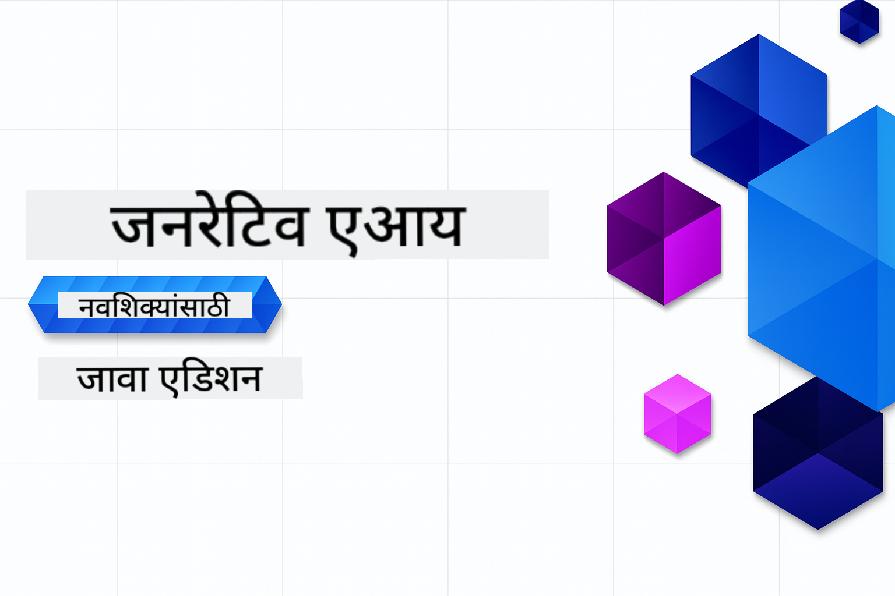

<!--
CO_OP_TRANSLATOR_METADATA:
{
  "original_hash": "64843fea021344d8e889dae94f46a9be",
  "translation_date": "2025-12-25T05:26:51+00:00",
  "source_file": "README.md",
  "language_code": "mr"
}
-->
# जनरेटिव्ह AI प्रारंभकर्त्यांसाठी - Java आवृत्ती
[](https://discord.gg/nTYy5BXMWG)



**वेळेची बांधिलकी**: संपूर्ण कार्यशाळा ऑनलाईन स्थानिक सेटअपशिवाय पूर्ण केली जाऊ शकते. पर्यावरण सेटअपसाठी 2 मिनिटे लागतात, नमुने तपासण्यासाठी 1-3 तास लागतील (शोधाच्या खोलीवर अवलंबून).

> **त्वरित प्रारंभ** 

1. हा रेपॉझिटरी आपल्या GitHub खात्यावर Fork करा
2. क्लिक करा **Code** → **Codespaces** टॅब → **...** → **New with options...**
3. डीफॉल्ट वापरा – यामुळे या कोर्ससाठी तयार केलेला Development container निवडला जाईल
4. क्लिक करा **Create codespace**
5. पर्यावरण तयार होण्यासाठी सुमारे 2 मिनिटे प्रतीक्षा करा
6. थेट [पहिले उदाहरण](./02-SetupDevEnvironment/README.md#step-2-create-a-github-personal-access-token) मध्ये जा

> **स्थानिकरित्या क्लोन करायला प्राधान्य आहे का?**
>
> हा रेपॉझिटरी 50+ भाषा अनुवाद समाविष्ट करतो ज्यामुळे डाउनलोडचा आकार मोठा होतो. अनुवादांशिवाय क्लोन करण्यासाठी sparse checkout वापरा:
> ```bash
> git clone --filter=blob:none --sparse https://github.com/microsoft/Generative-AI-for-beginners-java.git
> cd Generative-AI-for-beginners-java
> git sparse-checkout set --no-cone '/*' '!translations' '!translated_images'
> ```
> यामुळे तुम्हाला कोर्स पूर्ण करण्यासाठी आवश्यक असलेले सर्वकाही मिळते आणि डाउनलोड खूप वेगवान होते.


## बहुभाषी समर्थन

### GitHub Action द्वारे समर्थित (स्वयंचलित आणि नेहमी अद्ययावत)

<!-- CO-OP TRANSLATOR LANGUAGES TABLE START -->
[Arabic](../ar/README.md) | [Bengali](../bn/README.md) | [Bulgarian](../bg/README.md) | [Burmese (Myanmar)](../my/README.md) | [Chinese (Simplified)](../zh/README.md) | [Chinese (Traditional, Hong Kong)](../hk/README.md) | [Chinese (Traditional, Macau)](../mo/README.md) | [Chinese (Traditional, Taiwan)](../tw/README.md) | [Croatian](../hr/README.md) | [Czech](../cs/README.md) | [Danish](../da/README.md) | [Dutch](../nl/README.md) | [Estonian](../et/README.md) | [Finnish](../fi/README.md) | [French](../fr/README.md) | [German](../de/README.md) | [Greek](../el/README.md) | [Hebrew](../he/README.md) | [Hindi](../hi/README.md) | [Hungarian](../hu/README.md) | [Indonesian](../id/README.md) | [Italian](../it/README.md) | [Japanese](../ja/README.md) | [Kannada](../kn/README.md) | [Korean](../ko/README.md) | [Lithuanian](../lt/README.md) | [Malay](../ms/README.md) | [Malayalam](../ml/README.md) | [Marathi](./README.md) | [Nepali](../ne/README.md) | [Nigerian Pidgin](../pcm/README.md) | [Norwegian](../no/README.md) | [Persian (Farsi)](../fa/README.md) | [Polish](../pl/README.md) | [Portuguese (Brazil)](../br/README.md) | [Portuguese (Portugal)](../pt/README.md) | [Punjabi (Gurmukhi)](../pa/README.md) | [Romanian](../ro/README.md) | [Russian](../ru/README.md) | [Serbian (Cyrillic)](../sr/README.md) | [Slovak](../sk/README.md) | [Slovenian](../sl/README.md) | [Spanish](../es/README.md) | [Swahili](../sw/README.md) | [Swedish](../sv/README.md) | [Tagalog (Filipino)](../tl/README.md) | [Tamil](../ta/README.md) | [Telugu](../te/README.md) | [Thai](../th/README.md) | [Turkish](../tr/README.md) | [Ukrainian](../uk/README.md) | [Urdu](../ur/README.md) | [Vietnamese](../vi/README.md)
<!-- CO-OP TRANSLATOR LANGUAGES TABLE END -->

## कोर्स संरचना आणि शिकण्याचा मार्ग

### **प्रकरण 1: जनरेटिव्ह AI परिचय**
- **मुख्य संकल्पना**: Large Language Models, टोकन्स, एम्बेडिंग्ज, आणि AI क्षमता समजून घेणे
- **Java AI इकोसिस्टम**: Spring AI आणि OpenAI SDKs चे आढावा
- **Model Context Protocol**: MCP आणि AI एजंट संवादात त्याची भूमिका याचा परिचय
- **प्रॅक्टिकल अनुप्रयोग**: चैटबॉट आणि सामग्री निर्मिती यांसारख्या वास्तविक जीवनातील परिस्थिती
- **[→ प्रकरण 1 सुरू करा](./01-IntroToGenAI/README.md)**

### **प्रकरण 2: विकास पर्यावरण सेटअप**
- **अनेक प्रदात्यांचे कॉन्फिगरेशन**: GitHub Models, Azure OpenAI, आणि OpenAI Java SDK एकत्रीकरण सेट अप करा
- **Spring Boot + Spring AI**: एंटरप्राइझ AI अनुप्रयोग विकासासाठी सर्वोत्तम पद्धती
- **GitHub Models**: प्रोटोटायपिंग आणि शिकण्यासाठी मोफत AI मॉडेल प्रवेश (क्रेडिट कार्ड आवश्यक नाही)
- **विकास साधने**: Docker कंटेनर्स, VS Code, आणि GitHub Codespaces सेटअप
- **[→ प्रकरण 2 सुरू करा](./02-SetupDevEnvironment/README.md)**

### **प्रकरण 3: मूलभूत जनरेटिव्ह AI तंत्र**
- **प्रॉम्प्ट इंजिनीअरिंग**: AI मॉडेलच्या उत्तम प्रतिसादांसाठी तंत्र
- **एंबेडिंग्ज आणि व्हेक्टर ऑपरेशन्स**: सिमॅन्टिक शोध आणि साम्य जुळवणी अंमलात आणा
- **Retrieval-Augmented Generation (RAG)**: AI ला आपल्या स्वतःच्या डेटा स्रोतांसोबत जोडा
- **फंक्शन कॉलिंग**: कस्टम टूल्स आणि प्लगइन्सने AI क्षमता वाढवा
- **[→ प्रकरण 3 सुरू करा](./03-CoreGenerativeAITechniques/README.md)**

### **प्रकरण 4: प्रॅक्टिकल अनुप्रयोग आणि प्रकल्प**
- **Pet Story Generator** (`petstory/`): GitHub Models सह सर्जनशील सामग्री निर्मिती
- **Foundry Local Demo** (`foundrylocal/`): OpenAI Java SDK सह स्थानिक AI मॉडेल एकत्रीकरण
- **MCP Calculator Service** (`calculator/`): Spring AI सह बेसिक Model Context Protocol अमलात आणणे
- **[→ प्रकरण 4 सुरू करा](./04-PracticalSamples/README.md)**

### **प्रकरण 5: जबाबदार AI विकास**
- **GitHub Models सुरक्षा**: बिल्ट-इन कंटेंट फिल्टरिंग आणि सुरक्षा यंत्रणा (हार्ड ब्लॉक्स आणि सॉफ्ट नकार) चाचणी करा
- **Responsible AI Demo**: प्रत्यक्ष उदाहरण जे आधुनिक AI सुरक्षा प्रणाली प्रत्यक्षात कशी कार्य करतात ते दाखवते
- **सर्वोत्तम पद्धती**: नैतिक AI विकास आणि तैनातीसाठी आवश्यक मार्गदर्शक तत्वे
- **[→ प्रकरण 5 सुरू करा](./05-ResponsibleGenAI/README.md)**

## अतिरिक्त संसाधने

<!-- CO-OP TRANSLATOR OTHER COURSES START -->
### LangChain
[](https://aka.ms/langchain4j-for-beginners)
[](https://aka.ms/langchainjs-for-beginners?WT.mc_id=m365-94501-dwahlin)

---

### Azure / Edge / MCP / Agents
[](https://github.com/microsoft/AZD-for-beginners?WT.mc_id=academic-105485-koreyst)
[](https://github.com/microsoft/edgeai-for-beginners?WT.mc_id=academic-105485-koreyst)
[](https://github.com/microsoft/mcp-for-beginners?WT.mc_id=academic-105485-koreyst)
[](https://github.com/microsoft/ai-agents-for-beginners?WT.mc_id=academic-105485-koreyst)

---
 
### जनरेटिव्ह AI सिरीज
[](https://github.com/microsoft/generative-ai-for-beginners?WT.mc_id=academic-105485-koreyst)
[-9333EA?style=for-the-badge&labelColor=E5E7EB&color=9333EA)](https://github.com/microsoft/Generative-AI-for-beginners-dotnet?WT.mc_id=academic-105485-koreyst)
[-C084FC?style=for-the-badge&labelColor=E5E7EB&color=C084FC)](https://github.com/microsoft/generative-ai-for-beginners-java?WT.mc_id=academic-105485-koreyst)
[-E879F9?style=for-the-badge&labelColor=E5E7EB&color=E879F9)](https://github.com/microsoft/generative-ai-with-javascript?WT.mc_id=academic-105485-koreyst)

---
 
### मुख्य शिक्षण
[](https://aka.ms/ml-beginners?WT.mc_id=academic-105485-koreyst)
[](https://aka.ms/datascience-beginners?WT.mc_id=academic-105485-koreyst)
[](https://aka.ms/ai-beginners?WT.mc_id=academic-105485-koreyst)
[](https://github.com/microsoft/Security-101?WT.mc_id=academic-96948-sayoung)
[](https://aka.ms/webdev-beginners?WT.mc_id=academic-105485-koreyst)
[](https://aka.ms/iot-beginners?WT.mc_id=academic-105485-koreyst)
[](https://github.com/microsoft/xr-development-for-beginners?WT.mc_id=academic-105485-koreyst)

---
 
### Copilot मालिका
[](https://aka.ms/GitHubCopilotAI?WT.mc_id=academic-105485-koreyst)
[](https://github.com/microsoft/mastering-github-copilot-for-dotnet-csharp-developers?WT.mc_id=academic-105485-koreyst)
[](https://github.com/microsoft/CopilotAdventures?WT.mc_id=academic-105485-koreyst)
<!-- CO-OP TRANSLATOR OTHER COURSES END -->

## मदत मिळवा

जर तुम्ही अडकलेले असाल किंवा AI अॅप्स तयार करताना काही प्रश्न असतील, तर साथीच्या शिकणाऱ्यांसोबत आणि अनुभवी विकासकांसोबत MCP विषयी चर्चेत सामील व्हा. हे एक पाठिंबा देणारे समुदाय आहे जिथे प्रश्नांचे स्वागत केले जाते आणि ज्ञान मोकळेपणाने सामायिक केले जाते.

[](https://discord.gg/nTYy5BXMWG)

जर तुम्हाला उत्पादनाबद्दल अभिप्राय असेल किंवा तयार करताना त्रुटी आढळल्या असतील तर येथे भेट द्या:

[](https://aka.ms/foundry/forum)

---

<!-- CO-OP TRANSLATOR DISCLAIMER START -->
अस्वीकरण:
हा दस्तऐवज AI अनुवाद सेवा Co-op Translator (https://github.com/Azure/co-op-translator) वापरून अनुवादित केला आहे. आम्ही अचूकतेसाठी प्रयत्न करतो; तरीही कृपया लक्षात ठेवा की स्वयंचलित अनुवादांमध्ये चुका किंवा अपूर्णता असू शकते. मूळ दस्तऐवज त्याच्या मूळ भाषेत अधिकृत स्रोत मानला जावा. महत्वाच्या बाबींकरिता व्यावसायिक मानवी अनुवादाची शिफारस केली जाते. या अनुवादाच्या वापरामुळे उद्भवणाऱ्या कोणत्याही गैरसमजुतीं किंवा चुकीच्या अर्थलावांसाठी आम्ही जबाबदार नाही.
<!-- CO-OP TRANSLATOR DISCLAIMER END -->