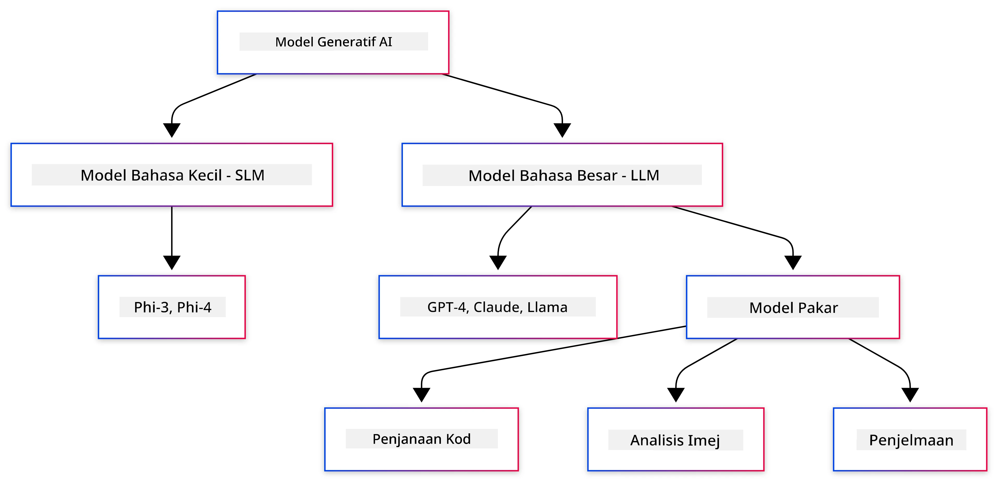
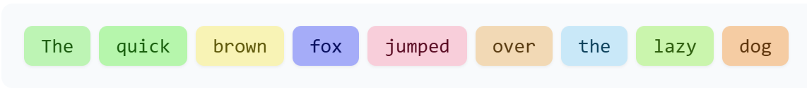
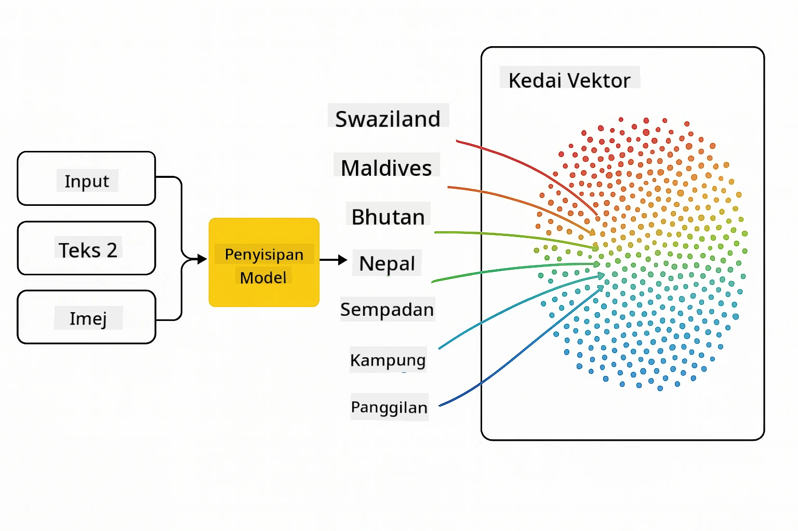
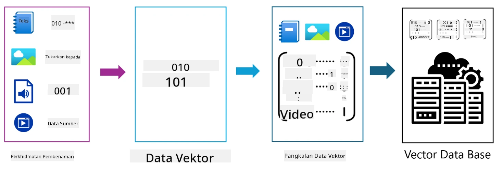
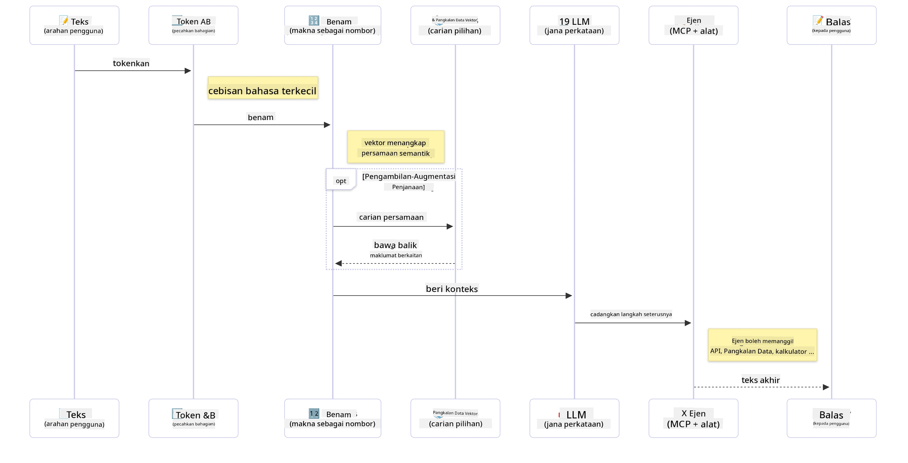

# Pengenalan kepada Generative AI - Edisi Java

## Apa yang Anda Akan Pelajari

- **Asas Generative AI** termasuk LLM, kejuruteraan prompt, token, embedding, dan pangkalan data vektor
- **Membandingkan alat pembangunan AI untuk Java** termasuk Azure OpenAI SDK, Spring AI, dan OpenAI Java SDK
- **Meneroka Protokol Konteks Model** dan peranannya dalam komunikasi agen AI

## Kandungan

- [Pengenalan](../../../01-IntroToGenAI)
- [Penyegaran pantas tentang konsep Generative AI](../../../01-IntroToGenAI)
- [Ulasan kejuruteraan prompt](../../../01-IntroToGenAI)
- [Token, embedding, dan agen](../../../01-IntroToGenAI)
- [Alat dan Perpustakaan Pembangunan AI untuk Java](../../../01-IntroToGenAI)
  - [OpenAI Java SDK](../../../01-IntroToGenAI)
  - [Spring AI](../../../01-IntroToGenAI)
  - [Azure OpenAI Java SDK](../../../01-IntroToGenAI)
- [Ringkasan](../../../01-IntroToGenAI)
- [Langkah Seterusnya](../../../01-IntroToGenAI)

## Pengenalan

Selamat datang ke bab pertama Generative AI untuk Pemula - Edisi Java! Pelajaran asas ini memperkenalkan anda kepada konsep utama generative AI dan cara menggunakannya dengan Java. Anda akan mempelajari blok binaan penting untuk aplikasi AI, termasuk Model Bahasa Besar (LLM), token, embedding, dan agen AI. Kami juga akan meneroka alat utama Java yang akan anda gunakan sepanjang kursus ini.

### Penyegaran pantas tentang konsep Generative AI

Generative AI adalah sejenis kecerdasan buatan yang mencipta kandungan baru, seperti teks, imej, atau kod, berdasarkan corak dan hubungan yang dipelajari daripada data. Model generative AI boleh menghasilkan respons seperti manusia, memahami konteks, dan kadangkala mencipta kandungan yang kelihatan seperti manusia.

Semasa anda membangunkan aplikasi AI Java anda, anda akan bekerja dengan **model generative AI** untuk mencipta kandungan. Beberapa keupayaan model generative AI termasuk:

- **Penjanaan Teks**: Menghasilkan teks seperti manusia untuk chatbot, kandungan, dan pelengkap teks.
- **Penjanaan dan Analisis Imej**: Menghasilkan imej realistik, meningkatkan foto, dan mengesan objek.
- **Penjanaan Kod**: Menulis potongan kod atau skrip.

Terdapat jenis model tertentu yang dioptimumkan untuk tugas yang berbeza. Sebagai contoh, **Model Bahasa Kecil (SLM)** dan **Model Bahasa Besar (LLM)** boleh mengendalikan penjanaan teks, dengan LLM biasanya menawarkan prestasi yang lebih baik untuk tugas yang kompleks. Untuk tugas berkaitan imej, anda akan menggunakan model penglihatan khusus atau model multi-modal.

Sudah tentu, respons daripada model ini tidak selalu sempurna. Anda mungkin pernah mendengar tentang model yang "berhalusinasi" atau menghasilkan maklumat yang salah dengan cara yang meyakinkan. Tetapi anda boleh membantu membimbing model untuk menghasilkan respons yang lebih baik dengan memberikan arahan dan konteks yang jelas. Di sinilah **kejuruteraan prompt** memainkan peranan.

#### Ulasan kejuruteraan prompt

Kejuruteraan prompt adalah amalan mereka bentuk input yang berkesan untuk membimbing model AI ke arah output yang diingini. Ia melibatkan:

- **Kejelasan**: Membuat arahan yang jelas dan tidak samar-samar.
- **Konteks**: Memberikan maklumat latar belakang yang diperlukan.
- **Kekangan**: Menentukan sebarang had atau format.

Beberapa amalan terbaik untuk kejuruteraan prompt termasuk reka bentuk prompt, arahan yang jelas, pemecahan tugas, pembelajaran satu-shot dan few-shot, serta penalaan prompt. Ujian pelbagai prompt adalah penting untuk mencari apa yang paling sesuai untuk kes penggunaan anda.

Semasa membangunkan aplikasi, anda akan bekerja dengan jenis prompt yang berbeza:
- **Prompt sistem**: Menetapkan peraturan asas dan konteks untuk tingkah laku model
- **Prompt pengguna**: Data input daripada pengguna aplikasi anda
- **Prompt pembantu**: Respons model berdasarkan prompt sistem dan pengguna

> **Ketahui lebih lanjut**: Ketahui lebih lanjut tentang kejuruteraan prompt dalam [bab Kejuruteraan Prompt kursus GenAI untuk Pemula](https://github.com/microsoft/generative-ai-for-beginners/tree/main/04-prompt-engineering-fundamentals)

#### Token, embedding, dan agen

Semasa bekerja dengan model generative AI, anda akan menemui istilah seperti **token**, **embedding**, **agen**, dan **Protokol Konteks Model (MCP)**. Berikut adalah gambaran terperinci tentang konsep ini:

- **Token**: Token adalah unit teks terkecil dalam model. Ia boleh berupa perkataan, aksara, atau subperkataan. Token digunakan untuk mewakili data teks dalam format yang boleh difahami oleh model. Sebagai contoh, ayat "The quick brown fox jumped over the lazy dog" mungkin ditokenkan sebagai ["The", " quick", " brown", " fox", " jumped", " over", " the", " lazy", " dog"] atau ["The", " qu", "ick", " br", "own", " fox", " jump", "ed", " over", " the", " la", "zy", " dog"] bergantung pada strategi tokenisasi.

Tokenisasi adalah proses memecahkan teks kepada unit-unit kecil ini. Ini penting kerana model beroperasi pada token dan bukannya teks mentah. Bilangan token dalam prompt mempengaruhi panjang dan kualiti respons model, kerana model mempunyai had token untuk tetingkap konteks mereka (contohnya, 128K token untuk konteks total GPT-4o, termasuk input dan output).

  Dalam Java, anda boleh menggunakan perpustakaan seperti OpenAI SDK untuk mengendalikan tokenisasi secara automatik semasa menghantar permintaan kepada model AI.

- **Embedding**: Embedding adalah representasi vektor token yang menangkap makna semantik. Ia adalah representasi berangka (biasanya tatasusunan nombor titik terapung) yang membolehkan model memahami hubungan antara perkataan dan menghasilkan respons yang relevan secara kontekstual. Perkataan yang serupa mempunyai embedding yang serupa, membolehkan model memahami konsep seperti sinonim dan hubungan semantik.

  Dalam Java, anda boleh menghasilkan embedding menggunakan OpenAI SDK atau perpustakaan lain yang menyokong penjanaan embedding. Embedding ini penting untuk tugas seperti carian semantik, di mana anda ingin mencari kandungan yang serupa berdasarkan makna dan bukannya padanan teks tepat.

- **Pangkalan data vektor**: Pangkalan data vektor adalah sistem penyimpanan khusus yang dioptimumkan untuk embedding. Ia membolehkan carian keserupaan yang cekap dan penting untuk corak Penjanaan Augmentasi Pengambilan (RAG) di mana anda perlu mencari maklumat yang relevan daripada set data besar berdasarkan keserupaan semantik dan bukannya padanan tepat.

> **Nota**: Dalam kursus ini, kami tidak akan merangkumi pangkalan data vektor tetapi menganggap ia patut disebut kerana ia sering digunakan dalam aplikasi dunia nyata.

- **Agen & MCP**: Komponen AI yang berinteraksi secara autonomi dengan model, alat, dan sistem luaran. Protokol Konteks Model (MCP) menyediakan cara standard untuk agen mengakses sumber data luaran dan alat dengan selamat. Ketahui lebih lanjut dalam kursus kami [MCP untuk Pemula](https://github.com/microsoft/mcp-for-beginners).

Dalam aplikasi AI Java, anda akan menggunakan token untuk pemprosesan teks, embedding untuk carian semantik dan RAG, pangkalan data vektor untuk pengambilan data, dan agen dengan MCP untuk membina sistem pintar yang menggunakan alat.

### Alat dan Perpustakaan Pembangunan AI untuk Java

Java menawarkan alat yang sangat baik untuk pembangunan AI. Terdapat tiga perpustakaan utama yang akan kita terokai sepanjang kursus ini - OpenAI Java SDK, Azure OpenAI SDK, dan Spring AI.

Berikut adalah jadual rujukan pantas yang menunjukkan SDK mana yang digunakan dalam contoh setiap bab:

| Bab | Contoh | SDK |
|-----|--------|-----|
| 02-SetupDevEnvironment | github-models | OpenAI Java SDK |
| 02-SetupDevEnvironment | basic-chat-azure | Spring AI Azure OpenAI |
| 03-CoreGenerativeAITechniques | examples | Azure OpenAI SDK |
| 04-PracticalSamples | petstory | OpenAI Java SDK |
| 04-PracticalSamples | foundrylocal | OpenAI Java SDK |
| 04-PracticalSamples | calculator | Spring AI MCP SDK + LangChain4j |

**Pautan Dokumentasi SDK:**
- [Azure OpenAI Java SDK](https://github.com/Azure/azure-sdk-for-java/tree/azure-ai-openai_1.0.0-beta.16/sdk/openai/azure-ai-openai)
- [Spring AI](https://docs.spring.io/spring-ai/reference/)
- [OpenAI Java SDK](https://github.com/openai/openai-java)
- [LangChain4j](https://docs.langchain4j.dev/)

#### OpenAI Java SDK

OpenAI SDK adalah perpustakaan Java rasmi untuk API OpenAI. Ia menyediakan antara muka yang mudah dan konsisten untuk berinteraksi dengan model OpenAI, menjadikannya mudah untuk mengintegrasikan keupayaan AI ke dalam aplikasi Java. Contoh GitHub Models dalam Bab 2, aplikasi Pet Story dalam Bab 4, dan contoh Foundry Local menunjukkan pendekatan OpenAI SDK.

#### Spring AI

Spring AI adalah rangka kerja komprehensif yang membawa keupayaan AI ke aplikasi Spring, menyediakan lapisan abstraksi yang konsisten merentasi penyedia AI yang berbeza. Ia berintegrasi dengan lancar dengan ekosistem Spring, menjadikannya pilihan ideal untuk aplikasi Java perusahaan yang memerlukan keupayaan AI.

Kekuatan Spring AI terletak pada integrasinya yang lancar dengan ekosistem Spring, menjadikannya mudah untuk membina aplikasi AI yang sedia untuk pengeluaran dengan corak Spring yang biasa seperti suntikan kebergantungan, pengurusan konfigurasi, dan rangka kerja ujian. Anda akan menggunakan Spring AI dalam Bab 2 dan 4 untuk membina aplikasi yang memanfaatkan kedua-dua OpenAI dan perpustakaan Spring AI Model Context Protocol (MCP).

##### Protokol Konteks Model (MCP)

[Protokol Konteks Model (MCP)](https://modelcontextprotocol.io/) adalah standard yang sedang berkembang yang membolehkan aplikasi AI berinteraksi dengan selamat dengan sumber data luaran dan alat. MCP menyediakan cara standard untuk model AI mengakses maklumat kontekstual dan melaksanakan tindakan dalam aplikasi anda.

Dalam Bab 4, anda akan membina perkhidmatan kalkulator MCP mudah yang menunjukkan asas-asas Protokol Konteks Model dengan Spring AI, menunjukkan cara mencipta integrasi alat asas dan seni bina perkhidmatan.

#### Azure OpenAI Java SDK

Perpustakaan klien Azure OpenAI untuk Java adalah adaptasi API REST OpenAI yang menyediakan antara muka idiomatik dan integrasi dengan seluruh ekosistem SDK Azure. Dalam Bab 3, anda akan membina aplikasi menggunakan Azure OpenAI SDK, termasuk aplikasi sembang, pemanggilan fungsi, dan corak RAG (Retrieval-Augmented Generation).

> Nota: Azure OpenAI SDK ketinggalan di belakang OpenAI Java SDK dari segi ciri, jadi untuk projek masa depan, pertimbangkan untuk menggunakan OpenAI Java SDK.

## Ringkasan

Itu merangkumi asas-asasnya! Anda kini memahami:

- Konsep utama di sebalik generative AI - daripada LLM dan kejuruteraan prompt kepada token, embedding, dan pangkalan data vektor
- Pilihan alat anda untuk pembangunan AI Java: Azure OpenAI SDK, Spring AI, dan OpenAI Java SDK
- Apa itu Protokol Konteks Model dan bagaimana ia membolehkan agen AI bekerja dengan alat luaran

## Langkah Seterusnya

[Bab 2: Menyediakan Persekitaran Pembangunan](../02-SetupDevEnvironment/README.md)

**Penafian**:  
Dokumen ini telah diterjemahkan menggunakan perkhidmatan terjemahan AI [Co-op Translator](https://github.com/Azure/co-op-translator). Walaupun kami berusaha untuk memastikan ketepatan, sila ambil maklum bahawa terjemahan automatik mungkin mengandungi kesilapan atau ketidaktepatan. Dokumen asal dalam bahasa asalnya harus dianggap sebagai sumber yang berwibawa. Untuk maklumat penting, terjemahan manusia profesional adalah disyorkan. Kami tidak bertanggungjawab atas sebarang salah faham atau salah tafsir yang timbul daripada penggunaan terjemahan ini.