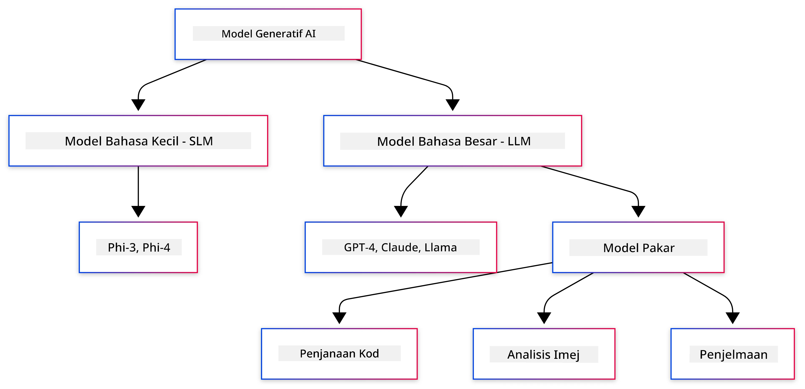
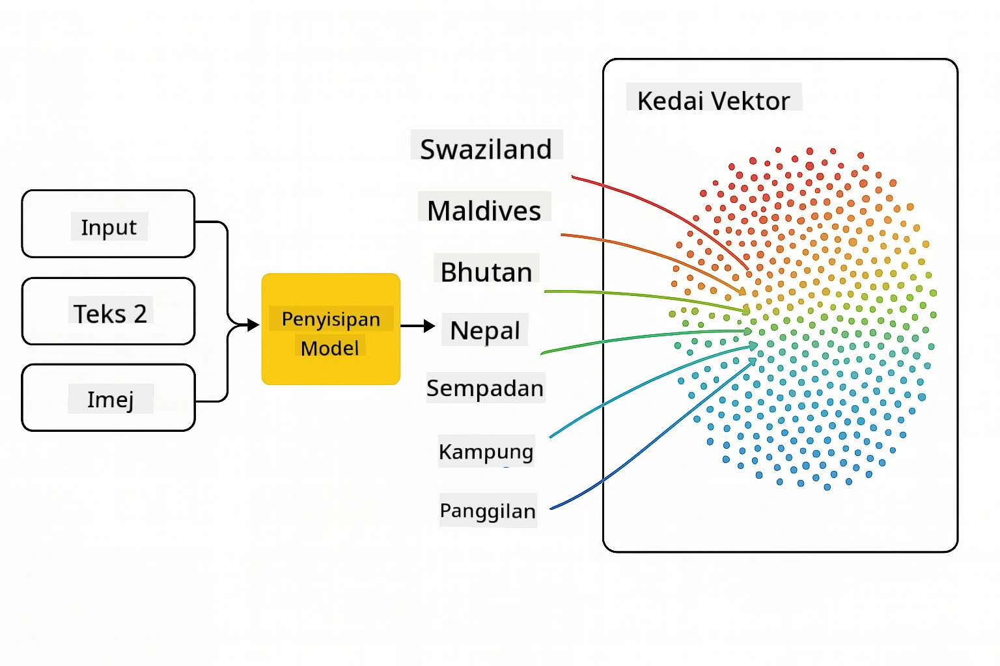
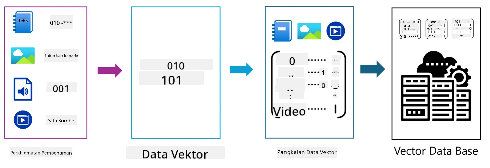
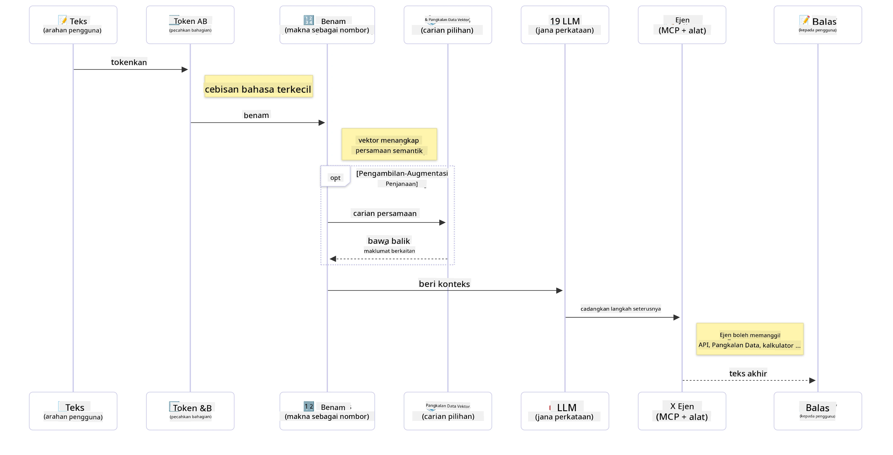

# Pengenalan kepada Generative AI - Edisi Java

> **Video**: [Tonton gambaran keseluruhan video untuk pelajaran ini di YouTube.](https://www.youtube.com/watch?v=XH46tGp_eSw) Anda juga boleh klik imej mini di atas.

## Apa yang Akan Anda Pelajari

- **Asas Generative AI** termasuk LLM, kejuruteraan prompt, token, embedding, dan pangkalan data vektor  
- **Bandingkan alat pembangunan AI Java** termasuk Azure OpenAI SDK, Spring AI, dan OpenAI Java SDK  
- **Temui Protokol Konteks Model** dan peranannya dalam komunikasi ejen AI  

## Jadual Kandungan

- [Pengenalan](#pengenalan)
- [Ulasan cepat mengenai konsep Generative AI](#ulasan-cepat-mengenai-konsep-generative-ai)
- [Ulasan kejuruteraan prompt](#ulasan-kejuruteraan-prompt)
- [Token, embedding, dan ejen](#token-embedding-dan-ejen)
- [Alat dan Perpustakaan Pembangunan AI untuk Java](#alat-dan-perpustakaan-pembangunan-ai-untuk-java)
  - [OpenAI Java SDK](#openai-java-sdk)
  - [Spring AI](#spring-ai)
  - [Azure OpenAI Java SDK](#azure-openai-java-sdk)
- [Ringkasan](#ringkasan)
- [Langkah Seterusnya](#langkah-seterusnya)

## Pengenalan

Selamat datang ke bab pertama Generative AI untuk Pemula - Edisi Java! Pelajaran asas ini memperkenalkan anda kepada konsep teras generative AI dan bagaimana bekerja dengan mereka menggunakan Java. Anda akan mempelajari blok binaan penting aplikasi AI, termasuk Model Bahasa Besar (LLM), token, embedding, dan ejen AI. Kami juga akan meneroka alat utama Java yang akan anda gunakan sepanjang kursus ini.

### Ulasan cepat mengenai konsep Generative AI

Generative AI adalah jenis kecerdasan buatan yang mencipta kandungan baru, seperti teks, imej, atau kod, berdasarkan corak dan hubungan yang dipelajari dari data. Model generative AI boleh menghasilkan respons seperti manusia, memahami konteks, dan kadang-kadang bahkan mencipta kandungan yang kelihatan seperti manusia.

Semasa anda membangunkan aplikasi AI Java anda, anda akan bekerja dengan **model generative AI** untuk mencipta kandungan. Beberapa keupayaan model generative AI termasuk:

- **Penjanaan Teks**: Membina teks seperti manusia untuk chatbot, kandungan, dan pelengkap teks.  
- **Penjanaan dan Analisis Imej**: Menghasilkan imej realistik, meningkatkan foto, dan mengesan objek.  
- **Penjanaan Kod**: Menulis petikan kod atau skrip.  

Terdapat jenis model khusus yang dioptimumkan untuk tugas yang berbeza. Sebagai contoh, kedua-dua **Model Bahasa Kecil (SLM)** dan **Model Bahasa Besar (LLM)** boleh menangani penjanaan teks, dengan LLM biasanya menawarkan prestasi lebih baik untuk tugas yang kompleks. Untuk tugas berkaitan imej, anda akan menggunakan model visi khusus atau model multi-modal.

Sudah tentu, respons daripada model ini tidak sempurna sepanjang masa. Anda mungkin pernah dengar mengenai model yang "mengarang" atau menjana maklumat salah dengan cara yang meyakinkan. Tetapi anda boleh membantu mengarahkan model untuk menghasilkan respons yang lebih baik dengan memberikan arahan dan konteks yang jelas. Di sinilah peranan **kejuruteraan prompt**.

#### Ulasan kejuruteraan prompt

Kejuruteraan prompt adalah amalan mereka bentuk input yang berkesan untuk membimbing model AI ke arah output yang dikehendaki. Ia merangkumi:

- **Kejelasan**: Membuat arahan yang jelas dan tiada kekaburan.  
- **Konteks**: Memberikan maklumat latar belakang yang diperlukan.  
- **Sekatan**: Menentukan had atau format yang dikehendaki.  

Beberapa amalan terbaik untuk kejuruteraan prompt termasuk reka bentuk prompt, arahan jelas, pecahan tugas, pembelajaran satu tembakan dan beberapa tembakan, dan penalaan prompt. Menguji pelbagai prompt adalah penting untuk mencari apa yang terbaik untuk kegunaan spesifik anda.

Semasa membangunkan aplikasi, anda akan bekerja dengan jenis prompt yang berbeza:  
- **Prompt sistem**: Tetapkan peraturan asas dan konteks untuk kelakuan model  
- **Prompt pengguna**: Data input dari pengguna aplikasi anda  
- **Prompt pembantu**: Respons model berdasarkan prompt sistem dan pengguna  

> **Ketahui lebih lanjut**: Ketahui lebih lanjut mengenai kejuruteraan prompt dalam [bab Kejuruteraan Prompt kursus GenAI untuk Pemula](https://github.com/microsoft/generative-ai-for-beginners/tree/main/04-prompt-engineering-fundamentals)

#### Token, embedding, dan ejen

Apabila bekerja dengan model generative AI, anda akan menemui istilah seperti **token**, **embedding**, **ejen**, dan **Protokol Konteks Model (MCP)**. Berikut adalah gambaran terperinci mengenai konsep-konsep ini:

- **Token**: Token adalah unit teks terkecil dalam model. Ia boleh berupa kata, aksara, atau subkata. Token digunakan untuk mewakili data teks dalam format yang boleh difahami model. Contohnya, ayat "The quick brown fox jumped over the lazy dog" mungkin diterjemahkan sebagai ["The", " quick", " brown", " fox", " jumped", " over", " the", " lazy", " dog"] atau ["The", " qu", "ick", " br", "own", " fox", " jump", "ed", " over", " the", " la", "zy", " dog"] bergantung pada strategi tokenisasi.

Tokenisasi ialah proses memecah teks kepada unit-unit kecil ini. Ini penting kerana model beroperasi pada token dan bukan teks mentah. Bilangan token dalam prompt mempengaruhi panjang dan kualiti respons model, kerana model mempunyai had token untuk tetingkap konteks mereka (contohnya, 128K token untuk jumlah konteks GPT-4o, termasuk input dan output).

  Dalam Java, anda boleh menggunakan perpustakaan seperti OpenAI SDK untuk mengendalikan tokenisasi secara automatik apabila menghantar permintaan ke model AI.

- **Embedding**: Embedding ialah representasi vektor token yang menangkap makna semantik. Ia adalah representasi berangka (biasanya tatasusunan nombor titik terapung) yang membolehkan model memahami hubungan antara perkataan dan menjana respons yang relevan secara kontekstual. Perkataan yang serupa mempunyai embedding yang serupa, membolehkan model memahami konsep seperti sinonim dan hubungan semantik.

  Dalam Java, anda boleh menjana embedding menggunakan OpenAI SDK atau perpustakaan lain yang menyokong penjanaan embedding. Embedding ini penting untuk tugas seperti carian semantik, di mana anda ingin mencari kandungan yang serupa berdasarkan makna dan bukan padanan teks tepat.

- **Pangkalan data vektor**: Pangkalan data vektor adalah sistem penyimpanan khusus yang dioptimumkan untuk embedding. Ia membolehkan carian kesamaan yang cekap dan penting untuk corak Penjanaan Dilengkapi Pengambilan (RAG) di mana anda perlu mencari maklumat relevan dari set data besar berdasarkan kesamaan semantik dan bukan padanan tepat.

> **Nota**: Dalam kursus ini, kami tidak akan membincangkan Pangkalan data vektor tetapi rasa ia patut disebut kerana ia sering digunakan dalam aplikasi dunia sebenar.

- **Ejen & MCP**: Komponen AI yang secara autonomi berinteraksi dengan model, alat, dan sistem luaran. Protokol Konteks Model (MCP) menyediakan cara standard untuk ejen mengakses sumber data dan alat luaran dengan selamat. Ketahui lebih lanjut dalam kursus [MCP untuk Pemula](https://github.com/microsoft/mcp-for-beginners).

Dalam aplikasi AI Java, anda akan menggunakan token untuk pemprosesan teks, embedding untuk carian semantik dan RAG, pangkalan data vektor untuk pengambilan data, dan ejen dengan MCP untuk membina sistem pintar yang menggunakan alat.

### Alat dan Perpustakaan Pembangunan AI untuk Java

Java menawarkan alat yang sangat baik untuk pembangunan AI. Terdapat tiga perpustakaan utama yang akan kita terokai sepanjang kursus ini - OpenAI Java SDK, Azure OpenAI SDK, dan Spring AI.

Berikut adalah jadual rujukan pantas yang menunjukkan SDK mana digunakan dalam contoh setiap bab:

| Bab | Contoh | SDK |
|---------|--------|-----|
| 02-SetupDevEnvironment | github-models | OpenAI Java SDK |
| 02-SetupDevEnvironment | basic-chat-azure | Spring AI Azure OpenAI |
| 03-CoreGenerativeAITechniques | examples | Azure OpenAI SDK |
| 04-PracticalSamples | petstory | OpenAI Java SDK |
| 04-PracticalSamples | foundrylocal | OpenAI Java SDK |
| 04-PracticalSamples | calculator | Spring AI MCP SDK + LangChain4j |

**Pautan Dokumentasi SDK:**  
- [Azure OpenAI Java SDK](https://github.com/Azure/azure-sdk-for-java/tree/azure-ai-openai_1.0.0-beta.16/sdk/openai/azure-ai-openai)  
- [Spring AI](https://docs.spring.io/spring-ai/reference/)  
- [OpenAI Java SDK](https://github.com/openai/openai-java)  
- [LangChain4j](https://docs.langchain4j.dev/)  

#### OpenAI Java SDK

OpenAI SDK adalah perpustakaan rasmi Java untuk OpenAI API. Ia menyediakan antara muka yang mudah dan konsisten untuk berinteraksi dengan model OpenAI, menjadikannya mudah untuk mengintegrasikan keupayaan AI ke dalam aplikasi Java. Contoh Model GitHub dalam Bab 2, aplikasi Cerita Haiwan Peliharaan dan contoh Foundry Local dalam Bab 4 menunjukkan pendekatan OpenAI SDK.

#### Spring AI

Spring AI adalah rangka kerja komprehensif yang membawa keupayaan AI ke aplikasi Spring, menyediakan lapisan abstraksi konsisten merentas pelbagai penyedia AI. Ia berintegrasi sempurna dengan ekosistem Spring, menjadikannya pilihan ideal untuk aplikasi Java perusahaan yang memerlukan keupayaan AI.

Kekuatan Spring AI terletak pada integrasinya yang lancar dengan ekosistem Spring, memudahkan membina aplikasi AI sedia untuk produksi dengan pola Spring yang biasa seperti suntikan kebergantungan, pengurusan konfigurasi, dan rangka kerja ujian. Anda akan menggunakan Spring AI dalam Bab 2 dan 4 untuk membina aplikasi yang memanfaatkan kedua-dua OpenAI dan Perpustakaan Model Context Protocol (MCP) Spring AI.

##### Protokol Konteks Model (MCP)

[Protokol Konteks Model (MCP)](https://modelcontextprotocol.io/) adalah standard yang sedang berkembang yang membolehkan aplikasi AI berinteraksi dengan selamat dengan sumber data dan alat luaran. MCP menyediakan cara standard untuk model AI mengakses maklumat konteks dan melaksanakan tindakan dalam aplikasi anda.

Dalam Bab 4, anda akan membina perkhidmatan kalkulator MCP ringkas yang menunjukkan asas-asas Protokol Konteks Model dengan Spring AI, mempamerkan cara mencipta integrasi alat asas dan seni bina perkhidmatan.

#### Azure OpenAI Java SDK

Perpustakaan klien Azure OpenAI untuk Java adalah adaptasi API REST OpenAI yang menyediakan antara muka idiomatik dan integrasi dengan ekosistem SDK Azure yang lain. Dalam Bab 3, anda akan membina aplikasi menggunakan Azure OpenAI SDK, termasuk aplikasi sembang, pemanggilan fungsi, dan corak RAG (Penjanaan Dilengkapi Pengambilan).

> Nota: Azure OpenAI SDK ketinggalan dari segi ciri berbanding OpenAI Java SDK jadi untuk projek masa depan, pertimbangkan untuk menggunakan OpenAI Java SDK.

## Ringkasan

Itu sahaja asasnya! Kini anda faham:

- Konsep teras di sebalik generative AI - daripada LLM dan kejuruteraan prompt kepada token, embedding, dan pangkalan data vektor  
- Pilihan alat pembangunan AI Java anda: Azure OpenAI SDK, Spring AI, dan OpenAI Java SDK  
- Apakah Protokol Konteks Model dan bagaimana ia membolehkan ejen AI bekerja dengan alat luaran  

## Langkah Seterusnya

[Bab 2: Menyiapkan Persekitaran Pembangunan](../02-SetupDevEnvironment/README.md)

---

<!-- CO-OP TRANSLATOR DISCLAIMER START -->
**Penafian**:  
Dokumen ini telah diterjemahkan menggunakan perkhidmatan terjemahan AI [Co-op Translator](https://github.com/Azure/co-op-translator). Walaupun kami berusaha untuk ketepatan, harap maklum bahawa terjemahan automatik mungkin mengandungi kesilapan atau ketidaktepatan. Dokumen asal dalam bahasa asalnya harus dianggap sebagai sumber yang sahih. Untuk maklumat penting, terjemahan profesional oleh manusia adalah disyorkan. Kami tidak bertanggungjawab terhadap sebarang salah faham atau salah tafsir yang timbul daripada penggunaan terjemahan ini.
<!-- CO-OP TRANSLATOR DISCLAIMER END -->