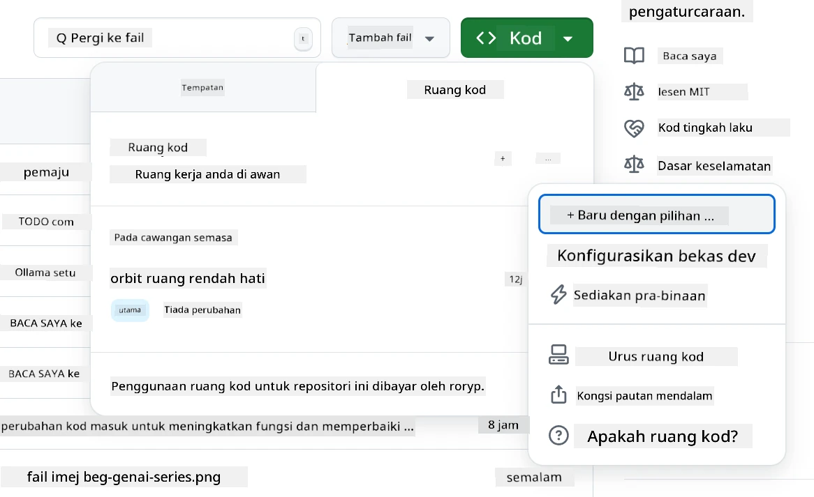
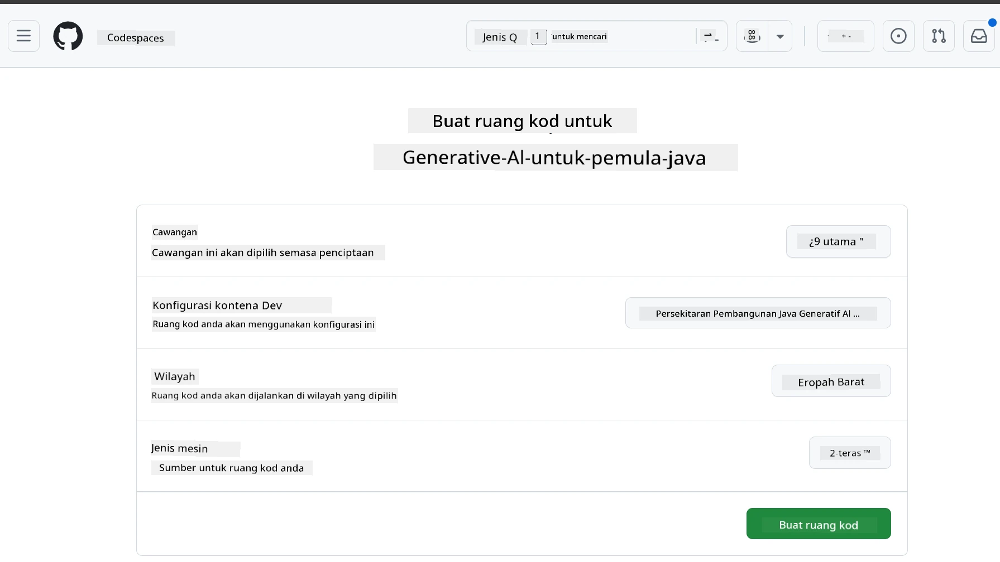
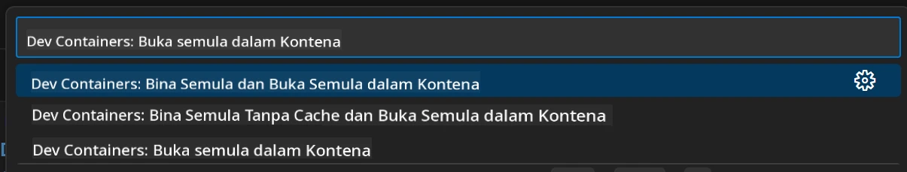
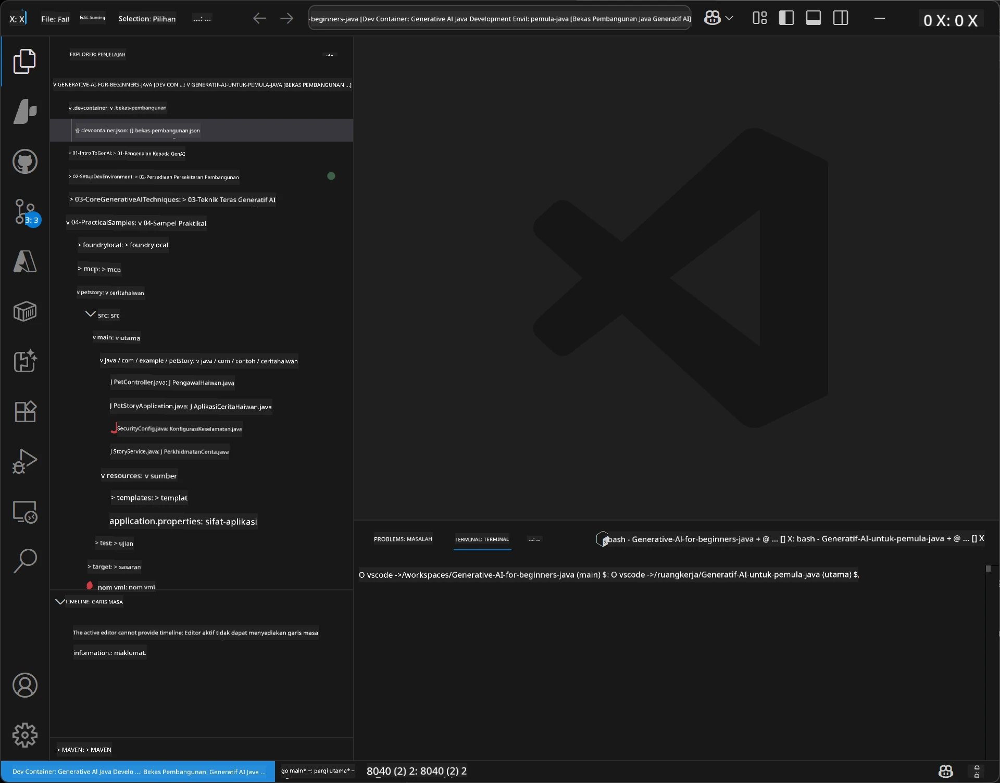
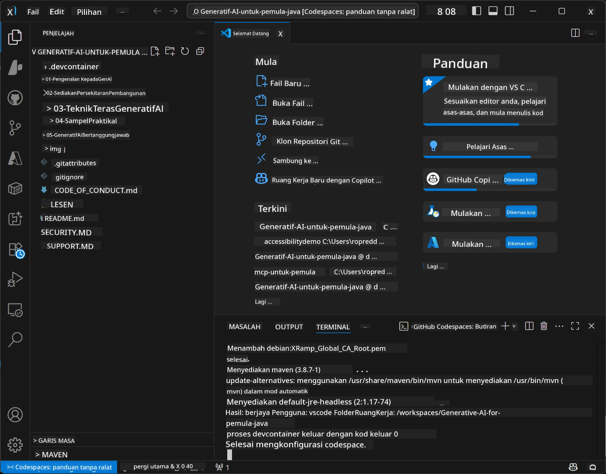

<!--
CO_OP_TRANSLATOR_METADATA:
{
  "original_hash": "96a30d42b9751a3d4e4b20e28d29d459",
  "translation_date": "2026-01-28T05:13:10+00:00",
  "source_file": "02-SetupDevEnvironment/README.md",
  "language_code": "ms"
}
-->
# Menyediakan Persekitaran Pembangunan untuk Generative AI bagi Java

> **Mula Cepat**: Kod dalam Awan dalam 2 minit - Lompat ke [Persediaan GitHub Codespaces](../../../02-SetupDevEnvironment) - tiada pemasangan tempatan diperlukan dan menggunakan model github!

> **Berminat dengan Azure OpenAI?**, lihat [Panduan Persediaan Azure OpenAI](getting-started-azure-openai.md) kami dengan langkah untuk mencipta sumber Azure OpenAI baru.

## Apa yang Anda Akan Pelajari

- Menyediakan persekitaran pembangunan Java untuk aplikasi AI
- Memilih dan mengkonfigurasi persekitaran pembangunan pilihan anda (utamakan awan dengan Codespaces, bekas dev tempatan, atau persediaan tempatan penuh)
- Uji persediaan anda dengan menyambung ke Model GitHub

## Jadual Kandungan

- [Apa yang Anda Akan Pelajari](../../../02-SetupDevEnvironment)
- [Pengenalan](../../../02-SetupDevEnvironment)
- [Langkah 1: Sediakan Persekitaran Pembangunan Anda](../../../02-SetupDevEnvironment)
  - [Pilihan A: GitHub Codespaces (Disyorkan)](../../../02-SetupDevEnvironment)
  - [Pilihan B: Bekas Dev Tempatan](../../../02-SetupDevEnvironment)
  - [Pilihan C: Gunakan Pemasangan Tempatan Sedia Ada Anda](../../../02-SetupDevEnvironment)
- [Langkah 2: Cipta Token Akses Peribadi GitHub](../../../02-SetupDevEnvironment)
- [Langkah 3: Uji Persediaan Anda](../../../02-SetupDevEnvironment)
- [Menyelesaikan Masalah](../../../02-SetupDevEnvironment)
- [Ringkasan](../../../02-SetupDevEnvironment)
- [Langkah Seterusnya](../../../02-SetupDevEnvironment)

## Pengenalan

Bab ini akan memandu anda melalui penyediaan persekitaran pembangunan. Kami akan menggunakan **Model GitHub** sebagai contoh utama kerana ia percuma, mudah disediakan dengan hanya akaun GitHub, tidak memerlukan kad kredit, dan menyediakan akses kepada pelbagai model untuk eksperimen.

**Tiada persediaan tempatan diperlukan!** Anda boleh mula menulis kod serta-merta menggunakan GitHub Codespaces, yang menyediakan persekitaran pembangunan penuh dalam pelayar anda.


Kami mengesyorkan menggunakan [**Model GitHub**](https://github.com/marketplace?type=models) untuk kursus ini kerana ia:
- **Percuma** untuk bermula
- **Mudah** disediakan hanya dengan akaun GitHub
- **Tiada kad kredit** diperlukan
- **Banyak model** tersedia untuk eksperimen

> **Nota**: Model GitHub yang digunakan dalam latihan ini mempunyai had percuma berikut:
> - 15 permintaan setiap minit (150 sehari)
> - ~8,000 perkataan masuk, ~4,000 perkataan keluar setiap permintaan
> - 5 permintaan serentak
> 
> Untuk penggunaan pengeluaran, naik taraf ke Model Azure AI Foundry dengan akaun Azure anda. Kod anda tidak perlu diubah. Lihat [dokumentasi Azure AI Foundry](https://learn.microsoft.com/azure/ai-foundry/foundry-models/how-to/quickstart-github-models).


## Langkah 1: Sediakan Persekitaran Pembangunan Anda

<a name="quick-start-cloud"></a>

Kami telah mencipta bekas pembangunan yang sudah dikonfigurasikan untuk meminimumkan masa persediaan dan memastikan anda mempunyai semua alat yang diperlukan untuk kursus Generative AI bagi Java ini. Pilih pendekatan pembangunan anda yang disukai:

### Pilihan Persediaan Persekitaran:

#### Pilihan A: GitHub Codespaces (Disyorkan)

**Mula menulis kod dalam 2 minit - tiada persediaan tempatan diperlukan!**

1. Fork repositori ini ke akaun GitHub anda
   > **Nota**: Jika anda mahu mengubah suai konfigurasi asas sila lihat [Konfigurasi Bekas Dev](../../../.devcontainer/devcontainer.json)
2. Klik **Code** → tab **Codespaces** → **...** → **New with options...**
3. Gunakan tetapan default – ini akan memilih **Konfigurasi bekas Dev**: **Persekitaran Pembangunan Generative AI Java** devcontainer khas yang dibuat untuk kursus ini
4. Klik **Create codespace**
5. Tunggu kira-kira 2 minit untuk persekitaran bersedia
6. Teruskan ke [Langkah 2: Cipta Token GitHub](../../../02-SetupDevEnvironment)







> **Kelebihan Codespaces**:
> - Tiada pemasangan tempatan diperlukan
> - Boleh digunakan pada mana-mana peranti dengan pelayar
> - Telah dikonfigurasikan dengan semua alat dan kebergantungan
> - 60 jam percuma setiap bulan untuk akaun peribadi
> - Persekitaran konsisten bagi semua pelajar

#### Pilihan B: Bekas Dev Tempatan

**Untuk pembangun yang memilih pembangunan tempatan dengan Docker**

1. Fork dan klon repositori ini ke mesin tempatan anda
   > **Nota**: Jika anda mahu mengubah suai konfigurasi asas sila lihat [Konfigurasi Bekas Dev](../../../.devcontainer/devcontainer.json)
2. Pasang [Docker Desktop](https://www.docker.com/products/docker-desktop/) dan [VS Code](https://code.visualstudio.com/)
3. Pasang [sambungan Dev Containers](https://marketplace.visualstudio.com/items?itemName=ms-vscode-remote.remote-containers) dalam VS Code
4. Buka folder repositori dalam VS Code
5. Apabila diminta, klik **Reopen in Container** (atau gunakan `Ctrl+Shift+P` → "Dev Containers: Reopen in Container")
6. Tunggu bekas dibina dan dimulakan
7. Teruskan ke [Langkah 2: Cipta Token GitHub](../../../02-SetupDevEnvironment)





#### Pilihan C: Gunakan Pemasangan Tempatan Sedia Ada Anda

**Untuk pembangun yang sudah ada persekitaran Java**

Keperluan:
- [Java 21+](https://www.oracle.com/java/technologies/javase/jdk21-archive-downloads.html) 
- [Maven 3.9+](https://maven.apache.org/download.cgi)
- [VS Code](https://code.visualstudio.com) atau IDE pilihan anda

Langkah:
1. Klon repositori ini ke mesin tempatan anda
2. Buka projek dalam IDE anda
3. Teruskan ke [Langkah 2: Cipta Token GitHub](../../../02-SetupDevEnvironment)

> **Petua Pro**: Jika mesin anda berspesifikasi rendah tetapi mahu VS Code secara tempatan, gunakan GitHub Codespaces! Anda boleh sambungkan VS Code tempatan anda ke Codespace yang dihos di awan untuk gabungan terbaik.




## Langkah 2: Cipta Token Akses Peribadi GitHub

1. Navigasi ke [Tetapan GitHub](https://github.com/settings/profile) dan pilih **Settings** dari menu profil anda.
2. Dalam bar sisi kiri, klik **Developer settings** (biasanya di bawah sekali).
3. Di bawah **Personal access tokens**, klik **Fine-grained tokens** (atau ikut [pautan](https://github.com/settings/personal-access-tokens) terus).
4. Klik **Generate new token**.
5. Di bawah "Token name", berikan nama yang menerangkan (contohnya, `GenAI-Java-Course-Token`).
6. Tetapkan tarikh luput (disyorkan: 7 hari untuk amalan keselamatan terbaik).
7. Di bawah "Resource owner", pilih akaun pengguna anda.
8. Di bawah "Repository access", pilih repositori yang anda mahu gunakan dengan Model GitHub (atau "All repositories" jika perlu).
9. Di bawah "Account permissions", cari **Models** dan tetapkan kepada **Read-only**.
10. Klik **Generate token**.
11. **Salin dan simpan token anda sekarang** – anda tidak akan melihatnya lagi!

> **Petua Keselamatan**: Gunakan skop minimum yang diperlukan dan tempoh luput paling singkat yang praktikal untuk token akses anda.

## Langkah 3: Uji Persediaan Anda dengan Contoh Model GitHub

Setelah persekitaran pembangunan anda sedia, mari uji integrasi Model GitHub dengan aplikasi contoh kami dalam [`02-SetupDevEnvironment/examples/github-models`](../../../02-SetupDevEnvironment/examples/github-models).

1. Buka terminal dalam persekitaran pembangunan anda.
2. Navigasi ke contoh Model GitHub:
   ```bash
   cd 02-SetupDevEnvironment/examples/github-models
   ```
3. Tetapkan token GitHub anda sebagai pembolehubah persekitaran:
   ```bash
   # macOS/Linux
   export GITHUB_TOKEN=your_token_here
   
   # Windows (Command Prompt)
   set GITHUB_TOKEN=your_token_here
   
   # Windows (PowerShell)
   $env:GITHUB_TOKEN="your_token_here"
   ```

4. Jalankan aplikasi:
   ```bash
   mvn compile exec:java -Dexec.mainClass="com.example.githubmodels.App"
   ```

Anda harus melihat output yang serupa dengan:
```text
Using model: gpt-4.1-nano
Sending request to GitHub Models...
Response: Hello World!
```

### Memahami Kod Contoh

Pertama, mari fahami apa yang kita jalankan. Contoh di bawah `examples/github-models` menggunakan OpenAI Java SDK untuk sambung ke Model GitHub:

**Apa yang kod ini lakukan:**
- **Menyambung** ke Model GitHub menggunakan token akses peribadi anda
- **Menghantar** mesej mudah "Say Hello World!" ke model AI
- **Menerima** dan memaparkan respons AI
- **Memastikan** persediaan anda berfungsi dengan betul

**Kebergantungan Utama** (dalam `pom.xml`):
```xml
<dependency>
    <groupId>com.openai</groupId>
    <artifactId>openai-java</artifactId>
    <version>2.12.0</version>
</dependency>
```

**Kod Utama** (`App.java`):
```java
// Sambungkan ke Model GitHub menggunakan OpenAI Java SDK
OpenAIClient client = OpenAIOkHttpClient.builder()
    .apiKey(pat)
    .baseUrl("https://models.inference.ai.azure.com")
    .build();

// Cipta permintaan penyempurnaan perbualan
ChatCompletionCreateParams params = ChatCompletionCreateParams.builder()
    .model(modelId)
    .addSystemMessage("You are a concise assistant.")
    .addUserMessage("Say Hello World!")
    .build();

// Dapatkan respons AI
ChatCompletion response = client.chat().completions().create(params);
System.out.println("Response: " + response.choices().get(0).message().content().orElse("No response content"));
```

## Ringkasan

Bagus! Kini anda sudah menyediakan segala-galanya:

- Mencipta Token Akses Peribadi GitHub dengan kebenaran yang betul untuk akses model AI
- Menjalankan persekitaran pembangunan Java anda (sama ada Codespaces, bekas dev, atau tempatan)
- Menyambung ke Model GitHub menggunakan OpenAI Java SDK untuk pembangunan AI percuma
- Menguji semuanya berfungsi dengan contoh mudah yang berinteraksi dengan model AI

## Langkah Seterusnya

[Bab 3: Teknik Asas Generative AI](../03-CoreGenerativeAITechniques/README.md)

## Menyelesaikan Masalah

Ada masalah? Berikut adalah masalah biasa dan penyelesaiannya:

- **Token tidak berfungsi?** 
  - Pastikan anda menyalin token sepenuhnya tanpa ruang tambahan
  - Sahkan token ditetapkan dengan betul sebagai pembolehubah persekitaran
  - Semak token mempunyai kebenaran yang betul (Models: Read-only)

- **Maven tidak ditemui?** 
  - Jika menggunakan bekas dev/Codespaces, Maven harus sudah dipasang
  - Untuk persediaan tempatan, pastikan Java 21+ dan Maven 3.9+ dipasang
  - Cuba `mvn --version` untuk semak pemasangan

- **Isu sambungan?** 
  - Semak sambungan internet anda
  - Pastikan GitHub boleh dicapai dari rangkaian anda
  - Pastikan anda tidak berada di belakang firewall yang menyekat titik akhir Model GitHub

- **Bekas dev tidak bermula?** 
  - Pastikan Docker Desktop sedang berjalan (untuk pembangunan tempatan)
  - Cuba bina semula bekas: `Ctrl+Shift+P` → "Dev Containers: Rebuild Container"

- **Ralat kompilasi aplikasi?**
  - Pastikan anda berada dalam direktori yang betul: `02-SetupDevEnvironment/examples/github-models`
  - Cuba bersih dan bina semula: `mvn clean compile`

> **Perlukan bantuan?**: Masih ada isu? Buka isu dalam repositori dan kami akan bantu anda.

---

<!-- CO-OP TRANSLATOR DISCLAIMER START -->
**Penafian**:  
Dokumen ini telah diterjemahkan menggunakan perkhidmatan terjemahan AI [Co-op Translator](https://github.com/Azure/co-op-translator). Walaupun kami berusaha untuk mencapai ketepatan, sila ambil perhatian bahawa terjemahan automatik mungkin mengandungi kesilapan atau ketidaktepatan. Dokumen asal dalam bahasa asalnya hendaklah dianggap sebagai sumber yang sahih. Untuk maklumat penting, terjemahan profesional oleh manusia adalah disyorkan. Kami tidak bertanggungjawab atas sebarang salah faham atau salah tafsir yang timbul daripada penggunaan terjemahan ini.
<!-- CO-OP TRANSLATOR DISCLAIMER END -->