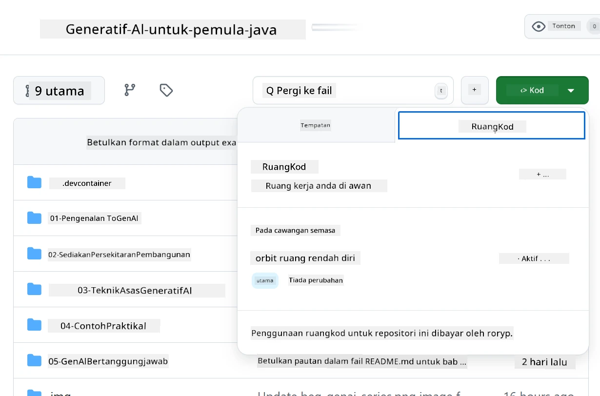

# Menyediakan Persekitaran Pembangunan untuk Azure OpenAI

> **Permulaan Pantas**: Panduan ini adalah untuk persediaan Azure OpenAI. Untuk memulakan dengan model percuma, gunakan [GitHub Models with Codespaces](./README.md#quick-start-cloud).

Panduan ini akan membantu anda menyediakan model Azure AI Foundry untuk aplikasi Java AI dalam kursus ini.

## Kandungan

- [Gambaran Keseluruhan Persediaan Pantas](../../../02-SetupDevEnvironment)
- [Langkah 1: Cipta Sumber Azure AI Foundry](../../../02-SetupDevEnvironment)
  - [Cipta Hub dan Projek](../../../02-SetupDevEnvironment)
  - [Laksanakan Model GPT-4o-mini](../../../02-SetupDevEnvironment)
- [Langkah 2: Cipta Codespace Anda](../../../02-SetupDevEnvironment)
- [Langkah 3: Konfigurasi Persekitaran Anda](../../../02-SetupDevEnvironment)
- [Langkah 4: Uji Persediaan Anda](../../../02-SetupDevEnvironment)
- [Apa Seterusnya?](../../../02-SetupDevEnvironment)
- [Sumber](../../../02-SetupDevEnvironment)
- [Sumber Tambahan](../../../02-SetupDevEnvironment)

## Gambaran Keseluruhan Persediaan Pantas

1. Cipta sumber Azure AI Foundry (Hub, Projek, Model)
2. Cipta Codespace dengan kontena pembangunan Java
3. Konfigurasi fail .env anda dengan kelayakan Azure OpenAI
4. Uji persediaan anda dengan projek contoh

## Langkah 1: Cipta Sumber Azure AI Foundry

### Cipta Hub dan Projek

1. Pergi ke [Portal Azure AI Foundry](https://ai.azure.com/) dan log masuk
2. Klik **+ Create** → **New hub** (atau navigasi ke **Management** → **All hubs** → **+ New hub**)
3. Konfigurasi hub anda:
   - **Nama Hub**: contohnya, "MyAIHub"
   - **Langganan**: Pilih langganan Azure anda
   - **Kumpulan Sumber**: Cipta baru atau pilih yang sedia ada
   - **Lokasi**: Pilih lokasi terdekat
   - **Akaun Storan**: Gunakan lalai atau konfigurasi tersuai
   - **Key vault**: Gunakan lalai atau konfigurasi tersuai
   - Klik **Next** → **Review + create** → **Create**
4. Setelah dicipta, klik **+ New project** (atau **Create project** dari paparan hub)
   - **Nama Projek**: contohnya, "GenAIJava"
   - Klik **Create**

### Laksanakan Model GPT-4o-mini

1. Dalam projek anda, pergi ke **Model catalog** dan cari **gpt-4o-mini**
   - *Alternatif: Pergi ke **Deployments** → **+ Create deployment***
2. Klik **Deploy** pada kad model gpt-4o-mini
3. Konfigurasi pelaksanaan:
   - **Nama Pelaksanaan**: "gpt-4o-mini"
   - **Versi Model**: Gunakan versi terkini
   - **Jenis Pelaksanaan**: Standard
4. Klik **Deploy**
5. Setelah dilaksanakan, pergi ke tab **Deployments** dan salin nilai berikut:
   - **Nama Pelaksanaan** (contohnya, "gpt-4o-mini")
   - **Target URI** (contohnya, `https://your-hub-name.openai.azure.com/`) 
      > **Penting**: Salin hanya URL asas (contohnya, `https://myhub.openai.azure.com/`) bukan laluan penuh endpoint.
   - **Key** (dari bahagian Keys and Endpoint)

> **Masih menghadapi masalah?** Lawati [Dokumentasi Rasmi Azure AI Foundry](https://learn.microsoft.com/azure/ai-foundry/how-to/create-projects?tabs=ai-foundry&pivots=hub-project)

## Langkah 2: Cipta Codespace Anda

1. Fork repositori ini ke akaun GitHub anda
   > **Nota**: Jika anda ingin mengedit konfigurasi asas sila lihat [Dev Container Configuration](../../../.devcontainer/devcontainer.json)
2. Dalam repositori yang telah di-fork, klik **Code** → tab **Codespaces**
3. Klik **...** → **New with options...**

4. Pilih **Konfigurasi kontena pembangunan**: 
   - **Generative AI Java Development Environment**
5. Klik **Create codespace**

## Langkah 3: Konfigurasi Persekitaran Anda

Setelah Codespace anda sedia, tetapkan kelayakan Azure OpenAI anda:

1. **Navigasi ke projek contoh dari akar repositori:**
   ```bash
   cd 02-SetupDevEnvironment/examples/basic-chat-azure
   ```

2. **Cipta fail .env anda:**
   ```bash
   cp .env.example .env
   ```

3. **Edit fail .env dengan kelayakan Azure OpenAI anda:**
   ```bash
   # Your Azure OpenAI API key (from Azure AI Foundry portal)
   AZURE_AI_KEY=your-actual-api-key-here
   
   # Your Azure OpenAI endpoint URL (e.g., https://myhub.openai.azure.com/)
   AZURE_AI_ENDPOINT=https://your-hub-name.openai.azure.com/
   ```

   > **Nota Keselamatan**: 
   > - Jangan sekali-kali commit fail `.env` anda ke kawalan versi
   > - Fail `.env` sudah termasuk dalam `.gitignore`
   > - Pastikan kunci API anda selamat dan putarkan secara berkala

## Langkah 4: Uji Persediaan Anda

Jalankan aplikasi contoh untuk menguji sambungan Azure OpenAI anda:

```bash
mvn clean spring-boot:run
```

Anda sepatutnya melihat respons daripada model GPT-4o-mini!

> **Pengguna VS Code**: Anda juga boleh tekan `F5` dalam VS Code untuk menjalankan aplikasi. Konfigurasi pelancaran telah disediakan untuk memuatkan fail `.env` anda secara automatik.

> **Contoh penuh**: Lihat [Contoh Azure OpenAI End-to-End](./examples/basic-chat-azure/README.md) untuk arahan terperinci dan penyelesaian masalah.

## Apa Seterusnya?

**Persediaan Selesai!** Anda kini mempunyai:
- Azure OpenAI dengan gpt-4o-mini yang telah dilaksanakan
- Konfigurasi fail .env tempatan
- Persekitaran pembangunan Java yang sedia

**Teruskan ke** [Bab 3: Teknik Generative AI Teras](../03-CoreGenerativeAITechniques/README.md) untuk mula membina aplikasi AI!

## Sumber

- [Dokumentasi Azure AI Foundry](https://learn.microsoft.com/azure/ai-services/)
- [Dokumentasi Spring AI Azure OpenAI](https://docs.spring.io/spring-ai/reference/api/clients/azure-openai-chat.html)
- [SDK Java Azure OpenAI](https://learn.microsoft.com/java/api/overview/azure/ai-openai-readme)

## Sumber Tambahan

- [Muat Turun VS Code](https://code.visualstudio.com/Download)
- [Dapatkan Docker Desktop](https://www.docker.com/products/docker-desktop)
- [Konfigurasi Kontena Pembangunan](../../../.devcontainer/devcontainer.json)

**Penafian**:  
Dokumen ini telah diterjemahkan menggunakan perkhidmatan terjemahan AI [Co-op Translator](https://github.com/Azure/co-op-translator). Walaupun kami berusaha untuk memastikan ketepatan, sila ambil perhatian bahawa terjemahan automatik mungkin mengandungi kesilapan atau ketidaktepatan. Dokumen asal dalam bahasa asalnya harus dianggap sebagai sumber yang berwibawa. Untuk maklumat yang kritikal, terjemahan manusia profesional adalah disyorkan. Kami tidak bertanggungjawab atas sebarang salah faham atau salah tafsir yang timbul daripada penggunaan terjemahan ini.