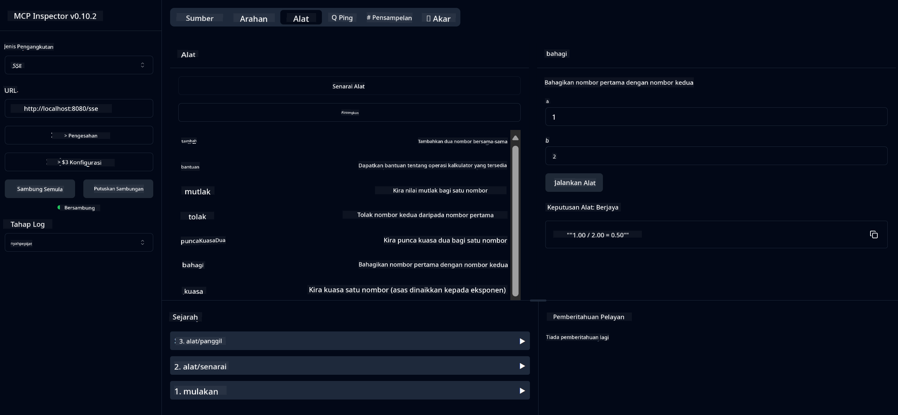

<!--
CO_OP_TRANSLATOR_METADATA:
{
  "original_hash": "5bd7a347d6ed1d706443f9129dd29dd9",
  "translation_date": "2025-07-25T09:52:53+00:00",
  "source_file": "04-PracticalSamples/mcp/calculator/README.md",
  "language_code": "ms"
}
-->
# Perkhidmatan Kalkulator MCP Asas

>**Nota**: Bab ini termasuk [**Tutorial**](./TUTORIAL.md) yang membimbing anda melalui contoh-contoh.

Selamat datang ke pengalaman praktikal pertama anda dengan **Model Context Protocol (MCP)**! Dalam bab-bab sebelumnya, anda telah mempelajari asas-asas AI generatif dan menyediakan persekitaran pembangunan anda. Kini tiba masanya untuk membina sesuatu yang praktikal.

Perkhidmatan kalkulator ini menunjukkan bagaimana model AI boleh berinteraksi dengan alat luaran secara selamat menggunakan MCP. Daripada bergantung kepada keupayaan matematik model AI yang kadang-kadang tidak boleh dipercayai, kami akan menunjukkan cara membina sistem yang kukuh di mana AI boleh memanggil perkhidmatan khusus untuk pengiraan yang tepat.

## Kandungan

- [Apa yang Anda Akan Pelajari](../../../../../04-PracticalSamples/mcp/calculator)
- [Prasyarat](../../../../../04-PracticalSamples/mcp/calculator)
- [Konsep Utama](../../../../../04-PracticalSamples/mcp/calculator)
- [Permulaan Pantas](../../../../../04-PracticalSamples/mcp/calculator)
- [Operasi Kalkulator yang Tersedia](../../../../../04-PracticalSamples/mcp/calculator)
- [Klien Ujian](../../../../../04-PracticalSamples/mcp/calculator)
  - [1. Klien MCP Langsung (SDKClient)](../../../../../04-PracticalSamples/mcp/calculator)
  - [2. Klien Berkuasa AI (LangChain4jClient)](../../../../../04-PracticalSamples/mcp/calculator)
- [Pemeriksa MCP (UI Web)](../../../../../04-PracticalSamples/mcp/calculator)
  - [Arahan Langkah-demi-Langkah](../../../../../04-PracticalSamples/mcp/calculator)

## Apa yang Anda Akan Pelajari

Dengan bekerja melalui contoh ini, anda akan memahami:
- Cara mencipta perkhidmatan yang serasi dengan MCP menggunakan Spring Boot
- Perbezaan antara komunikasi protokol langsung dan interaksi berkuasa AI
- Bagaimana model AI memutuskan bila dan bagaimana menggunakan alat luaran
- Amalan terbaik untuk membina aplikasi AI yang dilengkapi alat

Sesuai untuk pemula yang mempelajari konsep MCP dan bersedia membina integrasi alat AI pertama mereka!

## Prasyarat

- Java 21+
- Maven 3.6+
- **Token GitHub**: Diperlukan untuk klien berkuasa AI. Jika anda belum menyediakannya, lihat [Bab 2: Menyediakan persekitaran pembangunan anda](../../../02-SetupDevEnvironment/README.md) untuk arahan.

## Konsep Utama

**Model Context Protocol (MCP)** adalah cara standard untuk aplikasi AI berhubung dengan alat luaran secara selamat. Anggap ia sebagai "jambatan" yang membolehkan model AI menggunakan perkhidmatan luaran seperti kalkulator kami. Daripada model AI cuba melakukan matematik sendiri (yang boleh menjadi tidak boleh dipercayai), ia boleh memanggil perkhidmatan kalkulator kami untuk mendapatkan hasil yang tepat. MCP memastikan komunikasi ini berlaku dengan selamat dan konsisten.

**Server-Sent Events (SSE)** membolehkan komunikasi masa nyata antara pelayan dan klien. Tidak seperti permintaan HTTP tradisional di mana anda bertanya dan menunggu respons, SSE membolehkan pelayan menghantar kemas kini secara berterusan kepada klien. Ini sangat sesuai untuk aplikasi AI di mana respons mungkin disiarkan atau mengambil masa untuk diproses.

**Alat AI & Pemanggilan Fungsi** membolehkan model AI secara automatik memilih dan menggunakan fungsi luaran (seperti operasi kalkulator) berdasarkan permintaan pengguna. Apabila anda bertanya "Berapa 15 + 27?", model AI memahami anda mahukan penambahan, secara automatik memanggil alat `add` kami dengan parameter yang betul (15, 27), dan mengembalikan hasilnya dalam bahasa semula jadi. AI bertindak sebagai penyelaras pintar yang tahu bila dan bagaimana menggunakan setiap alat.

## Permulaan Pantas

### 1. Navigasi ke direktori aplikasi kalkulator
```bash
cd Generative-AI-for-beginners-java/04-PracticalSamples/mcp/calculator
```

### 2. Bina & Jalankan
```bash
mvn clean install -DskipTests
java -jar target/calculator-server-0.0.1-SNAPSHOT.jar
```

### 2. Uji dengan Klien
- **SDKClient**: Interaksi protokol MCP langsung
- **LangChain4jClient**: Interaksi bahasa semula jadi berkuasa AI (memerlukan token GitHub)

## Operasi Kalkulator yang Tersedia

- `add(a, b)`, `subtract(a, b)`, `multiply(a, b)`, `divide(a, b)`
- `power(base, exponent)`, `squareRoot(number)`, `absolute(number)`
- `modulus(a, b)`, `help()`

## Klien Ujian

### 1. Klien MCP Langsung (SDKClient)
Menguji komunikasi protokol MCP mentah. Jalankan dengan:
```bash
mvn test-compile exec:java -Dexec.mainClass="com.microsoft.mcp.sample.client.SDKClient" -Dexec.classpathScope=test
```

### 2. Klien Berkuasa AI (LangChain4jClient)
Menunjukkan interaksi bahasa semula jadi dengan Model GitHub. Memerlukan token GitHub (lihat [Prasyarat](../../../../../04-PracticalSamples/mcp/calculator)).

**Jalankan:**
```bash
mvn test-compile exec:java -Dexec.mainClass="com.microsoft.mcp.sample.client.LangChain4jClient" -Dexec.classpathScope=test
```

## Pemeriksa MCP (UI Web)

Pemeriksa MCP menyediakan antara muka web visual untuk menguji perkhidmatan MCP anda tanpa menulis kod. Sesuai untuk pemula memahami cara MCP berfungsi!

### Arahan Langkah-demi-Langkah:

1. **Mulakan pelayan kalkulator** (jika belum berjalan):
   ```bash
   java -jar target/calculator-server-0.0.1-SNAPSHOT.jar
   ```

2. **Pasang dan jalankan Pemeriksa MCP** dalam terminal baru:
   ```bash
   npx @modelcontextprotocol/inspector
   ```

3. **Buka antara muka web**:
   - Cari mesej seperti "Inspector running at http://localhost:6274"
   - Buka URL tersebut dalam pelayar web anda

4. **Sambungkan ke perkhidmatan kalkulator anda**:
   - Dalam antara muka web, tetapkan jenis transport kepada "SSE"
   - Tetapkan URL kepada: `http://localhost:8080/sse`
   - Klik butang "Connect"

5. **Terokai alat yang tersedia**:
   - Klik "List Tools" untuk melihat semua operasi kalkulator
   - Anda akan melihat fungsi seperti `add`, `subtract`, `multiply`, dll.

6. **Uji operasi kalkulator**:
   - Pilih alat (contohnya, "add")
   - Masukkan parameter (contohnya, `a: 15`, `b: 27`)
   - Klik "Run Tool"
   - Lihat hasil yang dikembalikan oleh perkhidmatan MCP anda!

Pendekatan visual ini membantu anda memahami dengan tepat bagaimana komunikasi MCP berfungsi sebelum membina klien anda sendiri.



---
**Rujukan:** [Dokumentasi MCP Server Boot Starter](https://docs.spring.io/spring-ai/reference/api/mcp/mcp-server-boot-starter-docs.html)

**Penafian**:  
Dokumen ini telah diterjemahkan menggunakan perkhidmatan terjemahan AI [Co-op Translator](https://github.com/Azure/co-op-translator). Walaupun kami berusaha untuk memastikan ketepatan, sila ambil perhatian bahawa terjemahan automatik mungkin mengandungi kesilapan atau ketidaktepatan. Dokumen asal dalam bahasa asalnya harus dianggap sebagai sumber yang berwibawa. Untuk maklumat penting, terjemahan manusia profesional adalah disyorkan. Kami tidak bertanggungjawab atas sebarang salah faham atau salah tafsir yang timbul daripada penggunaan terjemahan ini.