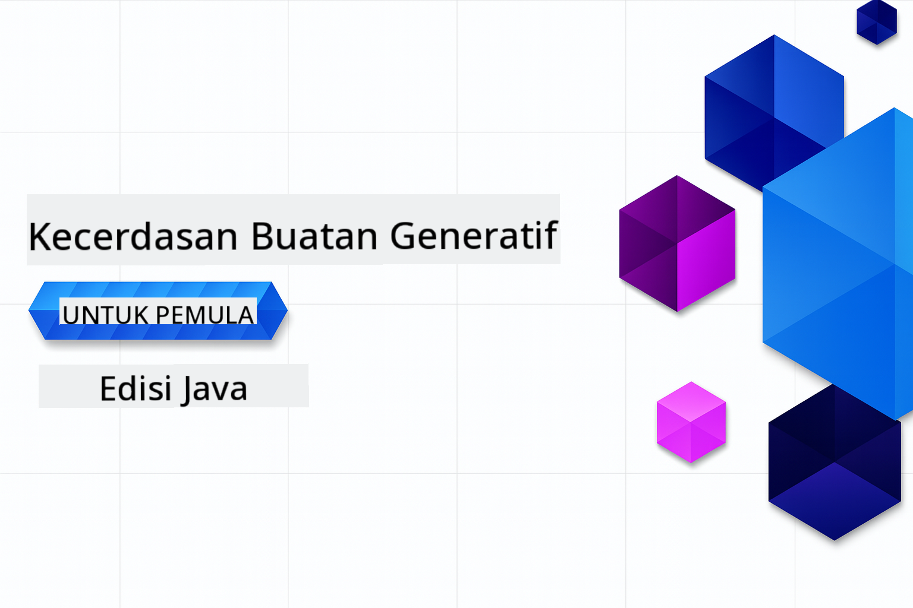

<!--
CO_OP_TRANSLATOR_METADATA:
{
  "original_hash": "ff95bb9d60ecd46e1a2215e341062967",
  "translation_date": "2025-07-26T17:37:24+00:00",
  "source_file": "README.md",
  "language_code": "ms"
}
-->
# Generatif AI untuk Pemula - Edisi Java

**Komitmen Masa**: Keseluruhan bengkel ini boleh diselesaikan secara dalam talian tanpa persediaan tempatan. Jika anda ingin menjalankan sampel, persediaan persekitaran mengambil masa 2 minit, dengan penerokaan sampel memerlukan 1-3 jam bergantung pada tahap penerokaan.

> **Permulaan Pantas**

1. Fork repositori ini ke akaun GitHub anda
2. Klik **Code** → tab **Codespaces** → **...** → **New with options...**
3. Gunakan tetapan lalai – ini akan memilih kontena Pembangunan yang dicipta untuk kursus ini
4. Klik **Create codespace**
5. Tunggu ~2 minit untuk persekitaran bersedia
6. Teruskan ke [Mencipta Token Model GitHub Anda](./02-SetupDevEnvironment/README.md#step-2-create-a-github-personal-access-token)

## Sokongan Pelbagai Bahasa

### Disokong melalui GitHub Action (Automatik & Sentiasa Terkini)

[Perancis](../fr/README.md) | [Sepanyol](../es/README.md) | [Jerman](../de/README.md) | [Rusia](../ru/README.md) | [Arab](../ar/README.md) | [Parsi (Farsi)](../fa/README.md) | [Urdu](../ur/README.md) | [Cina (Ringkas)](../zh/README.md) | [Cina (Tradisional, Macau)](../mo/README.md) | [Cina (Tradisional, Hong Kong)](../hk/README.md) | [Cina (Tradisional, Taiwan)](../tw/README.md) | [Jepun](../ja/README.md) | [Korea](../ko/README.md) | [Hindi](../hi/README.md) | [Bengali](../bn/README.md) | [Marathi](../mr/README.md) | [Nepali](../ne/README.md) | [Punjabi (Gurmukhi)](../pa/README.md) | [Portugis (Portugal)](../pt/README.md) | [Portugis (Brazil)](../br/README.md) | [Itali](../it/README.md) | [Poland](../pl/README.md) | [Turki](../tr/README.md) | [Greek](../el/README.md) | [Thai](../th/README.md) | [Sweden](../sv/README.md) | [Denmark](../da/README.md) | [Norway](../no/README.md) | [Finland](../fi/README.md) | [Belanda](../nl/README.md) | [Ibrani](../he/README.md) | [Vietnam](../vi/README.md) | [Indonesia](../id/README.md) | [Melayu](./README.md) | [Tagalog (Filipina)](../tl/README.md) | [Swahili](../sw/README.md) | [Hungary](../hu/README.md) | [Czech](../cs/README.md) | [Slovak](../sk/README.md) | [Romania](../ro/README.md) | [Bulgaria](../bg/README.md) | [Serbia (Cyrillic)](../sr/README.md) | [Croatia](../hr/README.md) | [Slovenia](../sl/README.md) | [Ukraine](../uk/README.md) | [Burma (Myanmar)](../my/README.md)

## Struktur Kursus & Laluan Pembelajaran

### **Bab 1: Pengenalan kepada Generatif AI**
- **Konsep Asas**: Memahami Model Bahasa Besar, token, embedding, dan keupayaan AI
- **Ekosistem AI Java**: Gambaran keseluruhan Spring AI dan OpenAI SDK
- **Protokol Konteks Model**: Pengenalan kepada MCP dan peranannya dalam komunikasi agen AI
- **Aplikasi Praktikal**: Senario dunia sebenar termasuk chatbot dan penjanaan kandungan
- **[→ Mulakan Bab 1](./01-IntroToGenAI/README.md)**

### **Bab 2: Persediaan Persekitaran Pembangunan**
- **Konfigurasi Pelbagai Penyedia**: Sediakan integrasi GitHub Models, Azure OpenAI, dan OpenAI Java SDK
- **Spring Boot + Spring AI**: Amalan terbaik untuk pembangunan aplikasi AI perusahaan
- **GitHub Models**: Akses model AI percuma untuk prototaip dan pembelajaran (tiada kad kredit diperlukan)
- **Alat Pembangunan**: Konfigurasi kontena Docker, VS Code, dan GitHub Codespaces
- **[→ Mulakan Bab 2](./02-SetupDevEnvironment/README.md)**

### **Bab 3: Teknik Asas Generatif AI**
- **Kejuruteraan Prompt**: Teknik untuk respons model AI yang optimum
- **Embedding & Operasi Vektor**: Melaksanakan carian semantik dan pemadanan kesamaan
- **Retrieval-Augmented Generation (RAG)**: Gabungkan AI dengan sumber data anda sendiri
- **Panggilan Fungsi**: Luaskan keupayaan AI dengan alat dan plugin tersuai
- **[→ Mulakan Bab 3](./03-CoreGenerativeAITechniques/README.md)**

### **Bab 4: Aplikasi Praktikal & Projek**
- **Penjana Cerita Haiwan Peliharaan** (`petstory/`): Penjanaan kandungan kreatif dengan GitHub Models
- **Demo Tempatan Foundry** (`foundrylocal/`): Integrasi model AI tempatan dengan OpenAI Java SDK
- **Perkhidmatan Kalkulator MCP** (`mcp/calculator/`): Pelaksanaan asas Protokol Konteks Model dengan Spring AI
- **[→ Mulakan Bab 4](./04-PracticalSamples/README.md)**

### **Bab 5: Pembangunan AI Bertanggungjawab**
- **Keselamatan GitHub Models**: Uji penapisan kandungan terbina dalam dan mekanisme keselamatan
- **Demo AI Bertanggungjawab**: Contoh praktikal menunjukkan cara penapis keselamatan AI berfungsi
- **Amalan Terbaik**: Garis panduan penting untuk pembangunan dan pelaksanaan AI yang beretika
- **[→ Mulakan Bab 5](./05-ResponsibleGenAI/README.md)**

## Sumber Tambahan

- [AI Agents For Beginners](https://github.com/microsoft/ai-agents-for-beginners)
- [Generatif AI untuk Pemula menggunakan .NET](https://github.com/microsoft/Generative-AI-for-beginners-dotnet)
- [Generatif AI untuk Pemula menggunakan JavaScript](https://github.com/microsoft/generative-ai-with-javascript)
- [Generatif AI untuk Pemula](https://github.com/microsoft/generative-ai-for-beginners)
- [ML untuk Pemula](https://aka.ms/ml-beginners)
- [Sains Data untuk Pemula](https://aka.ms/datascience-beginners)
- [AI untuk Pemula](https://aka.ms/ai-beginners)
- [Keselamatan Siber untuk Pemula](https://github.com/microsoft/Security-101)
- [Pembangunan Web untuk Pemula](https://aka.ms/webdev-beginners)
- [IoT untuk Pemula](https://aka.ms/iot-beginners)
- [Pembangunan XR untuk Pemula](https://github.com/microsoft/xr-development-for-beginners)
- [Menguasai GitHub Copilot untuk Pengaturcaraan Berpasangan AI](https://aka.ms/GitHubCopilotAI)
- [Menguasai GitHub Copilot untuk Pembangun C#/.NET](https://github.com/microsoft/mastering-github-copilot-for-dotnet-csharp-developers)
- [Pilih Pengembaraan Copilot Anda Sendiri](https://github.com/microsoft/CopilotAdventures)
- [Aplikasi Chat RAG dengan Perkhidmatan AI Azure](https://github.com/Azure-Samples/azure-search-openai-demo-java)

**Penafian**:  
Dokumen ini telah diterjemahkan menggunakan perkhidmatan terjemahan AI [Co-op Translator](https://github.com/Azure/co-op-translator). Walaupun kami berusaha untuk memastikan ketepatan, sila ambil perhatian bahawa terjemahan automatik mungkin mengandungi kesilapan atau ketidaktepatan. Dokumen asal dalam bahasa asalnya harus dianggap sebagai sumber yang berwibawa. Untuk maklumat yang kritikal, terjemahan manusia profesional adalah disyorkan. Kami tidak bertanggungjawab atas sebarang salah faham atau salah tafsir yang timbul daripada penggunaan terjemahan ini.