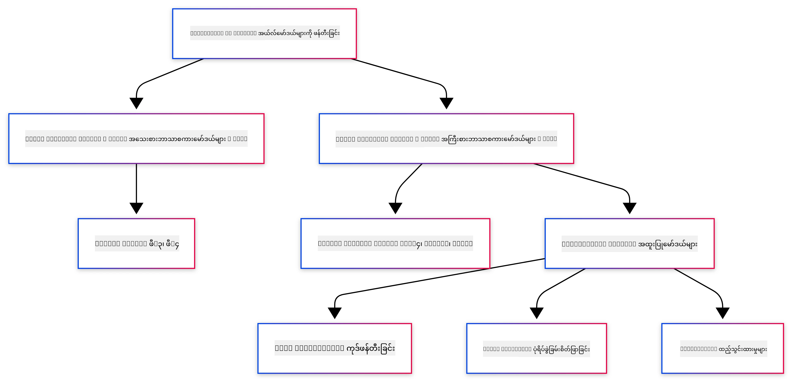
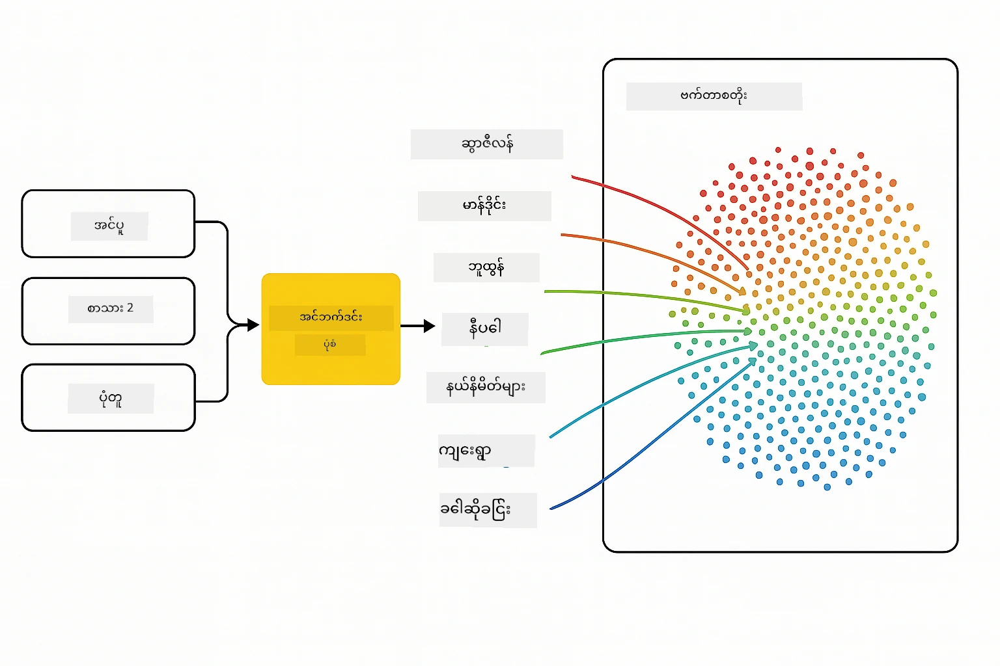
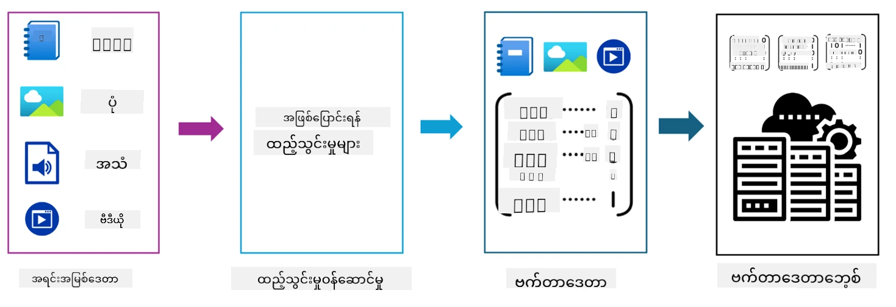
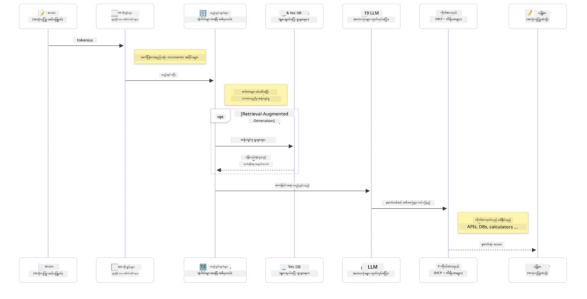

# Generative AI - Java Edition အကြောင်းအကျဉ်း

## သင်လေ့လာမည့်အရာများ

- **Generative AI အခြေခံအကြောင်းအရာများ** - LLMs, prompt engineering, tokens, embeddings, နှင့် vector databases အပါအဝင်
- **Java AI ဖွံ့ဖြိုးရေး tools များနှင့် နှိုင်းယှဉ်ခြင်း** - Azure OpenAI SDK, Spring AI, နှင့် OpenAI Java SDK
- **Model Context Protocol** နှင့် AI agent များအကြား ဆက်သွယ်မှုတွင် အရေးပါသော အခန်းကဏ္ဍ

## အကြောင်းအရာများ

- [Introduction](../../../01-IntroToGenAI)
- [Generative AI အကြောင်းအရာများကို အကျဉ်းချုပ်](../../../01-IntroToGenAI)
- [Prompt engineering အကြောင်း](../../../01-IntroToGenAI)
- [Tokens, embeddings, နှင့် agents](../../../01-IntroToGenAI)
- [Java အတွက် AI ဖွံ့ဖြိုးရေး Tools နှင့် Libraries](../../../01-IntroToGenAI)
  - [OpenAI Java SDK](../../../01-IntroToGenAI)
  - [Spring AI](../../../01-IntroToGenAI)
  - [Azure OpenAI Java SDK](../../../01-IntroToGenAI)
- [Summary](../../../01-IntroToGenAI)
- [Next Steps](../../../01-IntroToGenAI)

## Introduction

Generative AI for Beginners - Java Edition ရဲ့ ပထမဆုံးအခန်းကို ကြိုဆိုပါတယ်! ဒီအခြေခံသင်ခန်းစာမှာ generative AI ရဲ့ အဓိကအကြောင်းအရာများနှင့် Java ကို အသုံးပြု၍ အလုပ်လုပ်နည်းကို မိတ်ဆက်ပေးမှာဖြစ်ပါတယ်။ Large Language Models (LLMs), tokens, embeddings, နှင့် AI agents အပါအဝင် AI application များရဲ့ အရေးပါသော အခြေခံအဆောက်အအုံများကို သင်လေ့လာရမှာဖြစ်ပါတယ်။ ဒီသင်တန်းတစ်ခုလုံးအတွင်း သင်အသုံးပြုမည့် Java tooling များကိုလည်း လေ့လာရမှာဖြစ်ပါတယ်။

### Generative AI အကြောင်းအရာများကို အကျဉ်းချုပ်

Generative AI ဆိုတာ ဒေတာထဲက pattern နှင့် ဆက်နွယ်မှုများကို လေ့လာပြီး အသစ်သော အကြောင်းအရာများ (စာသား၊ ပုံရိပ်များ၊ code) ဖန်တီးနိုင်သော artificial intelligence အမျိုးအစားတစ်ခုဖြစ်ပါတယ်။ Generative AI မော်ဒယ်များက လူသားလိုပုံစံဖြင့် တုံ့ပြန်မှုများ ဖန်တီးနိုင်ပြီး context ကို နားလည်နိုင်သလို၊ လူသားလိုပုံစံဖြစ်သော အကြောင်းအရာများကို ဖန်တီးနိုင်ပါသည်။

Java AI application များကို ဖွံ့ဖြိုးစဉ် **generative AI မော်ဒယ်များ** ကို အသုံးပြု၍ အကြောင်းအရာများ ဖန်တီးရမှာဖြစ်ပါတယ်။ Generative AI မော်ဒယ်များရဲ့ အစွမ်းအင်များမှာ:

- **Text Generation**: Chatbots, content, နှင့် text completion အတွက် လူသားလိုပုံစံဖြင့် စာသားများ ဖန်တီးခြင်း
- **Image Generation နှင့် Analysis**: အမှန်တကယ်ဖြစ်သော ပုံရိပ်များ ဖန်တီးခြင်း၊ ဓာတ်ပုံများ တိုးတက်စေခြင်း၊ နှင့် objects တွေကို ရှာဖွေခြင်း
- **Code Generation**: Code snippets သို့မဟုတ် scripts များ ရေးသားခြင်း

မော်ဒယ်အမျိုးအစားများသည် တစ်ခုချင်းစီ၏ အလုပ်အကိုင်များအတွက် အထူးပြုထားပါသည်။ ဥပမာအားဖြင့် **Small Language Models (SLMs)** နှင့် **Large Language Models (LLMs)** နှစ်မျိုးစလုံးသည် စာသားဖန်တီးမှုကို လုပ်ဆောင်နိုင်သော်လည်း LLMs သည် ရှုပ်ထွေးသော အလုပ်များအတွက် ပိုမိုကောင်းမွန်သော performance ကို ပေးနိုင်ပါသည်။ ပုံရိပ်နှင့်ဆိုင်သော အလုပ်များအတွက် vision models သို့မဟုတ် multi-modal models ကို အသုံးပြုရပါမည်။

မော်ဒယ်များ၏ တုံ့ပြန်မှုများသည် အချို့အခါတွင် အပြည့်အဝမှန်ကန်မှုမရှိနိုင်ပါ။ "hallucinating" သို့မဟုတ် မှားယွင်းသော အချက်အလက်များကို authority ရှိသလိုပုံစံဖြင့် ဖန်တီးခြင်းကို သင်ကြားဖူးနိုင်ပါတယ်။ သို့သော် **prompt engineering** ကို အသုံးပြုခြင်းအားဖြင့် မော်ဒယ်ကို ပိုမိုကောင်းမွန်သော တုံ့ပြန်မှုများ ဖန်တီးစေခြင်းအတွက် လမ်းညွှန်နိုင်ပါသည်။

#### Prompt engineering အကြောင်း

Prompt engineering ဆိုတာ AI မော်ဒယ်များကို သင်လိုချင်သော အဖြေများရရှိစေရန် အထောက်အကူပြုသော input များကို ဒီဇိုင်းဆွဲခြင်းဖြစ်ပါတယ်။ Prompt engineering တွင်:

- **ရှင်းလင်းမှု**: လမ်းညွှန်ချက်များကို ရှင်းလင်းပြီး ambiguity မရှိအောင်လုပ်ခြင်း
- **Context**: လိုအပ်သော နောက်ခံအချက်အလက်များ ပေးခြင်း
- **Constraints**: အကန့်အသတ်များ သို့မဟုတ် format များကို သတ်မှတ်ခြင်း

Prompt engineering ရဲ့ အကောင်းဆုံးအလေ့အကျင့်များမှာ prompt design, ရှင်းလင်းသော လမ်းညွှန်ချက်များ, task breakdown, one-shot နှင့် few-shot learning, နှင့် prompt tuning တို့ဖြစ်ပါတယ်။ သင့် use case အတွက် အကောင်းဆုံးအလုပ်လုပ်သော prompt ကို ရှာဖွေရန် အမျိုးမျိုးသော prompt များကို စမ်းသပ်ရပါမည်။

Application များ ဖွံ့ဖြိုးစဉ် သင်အမျိုးမျိုးသော prompt အမျိုးအစားများနှင့် အလုပ်လုပ်ရပါမည်:
- **System prompts**: မော်ဒယ်၏ အပြုအမူအတွက် အခြေခံ rule များနှင့် context ကို သတ်မှတ်ခြင်း
- **User prompts**: Application user များ၏ input data
- **Assistant prompts**: System နှင့် user prompts အပေါ် မူတည်၍ မော်ဒယ်၏ တုံ့ပြန်မှုများ

> **Learn more**: Prompt engineering အကြောင်းကို [Prompt Engineering chapter of GenAI for Beginners course](https://github.com/microsoft/generative-ai-for-beginners/tree/main/04-prompt-engineering-fundamentals) တွင် လေ့လာပါ။

#### Tokens, embeddings, နှင့် agents

Generative AI မော်ဒယ်များနှင့် အလုပ်လုပ်စဉ် **tokens**, **embeddings**, **agents**, နှင့် **Model Context Protocol (MCP)** စသည်တို့ကို တွေ့ရပါမည်။ အကြောင်းအရာများကို အကျဉ်းချုပ်ပါက:

- **Tokens**: Tokens ဆိုတာ မော်ဒယ်အတွက် စာသား၏ အငယ်ဆုံး unit ဖြစ်ပါတယ်။ စာလုံးများ၊ အက္ခရာများ သို့မဟုတ် subwords ဖြစ်နိုင်ပါတယ်။ Tokens သည် စာသားဒေတာကို မော်ဒယ်နားလည်နိုင်သော format အဖြစ် ကိုယ်စားပြုရန် အသုံးပြုသည်။ ဥပမာအားဖြင့် "The quick brown fox jumped over the lazy dog" ဆိုသော စာကြောင်းကို ["The", " quick", " brown", " fox", " jumped", " over", " the", " lazy", " dog"] သို့မဟုတ် ["The", " qu", "ick", " br", "own", " fox", " jump", "ed", " over", " the", " la", "zy", " dog"] အဖြစ် tokenized လုပ်နိုင်သည်။

Tokenization ဆိုတာ စာသားကို အငယ်ဆုံး unit များအဖြစ် ခွဲခြားခြင်းဖြစ်ပါတယ်။ မော်ဒယ်များသည် raw text အစား tokens အပေါ် အလုပ်လုပ်သောကြောင့် အရေးပါသည်။ Prompt တွင် token အရေအတွက်သည် မော်ဒယ်၏ တုံ့ပြန်မှုအရှည်နှင့် အရည်အသွေးကို သက်ရောက်စေသည်။ မော်ဒယ်များတွင် context window token အကန့်အသတ်ရှိသည် (ဥပမာ GPT-4o အတွက် 128K tokens).

  Java တွင် OpenAI SDK ကဲ့သို့သော libraries ကို အသုံးပြု၍ tokenization ကို အလိုအလျောက် handle လုပ်နိုင်ပါသည်။

- **Embeddings**: Embeddings ဆိုတာ tokens ရဲ့ semantic အဓိပ္ပါယ်ကို capture လုပ်သော vector ကိုယ်စားပြုမှုများဖြစ်သည်။ ဒါဟာ floating-point number array များဖြစ်ပြီး စာလုံးများအကြား ဆက်နွယ်မှုများကို နားလည်စေသည်။ Synonyms နှင့် semantic relationships ကဲ့သို့သော concepts များကို နားလည်စေသည်။

  Java တွင် OpenAI SDK သို့မဟုတ် embedding generation ကို support လုပ်သော libraries များကို အသုံးပြု၍ embeddings ဖန်တီးနိုင်ပါသည်။ Semantic search ကဲ့သို့သော အလုပ်များအတွက် အဓိကဖြစ်သည်။

- **Vector databases**: Vector databases ဆိုတာ embeddings အတွက် အထူးပြုထားသော storage systems ဖြစ်သည်။ Semantic similarity အပေါ်မူတည်၍ အချက်အလက်များကို ရှာဖွေခြင်းအတွက် အရေးပါသည်။

> **Note**: ဒီသင်တန်းမှာ Vector databases ကို မဖုံးအုပ်ပေမယ့် အရေးပါသောကြောင့် mention လုပ်ထားပါသည်။

- **Agents & MCP**: AI မော်ဒယ်များ၊ tools, နှင့် အပြင်ပန်း systems များနှင့် အလိုအလျောက် ဆက်သွယ်နိုင်သော components များ။ Model Context Protocol (MCP) သည် agents များကို အပြင်ပန်း data sources နှင့် tools များကို securely access လုပ်နိုင်စေရန် standardized နည်းလမ်းကို ပေးသည်။ [MCP for Beginners](https://github.com/microsoft/mcp-for-beginners) သင်တန်းတွင် ပိုမိုလေ့လာနိုင်ပါသည်။

Java AI application များတွင် tokens ကို text processing အတွက်၊ embeddings ကို semantic search နှင့် RAG အတွက်၊ vector databases ကို data retrieval အတွက်၊ နှင့် MCP ပါသော agents ကို intelligent systems ဖန်တီးရန် အသုံးပြုရပါမည်။

### Java အတွက် AI ဖွံ့ဖြိုးရေး Tools နှင့် Libraries

Java တွင် AI ဖွံ့ဖြိုးရေးအတွက် အလွန်ကောင်းမွန်သော tooling ရှိပါသည်။ ဒီသင်တန်းတစ်ခုလုံးအတွင်း OpenAI Java SDK, Azure OpenAI SDK, နှင့် Spring AI libraries သုံးခုကို လေ့လာရမှာဖြစ်ပါတယ်။

ဒီသင်တန်းရဲ့ အခန်းတစ်ခုချင်းစီမှာ အသုံးပြုမည့် SDK များကို အောက်ပါဇယားတွင် ဖော်ပြထားသည်:

| Chapter | Sample | SDK |
|---------|--------|-----|
| 02-SetupDevEnvironment | github-models | OpenAI Java SDK |
| 02-SetupDevEnvironment | basic-chat-azure | Spring AI Azure OpenAI |
| 03-CoreGenerativeAITechniques | examples | Azure OpenAI SDK |
| 04-PracticalSamples | petstory | OpenAI Java SDK |
| 04-PracticalSamples | foundrylocal | OpenAI Java SDK |
| 04-PracticalSamples | calculator | Spring AI MCP SDK + LangChain4j |

**SDK Documentation Links:**
- [Azure OpenAI Java SDK](https://github.com/Azure/azure-sdk-for-java/tree/azure-ai-openai_1.0.0-beta.16/sdk/openai/azure-ai-openai)
- [Spring AI](https://docs.spring.io/spring-ai/reference/)
- [OpenAI Java SDK](https://github.com/openai/openai-java)
- [LangChain4j](https://docs.langchain4j.dev/)

#### OpenAI Java SDK

OpenAI SDK သည် OpenAI API အတွက် Java library ဖြစ်ပြီး OpenAI မော်ဒယ်များနှင့် အလုပ်လုပ်ရန် ရိုးရှင်းပြီး တိကျသော interface ကို ပေးသည်။ Java application များတွင် AI စွမ်းရည်များကို ပေါင်းစပ်ရန် အလွန်လွယ်ကူစေသည်။ Chapter 2 ရဲ့ GitHub Models ဥပမာ၊ Chapter 4 ရဲ့ Pet Story application နှင့် Foundry Local ဥပမာများသည် OpenAI SDK ကို အသုံးပြုထားသည်။

#### Spring AI

Spring AI သည် Spring application များတွင် AI စွမ်းရည်များကို ပေါင်းစပ်ပေးသော framework ဖြစ်ပြီး အမျိုးမျိုးသော AI providers များအတွက် consistent abstraction layer ကို ပေးသည်။ Spring ecosystem နှင့် အလွယ်တကူ ပေါင်းစပ်နိုင်သောကြောင့် Enterprise Java application များအတွက် အထူးသင့်လျော်သည်။

Spring AI ရဲ့ အားသာချက်မှာ Spring ecosystem နှင့် seamless integration ဖြစ်ပြီး dependency injection, configuration management, နှင့် testing frameworks ကဲ့သို့သော Spring patterns များကို အသုံးပြု၍ production-ready AI application များ ဖန်တီးနိုင်စေသည်။ Chapter 2 နှင့် 4 တွင် Spring AI ကို အသုံးပြု၍ OpenAI နှင့် Model Context Protocol (MCP) Spring AI libraries ကို leverage လုပ်ထားသည်။

##### Model Context Protocol (MCP)

[Model Context Protocol (MCP)](https://modelcontextprotocol.io/) သည် AI application များကို အပြင်ပန်း data sources နှင့် tools များနှင့် securely ဆက်သွယ်နိုင်စေရန် emerging standard ဖြစ်သည်။ MCP သည် AI မော်ဒယ်များကို contextual အချက်အလက်များနှင့် သင့် application တွင် လုပ်ဆောင်မှုများကို access လုပ်နိုင်စေရန် standardized နည်းလမ်းကို ပေးသည်။

Chapter 4 တွင် Spring AI နှင့် MCP ကို အသုံးပြု၍ basic tool integrations နှင့် service architectures ကို ဖော်ပြထားသော MCP calculator service ကို ဖန်တီးမည်ဖြစ်သည်။

#### Azure OpenAI Java SDK

Azure OpenAI client library for Java သည် OpenAI ရဲ့ REST APIs ကို Azure SDK ecosystem နှင့် ပေါင်းစပ်ထားသော idiomatic interface ကို ပေးသည်။ Chapter 3 တွင် Azure OpenAI SDK ကို အသုံးပြု၍ chat application, function calling, နှင့် RAG (Retrieval-Augmented Generation) patterns များကို ဖန်တီးမည်ဖြစ်သည်။

> Note: Azure OpenAI SDK သည် OpenAI Java SDK ထက် features အနည်းငယ်နောက်ကျနေသည့်အတွက် အနာဂတ် project များအတွက် OpenAI Java SDK ကို အသုံးပြုရန် သင့်လျော်သည်။

## Summary

အခြေခံအကြောင်းအရာများကို အပြီးသတ်လိုက်ပါပြီ! သင်သည် ယခု:

- Generative AI ရဲ့ အဓိကအကြောင်းအရာများ - LLMs, prompt engineering, tokens, embeddings, နှင့် vector databases အပါအဝင်
- Java AI ဖွံ့ဖြိုးရေးအတွက် toolkit ရွေးချယ်မှုများ - Azure OpenAI SDK, Spring AI, နှင့် OpenAI Java SDK
- Model Context Protocol ရဲ့ အရေးပါမှုနှင့် AI agents များအတွက် အလုပ်လုပ်နည်း

## Next Steps

[Chapter 2: Setting Up the Development Environment](../02-SetupDevEnvironment/README.md)

**ဝက်ဘ်ဆိုက်မှတ်ချက်**:  
ဤစာရွက်စာတမ်းကို AI ဘာသာပြန်ဝန်ဆောင်မှု [Co-op Translator](https://github.com/Azure/co-op-translator) ကို အသုံးပြု၍ ဘာသာပြန်ထားပါသည်။ ကျွန်ုပ်တို့သည် တိကျမှန်ကန်မှုအတွက် ကြိုးစားနေသော်လည်း၊ အလိုအလျောက်ဘာသာပြန်မှုများတွင် အမှားများ သို့မဟုတ် မတိကျမှုများ ပါဝင်နိုင်သည်ကို သတိပြုပါ။ မူရင်းစာရွက်စာတမ်းကို ၎င်း၏ မူလဘာသာစကားဖြင့် အာဏာတည်သောရင်းမြစ်အဖြစ် သတ်မှတ်ပါ။ အရေးကြီးသော အချက်အလက်များအတွက် လူ့ဘာသာပြန်ပညာရှင်များမှ အတည်ပြုထားသော ဘာသာပြန်မှုကို အသုံးပြုရန် အကြံပြုပါသည်။ ဤဘာသာပြန်မှုကို အသုံးပြုခြင်းမှ ဖြစ်ပေါ်လာသော နားလည်မှုမှားများ သို့မဟုတ် အဓိပ္ပာယ်မှားများအတွက် ကျွန်ုပ်တို့သည် တာဝန်မယူပါ။