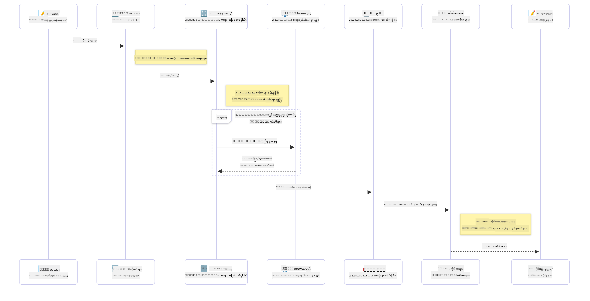

<!--
CO_OP_TRANSLATOR_METADATA:
{
  "original_hash": "6d8b4a0d774dc2a1e97c95859a6d6e4b",
  "translation_date": "2025-07-21T21:50:46+00:00",
  "source_file": "01-IntroToGenAI/README.md",
  "language_code": "my"
}
-->
# Generative AI - Java Edition ကိုမိတ်ဆက်ခြင်း

## သင်လေ့လာမည့်အရာများ

- **Generative AI အခြေခံအကြောင်းအရာများ** - LLMs, prompt engineering, tokens, embeddings, နှင့် vector databases အပါအဝင်
- **Java အတွက် AI ဖွံ့ဖြိုးရေးကိရိယာများနှင့် Library များကိုနှိုင်းယှဉ်ခြင်း** - Azure OpenAI SDK, Spring AI, နှင့် OpenAI Java SDK
- **Model Context Protocol** နှင့် AI agent များအကြားဆက်သွယ်မှုတွင်၎င်း၏အခန်းကဏ္ဍကိုရှာဖွေခြင်း

## အကြောင်းအရာများ

- [မိတ်ဆက်](../../../01-IntroToGenAI)
- [Generative AI အကြောင်းအရာများကိုအမြန်ပြန်လည်သုံးသပ်ခြင်း](../../../01-IntroToGenAI)
- [Prompt engineering ကိုပြန်လည်သုံးသပ်ခြင်း](../../../01-IntroToGenAI)
- [Tokens, embeddings, နှင့် agents](../../../01-IntroToGenAI)
- [Java အတွက် AI ဖွံ့ဖြိုးရေးကိရိယာများနှင့် Library များ](../../../01-IntroToGenAI)
  - [OpenAI Java SDK](../../../01-IntroToGenAI)
  - [Spring AI](../../../01-IntroToGenAI)
  - [Azure OpenAI Java SDK](../../../01-IntroToGenAI)
- [အကျဉ်းချုပ်](../../../01-IntroToGenAI)
- [နောက်ထပ်အဆင့်များ](../../../01-IntroToGenAI)

## မိတ်ဆက်

Generative AI for Beginners - Java Edition ၏ပထမဦးဆုံးအခန်းသို့ကြိုဆိုပါသည်! ဒီအခြေခံသင်ခန်းစာတွင် Generative AI ၏အဓိကအကြောင်းအရာများနှင့် Java ကိုအသုံးပြု၍ ၎င်းတို့ကိုဘယ်လိုလုပ်ဆောင်ရမည်ကိုမိတ်ဆက်ပေးပါမည်။ သင်သည် AI အပလီကေးရှင်းများ၏အခြေခံအဆင့်များဖြစ်သည့် Large Language Models (LLMs), tokens, embeddings, နှင့် AI agents အကြောင်းကိုလေ့လာမည်ဖြစ်သည်။ ထို့အပြင် ဒီသင်တန်းတစ်လျှောက်လုံးသုံးစွဲမည့် Java tools များကိုလည်းလေ့လာမည်ဖြစ်သည်။

### Generative AI အကြောင်းအရာများကိုအမြန်ပြန်လည်သုံးသပ်ခြင်း

Generative AI သည် ဒေတာမှ pattern များနှင့်ဆက်စပ်မှုများကိုလေ့လာပြီးနောက် အသစ်သောအကြောင်းအရာများ (စာသား, ပုံများ, သို့မဟုတ် ကုဒ်) ကိုဖန်တီးနိုင်သော အတုအယောင်ဗေဒသဖြစ်သည်။ Generative AI မော်ဒယ်များသည် လူသားများနှင့်ဆင်တူသောတုံ့ပြန်မှုများကိုဖန်တီးနိုင်ပြီး, အကြောင်းအရာကိုနားလည်နိုင်ပြီး, တခါတရံတွင်လူသားများဖန်တီးသည့်အရာများနှင့်ဆင်တူသောအကြောင်းအရာများကိုဖန်တီးနိုင်သည်။

Java AI အပလီကေးရှင်းများကိုဖွံ့ဖြိုးစဉ်, သင်သည် **Generative AI မော်ဒယ်များ** ကိုအသုံးပြု၍ အကြောင်းအရာများကိုဖန်တီးမည်ဖြစ်သည်။ Generative AI မော်ဒယ်များ၏စွမ်းရည်များအနက်အချို့မှာ -

- **စာသားဖန်တီးခြင်း**: Chatbots, အကြောင်းအရာဖန်တီးခြင်း, နှင့်စာသားဖြည့်စွက်ခြင်းအတွက် လူသားများနှင့်ဆင်တူသောစာသားများရေးသားခြင်း။
- **ပုံဖန်တီးခြင်းနှင့်ခွဲခြမ်းစိတ်ဖြာခြင်း**: အမှန်တကယ်ကျသောပုံများဖန်တီးခြင်း, ဓာတ်ပုံများတိုးတက်စေခြင်း, နှင့်အရာဝတ္ထုများကိုရှာဖွေခြင်း။
- **ကုဒ်ဖန်တီးခြင်း**: ကုဒ်အပိုင်းအစများ သို့မဟုတ် script များရေးသားခြင်း။

အလုပ်အမျိုးမျိုးအတွက်အထူးပြုထားသောမော်ဒယ်အမျိုးအစားများလည်းရှိသည်။ ဥပမာအားဖြင့်, **Small Language Models (SLMs)** နှင့် **Large Language Models (LLMs)** နှစ်မျိုးစလုံးသည်စာသားဖန်တီးခြင်းကိုလုပ်ဆောင်နိုင်ပြီး, LLMs သည်အလွန်ရှုပ်ထွေးသောအလုပ်များအတွက်ပိုမိုကောင်းမွန်သောစွမ်းဆောင်ရည်ကိုပေးစွမ်းနိုင်သည်။ ပုံနှင့်ဆိုင်သောအလုပ်များအတွက်, သင်သည်အထူးပြု vision မော်ဒယ်များ သို့မဟုတ် multi-modal မော်ဒယ်များကိုအသုံးပြုမည်ဖြစ်သည်။

သို့သော်, မော်ဒယ်များ၏တုံ့ပြန်မှုများသည်အချိန်တိုင်းမှန်ကန်မဟုတ်နိုင်ပါ။ မော်ဒယ်များသည် "hallucinating" သို့မဟုတ်မှားယွင်းသောအချက်အလက်များကိုအာဏာတစ်ရပ်ဖြင့်ဖန်တီးခြင်းအကြောင်းကိုသင်ကြားဖူးလိမ့်မည်။ သို့သော်, သင်သည်မော်ဒယ်ကိုရှင်းလင်းသောညွှန်ကြားချက်များနှင့်အကြောင်းအရာများပေးခြင်းဖြင့်ပိုမိုကောင်းမွန်သောတုံ့ပြန်မှုများဖန်တီးစေနိုင်သည်။ ဒီနေရာမှာ **prompt engineering** ကအရေးပါလာသည်။

#### Prompt engineering ကိုပြန်လည်သုံးသပ်ခြင်း

Prompt engineering သည် AI မော်ဒယ်များကိုလိုချင်သောရလဒ်များဆီသို့လမ်းညွှန်ရန်အထိရောက်ဆုံး input များကိုဒီဇိုင်းဆွဲခြင်းဖြစ်သည်။ ၎င်းတွင် -

- **ရှင်းလင်းမှု**: ညွှန်ကြားချက်များကိုရှင်းလင်းပြီးရှုပ်ထွေးမှုမရှိစေရန်။
- **အကြောင်းအရာ**: လိုအပ်သောနောက်ခံအချက်အလက်များပေးခြင်း။
- **ကန့်သတ်ချက်များ**: အကန့်အသတ်များ သို့မဟုတ် format များကိုသတ်မှတ်ခြင်း။

Prompt engineering ၏အကောင်းဆုံးအလေ့အထများအနက် prompt design, ရှင်းလင်းသောညွှန်ကြားချက်များ, အလုပ်ခွဲခြမ်းစိတ်ဖြာခြင်း, one-shot နှင့် few-shot learning, နှင့် prompt tuning တို့ပါဝင်သည်။ သင့်ရဲ့အထူးသုံးလို့ကောင်းတဲ့ use case အတွက်အကောင်းဆုံးအလုပ်လုပ်တဲ့ prompt ကိုရှာဖွေရန်, prompt များကိုစမ်းသပ်ခြင်းသည်အရေးကြီးသည်။

အပလီကေးရှင်းများဖွံ့ဖြိုးစဉ်, သင်သည် prompt အမျိုးအစားအမျိုးမျိုးနှင့်အလုပ်လုပ်မည် -

- **System prompts**: မော်ဒယ်၏အပြုအမူအတွက်အခြေခံစည်းမျဉ်းများနှင့်အကြောင်းအရာများကိုသတ်မှတ်ခြင်း
- **User prompts**: သင့်အပလီကေးရှင်းအသုံးပြုသူများထံမှ input ဒေတာ
- **Assistant prompts**: System နှင့် user prompts အပေါ်အခြေခံပြီးမော်ဒယ်၏တုံ့ပြန်မှု

> **Learn more**: [Prompt Engineering chapter of GenAI for Beginners course](https://github.com/microsoft/generative-ai-for-beginners/tree/main/04-prompt-engineering-fundamentals) တွင် prompt engineering အကြောင်းပိုမိုလေ့လာပါ

#### Tokens, embeddings, နှင့် agents

Generative AI မော်ဒယ်များနှင့်အလုပ်လုပ်စဉ်, သင်သည် **tokens**, **embeddings**, **agents**, နှင့် **Model Context Protocol (MCP)** ကဲ့သို့သောအသုံးအနှုန်းများနှင့်တွေ့ကြုံမည်။ ၎င်းတို့၏အသေးစိတ်အကြောင်းအရာများမှာ -

- **Tokens**: Tokens သည်မော်ဒယ်အတွက်စာသား၏အငယ်ဆုံးယူနစ်ဖြစ်သည်။ ၎င်းတို့သည်စကားလုံးများ, စာလုံးများ, သို့မဟုတ် subwords ဖြစ်နိုင်သည်။ Tokens များကိုမော်ဒယ်နားလည်နိုင်သော format သို့စာသားဒေတာကိုကိုယ်စားပြုရန်အသုံးပြုသည်။ ဥပမာအားဖြင့်, "The quick brown fox jumped over the lazy dog" ဆိုသောဝါကျကို tokenized လုပ်ခြင်းဖြင့် ["The", " quick", " brown", " fox", " jumped", " over", " the", " lazy", " dog"] သို့မဟုတ် ["The", " qu", "ick", " br", "own", " fox", " jump", "ed", " over", " the", " la", "zy", " dog"] ဖြစ်နိုင်သည်။

Tokenization သည်စာသားကိုဤအသေးငယ်သောယူနစ်များသို့ခွဲခြမ်းခြင်းဖြစ်သည်။ ၎င်းသည်မော်ဒယ်များသည် raw text များမဟုတ်ဘဲ tokens များပေါ်တွင်အလုပ်လုပ်သောကြောင့်အရေးကြီးသည်။ Prompt ၏ token အရေအတွက်သည်မော်ဒယ်၏တုံ့ပြန်မှုအရှည်နှင့်အရည်အသွေးကိုသက်ရောက်စေသည်, မော်ဒယ်များတွင် context window အတွက် token ကန့်သတ်ချက်များရှိသည် (ဥပမာ - GPT-4o ၏ context အတွက် 128K tokens အပါအဝင် input နှင့် output)။

  Java တွင်, OpenAI SDK ကဲ့သို့သော library များကိုအသုံးပြု၍ AI မော်ဒယ်များသို့ request များပို့စဉ် tokenization ကိုအလိုအလျောက်လုပ်ဆောင်နိုင်သည်။

- **Embeddings**: Embeddings သည် tokens ၏ semantic အဓိပ္ပာယ်ကိုဖော်ပြသော vector ကိုယ်စားပြုချက်များဖြစ်သည်။ ၎င်းတို့သည်နံပါတ်များ (အထူးသဖြင့် floating-point နံပါတ်များ) ၏ array များဖြစ်ပြီး, စကားလုံးများအကြားဆက်နွယ်မှုများကိုနားလည်ရန်နှင့်အကြောင်းအရာနှင့်သက်ဆိုင်သောတုံ့ပြန်မှုများဖန်တီးရန်မော်ဒယ်များကိုခွင့်ပြုသည်။ ဆင်တူသောစကားလုံးများတွင်ဆင်တူသော embeddings ရှိပြီး, synonym များနှင့် semantic ဆက်နွယ်မှုများကိုနားလည်စေသည်။

  Java တွင်, OpenAI SDK သို့မဟုတ် embedding ဖန်တီးမှုကိုပံ့ပိုးသောအခြား library များကိုအသုံးပြု၍ embeddings များကိုဖန်တီးနိုင်သည်။ ဤ embeddings များသည် semantic search ကဲ့သို့သောအလုပ်များအတွက်အရေးကြီးသည်, သင်သည်အဓိပ္ပာယ်အတိုင်းဆင်တူသောအကြောင်းအရာကိုရှာဖွေရန်လိုအပ်သောအခါ။

- **Vector databases**: Vector databases သည် embeddings များအတွက်ထူးခြားစွာအဆင်ပြေသောသိုလှောင်မှုစနစ်များဖြစ်သည်။ ၎င်းတို့သည်အလွန်ထိရောက်သောဆင်တူမှုရှာဖွေရေးကိုခွင့်ပြုပြီး, Retrieval-Augmented Generation (RAG) pattern များအတွက်အရေးကြီးသည်, သင်သည်အတိအကျကိုက်ညီမှုများမဟုတ်ဘဲ semantic ဆင်တူမှုအပေါ်အခြေခံ၍ကြီးမားသောဒေတာစုစည်းမှုများမှသက်ဆိုင်သောအချက်အလက်များကိုရှာဖွေရန်လိုအပ်သည်။

> **Note**: ဤသင်တန်းတွင် Vector databases များကိုမဖုံးကွယ်ပါ, သို့သော်၎င်းတို့သည်အမှန်တကယ်သောအပလီကေးရှင်းများတွင်အများအားဖြင့်အသုံးပြုသောကြောင့်ဖော်ပြရန်တန်ဖိုးရှိသည်။

- **Agents & MCP**: မော်ဒယ်များ, ကိရိယာများ, နှင့်ပြင်ပစနစ်များနှင့်အလိုအလျောက်အပြန်အလှန်လုပ်ဆောင်သော AI components များ။ Model Context Protocol (MCP) သည် agents များကိုပြင်ပဒေတာရင်းမြစ်များနှင့်ကိရိယာများကိုလုံခြုံစွာဝင်ရောက်ခွင့်ပြုရန်စံပြနည်းလမ်းတစ်ခုကိုပေးသည်။ [MCP for Beginners](https://github.com/microsoft/mcp-for-beginners) သင်တန်းတွင်ပိုမိုလေ့လာပါ။

Java AI အပလီကေးရှင်းများတွင်, သင်သည် text ကိုလုပ်ဆောင်ရန် tokens များကိုအသုံးပြုမည်, semantic search နှင့် RAG အတွက် embeddings များကိုအသုံးပြုမည်, ဒေတာရယူရန် vector databases များကိုအသုံးပြုမည်, နှင့် intelligent systems များတည်ဆောက်ရန် MCP နှင့် agents များကိုအသုံးပြုမည်။

### Java အတွက် AI ဖွံ့ဖြိုးရေးကိရိယာများနှင့် Library များ

Java သည် AI ဖွံ့ဖြိုးရေးအတွက်ထူးချွန်သောကိရိယာများကိုပေးသည်။ ဤသင်တန်းတစ်လျှောက်လုံးကျွန်ုပ်တို့လေ့လာမည့် library သုံးခုမှာ OpenAI Java SDK, Azure OpenAI SDK, နှင့် Spring AI ဖြစ်သည်။

ဤ SDK များကိုသင်ခန်းစာတစ်ခုစီတွင်အသုံးပြုသည့်ဥပမာများကိုပြသသည့်အမြန်ကိုးကားဇယားဖြစ်သည် -

| Chapter | Sample | SDK |
|---------|--------|-----|
| 02-SetupDevEnvironment | src/github-models/ | OpenAI Java SDK |
| 02-SetupDevEnvironment | src/basic-chat-azure/ | Spring AI Azure OpenAI |
| 03-CoreGenerativeAITechniques | examples/ | Azure OpenAI SDK |
| 04-PracticalSamples | petstory/ | OpenAI Java SDK |
| 04-PracticalSamples | foundrylocal/ | OpenAI Java SDK |
| 04-PracticalSamples | mcp/calculator/ | Spring AI MCP SDK + LangChain4j |

**SDK Documentation Links:**
- [Azure OpenAI Java SDK](https://github.com/Azure/azure-sdk-for-java/tree/azure-ai-openai_1.0.0-beta.16/sdk/openai/azure-ai-openai)
- [Spring AI](https://docs.spring.io/spring-ai/reference/)
- [OpenAI Java SDK](https://github.com/openai/openai-java)
- [LangChain4j](https://docs.langchain4j.dev/)

#### OpenAI Java SDK

OpenAI SDK သည် OpenAI API အတွက်တရားဝင် Java library ဖြစ်သည်။ ၎င်းသည် OpenAI ၏မော်ဒယ်များနှင့်အပြန်အလှန်လုပ်ဆောင်ရန်ရိုးရှင်းပြီးတိကျသော interface ကိုပေးသည်, Java အပလီကေးရှင်းများတွင် AI စွမ်းရည်များကိုပေါင်းစပ်ရန်လွယ်ကူစေသည်။ Chapter 2 ၏ GitHub Models ဥပမာ, Chapter 4 ၏ Pet Story အပလီကေးရှင်းနှင့် Foundry Local ဥပမာသည် OpenAI SDK ကိုအသုံးပြုသောနည်းလမ်းကိုပြသသည်။

#### Spring AI

Spring AI သည် Spring အပလီကေးရှင်းများတွင် AI စွမ်းရည်များကိုပေါင်းစပ်ပေးသည့် Comprehensive Framework ဖြစ်ပြီး, ကွဲပြားသော AI ပံ့ပိုးသူများအတွက်တစ်မျိုးတည်းသော abstraction layer ကိုပေးသည်။ ၎င်းသည် Spring ecosystem နှင့်ချောမွေ့စွာပေါင်းစပ်ထားပြီး, AI စွမ်းရည်များလိုအပ်သောစီးပွားရေးလုပ်ငန်း Java အပလီကေးရှင်းများအတွက်အကောင်းဆုံးရွေးချယ်မှုဖြစ်သည်။

Spring AI ၏အားသာချက်မှာ Spring ecosystem နှင့်ချောမွေ့စွာပေါင်းစပ်ထားခြင်းဖြစ်ပြီး, dependency injection, configuration management, နှင့် testing frameworks ကဲ့သို့သောရိုးရာ Spring pattern များဖြင့်ထုတ်လုပ်မှုအဆင့် AI အပလီကေးရှင်းများကိုတည်ဆောက်ရန်လွယ်ကူစေသည်။ Chapter 2 နှင့် 4 တွင် Spring AI ကိုအသုံးပြု၍ OpenAI နှင့် Model Context Protocol (MCP) Spring AI library များကိုအသုံးပြုသည့်အပလီကေးရှင်းများကိုတည်ဆောက်မည်။

##### Model

**အကြောင်းကြားချက်**:  
ဤစာရွက်စာတမ်းကို AI ဘာသာပြန်ဝန်ဆောင်မှု [Co-op Translator](https://github.com/Azure/co-op-translator) ကို အသုံးပြု၍ ဘာသာပြန်ထားပါသည်။ ကျွန်ုပ်တို့သည် တိကျမှုအတွက် ကြိုးစားနေသော်လည်း၊ အလိုအလျောက် ဘာသာပြန်မှုများတွင် အမှားများ သို့မဟုတ် မတိကျမှုများ ပါဝင်နိုင်သည်ကို သတိပြုပါ။ မူရင်းစာရွက်စာတမ်းကို ၎င်း၏ မူရင်းဘာသာစကားဖြင့် အာဏာတရ အရင်းအမြစ်အဖြစ် သတ်မှတ်သင့်ပါသည်။ အရေးကြီးသော အချက်အလက်များအတွက် လူက ဘာသာပြန်မှုကို အသုံးပြုရန် အကြံပြုပါသည်။ ဤဘာသာပြန်မှုကို အသုံးပြုခြင်းမှ ဖြစ်ပေါ်လာသော အလွဲအလွတ်များ သို့မဟုတ် အနားယူမှုများအတွက် ကျွန်ုပ်တို့သည် တာဝန်မယူပါ။