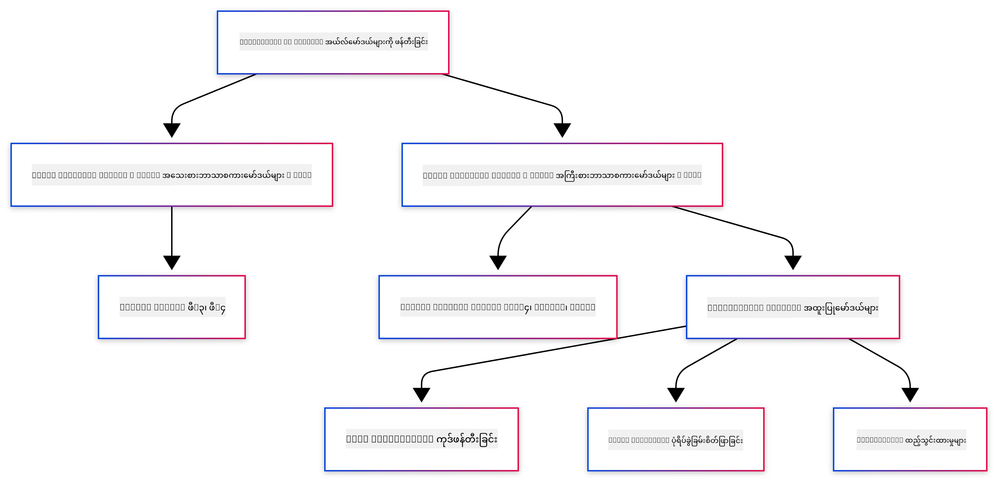
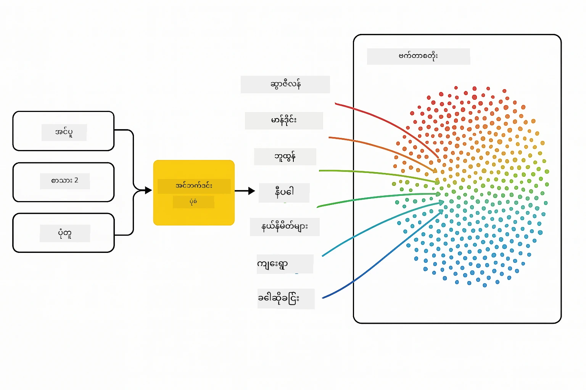
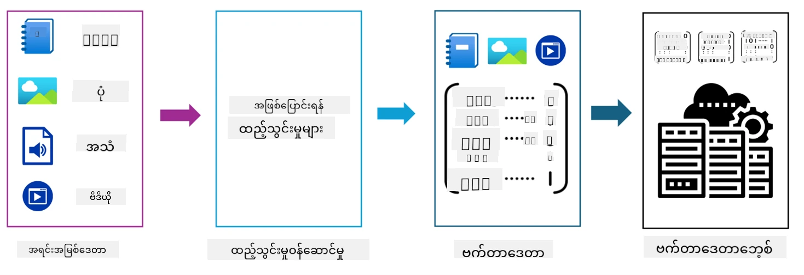
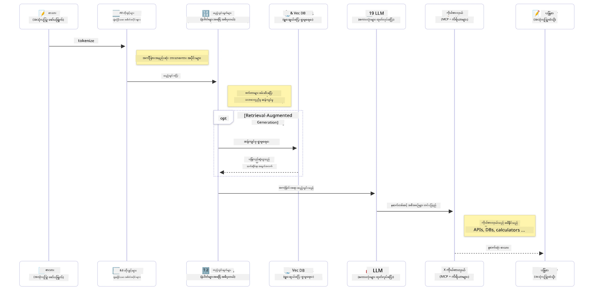

# Generative AI မိတ်ဆက် - Java Edition

> **ဗီဒီယို**: [ဤသင်ခန်းစာအတွက် ဗီဒီယိုအနှစ်ချုပ်ကို YouTube တွင်ကြည့်ရှူပါ။](https://www.youtube.com/watch?v=XH46tGp_eSw) အထက်ပါ thumbnail ပုံကိုလည်းနှိပ်နိုင်သည်။

## သင်လေ့လာမည့်အရာများ

- LLMs, prompt engineering, tokens, embeddings, နှင့် vector databases တို့အပါအဝင် **Generative AI အခြေခံများ**
- Azure OpenAI SDK, Spring AI, နှင့် OpenAI Java SDK တို့ပါဝင်သည့် **Java AI ဖွံ့ဖြိုးမှု ကိရိယာများနှင့်စာကြည့်တိုက်များ နှိုင်းယှဉ်ချက်**
- AI agent ဆက်သွယ်မှုတွင် ပါဝင်သည့် **Model Context Protocol ကို ရှာဖွေခြင်း**

## အကြောင်းအရာဇယား

- [မိတ်ဆက်](#မိတ်ဆက်)
- [Generative AI အကြောင်း အမြန်ပြန်လည်သတိပေးခြင်း](#generative-ai-အကြောင်း-အမြန်ပြန်လည်သတိပေးခြင်း)
- [Prompt engineering ပြန်လည်သုံးသပ်ခြင်း](#prompt-engineering-ပြန်လည်သုံးသပ်ခြင်း)
- [Tokens, embeddings, နှင့် agents](#tokens-embeddings-နှင့်-agents)
- [Java အတွက် AI ဖွံ့ဖြိုးမှု ကိရိယာများနှင့် စာကြည့်တိုက်များ](#java-အတွက်-ai-ဖွံ့ဖြိုးမှု-ကိရိယာများနှင့်-စာကြည့်တိုက်များ)
  - [OpenAI Java SDK](#openai-java-sdk)
  - [Spring AI](#spring-ai)
  - [Azure OpenAI Java SDK](#azure-openai-java-sdk)
- [စာသားအကျဉ်း](#စာသား-အကျဉ်းချုပ်)
- [နောက်တစ်ဆင့်များ](#နောက်တစ်ဆင့်များ)

## မိတ်ဆက်

Generative AI for Beginners - Java Edition ၏ ပထမဆုံးအခန်းသို့ ကြိုဆိုပါသည်! ဤအခြေခံသင်ခန်းစာသည် generative AI ၏ အဓိကစိတ်အကြောင်းအရာများနှင့် Java ကို အသုံးပြု၍ ပုံစံများကို ကိုင်တွယ်နည်းကို မိတ်ဆက်ပေးပါသည်။ သင်သည် AI အသုံးပြု application များအတွက် မပါမဖြစ်လိုအပ်သောအကြောင်းအရာများဖြစ်သည့် Large Language Models (LLMs), tokens, embeddings, နှင့် AI agents များကို တက်ကြွစွာ လေ့လာလိမ့်မည်။ လမ်းညွှန်ပြီး Java tooling အဓိကကျပြီးဤသင်တန်းတစ်လျှောက်လုံး တွဲစပ်အသုံးပြုမည့် ကိရိယာများကိုလည်း လေ့လာသွားမှာဖြစ်သည်။

### Generative AI အကြောင်း အမြန်ပြန်လည်သတိပေးခြင်း

Generative AI သည် ဒေတာမှသင်ယူထားသော ပုံစံနှင့် ဆက်နွယ်မှုများအပေါ် အခြေခံ၍ စာသား၊ ပုံပန်း၊ သို့မဟုတ်ကုဒ်ကဲ့သို့သော အကြောင်းအရာအသစ်များကို ဖန်တီးပေးသော artificial intelligence အမျိုးအစားဖြစ်သည်။ Generative AI မော်ဒယ်များသည် လူသားလို တုံ့ပြန်ချက်များ ဖန်တီးပေးနိုင်ပြီး၊ context ကိုနားလည်နိုင်သလို မကြာခဏ လူဘယ်လိုဖြစ်ကြောင်းနှင့် သက်ဆိုင်သည့် အကြောင်းအရာများကို ဒေသန္တရလည်း ဖန်တီးနိုင်သည်။

သင် Java AI အက်ပ်များ ဖန်တီးသည့်အခါ၊ **generative AI မော်ဒယ်များ**ကို အသုံးပြုမည်ဖြစ်ပြီး အောက်ပါ စွမ်းဆောင်ရည်များပါဝင်သည် -

- **စာသားထုတ်လုပ်ခြင်း**: chatbot များ၊ အကြောင်းအရာများနှင့် စာသားဖြည့်စွတ်ခြင်းအတွက် လူသားတုန်လှုပ်စာသားများ ဖန်တီးခြင်း။
- **ပုံရိပ်ဖန်တီးခြင်းနှင့်သုံးသပ်ခြင်း**: တကယ့်လိုပုံရိပ်များ ဖန်တီးခြင်း၊ ဓာတ်ပုံတိုးတက်စေခြင်းနှင့် အရာဝတ္ထုတွေ့ရှိခြင်း။
- **ကုဒ်ရေးခြင်း**: ကုဒ်စာသား သို့မဟုတ် script များရေးဆွဲခြင်း။

လူတစ်ဦးလုပ်ငန်းအမျိုးမျိုးအတွက် optimize လုပ်ထားသည့် မော်ဒယ်အမျိုးအစားများ ရှိသည်။ ဥပမာအားဖြင့်, **Small Language Models (SLMs)** နှင့် **Large Language Models (LLMs)** နှစ်မျိုးစလုံး စာသားထုတ်လုပ်မှုလုပ်ငန်းကို ကိုင်တွယ်နိုင်ပြီး LLMs သည် ပိုရှုပ်ထွေးသော လုပ်ငန်းများအတွက် ပိုမိုကောင်းမွန်သော စွမ်းရည်ပေးသည်။ ပုံနှင့်ပတ်သက်သော လုပ်ငန်းများအတွက် မျက်မြင်ဆိုင်ရာ မော်ဒယ်များ သို့မဟုတ် multi-modal မော်ဒယ်များကို အသုံးပြုသည်။

အကြောင်းအရာတွေမှာ အချိန်တိုင်း ပြည့်စုံမှုမရှိပါ။ မော်ဒယ်များက "hallucinating" လုပ်ခြင်း သို့မဟုတ် မှားယွင်းသော အချက်အလက်များကို တိကျ နိုင်ငံရေးနှင့်တူ အတိုင်း ဖန်တီးပေးတတ်ခြင်းများကို ကြားဖူးဖြစ်ဖြစ် စဉ်းစားပါ။ သို့သော် ထောက်ပြချက်ရှင်းလင်းပြီး context ကောင်းပေးခြင်းဖြင့် မော်ဒယ်၏ တုံ့ပြန်ချက်များ ပိုမိုကောင်းမွန်စေဖို့ လမ်းညွှန်နိုင်ပါသည်။ ၎င်းကို **prompt engineering** ဟုခေါ်သည်။

#### Prompt engineering ပြန်လည်သုံးသပ်ခြင်း

Prompt engineering သည် AI မော်ဒယ်များကို ဆန္ဒရှိ output များသို့ ဦးတည်စေရန် ထိရောက်သော input များကို ဒီဇိုင်းဆွဲပေးခြင်းဖြစ်သည်။ ၎င်းတွင် ပါဝင်သည် -

- **ရှင်းလင်းမှု**: ညွှန်ကြားချက်များကို ရှင်းလင်းမကြာခဏခွဲခြား
- **အကြောင်းအရာ**: လိုအပ်သော နောက်ခံအချက်အလက်ပေးခြင်း
- **ကန့်သတ်ချက်များ**: ကိုယ်ရေးမိန့်ချက် သို့မဟုတ် ပုံစံများ အသတ်မှတ်ခြင်း

Prompt engineering ၏ အကောင်းဆုံးလေ့ကျင့်မှုများမှာ prompt design, ရှင်းလင်းသောညွှန်ကြားချက်များ, လုပ်ငန်းခွဲခြင်း, one-shot နှင့် few-shot learning, နှင့် prompt tuning တို့ပါဝင်သည်။ မတူညီသော prompt များ စမ်းသပ်ခြင်းသည် သင့်အတွက် အကောင်းဆုံးနည်းလမ်း ရှာဖွေရန် အရေးကြီးသည်။

Application များဖန်တီးသည်အခါ သင် prompt အမျိုးအစားများကို အသုံးပြုမည်ဖြစ်သည် -
- **System prompts**: မော်ဒယ်၏ အခြေခံစည်းကမ်းနှင့် context တည်ဆောက်ခြင်း
- **User prompts**: သင့် application သုံးစွဲသူများထံမှ input data
- **Assistant prompts**: system နှင့် user prompt များအပေါ် အခြေခံသော မော်ဒယ်၏ တုံ့ပြန်ချက်များ

> **ပိုမိုလေ့လာရန်**: [Generative AI for Beginners သင်တန်း၏ Prompt Engineering အခန်း](https://github.com/microsoft/generative-ai-for-beginners/tree/main/04-prompt-engineering-fundamentals) တွင် prompt engineering အကြောင်းနက်နက်နဲနဲ လေ့လာနိုင်ပါသည်။

#### Tokens, embeddings နှင့် agents

Generative AI မော်ဒယ်နှင့်အလုပ်လုပ်ရာတွင် **tokens**, **embeddings**, **agents**, နှင့် **Model Context Protocol (MCP)** စသည့်စာလုံးများကိုတွေ့မြင်ရမည်ဖြစ်ပြီး အောက်တွင် အသေးစိတ်ရှင်းပြထားသည် -

- **Tokens**: Tokens သည် မော်ဒယ်အတွက် အနည်းဆုံးစာသားယူနစ်ဖြစ်သည်။ ၎င်းသည် စကားလုံးများ၊ အက္ခရာများ သို့မဟုတ် subwords ဖြစ်နိုင်သည်။ Tokens များသည် စာသားဒေတာကို မော်ဒယ်နားလည်နိုင်သည့်ပုံစံဖြင့် ကိုယ်စားပြုရန်အသုံးပြုသည်။ ဥပမာ `"The quick brown fox jumped over the lazy dog"` ဆိုသောစာသားကို tokenization နည်းပညာပေါ်မူတည်၍ ["The", " quick", " brown", " fox", " jumped", " over", " the", " lazy", " dog"] သို့မဟုတ် ["The", " qu", "ick", " br", "own", " fox", " jump", "ed", " over", " the", " la", "zy", " dog"] ကဲ့သို့ ခွဲခြားနိုင်သည်။

Tokenize ပြုလုပ်ခြင်းသည် စာသားကို မော်ဒယ်အတွက် လိုအပ်သည့် သေးငယ်သော ယူနစ်များသို့ ခွဲခြားခြင်း ဖြစ်သည်။ မော်ဒယ်များသည် မူလစာသားမဟုတ်ဘဲ token များပေါ်တွင် အသုံးပြုသည်ကား အလွန်အရေးကြီးသည်။ Prompt အတွက် tokens အရေအတွက်သည် မော်ဒယ်၏ တုံ့ပြန်မှု အရွယ်အစားနှင့် အရည်အသွေးကို သက်ရောက်သည်၊ အကြောင်းမှာ မော်ဒယ်များတွင် context window အတွင်း tokens ကန့်သတ်ချက်များ ရှိသည် (ဥပမာ GPT-4o ၏ context window သည် 128K tokens ဖြစ်ပြီး input နှင့် output ထည့်သွင်းပါသည်)။

  Java တွင် OpenAI SDK ကဲ့သို့သော စာကြည့်တိုက်များကို အသုံးပြု၍ AI မော်ဒယ်များသို့ တောင်းဆိုချက်များ ပေးပို့စဉ် automatic tokenization ကိုလုပ်ဆောင်နိုင်သည်။

- **Embeddings**: Embeddings သည် tokens များ၏ semantic အဓိပ္ပါယ်ကို ဖော်ပြသော ဗက်တာပုံစံ ကိုယ်စားလှယ်ဖြစ်သည်။ ဤသည်တို့သည် မော်ဒယ်အား စကားလုံးများအကြား ဆက်စပ်ရာနှင့် context အတွက် သက်ဆိုင်ရာတုံ့ပြန်မှုများ ဖန်တီးနိုင်ရန် ကူညီပေးသော နံပါတ်ဖော်ပြမှုများ (အများအားဖြင့် floating-point နံပါတ်များ ပါဝင်သည့် array များ) ဖြစ်သည်။ နှိုင်းယှဉ်ရလွယ်သော စကားလုံးများသည် နီးစပ်သော embeddings များရှိကာ မော်ဒယ်အား synonyms နှင့် semantic ဆက်စပ်မှုများ နားလည်စေရန် ကူညီသည်။

  Java တွင် OpenAI SDK သို့မဟုတ် embedding ဖန်တီးမှုကို ထောက်ပံ့သည့် ထိပ်တန်းစာကြည့်တိုက်များကို အသုံးပြုပြီး embeddings ထုတ်နိုင်ပါသည်။ ဤ embeddings များသည် semantic search ကဲ့သို့၊ တိကျသမျှစာသားကို မလိုအပ်ဘဲ အဓိပ္ပာယ်အရ ဆင်တူမှုရှိသော အကြောင်းအရာများကို ရှာဖွေရန်အတွက် အားဖြည့်ချက်အပြု ဖြစ်သည်။

- **Vector databases**: Vector databases သည် embeddings သိမ်းဆည်းရာ၌ စနစ်တကျ optimize လုပ်ထားသော သိမ်းဆည်းမှုစနစ်များဖြစ်သည်။ ၎င်းတို့သည် similarity search ကို ထိရောက်စွာ ဖြေရှင်းနိုင်ကာ Retrieval-Augmented Generation (RAG) ပုံစံများတွင် အဓိက အခန်းကဏ္ဍ ပါဝင်သည်။ RAG အတွင်း semantic similarity အပေါ် မူတည်၍ သက်ဆိုင်ရာ ဒေတာများကို ကွင်းကျယ်သော ဒေတာအစုအဝေးမှ ရှာဖွေသည်။

> **မှတ်ချက်**: ဤသင်တန်းတွင် Vector databases ကို မပါဝင်ပေမယ့် လိုက်နာသော applications တွင် အများပြည့်အသုံးပြုကြောင်း မှတ်သားဖော်ပြပါသည်။

- **Agents & MCP**: မော်ဒယ်များ၊ ကိရိယာများနှင့် ပြင်ပစနစ်များကို ကိုယ်တိုင် ဆက်သွယ်လုပ်ဆောင်နိုင်သော AI အစိတ်အပိုင်းများ။ Model Context Protocol (MCP) သည် agents များအတွက် လုံခြုံပြီး ပြင်ပ ဒေတာရင်းမြစ်များနှင့် ကိရိယာများကို ဝင်ခွင့် ရယူရန် စံသတ်မှတ်ချက်ဖြစ်သည်။ [MCP for Beginners](https://github.com/microsoft/mcp-for-beginners) သင်တန်းတွင်ပိုမိုသိရှိနိုင်သည်။

Java AI applications တွင် သင်သည် စာသား သုံးသပ်မှုအတွက် tokens များ၊ semantic search နှင့် RAG အတွက် embeddings များ၊ ဒေတာ ရှာဖွေရေးအတွက် vector databases များနှင့် သတိပေးစနစ်များ ဖန်တီးရန် agents & MCP ကို အသုံးပြုပါမည်။

### Java အတွက် AI ဖွံ့ဖြိုးမှု ကိရိယာများနှင့် စာကြည့်တိုက်များ

Java သည် AI ဖွံ့ဖြိုးမှုအတွက် ထူးခြားလှသော ကိရိယာများ ဖြည့်စွက် ပေးသည်။ ဤသင်တန်းတွင် OpenAI Java SDK, Azure OpenAI SDK, နှင့် Spring AI ဆိုသော အဓိက စာကြည့်တိုက်သုံးခုကို လေ့လာသွားမည် ဖြစ်သည်။

အောက်တွင် ဘယ်chapter တွင် ဘယ် SDK ကိုအသုံးပြုထားသည်ဆိုသော အကျဉ်းချုပ်ဇယားကို ပြထားသည် -

| အခန်း | နမူနာ | SDK |
|---------|--------|-----|
| 02-SetupDevEnvironment | github-models | OpenAI Java SDK |
| 02-SetupDevEnvironment | basic-chat-azure | Spring AI Azure OpenAI |
| 03-CoreGenerativeAITechniques | examples | Azure OpenAI SDK |
| 04-PracticalSamples | petstory | OpenAI Java SDK |
| 04-PracticalSamples | foundrylocal | OpenAI Java SDK |
| 04-PracticalSamples | calculator | Spring AI MCP SDK + LangChain4j |

**SDK စာရွက်စာတမ်းများလင့်ခ်များ:**
- [Azure OpenAI Java SDK](https://github.com/Azure/azure-sdk-for-java/tree/azure-ai-openai_1.0.0-beta.16/sdk/openai/azure-ai-openai)
- [Spring AI](https://docs.spring.io/spring-ai/reference/)
- [OpenAI Java SDK](https://github.com/openai/openai-java)
- [LangChain4j](https://docs.langchain4j.dev/)

#### OpenAI Java SDK

OpenAI SDK သည် OpenAI API အတွက် တရားဝင် Java စာကြည့်တိုက်ဖြစ်သည်။ ၎င်းသည် OpenAI မော်ဒယ်များနှင့် ဆက်သွယ်ရန် ရိုးရှင်း၍ တစ်မျိုးတည်းသောအင်တာဖေ့စ်ကို ပေးပြီး Java application များတွင် AI စွမ်းဆောင်ရည်များ ထည့်သွင်းရန် လွယ်ကူစေသည်။ Chapter 2 ၏ GitHub Models နမူနာ၊ Chapter 4 ၏ Pet Story အသုံးပြုမှုနှင့် Foundry Local နမူနာသည် OpenAI SDK ကို အသုံးပြုမှုကို ပြသသည်။

#### Spring AI

Spring AI သည် Spring application များအတွက် AI စွမ်းဆောင်ရည်များ ပံ့ပိုးပေးသော ကြီးမြတ်ပြီး အပြည့်အစုံအဆင့် framework ဖြစ်ပြီး AI ပေးသူများ အမျိုးမျိုးကို တစ်ပြိုင်တည်း abstraction layer ဖြင့်ပေးဆောင်သည်။ Spring ecosystem နှင့် စပ်လျဉ်းမှုကောင်းစွာ ရှိ၍ AI အသုံးပြုရန် လုပ်ငန်းအဆင့် Java application များအတွက် သင့်တော်သော ရွေးချယ်မှုဖြစ်သည်။

Spring AI ၏ အားသာချက်မှာ Spring ecosystem နှင့် မျှတစွာ ပေါင်းစပ်ခြင်းဖြစ်၍ dependency injection, configuration management, testing frameworks ကဲ့သို့သော Spring ပုံစံများဖြင့် ထုတ်လုပ်ရေးအဆင့် ပြင်ဆင်လိုသူ application များ ဖန်တီးရန် လွယ်ကူစေသည်။ Chapter 2 နှင့် 4 တွင် Spring AI ကိုအသုံးပြုကာ OpenAI နှင့် Model Context Protocol (MCP) Spring AI စာကြည့်တိုက်များအား အတူတကွ အသုံးပြုသော application များ တည်ဆောက်မည်ဖြစ်သည်။

##### Model Context Protocol (MCP)

[Model Context Protocol (MCP)](https://modelcontextprotocol.io/) သည် AI application များအား ပြင်ပ ဒေတာရင်းမြစ်များနှင့် ကိရိယာများကို လုံခြုံစိတ်ချစွာ ဆက်သွယ်နိုင်စေရန် စံသတ်မှတ်ချက် အသစ်ဖြစ်သည်။ MCP သည် AI မော်ဒယ်များအား context အချက်အလက်များ ဝင်ရောက် ရယူခြင်းနှင့် သင့် application တွင် လုပ်ဆောင်မှုများကျင်းပနိုင်သော ညွှန်ကြားချက်များ ပံ့ပိုးပေးသည်။

Chapter 4 တွင် MCP ၏ အခြေခံသဘောတရားများကို ပြသသည့် ရိုးရှင်းသော MCP calculator service ကို Spring AI ဖြင့် ဖန်တီးသွားမည် ဖြစ်သည်၊ ကိရိယာပေါင်းစည်းခြင်းနှင့် service architecture များ ဖန်တီးပုံကို ဖော်ပြမည်။

#### Azure OpenAI Java SDK

Azure OpenAI Java client library သည် OpenAI ၏ REST API များကို Azure SDK ecosystem အတွင်း idiomatic interface နှင့် ပေါင်းစည်းမှုဖြင့် အသုံးပြုနိုင်ရေး အတွက် ပြင်ဆင်ထားသည့် adaptation ဖြစ်သည်။ Chapter 3 တွင် Azure OpenAI SDK ကို အသုံးပြုကာ chatbot application များ၊ function calling နှင့် RAG (Retrieval-Augmented Generation) ပုံစံများ ဖန်တီးပါမည်။

> မှတ်ချက်: Azure OpenAI SDK သည် OpenAI Java SDK နှင့် နည်းပညာပိုင်းတွင် နောက်ကျသေးသဖြင့် နောင်တစ်ချိန်တွင် project များအတွက် OpenAI Java SDK ကို စဉ်းစားသုံးစွဲခြင်း အကြံပြုသည်။

## စာသား အကျဉ်းချုပ်

အခြေခံအကြောင်းအရာများ ပြီးစီးပါပြီ! သင်နားလည်ပါပြီ -

- generative AI ၏ အဓိကအကြောင်းအရာများ - LLMs နှင့် prompt engineering မှ tokens, embeddings, နှင့် vector databases တို့အထိ
- Java AI ဖွံ့ဖြိုးမှုအတွက် သင့်လက်ရှိ ကိရိယာရွေးချယ်စရာများ - Azure OpenAI SDK, Spring AI, နှင့် OpenAI Java SDK
- Model Context Protocol ၏ အဓိကအချက်နှင့် AI agents များပြင်ပ ကိရိယာများ နှင့် ပူးပေါင်းဆောင်ရွက်နိုင်စေရန် ဘယ်လို အရေးပါသည်ဆိုတာ

## နောက်တစ်ဆင့်များ

[အခန်း ၂: ဖွံ့ဖြိုးမှု ပတ်ဝန်းကျင် ပြင်ဆင်ခြင်း](../02-SetupDevEnvironment/README.md)

---

<!-- CO-OP TRANSLATOR DISCLAIMER START -->
**ကန့်သတ်ချက်**:
ဤစာတမ်းကို AI ဘာသာပြန်ဆောင်းရေးဝန်ဆောင်မှု [Co-op Translator](https://github.com/Azure/co-op-translator) အသုံးပြု၍ ဘာသာပြန်ထားပါသည်။ တိကျမှုအတွက် ကြိုးစားခဲ့သော်လည်း၊ အလိုအလျောက် ဘာသာပြန်မှုများတွင် အမှားများ သို့မဟုတ် မှားယွင်းမှုများ ပါရှိနိုင်ကြောင်း ကျေးဇူးပြု၍ သတိပြုပါ။ မူရင်းစာတမ်းကို မူပိုင်ဘာသာဖြင့်သာ ယုံကြည်ဖတ်ရှုသင့်ပြီး ယင်းအတွက်သာ တရားဝင် အရင်းအမြစ်အဖြစ် သတ်မှတ်သင့်သည်။ အရေးကြီးသော သတင်းအချက်အလက်များအတွက် လူ့ပညာရှင်များမှ ဘာသာပြန်ခြင်းကို အကြံပြုပါသည်။ ဤဘာသာပြန်ချက်ကို အသုံးပြုခြင်းကြောင့် ဖြစ်ပေါ်လာနိုင်သော မဖြစ်နိုင်ချေရှိသည့် နားမလည်မှုများ သို့မဟုတ် မှားယွင်းဖော်ပြမှုများအတွက် ကျွန်ုပ်တို့ အပြစ်မရှိပါ။
<!-- CO-OP TRANSLATOR DISCLAIMER END -->