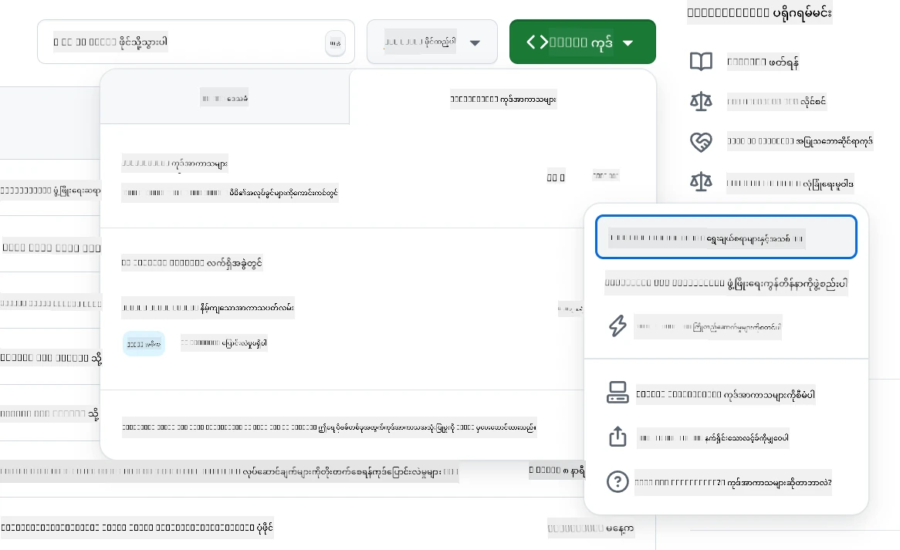
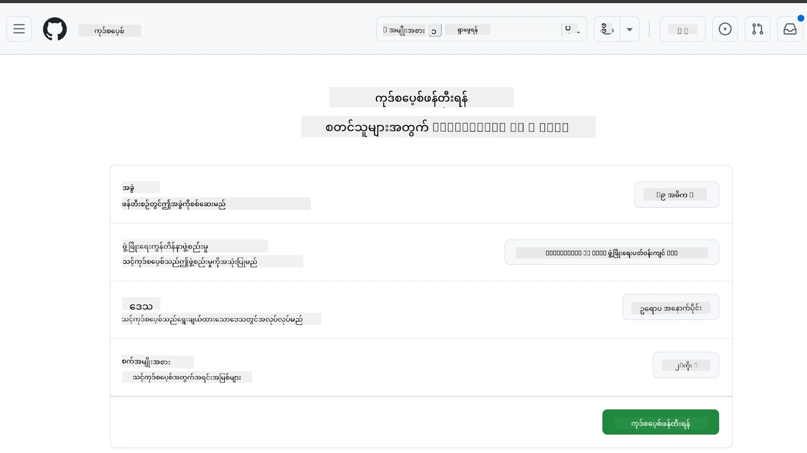
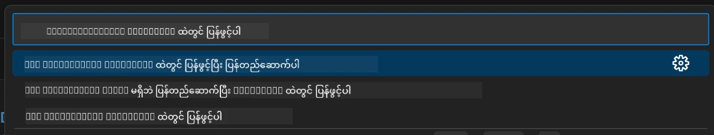
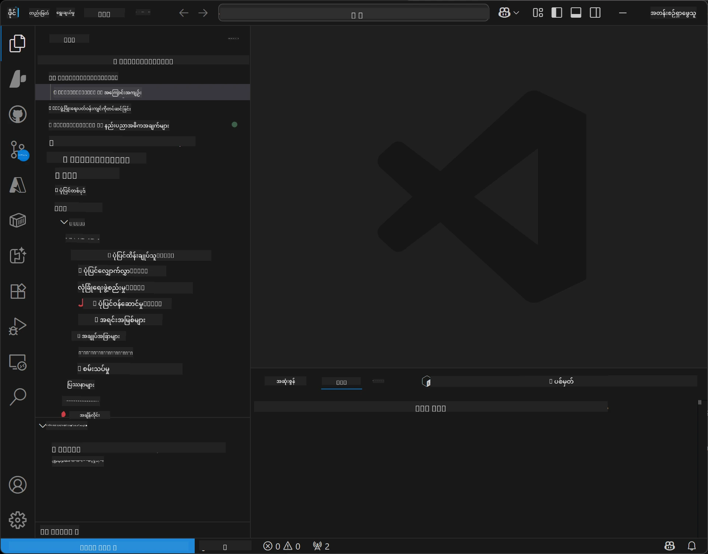
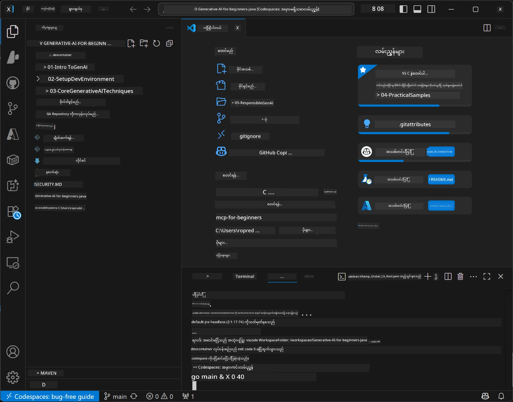

<!--
CO_OP_TRANSLATOR_METADATA:
{
  "original_hash": "96a30d42b9751a3d4e4b20e28d29d459",
  "translation_date": "2026-01-28T05:28:25+00:00",
  "source_file": "02-SetupDevEnvironment/README.md",
  "language_code": "my"
}
-->
# Java အတွက် Generative AI အတွက် ဖွံ့ဖြိုးရေးပတ်ဝန်းကျင် တပ်ဆင်ခြင်း

> **အမြန်စတင်ရန်**: ၂ မိနစ်အတွင်း Cloud မှာ ကုဒ်ရေးပါ - [GitHub Codespaces Setup](../../../02-SetupDevEnvironment) ကို ရောက်ပါ - ဒါဟာ ဒေသတွင်း တပ်ဆင်မှုမလိုအပ်ဘဲ github မော်ဒယ်တွေကို အသုံးပြုပါတယ်!

> **Azure OpenAI စိတ်ဝင်စားပါသလား?**, ကျွန်ုပ်တို့ရဲ့ [Azure OpenAI Setup Guide](getting-started-azure-openai.md) ကို ကြည့်ပါ၊ Azure OpenAI အရင်းအမြစ်အသစ် တည်ဆောက်ခြင်းအဆင့်များနှင့်အတူ။

## သင်ယူမည့်အရာများ

- AI အပလီကေးရှင်းများအတွက် Java ဖွံ့ဖြိုးရေးပတ်ဝန်းကျင် တပ်ဆင်ခြင်း
- သင့်ကြိုက်နှစ်သက်ရာ ဖွံ့ဖြိုးရေးပတ်ဝန်းကျင်ကို (Codespaces နဲ့ cloud-first, ဒေသတွင်း dev container, ဒါမှမဟုတ် လုံးဝ ဒေသတွင်း ပတ်ဝန်းကျင်) ရွေးချယ်ပြီး အပြင်အဆင် ပြုလုပ်ခြင်း
- သင့်စနစ်ကို GitHub မော်ဒယ်များနှင့် တွဲဖက် စမ်းသပ်ခြင်း

## အကြောင်းအရာဇယား

- [သင်ယူမည့်အရာများ](../../../02-SetupDevEnvironment)
- [နိဒါန်း](../../../02-SetupDevEnvironment)
- [အဆင့် ၁: သင့်ဖွံ့ဖြိုးရေးပတ်ဝန်းကျင် တပ်ဆင်ခြင်း](../../../02-SetupDevEnvironment)
  - [ရွေးချယ်မှု A: GitHub Codespaces (အကြံပြု)](../../../02-SetupDevEnvironment)
  - [ရွေးချယ်မှု B: ဒေသတွင်း Dev Container](../../../02-SetupDevEnvironment)
  - [ရွေးချယ်မှု C: သင့်ရှိပြီးသား ဒေသတွင်း တပ်ဆင်မှုကို အသုံးပြုရန်](../../../02-SetupDevEnvironment)
- [အဆင့် ၂: GitHub ကိုယ်ပိုင် Access Token ကို ဖန်တီးခြင်း](../../../02-SetupDevEnvironment)
- [အဆင့် ၃: သင့်စနစ်ကို စမ်းသပ်ခြင်း](../../../02-SetupDevEnvironment)
- [ပြဿနာဖြေရှင်းခြင်း](../../../02-SetupDevEnvironment)
- [အနှစ်ချုပ်](../../../02-SetupDevEnvironment)
- [နောက်တစ်ဆင့်များ](../../../02-SetupDevEnvironment)

## နိဒါန်း

ဒီအခန်းမှာ ဖွံ့ဖြိုးရေးပတ်ဝန်းကျင်တစ်ခုကို တပ်ဆင်ပုံကို လမ်းညွှန်ပါမယ်။ ကျွန်ုပ်တို့အတွက် အဓိက ဥပမာအနေနဲ့ **GitHub Models** ကို အသုံးပြုမှာဖြစ်ပြီး၊ ဒါဟာ အခမဲ့ ဖြစ်ပြီး GitHub အကောင့်တစ်ခုသာ လိုအပ်ပြီး ကုဒ်ကတ်မလိုအပ်၊ စမ်းသပ်နိုင်စွမ်းရှိတဲ့ မော်ဒယ်များစွာ အသုံးပြုခွင့်ရှိပါတယ်။

**ဒေသတွင်း တပ်ဆင်မှု မလိုအပ်ပါ!** GitHub Codespaces ကို အသုံးပြု၍ ဘရောက်ဇာတစ်ခုလုံးထဲမှာ အပြည့်အဝ ဖွံ့ဖြိုးရေးပတ်ဝန်းကျင် တစ်ခုရရှိနိုင်ပြီး ချက်ချင်း ကုဒ်ရေးသားနိုင်ပါတယ်။


ဒီသင်တန်းအတွက် [**GitHub Models**](https://github.com/marketplace?type=models) ကို အသုံးပြုခွင့် ပေးတာမှာ အောက်ပါအချက်တွေကြောင့် အကြံပြုပါတယ် –
- စတင်ဖို့ **အခမဲ့**
- GitHub အကောင့်တစ်ခုနဲ့ စတင်ဖို့ **လွယ်ကူ**
- **ကုဒ်ကတ် မလိုအပ်ပါ**
- စမ်းသပ်ရန် **မော်ဒယ်များစွာ** ရရှိနိုင်

> **မှတ်ချက်**: ဒီသင်တန်းမှာ အသုံးပြုမယ့် GitHub Models များတွင် အခမဲ့ အကန့်အသတ်များမှာ:
> - မိနစ်တိုင်း ၁၅ ကြိမ် (တနေ့လျှင် ၁၅၀ ကြိမ်)
> - တစ်ချက်တည်းမှာ စာလုံး ~၈၀၀၀ ထည့်၊ ~၄၀၀၀ ထွက်
> - တပြိုင်နက် ၅ ချက်တင်
> 
> ထုတ်လုပ်မှုအတွက် အသုံးပြုမယ်ဆို Azure AI Foundry Models ကို သင့် Azure အကောင့် နဲ့ ပြောင်းလဲသုံးရန်။ သင့်ကုဒ်ကို ပြောင်းလဲရန် မလိုအပ်ပါ။ [Azure AI Foundry စာရွက်စာတမ်း](https://learn.microsoft.com/azure/ai-foundry/foundry-models/how-to/quickstart-github-models) ကို ကြည့်ပါ။

## အဆင့် ၁: သင့်ဖွံ့ဖြိုးရေးပတ်ဝန်းကျင် တပ်ဆင်ခြင်း

<a name="quick-start-cloud"></a>

Generative AI for Java သင်တန်းအတွက် လိုအပ်တဲ့ ကိရိယာများအားလုံးပါရှိစေရန်၊ တပ်ဆင်ချိန်ကို လျော့နည်းစေရန် ကြိုတင်ပြင်ဆင်ထားတဲ့ ဖွံ့ဖြိုးရေး ကွန်တိန်နာတစ်ခုကို ဖန်တီးပေးထားပါတယ်။ သင့်နှစ်သက်ရာ ဖွံ့ဖြိုးရေးနည်းလမ်းကိုရွေးချယ်ပါ။

### ပတ်ဝန်းကျင် တပ်ဆင်မှု ရွေးချယ်မှုများ

#### ရွေးချယ်မှု A: GitHub Codespaces (အကြံပြု)

**၂ မိနစ်အတွင်း ကုဒ်ရေးသားစတင်နိုင်သည် - ဒေသတွင်း တပ်ဆင်မှု မလိုပါ!**

1. ဤrepository ကို သင့် GitHub အကောင့်ထဲသို့ fork လုပ်ပါ
   > **မှတ်ချက်**: မူလ config ကို ပြင်ချင်ပါက [Dev Container Configuration](../../../.devcontainer/devcontainer.json) ကို ကြည့်ပါ
2. **Code** → **Codespaces** tabs → **...** → **New with options...** ကိုနှိပ်ပါ
3. မူလထားပေးထားသည့် Dev container configuration ကို အသုံးပြုပါ – ဒီသင်တန်းအတွက် ဖန်တီးထားတဲ့ **Generative AI Java Development Environment** custom devcontainer ကို ရွေးပါ
4. **Create codespace** ကို နှိပ်ပါ
5. ပတ်ဝန်းကျင် ပြင်ဆင်မှု ပြီးမြောက်ရန် ~၂ မိနစ် ခဏစောင့်ပါ
6. [အဆင့် ၂: GitHub Token ဖန်တီးခြင်း](../../../02-SetupDevEnvironment) ထိ ရောက်ပါ






> **Codespaces ၏ အကျိုးကျေးဇူးများ**:
> - ဒေသတွင်း ထည့်သွင်းစရာ မလိုပါ
> - ဘရောက်ဇာရှိမည့် မည်သည့် စက်လည်း အလုပ်လုပ်နိုင်သည်
> - ကိရိယာများနှင့် အားလုံး ကြိုတင်ပြင်ဆင်ထားသည်
> - တစ်လလျှင် ကိုယ်ပိုင် အကောင့်များအတွက် ၆၀ နာရီ အခမဲ့
> - စီမံခန့်ခွဲမှု အဆင်ပြေသော ပတ်ဝန်းကျင်

#### ရွေးချယ်မှု B: ဒေသတွင်း Dev Container

**Docker ထည့်သွင်း၍ ဒေသတွင်း ဖွံ့ဖြိုးသူများအတွက်**

1. ဤ repository ကို သင့် ဒေသတွင်း စက်သို့ fork နှင့် clone လုပ်ပါ
   > **မှတ်ချက်**: မူလ config ကို ပြင်ချင်ပါက [Dev Container Configuration](../../../.devcontainer/devcontainer.json) ကို ကြည့်ပါ
2. [Docker Desktop](https://www.docker.com/products/docker-desktop/) နှင့် [VS Code](https://code.visualstudio.com/) ကို ထည့်သွင်းပါ
3. VS Code မှာ [Dev Containers extension](https://marketplace.visualstudio.com/items?itemName=ms-vscode-remote.remote-containers) ကို ထည့်သွင်းပါ
4. Repository ဖိုလ်ဒါကို VS Code မှာ ဖွင့်ပါ
5. Prompt ဆိုင်ရာမှာ **Reopen in Container** ကိုနှိပ်ပါ (သို့မဟုတ် `Ctrl+Shift+P` → "Dev Containers: Reopen in Container" ကို သုံးပါ)
6. ကွန်တိန်နာ တည်ဆောက်ခြင်းနှင့် စတင်ခြင်း ပြီးမြောက်ရန် ခဏစောင့်ပါ
7. [အဆင့် ၂: GitHub Token ဖန်တီးခြင်း](../../../02-SetupDevEnvironment) ထိ ရောက်ပါ





#### ရွေးချယ်မှု C: သင့်ရှိပြီးသား ဒေသတွင်း တပ်ဆင်မှုကို အသုံးပြုရန်

**ရှိပြီးသား Java ပတ်ဝန်းကျင်ဖြင့် ဖွံ့ဖြိုးသူများအတွက်**

လိုအပ်ချက်များ:  
- [Java 21+](https://www.oracle.com/java/technologies/javase/jdk21-archive-downloads.html)  
- [Maven 3.9+](https://maven.apache.org/download.cgi)  
- [VS Code](https://code.visualstudio.com) သို့မဟုတ် သင့်နှစ်သက်ရာ IDE

အဆင့်များ:  
1. ဤ repository ကို သင့် ဒေသတွင်းစက်သို့ clone လုပ်ပါ  
2. သင့် IDE မှာ ပရောဂျက်ကို ဖွင့်ပါ  
3. [အဆင့် ၂: GitHub Token ဖန်တီးခြင်း](../../../02-SetupDevEnvironment) ထိ ရောက်ပါ

> **အကြံပြုချက်**: သင့်မှာ low-spec စက်ရှိပြီး local မှာ VS Code အသုံးပြုချင်လျှင် GitHub Codespaces ကို သုံးပါ။ ဒါမှတဆင့် သင့် local VS Code ကို cloud မှ Codespace နဲ့ ချိတ်ဆက်ပြီး အကောင်းဆုံးနှစ်ခုလုံးရရှိနိုင်ပါသည်။



## အဆင့် ၂: GitHub ကိုယ်ပိုင် Access Token ဖန်တီးခြင်း

1. [GitHub Settings](https://github.com/settings/profile) သို့ သွားရောက်ပြီး ကိုယ်ရေးအချက်အလက် မီနူးမှ **Settings** ကို ရွေးချယ်ပါ။
2. ဘယ်ဘက်ဘားဆိုင်ကာနဲ့ **Developer settings** (အောက်ဆုံးတွင် တစ်ခါတစ်ရံရှိ) ကို နှိပ်ပါ။
3. **Personal access tokens** အောက်မှ **Fine-grained tokens** (သို့မဟုတ် ဒီတိုက်ရိုက် [လင့်ခ်](https://github.com/settings/personal-access-tokens)) ကို နှိပ်ပါ။
4. **Generate new token** ကို နှိပ်ပါ။
5. "Token name" အောက်မှာ အဓိပ္ပာယ်ရှိတဲ့ နာမည်တစ်ခုရေးပါ (ဥပမာ `GenAI-Java-Course-Token`)။
6. ကာလကုန်သေဆုံးရက် ရွေးချယ်ပါ (အကြံပြုချက်: လုံခြုံရေးအတွက် ၇ ရက်)။
7. "Resource owner" အောက်မှာ သင့်အသုံးပြုသူ အကောင့်ကို ရွေးချယ်ပါ။
8. "Repository access" မှာ GitHub Models နဲ့ အသုံးပြုမည့် repository များကို ရွေးပါ (သို့မဟုတ် လိုအပ်ပါက "All repositories")။
9. "Account permissions" အောက်မှ **Models** ကို ရွေးပြီး **Read-only** သတ်မှတ်ပါ။
10. **Generate token** ကို နှိပ်ပါ။
11. **ယခု token ကို ကူးယူပြီး သိမ်းဆည်းပါ** – နောက်ထပ်မမြင်ရတော့ပါ။

> **လုံခြုံရေးအကြံပြုချက်**: သင့်ရဲ့ access token များအတွက် လိုအပ်သည့် scope နည်းဆုံးနဲ့ သုံးနိုင်သမျှ အတိုင်းဆုံး သတ်မှတ်ပါ။

## အဆင့် ၃: GitHub Models ဥပမာနဲ့ သင့်စနစ်ကို စမ်းသပ်ခြင်း

ဖွံ့ဖြိုးရေးပတ်ဝန်းကျင် ပြင်ဆင်ပြီး ဖြစ်သောအခါ၊ GitHub Models ပေါင်းစပ်အသုံးပြုမှုကို [examples/github-models](../../../02-SetupDevEnvironment/examples/github-models) ထဲက ဥပမာအပလီကေးရှင်းဖြင့် စမ်းသပ်ကြည့်ပါ။

1. ဖွံ့ဖြိုးရေးပတ်ဝန်းကျင်ထဲမှာ terminal ကို ဖွင့်ပါ။
2. GitHub Models ဥပမာ directory သို့ သွားပါ:
   ```bash
   cd 02-SetupDevEnvironment/examples/github-models
   ```
3. သင့် GitHub token ကို environment variable အနေနဲ့ သတ်မှတ်ပါ:
   ```bash
   # macOS/Linux
   export GITHUB_TOKEN=your_token_here
   
   # Windows (Command Prompt)
   set GITHUB_TOKEN=your_token_here
   
   # Windows (PowerShell)
   $env:GITHUB_TOKEN="your_token_here"
   ```

4. အပလီကေးရှင်းကို run ပါ:
   ```bash
   mvn compile exec:java -Dexec.mainClass="com.example.githubmodels.App"
   ```

အောက်ပါအတိုင်း output ပြပါလိမ့်မယ်:
```text
Using model: gpt-4.1-nano
Sending request to GitHub Models...
Response: Hello World!
```

### ဥပမာကုဒ်ကို နားလည်ခြင်း

ပထမဦးဆုံး၊ ကျွန်ုပ်တို့ အခု run လိုက်သော အရာကို နားလည်ကြည့်ပါ။ `examples/github-models` အောက်တာက ဥပမာဟာ OpenAI Java SDK ကို သုံးပြီး GitHub Models နဲ့ ချိတ်ဆက်တာဖြစ်ပါတယ်။

**ဒီကုဒ်ရဲ့ လုပ်ဆောင်ချက်များ:**
- ကိုယ်ပိုင် access token နဲ့ GitHub Models ကို **ချိတ်ဆက်သည်** 
- AI မော်ဒယ်ထံသို့ “Say Hello World!” ဆိုတဲ့ စာသား ရိုးရှင်းတဲ့ စကားပို့သည်
- AI မှ ပြန်လာတဲ့ ဖြေကြားချက်ကို **လက်ခံနှင့် ပြသသည်**
- သင့်စနစ် တပ်ဆင်မှုမှန်ကန်မှုကို **စစ်ဆေးပါသည်**

**အဓိက မူလ code မှာ ပါဝင်သော Dependency** (`pom.xml`):
```xml
<dependency>
    <groupId>com.openai</groupId>
    <artifactId>openai-java</artifactId>
    <version>2.12.0</version>
</dependency>
```

**အဓိက ကုဒ်** (`App.java`):  
```java
// OpenAI Java SDK ကို အသုံးပြု၍ GitHub မော်ဒယ်များနှင့် ချိတ်ဆက်ပါ
OpenAIClient client = OpenAIOkHttpClient.builder()
    .apiKey(pat)
    .baseUrl("https://models.inference.ai.azure.com")
    .build();

// စကားဝိုင်း ပြီးဆုံးခြင်း တောင်းဆိုချက်ကို ဖန်တီးပါ
ChatCompletionCreateParams params = ChatCompletionCreateParams.builder()
    .model(modelId)
    .addSystemMessage("You are a concise assistant.")
    .addUserMessage("Say Hello World!")
    .build();

// AI တုံ့ပြန်မှုကို ရယူပါ
ChatCompletion response = client.chat().completions().create(params);
System.out.println("Response: " + response.choices().get(0).message().content().orElse("No response content"));
```

## အနှစ်ချုပ်

ကောင်းမွန်သည်! သင့်မှာ အောက်ပါအရာအားလုံး ရှိပြီးသား ဖြစ်ပါပြီ –

- AI မော်ဒယ် အသုံးပြုခွင့် အတွက် မှန်ကန်သော GitHub Personal Access Token ဖန်တီးပြီး
- Java ဖွံ့ဖြိုးရေး ပတ်ဝန်းကျင် တပ်ဆင်ထားပြီး (Codespaces, dev containers, ဒေသတွင်း လုံးဝ တပ်ဆင်မှု အနက်မှ မည်သည့်နည်းဖြင့်ဖြစ်စေ)
- OpenAI Java SDK ဖြင့် GitHub Models နဲ့ ချိတ်ဆက်ပြီး အခမဲ့ AI ဖွံ့ဖြိုးမှု ရရှိနိုင်
- AI မော်ဒယ်များနှင့် စကားပြောတဲ့ ရိုးရှင်းတဲ့ ဥပမာနဲ့ စမ်းသပ်ပြီး အလုပ်လုပ်မှုပြည့်စုံမှု စစ်ဆေးပြီး

## နောက်တစ်ဆင့်များ

[အခန်း ၃: Core Generative AI Techniques](../03-CoreGenerativeAITechniques/README.md)

## ပြဿနာဖြေရှင်းခြင်း

ပြဿနာတွေ ရင်ဆိုင်နေရင် အောက်ပါ ပြဿနာများနှင့် ဖြေရှင်းနည်းများကို ကြည့်ပါ-

- **Token အလုပ်မလုပ်?**  
  - Token ကို အပြည့်အစုံ ကူးယူထားကြောင်း၊ ထူးခြားတဲ့ အနားဝန်း နေရာများ မပါဝင်ကြောင်း သေချာပါစေ  
  - Token ကို environment variable အနေနဲ့ မှန်ကန်စွာ သတ်မှတ်ထားကြောင်း စစ်ဆေးပါ  
  - Token permissions မဟုတ်ကြောင်းစစ်ပါ (Models: Read-only ဖြစ်သင့်သည်)  

- **Maven မတွေ့?**  
  - dev containers/Codespaces အသုံးပြုလျှင် Maven ကြိုတင် ထည့်သွင်းထားသည်  
  - ဒေသတွင်း တပ်ဆင်မှုတွင် Java 21+ နဲ့ Maven 3.9+ ထည့်သွင်းထားမှန်းစစ်ဆေးပါ  
  - `mvn --version` ဖြင့်ထည့်သွင်းမှုစစ်ဆေးပါ  

- **ချိတ်ဆက်မှု ပြဿနာ?**  
  - အင်တာနက်ချိတ်ဆက်မှု ရှိကြောင်း သေချာပါ  
  - GitHub ကို ကွန်ယက်မှ ဝင်ရောက်နိုင်ကြောင်း စစ်ဆေးပါ  
  - GitHub Models endpoint ကို ပိတ်ထားတဲ့ firewall မရှိကြောင်း ဖော်ပြပါ  

- **Dev container မစခင်ဘူး?**  
  - ဒေသတွင်း ဖွံ့ဖြိုးရေးအတွက် Docker Desktop အလုပ်လုပ်နေကြောင်း သေချာပါ  
  - Container ကို ပြန်လည်တည်ဆောက်ကြည့်ပါ: `Ctrl+Shift+P` → "Dev Containers: Rebuild Container"  

- **အပလီကေးရှင်း compile error?**  
  - မှန်ကန်တဲ့ ဒိုင်ရেকတရီတွင် ရှိကြောင်း စိစစ်ပါ: `02-SetupDevEnvironment/examples/github-models`  
  - `mvn clean compile` ဖြင့် သန့်ရှင်းရေးနှင့် ပြန်လည် တည်ဆောက်မှု လုပ်ပါ  

> **အကူအညီလိုပါသလား?**: ပြဿနာများ ရှိနေသေးလျှင် Repo မှာ issue ဖွင့်ပြီး ကျွန်ုပ်တို့ကူညီပေးပါမည်။

---

<!-- CO-OP TRANSLATOR DISCLAIMER START -->
**တောင်းပန်ချက်**:
ဤစာတမ်းကို AI ဘာသာပြန်စနစ် [Co-op Translator](https://github.com/Azure/co-op-translator) အသုံးပြုပြီးဘာသာပြန်ထားပါသည်။ ကျွန်ုပ်တို့ သေချာမှန်ကန်မှုကို ကြိုးစားဆောင်ရွက်သော်လည်း၊ အလိုအလျောက်ဘာသာပြန်မှုများတွင် အမှားများ သို့မဟုတ် မမှန်ကန်မှုများ ပါဝင်နိုင်ကြောင်း သတိပြုရန်လိုအပ်ပါသည်။ မူလစာတမ်းကို မူရင်းဘာသာဖြင့် အဆင့်မြင့် အရင်းအမြစ်အဖြစ် ယူဆသင့်ပါသည်။ အရေးကြီးသည့် သတင်းအချက်အလက်များအတွက် ပရော်ဖက်ရှင်နယ် လူသားဘာသာပြန်သူ၏ ဘာသာပြန်ချက်ကို အကြံပြုပါသည်။ ဤဘာသာပြန်ချက်အသုံးပြုရာမှ ဖြစ်ပေါ်လာနိုင်သည့် နားလည်မှုမှားယွင်းမှုများနှင့် ဖော်ပြချက်များအတွက် ကျွန်ုပ်တို့ တာဝန်မယူပါ။
<!-- CO-OP TRANSLATOR DISCLAIMER END -->