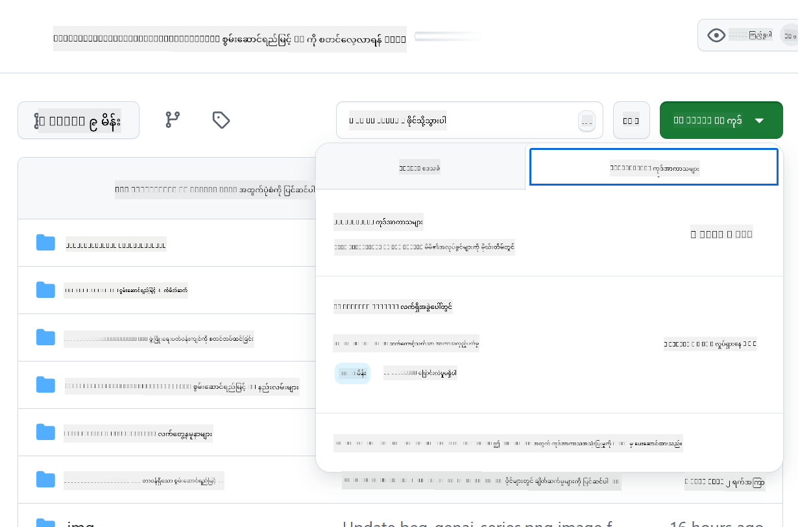

<!--
CO_OP_TRANSLATOR_METADATA:
{
  "original_hash": "e00bbea0f95c611aa3bec676d23e8b43",
  "translation_date": "2025-07-21T21:06:46+00:00",
  "source_file": "02-SetupDevEnvironment/getting-started-azure-openai.md",
  "language_code": "my"
}
-->
# Azure OpenAI အတွက် Development Environment ကို Set Up လုပ်ခြင်း

> **Quick Start**: ဒီလမ်းညွှန်စာအုပ်ကို Azure OpenAI setup အတွက် အသုံးပြုပါ။ အခမဲ့မော်ဒယ်များနှင့် အမြန်စတင်လိုပါက [GitHub Models with Codespaces](./README.md#quick-start-cloud) ကို အသုံးပြုပါ။

ဒီလမ်းညွှန်စာအုပ်က သင်၏ Java AI အက်ပ်များအတွက် Azure AI Foundry မော်ဒယ်များကို သင့်အနေဖြင့် Set Up လုပ်နိုင်ရန် ကူညီပေးပါမည်။

## အကြောင်းအရာများ

- [Quick Setup Overview](../../../02-SetupDevEnvironment)
- [အဆင့် ၁: Azure AI Foundry Resources ဖန်တီးခြင်း](../../../02-SetupDevEnvironment)
  - [Hub နှင့် Project ဖန်တီးခြင်း](../../../02-SetupDevEnvironment)
  - [GPT-4o-mini Model ကို Deploy လုပ်ခြင်း](../../../02-SetupDevEnvironment)
- [အဆင့် ၂: သင့် Codespace ကို ဖန်တီးပါ](../../../02-SetupDevEnvironment)
- [အဆင့် ၃: သင့် Environment ကို Configure လုပ်ပါ](../../../02-SetupDevEnvironment)
- [အဆင့် ၄: သင့် Setup ကို စမ်းသပ်ပါ](../../../02-SetupDevEnvironment)
- [နောက်တစ်ဆင့်မှာ ဘာလုပ်မလဲ?](../../../02-SetupDevEnvironment)
- [အရင်းအမြစ်များ](../../../02-SetupDevEnvironment)
- [အပိုဆောင်း အရင်းအမြစ်များ](../../../02-SetupDevEnvironment)

## Quick Setup Overview

1. Azure AI Foundry resources (Hub, Project, Model) ဖန်တီးပါ
2. Java development container ဖြင့် Codespace တစ်ခု ဖန်တီးပါ
3. Azure OpenAI credentials ဖြင့် သင့် .env ဖိုင်ကို Configure လုပ်ပါ
4. ဥပမာ Project ဖြင့် သင့် Setup ကို စမ်းသပ်ပါ

## အဆင့် ၁: Azure AI Foundry Resources ဖန်တီးခြင်း

### Hub နှင့် Project ဖန်တီးခြင်း

1. [Azure AI Foundry Portal](https://ai.azure.com/) သို့ သွားပြီး Sign in လုပ်ပါ
2. **+ Create** → **New hub** ကို နှိပ်ပါ (သို့မဟုတ် **Management** → **All hubs** → **+ New hub** သို့ သွားပါ)
3. သင့် hub ကို Configure လုပ်ပါ:
   - **Hub name**: ဥပမာ - "MyAIHub"
   - **Subscription**: သင့် Azure subscription ကို ရွေးပါ
   - **Resource group**: အသစ်ဖန်တီးပါ သို့မဟုတ် ရှိပြီးသားကို ရွေးပါ
   - **Location**: သင့်နီးစပ်ရာကို ရွေးပါ
   - **Storage account**: Default ကို သုံးပါ သို့မဟုတ် ကိုယ်ပိုင် Configure လုပ်ပါ
   - **Key vault**: Default ကို သုံးပါ သို့မဟုတ် ကိုယ်ပိုင် Configure လုပ်ပါ
   - **Next** → **Review + create** → **Create** ကို နှိပ်ပါ
4. ဖန်တီးပြီးပါက **+ New project** (သို့မဟုတ် hub overview မှာ **Create project**) ကို နှိပ်ပါ
   - **Project name**: ဥပမာ - "GenAIJava"
   - **Create** ကို နှိပ်ပါ

### GPT-4o-mini Model ကို Deploy လုပ်ခြင်း

1. သင့် Project မှာ **Model catalog** သို့ သွားပြီး **gpt-4o-mini** ကို ရှာပါ
   - *အခြားနည်းလမ်း: **Deployments** → **+ Create deployment** သို့ သွားပါ*
2. gpt-4o-mini model card မှာ **Deploy** ကို နှိပ်ပါ
3. Deployment ကို Configure လုပ်ပါ:
   - **Deployment name**: "gpt-4o-mini"
   - **Model version**: နောက်ဆုံးထွက်ကို သုံးပါ
   - **Deployment type**: Standard
4. **Deploy** ကို နှိပ်ပါ
5. Deployment ပြီးပါက **Deployments** tab သို့ သွားပြီး အောက်ပါအချက်အလက်များကို ကူးယူပါ:
   - **Deployment name** (ဥပမာ - "gpt-4o-mini")
   - **Target URI** (ဥပမာ - `https://your-hub-name.openai.azure.com/`)  
      > **အရေးကြီး**: Base URL (ဥပမာ - `https://myhub.openai.azure.com/`) ကိုသာ ကူးယူပါ၊ endpoint path အပြည့်အစုံကို မယူပါနှင့်။
   - **Key** (Keys and Endpoint အပိုင်းမှ)

> **အခက်အခဲရှိပါသလား?** [Azure AI Foundry Documentation](https://learn.microsoft.com/azure/ai-foundry/how-to/create-projects?tabs=ai-foundry&pivots=hub-project) ကို ကြည့်ပါ

## အဆင့် ၂: သင့် Codespace ကို ဖန်တီးပါ

1. ဒီ repository ကို သင့် GitHub အကောင့်သို့ Fork လုပ်ပါ
   > **မှတ်ချက်**: Basic config ကို ပြင်ဆင်လိုပါက [Dev Container Configuration](../../../.devcontainer/devcontainer.json) ကို ကြည့်ပါ
2. သင့် Fork လုပ်ထားသော repo မှာ **Code** → **Codespaces** tab ကို နှိပ်ပါ
3. **...** → **New with options...** ကို နှိပ်ပါ  

4. **Dev container configuration** ကို ရွေးပါ: 
   - **Generative AI Java Development Environment**
5. **Create codespace** ကို နှိပ်ပါ

## အဆင့် ၃: သင့် Environment ကို Configure လုပ်ပါ

သင့် Codespace ပြီးစီးပါက Azure OpenAI credentials ကို Set Up လုပ်ပါ:

1. **Repository root မှာ ဥပမာ Project သို့ သွားပါ:**
   ```bash
   cd 02-SetupDevEnvironment/src/basic-chat-azure
   ```

2. **သင့် .env ဖိုင်ကို ဖန်တီးပါ:**
   ```bash
   cp .env.example .env
   ```

3. **Azure OpenAI credentials ဖြင့် .env ဖိုင်ကို ပြင်ဆင်ပါ:**
   ```bash
   # Your Azure OpenAI API key (from Azure AI Foundry portal)
   AZURE_AI_KEY=your-actual-api-key-here
   
   # Your Azure OpenAI endpoint URL (e.g., https://myhub.openai.azure.com/)
   AZURE_AI_ENDPOINT=https://your-hub-name.openai.azure.com/
   ```

   > **လုံခြုံရေး မှတ်ချက်**: 
   > - `.env` ဖိုင်ကို version control တွင် မထည့်ပါနှင့်
   > - `.env` ဖိုင်ကို `.gitignore` တွင် ထည့်ပြီးသားဖြစ်သည်
   > - သင့် API keys ကို လုံခြုံစွာ သိမ်းဆည်းပြီး အချိန်ကြာလျင်လျင် ပြောင်းလဲပါ

## အဆင့် ၄: သင့် Setup ကို စမ်းသပ်ပါ

ဥပမာ application ကို run လုပ်ပြီး Azure OpenAI connection ကို စမ်းသပ်ပါ:

```bash
mvn clean spring-boot:run
```

သင် GPT-4o-mini model မှ ပြန်လာသော response ကို မြင်ရမည်!

> **VS Code အသုံးပြုသူများ**: VS Code တွင် `F5` ကို နှိပ်ပြီး application ကို run လုပ်နိုင်ပါသည်။ Launch configuration ကို `.env` ဖိုင်ကို အလိုအလျောက် load လုပ်ရန် ပြင်ဆင်ပြီးသားဖြစ်သည်။

> **အပြည့်အစုံ ဥပမာ**: [End-to-End Azure OpenAI Example](./src/basic-chat-azure/README.md) ကို ကြည့်ပြီး အသေးစိတ် လမ်းညွှန်နှင့် ပြဿနာဖြေရှင်းမှုများကို ကြည့်ပါ။

## နောက်တစ်ဆင့်မှာ ဘာလုပ်မလဲ?

**Setup ပြီးပါပြီ!** သင့်မှာ အောက်ပါအရာများရှိပါပြီ:
- gpt-4o-mini ကို Deploy လုပ်ထားသော Azure OpenAI
- Local .env ဖိုင် configuration
- Java development environment

**ဆက်လက်လုပ်ဆောင်ရန်** [Chapter 3: Core Generative AI Techniques](../03-CoreGenerativeAITechniques/README.md) သို့ သွားပြီး AI applications တည်ဆောက်ရန် စတင်ပါ!

## အရင်းအမြစ်များ

- [Azure AI Foundry Documentation](https://learn.microsoft.com/azure/ai-services/)
- [Spring AI Azure OpenAI Documentation](https://docs.spring.io/spring-ai/reference/api/clients/azure-openai-chat.html)
- [Azure OpenAI Java SDK](https://learn.microsoft.com/java/api/overview/azure/ai-openai-readme)

## အပိုဆောင်း အရင်းအမြစ်များ

- [VS Code ကို Download လုပ်ပါ](https://code.visualstudio.com/Download)
- [Docker Desktop ရယူပါ](https://www.docker.com/products/docker-desktop)
- [Dev Container Configuration](../../../.devcontainer/devcontainer.json)

**အကြောင်းကြားချက်**:  
ဤစာရွက်စာတမ်းကို AI ဘာသာပြန်ဝန်ဆောင်မှု [Co-op Translator](https://github.com/Azure/co-op-translator) ကို အသုံးပြု၍ ဘာသာပြန်ထားပါသည်။ ကျွန်ုပ်တို့သည် တိကျမှုအတွက် ကြိုးစားနေသော်လည်း၊ အလိုအလျောက် ဘာသာပြန်မှုများတွင် အမှားများ သို့မဟုတ် မတိကျမှုများ ပါဝင်နိုင်သည်ကို သတိပြုပါ။ မူရင်းစာရွက်စာတမ်းကို ၎င်း၏ မူရင်းဘာသာစကားဖြင့် အာဏာတရ အရင်းအမြစ်အဖြစ် သတ်မှတ်သင့်ပါသည်။ အရေးကြီးသော အချက်အလက်များအတွက် လူက ဘာသာပြန်မှုကို အသုံးပြုရန် အကြံပြုပါသည်။ ဤဘာသာပြန်မှုကို အသုံးပြုခြင်းမှ ဖြစ်ပေါ်လာသော အလွဲအမှားများ သို့မဟုတ် အနားယူမှုများအတွက် ကျွန်ုပ်တို့သည် တာဝန်မယူပါ။