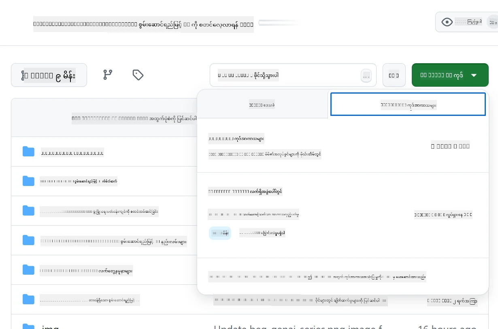

# Azure OpenAI အတွက် Development Environment ကို Set Up လုပ်ခြင်း

> **Quick Start**: ဒီလမ်းညွှန်ချက်က Azure OpenAI setup အတွက်ဖြစ်ပါတယ်။ အခမဲ့မော်ဒယ်များကို အမြန်စတင်လိုပါက [GitHub Models with Codespaces](./README.md#quick-start-cloud) ကို အသုံးပြုပါ။

ဒီလမ်းညွှန်ချက်က သင့် Java AI အက်ပ်များအတွက် Azure AI Foundry မော်ဒယ်များကို စတင်အသုံးပြုရန် အကူအညီပေးပါမည်။

## အကြောင်းအရာများ

- [Quick Setup Overview](../../../02-SetupDevEnvironment)
- [အဆင့် ၁: Azure AI Foundry Resources ဖန်တီးခြင်း](../../../02-SetupDevEnvironment)
  - [Hub နှင့် Project ဖန်တီးခြင်း](../../../02-SetupDevEnvironment)
  - [GPT-4o-mini Model ကို Deploy လုပ်ခြင်း](../../../02-SetupDevEnvironment)
- [အဆင့် ၂: Codespace ကို ဖန်တီးခြင်း](../../../02-SetupDevEnvironment)
- [အဆင့် ၃: သင့် Environment ကို Configure လုပ်ခြင်း](../../../02-SetupDevEnvironment)
- [အဆင့် ၄: သင့် Setup ကို စမ်းသပ်ခြင်း](../../../02-SetupDevEnvironment)
- [နောက်ထပ်လုပ်ဆောင်ရန်](../../../02-SetupDevEnvironment)
- [အရင်းအမြစ်များ](../../../02-SetupDevEnvironment)
- [ထပ်မံသော အရင်းအမြစ်များ](../../../02-SetupDevEnvironment)

## Quick Setup Overview

1. Azure AI Foundry resources (Hub, Project, Model) ကို ဖန်တီးပါ
2. Java development container ဖြင့် Codespace ကို ဖန်တီးပါ
3. Azure OpenAI credentials ဖြင့် သင့် .env ဖိုင်ကို Configure လုပ်ပါ
4. ဥပမာ Project ဖြင့် သင့် Setup ကို စမ်းသပ်ပါ

## အဆင့် ၁: Azure AI Foundry Resources ဖန်တီးခြင်း

### Hub နှင့် Project ဖန်တီးခြင်း

1. [Azure AI Foundry Portal](https://ai.azure.com/) သို့ သွားပြီး Sign in လုပ်ပါ
2. **+ Create** → **New hub** ကို နှိပ်ပါ (သို့မဟုတ် **Management** → **All hubs** → **+ New hub** သို့ သွားပါ)
3. သင့် Hub ကို Configure လုပ်ပါ:
   - **Hub name**: ဥပမာ၊ "MyAIHub"
   - **Subscription**: သင့် Azure subscription ကို ရွေးပါ
   - **Resource group**: အသစ်ဖန်တီးပါ သို့မဟုတ် ရှိပြီးသားကို ရွေးပါ
   - **Location**: သင်နီးစပ်ရာကို ရွေးပါ
   - **Storage account**: Default ကို အသုံးပြုပါ သို့မဟုတ် Custom ကို Configure လုပ်ပါ
   - **Key vault**: Default ကို အသုံးပြုပါ သို့မဟုတ် Custom ကို Configure လုပ်ပါ
   - **Next** → **Review + create** → **Create** ကို နှိပ်ပါ
4. ဖန်တီးပြီးပါက **+ New project** ကို နှိပ်ပါ (သို့မဟုတ် Hub overview မှ **Create project** ကို ရွေးပါ)
   - **Project name**: ဥပမာ၊ "GenAIJava"
   - **Create** ကို နှိပ်ပါ

### GPT-4o-mini Model ကို Deploy လုပ်ခြင်း

1. သင့် Project မှ **Model catalog** သို့ သွားပြီး **gpt-4o-mini** ကို ရှာပါ
   - *Alternative: **Deployments** → **+ Create deployment** သို့ သွားပါ*
2. gpt-4o-mini model card မှ **Deploy** ကို နှိပ်ပါ
3. Deployment ကို Configure လုပ်ပါ:
   - **Deployment name**: "gpt-4o-mini"
   - **Model version**: နောက်ဆုံးထွက်ကို အသုံးပြုပါ
   - **Deployment type**: Standard
4. **Deploy** ကို နှိပ်ပါ
5. Deploy ပြီးပါက **Deployments** tab သို့ သွားပြီး အောက်ပါအချက်များကို Copy လုပ်ပါ:
   - **Deployment name** (ဥပမာ၊ "gpt-4o-mini")
   - **Target URI** (ဥပမာ၊ `https://your-hub-name.openai.azure.com/`)  
      > **အရေးကြီး**: Base URL (ဥပမာ၊ `https://myhub.openai.azure.com/`) ကိုသာ Copy လုပ်ပါ၊ Endpoint path အပြည့်အစုံကို မပါစေပါနှင့်။
   - **Key** (Keys and Endpoint အပိုင်းမှ)

> **အခက်အခဲရှိပါသလား?** [Azure AI Foundry Documentation](https://learn.microsoft.com/azure/ai-foundry/how-to/create-projects?tabs=ai-foundry&pivots=hub-project) ကို သွားပါ

## အဆင့် ၂: Codespace ကို ဖန်တီးခြင်း

1. ဒီ repository ကို သင့် GitHub account သို့ Fork လုပ်ပါ
   > **Note**: Basic config ကို ပြင်ဆင်လိုပါက [Dev Container Configuration](../../../.devcontainer/devcontainer.json) ကို ကြည့်ပါ
2. သင့် Fork လုပ်ထားသော repo မှ **Code** → **Codespaces** tab ကို နှိပ်ပါ
3. **...** → **New with options...** ကို နှိပ်ပါ  

4. **Dev container configuration** ကို ရွေးပါ: 
   - **Generative AI Java Development Environment**
5. **Create codespace** ကို နှိပ်ပါ

## အဆင့် ၃: သင့် Environment ကို Configure လုပ်ခြင်း

Codespace ပြင်ဆင်ပြီးပါက သင့် Azure OpenAI credentials ကို Set Up လုပ်ပါ:

1. **Repository root မှ example project သို့ သွားပါ:**
   ```bash
   cd 02-SetupDevEnvironment/examples/basic-chat-azure
   ```

2. **သင့် .env ဖိုင်ကို ဖန်တီးပါ:**
   ```bash
   cp .env.example .env
   ```

3. **Azure OpenAI credentials ဖြင့် .env ဖိုင်ကို ပြင်ဆင်ပါ:**
   ```bash
   # Your Azure OpenAI API key (from Azure AI Foundry portal)
   AZURE_AI_KEY=your-actual-api-key-here
   
   # Your Azure OpenAI endpoint URL (e.g., https://myhub.openai.azure.com/)
   AZURE_AI_ENDPOINT=https://your-hub-name.openai.azure.com/
   ```

   > **Security Note**: 
   > - သင့် `.env` ဖိုင်ကို version control သို့ မ commit လုပ်ပါနှင့်
   > - `.env` ဖိုင်ကို `.gitignore` တွင် ထည့်ထားပြီးဖြစ်သည်
   > - သင့် API keys ကို လုံခြုံစွာထားပြီး Regular အတိုင်း ပြောင်းလဲပါ

## အဆင့် ၄: သင့် Setup ကို စမ်းသပ်ခြင်း

ဥပမာ Application ကို Run လုပ်ပြီး သင့် Azure OpenAI connection ကို စမ်းသပ်ပါ:

```bash
mvn clean spring-boot:run
```

သင် GPT-4o-mini model မှ တုံ့ပြန်မှုကို မြင်ရပါမည်!

> **VS Code Users**: VS Code တွင် `F5` ကို နှိပ်ပြီး Application ကို Run လုပ်နိုင်ပါသည်။ Launch configuration ကို `.env` ဖိုင်ကို အလိုအလျောက် Load လုပ်ရန် Set Up လုပ်ထားပြီးဖြစ်သည်။

> **Full example**: [End-to-End Azure OpenAI Example](./examples/basic-chat-azure/README.md) ကို ကြည့်ပြီး အသေးစိတ်လမ်းညွှန်ချက်များနှင့် အခက်အခဲများကို ဖြေရှင်းပါ။

## နောက်ထပ်လုပ်ဆောင်ရန်

**Setup ပြီးပါပြီ!** သင့်တွင်:
- gpt-4o-mini ကို Azure OpenAI တွင် Deploy လုပ်ထားပြီး
- `.env` ဖိုင် configuration ပြင်ဆင်ပြီး
- Java development environment ပြင်ဆင်ပြီး

**ဆက်လက်လုပ်ဆောင်ရန်** [Chapter 3: Core Generative AI Techniques](../03-CoreGenerativeAITechniques/README.md) သို့ သွားပြီး AI applications တည်ဆောက်ရန် စတင်ပါ!

## အရင်းအမြစ်များ

- [Azure AI Foundry Documentation](https://learn.microsoft.com/azure/ai-services/)
- [Spring AI Azure OpenAI Documentation](https://docs.spring.io/spring-ai/reference/api/clients/azure-openai-chat.html)
- [Azure OpenAI Java SDK](https://learn.microsoft.com/java/api/overview/azure/ai-openai-readme)

## ထပ်မံသော အရင်းအမြစ်များ

- [VS Code ကို Download လုပ်ပါ](https://code.visualstudio.com/Download)
- [Docker Desktop ကို ရယူပါ](https://www.docker.com/products/docker-desktop)
- [Dev Container Configuration](../../../.devcontainer/devcontainer.json)

**အကြောင်းကြားချက်**:  
ဤစာရွက်စာတမ်းကို AI ဘာသာပြန်ဝန်ဆောင်မှု [Co-op Translator](https://github.com/Azure/co-op-translator) ကို အသုံးပြု၍ ဘာသာပြန်ထားပါသည်။ ကျွန်ုပ်တို့သည် တိကျမှုအတွက် ကြိုးစားနေသော်လည်း၊ အလိုအလျောက် ဘာသာပြန်မှုများတွင် အမှားများ သို့မဟုတ် မတိကျမှုများ ပါဝင်နိုင်သည်ကို သတိပြုပါ။ မူရင်းစာရွက်စာတမ်းကို ၎င်း၏ မူရင်းဘာသာစကားဖြင့် အာဏာတရ အရင်းအမြစ်အဖြစ် ရှုလေ့လာသင့်ပါသည်။ အရေးကြီးသော အချက်အလက်များအတွက် လူ့ဘာသာပြန်ပညာရှင်များမှ ပရော်ဖက်ရှင်နယ် ဘာသာပြန်မှုကို အကြံပြုပါသည်။ ဤဘာသာပြန်မှုကို အသုံးပြုခြင်းမှ ဖြစ်ပေါ်လာသော အလွဲအမှားများ သို့မဟုတ် အနားလွဲမှုများအတွက် ကျွန်ုပ်တို့သည် တာဝန်မယူပါ။