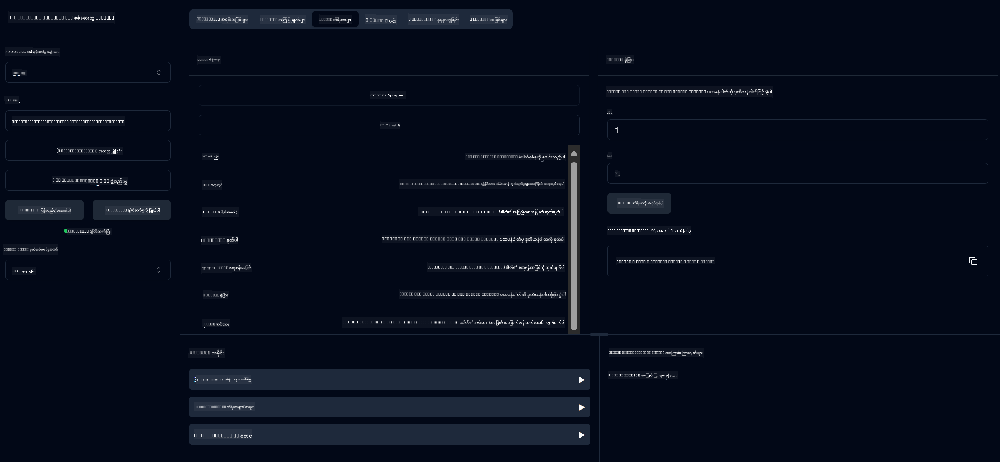

<!--
CO_OP_TRANSLATOR_METADATA:
{
  "original_hash": "5bd7a347d6ed1d706443f9129dd29dd9",
  "translation_date": "2025-07-25T10:17:30+00:00",
  "source_file": "04-PracticalSamples/mcp/calculator/README.md",
  "language_code": "my"
}
-->
# အခြေခံ ကိန်းဂဏန်းတွက်ချက်မှု MCP ဝန်ဆောင်မှု

>**Note**: ဒီအခန်းမှာ [**Tutorial**](./TUTORIAL.md) ပါဝင်ပြီး နမူနာများကို လမ်းညွှန်ပေးထားပါတယ်။

**Model Context Protocol (MCP)** ကို လက်တွေ့အသုံးပြုဖို့ ပထမဆုံးအကြိမ် ကြိုဆိုပါတယ်! အရင်အခန်းတွေမှာ သင်ဟာ Generative AI အခြေခံအကြောင်းကို သင်ယူပြီး Development Environment ကို ပြင်ဆင်ပြီးသားဖြစ်ပါတယ်။ အခုတော့ လက်တွေ့အသုံးဝင်တဲ့ အရာတစ်ခုကို တည်ဆောက်ဖို့ အချိန်ရောက်ပါပြီ။

ဒီကိန်းဂဏန်းတွက်ချက်မှုဝန်ဆောင်မှုက AI မော်ဒယ်တွေ MCP ကို အသုံးပြုပြီး အပြင် Tools တွေနဲ့ လုံခြုံစွာ ဆက်သွယ်နိုင်တဲ့ နည်းလမ်းကို ပြသပေးပါတယ်။ AI မော်ဒယ်ရဲ့ တစ်ခါတစ်လေ မမှန်ကန်တဲ့ သင်္ချာစွမ်းရည်ကို မူတည်မနေဘဲ၊ AI က အတိအကျတွက်ချက်မှုများအတွက် အထူးဝန်ဆောင်မှုများကို ခေါ်ယူနိုင်တဲ့ စနစ်တစ်ခုကို တည်ဆောက်ပေးမယ့် နည်းလမ်းကို ပြသပေးမှာဖြစ်ပါတယ်။

## အကြောင်းအရာများ

- [သင်လေ့လာမယ့်အရာများ](../../../../../04-PracticalSamples/mcp/calculator)
- [လိုအပ်ချက်များ](../../../../../04-PracticalSamples/mcp/calculator)
- [အဓိကအကြောင်းအရာများ](../../../../../04-PracticalSamples/mcp/calculator)
- [အမြန်စတင်ခြင်း](../../../../../04-PracticalSamples/mcp/calculator)
- [ရရှိနိုင်တဲ့ ကိန်းဂဏန်းတွက်ချက်မှုများ](../../../../../04-PracticalSamples/mcp/calculator)
- [Test Clients](../../../../../04-PracticalSamples/mcp/calculator)
  - [1. Direct MCP Client (SDKClient)](../../../../../04-PracticalSamples/mcp/calculator)
  - [2. AI-Powered Client (LangChain4jClient)](../../../../../04-PracticalSamples/mcp/calculator)
- [MCP Inspector (Web UI)](../../../../../04-PracticalSamples/mcp/calculator)
  - [လမ်းညွှန်အဆင့်ဆင့်](../../../../../04-PracticalSamples/mcp/calculator)

## သင်လေ့လာမယ့်အရာများ

ဒီနမူနာကို လုပ်ဆောင်ပြီးရင် သင်ဟာ အောက်ပါအရာများကို နားလည်နိုင်ပါမယ်။
- Spring Boot ကို အသုံးပြုပြီး MCP-Compatible ဝန်ဆောင်မှုများကို ဘယ်လိုဖန်တီးမလဲ
- Direct Protocol ဆက်သွယ်မှုနဲ့ AI-Powered ဆက်သွယ်မှုကြားက ကွာခြားချက်
- AI မော်ဒယ်တွေ ဘယ်အချိန်မှာ ဘယ်လို Tools တွေကို အသုံးပြုမလဲဆိုတာ ဆုံးဖြတ်ပုံ
- Tool-Enabled AI Applications တည်ဆောက်ရာမှာ အကောင်းဆုံးနည်းလမ်းများ

MCP အကြောင်းကို စတင်လေ့လာနေတဲ့ Beginner တွေ အတွက် အထူးသင့်လျော်ပြီး AI Tool Integration ကို စတင်တည်ဆောက်ဖို့ အသင့်ဖြစ်နေပါပြီ!

## လိုအပ်ချက်များ

- Java 21+
- Maven 3.6+
- **GitHub Token**: AI-Powered Client အတွက် လိုအပ်ပါတယ်။ သင့်မှာ ဒီကို မပြင်ဆင်ရသေးပါက [Chapter 2: Setting up your development environment](../../../02-SetupDevEnvironment/README.md) ကို ကြည့်ပါ။

## အဓိကအကြောင်းအရာများ

**Model Context Protocol (MCP)** က AI Applications တွေကို အပြင် Tools တွေနဲ့ လုံခြုံစွာ ဆက်သွယ်နိုင်စေတဲ့ စံပြနည်းလမ်းတစ်ခုဖြစ်ပါတယ်။ AI မော်ဒယ်တွေက ကိုယ်တိုင် သင်္ချာတွက်ချက်ဖို့ (တစ်ခါတစ်လေ မမှန်ကန်နိုင်တဲ့) ကြိုးစားမယ့်အစား၊ ကျွန်တော်တို့ရဲ့ Calculator Service ကို ခေါ်ယူပြီး အတိအကျရလဒ်တွေကို ရယူနိုင်ပါတယ်။ MCP က ဒီဆက်သွယ်မှုကို လုံခြုံစွာနဲ့ တိကျစွာ ဖြစ်စေပါတယ်။

**Server-Sent Events (SSE)** က Server နဲ့ Clients ကြား Real-Time ဆက်သွယ်မှုကို အကောင်းဆုံးဖြစ်စေပါတယ်။ Traditional HTTP Requests တွေမှာ တစ်ခါတစ်လေ အဖြေကို စောင့်ရတာရှိသလို၊ SSE က Server ကနေ Client ကို အဆက်မပြတ် Update တွေ ပေးနိုင်ပါတယ်။ AI Applications တွေမှာ Response တွေကို Streaming လုပ်တာမျိုး၊ Processing အချိန်ယူတာမျိုးအတွက် အထူးသင့်လျော်ပါတယ်။

**AI Tools & Function Calling** က AI မော်ဒယ်တွေကို အပြင် Functions (ဥပမာ - Calculator Operations) တွေကို အလိုအလျောက် ရွေးချယ်ပြီး အသုံးပြုနိုင်စေပါတယ်။ "15 + 27 ဘယ်လောက်လဲ?" လို့ မေးတဲ့အခါ AI မော်ဒယ်က Addition လုပ်ဖို့လိုတယ်ဆိုတာ နားလည်ပြီး `add` Tool ကို Parameters (15, 27) နဲ့ ခေါ်ယူပြီး Natural Language နဲ့ အဖြေကို ပြန်ပေးပါတယ်။ AI က Tools တွေကို ဘယ်အချိန်မှာ ဘယ်လို အသုံးပြုမလဲဆိုတာ Intelligent Coordinator အနေနဲ့ လုပ်ဆောင်ပါတယ်။

## အမြန်စတင်ခြင်း

### 1. Calculator Application Directory ကို သွားပါ
```bash
cd Generative-AI-for-beginners-java/04-PracticalSamples/mcp/calculator
```

### 2. Build & Run
```bash
mvn clean install -DskipTests
java -jar target/calculator-server-0.0.1-SNAPSHOT.jar
```

### 2. Clients တွေနဲ့ စမ်းသပ်ပါ
- **SDKClient**: Direct MCP Protocol ဆက်သွယ်မှု
- **LangChain4jClient**: AI-Powered Natural Language ဆက်သွယ်မှု (GitHub Token လိုအပ်ပါတယ်)

## ရရှိနိုင်တဲ့ ကိန်းဂဏန်းတွက်ချက်မှုများ

- `add(a, b)`, `subtract(a, b)`, `multiply(a, b)`, `divide(a, b)`
- `power(base, exponent)`, `squareRoot(number)`, `absolute(number)`
- `modulus(a, b)`, `help()`

## Test Clients

### 1. Direct MCP Client (SDKClient)
Raw MCP Protocol ဆက်သွယ်မှုကို စမ်းသပ်ပါ။ Run:
```bash
mvn test-compile exec:java -Dexec.mainClass="com.microsoft.mcp.sample.client.SDKClient" -Dexec.classpathScope=test
```

### 2. AI-Powered Client (LangChain4jClient)
GitHub Models နဲ့ Natural Language Interaction ကို ပြသပါတယ်။ GitHub Token လိုအပ်ပါတယ် ([Prerequisites](../../../../../04-PracticalSamples/mcp/calculator) ကို ကြည့်ပါ)။

**Run:**
```bash
mvn test-compile exec:java -Dexec.mainClass="com.microsoft.mcp.sample.client.LangChain4jClient" -Dexec.classpathScope=test
```

## MCP Inspector (Web UI)

MCP Inspector က Code မရေးဘဲ MCP Service ကို စမ်းသပ်နိုင်တဲ့ Visual Web Interface ကို ပေးပါတယ်။ MCP ဘယ်လိုအလုပ်လုပ်တယ်ဆိုတာ နားလည်ဖို့ Beginner တွေအတွက် အထူးသင့်လျော်ပါတယ်။

### လမ်းညွှန်အဆင့်ဆင့်:

1. **Calculator Server ကို စတင်ပါ** (မရပ်ထားရင်):
   ```bash
   java -jar target/calculator-server-0.0.1-SNAPSHOT.jar
   ```

2. **MCP Inspector ကို Install နဲ့ Run လုပ်ပါ** Terminal အသစ်မှာ:
   ```bash
   npx @modelcontextprotocol/inspector
   ```

3. **Web Interface ကို ဖွင့်ပါ**:
   - "Inspector running at http://localhost:6274" ဆိုတဲ့ Message ကို ရှာပါ
   - အဲဒီ URL ကို Web Browser မှာ ဖွင့်ပါ

4. **Calculator Service ကို Connect လုပ်ပါ**:
   - Web Interface မှာ Transport Type ကို "SSE" အဖြစ် သတ်မှတ်ပါ
   - URL ကို `http://localhost:8080/sse` အဖြစ် သတ်မှတ်ပါ
   - "Connect" Button ကို Click လုပ်ပါ

5. **ရရှိနိုင်တဲ့ Tools တွေကို Explore လုပ်ပါ**:
   - "List Tools" ကို Click လုပ်ပြီး Calculator Operations တွေကို ကြည့်ပါ
   - `add`, `subtract`, `multiply` စတဲ့ Functions တွေကို တွေ့ပါမယ်

6. **Calculator Operation တစ်ခုကို စမ်းသပ်ပါ**:
   - Tool တစ်ခု (ဥပမာ - "add") ကို ရွေးပါ
   - Parameters (ဥပမာ - `a: 15`, `b: 27`) ကို ထည့်ပါ
   - "Run Tool" ကို Click လုပ်ပါ
   - MCP Service က ပြန်ပေးတဲ့ Result ကို ကြည့်ပါ!

ဒီ Visual နည်းလမ်းက MCP Communication ဘယ်လိုအလုပ်လုပ်တယ်ဆိုတာ ကိုယ်တိုင် Clients တွေ တည်ဆောက်မယ့်အခါ မတိုင်မီ နားလည်စေပါတယ်။



---
**Reference:** [MCP Server Boot Starter Docs](https://docs.spring.io/spring-ai/reference/api/mcp/mcp-server-boot-starter-docs.html)

**အကြောင်းကြားချက်**:  
ဤစာရွက်စာတမ်းကို AI ဘာသာပြန်ဝန်ဆောင်မှု [Co-op Translator](https://github.com/Azure/co-op-translator) ကို အသုံးပြု၍ ဘာသာပြန်ထားပါသည်။ ကျွန်ုပ်တို့သည် တိကျမှုအတွက် ကြိုးစားနေပါသော်လည်း၊ အလိုအလျောက် ဘာသာပြန်ခြင်းတွင် အမှားများ သို့မဟုတ် မတိကျမှုများ ပါရှိနိုင်သည်ကို သတိပြုပါ။ မူရင်းဘာသာစကားဖြင့် ရေးသားထားသော စာရွက်စာတမ်းကို အာဏာတရားရှိသော ရင်းမြစ်အဖြစ် သတ်မှတ်သင့်ပါသည်။ အရေးကြီးသော အချက်အလက်များအတွက် လူက ဘာသာပြန်ခြင်းကို အသုံးပြုရန် အကြံပြုပါသည်။ ဤဘာသာပြန်ကို အသုံးပြုခြင်းမှ ဖြစ်ပေါ်လာသော အလွဲအလွတ်များ သို့မဟုတ် အနားယူမှားမှုများအတွက် ကျွန်ုပ်တို့သည် တာဝန်မယူပါ။