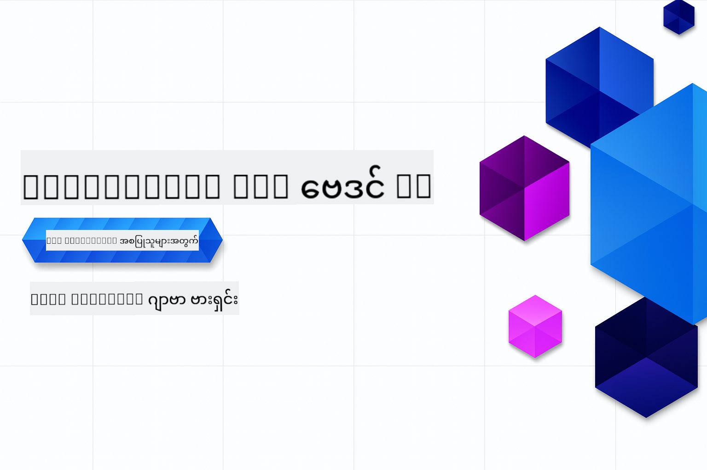

<!--
CO_OP_TRANSLATOR_METADATA:
{
  "original_hash": "0f080f1f2a635610b5f6eff5a58a9590",
  "translation_date": "2025-07-25T07:58:14+00:00",
  "source_file": "README.md",
  "language_code": "my"
}
-->
# Java Edition အတွက် Generative AI - စတင်လေ့လာသူများအတွက်

> **NOTE: အမြန်စတင်ရန်**: အတန်းလုံးကို အွန်လိုင်းပေါ်တွင် ပြီးမြောက်နိုင်သည် - ဒေသတွင်းတွင် အဆင့်သတ်မှတ်မှုမလိုအပ်ပါ!
1. ဒီ repository ကို သင့် GitHub အကောင့်သို့ Fork လုပ်ပါ
2. **Code** → **Codespaces** tab → **...** → **New with options...** ကိုနှိပ်ပါ
3. Default ကို အသုံးပြုပါ – ဒီအတန်းအတွက် ဖန်တီးထားသော Development container ကို ရွေးချယ်ပါ
4. **Create codespace** ကိုနှိပ်ပါ
5. ~2 မိနစ်အကြာတွင် ပတ်ဝန်းကျင်အသင့်ဖြစ်ပါမည်
6. [GitHub Models Token ဖန်တီးခြင်း](./02-SetupDevEnvironment/README.md#step-2-create-a-github-personal-access-token) သို့ တိုက်ရိုက်သွားပါ

## ဘာသာစကားများပံ့ပိုးမှု

### GitHub Action မှတဆင့်ပံ့ပိုးထားသည် (အလိုအလျောက် & အမြဲနောက်ဆုံးပေါ်)

[French](../fr/README.md) | [Spanish](../es/README.md) | [German](../de/README.md) | [Russian](../ru/README.md) | [Arabic](../ar/README.md) | [Persian (Farsi)](../fa/README.md) | [Urdu](../ur/README.md) | [Chinese (Simplified)](../zh/README.md) | [Chinese (Traditional, Macau)](../mo/README.md) | [Chinese (Traditional, Hong Kong)](../hk/README.md) | [Chinese (Traditional, Taiwan)](../tw/README.md) | [Japanese](../ja/README.md) | [Korean](../ko/README.md) | [Hindi](../hi/README.md) | [Bengali](../bn/README.md) | [Marathi](../mr/README.md) | [Nepali](../ne/README.md) | [Punjabi (Gurmukhi)](../pa/README.md) | [Portuguese (Portugal)](../pt/README.md) | [Portuguese (Brazil)](../br/README.md) | [Italian](../it/README.md) | [Polish](../pl/README.md) | [Turkish](../tr/README.md) | [Greek](../el/README.md) | [Thai](../th/README.md) | [Swedish](../sv/README.md) | [Danish](../da/README.md) | [Norwegian](../no/README.md) | [Finnish](../fi/README.md) | [Dutch](../nl/README.md) | [Hebrew](../he/README.md) | [Vietnamese](../vi/README.md) | [Indonesian](../id/README.md) | [Malay](../ms/README.md) | [Tagalog (Filipino)](../tl/README.md) | [Swahili](../sw/README.md) | [Hungarian](../hu/README.md) | [Czech](../cs/README.md) | [Slovak](../sk/README.md) | [Romanian](../ro/README.md) | [Bulgarian](../bg/README.md) | [Serbian (Cyrillic)](../sr/README.md) | [Croatian](../hr/README.md) | [Slovenian](../sl/README.md) | [Ukrainian](../uk/README.md) | [Burmese (Myanmar)](./README.md)

## အတန်းဖွဲ့စည်းမှုနှင့် လေ့လာရေးလမ်းကြောင်း

**အချိန်ပေးဆောင်မှု**: ပတ်ဝန်းကျင်ကို 2 မိနစ်အတွင်း စတင်နိုင်ပြီး၊ နမူနာများကို 1-3 နာရီအတွင်း ပြီးမြောက်နိုင်သည် (လေ့လာမှုအနက်အနံကို မူတည်၍)။ အတန်းလုံးကို ဒေသတွင်းအဆင့်သတ်မှတ်မှုမလိုအပ်ဘဲ အွန်လိုင်းပေါ်တွင် ပြီးမြောက်နိုင်သည်။

### **အခန်း 1: Generative AI ကိုမိတ်ဆက်ခြင်း**
- **အဓိကအကြောင်းအရာများ**: Large Language Models, tokens, embeddings, နှင့် AI စွမ်းရည်များကို နားလည်ခြင်း
- **Java AI Ecosystem**: Spring AI နှင့် OpenAI SDKs အကြောင်းအကျဉ်းချုပ်
- **Model Context Protocol**: MCP နှင့် AI agent ဆက်သွယ်မှုတွင် အရေးပါမှု
- **အကျိုးရှိသောလက်တွေ့အသုံးချမှုများ**: Chatbots နှင့် အကြောင်းအရာဖန်တီးခြင်းအပါအဝင်
- **[→ အခန်း 1 စတင်ရန်](./01-IntroToGenAI/README.md)**

### **အခန်း 2: ဖွံ့ဖြိုးရေးပတ်ဝန်းကျင်ကို စတင်တည်ဆောက်ခြင်း**
- **Multi-Provider Configuration**: GitHub Models, Azure OpenAI, နှင့် OpenAI Java SDK integrations ကို စတင်တည်ဆောက်ခြင်း
- **Spring Boot + Spring AI**: စီးပွားရေး AI အပလီကေးရှင်းဖွံ့ဖြိုးရေးအတွက် အကောင်းဆုံးအလေ့အထ
- **GitHub Models**: အခမဲ့ AI model access (credit card မလိုအပ်ပါ)
- **ဖွံ့ဖြိုးရေး Tools**: Docker containers, VS Code, နှင့် GitHub Codespaces configuration
- **[→ အခန်း 2 စတင်ရန်](./02-SetupDevEnvironment/README.md)**

### **အခန်း 3: Generative AI နည်းလမ်းများ၏ အဓိကအချက်များ**
- **Prompt Engineering**: AI model response များအတွက် အကောင်းဆုံးနည်းလမ်းများ
- **Embeddings & Vector Operations**: Semantic search နှင့် similarity matching ကို အကောင်အထည်ဖော်ခြင်း
- **Retrieval-Augmented Generation (RAG)**: AI ကို ကိုယ်ပိုင်ဒေတာအရင်းအမြစ်များနှင့် ပေါင်းစပ်ခြင်း
- **Function Calling**: Custom tools နှင့် plugins များဖြင့် AI စွမ်းရည်များကို တိုးချဲ့ခြင်း
- **[→ အခန်း 3 စတင်ရန်](./03-CoreGenerativeAITechniques/README.md)**

### **အခန်း 4: လက်တွေ့အသုံးချမှုများနှင့် Project များ**
- **Pet Story Generator** (`petstory/`): GitHub Models ဖြင့် ဖန်တီးမှုအကြောင်းအရာဖန်တီးခြင်း
- **Foundry Local Demo** (`foundrylocal/`): OpenAI Java SDK ဖြင့် ဒေသတွင်း AI model ပေါင်းစပ်ခြင်း
- **MCP Calculator Service** (`mcp/calculator/`): Spring AI ဖြင့် Model Context Protocol အခြေခံအကောင်အထည်ဖော်မှု
- **[→ အခန်း 4 စတင်ရန်](./04-PracticalSamples/README.md)**

### **အခန်း 5: တာဝန်ရှိသော AI ဖွံ့ဖြိုးရေး**
- **GitHub Models Safety**: Built-in content filtering နှင့် safety mechanisms ကို စမ်းသပ်ခြင်း
- **Responsible AI Demo**: AI safety filters လက်တွေ့အသုံးချမှုကို ပြသခြင်း
- **အကောင်းဆုံးအလေ့အထ**: Ethical AI ဖွံ့ဖြိုးရေးနှင့် deployment အတွက် အရေးပါသောလမ်းညွှန်ချက်များ
- **[→ အခန်း 5 စတင်ရန်](./05-ResponsibleGenAI/README.md)**

## အပိုဆောင်းအရင်းအမြစ်များ 

- [AI Agents For Beginners](https://github.com/microsoft/ai-agents-for-beginners)
- [Generative AI for Beginners using .NET](https://github.com/microsoft/Generative-AI-for-beginners-dotnet)
- [Generative AI for Beginners using JavaScript](https://github.com/microsoft/generative-ai-with-javascript)
- [Generative AI for Beginners](https://github.com/microsoft/generative-ai-for-beginners)
- [ML for Beginners](https://aka.ms/ml-beginners)
- [Data Science for Beginners](https://aka.ms/datascience-beginners)
- [AI for Beginners](https://aka.ms/ai-beginners)
- [Cybersecurity for Beginners](https://github.com/microsoft/Security-101)
- [Web Dev for Beginners](https://aka.ms/webdev-beginners)
- [IoT for Beginners](https://aka.ms/iot-beginners)
- [XR Development for Beginners](https://github.com/microsoft/xr-development-for-beginners)
- [Mastering GitHub Copilot for AI Paired Programming](https://aka.ms/GitHubCopilotAI)
- [Mastering GitHub Copilot for C#/.NET Developers](https://github.com/microsoft/mastering-github-copilot-for-dotnet-csharp-developers)
- [Choose Your Own Copilot Adventure](https://github.com/microsoft/CopilotAdventures)
- [RAG Chat App with Azure AI Services](https://github.com/Azure-Samples/azure-search-openai-demo-java)

**အကြောင်းကြားချက်**:  
ဤစာရွက်စာတမ်းကို AI ဘာသာပြန်ဝန်ဆောင်မှု [Co-op Translator](https://github.com/Azure/co-op-translator) ကို အသုံးပြု၍ ဘာသာပြန်ထားပါသည်။ ကျွန်ုပ်တို့သည် တိကျမှန်ကန်မှုအတွက် ကြိုးစားနေသော်လည်း၊ အလိုအလျောက် ဘာသာပြန်မှုများတွင် အမှားများ သို့မဟုတ် မမှန်ကန်မှုများ ပါဝင်နိုင်သည်ကို သတိပြုပါ။ မူရင်းဘာသာစကားဖြင့် ရေးသားထားသော စာရွက်စာတမ်းကို အာဏာတရားရှိသော ရင်းမြစ်အဖြစ် သတ်မှတ်သင့်ပါသည်။ အရေးကြီးသော အချက်အလက်များအတွက် လူ့ဘာသာပြန်ပညာရှင်များမှ ပရော်ဖက်ရှင်နယ် ဘာသာပြန်မှုကို အကြံပြုပါသည်။ ဤဘာသာပြန်မှုကို အသုံးပြုခြင်းမှ ဖြစ်ပေါ်လာသော အလွဲအလွတ်များ သို့မဟုတ် အနားလွဲမှုများအတွက် ကျွန်ုပ်တို့သည် တာဝန်မယူပါ။