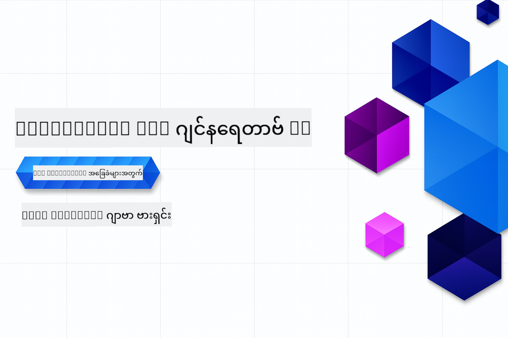

<!--
CO_OP_TRANSLATOR_METADATA:
{
  "original_hash": "64843fea021344d8e889dae94f46a9be",
  "translation_date": "2025-12-25T06:57:41+00:00",
  "source_file": "README.md",
  "language_code": "my"
}
-->
# Generative AI အခြေခံများ - Java ဗားရှင်း
[](https://discord.gg/nTYy5BXMWG)



**အချိန် တာဝန်ပေးမှု**: အစီအစဉ်အပြည့်အားလုံးကို local setup မလိုဘဲ အွန်လိုင်းပတ်ဝန်းကျင်တွင် ပြီးမြောက်နိုင်ပါသည်။ ပတ်ဝန်းကျင်ကို စတင်တပ်ဆင်ရန် ၂ မိနစ် ဆောင်ရွက်ရပြီး နမူနာများကို လေ့လာလိုလျှင် စူးစမ်းမှုအနက်အတိုင်း ၁-၃ နာရီ ဆောင်ရွက်ရန် လိုအပ်နိုင်သည်။

> **အမြန် စတင်ခြင်း** 
> 
> 1. ဤ repository ကို သင့် GitHub အကောင့်သို့ Fork ပြုလုပ်ပါ
> 2. Click **Code** → **Codespaces** tab → **...** → **New with options...**
> 3. ပုံသေနည်းများကို သုံးပါ – ၎င်းအား သင်ကြားရေးသင်တန်းအတွက် ဖန်တီးထားသော Development container ကို ရွေးမည်
> 4. Click **Create codespace**
> 5. ပတ်ဝန်းကျင် ပြင်ဆင်ပြီး အသင့်ဖြစ်ရန် လက်ရှိ ~2 မိနစ် စောင့်ဆိုင်းပါ
> 6. တိုက်ရိုက် [ပထမဥပမာ](./02-SetupDevEnvironment/README.md#step-2-create-a-github-personal-access-token) သို့ သွားပါ

> **တရားဝင် အရင်ကလန်းဖြင့် Clone လုပ်ချင်ပါသလား?**
> 
> ဤ repository တွင် ၅၀ ကျော် ဘာသာစကား ဘာသာပြန်များ ပါဝင်ကာ ဒေါင်းလုပ်စွမ်းအားကို အလွန်တိုးမြှင့်စေသည်။ ဘာသာပြန်များ မပါဘဲ clone လုပ်ရန် sparse checkout ကို အသုံးပြုပါ:
> > ```bash
> git clone --filter=blob:none --sparse https://github.com/microsoft/Generative-AI-for-beginners-java.git
> cd Generative-AI-for-beginners-java
> git sparse-checkout set --no-cone '/*' '!translations' '!translated_images'
> ```
> ၎င်းသည် သင့်အား သင်တန်းကို ပြီးမြောက်နိုင်ရန် လိုအပ်သည့် အရာများအားလုံးကို ပိုမိုမြန်ဆန်စွာ ဒေါင်းလုတ်လုပ်ပေးမည်။

## ဘာသာစကားများအထောက်အပံ့

### GitHub Action ဖြင့် ထောက်ပံ့သည် (အလိုအလျောက် & အမြဲတမ်း ခေတ်မီ)

<!-- CO-OP TRANSLATOR LANGUAGES TABLE START -->
[Arabic](../ar/README.md) | [Bengali](../bn/README.md) | [Bulgarian](../bg/README.md) | [Burmese (Myanmar)](./README.md) | [Chinese (Simplified)](../zh/README.md) | [Chinese (Traditional, Hong Kong)](../hk/README.md) | [Chinese (Traditional, Macau)](../mo/README.md) | [Chinese (Traditional, Taiwan)](../tw/README.md) | [Croatian](../hr/README.md) | [Czech](../cs/README.md) | [Danish](../da/README.md) | [Dutch](../nl/README.md) | [Estonian](../et/README.md) | [Finnish](../fi/README.md) | [French](../fr/README.md) | [German](../de/README.md) | [Greek](../el/README.md) | [Hebrew](../he/README.md) | [Hindi](../hi/README.md) | [Hungarian](../hu/README.md) | [Indonesian](../id/README.md) | [Italian](../it/README.md) | [Japanese](../ja/README.md) | [Kannada](../kn/README.md) | [Korean](../ko/README.md) | [Lithuanian](../lt/README.md) | [Malay](../ms/README.md) | [Malayalam](../ml/README.md) | [Marathi](../mr/README.md) | [Nepali](../ne/README.md) | [Nigerian Pidgin](../pcm/README.md) | [Norwegian](../no/README.md) | [Persian (Farsi)](../fa/README.md) | [Polish](../pl/README.md) | [Portuguese (Brazil)](../br/README.md) | [Portuguese (Portugal)](../pt/README.md) | [Punjabi (Gurmukhi)](../pa/README.md) | [Romanian](../ro/README.md) | [Russian](../ru/README.md) | [Serbian (Cyrillic)](../sr/README.md) | [Slovak](../sk/README.md) | [Slovenian](../sl/README.md) | [Spanish](../es/README.md) | [Swahili](../sw/README.md) | [Swedish](../sv/README.md) | [Tagalog (Filipino)](../tl/README.md) | [Tamil](../ta/README.md) | [Telugu](../te/README.md) | [Thai](../th/README.md) | [Turkish](../tr/README.md) | [Ukrainian](../uk/README.md) | [Urdu](../ur/README.md) | [Vietnamese](../vi/README.md)
<!-- CO-OP TRANSLATOR LANGUAGES TABLE END -->

## ကိုर्स ဖွဲ့စည်းပုံ နှင့် သင်ယူမှု လမ်းကြောင်း

### **အခန်း ၁: Generative AI အား မိတ်ဆက်ခြင်း**
- **အဓိက အယူအဆများ**: Large Language Models များ၊ token များ၊ embeddings နှင့် AI ၏ စွမ်းရည်များကို နားလည်ခြင်း
- **Java AI ပတ်ဝန်းကျင်**: Spring AI နှင့် OpenAI SDK များအကြောင်းအကျဉ်းချုံး
- **Model Context Protocol**: MCP ကို မိတ်ဆက်ခြင်းနှင့် AI agent များ၏ ဆက်သွယ်မှုတွင် ၎င်း၏ အခန်းကဏ္ဍ
- **လက်တွေ့ အသုံးချနိုင်မှုများ**: စကားပြော bot များနှင့် အကြောင်းအရာ ဖန်တီးခြင်း အပါအဝင် အမှန်တကယ့် အသုံးအမြင်များ
- **[→ အခန်း ၁ ကို စတင်ပါ](./01-IntroToGenAI/README.md)**

### **အခန်း ၂: ဖွံ့ဖြိုးရေး ပတ်ဝန်းကျင် တပ်ဆင်ခြင်း**
- **Multi-Provider ဖွဲ့စည်းမှု**: GitHub Models, Azure OpenAI, နှင့် OpenAI Java SDK ပေါင်းစည်းမှုများ တပ်ဆင်ခြင်း
- **Spring Boot + Spring AI**: အဖွဲ့အစည်းအတွက် AI application ဖွံ့ဖြိုးရေးအတွက် အကောင်းဆုံး လေ့လာမှုများ
- **GitHub Models**: ပရိုတိုတိုက်နှင့် သင်ယူမှုအတွက် အခမဲ့ AI မော်ဒယ်များ (credit card မလို)
- **ဖွံ့ဖြိုးရေး ကိရိယာများ**: Docker containers, VS Code, နှင့် GitHub Codespaces ဖွဲ့စည်းမှု
- **[→ အခန်း ၂ ကို စတင်ပါ](./02-SetupDevEnvironment/README.md)**

### **အခန်း ၃: Core Generative AI နည်းလမ်းများ**
- **Prompt Engineering**: AI မော်ဒယ်မှ အကောင်းဆုံး တုံ့ပြန်ချက်ရရန် နည်းလမ်းများ
- **Embeddings & Vector လုပ်ဆောင်မှုများ**: semantic search နှင့် similarity matching ကို တာဝန်ယူ အကောင်အထည်ဖော်ခြင်း
- **Retrieval-Augmented Generation (RAG)**: သင်၏ကိုယ်ပိုင်ဒေတာ ရင်းမြစ်များနှင့် AI ကို ပေါင်းစပ်ခြင်း
- **Function Calling**: AI ၏ စွမ်းဆောင်ရည်ကို custom tools နှင့် plugins များဖြင့် တိုးချဲ့ခြင်း
- **[→ အခန်း ၃ ကို စတင်ပါ](./03-CoreGenerativeAITechniques/README.md)**

### **အခန်း ၄: လက်တွေ့ အသုံးချမှုများ & ပရောဂျက်များ**
- **Pet Story Generator** (`petstory/`): GitHub Models ဖြင့် ဖန်တီးမှု အကြောင်းအရာများ
- **Foundry Local Demo** (`foundrylocal/`): OpenAI Java SDK ဖြင့် ဒေသခံ AI မော်ဒယ် အထိမ်းအမှတ် ပေါင်းစည်းမှု
- **MCP Calculator Service** (`calculator/`): Spring AI ဖြင့် အခြေခံ Model Context Protocol အကောင်အထည်ဖော်ခြင်း
- **[→ အခန်း ၄ ကို စတင်ပါ](./04-PracticalSamples/README.md)**

### **အခန်း ၅: တာဝန်ရှိသည့် AI ဖွံ့ဖြိုးရေး**
- **GitHub Models လုံခြုံရေး**: in-built content filtering နှင့် safety mechanisms (hard blocks နှင့် soft refusals) များကို စမ်းသပ်ရန်
- **တာဝန်ရှိသည့် AI ဒေမို**: ခေတ်မီ AI လုံခြုံရေး စနစ်များ ဘယ်လို လက်တွေ့ အလုပ်လုပ်သည်ကို ပြသသော လက်တွေ့ ဥပဒေ
- **အကောင်းဆုံး လက်ခံနည်းများ**: တာဝန်ရှိသော AI ဖွံ့ဖြိုးရေးနှင့် ထုတ်လုပ်မှုအတွက် အလွန်အဓိက ညွှန်ကြားချက်များ
- **[→ အခန်း ၅ ကို စတင်ပါ](./05-ResponsibleGenAI/README.md)**

## အပိုဆောင်း အရင်းအမြစ်များ

<!-- CO-OP TRANSLATOR OTHER COURSES START -->
### LangChain
[](https://aka.ms/langchain4j-for-beginners)
[](https://aka.ms/langchainjs-for-beginners?WT.mc_id=m365-94501-dwahlin)

---

### Azure / Edge / MCP / Agents
[](https://github.com/microsoft/AZD-for-beginners?WT.mc_id=academic-105485-koreyst)
[](https://github.com/microsoft/edgeai-for-beginners?WT.mc_id=academic-105485-koreyst)
[](https://github.com/microsoft/mcp-for-beginners?WT.mc_id=academic-105485-koreyst)
[](https://github.com/microsoft/ai-agents-for-beginners?WT.mc_id=academic-105485-koreyst)

---
 
### Generative AI Series
[](https://github.com/microsoft/generative-ai-for-beginners?WT.mc_id=academic-105485-koreyst)
[-9333EA?style=for-the-badge&labelColor=E5E7EB&color=9333EA)](https://github.com/microsoft/Generative-AI-for-beginners-dotnet?WT.mc_id=academic-105485-koreyst)
[-C084FC?style=for-the-badge&labelColor=E5E7EB&color=C084FC)](https://github.com/microsoft/generative-ai-for-beginners-java?WT.mc_id=academic-105485-koreyst)
[-E879F9?style=for-the-badge&labelColor=E5E7EB&color=E879F9)](https://github.com/microsoft/generative-ai-with-javascript?WT.mc_id=academic-105485-koreyst)

---
 
### Core Learning
[](https://aka.ms/ml-beginners?WT.mc_id=academic-105485-koreyst)
[](https://aka.ms/datascience-beginners?WT.mc_id=academic-105485-koreyst)
[](https://aka.ms/ai-beginners?WT.mc_id=academic-105485-koreyst)
[](https://github.com/microsoft/Security-101?WT.mc_id=academic-96948-sayoung)
[](https://aka.ms/webdev-beginners?WT.mc_id=academic-105485-koreyst)
[](https://aka.ms/iot-beginners?WT.mc_id=academic-105485-koreyst)
[](https://github.com/microsoft/xr-development-for-beginners?WT.mc_id=academic-105485-koreyst)

---
 
### Copilot စီးရီး
[](https://aka.ms/GitHubCopilotAI?WT.mc_id=academic-105485-koreyst)
[](https://github.com/microsoft/mastering-github-copilot-for-dotnet-csharp-developers?WT.mc_id=academic-105485-koreyst)
[](https://github.com/microsoft/CopilotAdventures?WT.mc_id=academic-105485-koreyst)
<!-- CO-OP TRANSLATOR OTHER COURSES END -->

## အကူအညီ ရယူရန်

AI အက်ပ်များ တည်ဆောက်ရာတွင် အခက်အခဲများရှိပါက သို့မဟုတ် မေးစရာများရှိပါက၊ MCP အကြောင်းကို အခြား သင်ယူနေသူများနှင့် အတွေ့အကြုံရှိ ဖွံ့ဖြိုးရေးသူများနှင့် တက်ကြွစွာ ဆွေးနွေးနိုင်ပါသည်။ ဤသည်မှာ မေးခွန်းများကို ကြိုဆိုသောနှင့် အသိပညာများကို လွတ်လပ်စွာ မျှဝေသည့် ပံ့ပိုးမှုရှိသော အသိုင်းအဝိုင်းတစ်ခုဖြစ်သည်။

[](https://discord.gg/nTYy5BXMWG)

ထုတ်ကုန်ဆိုင်ရာ တုံ့ပြန်ချက်များ သို့မဟုတ် တည်ဆောက်နေစဉ် အမှားများရှိပါက သွားရောက်ရန်:

[](https://aka.ms/foundry/forum)

---

<!-- CO-OP TRANSLATOR DISCLAIMER START -->
တာဝန်မရှိကြောင်း အသိပေးချက်៖

ဤစာတမ်းကို AI ဘာသာပြန်ဝန်ဆောင်မှု [Co-op Translator](https://github.com/Azure/co-op-translator) ဖြင့် ဘာသာပြန်ထားပါသည်။ ကျွန်ုပ်တို့သည် တိကျမှန်ကန်ရေးအတွက် ကြိုးပမ်းပါသော်လည်း အလိုအလျောက် ဘာသာပြန်ချက်များတွင် အမှားများ သို့မဟုတ် တိကျမှုလွဲချော်မှုများ ပါရှိနိုင်သည်ကို ကျေးဇူးပြု၍ သတိပြုပါ။ မူလစာတမ်းကို မူလဘာသာဖြင့် ရှိသည့် အရာကို အာဏာရှိသော ရင်းမြစ်အဖြစ် သိထားသင့်ပါသည်။ အရေးကြီးသော အချက်အလက်များအတွက် သက်ဆိုင်ရာ ပရော်ဖက်ရှင်နယ် လူဘာသာပြန်ကို အသုံးပြုရန် အကြံပြုပါသည်။ ဤဘာသာပြန်ချက်ကို အသုံးပြုခြင်းကြောင့် ဖြစ်ပေါ်လာနိုင်သည့် နားမလည်မှုများ သို့မဟုတ် မှားဖတ်မှုများအတွက် ကျွန်ုပ်တို့သည် တာဝန်မယူပါ။
<!-- CO-OP TRANSLATOR DISCLAIMER END -->