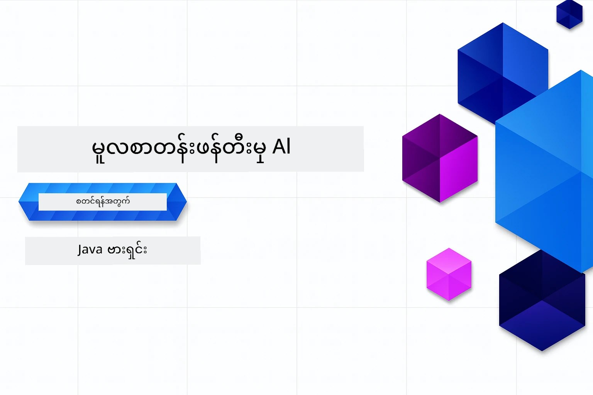

# စက်ဖြစ်စေ စုပေါင်းတီထွင်မှုပညာ - Java ဗားရှင်း
[](https://discord.gg/nTYy5BXMWG)



**အချိန်မည့်အားပေးမှု**: အလုပ်ရုံသင်တန်းအားလုံးကို ဒေသပြင်ဆင်မှုမလိုဘဲ အွန်လိုင်းမှ ပြီးမြောက်နိုင်သည်။ ပတ်ဝန်းကျင်အဆင်ပြေမှုကို ၂ မိနစ်ယူပြီး၊ နမူနာများကို ရှာဖွေခြင်းမှာ စူးစမ်းမှုအနက်အပေါ်မူတည်၍ ၁-၃ နာရီ လိုအပ်နိုင်သည်။

> **အမြန်စတင်ခြင်း**

1. ဤ repository ကို သင့် GitHub မှတ်တမ်းသို့ ကြိုးပုံဆွဲပါ
2. **Code** → **Codespaces** အကွက် → **...** → **New with options...** ကိုနှိပ်ပါ
3. အစပျိုးများကို အသုံးပြုပါ – ဤသည်က ဒီသင်တန်းအတွက် ဖန်တီးထားသော နည်းပညာ container ကိုရွေးချယ်ပါမည်
4. **Create codespace** ကိုနှိပ်ပါ
5. ပတ်ဝန်းကျင် ပြင်ဆင်စရာ ၂ မိနစ်ကျော် စောင့်ဆိုင်းပါ
6. တိုက်ရိုက် [နမူနာပထမ](./02-SetupDevEnvironment/README.md#step-2-create-a-github-personal-access-token) သို့ မောင်းနှင်ပါ

## ဘာသာစကားများစွာ ထောက်ပံ့မှု

### GitHub Action ဖြင့် ထောက်ပံ့သည် (အလိုအလျောက်နှင့် အမြဲဖက်တော်)

<!-- CO-OP TRANSLATOR LANGUAGES TABLE START -->
[အာရဗီ](../ar/README.md) | [ဘင်္ဂါလီ](../bn/README.md) | [ဘူလ်ဂေးရီးယား](../bg/README.md) | [မြန်မာ (မြန်မာ)](./README.md) | [တရုတ် (ရိုးရှင်း)](../zh-CN/README.md) | [တရုတ် (ရိုးရာ၊ ဟောင်ကောင်)](../zh-HK/README.md) | [တရုတ် (ရိုးရာ၊ မာကောက်)](../zh-MO/README.md) | [တရုတ် (ရိုးရာ၊ ထိုင်ဝမ်)](../zh-TW/README.md) | [ခရိုးသီးယား](../hr/README.md) | [ချက်](../cs/README.md) | [ဒိန်းမတ်](../da/README.md) | [နယ်သာလန်](../nl/README.md) | [အက်စတိုးနီးယား](../et/README.md) | [ဖင်လန်](../fi/README.md) | [ပြင်သစ်](../fr/README.md) | [ဂျာမန်](../de/README.md) | [ဂရိ](../el/README.md) | [ဟီဘရူး](../he/README.md) | [ဟိန္ဒီ](../hi/README.md) | [ဟန်ဂေးရီးယား](../hu/README.md) | [အင်ဒိုနီးရှား](../id/README.md) | [အီတလီ](../it/README.md) | [ဂျပန်](../ja/README.md) | [ကန်နာဒါ](../kn/README.md) | [ခမာ](../km/README.md) | [ကိုရီးယား](../ko/README.md) | [လစ်သူအေးနီးယား](../lt/README.md) | [မလေး](../ms/README.md) | [မလေးလာမ်](../ml/README.md) | [မာရသီ](../mr/README.md) | [နီပေါလီး](../ne/README.md) | [ไนဂျီးရားပစ်ဂင်](../pcm/README.md) | [နော်ဝေ](../no/README.md) | [ဖာစီ (ပါရှန်)](../fa/README.md) | [ပိုလန်](../pl/README.md) | [ပေါ်တူဂီ (ဘرازီးလ်)](../pt-BR/README.md) | [ပေါ်တူဂီ (ပေါ်တူဂီ)](../pt-PT/README.md) | [ပန်ဂျာဘီ (ဂူရူမူခီ)](../pa/README.md) | [ရိုမေးနီးယား](../ro/README.md) | [ရုရှား](../ru/README.md) | [ဆားဘီးယား (စီရလစ်)](../sr/README.md) | [စလိုဗက်](../sk/README.md) | [စလိုဗေးနီးယား](../sl/README.md) | [စပိန်](../es/README.md) | [ဆွာဟီလီ](../sw/README.md) | [ဆွီဒင်](../sv/README.md) | [တာဂလိုအမ် (ဖိလစ္ပိန်)](../tl/README.md) | [တမီးလ်](../ta/README.md) | [တီလီဂု](../te/README.md) | [ထိုင်း](../th/README.md) | [ တူရကီ](../tr/README.md) | [ယူကရိန်း](../uk/README.md) | [ဥရူ](../ur/README.md) | [ဗီယက်နမ်](../vi/README.md)

> **ဒေသတွင် ကလွန်လုပ်ချင်ပါသလား?**
>
> ဤ repository တွင် ဘာသာစကား ၅၀ ကျော် ပြန်ဆိုမှုများ ပါဝင်ပြီး ဒေါင်းလုပ်အရွယ်အစားကို အထူးတိုးမြှင့်စေသည်။ ဘာသာပြန်များ မပါဘဲ ကလွန်လုပ်ရန် sparse checkout ကို အသုံးပြုပါ။
>
> **Bash / macOS / Linux:**
> ```bash
> git clone --filter=blob:none --sparse https://github.com/microsoft/Generative-AI-for-beginners-java.git
> cd Generative-AI-for-beginners-java
> git sparse-checkout set --no-cone '/*' '!translations' '!translated_images'
> ```
>
> **CMD (Windows):**
> ```cmd
> git clone --filter=blob:none --sparse https://github.com/microsoft/Generative-AI-for-beginners-java.git
> cd Generative-AI-for-beginners-java
> git sparse-checkout set --no-cone "/*" "!translations" "!translated_images"
> ```
>
> သင်ဒီသင်တန်းပြီးမြောက်ရန် လိုအပ်သည့် အရာအားလုံးကို ပိုမိုမြန်ဆန်သော ဒေါင်းလုပ်ဖြင့် ရရှိစေပါသည်။
<!-- CO-OP TRANSLATOR LANGUAGES TABLE END -->

## သင်တန်းဖွဲ့စည်းမှုနှင့် သင်ယူမှုလမ်းကြောင်း

### **အခန်း ၁: စုစုပေါင်းတီထွင်မှုပညာနည်းပညာအမှာစကား**
- **အဓိကသဘောတရားများ**: တောင်ကြီးသောဘာသာစကားမော်ဒယ်များ၊ token များ၊ embedding များနှင့် AI ၏ စွမ်းဆောင်ရည် ကို နားလည်ခြင်း
- **Java AI ပတ်၀န်းကျင်**: Spring AI နှင့် OpenAI SDK များအကြောင်းအနှစ်ချုပ်
- **မော်ဒယ် context စနစ်**: MCP အကြောင်းနိဒါန်းနှင့် AI ကိုယ်စားလှယ် ဆက်သွယ်မှုတွင် ၎င်း၏အခန်းကဏ္ဍ
- **လက်တွေ့အသုံးချမှုများ**: စကားပြော ဘော့များနှင့် အကြောင်းအရာဖန်တီးခြင်း များအပါအဝင် จริง الخاص בעולמיים
- **[→ အခန်း ၁ စတင်ရန်](./01-IntroToGenAI/README.md)**

### **အခန်း ၂: ဖွံ့ဖြိုးတိုးတက်ရေးပတ်ဝန်းကျင် ပြင်ဆင်ခြင်း**
- **သူပုန်များစွာထောက်ပံ့မှု**: GitHub Models၊ Azure OpenAI နှင့် OpenAI Java SDK ပေါင်းစပ်တင်သွင်းမှု
- **Spring Boot + Spring AI**: စက်မှုအသုံးပြု AI လျှောက်လွှာ ဖွံ့ဖြိုးရေးအတွက်အကောင်းဆုံးလေ့လာမှု
- **GitHub Models**: လေ့လာသင်ယူမှုနှင့် prototype ပြုလုပ်မှုအတွက် အခမဲ့ AI မော်ဒယ် အသုံးပြုခွင့် (ကဒ်မလို)
- **ဖွံ့ဖြိုးရေးကိရိယာများ**: Docker container များ၊ VS Code နှင့် GitHub Codespaces ပြင်ဆင်ခြင်း
- **[→ အခန်း ၂ စတင်ရန်](./02-SetupDevEnvironment/README.md)**

### **အခန်း ၃: စင်တာ ဝန်းကျင် တီထွင်စက်မှုနည်းပညာများ**
- **Prompt Engineering**: AI မော်ဒယ်တုံ့ပြန်မှုအတွက် အကောင်းဆုံးနည်းလမ်းများ
- **Embedding နှင့် Vector လုပ်ငန်းစဉ်များ**: semantic ရှာဖွေရေးနှင့် ဆင်တူမှု ကို လက်တွေ့ကျလေ့ကျင့်ခြင်း
- **Retrieval-Augmented Generation (RAG)**: သင့်ကိုယ်ပိုင်ဒေတာတောင်းခံမှုနှင့် AI ပေါင်းစပ်ခြင်း
- **Function Calling**: ကိုယ်ပိုင်ကိရိယာများနှင့် Plugin များဖြင့် AI စွမ်းဆောင်ရည် တိုးချဲ့ခြင်း
- **[→ အခန်း ၃ စတင်ရန်](./03-CoreGenerativeAITechniques/README.md)**

### **အခန်း ၄: လက်တွေ့အသုံးချမှုများနှင့် ပရိုဇက်တွဲများ**
- **အိမ်မွေ့ဇာတ်လမ်းထုတ်လုပ်သူ** (`petstory/`): GitHub Models ဖြင့် ဖန်တီးမှုတီထွင်ခြင်း
- **Foundry Local Demo** (`foundrylocal/`): OpenAI Java SDK ဖြင့် ဒေသဌာန AI မော်ဒယ် ပေါင်းစပ်မှု
- **MCP ကိရိယာဝန်ဆောင်မှု** (`calculator/`): Spring AI ဖြင့် မော်ဒယ် context စနစ် အခြေခံ ဖော်ဆောင်မှု
- **[→ အခန်း ၄ စတင်ရန်](./04-PracticalSamples/README.md)**

### **အခန်း ၅: တာ၀န်ယူသည့် AI ဖွံ့ဖြိုးတိုးတက်ခြင်း**
- **GitHub Models လုံခြုံမှု**: အတွင်းပလီ content filtering နှင့် လုံခြုံမှုစနစ်များကို စမ်းသပ်ခြင်း (ကိန်းတားမှု ခက်ခဲမှုများနှင့် ပျော့ချပ်မှုဆက်ခံရမှုများ)
- **တာဝန်ယူ AI demonstration**: ခေတ်မီ AI လုံခြုံမှုစနစ်များ လက်တွေ့ အလုပ်လုပ်ပုံ ကို ပြသခြင်း
- **အကောင်းဆုံးလေ့လာမှုများ**: တရားဝင် AI ဖွံ့ဖြိုးမှုနှင့် ပြုပြင်ထိန်းသိမ်းမှု အတွက် လမ်းညွှန်ချက်များ
- **[→ အခန်း ၅ စတင်ရန်](./05-ResponsibleGenAI/README.md)**

## ကိုက်ညီစွာ အသုံးချနိုင်သော အရင်းအမြစ်များ

<!-- CO-OP TRANSLATOR OTHER COURSES START -->
### LangChain
[](https://aka.ms/langchain4j-for-beginners)
[](https://aka.ms/langchainjs-for-beginners?WT.mc_id=m365-94501-dwahlin)
[](https://github.com/microsoft/langchain-for-beginners?WT.mc_id=m365-94501-dwahlin)
---

### Azure / Edge / MCP / Agents
[](https://github.com/microsoft/AZD-for-beginners?WT.mc_id=academic-105485-koreyst)
[](https://github.com/microsoft/edgeai-for-beginners?WT.mc_id=academic-105485-koreyst)
[](https://github.com/microsoft/mcp-for-beginners?WT.mc_id=academic-105485-koreyst)
[](https://github.com/microsoft/ai-agents-for-beginners?WT.mc_id=academic-105485-koreyst)

---

### Generative AI Series
[](https://github.com/microsoft/generative-ai-for-beginners?WT.mc_id=academic-105485-koreyst)
[-9333EA?style=for-the-badge&labelColor=E5E7EB&color=9333EA)](https://github.com/microsoft/Generative-AI-for-beginners-dotnet?WT.mc_id=academic-105485-koreyst)
[-C084FC?style=for-the-badge&labelColor=E5E7EB&color=C084FC)](https://github.com/microsoft/generative-ai-for-beginners-java?WT.mc_id=academic-105485-koreyst)
[-E879F9?style=for-the-badge&labelColor=E5E7EB&color=E879F9)](https://github.com/microsoft/generative-ai-with-javascript?WT.mc_id=academic-105485-koreyst)

---

### အခြေခံသင်ကြားမှု
[](https://aka.ms/ml-beginners?WT.mc_id=academic-105485-koreyst)
[](https://aka.ms/datascience-beginners?WT.mc_id=academic-105485-koreyst)
[](https://aka.ms/ai-beginners?WT.mc_id=academic-105485-koreyst)
[](https://github.com/microsoft/Security-101?WT.mc_id=academic-96948-sayoung)

[](https://aka.ms/webdev-beginners?WT.mc_id=academic-105485-koreyst)
[](https://aka.ms/iot-beginners?WT.mc_id=academic-105485-koreyst)
[](https://github.com/microsoft/xr-development-for-beginners?WT.mc_id=academic-105485-koreyst)

---
 
### Copilot Series
[](https://aka.ms/GitHubCopilotAI?WT.mc_id=academic-105485-koreyst)
[](https://github.com/microsoft/mastering-github-copilot-for-dotnet-csharp-developers?WT.mc_id=academic-105485-koreyst)
[](https://github.com/microsoft/CopilotAdventures?WT.mc_id=academic-105485-koreyst)
<!-- CO-OP TRANSLATOR OTHER COURSES END -->

## ကူညီမှု ရယူခြင်း

AI အက်ပ်များ ဆောက်လုပ်ရာတွင် ခက်ခဲမှုများ ရှိပါက သို့မဟုတ် မေးခွန်းများ ရှိပါက MCP အကြောင်းကို အတူတကွ သင်ယူလိုသူများနှင့် အတွေ့အကြုံရှိ Developer များစွာ ပြောဆိုဆွေးနွေးနိုင်သည်။ ၎င်းသည် မေးခွန်းများကို ကြိုဆိုပြီး အသိပညာများကို တန်ဖိုးထား ဝေမျှပေးသော ကောင်းမွန်သော အသိုင်းအဝိုင်းတစ်ခု ဖြစ်သည်။

[](https://discord.gg/nTYy5BXMWG)

ထုတ်ကုန်ပြန်လည်သုံးသပ်ချက်များ သို့မဟုတ် အမှားများ ရှိပါက ဖွဲ့စည်းစဉ်အတွင်း ဆက်သွယ်ရန်:

[](https://aka.ms/foundry/forum)

---

<!-- CO-OP TRANSLATOR DISCLAIMER START -->
**မှတ်ချက်**  
ဤစာရွက်စာတမ်းကို AI ဘာသာပြန်ဝန်ဆောင်မှု [Co-op Translator](https://github.com/Azure/co-op-translator) အသုံးပြု၍ ဘာသာပြန်ထားပါသည်။ ကျွန်ုပ်တို့သည် တိကျမှန်ကန်မှုအတွက် ကြိုးစားသော်လည်း၊ အလိုအလျောက်ဘာသာပြန်ခြင်းတွင် အမှားများ သို့မဟုတ် မှားယွင်းမှုများ ပါဝင်နိုင်ကြောင်း သတိပြုပါရန်လိုအပ်ပါသည်။ မူလစာရွက်စာတမ်းကို native ဘာသာဖြင့်သာ အတည်ပြုရသောအရင်းအမြစ်အဖြစ် ခံယူသင့်ပါသည်။ အရေးကြီးသောအချက်အလက်များအတွက် ပရော်ဖက်ရှင်နယ် လူ့ဘာသာပြန်ခြင်းကို တိုက်တွန်းပါသည်။ ဤဘာသာပြန်ချက်ကို အသုံးပြုပြဋ္ဌာန်းမှုကြောင့် ဖြစ်ပေါ်လာနိုင်သည့် နားလည်မှုမမှန်ခြင်းများ သို့မဟုတ် မှားဖတ်ခြင်းများအတွက် ကျွန်ုပ်တို့သည် တာဝန်မယူပါ။
<!-- CO-OP TRANSLATOR DISCLAIMER END -->