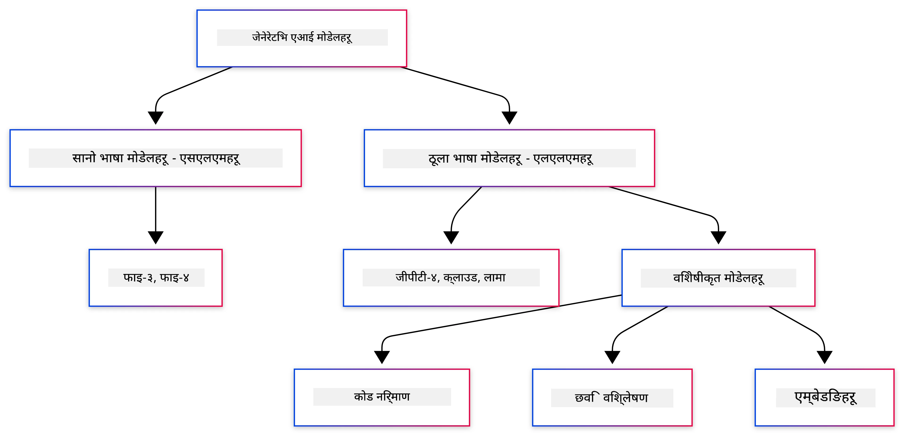
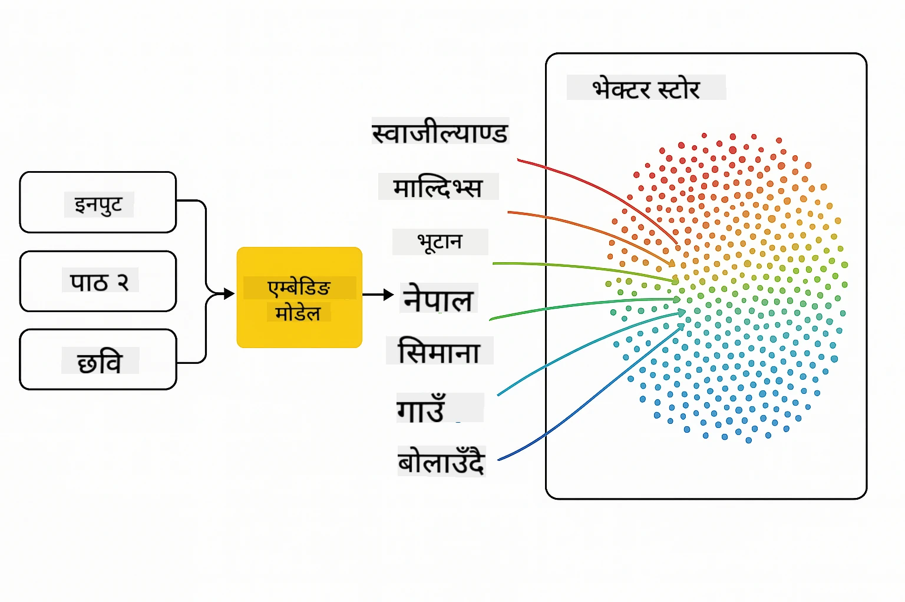
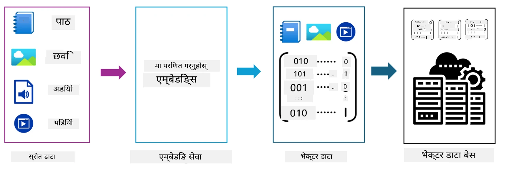
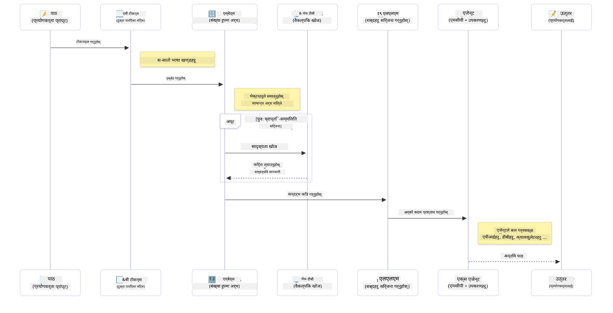

# जेनेरेटिभ AI मा परिचय - Java संस्करण

> **भिडियो**: [यस पाठको लागि YouTube मा भिडियो अवलोकन हेर्नुहोस्।](https://www.youtube.com/watch?v=XH46tGp_eSw) तपाईं माथि रहेको थम्बनेल छवि पनि क्लिक गर्न सक्नुहुन्छ।

## तपाईं के सिक्नुहुनेछ

- **जेनेरेटिभ AI आधारभूत** जसमा LLMs, प्रॉम्प्ट इन्जिनियरिङ, टोकन्स, एम्बेडिङ्स, र भेक्टर डाटाबेसहरू समावेश छन्
- **Java AI विकास उपकरणहरू तुलना गर्नुहोस्** जसमा Azure OpenAI SDK, Spring AI, र OpenAI Java SDK समावेश छन्
- **मोडेल कन्स्टेक्स्ट प्रोटोकल पत्ता लगाउनुहोस्** र AI एजेन्ट संचारमा यसको भूमिका

## सामग्री तालिका

- [परिचय](#परिचय)
- [जेनेरेटिभ AI अवधारणाहरूमा छिटो फ्रेसर](#जेनेरेटिभ-ai-अवधारणाहरूमा-छिटो-फ्रेसर)
- [प्रॉम्प्ट इन्जिनियरिङ समीक्षा](#प्रॉम्प्ट-इन्जिनियरिङ-समीक्षा)
- [टोकन्स, एम्बेडिङ्स, र एजेन्टहरू](#टोकन्स-एम्बेडिङ्स-र-एजेन्टहरू)
- [Java को लागि AI विकास उपकरणहरू र पुस्तकालयहरू](#java-को-लागि-ai-विकास-उपकरणहरू-र-पुस्तकालयहरू)
  - [OpenAI Java SDK](#openai-java-sdk)
  - [Spring AI](#spring-ai)
  - [Azure OpenAI Java SDK](#azure-openai-java-sdk)
- [सारांस](#सारांस)
- [अगिल्ला कदमहरू](#अगिल्ला-कदमहरू)

## परिचय

जेनेरेटिभ AI फॉर बिगिनर्स - Java संस्करणको पहिलो अध्यायमा स्वागत छ! यस आधारभूत पाठले तपाईंलाई जेनेरेटिभ AI का मुख्य अवधारणाहरू र तिनीहरूलाई Java प्रयोग गरी कसरी काम गर्ने बारे परिचय गराउँछ। तपाईंले AI अनुप्रयोगहरूको मौलिक निर्माण ब्लकहरू सिक्नुहुनेछ, जसमा ठूलो भाषा मोडेलहरू (LLMs), टोकन्स, एम्बेडिङ्स, र AI एजेन्टहरू समावेश छन्। हामी यस कोर्समा प्रयोग हुने मुख्य Java टुलिङहरूमाथि पनि अन्वेषण गर्नेछौं।

### जेनेरेटिभ AI अवधारणाहरूमा छिटो फ्रेसर

जेनेरेटिभ AI एउटा यस्तो कृत्रिम बुद्धिमत्ता प्रकार हो जुन डाटाबाट सिकेका ढाँचाहरू र सम्बन्धहरूमा आधारित नयाँ सामग्री जस्तै पाठ, छवि, वा कोड सिर्जना गर्छ। जेनेरेटिभ AI मोडेलहरूले मानव-समान प्रतिक्रियाहरू उत्पन्न गर्न सक्छन्, सन्दर्भ बुझ्न सक्छन्, र कहिलेकाहीं मानव-जस्तो सामग्री पनि सिर्जना गर्छन्।

तपाईंले Java AI अनुप्रयोगहरू विकास गर्दा, तपाईंले **जेनेरेटिभ AI मोडेलहरू** सँग काम गर्नुहुनेछ सामग्री सिर्जना गर्न। जेनेरेटिभ AI मोडेलहरूको केही क्षमता:

- **पाठ सिर्जना**: च्याटबोट, सामग्री, र पाठ पूर्ति लागि मानव-जस्तो पाठ तयार पार्ने।
- **छवि सिर्जना र विश्लेषण**: वास्तविक छविहरू उत्पादन गर्ने, फोटोहरू सुधार गर्ने, र वस्तुहरू पत्ता लगाउने।
- **कोड सिर्जना**: कोड स्निपेट वा स्क्रिप्ट लेख्ने।

विशिष्ट प्रकारका मोडेलहरू विभिन्न कार्यहरूका लागि अनुकूलित हुन्छन्। उदाहरणका लागि, **साना भाषा मोडेलहरू (SLMs)** र **ठूला भाषा मोडेलहरू (LLMs)** दुवैले पाठ सिर्जना गर्न सक्छन्, जहाँ LLMs प्रायः जटिल कार्यका लागि राम्रो प्रदर्शन प्रदान गर्छ। छविसँग सम्बन्धित कार्यहरूका लागि, तपाईंले विशेष दृष्टि मोडेलहरू वा मल्टि-मोडल मोडेलहरू प्रयोग गर्नुहुनेछ।

पक्कै पनि, यी मोडेलहरूले प्रदान गर्ने प्रतिक्रियाहरू सधैं पूर्ण रूपमा सही हुँदैनन्। तपाईंले मोडेलहरू "हल्युसिनेट" वा अधिकारिक तरिकाले गलत जानकारी सिर्जना गर्ने कुरा सुन्नुभएको होला। तर तपाईंले स्पष्ट निर्देशनहरू र सन्दर्भ दिनुहोस् भने मोडेलहरूलाई राम्रो प्रतिक्रियाहरू उत्पन्न गर्न मार्गदर्शन गर्न सक्नुहुन्छ। यो नै स्थान हो जहाँ **प्रॉम्प्ट इन्जिनियरिङ** आउँछ।

#### प्रॉम्प्ट इन्जिनियरिङ समीक्षा

प्रॉम्प्ट इन्जिनियरिङ भनेको AI मोडेलहरूलाई इच्छित नतिजाहरूतर्फ मार्ग निर्देशन गर्न प्रभावकारी इनपुट डिजाइन गर्ने अभ्यास हो। यसले समावेश गर्दछ:

- **स्पष्टता**: निर्देशनहरू स्पष्ट र अस्पष्ट नभएको बनाउन।
- **सन्दर्भ**: आवश्यक पृष्ठभूमि जानकारी प्रदान गर्नु।
- **सीमाहरू**: कुनै पनि प्रतिबन्ध वा ढाँचा निर्दिष्ट गर्नु।

प्रॉम्प्ट इन्जिनियरिङका केही राम्रो अभ्यासहरूमा प्रॉम्प्ट डिजाइन, स्पष्ट निर्देशनहरू, कार्य विभाजन, एकचोटि र थोरै पटक सिकाइ, र प्रॉम्प्ट ट्यूनिङ समावेश छन्। विभिन्न प्रॉम्प्टहरू परीक्षण गर्नु आवश्यक हुन्छ तपाईंको विशिष्ट उपयोग केसका लागि के राम्रो काम गर्छ पत्ता लगाउन।

अनुप्रयोगहरू विकास गर्दा, तपाईं विभिन्न प्रकारका प्रॉम्प्टहरूसँग काम गर्नुहुनेछ:
- **सिस्टम प्रॉम्प्टहरू**: मोडेलको व्यवहारको आधार नियम र सन्दर्भ सेट गर्ने
- **प्रयोगकर्ता प्रॉम्प्टहरू**: तपाईंको अनुप्रयोग प्रयोगकर्ताहरूबाट इनपुट डेटा
- **सहायक प्रॉम्प्टहरू**: प्रणाली र प्रयोगकर्ता प्रॉम्प्टहरूमा आधारित मोडेलको प्रतिक्रियाहरू

> **थप जान्नुहोस्**: [जेनेरेटिभ AI फॉर बिगिनर्स कोर्सको प्रॉम्प्ट इन्जिनियरिङ अध्याय](https://github.com/microsoft/generative-ai-for-beginners/tree/main/04-prompt-engineering-fundamentals) मा प्रॉम्प्ट इन्जिनियरिङका बारेमा थप जान्नुहोस्।

#### टोकन्स, एम्बेडिङ्स, र एजेन्टहरू

जेनेरेटिभ AI मोडेलहरूसँग काम गर्दा, तपाईं **टोकन्स**, **एम्बेडिङ्स**, **एजेन्टहरू**, र **मोडेल कन्स्टेक्स्ट प्रोटोकल (MCP)** जस्ता शब्दहरू सामना गर्नुहुनेछ। यी अवधारणाहरूको विस्तृत अवलोकन यहाँ छ:

- **टोकन्स**: टोकन्स मोडेलमा सबैभन्दा सानो पाठ इकाई हुन्। यी शब्द, अक्षर, वा उपशब्द हुन सक्छन्। टोकन्सहरू पाठ डेटा मोडेलले बुझ्ने ढाँचामा प्रतिनिधित्व गर्न प्रयोग गरिन्छ। उदाहरणका लागि, "The quick brown fox jumped over the lazy dog" वाक्यलाई तलका जस्तो टोकनाइज गर्न सकिन्छ ["The", " quick", " brown", " fox", " jumped", " over", " the", " lazy", " dog"] वा ["The", " qu", "ick", " br", "own", " fox", " jump", "ed", " over", " the", " la", "zy", " dog"] टोकनाइजेशन रणनीतिअनुसार।

टोकनाइजेशन भनेको टेक्स्टलाई यी साना इकाइहरूमा विभाजन गर्ने प्रक्रिया हो। यो महत्वपूर्ण छ किनभने मोडेलहरू कच्चा पाठभन्दा टोकन्समा काम गर्छन्। प्रॉम्प्टमा टोकन्सको संख्या मोडेलको प्रतिक्रिया लम्बाइ र गुणस्तरलाई असर पार्छ, किनभने मोडेलहरूले आफ्नो कन्स्टेक्स्ट विन्डो (जस्तै GPT-4o को लागि 128K टोकन्स सहित इनपुट र आउटपुट) को लागि टोकन सीमाहरू हुन्छन्।

  Java मा, तपाईं OpenAI SDK जस्ता पुस्तकालयहरू प्रयोग गरेर AI मोडेलहरूलाई अनुरोध गर्दा टोकनाइजेशन स्वचालित रूपमा गर्न सक्नुहुन्छ।

- **एम्बेडिङ्स**: एम्बेडिङ्स भनेको टोकन्सको भेक्टर प्रतिनिधित्व हो जसले अर्थपूर्ण भावलाई समात्छ। यो संख्यात्मक प्रतिनिधित्वहरू (प्रायः फ्लोटिङ-पोइन्ट संख्या सरणीहरू) हुन् जसले मोडेलहरूलाई शब्दहरू बीचको सम्बन्ध बुझ्न र सन्दर्भ अनुसार प्रासंगिक प्रतिक्रिया जनाउन सक्षम पार्छ। समानार्थी शब्दहरूसँग समान एम्बेडिङ्स हुन्छन्, जसले मोडेललाई पर्यायवाची र अर्थसम्बन्धी सम्बन्धहरू बुझ्न मद्दत गर्छ।

  Java मा, तपाईं OpenAI SDK वा अन्य पुस्तकालयहरू प्रयोग गरी एम्बेडिङ्स उत्पन्न गर्न सक्नुहुन्छ। यी एम्बेडिङ्स सेमेन्टिक सर्च जस्ता कार्यहरूका लागि अनिवार्य छन्, जहाँ तपाईं अर्थको आधारमा समान सामग्री फेला पार्न चाहनुहुन्छ, ठ्याक्कै पाठ मेल खाए भन्दा।

- **भेक्टर डाटाबेसहरू**: भेक्टर डाटाबेसहरू विशेष भण्डारण प्रणालीहरू हुन् जुन एम्बेडिङ्सका लागि अनुकूलित छन्। ती प्रभावकारी समानता खोज सक्षम पार्छन् र Retrieval-Augmented Generation (RAG) ढाँचाहरूमा महत्त्वपूर्ण छन् जहाँ तपाईंलाई ठूलो डाटासेटबाट सान्दर्भिक जानकारी अर्थको समानतामा आधारित फेला पार्न आवश्यक हुन्छ।

> **सूचना**: यस कोर्समा हामी भेक्टर डाटाबेसहरू कभर गर्ने छैनौं तर तिनीहरूलाई उल्लेख गर्नु उचित छ किनकि तिनीहरू वास्तविक-विश्व अनुप्रयोगहरूमा सामान्य रूपमा प्रयोग गरिन्छन्।

- **एजेन्टहरू र MCP**: AI कम्पोनेन्टहरू जसले मोडेलहरू, उपकरणहरू, र बाह्य प्रणालीहरूसँग स्वतन्त्र रूपमा अन्तरक्रिया गर्छन्। Model Context Protocol (MCP) एजेन्टहरूलाई बाह्य डाटा स्रोतहरू र उपकरणहरू सुरक्षित रूपमा पहुँच गर्न एक मानकीकृत तरिका प्रदान गर्दछ। थप जानकारीको लागि हाम्रो [MCP फॉर बिगिनर्स](https://github.com/microsoft/mcp-for-beginners) कोर्समा जानुहोस्।

Java AI अनुप्रयोगहरूमा, तपाईंले पाठ प्रशोधनको लागि टोकन्स प्रयोग गर्नुहुनेछ, सेमेन्टिक सर्च र RAG का लागि एम्बेडिङ्स, डाटा पुनःप्राप्तिका लागि भेक्टर डाटाबेसहरू, र बुद्धिमान, उपकरण प्रयोग गर्ने प्रणालीहरू निर्माण गर्न एजेन्टहरू र MCP प्रयोग गर्नुहुनेछ। 

### Java को लागि AI विकास उपकरणहरू र पुस्तकालयहरू

Java मा AI विकासका लागि उत्कृष्ट उपकरणहरू उपलब्ध छन्। यस कोर्समा हामी मुख्य तीन पुस्तकालयहरू अन्वेषण गर्नेछौं - OpenAI Java SDK, Azure OpenAI SDK, र Spring AI।

यहाँ छिटो सन्दर्भ तालिका छ जुन देखाउँछ कि कुन SDK प्रत्येक अध्यायका उदाहरणहरूमा प्रयोग गरिएको छ:

| अध्याय | नमूना | SDK |
|---------|--------|-----|
| 02-SetupDevEnvironment | github-models | OpenAI Java SDK |
| 02-SetupDevEnvironment | basic-chat-azure | Spring AI Azure OpenAI |
| 03-CoreGenerativeAITechniques | examples | Azure OpenAI SDK |
| 04-PracticalSamples | petstory | OpenAI Java SDK |
| 04-PracticalSamples | foundrylocal | OpenAI Java SDK |
| 04-PracticalSamples | calculator | Spring AI MCP SDK + LangChain4j |

**SDK कागजात लिंकहरू:**
- [Azure OpenAI Java SDK](https://github.com/Azure/azure-sdk-for-java/tree/azure-ai-openai_1.0.0-beta.16/sdk/openai/azure-ai-openai)
- [Spring AI](https://docs.spring.io/spring-ai/reference/)
- [OpenAI Java SDK](https://github.com/openai/openai-java)
- [LangChain4j](https://docs.langchain4j.dev/)

#### OpenAI Java SDK

OpenAI SDK OpenAI API को लागि आधिकारिक Java पुस्तकालय हो। यसले OpenAI का मोडेलहरूसँग अन्तरक्रिया गर्न सरल र सुसंगत इन्टरफेस प्रदान गर्दछ, जसले Java अनुप्रयोगहरूमा AI क्षमता समेकन गर्न सजिलो बनाउँछ। अध्याय २ को GitHub Models उदाहरण, अध्याय ४ को Pet Story अनुप्रयोग र Foundry Local उदाहरणले OpenAI SDK दृष्टिकोण देखाउँछन्।

#### Spring AI

Spring AI एक व्यापक फ्रेमवर्क हो जसले Spring अनुप्रयोगहरूमा AI क्षमता ल्याउँछ, विभिन्न AI प्रदायकहरूमा समान रूपरेखा प्रदान गर्दछ। यो Spring इकोसिस्टमसँग सहज रूपमा एकीकृत हुन्छ, जसले उद्यम Java अनुप्रयोगहरूका लागि AI सुविधा आवश्यक हुनेहरूको लागि उपयुक्त विकल्प बनाउँछ।

Spring AI को शक्ति यसको निर्बाध Spring इकोसिस्टमसँग एकीकरणमा छ, जसले परिचित Spring ढाँचाहरू जस्तै निर्भरता इन्जेक्शन, कन्फिगरेसन व्यवस्थापन, र परीक्षण फ्रेमवर्कहरू प्रयोग गरी उत्पादन-तयार AI अनुप्रयोगहरू बनाउन सजिलो बनाउँछ। तपाईंले अध्याय २ र ४ मा Spring AI प्रयोग गरेर OpenAI र Model Context Protocol (MCP) Spring AI पुस्तकालयहरू दुबै लाभ उठाउने अनुप्रयोगहरू बनाउनुहुनेछ।

##### Model Context Protocol (MCP)

[Model Context Protocol (MCP)](https://modelcontextprotocol.io/) एक उभरिरहेको मानक हो जसले AI अनुप्रयोगहरूलाई बाह्य डाटा स्रोतहरू र उपकरणहरूसँग सुरक्षित रूपमा अन्तरक्रिया गर्न सक्षम पार्छ। MCP ले AI मोडेलहरूलाई सन्दर्भगत जानकारी पहुँच गर्न र तपाईंको अनुप्रयोगहरूमा क्रियाकलापहरू चलाउन मानकीकृत तरिका प्रदान गर्दछ।

अध्याय ४ मा, तपाईंले एक सरल MCP क्याल्कुलेटर सेवा निर्माण गर्नुहुनेछ जुन Spring AI सँग Model Context Protocol को आधारभूत कुरा देखाउँछ, र कसरी आधारभूत उपकरण एकीकरणहरू र सेवा आर्किटेक्चरहरू बनाउन सकिन्छ।

#### Azure OpenAI Java SDK

Azure OpenAI क्लाइंट लाइब्रेरी Java का लागि OpenAI को REST API को अनुकूलन हो जसले Azure SDK इकोसिस्टमसँग मिल्ने शैलीको इन्टरफेस प्रदान गर्छ। अध्याय ३ मा, तपाईंले Azure OpenAI SDK प्रयोग गरी च्याट अनुप्रयोगहरू, फङ्सन कलिङ, र RAG (Retrieval-Augmented Generation) ढाँचाहरू निर्माण गर्नुहुनेछ।

> नोट: Azure OpenAI SDK सुविधाहरूको हिसाबले OpenAI Java SDK भन्दा पछाडि छ, त्यसैले भविष्यका परियोजनाहरूका लागि OpenAI Java SDK प्रयोग गर्ने विचार गर्नुहोस्।

## सारांस

त्यसैले आधारहरू समाप्त भयो! तपाईं अब बुझ्नुहुन्छ:

- जेनेरेटिभ AI का मूल अवधारणाहरू - LLMs र प्रॉम्प्ट इन्जिनियरिङदेखि लिएर टोकन्स, एम्बेडिङ्स, र भेक्टर डाटाबेससम्म
- Java AI विकासका लागि तपाईँका उपकरण विकल्पहरू: Azure OpenAI SDK, Spring AI, र OpenAI Java SDK
- Model Context Protocol के हो र यसले कसरी AI एजेन्टहरूलाई बाह्य उपकरणहरूसँग काम गर्न सक्षम बनाउँछ

## अगिल्ला कदमहरू

[अध्याय २: विकास वातावरण सेट अप गर्ने](../02-SetupDevEnvironment/README.md)

---

<!-- CO-OP TRANSLATOR DISCLAIMER START -->
**अस्वीकरण**:  
यो दस्तावेज़लाई AI अनुवाद सेवा [Co-op Translator](https://github.com/Azure/co-op-translator) प्रयोग गरेर अनुवाद गरिएको हो। हामी शुद्धताको लागि प्रयासरत छौं, तर कृपया जान्नुहोस् कि स्वचालित अनुवादमा त्रुटिहरू वा असत्यताहरू हुन सक्छन्। मूल दस्तावेज़ यसको मूल भाषामा नै आधिकारिक स्रोत मानिनु पर्छ। महत्वपूर्ण जानकारीको लागि, व्यावसायिक मानव अनुवाद सिफारिस गरिन्छ। यस अनुवादको प्रयोगबाट उत्पन्न कुनै पनि गलतफहमी वा गलत व्याख्याका लागि हामी जिम्मेवार छैनौं।
<!-- CO-OP TRANSLATOR DISCLAIMER END -->