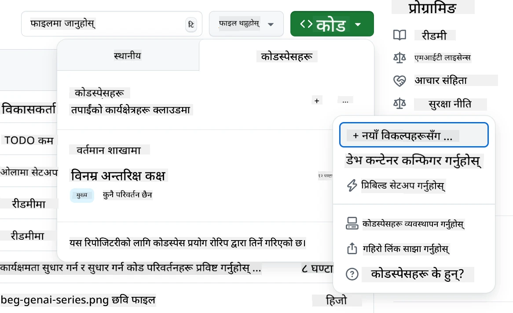
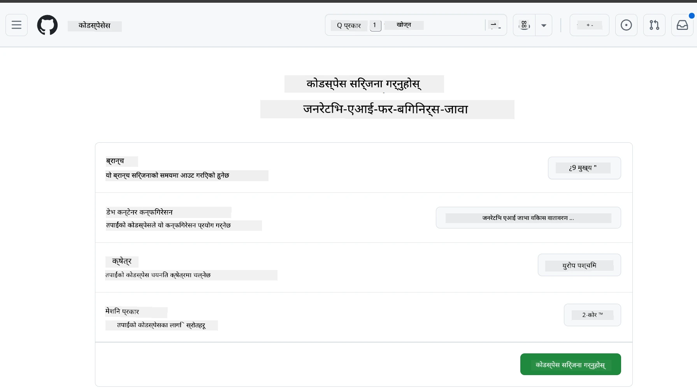
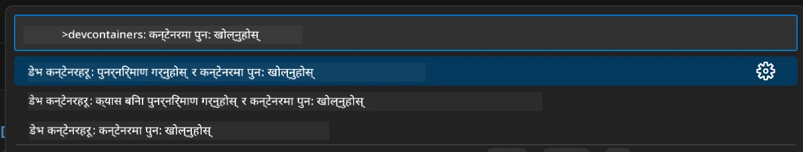
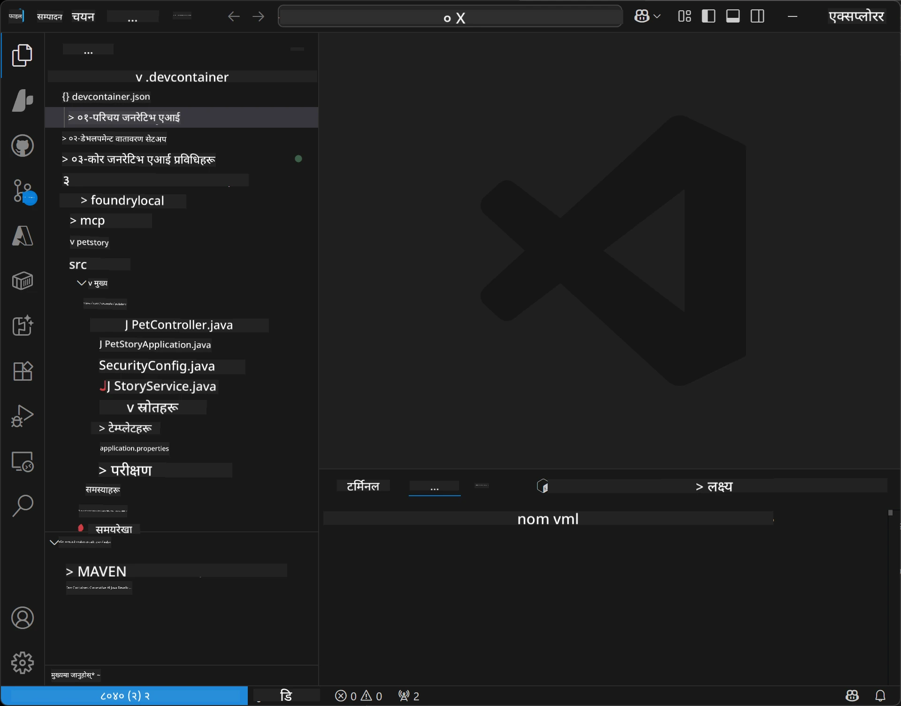
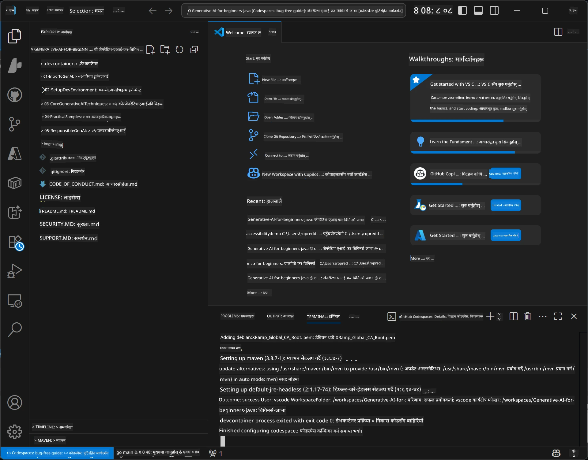

# जनरेटिभ एआईका लागि जाभा विकास वातावरण सेटअप गर्दै

> **द्रुत सुरु:** २ मिनेटमै क्लाउडमा कोड लेख्न थाल्नुहोस् - [GitHub Codespaces सेटअप](../../../02-SetupDevEnvironment) मा जानुहोस् - कुनै स्थानीय इन्स्टलेसन आवश्यक छैन र GitHub मोडेलहरू प्रयोग गर्छ!

> **Azure OpenAI मा रुचि छ?**, नयाँ Azure OpenAI स्रोत बनाउनका लागि हाम्रो [Azure OpenAI सेटअप गाइड](getting-started-azure-openai.md) हेर्नुहोस्।

## तपाईं के सिक्नुहुनेछ

- AI अनुप्रयोगका लागि जाभा विकास वातावरण सेटअप गर्ने
- तपाइँको रोजाइको विकास वातावरण चयन र कन्फिगर गर्ने (Codespaces सहित क्लाउड-प्रथम, स्थानीय dev container, वा पूर्ण स्थानीय सेटअप)
- GitHub मोडेलसँग जडान गरेर तपाईंको सेटअप परीक्षण गर्ने

## सामग्री तालिका

- [तपाईं के सिक्नुहुनेछ](../../../02-SetupDevEnvironment)
- [परिचय](../../../02-SetupDevEnvironment)
- [चरण १: विकास वातावरण सेटअप गर्नुहोस्](../../../02-SetupDevEnvironment)
  - [विकल्प ए: GitHub Codespaces (सिफारिस गरिएको)](../../../02-SetupDevEnvironment)
  - [विकल्प B: स्थानीय Dev Container](../../../02-SetupDevEnvironment)
  - [विकल्प C: तपाइँको अवस्थित स्थानीय इन्स्टलेसन प्रयोग गर्नुहोस्](../../../02-SetupDevEnvironment)
- [चरण २: GitHub व्यक्तिगत पहुँच टोकन बनाउनुहोस्](../../../02-SetupDevEnvironment)
- [चरण ३: तपाईंको सेटअप परीक्षण गर्नुहोस्](../../../02-SetupDevEnvironment)
- [समस्या समाधान](../../../02-SetupDevEnvironment)
- [सारांश](../../../02-SetupDevEnvironment)
- [अर्को कदम](../../../02-SetupDevEnvironment)

## परिचय

यो अध्यायले तपाइँलाई विकास वातावरण सेटअप गर्न मार्गदर्शन गर्नेछ। हामी **GitHub Models** लाई हाम्रो प्रमुख उदाहरणको रूपमा प्रयोग गर्नेछौं किनकि यो निःशुल्क छ, केवल GitHub खाता भए गरेकाले सजिलो छ, कुनै क्रेडिट कार्ड आवश्यक पर्दैन, र प्रयोगका लागि धेरै मोडेलहरू उपलब्ध छन्।

**कुनै स्थानीय सेटअप आवश्यक छैन!** तपाइँ तुरुन्तै GitHub Codespaces प्रयोग गरी ब्राउजरमा पूर्ण विकास वातावरण प्रदान गर्दै कोड लेख्न सुरु गर्न सक्नुहुन्छ।


हामी यस कोर्सका लागि [**GitHub Models**](https://github.com/marketplace?type=models) प्रयोग गर्न सिफारिस गर्छौं किनकि यो:
- सुरु गर्नका लागि **निःशुल्क**
- केवल GitHub खातासँग सेटअप गर्न **सजिलो**
- **क्रेडिट कार्ड आवश्यक छैन**
- प्रयोगका लागि **धेरै मोडेलहरू** उपलब्ध छन्

> **टिप्पणी:** यस तालिममा प्रयोग गरिएका GitHub Models मा यस्ता निःशुल्क सीमा छन्:
> - प्रति मिनेट १५ अनुरोध (प्रति दिन १५०)
> - प्रति अनुरोध ~८,००० शब्द इनपुट, ~४,००० शब्द आउटपुट
> - ५ समानान्तर अनुरोधहरू
> 
> उत्पादनको लागि, Azure खातासँग Azure AI Foundry Models मा अपग्रेड गर्नुहोस्। तपाइँको कोड परिवर्तन गर्न आवश्यक छैन। हेर्नुहोस् [Azure AI Foundry दस्तावेज](https://learn.microsoft.com/azure/ai-foundry/foundry-models/how-to/quickstart-github-models)।

## चरण १: विकास वातावरण सेटअप गर्नुहोस्

<a name="quick-start-cloud"></a>

हामीले यस जनरेटिभ एआई जाभा कोर्सका लागि आवश्यक सबै उपकरणहरू सहज बनाउन पूर्वकन्फिगर गरिएको विकास कन्टेनर तयार गरेका छौं। तपाइँको मनपर्ने विकास विधि चयन गर्नुहोस्:

### वातावरण सेटअप विकल्पहरू:

#### विकल्प ए: GitHub Codespaces (सिफारिस गरिएको)

**२ मिनेटमै कोड लेख्न सुरु गर्नुहोस् - कुनै स्थानीय सेटअप आवश्यक छैन!**

1. यो रिपोजिटोरी आफ्नो GitHub खातामा Fork गर्नुहोस्
   > **टिप्पणी:** यदि तपाइँ बेसिक कन्फिग सम्पादन गर्न चाहनुहुन्छ भने [Dev Container Configuration](../../../.devcontainer/devcontainer.json) हेर्नुहोस्।
2. क्लिक गर्नुहोस् **Code** → **Codespaces** ट्याब → **...** → **New with options...**
3. पूर्वनिर्धारित सेटिङहरू प्रयोग गर्नुहोस् – यसले यस कोर्सका लागि तयार गरिएको **Generative AI Java Development Environment** कस्टम devcontainer चयन गर्नेछ
4. क्लिक गर्नुहोस् **Create codespace**
5. वातावरण तयार हुन लगभग २ मिनेट पर्खनुहोस्
6. अगाडि बढ्नुहोस् [चरण २: GitHub टोकन बनाउनुहोस्](../../../02-SetupDevEnvironment)






> **Codespaces का फाइदा**:
> - कुनै स्थानीय इन्स्टलेसन आवश्यक छैन
> - ब्राउजर भएको कुनै पनि उपकरणमा चल्छ
> - सबै उपकरण र निर्भरता पूर्व-कन्फिगर गरिएको छ
> - व्यक्तिगत खाताका लागि महिनाेमा निःशुल्क ६० घण्टा
> - सबै सिक्नेलाई एकरूप वातावरण

#### विकल्प B: स्थानीय Dev Container

** Docker सहित स्थानीय विकास प्राथमिकताहरूका लागि**

1. यो रिपोजिटोरी आफ्नो स्थानीय मेसिनमा Fork र क्लोन गर्नुहोस्
   > **टिप्पणी:** यदि बेसिक कन्फिग सम्पादन गर्न चाहनुहुन्छ भने [Dev Container Configuration](../../../.devcontainer/devcontainer.json) हेर्नुहोस्।
2. [Docker Desktop](https://www.docker.com/products/docker-desktop/) र [VS Code](https://code.visualstudio.com/) इन्स्टल गर्नुहोस्
3. VS Code मा [Dev Containers विस्तार](https://marketplace.visualstudio.com/items?itemName=ms-vscode-remote.remote-containers) स्थापना गर्नुहोस्
4. VS Code मा रिपोजिटोरी फोल्डर खोल्नुहोस्
5. सोधिएमा, क्लिक गर्नुहोस् **Reopen in Container** (वा प्रयोग गर्नुहोस् `Ctrl+Shift+P` → "Dev Containers: Reopen in Container")
6. कन्टेनर बनेर सुरु हुन पर्खनुहोस्
7. अगाडि बढ्नुहोस् [चरण २: GitHub टोकन बनाउनुहोस्](../../../02-SetupDevEnvironment)





#### विकल्प C: तपाइँको अवस्थित स्थानीय इन्स्टलेसन प्रयोग गर्नुहोस्

**पहिले देखि रहेको जाभा वातावरण भएका विकासकर्ताहरूका लागि**

पूर्वशर्तहरू:
- [Java 21+](https://www.oracle.com/java/technologies/javase/jdk21-archive-downloads.html)
- [Maven 3.9+](https://maven.apache.org/download.cgi)
- [VS Code](https://code.visualstudio.com) वा तपाइँको मनपर्ने IDE

चरणहरू:
1. यो रिपोजिटोरी आफ्नो स्थानीय मेसिनमा क्लोन गर्नुहोस्
2. आफ्नो IDE मा प्रोजेक्ट खोल्नुहोस्
3. अगाडि बढ्नुहोस् [चरण २: GitHub टोकन बनाउनुहोस्](../../../02-SetupDevEnvironment)

> **पेशेवर सुझाव**: यदि तपाइँको मेशिन कम क्षमताको छ तर स्थानीय VS Code चाहनुहुन्छ भने GitHub Codespaces प्रयोग गर्नुहोस्! तपाइँ आफ्नो स्थानीय VS Code लाई क्लाउड होस्ट गरिएको Codespace सँग जडान गर्न सक्नुहुन्छ।




## चरण २: GitHub व्यक्तिगत पहुँच टोकन बनाउनुहोस्

1. जानुहोस् [GitHub Settings](https://github.com/settings/profile) र तपाइँको प्रोफाइल मेनूबाट **Settings** चयन गर्नुहोस्।
2. बायाँ साइडबारमा, क्लिक गर्नुहोस् **Developer settings** (सामान्यतया तल हुन्छ)।
3. **Personal access tokens** अन्तर्गत, क्लिक गर्नुहोस् **Fine-grained tokens** (वा यो सिधा [लिंक](https://github.com/settings/personal-access-tokens) पछ्याउनुहोस्)।
4. क्लिक गर्नुहोस् **Generate new token**।
5. "Token name" अन्तर्गत स्पष्ट नाम दिनुहोस् (उदाहरण: `GenAI-Java-Course-Token`)।
6. समाप्ति मिति सेट गर्नुहोस् (सिफारिस गरिएको: सुरक्षा खातिर ७ दिन)।
7. "Resource owner" अन्तर्गत तपाइँको प्रयोगकर्ता खाता चयन गर्नुहोस्।
8. "Repository access" अन्तर्गत GitHub Models सँग प्रयोग गर्ने रिपोजिटोरीहरू चयन गर्नुहोस् (वा "All repositories" यदि आवश्यक हो)।
9. "Account permissions" अन्तर्गत **Models** लाई **Read-only**मा सेट गर्नुहोस्।
10. क्लिक गर्नुहोस् **Generate token**।
11. **अब टोकन कपी गरी सुरक्षित राख्नुहोस्** – यो पुन: देखिने छैन!

> **सुरक्षा सुझाव**: पहुँच टोकनहरूका लागि न्यूनतम आवश्यक दायरा र सबैभन्दा छोटो व्यावहारिक समाप्ति समय प्रयोग गर्नुहोस्।

## चरण ३: GitHub Models उदाहरणसँग तपाईंको सेटअप परीक्षण गर्नुहोस्

तपाइँको विकास वातावरण तयार भएपछि, हाम्रो उदाहरण एप्लिकेसन [`02-SetupDevEnvironment/examples/github-models`](../../../02-SetupDevEnvironment/examples/github-models) मा GitHub Models इंटेग्रेशन परीक्षण गरौं।

1. आफ्नो विकास वातावरणमा टर्मिनल खोल्नुहोस्।
2. GitHub Models उदाहरण फोल्डरमा जानुहोस्:
   ```bash
   cd 02-SetupDevEnvironment/examples/github-models
   ```

3. तपाइँको GitHub टोकन पर्यावरण चरको रूपमा सेट गर्नुहोस्:
   ```bash
   # macOS/Linux
   export GITHUB_TOKEN=your_token_here
   
   # विन्डोज (कमाण्ड प्रम्प्ट)
   set GITHUB_TOKEN=your_token_here
   
   # विन्डोज (पावरशेल)
   $env:GITHUB_TOKEN="your_token_here"
   ```

4. एप्लिकेसन चलाउनुहोस्:
   ```bash
   mvn compile exec:java -Dexec.mainClass="com.example.githubmodels.App"
   ```

यसरी आउटपुट देखिनु पर्छ:
```text
Using model: gpt-4.1-nano
Sending request to GitHub Models...
Response: Hello World!
```

### उदाहरण कोड बुझ्नुहोस्

पहिले, हामीले के चलायौं भनी बुझौं। `examples/github-models` भित्रको उदाहरणले OpenAI Java SDK प्रयोग गरी GitHub Models सँग जडान गर्दछ:

**यो कोड के गर्छ:**
- तपाइँको व्यक्तिगत पहुँच टोकन प्रयोग गरी GitHub Models सँग **जडान** गर्छ
- AI मोडेललाई "Say Hello World!" सन्देश **पठाउँछ**
- AI को प्रतिक्रिया **प्राप्त** गरी देखाउँछ
- तपाइँको सेटअप सहि छ कि छैन **मान्य गर्छ**

**मुख्य निर्भरता** (`pom.xml` मा):
```xml
<dependency>
    <groupId>com.openai</groupId>
    <artifactId>openai-java</artifactId>
    <version>2.12.0</version>
</dependency>
```

**मुख्य कोड** (`App.java`):
```java
// OpenAI Java SDK प्रयोग गरेर GitHub मोडेलसँग जडान गर्नुहोस्
OpenAIClient client = OpenAIOkHttpClient.builder()
    .apiKey(pat)
    .baseUrl("https://models.inference.ai.azure.com")
    .build();

// च्याट कम्प्लिशन अनुरोध सिर्जना गर्नुहोस्
ChatCompletionCreateParams params = ChatCompletionCreateParams.builder()
    .model(modelId)
    .addSystemMessage("You are a concise assistant.")
    .addUserMessage("Say Hello World!")
    .build();

// AI प्रतिक्रिया प्राप्त गर्नुहोस्
ChatCompletion response = client.chat().completions().create(params);
System.out.println("Response: " + response.choices().get(0).message().content().orElse("No response content"));
```

## सारांश

शानदार! अब तपाइँसँग सबै तयार छ:

- AI मोडेल पहुँचका लागि सही अनुमति भएको GitHub व्यक्तिगत पहुँच टोकन बनाउनु भयो
- आफ्नो जाभा विकास वातावरण चलाउनुभयो (Codespaces, dev container वा स्थानीय)
- निःशुल्क AI विकासका लागि OpenAI Java SDK प्रयोग गरी GitHub Models सँग जडान गर्नुभयो
- AI मोडेलहरूलाई कुरा गराउने सरल उदाहरणसँग सबै काम चलाउनु भयो

## अर्को कदम

[अध्याय ३: कोर जनरेटिभ एआई प्राविधिहरू](../03-CoreGenerativeAITechniques/README.md)

## समस्या समाधान

समस्या छ? यहाँ सामान्य समस्या र समाधानहरू छन्:

- **टोकन काम नगरेको छ?**  
  - टोकन पूरै कपी गर्नुभयो कि छैन जाँच्नुस्  
  - टोकनलाई सही तरिकाले पर्यावरण चरमा सेट गर्नुभएको छ कि छैन जाँच्नुस्  
  - टोकनमा सही अनुमति (Models: Read-only) छ कि छैन हेरौं

- **Maven नभेटियो?**  
  - dev containers/Codespaces मा Maven पहिले नै इन्स्टल हुन्छ  
  - स्थानीय सेटअपमा Java 21+ र Maven 3.9+ इन्स्टल गर्नुभयो कि छैन जाँच्नुस्  
  - `mvn --version` चलाएर परीक्षण गर्न सक्नुहुन्छ

- **जडान समस्या छ?**  
  - इन्टरनेट जडान ठिक छ कि छैन जाँच्नुस्  
  - तपाइँको नेटवर्कबाट GitHub पहुँच योग्य छ कि छैन पक्का गर्नुस्  
  - GitHub Models अन्त्यबिन्दु अवरुद्ध गर्ने फायरवाल छैन भनेर सुनिश्चित गर्नुस्

- **Dev container सुरु भएको छैन?**  
  - Docker Desktop चलिरहेको छ कि छैन जाँच्नुस् (स्थानीय विकासका लागि)  
  - कन्टेनर पुनःनिर्माण प्रयास गर्नुहोस्: `Ctrl+Shift+P` → "Dev Containers: Rebuild Container"

- **एप्लिकेसन कम्पाइल त्रुटि?**  
  - सही डायरेक्टरीमा हुनुहुन्छ: `02-SetupDevEnvironment/examples/github-models`  
  - सफा र पुनःनिर्माण प्रयास गर्नुहोस्: `mvn clean compile`

> **मद्दत चाहिन्छ?**: समस्या जारी छ? रिपोजिटोरीमा एक Issue खोल्नुहोस्, हामी मद्दत गर्नेछौं।

---

<!-- CO-OP TRANSLATOR DISCLAIMER START -->
**अस्वीकरण**:
यो दस्तावेज AI अनुवाद सेवा [Co-op Translator](https://github.com/Azure/co-op-translator) प्रयोग गरी अनुवाद गरिएको हो। हामी शुद्धताको लागि प्रयासरत भए तापनि, कृपया बुझ्नुहोस् कि स्वचालित अनुवादहरूमा त्रुटि वा असत्यताहरू हुन सक्दछन्। मूल दस्तावेजलाई यसको मूल भाषामा आधिकारिक स्रोतको रूपमा मान्नु पर्नेछ। महत्वपूर्ण जानकारीको लागि व्यावसायिक मानव अनुवाद सिफारिस गरिन्छ। यस अनुवादको प्रयोगबाट उत्पन्न हुने कुनै पनि गलतफहमी वा गलत व्याख्याका लागि हामी जिम्मेवार छैनौं।
<!-- CO-OP TRANSLATOR DISCLAIMER END -->