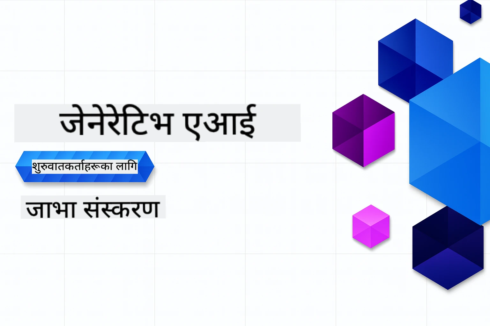

# शुरुआतीहरूको लागि जेनेरेटिभ एआई - जाभा संस्करण
[](https://discord.gg/nTYy5BXMWG)



**समय प्रतिबद्धता**: सम्पूर्ण कार्यशाला अनलाइन स्थानीय सेटअप बिना पूरा गर्न सकिन्छ। वातावरण सेटअपमा २ मिनेट लाग्छ, नमूनाहरू अन्वेषण गर्न १-३ घण्टा लाग्न सक्छ, अन्वेषण गहिराइ अनुसार।

> **छिटो सुरु गर्नुहोस्**

१. यस रिपोजिटोरीलाई तपाईंको GitHub खातामा फोर्क गर्नुहोस्  
२. क्लिक गर्नुहोस् **Code** → **Codespaces** ट्याब → **...** → **New with options...**  
३. पूर्वनिर्धारित सेटिङहरू प्रयोग गर्नुहोस् – यसले यो पाठ्यक्रमको लागि सिर्जना गरिएको विकास कन्टेनर चयन गर्नेछ  
४. क्लिक गर्नुहोस् **Create codespace**  
५. वातावरण तयार हुन ~२ मिनेट पर्खनुहोस्  
६. सिधै जानुहोस् [पहिलो उदाहरणमा](./02-SetupDevEnvironment/README.md#step-2-create-a-github-personal-access-token)

> **स्थानीय रूपमा क्लोन गर्ने रुचि छ?**  
>  
> यस रिपोजिटोरीमा ५०+ भाषा अनुवादहरू समावेश भएकाले डाउनलोड आकार धेरै हुन्छ। अनुवादबिना क्लोन गर्न sparse checkout प्रयोग गर्नुहोस्:  
> ```bash
> git clone --filter=blob:none --sparse https://github.com/microsoft/Generative-AI-for-beginners-java.git
> cd Generative-AI-for-beginners-java
> git sparse-checkout set --no-cone '/*' '!translations' '!translated_images'
> ```
> यसले तपाईंलाई पाठ्यक्रम पूरा गर्न आवश्यक सबै कुरा धेरै द्रुत डाउनलोडसँग दिनेछ।

## बहुभाषिक समर्थन

### GitHub Action मार्फत समर्थित (स्वचालित र सँधै अपडेट)

<!-- CO-OP TRANSLATOR LANGUAGES TABLE START -->
[Arabic](../ar/README.md) | [Bengali](../bn/README.md) | [Bulgarian](../bg/README.md) | [Burmese (Myanmar)](../my/README.md) | [Chinese (Simplified)](../zh-CN/README.md) | [Chinese (Traditional, Hong Kong)](../zh-HK/README.md) | [Chinese (Traditional, Macau)](../zh-MO/README.md) | [Chinese (Traditional, Taiwan)](../zh-TW/README.md) | [Croatian](../hr/README.md) | [Czech](../cs/README.md) | [Danish](../da/README.md) | [Dutch](../nl/README.md) | [Estonian](../et/README.md) | [Finnish](../fi/README.md) | [French](../fr/README.md) | [German](../de/README.md) | [Greek](../el/README.md) | [Hebrew](../he/README.md) | [Hindi](../hi/README.md) | [Hungarian](../hu/README.md) | [Indonesian](../id/README.md) | [Italian](../it/README.md) | [Japanese](../ja/README.md) | [Kannada](../kn/README.md) | [Korean](../ko/README.md) | [Lithuanian](../lt/README.md) | [Malay](../ms/README.md) | [Malayalam](../ml/README.md) | [Marathi](../mr/README.md) | [Nepali](./README.md) | [Nigerian Pidgin](../pcm/README.md) | [Norwegian](../no/README.md) | [Persian (Farsi)](../fa/README.md) | [Polish](../pl/README.md) | [Portuguese (Brazil)](../pt-BR/README.md) | [Portuguese (Portugal)](../pt-PT/README.md) | [Punjabi (Gurmukhi)](../pa/README.md) | [Romanian](../ro/README.md) | [Russian](../ru/README.md) | [Serbian (Cyrillic)](../sr/README.md) | [Slovak](../sk/README.md) | [Slovenian](../sl/README.md) | [Spanish](../es/README.md) | [Swahili](../sw/README.md) | [Swedish](../sv/README.md) | [Tagalog (Filipino)](../tl/README.md) | [Tamil](../ta/README.md) | [Telugu](../te/README.md) | [Thai](../th/README.md) | [Turkish](../tr/README.md) | [Ukrainian](../uk/README.md) | [Urdu](../ur/README.md) | [Vietnamese](../vi/README.md)

## पाठ्यक्रम संरचना र सिकाइ मार्ग

### **अध्याय १: जेनेरेटिभ एआई परिचय**
- **मूल अवधारणा**: ठूलो भाषा मोडेलहरू, टोकनहरू, एम्बेडिङहरू, र एआई क्षमताहरू बुझ्नु  
- **जाभा एआई इकोसिस्टम**: Spring AI र OpenAI SDKs को अवलोकन  
- **मोडेल कन्टेक्स्ट प्रोटोकल**: MCP परिचय र एआई एजेन्ट संवादमा यसको भूमिका  
- **व्यावहारिक अनुप्रयोगहरू**: च्याटबोटहरू र सामग्री उत्पादनका वास्तविक संसार परिदृश्य  
- **[→ अध्याय १ सुरु गर्नुहोस्](./01-IntroToGenAI/README.md)**

### **अध्याय २: विकास वातावरण सेटअप**
- **बहु-प्रदाता कन्फिगरेसन**: GitHub मोडेलहरू, Azure OpenAI, र OpenAI Java SDK समाकलन सेटअप  
- **Spring Boot + Spring AI**: उद्यम एआई एप्लिकेशन विकासका लागि उत्तम अभ्यासहरू  
- **GitHub मोडेलहरू**: प्रोटोटाइपिङ र सिकाइका लागि निःशुल्क एआई मोडेल पहुँच (क्रेडिट कार्ड आवश्यक छैन)  
- **विकास उपकरणहरू**: Docker कन्टेनरहरू, VS Code, र GitHub Codespaces कन्फिगरेसन  
- **[→ अध्याय २ सुरु गर्नुहोस्](./02-SetupDevEnvironment/README.md)**

### **अध्याय ३: मुख्य जेनेरेटिभ एआई प्रविधिहरू**
- **प्रम्प्ट इन्जिनियरिङ्**: उत्तम एआई मोडेल प्रतिक्रिया प्रविधिहरू  
- **एम्बेडिङ र भेक्टर अपरेसनहरू**: सेम्यान्टिक खोज र समानता मिलान लागू गर्नुहोस्  
- **रिट्रिभल-अग्मेन्टेड जेनेरेसन (RAG)**: एआईलाई आफ्नो डेटा स्रोतहरूसँग संयोजन गर्नुहोस्  
- **फंक्शन कलिङ्**: अनुकूल उपकरण र प्लगइनहरूसँग एआई क्षमताहरू विस्तार गर्नुहोस्  
- **[→ अध्याय ३ सुरु गर्नुहोस्](./03-CoreGenerativeAITechniques/README.md)**

### **अध्याय ४: व्यावहारिक अनुप्रयोग र परियोजनाहरू**
- **पाल्तु कथा उत्पन्नकर्ता** (`petstory/`): GitHub मोडेलहरूसँग सिर्जनात्मक सामग्री उत्पादन  
- **Foundry स्थानीय डेमो** (`foundrylocal/`): OpenAI Java SDK सँग स्थानीय एआई मोडेल एकीकरण  
- **MCP क्याल्कुलेटर सेवा** (`calculator/`): Spring AI सँग आधारभूत मोडेल कन्टेक्स्ट प्रोटोकल कार्यान्वयन  
- **[→ अध्याय ४ सुरु गर्नुहोस्](./04-PracticalSamples/README.md)**

### **अध्याय ५: जिम्मेवार एआई विकास**
- **GitHub मोडेलहरू सुरक्षा**: पूर्वनिर्धारित सामग्री फिल्टरिङ् र सुरक्षा संयन्त्रहरू (कडा ब्लक र सौम्य अस्वीकृति) परीक्षण गर्नुहोस्  
- **जिम्मेवार एआई डेमो**: आधुनिक एआई सुरक्षा प्रणालीहरू कसरी काम गर्छन् भन्ने व्यावहारिक उदाहरण  
- **श्रेष्ठ अभ्यासहरू**: नैतिक एआई विकास र कार्यान्वयनका लागि अनिवार्य दिशानिर्देशहरू  
- **[→ अध्याय ५ सुरु गर्नुहोस्](./05-ResponsibleGenAI/README.md)**

## थप स्रोतहरू

<!-- CO-OP TRANSLATOR OTHER COURSES START -->
### LangChain
[](https://aka.ms/langchain4j-for-beginners)
[](https://aka.ms/langchainjs-for-beginners?WT.mc_id=m365-94501-dwahlin)

---

### Azure / Edge / MCP / Agents
[](https://github.com/microsoft/AZD-for-beginners?WT.mc_id=academic-105485-koreyst)
[](https://github.com/microsoft/edgeai-for-beginners?WT.mc_id=academic-105485-koreyst)
[](https://github.com/microsoft/mcp-for-beginners?WT.mc_id=academic-105485-koreyst)
[](https://github.com/microsoft/ai-agents-for-beginners?WT.mc_id=academic-105485-koreyst)

---
 
### जेनेरेटिभ एआई शृंखला
[](https://github.com/microsoft/generative-ai-for-beginners?WT.mc_id=academic-105485-koreyst)
[-9333EA?style=for-the-badge&labelColor=E5E7EB&color=9333EA)](https://github.com/microsoft/Generative-AI-for-beginners-dotnet?WT.mc_id=academic-105485-koreyst)
[-C084FC?style=for-the-badge&labelColor=E5E7EB&color=C084FC)](https://github.com/microsoft/generative-ai-for-beginners-java?WT.mc_id=academic-105485-koreyst)
[-E879F9?style=for-the-badge&labelColor=E5E7EB&color=E879F9)](https://github.com/microsoft/generative-ai-with-javascript?WT.mc_id=academic-105485-koreyst)

---
 
### मुख्य सिकाइ
[](https://aka.ms/ml-beginners?WT.mc_id=academic-105485-koreyst)
[](https://aka.ms/datascience-beginners?WT.mc_id=academic-105485-koreyst)
[](https://aka.ms/ai-beginners?WT.mc_id=academic-105485-koreyst)
[](https://github.com/microsoft/Security-101?WT.mc_id=academic-96948-sayoung)
[](https://aka.ms/webdev-beginners?WT.mc_id=academic-105485-koreyst)
[](https://aka.ms/iot-beginners?WT.mc_id=academic-105485-koreyst)
[](https://github.com/microsoft/xr-development-for-beginners?WT.mc_id=academic-105485-koreyst)

---
 
### कोपाइलट सिरिज
[](https://aka.ms/GitHubCopilotAI?WT.mc_id=academic-105485-koreyst)
[](https://github.com/microsoft/mastering-github-copilot-for-dotnet-csharp-developers?WT.mc_id=academic-105485-koreyst)
[](https://github.com/microsoft/CopilotAdventures?WT.mc_id=academic-105485-koreyst)
<!-- CO-OP TRANSLATOR OTHER COURSES END -->

## सघाउ पाउने

यदि तपाईं अड्किनुभयो वा एआई एपहरू निर्माण गर्दा कुनै प्रश्नहरू छन् भने। MCP सम्बन्धि छलफलमा सहभागी हुनुहोस् जहाँ सिक्नेहरू र अनुभवी विकासकर्ताहरू छन्। यो एक सहयोगी समुदाय हो जहाँ प्रश्नहरू स्वागतयोग्य छन् र ज्ञान स्वतन्त्र रूपमा साझा गरिन्छ।

[](https://discord.gg/nTYy5BXMWG)

यदि तपाईंको उत्पादनमा फिडब्याक वा निर्माण गर्दा त्रुटिहरू छन् भने तलको ठेगानामा जानुहोस्:

[](https://aka.ms/foundry/forum)

---

<!-- CO-OP TRANSLATOR DISCLAIMER START -->
**अस्वीकरण**:
यस दस्तावेजलाई AI अनुवाद सेवा [Co-op Translator](https://github.com/Azure/co-op-translator) प्रयोग गरी अनुवाद गरिएको हो। हामी सटीकताको प्रयास गर्छौं भने पनि, कृपया ध्यान दिनुहोस् कि स्वचालित अनुवादमा त्रुटि वा अशुद्धता हुन सक्दछ। मूल भाषामा रहेको दस्तावेजलाई आधिकारिक स्रोतको रूपमा मानिनु पर्छ। महत्वपूर्ण जानकारीका लागि व्यावसायिक मानव अनुवाद सिफारिस गरिन्छ। यस अनुवादको प्रयोगबाट उत्पन्न कुनै पनि गलतफहमी वा गलत व्याख्यामा हामी जिम्मेवार हुनेछैनौं।
<!-- CO-OP TRANSLATOR DISCLAIMER END -->